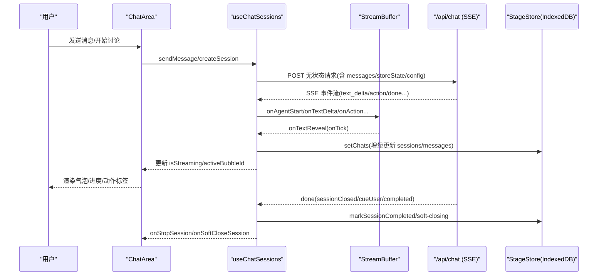
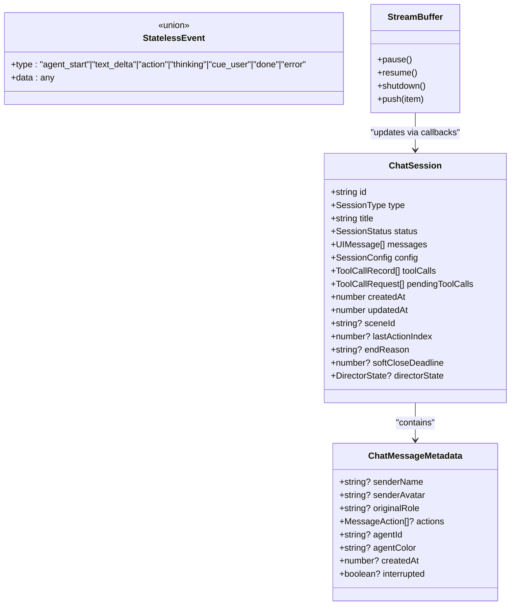
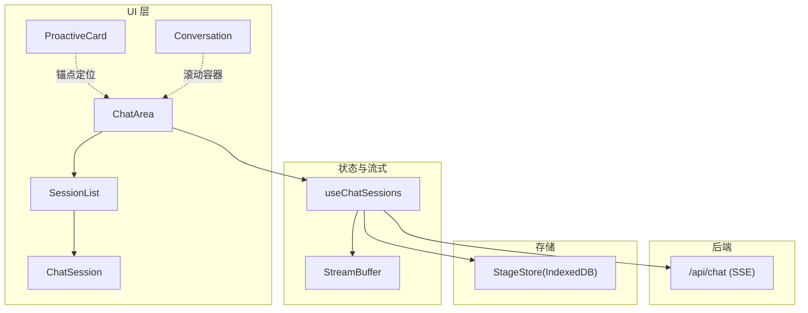
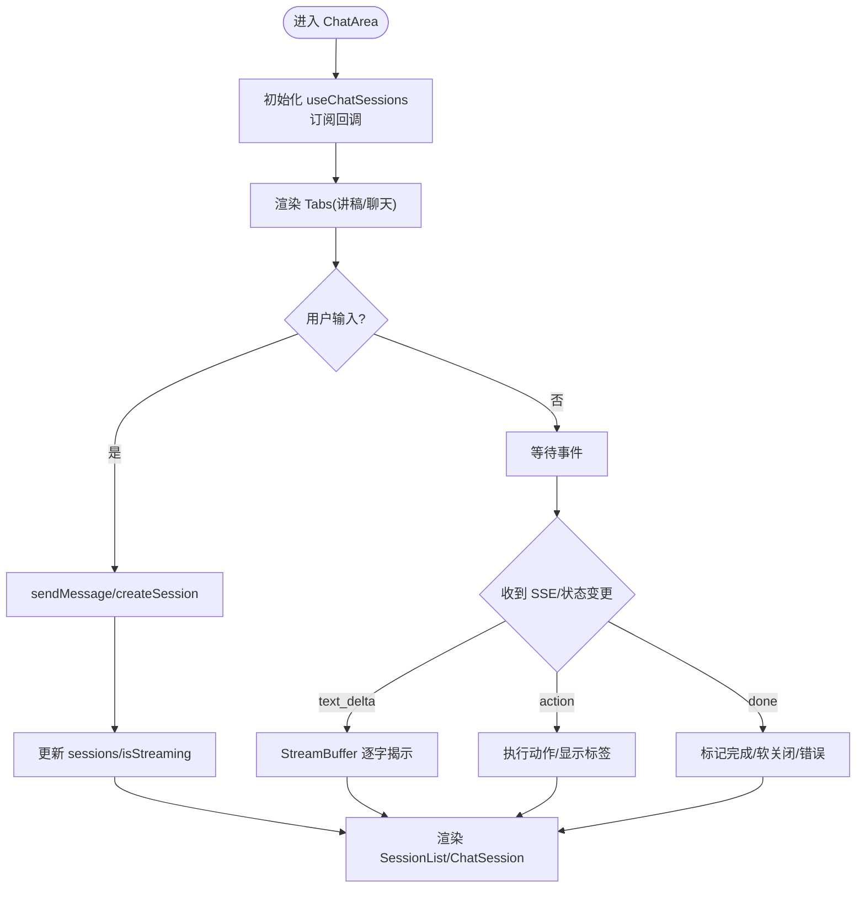
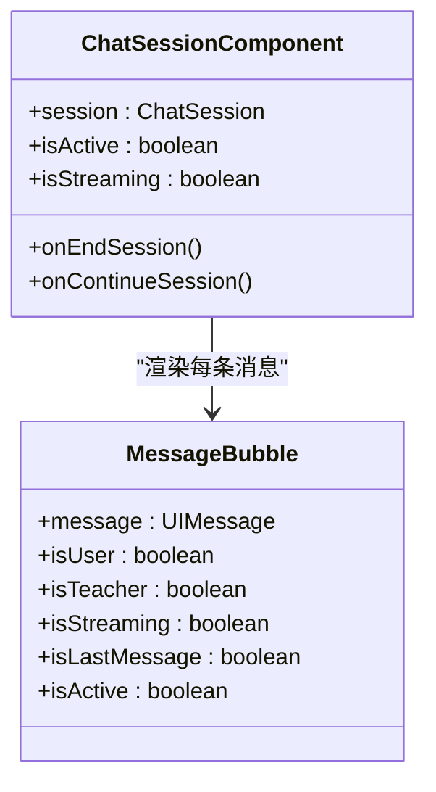
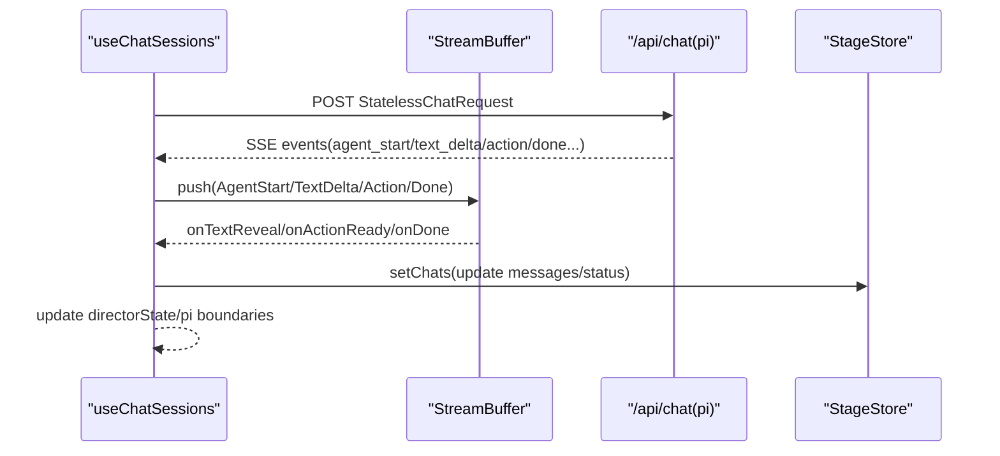
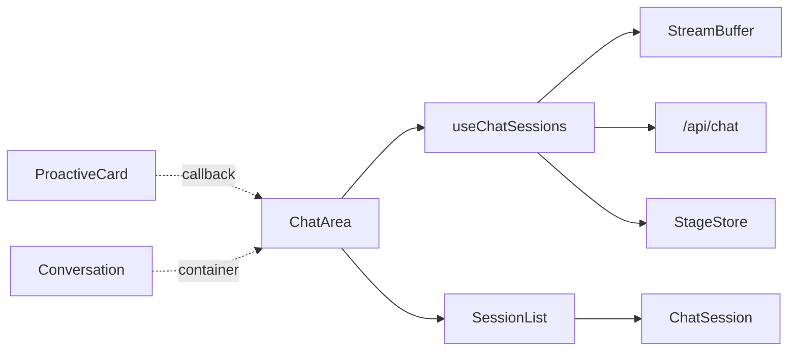

# 聊天对话组件

<cite>
**本文引用的文件**   
- [components/chat/chat-area.tsx](file://components/chat/chat-area.tsx)
- [components/chat/chat-session.tsx](file://components/chat/chat-session.tsx)
- [components/chat/session-list.tsx](file://components/chat/session-list.tsx)
- [components/chat/proactive-card.tsx](file://components/chat/proactive-card.tsx)
- [components/ai-elements/conversation.tsx](file://components/ai-elements/conversation.tsx)
- [components/chat/use-chat-sessions.ts](file://components/chat/use-chat-sessions.ts)
- [lib/types/chat.ts](file://lib/types/chat.ts)
- [app/api/chat/route.ts](file://app/api/chat/route.ts)
- [lib/buffer/stream-buffer.ts](file://lib/buffer/stream-buffer.ts)
</cite>

## 产品概述
本组件套件为 OpenMAIC 的课堂 AI 互动提供“聊天对话”能力，覆盖三类会话：问答（qa）、讨论（discussion）、讲稿（lecture）。核心目标包括：
- 在 ChatArea 中统一展示消息与输入、控制会话生命周期、支持软关闭与暂停/恢复。
- 通过 useChatSessions 管理多会话状态、SSE 流式事件、消息持久化到 Stage Store（IndexedDB）。
- SessionList 负责会话列表的展开/折叠、状态徽章与操作入口。
- ProactiveCard 用于主动推荐讨论卡片的悬浮提示、倒计时自动跳过与播放控制。
- Conversation 提供通用滚动到底的容器与空态/滚动按钮等基础 UI。
- SSE 流式传输由后端 /api/chat 路由驱动，前端使用 StreamBuffer 做统一的逐字呈现与动作时序控制。
- 与 AI 编排层通过无状态请求模板（messages + storeState + config）集成，数据同步由客户端维护 DirectorState 并随每轮请求回传。

## 核心业务流程
下图展示了从用户输入到消息渲染、再到会话结束的关键链路。

**图表来源** 
- [components/chat/chat-area.tsx:86-230](file://components/chat/chat-area.tsx#L86-L230)
- [components/chat/use-chat-sessions.ts:418-574](file://components/chat/use-chat-sessions.ts#L418-L574)
- [lib/buffer/stream-buffer.ts:169-200](file://lib/buffer/stream-buffer.ts#L169-L200)
- [app/api/chat/route.ts:44-130](file://app/api/chat/route.ts#L44-L130)

**章节来源**
- [components/chat/chat-area.tsx:86-230](file://components/chat/chat-area.tsx#L86-L230)
- [components/chat/use-chat-sessions.ts:418-574](file://components/chat/use-chat-sessions.ts#L418-L574)
- [lib/buffer/stream-buffer.ts:169-200](file://lib/buffer/stream-buffer.ts#L169-L200)
- [app/api/chat/route.ts:44-130](file://app/api/chat/route.ts#L44-L130)

## 功能模块清单
- ChatArea 聊天区域
  - 职责：Tab 切换（讲稿/聊天）、会话创建/结束、软关闭处理、流式状态透传、拖拽宽度、活跃气泡定位。
  - 验收要点：能创建/停止/继续软关闭会话；流式时正确显示活跃气泡与进度；讲稿页与聊天页数据隔离。
- ChatSession 会话消息渲染
  - 职责：按角色渲染头像/名称、文本逐字、动作标签、结束指示器、自动滚动与活跃气泡高亮。
  - 验收要点：新消息到达自动滚动到底；流式末尾带脉冲点；中断时有红色标记。
- SessionList 会话列表
  - 职责：会话卡片展开/折叠、状态徽章、消息计数、结束/继续按钮。
  - 验收要点：不同 sessionType 的 badge 颜色区分；active/soft-closing 有呼吸灯效果。
- ProactiveCard 主动推荐卡片
  - 职责：基于锚点元素计算位置、倒计时自动跳过、暂停/继续、跳转参与讨论。
  - 验收要点：窗口变化/侧栏收起后仍保持对齐；倒计时归零触发 onSkip。
- Conversation 通用对话容器
  - 职责：StickToBottom 容器、空态占位、滚动到底按钮。
  - 验收要点：内容增长时平滑滚动到底；非底部时显示回到顶部按钮。
- useChatSessions 会话状态与流式引擎
  - 职责：SSE 消费、StreamBuffer 调度、会话状态机（idle/active/soft-closing/interrupted/completed/error）、持久化、错误处理、软关闭计时。
  - 验收要点：断线/错误时置 error 并写入系统消息；软关闭 15s 超时自动完成；跨 stage 切换重置状态。

**章节来源**
- [components/chat/chat-area.tsx:86-373](file://components/chat/chat-area.tsx#L86-L373)
- [components/chat/chat-session.tsx:159-388](file://components/chat/chat-session.tsx#L159-L388)
- [components/chat/session-list.tsx:46-148](file://components/chat/session-list.tsx#L46-L148)
- [components/chat/proactive-card.tsx:38-250](file://components/chat/proactive-card.tsx#L38-L250)
- [components/ai-elements/conversation.tsx:12-88](file://components/ai-elements/conversation.tsx#L12-L88)
- [components/chat/use-chat-sessions.ts:418-800](file://components/chat/use-chat-sessions.ts#L418-L800)

## 数据与状态
- 核心数据模型
  - ChatSession：包含 id/type/title/status/messages/config/toolCalls/pendingToolCalls/createdAt/updatedAt/sceneId/lastActionIndex/endReason/softCloseDeadline/directorState。
  - ChatMessageMetadata：senderName/senderAvatar/originalRole/actions/agentId/agentColor/createdAt/interrupted。
  - StatelessEvent：agent_start/text_delta/action/thinking/cue_user/done/error。
  - LectureNoteItem/LectureNoteEntry：讲稿条目与页面结构。
- 关键状态流转
  - 会话状态：idle → active → soft-closing → completed；异常路径：active → interrupted → completed；错误路径：error。
  - 软关闭：服务端语义关闭进入 soft-closing，客户端 15s 内可继续或超时完成。
  - 流式状态：isStreaming 标志、activeBubbleId 指向当前正在揭示的气泡。
- 数据所有权边界
  - 会话数据位于 StageStore（IndexedDB），useChatSessions 读写并通过 setChats 同步。
  - 流式事件由 useChatSessions 消费，经 StreamBuffer 统一节奏后更新 React 状态。
  - 讲稿由 scenes 构建，独立于聊天会话。

**图表来源** 
- [lib/types/chat.ts:49-117](file://lib/types/chat.ts#L49-L117)
- [lib/types/chat.ts:290-449](file://lib/types/chat.ts#L290-L449)
- [lib/buffer/stream-buffer.ts:169-200](file://lib/buffer/stream-buffer.ts#L169-L200)

**章节来源**
- [lib/types/chat.ts:49-117](file://lib/types/chat.ts#L49-L117)
- [lib/types/chat.ts:290-449](file://lib/types/chat.ts#L290-L449)
- [components/chat/use-chat-sessions.ts:418-574](file://components/chat/use-chat-sessions.ts#L418-L574)

## 关键约束与边界
- 非功能性需求
  - SSE 心跳：后端每 15s 发送注释心跳，避免代理/浏览器空闲断开。
  - 最大响应时长：路由允许 60s 流式响应。
  - 流式节奏：默认 30ms/tick、每次 1 字符，保证阅读体验与性能平衡。
- 依赖与集成边界
  - 无状态 API：每次请求携带完整 messages/storeState/config，客户端维护 DirectorState。
  - 持久化：StageStore 的 chats 字段持久化，stage 切换时重新加载并规范化状态。
  - 软关闭：仅对 qa/discussion 生效，15s 超时自动完成；可通过 continue 恢复。
- 业务约束
  - lecture 类型不参与软关闭；其文本节奏由 PlaybackEngine 控制。
  - 错误时插入系统消息并清空活跃气泡，必要时通知上层清理资源。
  - 讲稿页与聊天页数据隔离，lecture 会话不在聊天 Tab 显示。

**章节来源**
- [app/api/chat/route.ts:25-65](file://app/api/chat/route.ts#L25-L65)
- [components/chat/use-chat-sessions.ts:529-574](file://components/chat/use-chat-sessions.ts#L529-L574)
- [components/chat/use-chat-sessions.ts:663-718](file://components/chat/use-chat-sessions.ts#L663-L718)
- [lib/buffer/stream-buffer.ts:149-165](file://lib/buffer/stream-buffer.ts#L149-L165)

## 架构总览

**图表来源** 
- [components/chat/chat-area.tsx:86-230](file://components/chat/chat-area.tsx#L86-L230)
- [components/chat/session-list.tsx:46-148](file://components/chat/session-list.tsx#L46-L148)
- [components/chat/chat-session.tsx:159-388](file://components/chat/chat-session.tsx#L159-L388)
- [components/chat/proactive-card.tsx:38-250](file://components/chat/proactive-card.tsx#L38-L250)
- [components/ai-elements/conversation.tsx:12-88](file://components/ai-elements/conversation.tsx#L12-L88)
- [components/chat/use-chat-sessions.ts:418-574](file://components/chat/use-chat-sessions.ts#L418-L574)
- [lib/buffer/stream-buffer.ts:169-200](file://lib/buffer/stream-buffer.ts#L169-L200)
- [app/api/chat/route.ts:44-130](file://app/api/chat/route.ts#L44-L130)

## 详细组件分析

### ChatArea 聊天区域
- 消息展示与输入处理
  - 通过 Tabs 切换“讲稿/聊天”，过滤 lecture 会话至 Notes 页。
  - 暴露 ref 方法：createSession/endSession/sendMessage/startDiscussion/startLecture/addLectureMessage 等。
  - 将 isStreaming/activeBubbleId 等状态透传给子组件，驱动气泡高亮与滚动。
- 软关闭与停止
  - 对 QA/Discussion 的软关闭进行确认与延续，调用父级 onStopSession 清理引擎。
- 宽度拖拽与折叠
  - 支持左右拖拽调整宽度，最小/最大限制，折叠隐藏。

**图表来源** 
- [components/chat/chat-area.tsx:86-230](file://components/chat/chat-area.tsx#L86-L230)
- [components/chat/use-chat-sessions.ts:814-978](file://components/chat/use-chat-sessions.ts#L814-L978)

**章节来源**
- [components/chat/chat-area.tsx:86-230](file://components/chat/chat-area.tsx#L86-L230)
- [components/chat/chat-area.tsx:232-262](file://components/chat/chat-area.tsx#L232-L262)

### ChatSession 会话消息渲染
- 气泡渲染
  - 根据 metadata.originalRole 区分 user/teacher/agent，头像与名称取自用户配置或注册表。
  - 流式最后一条消息末尾显示脉冲点；被中断的消息末尾显示红点。
- 自动滚动与活跃气泡
  - 新消息到达 smooth scroll 到底；rAF 节流即时滚动；activeBubbleId 变化时滚动到对应气泡。
- 会话控制
  - 对 discussion/qa 显示结束按钮；soft-closing 显示“继续”按钮与倒计时。

**图表来源** 
- [components/chat/chat-session.tsx:46-157](file://components/chat/chat-session.tsx#L46-L157)
- [components/chat/chat-session.tsx:159-388](file://components/chat/chat-session.tsx#L159-L388)

**章节来源**
- [components/chat/chat-session.tsx:159-388](file://components/chat/chat-session.tsx#L159-L388)

### SessionList 会话列表
- 列表项
  - 根据 type 显示不同 badge 颜色；status 图标表示 idle/active/soft-closing/interrupted/completed/error。
  - 展开/折叠动画，内部渲染 ChatSessionComponent。
- 交互
  - 点击头部展开/折叠；结束/继续按钮委托给父级处理。

**章节来源**
- [components/chat/session-list.tsx:46-148](file://components/chat/session-list.tsx#L46-L148)

### ProactiveCard 主动推荐卡片
- 定位与对齐
  - 基于 anchorRef 计算 left/bottom/tailOffset，始终保持在视口内。
  - 使用 requestAnimationFrame 持续跟踪位置变化。
- 行为
  - playback 模式倒计时自动跳过；支持暂停/继续；点击“加入”触发 onListen。
  - 通过 Portal 渲染到 body 或全屏容器，避免 z-index/overflow 影响。

**章节来源**
- [components/chat/proactive-card.tsx:38-250](file://components/chat/proactive-card.tsx#L38-L250)

### Conversation 对话容器
- 使用 StickToBottom 实现内容增长时的平滑滚动到底。
- 提供空态占位与“回到最底部”按钮。

**章节来源**
- [components/ai-elements/conversation.tsx:12-88](file://components/ai-elements/conversation.tsx#L12-L88)

### useChatSessions 会话状态与流式引擎
- SSE 消费与 StreamBuffer 调度
  - 创建 StreamBuffer 实例，按 tick 逐字揭示文本，延迟动作执行，统一 onLiveSpeech/onThinking/onCueUser 回调。
  - 将 text_delta 合并到 UIMessage.parts，action 转为 action-xxx 部分并在 UI 渲染为 InlineActionTag。
- 会话状态机与持久化
  - 创建/结束/软关闭/错误状态转换，更新 updatedAt 冲突时钟，写回 StageStore。
  - stage 切换时重新加载 chats 并规范化状态。
- 错误处理与软关闭
  - 错误时插入系统消息、清空活跃气泡、通知上层清理；软关闭 15s 超时自动完成并可继续。
- 与 AI 编排层集成
  - 构造 StatelessChatRequest（messages/storeState/config/directorState/piSessionBoundary），POST 到 /api/chat/pi 或 /api/chat。
  - 解析 StatelessEvent，累积 DirectorState 并随下一轮请求回传。

**图表来源** 
- [components/chat/use-chat-sessions.ts:814-978](file://components/chat/use-chat-sessions.ts#L814-L978)
- [components/chat/use-chat-sessions.ts:327-416](file://components/chat/use-chat-sessions.ts#L327-L416)
- [lib/types/chat.ts:309-391](file://lib/types/chat.ts#L309-L391)

**章节来源**
- [components/chat/use-chat-sessions.ts:418-800](file://components/chat/use-chat-sessions.ts#L418-L800)
- [components/chat/use-chat-sessions.ts:814-978](file://components/chat/use-chat-sessions.ts#L814-L978)
- [components/chat/use-chat-sessions.ts:327-416](file://components/chat/use-chat-sessions.ts#L327-L416)
- [lib/types/chat.ts:309-391](file://lib/types/chat.ts#L309-L391)

## 依赖分析
- 组件耦合关系
  - ChatArea 依赖 useChatSessions 提供的会话方法与状态；SessionList/ChatSession 依赖 ChatSession 数据结构。
  - ProactiveCard 与 ChatArea 解耦，通过 props 回调通信。
  - Conversation 作为通用容器，不直接依赖会话逻辑。
- 外部依赖
  - StreamBuffer 提供统一节奏控制；StageStore 提供持久化；AI 编排通过无状态 API 集成。
- 潜在循环依赖
  - 组件间通过 props/callbacks 单向传递，避免循环引用。

**图表来源** 
- [components/chat/chat-area.tsx:86-230](file://components/chat/chat-area.tsx#L86-L230)
- [components/chat/session-list.tsx:46-148](file://components/chat/session-list.tsx#L46-L148)
- [components/chat/chat-session.tsx:159-388](file://components/chat/chat-session.tsx#L159-L388)
- [components/chat/use-chat-sessions.ts:418-574](file://components/chat/use-chat-sessions.ts#L418-L574)
- [lib/buffer/stream-buffer.ts:169-200](file://lib/buffer/stream-buffer.ts#L169-L200)
- [app/api/chat/route.ts:44-130](file://app/api/chat/route.ts#L44-L130)

**章节来源**
- [components/chat/chat-area.tsx:86-230](file://components/chat/chat-area.tsx#L86-L230)
- [components/chat/use-chat-sessions.ts:418-574](file://components/chat/use-chat-sessions.ts#L418-L574)

## 性能考虑
- 流式渲染优化
  - StreamBuffer 固定 tickMs/charsPerTick，避免频繁重排；postTextDelayMs/actionDelayMs 控制节奏。
  - rAF 节流滚动，减少布局抖动。
- 内存与资源管理
  - 每个会话一个 StreamBuffer，组件卸载时 shutdown 并清理定时器与 AbortController。
  - 软关闭注册表与生命周期 Map 在 stage 切换时清理。
- 网络与连接
  - 后端心跳防止空闲断开；AbortController 取消未完成的请求。
- 渲染性能
  - ChatSession 使用 memo 包裹 MessageBubble，减少不必要重渲染。
  - 讲稿页与聊天页数据隔离，避免无关重绘。

[本节为通用指导，不直接分析具体文件]

## 故障排查指南
- 常见问题
  - 流式中断：检查 AbortController 是否被提前中止；查看 onError 回调与系统消息。
  - 软关闭未超时：确认 visibilitychange 事件与定时器清理；检查 token 一致性。
  - 滚动异常：确认 isAtBottomRef 与 rAF 刷新；检查容器高度变化。
  - 讲稿与聊天错位：确保 lecture 会话不在聊天 Tab 显示；currentSceneId 同步。
- 调试建议
  - 打印 StatelessEvent 序列，验证 agent_start/text_delta/action/done 顺序。
  - 观察 StageStore.chats 的 updatedAt 冲突时钟是否单调递增。
  - 使用浏览器开发者工具监控 SSE 连接与心跳。

**章节来源**
- [components/chat/use-chat-sessions.ts:724-782](file://components/chat/use-chat-sessions.ts#L724-L782)
- [components/chat/use-chat-sessions.ts:706-718](file://components/chat/use-chat-sessions.ts#L706-L718)
- [components/chat/chat-session.tsx:189-218](file://components/chat/chat-session.tsx#L189-L218)

## 结论
本聊天对话组件以 useChatSessions 为核心，结合 StreamBuffer 的统一节奏控制，实现了稳定、流畅的多会话流式交互。通过无状态 API 与 StageStore 持久化，既保证了可扩展性又确保了数据一致性。配合 ProactiveCard 与 Conversation，提供了完整的课堂 AI 互动体验。建议在后续迭代中进一步优化大段文本渲染与复杂动作的执行反馈，同时增强错误恢复与重试机制。