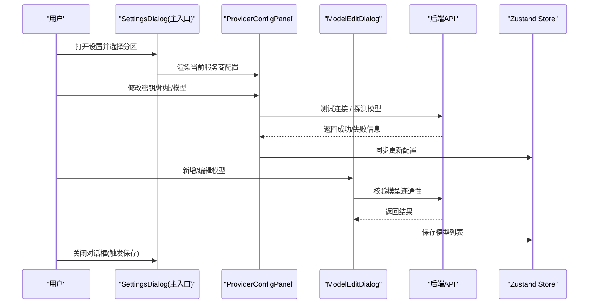
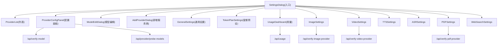
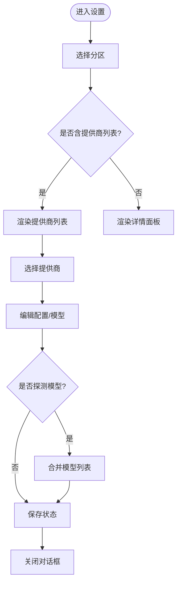
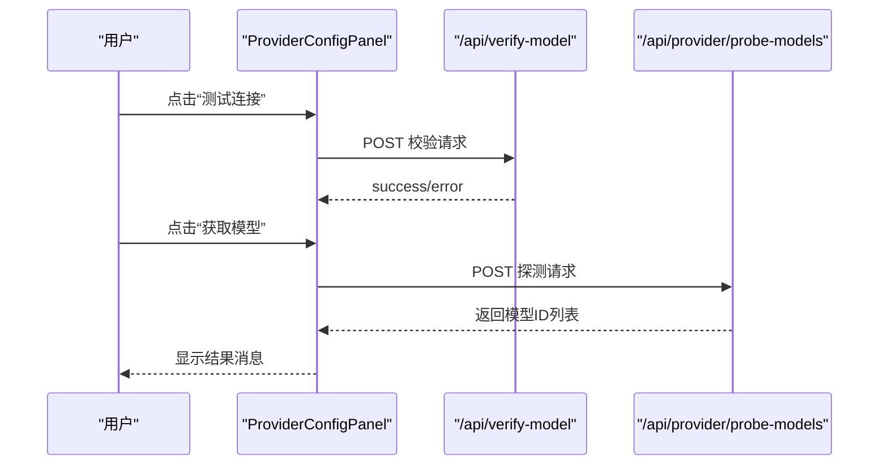
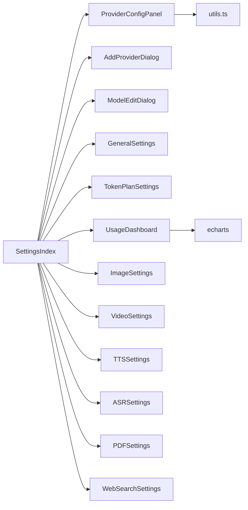

# 设置管理组件

<cite>
**本文引用的文件**   
- [components/settings/index.tsx](file://components/settings/index.tsx)
- [components/settings/general-settings.tsx](file://components/settings/general-settings.tsx)
- [components/settings/provider-config-panel.tsx](file://components/settings/provider-config-panel.tsx)
- [components/settings/add-provider-dialog.tsx](file://components/settings/add-provider-dialog.tsx)
- [components/settings/model-edit-dialog.tsx](file://components/settings/model-edit-dialog.tsx)
- [components/settings/utils.ts](file://components/settings/utils.ts)
- [components/settings/provider-list.tsx](file://components/settings/provider-list.tsx)
- [components/settings/token-plan-settings.tsx](file://components/settings/token-plan-settings.tsx)
- [components/settings/usage-dashboard.tsx](file://components/settings/usage-dashboard.tsx)
- [components/settings/image-settings.tsx](file://components/settings/image-settings.tsx)
- [components/settings/video-settings.tsx](file://components/settings/video-settings.tsx)
- [components/settings/tts-settings.tsx](file://components/settings/tts-settings.tsx)
- [components/settings/asr-settings.tsx](file://components/settings/asr-settings.tsx)
- [components/settings/pdf-settings.tsx](file://components/settings/pdf-settings.tsx)
- [components/settings/web-search-settings.tsx](file://components/settings/web-search-settings.tsx)
</cite>

## 产品概述
本组件为 OpenMAIC 的“设置”管理中心，提供统一的入口与多模块配置界面，涵盖通用设置、服务商（LLM/图像/视频/TTS/ASR/PDF/网页搜索）配置、模型编辑、用量统计与套餐预设应用等。通过集中式状态管理与后端 API 校验，实现配置的可视化、可验证与持久化。

## 核心业务流程
- 打开设置对话框：根据传入的初始分区自动定位到对应页面（如 providers、image、video、tts、asr、pdf、web-search、general、token-plan）。
- 选择并配置服务商：在左侧导航与中间列表中选择具体服务商，右侧面板编辑密钥、基础地址、是否需 API Key、模型目录等。
- 模型管理：支持新增、编辑、删除模型；支持从远端探测模型并合并到本地列表；内置能力推断与上下文窗口格式化。
- 连接性测试：对 LLM、图像、视频、PDF、TTS、ASR、网页搜索等分别调用后端校验接口，即时反馈结果。
- 数据持久化：所有变更通过 Zustand store 写入，并在关闭或失焦时触发保存；通用设置支持一键清理缓存并刷新页面。
- 套餐预设：在“令牌计划”页按类别选择预设，输入 API Key 后一键应用到各模态配置。



**图表来源** 
- [components/settings/index.tsx:220-800](file://components/settings/index.tsx#L220-L800)
- [components/settings/provider-config-panel.tsx:121-203](file://components/settings/provider-config-panel.tsx#L121-L203)
- [components/settings/model-edit-dialog.tsx:64-101](file://components/settings/model-edit-dialog.tsx#L64-L101)

**章节来源**
- [components/settings/index.tsx:220-800](file://components/settings/index.tsx#L220-L800)
- [components/settings/provider-config-panel.tsx:121-203](file://components/settings/provider-config-panel.tsx#L121-L203)
- [components/settings/model-edit-dialog.tsx:64-101](file://components/settings/model-edit-dialog.tsx#L64-L101)

## 功能模块清单
- SettingsIndex（设置主入口）
  - 职责：统一入口、分区导航、列宽拖拽、提供商列表与详情面板编排、弹窗控制（添加服务商、模型编辑）、保存状态提示。
  - 验收要点：分区切换流畅；列宽可调整；新增/删除/重置服务商行为正确；模型探测与合并逻辑无误；关闭即保存。
- GeneralSettings（通用设置）
  - 职责：展示用量仪表盘；危险区一键清理缓存（IndexedDB、localStorage、sessionStorage），二次确认并刷新页面。
  - 验收要点：清理前需输入确认短语；清理成功后页面重载；错误有日志与提示。
- ProviderConfigPanel（服务商配置面板）
  - 职责：编辑 apiKey/baseUrl/requiresApiKey；显示替代 base URL；探测模型并合并；重置为默认；服务端托管标记与只读模式。
  - 验收要点：未托管时可编辑；托管时隐藏编辑项；测试连接与探测模型均有明确反馈；模型锁定状态下禁止增删改。
- AddProviderDialog（添加服务商对话框）
  - 职责：表单收集名称、类型（openai/anthropic/google）、默认 baseUrl、图标、是否需要 API Key；提交后生成自定义服务商。
  - 验收要点：字段校验；关闭时重置表单；创建后自动选中新服务商。
- ModelEditDialog（模型编辑对话框）
  - 职责：编辑 modelId/name/capabilities/contextWindow/outputWindow；支持失焦自动保存；在线测试模型连通性。
  - 验收要点：modelId 必填；ID 变化时联动 name；能力勾选即时生效；测试失败给出原因。
- TokenPlanSettings（令牌计划/套餐预设）
  - 职责：按分类浏览预设；输入 LLM 的 API Key 后应用至各模态；展示预设提供的模型清单（只读）。
  - 验收要点：应用为同步操作；开关启用/禁用预设；已启用显示标识。
- UsageDashboard（用量仪表盘）
  - 职责：拉取 /api/usage 并按日/模态/模型聚合展示；ECharts 绘制趋势图；主题适配。
  - 验收要点：加载态与空态处理；图表随窗口自适应；单位与标签国际化。
- 其他专项设置
  - ImageSettings/VideoSettings：独立 provider 配置、自定义模型 CRUD、连通性测试。
  - TTSSettings/ASRSettings：语音合成/识别 provider 配置、预览/录音测试、特殊 provider 选项（如 VoxCPM、Doubao 复合 key）。
  - PDFSettings：云/自托管/AliDocMind 差异化配置与测试。
  - WebSearchSettings：可选 API Key、Base URL、请求 URL 预览、百度子源开关。

**章节来源**
- [components/settings/index.tsx:220-800](file://components/settings/index.tsx#L220-L800)
- [components/settings/general-settings.tsx:25-186](file://components/settings/general-settings.tsx#L25-L186)
- [components/settings/provider-config-panel.tsx:60-549](file://components/settings/provider-config-panel.tsx#L60-L549)
- [components/settings/add-provider-dialog.tsx:29-152](file://components/settings/add-provider-dialog.tsx#L29-L152)
- [components/settings/model-edit-dialog.tsx:31-359](file://components/settings/model-edit-dialog.tsx#L31-L359)
- [components/settings/token-plan-settings.tsx:65-333](file://components/settings/token-plan-settings.tsx#L65-L333)
- [components/settings/usage-dashboard.tsx:58-264](file://components/settings/usage-dashboard.tsx#L58-L264)
- [components/settings/image-settings.tsx:35-200](file://components/settings/image-settings.tsx#L35-L200)
- [components/settings/video-settings.tsx:29-200](file://components/settings/video-settings.tsx#L29-L200)
- [components/settings/tts-settings.tsx:78-200](file://components/settings/tts-settings.tsx#L78-L200)
- [components/settings/asr-settings.tsx:41-200](file://components/settings/asr-settings.tsx#L41-L200)
- [components/settings/pdf-settings.tsx:35-200](file://components/settings/pdf-settings.tsx#L35-L200)
- [components/settings/web-search-settings.tsx:17-194](file://components/settings/web-search-settings.tsx#L17-L194)

## 数据与状态
- 状态管理
  - 使用 Zustand store 维护各模态的 provider 配置与选中项（providersConfig、imageProvidersConfig、videoProvidersConfig、ttsProvidersConfig、asrProvidersConfig、pdfProvidersConfig、webSearchProvidersConfig 等）。
  - 设置主入口通过 store 订阅并驱动 UI 选择与渲染。
- 关键数据结构
  - ProviderConfig：包含 id、name、type、defaultBaseUrl、baseUrlPlaceholder、alternateBaseUrls、supportsModelDiscovery、icon、requiresApiKey、models、isServerConfigured 等。
  - ModelInfo：id、name、capabilities（streaming/tools/vision/thinking）、contextWindow、outputWindow、source（catalog/probed/manual）。
  - EditingModel：providerId、modelIndex、model（ModelInfo）。
- 数据流
  - 用户输入 → 组件局部状态 → 回调更新 store → 相关面板响应式更新。
  - 模型探测：前端调用 /api/provider/probe-models，返回模型 ID 列表，合并入 models（去重保留 catalog/manual）。
  - 连接性测试：调用 /api/verify-model、/api/verify-image-provider、/api/verify-video-provider、/api/verify-pdf-provider 等，返回 success/error。
- 持久化
  - 失焦/关闭时触发保存（onBlur/onOpenChange），store 负责落盘（IndexedDB/localStorage 由工具函数与存储层处理）。
  - 通用设置支持清空 IndexedDB、localStorage、sessionStorage 并刷新页面。

```mermaid
classDiagram
class ProviderConfig {
+string id
+string name
+string type
+string defaultBaseUrl
+string baseUrlPlaceholder
+{url,label}[] alternateBaseUrls
+boolean supportsModelDiscovery
+string icon
+boolean requiresApiKey
+ModelInfo[] models
+boolean isServerConfigured
}
class ModelInfo {
+string id
+string name
+Capabilities capabilities
+number contextWindow
+number outputWindow
+string source
}
class EditingModel {
+string providerId
+number|null modelIndex
+ModelInfo model
}
class SettingsStore {
+setProviderConfig()
+setProvidersConfig()
+addCustomTTSProvider()
+addCustomASRProvider()
+setImageProviderConfig()
+setVideoProviderConfig()
+setTTSProviderConfig()
+setASRProviderConfig()
+setPDFProviderConfig()
+setWebSearchProviderConfig()
}
ProviderConfig --> ModelInfo : "包含"
EditingModel --> ModelInfo : "编辑"
SettingsStore --> ProviderConfig : "读写"
```

**图表来源** 
- [components/settings/provider-config-panel.tsx:41-58](file://components/settings/provider-config-panel.tsx#L41-L58)
- [components/settings/model-edit-dialog.tsx:16-29](file://components/settings/model-edit-dialog.tsx#L16-L29)
- [components/settings/index.tsx:240-276](file://components/settings/index.tsx#L240-L276)

**章节来源**
- [components/settings/index.tsx:240-276](file://components/settings/index.tsx#L240-L276)
- [components/settings/utils.ts:18-30](file://components/settings/utils.ts#L18-L30)
- [components/settings/utils.ts:71-86](file://components/settings/utils.ts#L71-L86)

## 关键约束与边界
- 服务端托管与只读
  - 当 provider.isServerConfigured 为真时，客户端隐藏密钥与地址编辑项，仅展示只读信息与测试结果。
  - 当 serverModels 存在时，模型目录被锁定，禁止增删改。
- 模型探测与合并策略
  - 探测到的模型以 source='probed' 合并，重复 ID 不重复添加；重新探测会替换旧的 probed 集合，保留 catalog/manual。
  - 内置 thinking 能力通过 catalog 覆盖，避免误隐能力开关。
- 连接性测试
  - 不同模态使用不同的校验接口与头部参数；失败时给出友好文案与错误来源。
- 数据一致性
  - 删除服务商后，若当前选中的是已删除项，则回退到可用项或默认值，保证可用性。
- 扩展点
  - 新增自定义 TTS/ASR 提供商：通过 addCustomTTSProvider/addCustomASRProvider 注入配置。
  - 新增自定义 LLM 提供商：通过 AddProviderDialog 创建并写入 providersConfig。
  - 新增专用设置页：参照 image/video/tts/asr/pdf/web-search 的模式接入 store 与校验接口。
- 导入导出
  - 仓库中未发现独立的设置导入/导出组件；如需实现，可在通用设置或设置主入口增加“导出/导入 JSON”按钮，读取/写入 store 快照并通过浏览器下载/上传。

**章节来源**
- [components/settings/provider-config-panel.tsx:204-210](file://components/settings/provider-config-panel.tsx#L204-L210)
- [components/settings/index.tsx:419-438](file://components/settings/index.tsx#L419-L438)
- [components/settings/index.tsx:510-535](file://components/settings/index.tsx#L510-L535)
- [components/settings/general-settings.tsx:36-58](file://components/settings/general-settings.tsx#L36-L58)

## 架构总览


**图表来源** 
- [components/settings/index.tsx:220-800](file://components/settings/index.tsx#L220-L800)
- [components/settings/provider-config-panel.tsx:121-203](file://components/settings/provider-config-panel.tsx#L121-L203)
- [components/settings/usage-dashboard.tsx:67-78](file://components/settings/usage-dashboard.tsx#L67-L78)

## 详细组件分析

### SettingsIndex（设置主入口）
- 导航与组织
  - 左侧导航栏支持 token-plan、providers、image、video、tts、asr、pdf、web-search、general 等分区。
  - 中间列展示各分区对应的提供商列表（含图标、名称、服务端托管标记）。
  - 右侧区域渲染对应配置面板或详情页。
- 交互与状态
  - 列宽可拖拽调整；打开时根据 initialSection 初始化分区。
  - 新增/删除/重置服务商；模型编辑与自动保存；探测模型并合并。
  - 关闭对话框即保存；保存状态短暂提示。
- 关键点
  - handleModelsFetched：去重合并 probed 模型，保留 catalog/manual。
  - handleAutoSaveModel：失焦自动保存新增/编辑的模型。
  - handleDeleteProvider：删除后智能回退选中项。



**图表来源** 
- [components/settings/index.tsx:247-262](file://components/settings/index.tsx#L247-L262)
- [components/settings/index.tsx:419-438](file://components/settings/index.tsx#L419-L438)
- [components/settings/index.tsx:440-465](file://components/settings/index.tsx#L440-L465)

**章节来源**
- [components/settings/index.tsx:220-800](file://components/settings/index.tsx#L220-L800)

### GeneralSettings（通用设置）
- 功能
  - 用量仪表盘（UsageDashboard）集成。
  - 危险区：清理缓存（IndexedDB、localStorage、sessionStorage），二次确认并刷新页面。
- 验证与容错
  - 确认短语校验；清理失败记录日志并提示。

**章节来源**
- [components/settings/general-settings.tsx:25-186](file://components/settings/general-settings.tsx#L25-L186)
- [components/settings/usage-dashboard.tsx:58-264](file://components/settings/usage-dashboard.tsx#L58-L264)

### ProviderConfigPanel（服务商配置面板）
- 功能
  - 编辑 apiKey/baseUrl/requiresApiKey；显示替代 base URL；测试连接；探测模型；重置默认。
  - 服务端托管与模型锁定时的只读模式。
- 流程
  - 测试连接：调用 /api/verify-model，返回 success/error。
  - 探测模型：调用 /api/provider/probe-models，返回模型 ID 列表，交由父组件合并。



**图表来源** 
- [components/settings/provider-config-panel.tsx:121-164](file://components/settings/provider-config-panel.tsx#L121-L164)
- [components/settings/provider-config-panel.tsx:169-202](file://components/settings/provider-config-panel.tsx#L169-L202)

**章节来源**
- [components/settings/provider-config-panel.tsx:60-549](file://components/settings/provider-config-panel.tsx#L60-L549)

### AddProviderDialog（添加服务商对话框）
- 表单字段：名称、类型（openai/anthropic/google）、默认 baseUrl、图标、是否需要 API Key。
- 行为：关闭时重置表单；提交后由父组件创建自定义服务商并选中。

**章节来源**
- [components/settings/add-provider-dialog.tsx:29-152](file://components/settings/add-provider-dialog.tsx#L29-L152)

### ModelEditDialog（模型编辑对话框）
- 字段：modelId（必填）、name、capabilities（vision/tools/streaming）、contextWindow、outputWindow。
- 行为：失焦自动保存；在线测试模型连通性；ID 变化时联动 name。

**章节来源**
- [components/settings/model-edit-dialog.tsx:31-359](file://components/settings/model-edit-dialog.tsx#L31-L359)

### TokenPlanSettings（令牌计划/套餐预设）
- 功能：按分类浏览预设；输入 LLM API Key 后应用至各模态；展示预设提供的模型清单（只读）。
- 行为：应用为同步操作；开关启用/禁用预设；已启用显示标识。

**章节来源**
- [components/settings/token-plan-settings.tsx:65-333](file://components/settings/token-plan-settings.tsx#L65-L333)

### UsageDashboard（用量仪表盘）
- 功能：拉取 /api/usage，按日/模态/模型聚合；ECharts 绘制趋势图；主题适配。
- 行为：加载态与空态处理；图表随窗口自适应；单位与标签国际化。

**章节来源**
- [components/settings/usage-dashboard.tsx:58-264](file://components/settings/usage-dashboard.tsx#L58-L264)

### 其他专项设置
- ImageSettings/VideoSettings：独立 provider 配置、自定义模型 CRUD、连通性测试。
- TTSSettings/ASRSettings：语音合成/识别 provider 配置、预览/录音测试、特殊 provider 选项。
- PDFSettings：云/自托管/AliDocMind 差异化配置与测试。
- WebSearchSettings：可选 API Key、Base URL、请求 URL 预览、百度子源开关。

**章节来源**
- [components/settings/image-settings.tsx:35-200](file://components/settings/image-settings.tsx#L35-L200)
- [components/settings/video-settings.tsx:29-200](file://components/settings/video-settings.tsx#L29-L200)
- [components/settings/tts-settings.tsx:78-200](file://components/settings/tts-settings.tsx#L78-L200)
- [components/settings/asr-settings.tsx:41-200](file://components/settings/asr-settings.tsx#L41-L200)
- [components/settings/pdf-settings.tsx:35-200](file://components/settings/pdf-settings.tsx#L35-L200)
- [components/settings/web-search-settings.tsx:17-194](file://components/settings/web-search-settings.tsx#L17-L194)

## 依赖分析
- 组件耦合
  - SettingsIndex 作为编排中心，依赖各专项设置组件与对话框组件。
  - ProviderConfigPanel 依赖 utils 工具函数与后端 API。
  - 各专项设置组件依赖 useSettingsStore 与各自 provider 常量。
- 外部依赖
  - ECharts 用于用量图表。
  - sonner 用于 toast 提示。
  - lucide-react 用于图标。
- 潜在循环依赖
  - 组件间通过 props 与 store 通信，未见直接循环引用。



**图表来源** 
- [components/settings/index.tsx:220-800](file://components/settings/index.tsx#L220-L800)
- [components/settings/provider-config-panel.tsx:60-549](file://components/settings/provider-config-panel.tsx#L60-L549)
- [components/settings/usage-dashboard.tsx:58-264](file://components/settings/usage-dashboard.tsx#L58-L264)

**章节来源**
- [components/settings/index.tsx:220-800](file://components/settings/index.tsx#L220-L800)
- [components/settings/utils.ts:1-106](file://components/settings/utils.ts#L1-L106)
- [components/settings/usage-dashboard.tsx:58-264](file://components/settings/usage-dashboard.tsx#L58-L264)

## 性能考虑
- 模型探测与合并仅在必要时触发，避免频繁网络请求。
- ECharts 实例复用与 resize 监听，减少重绘开销。
- 失焦自动保存减少显式保存按钮，提升用户体验。
- 服务端托管与模型锁定减少不必要的编辑与校验。

## 故障排查指南
- 连接性测试失败
  - 检查 apiKey/baseUrl 是否正确；确认 provider 类型与 endpoint 匹配；查看后端返回的错误信息。
- 模型探测无结果
  - 确认 /api/provider/probe-models 可达；检查 baseUrl 与 modelsUrl；确认鉴权头正确。
- 无法删除服务商
  - 内置服务商不可删除；删除后需确保仍有可用服务商。
- 清理缓存无效
  - 确认权限与浏览器限制；检查控制台错误日志；重试一次。

**章节来源**
- [components/settings/provider-config-panel.tsx:121-164](file://components/settings/provider-config-panel.tsx#L121-L164)
- [components/settings/general-settings.tsx:36-58](file://components/settings/general-settings.tsx#L36-L58)
- [components/settings/index.tsx:510-535](file://components/settings/index.tsx#L510-L535)

## 结论
设置管理组件以清晰的分区与模块化设计，提供了完善的配置、验证与持久化能力。通过统一的 store 与后端校验接口，实现了跨模态的一致体验。建议在需要时补充设置导入/导出功能，以提升迁移与备份效率。