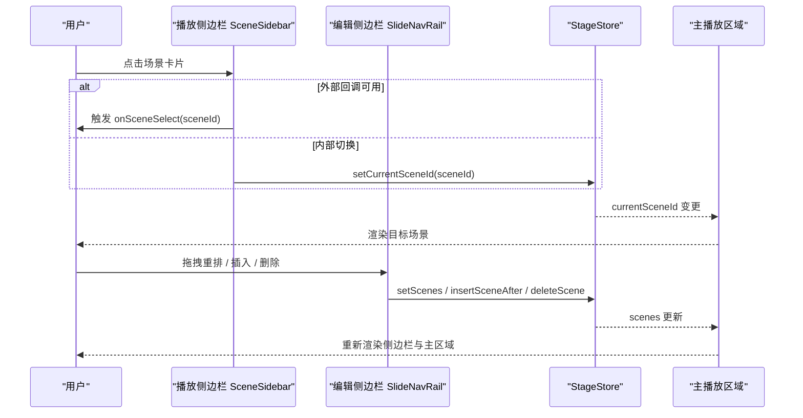
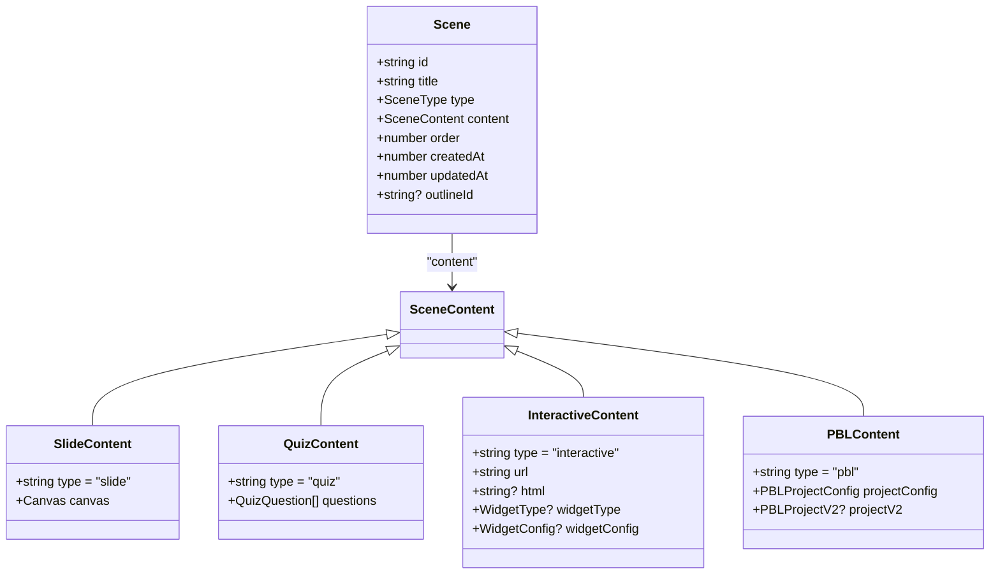

# 场景侧边栏组件

<cite>
**本文引用的文件**
- [components/stage/scene-sidebar.tsx](file://components/stage/scene-sidebar.tsx)
- [components/edit/SlideNavRail/SlideNavRail.tsx](file://components/edit/SlideNavRail/SlideNavRail.tsx)
- [components/edit/SlideNavRail/ThumbItem.tsx](file://components/edit/SlideNavRail/ThumbItem.tsx)
- [components/edit/SlideNavRail/InsertionZone.tsx](file://components/edit/SlideNavRail/InsertionZone.tsx)
- [components/stage/scene-thumbnail-content.tsx](file://components/stage/scene-thumbnail-content.tsx)
- [lib/types/stage.ts](file://lib/types/stage.ts)
</cite>

## 目录
- 产品概述
- 核心业务流程
- 功能模块清单
- 数据与状态
- 关键约束与边界

## 产品概述
SceneSidebar（播放模式）与 SlideNavRail（编辑模式）共同构成 OpenMAIC 的场景侧边栏体系，提供统一的场景导航、缩略图展示、切换与进度指示能力。两者在视觉与信息结构上保持一致：顶部为品牌标识与折叠控制，主体为可滚动的场景列表，每个场景以“序号 + 标题 + 缩略图”的卡片形式呈现，支持点击跳转、拖拽排序、右键/下拉菜单操作等。播放侧边栏侧重生成中的占位与失败重试提示；编辑侧边栏侧重增删改、复制、插入与撤销回收。

## 核心业务流程
- 场景切换流程
  - 用户点击场景卡片 → 调用 onSceneSelect 或 setCurrentSceneId → 主播放区域同步切换到对应 scene.id
- 生成中场景流程
  - 存在 generatingOutlines 时，渲染一个“生成中”占位卡片，显示骨架动画与 shimmer 效果；若失败则显示错误状态并提供重试入口
- 课程完成流程
  - 当大纲耗尽且 isCourseComplete 为真时，渲染“课程完成”占位卡片，点击后进入 PENDING_SCENE_ID 视图
- 编辑模式下的插入与排序
  - 通过 InsertionZone 在任意位置插入新幻灯片；使用 Reorder.Group 进行拖拽重排；删除支持撤销回收

图表来源
- [components/stage/scene-sidebar.tsx:148-172](file://components/stage/scene-sidebar.tsx#L148-L172)
- [components/edit/SlideNavRail/SlideNavRail.tsx:171-182](file://components/edit/SlideNavRail/SlideNavRail.tsx#L171-L182)

章节来源
- [components/stage/scene-sidebar.tsx:148-172](file://components/stage/scene-sidebar.tsx#L148-L172)
- [components/edit/SlideNavRail/SlideNavRail.tsx:171-182](file://components/edit/SlideNavRail/SlideNavRail.tsx#L171-L182)

## 功能模块清单
- 播放模式侧边栏（SceneSidebar）
  - 职责：展示所有已生成场景与生成中占位，支持点击切换、宽度拖拽调整、失败重试、课程完成占位
  - 交互要点：
    - 点击场景卡片：优先使用 onSceneSelect，否则调用 setCurrentSceneId
    - 右侧拖拽条：动态调整侧边栏宽度（MIN/MAX 限制）
    - 生成失败：显示错误图标与重试按钮（onRetryOutline）
    - 课程完成：显示奖杯占位，点击进入 PENDING_SCENE_ID
  - 缩略图策略：
    - slide：使用 SlideThumbnail 渲染真实缩略图
    - quiz：橙色渐变 + 选项网格占位
    - interactive：有 html 时使用 ThumbnailInteractive iframe 预览，否则浏览器窗口风格占位
    - pbl：蓝色渐变 + Kanban 三列占位
- 编辑模式侧边栏（SlideNavRail）
  - 职责：统一管理所有场景（slide/quiz/interactive/pbl），提供插入、复制、删除、重命名、拖拽排序
  - 交互要点：
    - 插入：InsertionZone 悬浮显示“+”，支持在首项前与任意两项之间插入
    - 重命名：双击标题或下拉菜单进入内联编辑
    - 复制：对 slide 深拷贝并重置元素 ID，非 slide 浅拷贝并追加后缀
    - 删除：带撤销回收（DeletedSceneRecycle），toast 支持一键恢复
    - 拖拽排序：Reorder.Group 实现流畅重排，自动重建 order
  - 性能优化：
    - 可见性检测 IntersectionObserver 近视口才渲染真实缩略图
    - 拖拽调整宽度直接写 DOM style.width，避免 React 重绘抖动
- 缩略图内容（SceneThumbnailContent）
  - 职责：根据 scene.type 选择不同渲染路径，确保编辑与播放模式缩略图一致
  - 关键点：interactive 分支在 visible=false 时降级为占位，避免离屏渲染开销

章节来源
- [components/stage/scene-sidebar.tsx:95-336](file://components/stage/scene-sidebar.tsx#L95-L336)
- [components/edit/SlideNavRail/SlideNavRail.tsx:39-476](file://components/edit/SlideNavRail/SlideNavRail.tsx#L39-L476)
- [components/edit/SlideNavRail/ThumbItem.tsx:31-277](file://components/edit/SlideNavRail/ThumbItem.tsx#L31-L277)
- [components/edit/SlideNavRail/InsertionZone.tsx:20-63](file://components/edit/SlideNavRail/InsertionZone.tsx#L20-L63)
- [components/stage/scene-thumbnail-content.tsx:39-177](file://components/stage/scene-thumbnail-content.tsx#L39-L177)

## 数据与状态
- 核心类型与模型
  - Scene：包含 id、title、type、content、order、时间戳等字段；type 可为 slide/quiz/interactive/pbl
  - SceneContent：union 类型，覆盖 slide/quiz/interactive/pbl 四种内容形态
  - InteractiveContent：含 url、html、widgetType、widgetConfig
  - PBLContent：含 projectConfig、projectV2
- 状态来源
  - StageStore：scenes、currentSceneId、generatingOutlines、generationStatus、failedOutlines、stage
  - CanvasStore：viewportSize、viewportRatio（用于缩略图尺寸与比例）
  - SettingsStore（编辑模式）：editRailCollapsed、editRailWidth 持久化
- 状态流转
  - 切换场景：setCurrentSceneId(sceneId) 驱动主区域渲染
  - 插入/删除/复制：setScenes / insertSceneAfter / deleteScene 更新 scenes 数组
  - 生成中：generatingOutlines 长度 > 0 时渲染占位；失败时 failedOutlines 匹配 outline.id
  - 课程完成：isCourseComplete 且无生成中条目时显示完成占位

图表来源
- [lib/types/stage.ts:54-155](file://lib/types/stage.ts#L54-L155)

章节来源
- [lib/types/stage.ts:54-155](file://lib/types/stage.ts#L54-L155)
- [components/stage/scene-sidebar.tsx:45-50](file://components/stage/scene-sidebar.tsx#L45-L50)
- [components/edit/SlideNavRail/SlideNavRail.tsx:42-53](file://components/edit/SlideNavRail/SlideNavRail.tsx#L42-L53)

## 关键约束与边界
- 交互边界
  - 播放侧边栏点击切换优先使用 onSceneSelect，未提供时回退到 setCurrentSceneId
  - 编辑模式下删除需满足“至少保留一页”的约束（slide 类型需保留至少 1 页，整体场景数 > 1）
  - 拖拽排序仅允许 y 轴移动，Reorder.Item 使用 layout="position" 保证位移动画稳定
- 性能边界
  - 缩略图懒加载：IntersectionObserver 设置 rootMargin=200px，仅在接近视口时渲染真实缩略图
  - 交互式 iframe：visible=false 时不挂载 ThumbnailInteractive，避免离屏渲染
  - 宽度拖拽：直接写入 DOM style.width，pointer capture 保障跨窗口/失焦事件完整性
- 响应式与移动端适配
  - 侧边栏宽度受 MIN/MAX 限制，移动端可通过折叠按钮隐藏
  - 触摸友好的指针事件（pointerdown/move/up/cancel）替代 mouse 事件，提升移动端体验
- 数据一致性
  - 删除后使用 DeletedSceneRecycle 捕获 entry，toast 撤销时需校验 stageId 一致性，防止跨阶段误恢复
  - 插入/重排后重建 order，确保与数组索引一致

章节来源
- [components/stage/scene-sidebar.tsx:63-93](file://components/stage/scene-sidebar.tsx#L63-L93)
- [components/edit/SlideNavRail/SlideNavRail.tsx:90-150](file://components/edit/SlideNavRail/SlideNavRail.tsx#L90-L150)
- [components/edit/SlideNavRail/ThumbItem.tsx:285-300](file://components/edit/SlideNavRail/ThumbItem.tsx#L285-L300)
- [components/stage/scene-thumbnail-content.tsx:96-104](file://components/stage/scene-thumbnail-content.tsx#L96-L104)