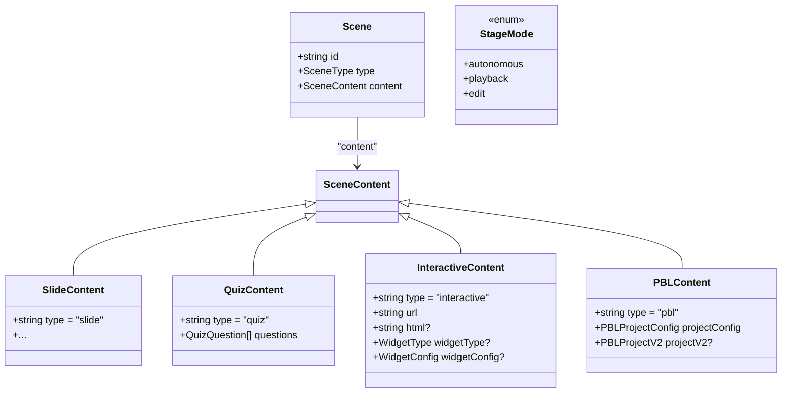
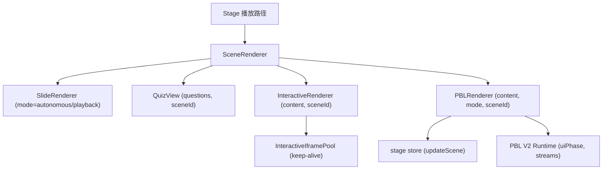
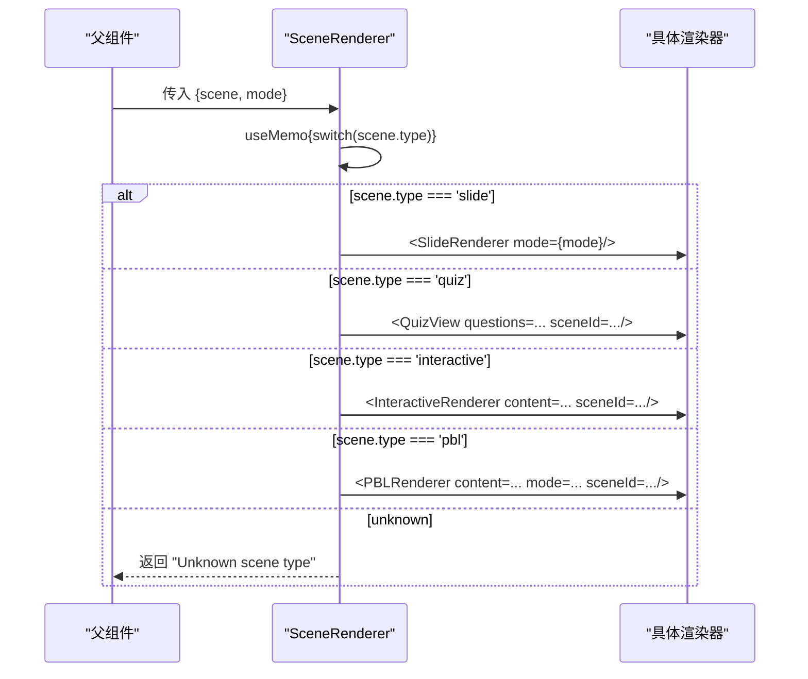
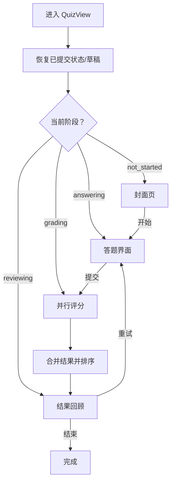
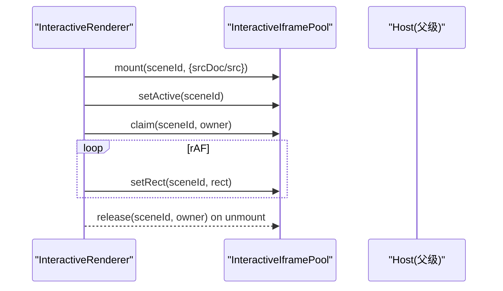
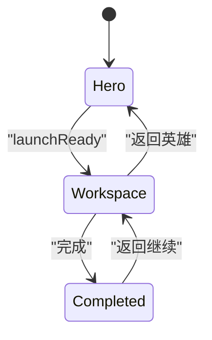
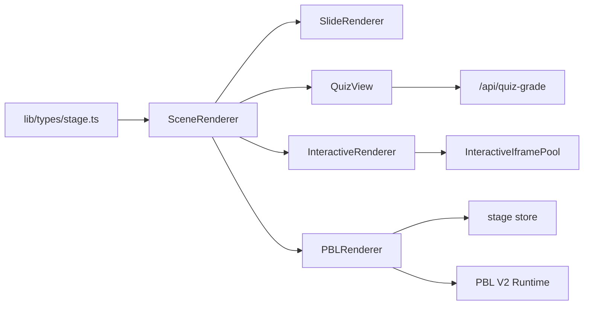

# 场景渲染器组件

<cite>
**本文引用的文件**   
- [components/stage/scene-renderer.tsx](file://components/stage/scene-renderer.tsx)
- [lib/types/stage.ts](file://lib/types/stage.ts)
- [components/slide-renderer/Editor/index.tsx](file://components/slide-renderer/Editor/index.tsx)
- [components/scene-renderers/quiz-view.tsx](file://components/scene-renderers/quiz-view.tsx)
- [components/scene-renderers/interactive-renderer.tsx](file://components/scene-renderers/interactive-renderer.tsx)
- [components/scene-renderers/pbl-renderer.tsx](file://components/scene-renderers/pbl-renderer.tsx)
- [components/scene-renderers/classroom-complete.tsx](file://components/scene-renderers/classroom-complete.tsx)
</cite>

## 产品概述
SceneRenderer 是播放路径中的“场景分发器”，根据当前 scene.type 动态选择并渲染对应的子渲染器：SlideRenderer（幻灯片）、QuizView（测验）、InteractiveRenderer（交互式网页 iframe）、PBLRenderer（项目式学习）。它仅出现在回放路径，编辑模式由上层直接接管，因此不处理 mode === 'edit' 的分支。该组件通过 useMemo 缓存渲染结果，减少不必要的重渲染；并通过严格的 content.type 校验与兜底 UI 保障错误可观测性。

## 核心业务流程
- 输入：scene（包含 id、type、content）与 mode（StageMode）。
- 决策：基于 scene.type 进行 switch 分发，并对 content.type 做二次校验。
- 渲染：将对应渲染器挂载到全屏容器内，确保各场景占满舞台区域。
- 状态同步：PBL 与 Interactive 等复杂场景通过 store 或 keep-alive 池与播放引擎保持同步。
- 错误处理：当 content.type 与 scene.type 不一致时返回明确的“无效内容”提示；未知 scene.type 返回“未知类型”。

```mermaid
flowchart TD
Start(["进入 SceneRenderer"]) --> ReadProps["读取 props: scene, mode"]
ReadProps --> Decide{"scene.type 是什么？"}
Decide --> |slide| CheckSlide["校验 content.type === 'slide'"]
Decide --> |quiz| CheckQuiz["校验 content.type === 'quiz'"]
Decide --> |interactive| CheckInteractive["校验 content.type === 'interactive'"]
Decide --> |pbl| CheckPBL["校验 content.type === 'pbl'"]
Decide --> |其他| Unknown["返回 'Unknown scene type'"]
CheckSlide --> SlideValid{"校验通过？"}
SlideValid --> |否| InvalidSlide["返回 'Invalid slide content'"]
SlideValid --> |是| RenderSlide["渲染 SlideRenderer(mode)"]
CheckQuiz --> QuizValid{"校验通过？"}
QuizValid --> |否| InvalidQuiz["返回 'Invalid quiz content'"]
QuizValid --> |是| RenderQuiz["渲染 QuizView(questions, sceneId)"]
CheckInteractive --> InteractiveValid{"校验通过？"}
InteractiveValid --> |否| InvalidInteractive["返回 'Invalid interactive content'"]
InteractiveValid --> |是| RenderInteractive["渲染 InteractiveRenderer(content, sceneId)"]
CheckPBL --> PBLValid{"校验通过？"}
PBLValid --> |否| InvalidPBL["返回 'Invalid PBL content'"]
PBLValid --> |是| RenderPBL["渲染 PBLRenderer(content, mode, sceneId)"]
RenderSlide --> End(["完成"])
RenderQuiz --> End
RenderInteractive --> End
RenderPBL --> End
InvalidSlide --> End
InvalidQuiz --> End
InvalidInteractive --> End
InvalidPBL --> End
Unknown --> End
```

**章节来源**
- [components/stage/scene-renderer.tsx:10-41](file://components/stage/scene-renderer.tsx#L10-L41)

## 功能模块清单
- SceneRenderer（分发器）
  - 职责：按 scene.type 路由到具体渲染器；对 content.type 做一致性校验；使用 useMemo 缓存渲染结果。
  - 验收要点：四种场景均能正确渲染；非法组合显示明确错误；未知类型有兜底提示。
- SlideRenderer（幻灯片）
  - 职责：根据 mode 切换 Canvas 或 ScreenCanvas，适配自主/回放两种模式。
  - 验收要点：mode 为 autonomous 时展示编辑画布；否则展示屏幕画布。
- QuizView（测验）
  - 职责：支持单选、多选、简答；本地评分 + AI 评分；草稿缓存与提交持久化；结果回顾。
  - 验收要点：答题草稿恢复；AI 评分失败回退；分数统计与可视化；多语言与数学公式渲染。
- InteractiveRenderer（交互式 iframe）
  - 职责：注册/激活/声明可见性；维持 iframe 实例存活；跟踪 slot 矩形以对齐宿主。
  - 验收要点：跨模式切换不丢失文档；URL 与 HTML 双源；尺寸跟随布局变化。
- PBLRenderer（项目式学习）
  - 职责：兼容 v1/v2 项目结构；角色选择与工作区；全屏/展开动画；流式 Instructor 事件；状态同步至 stage store。
  - 验收要点：Hero→Workspace 平滑过渡；工作区单例不卸载；原生全屏与 web 全屏共存；进度与消息流稳定。

**章节来源**
- [components/stage/scene-renderer.tsx:20-38](file://components/stage/scene-renderer.tsx#L20-L38)
- [components/slide-renderer/Editor/index.tsx:10-18](file://components/slide-renderer/Editor/index.tsx#L10-L18)
- [components/scene-renderers/quiz-view.tsx:689-796](file://components/scene-renderers/quiz-view.tsx#L689-L796)
- [components/scene-renderers/interactive-renderer.tsx:22-69](file://components/scene-renderers/interactive-renderer.tsx#L22-L69)
- [components/scene-renderers/pbl-renderer.tsx:45-169](file://components/scene-renderers/pbl-renderer.tsx#L45-L169)

## 数据与状态
- 类型定义
  - Scene 与 StageMode 来自 lib/types/stage.ts，AppSceneContent 扩展了基础 DSL 的 slide/quiz 为 interactive/pbl。
  - InteractiveContent、PBLContent 定义了交互与项目式学习的 payload 结构。
- 关键状态流转
  - QuizView：not_started → answering → grading → reviewing；答案草稿通过 useDraftCache 与 localStorage 持久化；提交后写入已提交答案与结果。
  - InteractiveRenderer：mount/claim/release 生命周期管理 iframe 实例；setRect 持续上报 slot 矩形。
  - PBLRenderer：projectV2 运行时规范化；uiPhase 在 hero/workspace/completed 之间转换；activeStreamCount 控制忙碌态；portal 到 body 的全屏层保持单例。
- 数据所有权边界
  - Scene 数据由 stage store 统一管理；各渲染器通过回调更新 scene.content（如 PBL 的 updateConfig），避免越权修改。

**图表来源**
- [lib/types/stage.ts:54-95](file://lib/types/stage.ts#L54-L95)

**章节来源**
- [lib/types/stage.ts:19-95](file://lib/types/stage.ts#L19-L95)
- [components/scene-renderers/quiz-view.tsx:689-796](file://components/scene-renderers/quiz-view.tsx#L689-L796)
- [components/scene-renderers/interactive-renderer.tsx:22-69](file://components/scene-renderers/interactive-renderer.tsx#L22-L69)
- [components/scene-renderers/pbl-renderer.tsx:171-359](file://components/scene-renderers/pbl-renderer.tsx#L171-L359)

## 关键约束与边界
- 模式约束
  - SceneRenderer 仅在 playback 路径使用；edit 模式由上层接管，不在本组件分支。
- 内容一致性
  - scene.type 与 content.type 必须一致，否则返回“无效内容”提示。
- 性能约束
  - 使用 useMemo 缓存渲染结果；InteractiveRenderer 使用 keep-alive 池避免重复创建 iframe；PBL 工作区单例避免滚动与流状态丢失。
- 集成边界
  - InteractiveRenderer 依赖 iframe pool 与 patchHtmlForIframe；PBLRenderer 依赖 stage store 与 v2 运行时；QuizView 依赖 AI 评分 API 与本地持久化。
- 错误处理
  - 未知 scene.type 返回兜底 UI；AI 评分失败回退半分策略；iframe 不可用时降级为空白占位。

**章节来源**
- [components/stage/scene-renderer.tsx:20-38](file://components/stage/scene-renderer.tsx#L20-L38)
- [components/scene-renderers/quiz-view.tsx:82-135](file://components/scene-renderers/quiz-view.tsx#L82-L135)
- [components/scene-renderers/interactive-renderer.tsx:22-69](file://components/scene-renderers/interactive-renderer.tsx#L22-L69)
- [components/scene-renderers/pbl-renderer.tsx:131-169](file://components/scene-renderers/pbl-renderer.tsx#L131-L169)

## 架构总览

**图表来源**
- [components/stage/scene-renderer.tsx:20-38](file://components/stage/scene-renderer.tsx#L20-L38)
- [components/slide-renderer/Editor/index.tsx:10-18](file://components/slide-renderer/Editor/index.tsx#L10-L18)
- [components/scene-renderers/interactive-renderer.tsx:22-69](file://components/scene-renderers/interactive-renderer.tsx#L22-L69)
- [components/scene-renderers/pbl-renderer.tsx:171-359](file://components/scene-renderers/pbl-renderer.tsx#L171-L359)

## 详细组件分析

### SceneRenderer（分发器）
- 设计要点
  - 使用 useMemo 缓存渲染结果，依赖 [scene, mode]，避免无谓重渲染。
  - 对每种 scene.type 进行 content.type 校验，非法组合返回明确错误。
  - 仅用于 playback 路径，edit 模式由上层接管。
- 性能优化
  - useMemo 缓存；条件渲染避免多余组件挂载。
- 错误处理
  - 非法 content.type 与未知 scene.type 均有兜底 UI。

**图表来源**
- [components/stage/scene-renderer.tsx:20-38](file://components/stage/scene-renderer.tsx#L20-L38)

**章节来源**
- [components/stage/scene-renderer.tsx:10-41](file://components/stage/scene-renderer.tsx#L10-L41)

### SlideRenderer（幻灯片）
- 行为
  - mode 为 autonomous 时渲染 Canvas（编辑器），否则渲染 ScreenCanvas（回放）。
- 性能
  - 简单条件渲染，无额外计算开销。

**章节来源**
- [components/slide-renderer/Editor/index.tsx:10-18](file://components/slide-renderer/Editor/index.tsx#L10-L18)

### QuizView（测验）
- 流程
  - 初始化阶段：从 localStorage 恢复已提交状态；若存在草稿则恢复答案并进入答题阶段。
  - 答题阶段：记录答案，支持语音转写追加；提交后进入评分阶段。
  - 评分阶段：选择题本地评分；简答题并行调用 /api/quiz-grade；合并结果进入回顾阶段。
  - 回顾阶段：展示得分、正确率、AI 评语与分析。
- 错误处理
  - AI 评分失败回退半分策略，并给出友好提示。
- 性能
  - 大量 memo/useMemo 优化；数学文本分段渲染；结果列表有序合并。

**图表来源**
- [components/scene-renderers/quiz-view.tsx:689-796](file://components/scene-renderers/quiz-view.tsx#L689-L796)

**章节来源**
- [components/scene-renderers/quiz-view.tsx:82-135](file://components/scene-renderers/quiz-view.tsx#L82-L135)
- [components/scene-renderers/quiz-view.tsx:689-796](file://components/scene-renderers/quiz-view.tsx#L689-L796)

### InteractiveRenderer（交互式 iframe）
- 行为
  - 注册内容到 keep-alive 池，标记活跃并声明可见性；卸载时释放但不驱逐，保证零刷新返回。
  - 每帧测量 slot 矩形并上报给 host，实现 iframe 精准覆盖。
- 性能
  - 使用 useId 作为 owner token 防止竞态隐藏；patchHtmlForIframe 预处理 HTML。
- 错误处理
  - 若 URL/html 不可用，保持占位；后续可通过重新 mount 重建 iframe。

**图表来源**
- [components/scene-renderers/interactive-renderer.tsx:22-69](file://components/scene-renderers/interactive-renderer.tsx#L22-L69)

**章节来源**
- [components/scene-renderers/interactive-renderer.tsx:22-69](file://components/scene-renderers/interactive-renderer.tsx#L22-L69)

### PBLRenderer（项目式学习）
- 行为
  - 兼容 v1（projectConfig）与 v2（projectV2）；v2 走 PBLV2Container，提供 Hero/Workspace/Completion 三阶段。
  - Workspace 为单例 portal 层，展开/收起不卸载，保持聊天与流状态。
  - 与 stage store 同步 projectV2/projectConfig 变更；activeStreamCount 控制忙碌态。
- 性能
  - useMemo 规范化运行时项目；rAF + ResizeObserver 跟踪 host 矩形；autoExpand 一次性触发首次展开。
- 错误处理
  - 空项目或旧格式提示；native fullscreen 退出按钮；异常情况下保持最小可用 UI。

**图表来源**
- [components/scene-renderers/pbl-renderer.tsx:171-359](file://components/scene-renderers/pbl-renderer.tsx#L171-L359)

**章节来源**
- [components/scene-renderers/pbl-renderer.tsx:45-169](file://components/scene-renderers/pbl-renderer.tsx#L45-L169)
- [components/scene-renderers/pbl-renderer.tsx:171-359](file://components/scene-renderers/pbl-renderer.tsx#L171-L359)

## 依赖分析
- 类型依赖
  - Scene、StageMode、AppSceneContent、InteractiveContent、PBLContent 统一在 lib/types/stage.ts 中导出，确保类型安全与可扩展性。
- 运行时依赖
  - InteractiveRenderer 依赖 iframe pool 与 HTML patch；PBLRenderer 依赖 stage store 与 v2 运行时；QuizView 依赖 AI 评分 API 与本地持久化。
- 耦合与内聚
  - SceneRenderer 低耦合，仅负责分发；各渲染器高内聚，封装各自的状态与副作用。

**图表来源**
- [lib/types/stage.ts:54-95](file://lib/types/stage.ts#L54-L95)
- [components/stage/scene-renderer.tsx:20-38](file://components/stage/scene-renderer.tsx#L20-L38)
- [components/scene-renderers/interactive-renderer.tsx:22-69](file://components/scene-renderers/interactive-renderer.tsx#L22-L69)
- [components/scene-renderers/pbl-renderer.tsx:171-359](file://components/scene-renderers/pbl-renderer.tsx#L171-L359)
- [components/scene-renderers/quiz-view.tsx:82-135](file://components/scene-renderers/quiz-view.tsx#L82-L135)

**章节来源**
- [lib/types/stage.ts:19-95](file://lib/types/stage.ts#L19-L95)

## 性能考虑
- useMemo 的使用
  - SceneRenderer 缓存渲染结果；QuizView 缓存总分、是否全部作答、数学文本分段；ClassroomCompletePage 缓存总结与日期格式化。
- 条件渲染最佳实践
  - 仅在满足条件时挂载复杂组件（如 PBL workspace 单例、Interactive iframe 池）。
- 资源复用
  - InteractiveRenderer 的 keep-alive 池避免重复创建；PBL workspace 单例避免滚动与流状态丢失。
- 动画与渲染
  - 使用 motion/react 的 reducedMotion 检测，尊重系统偏好；rAF 节流更新矩形。

[本节为通用指导，不直接分析具体文件]

## 故障排查指南
- 常见错误
  - content.type 与 scene.type 不一致：检查数据来源与生成逻辑。
  - AI 评分失败：检查模型配置与网络；查看回退策略是否生效。
  - iframe 无法加载：确认 URL/html 有效性；检查 sandbox 与安全策略。
  - PBL 工作区状态丢失：确认 portal 目标与全屏状态；检查 activeStreamCount 计数平衡。
- 定位方法
  - 查看各渲染器的日志输出（如 QuizView 的 createLogger）；检查 stage store 的 scenes 更新；验证 iframe pool 的 mount/claim/release 生命周期。

**章节来源**
- [components/scene-renderers/quiz-view.tsx:82-135](file://components/scene-renderers/quiz-view.tsx#L82-L135)
- [components/scene-renderers/interactive-renderer.tsx:22-69](file://components/scene-renderers/interactive-renderer.tsx#L22-L69)
- [components/scene-renderers/pbl-renderer.tsx:171-359](file://components/scene-renderers/pbl-renderer.tsx#L171-L359)

## 结论
SceneRenderer 作为播放路径的场景分发器，通过清晰的类型契约与稳健的错误处理，实现了四种场景的统一渲染入口。其性能优化策略（useMemo、条件渲染、资源复用）与状态同步机制（store、pool、runtime）确保了良好的用户体验与可扩展性。未来扩展新场景类型时，只需遵循统一的 SceneContent 契约并在分发器中添加分支即可。

[本节为总结性内容，不直接分析具体文件]