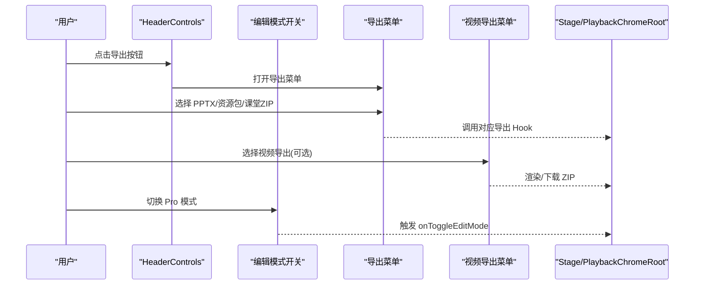
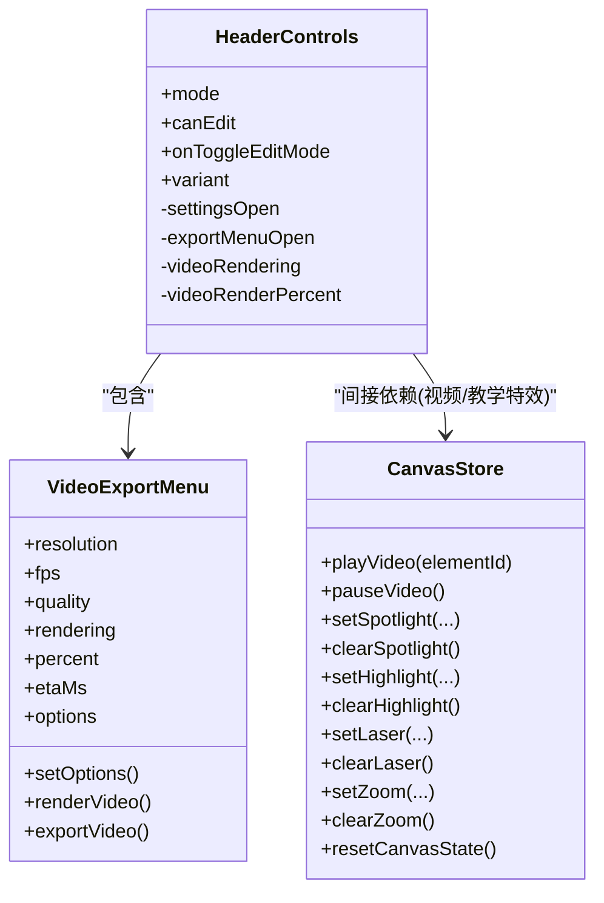
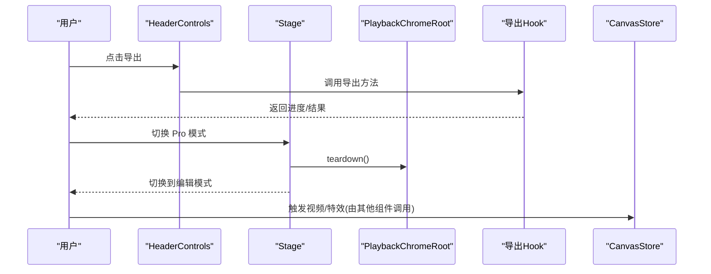
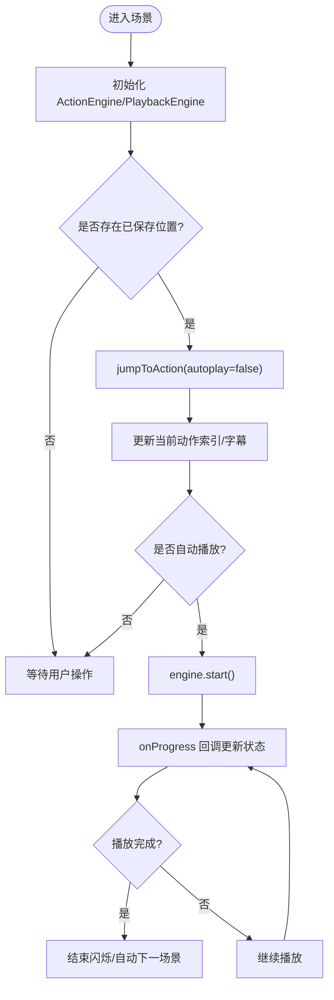
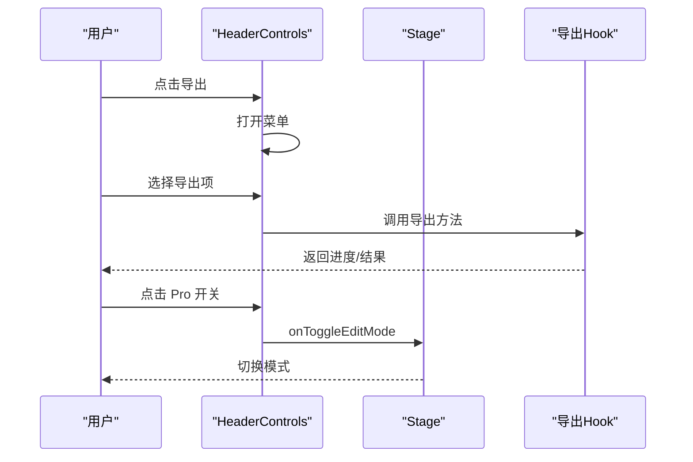

# 头部控制组件

<cite>
**本文引用的文件**   
- [components/stage/header-controls.tsx](file://components/stage/header-controls.tsx)
- [components/stage/video-export-menu.tsx](file://components/stage/video-export-menu.tsx)
- [components/stage.tsx](file://components/stage.tsx)
- [components/edit/PlaybackChromeRoot.tsx](file://components/edit/PlaybackChromeRoot.tsx)
- [lib/store/canvas.ts](file://lib/store/canvas.ts)
- [lib/playback/types.ts](file://lib/playback/types.ts)
- [lib/choreography/timing.ts](file://lib/choreography/timing.ts)
</cite>

## 产品概述
HeaderControls 是课堂播放与编辑模式共用的“头部控制”组件，提供语言切换、主题切换、设置入口、Pro（编辑）模式开关以及导出/下载等全局能力。它被同时挂载在回放模式的 Stage Header 与编辑模式的 CommandBar 右侧区域，保证两种模式下控件外观与位置一致，避免模式切换时的布局抖动。该组件不直接实现播放/暂停与进度条控制，而是通过上层 PlaybackChromeRoot 与播放引擎协同完成；其职责聚焦于用户可见的全局控制与导出流程。

## 核心业务流程
- 语言与主题：通过下拉菜单与 i18n 钩子切换语言与主题，使用 Radix DropdownMenu 的 portal 渲染，避免被父级 overflow-hidden 裁剪。
- 设置面板：根据功能开关决定是否显示设置按钮，点击后打开 SettingsDialog。
- Pro（编辑）模式开关：当当前场景可编辑时允许进入编辑模式；不可编辑时禁用并给出提示。
- 导出/下载：聚合 PPTX、资源包、课堂 ZIP 与视频导出（可选），根据任务状态与媒体生成状态决定按钮可用性，并在后台渲染视频时展示环形进度。

**图表来源** 
- [components/stage/header-controls.tsx:258-336](file://components/stage/header-controls.tsx#L258-L336)
- [components/stage/video-export-menu.tsx:87-199](file://components/stage/video-export-menu.tsx#L87-L199)
- [components/stage.tsx:63-89](file://components/stage.tsx#L63-L89)

**章节来源**
- [components/stage/header-controls.tsx:64-343](file://components/stage/header-controls.tsx#L64-L343)
- [components/stage/video-export-menu.tsx:87-199](file://components/stage/video-export-menu.tsx#L87-L199)
- [components/stage.tsx:63-89](file://components/stage.tsx#L63-L89)

## 功能模块清单
- 语言切换器
  - 职责：切换应用语言，基于 i18n 钩子更新文案。
  - 验收要点：切换后界面文案即时更新；下拉菜单不被父容器裁剪。
- 主题切换器
  - 职责：支持亮色/暗色/跟随系统三种主题，非模态下拉避免滚动锁定。
  - 验收要点：主题切换后 UI 颜色与图标正确变化；不影响固定高度布局。
- 设置入口
  - 职责：根据配置开关显示设置按钮，打开设置对话框。
  - 验收要点：托管部署下可隐藏；按钮 hover 动效正常。
- Pro（编辑）模式开关
  - 职责：在可编辑场景下允许进入编辑模式；不可编辑时禁用并提示原因。
  - 验收要点：与 Stage 的 isEditable 判定同步；切换时动画稳定无漂移。
- 导出/下载
  - 职责：聚合 PPTX、资源包、课堂 ZIP 与视频导出；根据任务状态与媒体生成状态控制可用性与反馈。
  - 验收要点：导出进行中禁用按钮；视频后台渲染显示环形进度；菜单外点击关闭。

**章节来源**
- [components/stage/header-controls.tsx:126-340](file://components/stage/header-controls.tsx#L126-L340)
- [components/stage/video-export-menu.tsx:87-199](file://components/stage/video-export-menu.tsx#L87-L199)

## 数据与状态
- 组件内状态
  - settingsOpen：设置弹窗显隐
  - exportMenuOpen：导出菜单显隐
  - videoRendering / videoRenderPercent：视频渲染状态与百分比
- 外部状态（Zustand）
  - scenes、generatingOutlines、failedOutlines：用于判断是否可导出
  - mediaTasks：媒体任务状态，需全部 done/failed 才可导出
  - useVideoRenderStore：视频渲染进度与状态
- 与播放引擎的关系
  - HeaderControls 不持有播放引擎实例；播放/暂停、跳转、全屏等由 PlaybackChromeRoot 与 Stage 协调。
  - 视频渲染进度通过全局 store 暴露，确保即使菜单关闭也能看到进度环。

**图表来源** 
- [components/stage/header-controls.tsx:64-343](file://components/stage/header-controls.tsx#L64-L343)
- [components/stage/video-export-menu.tsx:87-199](file://components/stage/video-export-menu.tsx#L87-L199)
- [lib/store/canvas.ts:156-191](file://lib/store/canvas.ts#L156-L191)

**章节来源**
- [components/stage/header-controls.tsx:70-114](file://components/stage/header-controls.tsx#L70-L114)
- [components/stage/header-controls.tsx:80-100](file://components/stage/header-controls.tsx#L80-L100)
- [lib/store/canvas.ts:156-191](file://lib/store/canvas.ts#L156-L191)

## 关键约束与边界
- 导出可用性约束
  - 必须存在场景且大纲生成中/失败为空，且所有媒体任务处于 done/failed。
  - 导出进行中或课堂 ZIP 导出进行中时按钮禁用。
- 全屏与演示模式
  - 全屏切换由 PlaybackChromeRoot 负责，HeaderControls 仅承载导出与设置等全局控件。
  - 全屏退出时会解锁键盘并恢复控件可见性。
- 模式切换稳定性
  - Pro 模式开关与 Stage 的 isEditable 保持一致，避免进入后立即自动退出。
  - 模式切换采用淡入淡出，避免 layoutId morph 导致的控件漂移。
- 性能与交互反馈
  - 导出菜单外点击关闭，避免多余渲染。
  - 视频渲染进度常驻按钮，减少重绘与状态闪烁。
  - 主题与语言切换使用 Portal 渲染，避免溢出裁剪与滚动锁定。

**章节来源**
- [components/stage/header-controls.tsx:96-114](file://components/stage/header-controls.tsx#L96-L114)
- [components/stage/header-controls.tsx:258-336](file://components/stage/header-controls.tsx#L258-L336)
- [components/stage.tsx:109-156](file://components/stage.tsx#L109-L156)
- [components/edit/PlaybackChromeRoot.tsx:460-503](file://components/edit/PlaybackChromeRoot.tsx#L460-L503)

## 与其他组件的通信方式与事件传递机制
- 与 Stage
  - Pro 模式开关通过 onToggleEditMode 回调到 Stage，Stage 负责编辑锁与会话清理后再切换模式。
- 与 PlaybackChromeRoot
  - 全屏切换、播放控制、会话生命周期由 PlaybackChromeRoot 管理；HeaderControls 不直接操作引擎。
- 与导出 Hook
  - 使用 useExportPPTX、useExportClassroom、useExportVideo/useRenderVideo 等 Hook 发起导出任务，状态通过 Store 共享。
- 与 CanvasStore
  - 视频播放与教学特效（聚光、激光、高亮、缩放）通过 CanvasStore 的方法驱动，HeaderControls 间接依赖这些能力。

**图表来源** 
- [components/stage/header-controls.tsx:258-336](file://components/stage/header-controls.tsx#L258-L336)
- [components/stage.tsx:63-89](file://components/stage.tsx#L63-L89)
- [components/edit/PlaybackChromeRoot.tsx:422-441](file://components/edit/PlaybackChromeRoot.tsx#L422-L441)
- [lib/store/canvas.ts:156-191](file://lib/store/canvas.ts#L156-L191)

**章节来源**
- [components/stage/header-controls.tsx:258-336](file://components/stage/header-controls.tsx#L258-L336)
- [components/stage.tsx:63-89](file://components/stage.tsx#L63-L89)
- [components/edit/PlaybackChromeRoot.tsx:422-441](file://components/edit/PlaybackChromeRoot.tsx#L422-L441)
- [lib/store/canvas.ts:156-191](file://lib/store/canvas.ts#L156-L191)

## 样式定制选项与主题适配
- 变体 variant
  - default：圆角药丸样式，适合回放模式 Header。
  - compact：更紧凑的内边距与边框权重，适合嵌入 CommandBar 右侧。
- 主题适配
  - 亮色/暗色/系统主题切换，图标随主题变化。
  - 背景使用半透明与 backdrop-blur，保持 chrome 质感。
- 交互反馈
  - 按钮 hover 阴影与颜色过渡，禁用态透明度降低。
  - 导出进行中显示旋转图标，视频渲染显示环形进度。

**章节来源**
- [components/stage/header-controls.tsx:126-199](file://components/stage/header-controls.tsx#L126-L199)
- [components/stage/header-controls.tsx:258-336](file://components/stage/header-controls.tsx#L258-L336)

## 实际使用示例与配置参数说明
- 基本用法
  - 在 Stage Header 或 EditShell.CommandBar 右侧插槽中引入 HeaderControls，传入 mode、canEdit、onToggleEditMode、variant。
- 关键参数
  - mode：当前阶段模式（edit/playback/autonomous）。
  - canEdit：是否允许进入编辑模式。
  - onToggleEditMode：切换编辑模式的回调。
  - variant：default 或 compact。
- 导出配置
  - 视频导出分辨率、帧率、质量由 VideoExportMenu 提供；服务可用性通过 capability 接口探测。

**章节来源**
- [components/stage/header-controls.tsx:38-49](file://components/stage/header-controls.tsx#L38-L49)
- [components/stage/video-export-menu.tsx:87-199](file://components/stage/video-export-menu.tsx#L87-L199)

## 播放控制功能的实现说明
- 播放/暂停与进度条控制
  - 由 PlaybackChromeRoot 与 PlaybackEngine 负责；HeaderControls 不直接处理播放控制。
  - 播放引擎模式与进度通过回调更新 React 状态，用于 UI 展示与逻辑判断。
- 全屏切换
  - 由 PlaybackChromeRoot 的 togglePresentation 实现，HeaderControls 不包含全屏逻辑。
- 与播放引擎的状态同步
  - 场景切换时保存/恢复播放位置；引擎完成时标记播放结束并可能自动推进下一场景。

**图表来源** 
- [components/edit/PlaybackChromeRoot.tsx:539-800](file://components/edit/PlaybackChromeRoot.tsx#L539-L800)

**章节来源**
- [components/edit/PlaybackChromeRoot.tsx:539-800](file://components/edit/PlaybackChromeRoot.tsx#L539-L800)
- [lib/playback/types.ts:14-45](file://lib/playback/types.ts#L14-L45)

## 用户交互事件的响应和处理流程
- 导出菜单
  - 点击导出按钮打开菜单；菜单外点击关闭；各导出项调用对应 Hook。
- Pro 模式开关
  - 点击后调用 onToggleEditMode；Stage 负责编辑锁与会话清理再切换模式。
- 主题与语言
  - 下拉菜单选择后调用 setTheme/useI18n，立即生效。

**图表来源** 
- [components/stage/header-controls.tsx:258-336](file://components/stage/header-controls.tsx#L258-L336)
- [components/stage.tsx:63-89](file://components/stage.tsx#L63-L89)

**章节来源**
- [components/stage/header-controls.tsx:258-336](file://components/stage/header-controls.tsx#L258-L336)
- [components/stage.tsx:63-89](file://components/stage.tsx#L63-L89)

## 性能优化策略与用户体验设计
- 渲染与布局
  - 使用 Portal 渲染下拉菜单，避免父级 overflow-hidden 裁剪。
  - 模式切换采用淡入淡出，避免 transform 导致 layout 测量失真。
- 状态与重渲染
  - 导出菜单外点击关闭，减少不必要的渲染。
  - 视频渲染进度常驻按钮，避免状态闪烁。
- 交互反馈
  - 禁用态与进行中状态明确提示；hover 动效增强可发现性。
  - 全屏退出时解锁键盘并恢复控件可见性，避免卡死。

**章节来源**
- [components/stage/header-controls.tsx:102-114](file://components/stage/header-controls.tsx#L102-L114)
- [components/stage.tsx:109-156](file://components/stage.tsx#L109-L156)
- [components/edit/PlaybackChromeRoot.tsx:460-503](file://components/edit/PlaybackChromeRoot.tsx#L460-L503)

## 结论
HeaderControls 作为跨模式的全局控制入口，聚焦语言、主题、设置与导出能力，并通过稳定的布局与丰富的交互反馈提升用户体验。播放控制与全屏切换由 PlaybackChromeRoot 与 Stage 协同实现，HeaderControls 与其解耦，确保职责清晰、状态可控、性能稳定。结合 CanvasStore 的教学特效与导出 Hook 的任务管理，形成完整的课堂播放与编辑体验闭环。