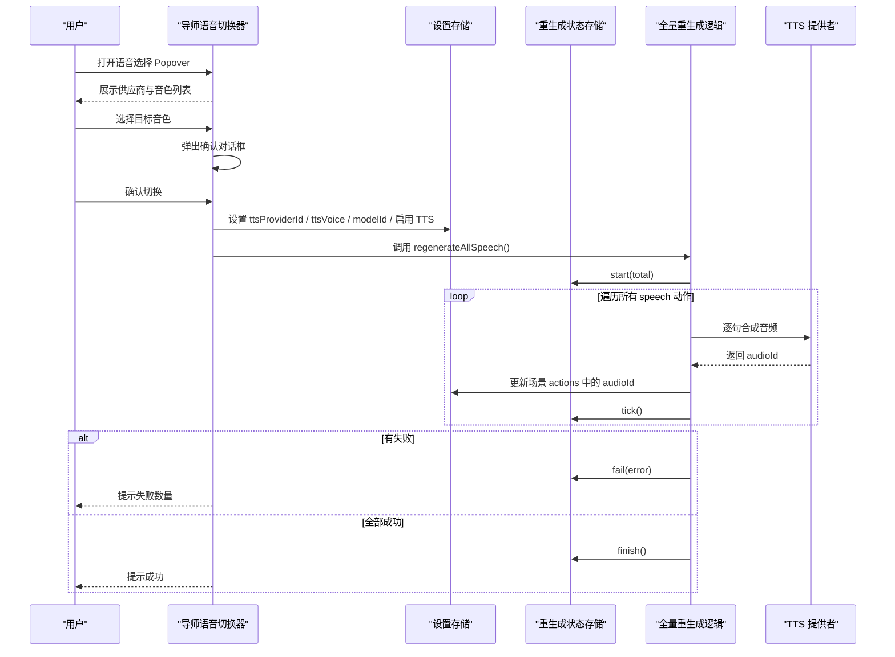
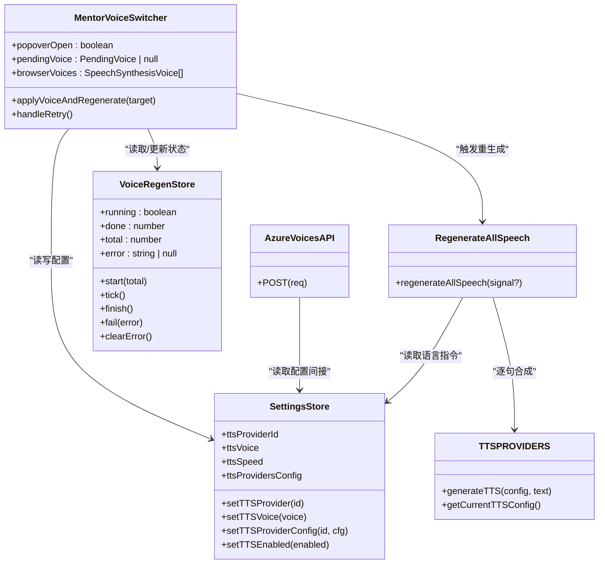
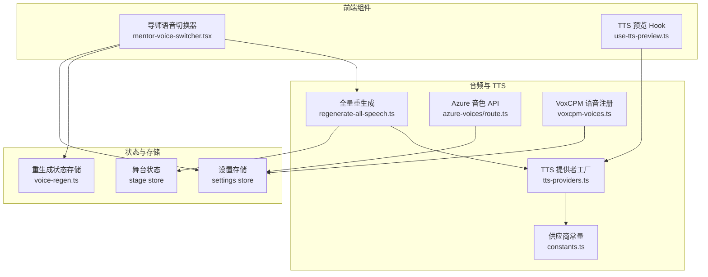
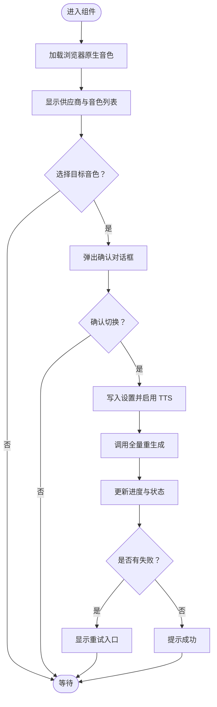
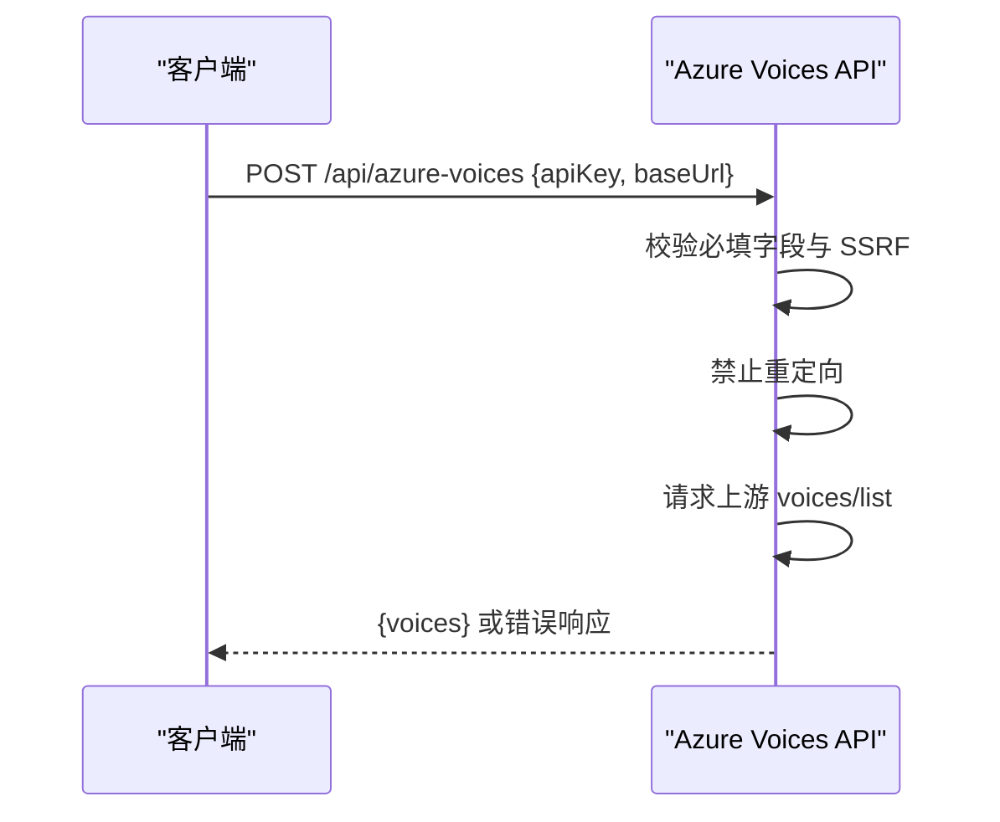
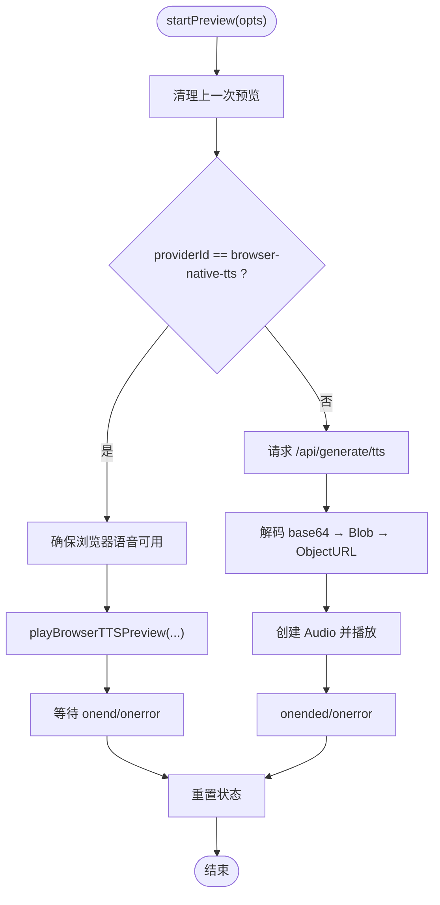
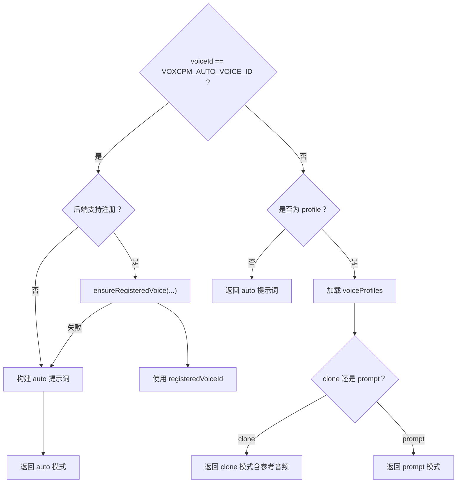
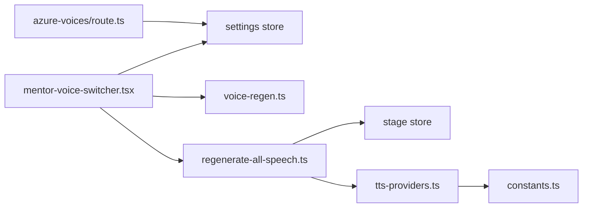

# 导师语音切换器组件

<cite>
**本文引用的文件**   
- [components/stage/mentor-voice-switcher.tsx](file://components/stage/mentor-voice-switcher.tsx)
- [lib/audio/regenerate-all-speech.ts](file://lib/audio/regenerate-all-speech.ts)
- [lib/store/voice-regen.ts](file://lib/store/voice-regen.ts)
- [lib/audio/tts-providers.ts](file://lib/audio/tts-providers.ts)
- [lib/audio/constants.ts](file://lib/audio/constants.ts)
- [app/api/azure-voices/route.ts](file://app/api/azure-voices/route.ts)
- [lib/audio/use-tts-preview.ts](file://lib/audio/use-tts-preview.ts)
- [lib/audio/voxcpm-voices.ts](file://lib/audio/voxcpm-voices.ts)
</cite>

## 产品概述
MentorVoiceSwitcher（导师语音切换器）是课堂头部用于为 AI 导师选择朗读音色的交互组件。其核心价值在于：
- 提供多 TTS 供应商与多音色的集中选择界面，支持当前音色标识与即时预览。
- 在切换音色后触发“全部讲课音频重生成”，确保播放路径读取到新合成的音频。
- 通过状态管理统一控制重生成进度、防重复触发与错误重试，提升用户体验。
- 与 TTS 服务集成，支持多种后端（OpenAI、Azure、GLM、Qwen、MiniMax、Doubao、ElevenLabs、浏览器原生等），并具备语音注册与个性化能力（如 VoxCPM）。

适用场景：
- 课堂中快速更换导师音色，保证讲解音频一致性与可听性。
- 教师或管理员在设置中配置不同 TTS 供应商与模型，并在课堂内即时生效。
- 需要预览某段文本的语音效果，以评估音色与语速是否合适。

## 核心业务流程
- 用户点击“导师语音”按钮，弹出 Popover 展示可用供应商与音色列表。
- 用户选择目标音色后，弹出确认对话框，明确告知将重新合成全部讲课音频及其耗时影响。
- 确认后，组件写入新的 providerId、voiceId、modelId（如有），启用 TTS，并调用批量重生成流程。
- 重生成过程中，按钮显示进度（已完成/总数），并禁用重复触发；完成后给出成功或失败反馈。
- 若重生成失败，出现重试入口，允许按当前音色再次尝试。

**章节来源**
- [components/stage/mentor-voice-switcher.tsx:43-239](file://components/stage/mentor-voice-switcher.tsx#L43-L239)
- [lib/audio/regenerate-all-speech.ts:1-102](file://lib/audio/regenerate-all-speech.ts#L1-L102)
- [lib/store/voice-regen.ts:1-44](file://lib/store/voice-regen.ts#L1-L44)

## 功能模块清单
- 导师语音切换器 UI（Popover + AlertDialog）
  - 职责：展示供应商与音色分组、当前音色标识、切换确认、失败重试入口。
  - 验收要点：无可用音色时显示提示；进行中禁用重复触发；完成/失败均有 toast 反馈。
- 全量重生成逻辑
  - 职责：收集课堂内所有 speech 动作，逐句调用 TTS 合成，写回规范 audioId，更新场景 actions。
  - 验收要点：支持中止信号；统计失败数；与语言指令保持一致。
- 重生成状态存储
  - 职责：维护 running/done/total/error 生命周期，供 UI 与播放路径门控。
  - 验收要点：start/tick/finish/fail/clearError 行为正确；不持久化。
- TTS 提供者工厂与实现
  - 职责：根据 providerId 路由到具体实现，处理鉴权、参数映射、格式解析与错误处理。
  - 验收要点：内置供应商覆盖 OpenAI/Azure/GLM/Qwen/MiniMax/Doubao/ElevenLabs/浏览器原生；自定义兼容 OpenAI 风格。
- Azure 音色列表 API
  - 职责：服务端代理获取 Azure 可用音色，进行 SSRF 校验与重定向防护。
  - 验收要点：缺失必填字段返回错误；上游错误透传；禁止重定向。
- TTS 预览 Hook
  - 职责：支持浏览器原生与 API 两种预览方式，管理音频对象 URL、取消与清理。
  - 验收要点：abort 错误吞掉；非 abort 错误抛出；播放结束自动重置状态。
- VoxCPM 语音注册与个性化
  - 职责：支持“自动音色”注册、提示词音色与克隆音色管理，持久化至 IndexedDB。
  - 验收要点：自动模式优先尝试注册，失败回退到 inline prompt；支持参考音频规范化与大小限制。

**章节来源**
- [components/stage/mentor-voice-switcher.tsx:43-239](file://components/stage/mentor-voice-switcher.tsx#L43-L239)
- [lib/audio/regenerate-all-speech.ts:1-102](file://lib/audio/regenerate-all-speech.ts#L1-L102)
- [lib/store/voice-regen.ts:1-44](file://lib/store/voice-regen.ts#L1-L44)
- [lib/audio/tts-providers.ts:145-193](file://lib/audio/tts-providers.ts#L145-L193)
- [app/api/azure-voices/route.ts:1-69](file://app/api/azure-voices/route.ts#L1-L69)
- [lib/audio/use-tts-preview.ts:1-161](file://lib/audio/use-tts-preview.ts#L1-L161)
- [lib/audio/voxcpm-voices.ts:159-339](file://lib/audio/voxcpm-voices.ts#L159-L339)

## 数据与状态
- 设置存储（Settings Store）
  - 关键字段：ttsProviderId、ttsVoice、ttsSpeed、ttsProvidersConfig、ttsEnabled。
  - 作用：保存当前 TTS 供应商、音色、速度与供应商配置；切换时先设 provider 再设 voice，最后启用 TTS。
- 重生成状态（VoiceRegen Store）
  - 关键字段：running、done、total、error。
  - 作用：描述一次重生成批次的生命周期，UI 与播放路径据此门控。
- 舞台状态（Stage Store）
  - 作用：保存场景与 actions，重生成成功后写回每个 speech 动作的规范 audioId，确保播放路径命中新音频。
- TTS 配置构造
  - getCurrentTTSConfig：从 Settings Store 组装 providerId、modelId、apiKey、baseUrl、voice、speed，供 TTS 调用。
- 供应商与音色常量
  - TTS_PROVIDERS：定义各供应商元数据、默认模型、可用音色、支持格式与语速范围。
- Azure 音色列表
  - 服务端 POST /api/azure-voices：接收 apiKey 与 baseUrl，拉取 voices 列表并返回。

**图表来源**
- [components/stage/mentor-voice-switcher.tsx:43-239](file://components/stage/mentor-voice-switcher.tsx#L43-L239)
- [lib/store/voice-regen.ts:1-44](file://lib/store/voice-regen.ts#L1-L44)
- [lib/audio/regenerate-all-speech.ts:1-102](file://lib/audio/regenerate-all-speech.ts#L1-L102)
- [lib/audio/tts-providers.ts:821-843](file://lib/audio/tts-providers.ts#L821-L843)
- [app/api/azure-voices/route.ts:1-69](file://app/api/azure-voices/route.ts#L1-L69)

**章节来源**
- [lib/audio/tts-providers.ts:821-843](file://lib/audio/tts-providers.ts#L821-L843)
- [lib/audio/constants.ts:81-200](file://lib/audio/constants.ts#L81-L200)
- [app/api/azure-voices/route.ts:1-69](file://app/api/azure-voices/route.ts#L1-L69)

## 关键约束与边界
- 切换音色必须重生成全部讲课音频：由于音频预生成缓存，切换后需逐句合成才能生效；交互上通过确认框明确耗时影响。
- 并发与幂等：重生成进行中禁止重复触发；使用 AbortSignal 支持中断。
- 播放门控：播放路径读取 running 状态，避免重生成期间播放旧音频。
- 供应商兼容性：
  - 浏览器原生 TTS 仅客户端可用，服务器端不可用。
  - 自定义供应商遵循 OpenAI 兼容接口。
  - Azure 音色列表需校验 baseUrl 与密钥，禁止重定向。
- 多语言与个性化：
  - 语言指令来自舞台 languageDirective，与生成管线一致。
  - VoxCPM 支持自动音色注册、提示词音色与克隆音色，参考音频需规范化且不超过大小限制。
- 错误处理：
  - TTS 错误包含速率限制与上游错误信息；部分供应商返回特定错误码需特殊处理（如 Doubao 流式 JSON 拼接）。
  - 预览 Hook 对 abort 错误吞掉，其他错误抛出给调用方。

**章节来源**
- [lib/audio/regenerate-all-speech.ts:1-102](file://lib/audio/regenerate-all-speech.ts#L1-L102)
- [lib/audio/tts-providers.ts:145-193](file://lib/audio/tts-providers.ts#L145-L193)
- [lib/audio/use-tts-preview.ts:1-161](file://lib/audio/use-tts-preview.ts#L1-L161)
- [lib/audio/voxcpm-voices.ts:159-339](file://lib/audio/voxcpm-voices.ts#L159-L339)
- [app/api/azure-voices/route.ts:1-69](file://app/api/azure-voices/route.ts#L1-L69)

## 架构总览

**图表来源**
- [components/stage/mentor-voice-switcher.tsx:43-239](file://components/stage/mentor-voice-switcher.tsx#L43-L239)
- [lib/audio/use-tts-preview.ts:1-161](file://lib/audio/use-tts-preview.ts#L1-L161)
- [lib/audio/regenerate-all-speech.ts:1-102](file://lib/audio/regenerate-all-speech.ts#L1-L102)
- [lib/audio/tts-providers.ts:145-193](file://lib/audio/tts-providers.ts#L145-L193)
- [lib/audio/constants.ts:81-200](file://lib/audio/constants.ts#L81-L200)
- [app/api/azure-voices/route.ts:1-69](file://app/api/azure-voices/route.ts#L1-L69)
- [lib/audio/voxcpm-voices.ts:159-339](file://lib/audio/voxcpm-voices.ts#L159-L339)

## 详细组件分析

### 导师语音切换器（MentorVoiceSwitcher）
- 交互流程：
  - 打开 Popover 展示供应商与音色分组；当前音色高亮。
  - 选择音色后弹出确认对话框，说明重生成影响。
  - 确认后写入设置并触发重生成；进行中显示进度与禁用按钮。
  - 失败时显示重试入口，点击后清除错误并重试。
- 数据同步：
  - 使用 Settings Store 的 setTTSProvider/setTTSVoice/setTTSProviderConfig/setTTSEnabled。
  - 使用 VoiceRegen Store 的 running/done/total/error 控制 UI 与播放门控。
- 可用性：
  - 无可用音色时显示提示；支持浏览器原生音色动态加载。

**图表来源**
- [components/stage/mentor-voice-switcher.tsx:43-239](file://components/stage/mentor-voice-switcher.tsx#L43-L239)

**章节来源**
- [components/stage/mentor-voice-switcher.tsx:43-239](file://components/stage/mentor-voice-switcher.tsx#L43-L239)

### 全量重生成逻辑（regenerateAllSpeech）
- 收集目标：遍历 stage.scenes 中类型为 speech 的动作，提取 sceneId/order/actionId/text。
- 执行合成：逐句调用 regenerateSpeechAudio（内部走 generateAndStoreTTS，读取全局 settings.ttsVoice）。
- 写回结果：成功后将规范 audioId 写回 actions，确保播放路径命中新音频。
- 状态管理：start(total) → tick() → finish()/fail(error)。

**图表来源**
- [lib/audio/regenerate-all-speech.ts:1-102](file://lib/audio/regenerate-all-speech.ts#L1-L102)

**章节来源**
- [lib/audio/regenerate-all-speech.ts:1-102](file://lib/audio/regenerate-all-speech.ts#L1-L102)

### TTS 提供者工厂与实现
- 路由机制：generateTTS 根据 providerId 分发到具体实现。
- 内置供应商：OpenAI、Azure、GLM、Qwen、MiniMax、Doubao、ElevenLabs、浏览器原生。
- 自定义供应商：兼容 OpenAI 风格接口。
- 错误处理：速率限制检测、上游错误透传、浏览器原生在服务端不可用。

**图表来源**
- [lib/audio/tts-providers.ts:145-193](file://lib/audio/tts-providers.ts#L145-L193)

**章节来源**
- [lib/audio/tts-providers.ts:145-193](file://lib/audio/tts-providers.ts#L145-L193)

### Azure 音色列表 API
- 输入：apiKey、baseUrl。
- 校验：SSRF 校验、禁止重定向。
- 输出：voices 列表或错误响应。

**图表来源**
- [app/api/azure-voices/route.ts:1-69](file://app/api/azure-voices/route.ts#L1-L69)

**章节来源**
- [app/api/azure-voices/route.ts:1-69](file://app/api/azure-voices/route.ts#L1-L69)

### TTS 预览 Hook（useTTSPreview）
- 支持浏览器原生与 API 两种预览方式。
- 管理音频对象 URL、取消与清理，abort 错误吞掉，其他错误抛出。
- 播放结束自动重置状态。

**图表来源**
- [lib/audio/use-tts-preview.ts:1-161](file://lib/audio/use-tts-preview.ts#L1-L161)

**章节来源**
- [lib/audio/use-tts-preview.ts:1-161](file://lib/audio/use-tts-preview.ts#L1-L161)

### VoxCPM 语音注册与个性化
- 自动音色：优先尝试注册 registeredVoiceId，失败回退到 inline prompt。
- 提示词音色与克隆音色：支持上传参考音频并规范化，限制大小。
- 持久化：IndexedDB 存储 voiceProfiles，支持增删改查与变更通知。

**图表来源**
- [lib/audio/voxcpm-voices.ts:159-339](file://lib/audio/voxcpm-voices.ts#L159-L339)

**章节来源**
- [lib/audio/voxcpm-voices.ts:159-339](file://lib/audio/voxcpm-voices.ts#L159-L339)

## 依赖分析
- 组件层：MentorVoiceSwitcher 依赖 Settings Store、VoiceRegen Store、regenerateAllSpeech。
- 音频层：regenerateAllSpeech 依赖 Stage Store 与 TTS Providers。
- 供应商层：TTS Providers 依赖 constants 与具体实现函数。
- 外部集成：Azure Voices API 作为服务端代理，校验与安全策略由服务端保障。

**图表来源**
- [components/stage/mentor-voice-switcher.tsx:43-239](file://components/stage/mentor-voice-switcher.tsx#L43-L239)
- [lib/audio/regenerate-all-speech.ts:1-102](file://lib/audio/regenerate-all-speech.ts#L1-L102)
- [lib/audio/tts-providers.ts:145-193](file://lib/audio/tts-providers.ts#L145-L193)
- [lib/audio/constants.ts:81-200](file://lib/audio/constants.ts#L81-L200)
- [app/api/azure-voices/route.ts:1-69](file://app/api/azure-voices/route.ts#L1-L69)

**章节来源**
- [components/stage/mentor-voice-switcher.tsx:43-239](file://components/stage/mentor-voice-switcher.tsx#L43-L239)
- [lib/audio/regenerate-all-speech.ts:1-102](file://lib/audio/regenerate-all-speech.ts#L1-L102)
- [lib/audio/tts-providers.ts:145-193](file://lib/audio/tts-providers.ts#L145-L193)
- [lib/audio/constants.ts:81-200](file://lib/audio/constants.ts#L81-L200)
- [app/api/azure-voices/route.ts:1-69](file://app/api/azure-voices/route.ts#L1-L69)

## 性能考虑
- 重生成批量处理：逐句合成，避免一次性大请求；支持中止信号防止长时间阻塞。
- 状态门控：running 标志防止重复触发与脏播放，减少不必要的网络与渲染开销。
- 预览优化：Object URL 及时释放，避免内存泄漏；abort 错误吞掉降低干扰。
- 供应商差异：部分供应商返回流式数据（如 Doubao），需高效拼接与解析。

## 故障排查指南
- 无法选择音色：检查 availableProviders 是否为空；确认浏览器原生音色加载与供应商配置。
- 切换无效：确认已启用 TTS 并成功写入 ttsProviderId/ttsVoice/modelId；检查重生成是否成功。
- 播放旧音频：确认 actions 中的 audioId 已更新；检查播放路径是否读取最新 state。
- 预览失败：检查 providerId 是否为 browser-native-tts；确认 API Key/BaseUrl 配置；查看错误消息。
- Azure 音色获取失败：检查 apiKey 与 baseUrl；确认 SSRF 校验与重定向策略。

**章节来源**
- [components/stage/mentor-voice-switcher.tsx:43-239](file://components/stage/mentor-voice-switcher.tsx#L43-L239)
- [lib/audio/regenerate-all-speech.ts:1-102](file://lib/audio/regenerate-all-speech.ts#L1-L102)
- [lib/audio/use-tts-preview.ts:1-161](file://lib/audio/use-tts-preview.ts#L1-L161)
- [app/api/azure-voices/route.ts:1-69](file://app/api/azure-voices/route.ts#L1-L69)

## 结论
MentorVoiceSwitcher 通过清晰的交互流程、稳健的状态管理与灵活的 TTS 集成，实现了导师音色的便捷切换与实时生效。结合全量重生成、预览与个性化能力，满足课堂场景中对语音质量与可定制性的要求。未来可扩展更多供应商与高级特性（如更细粒度的缓存策略与增量重生成），进一步提升性能与用户体验。