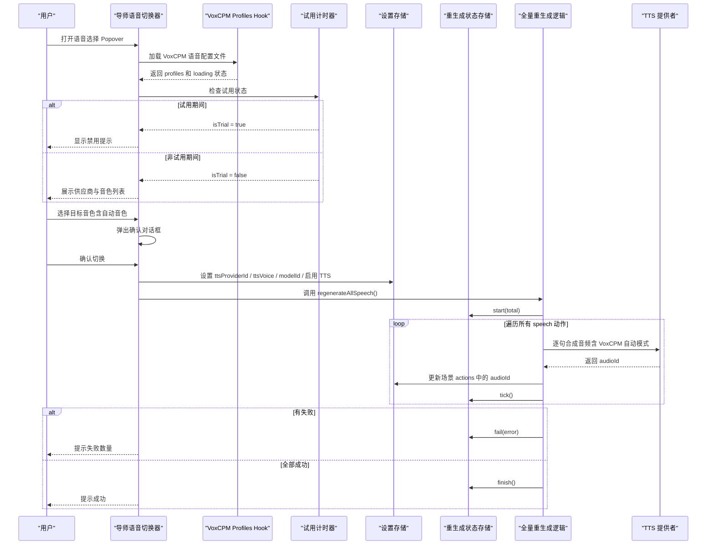
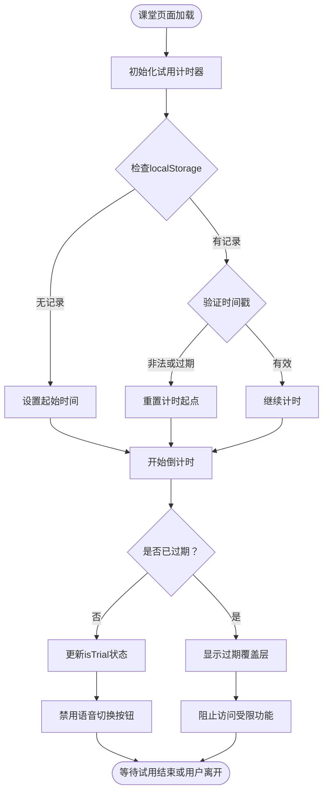
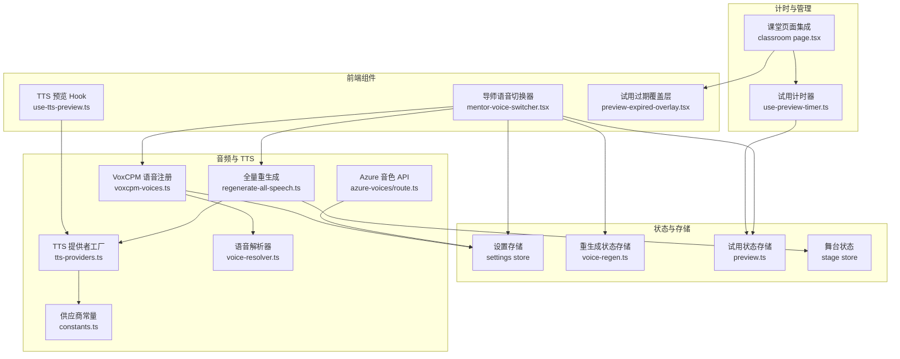
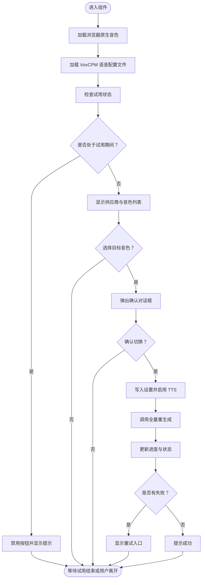
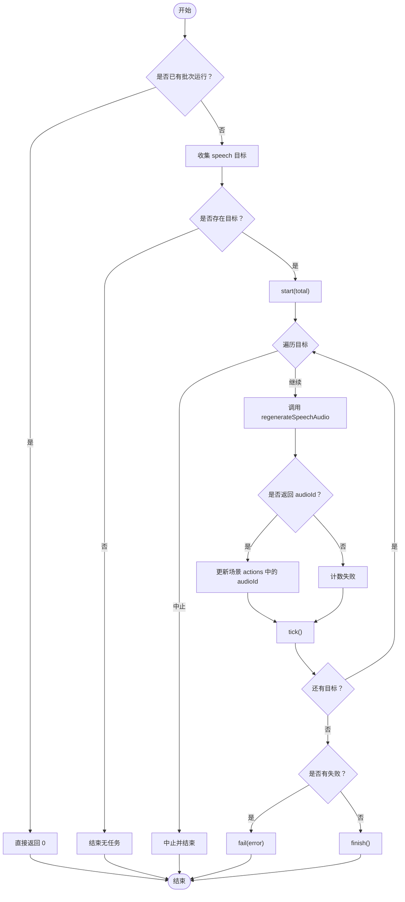
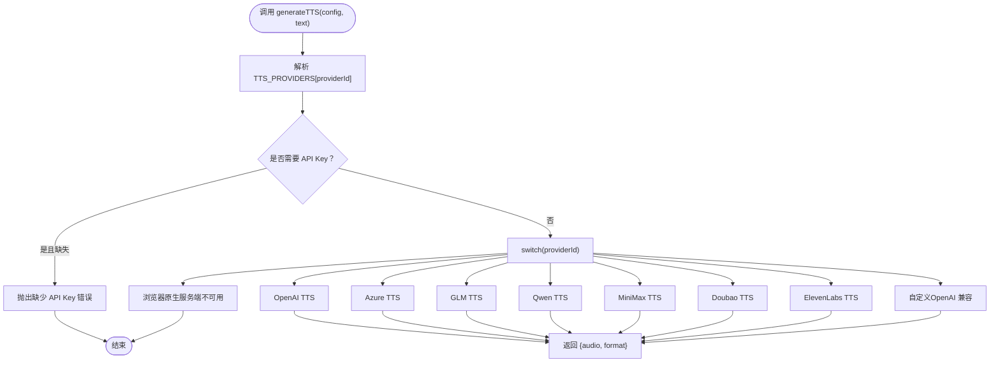
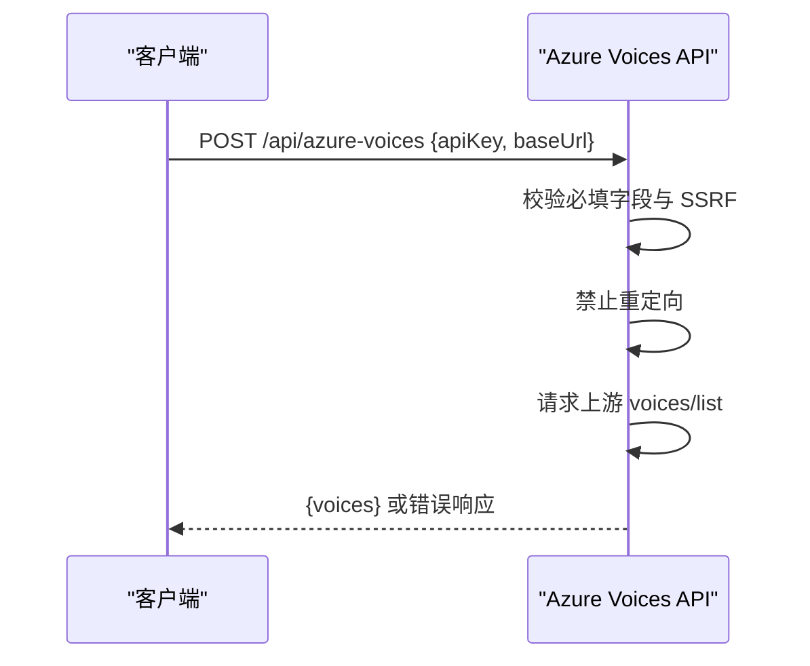
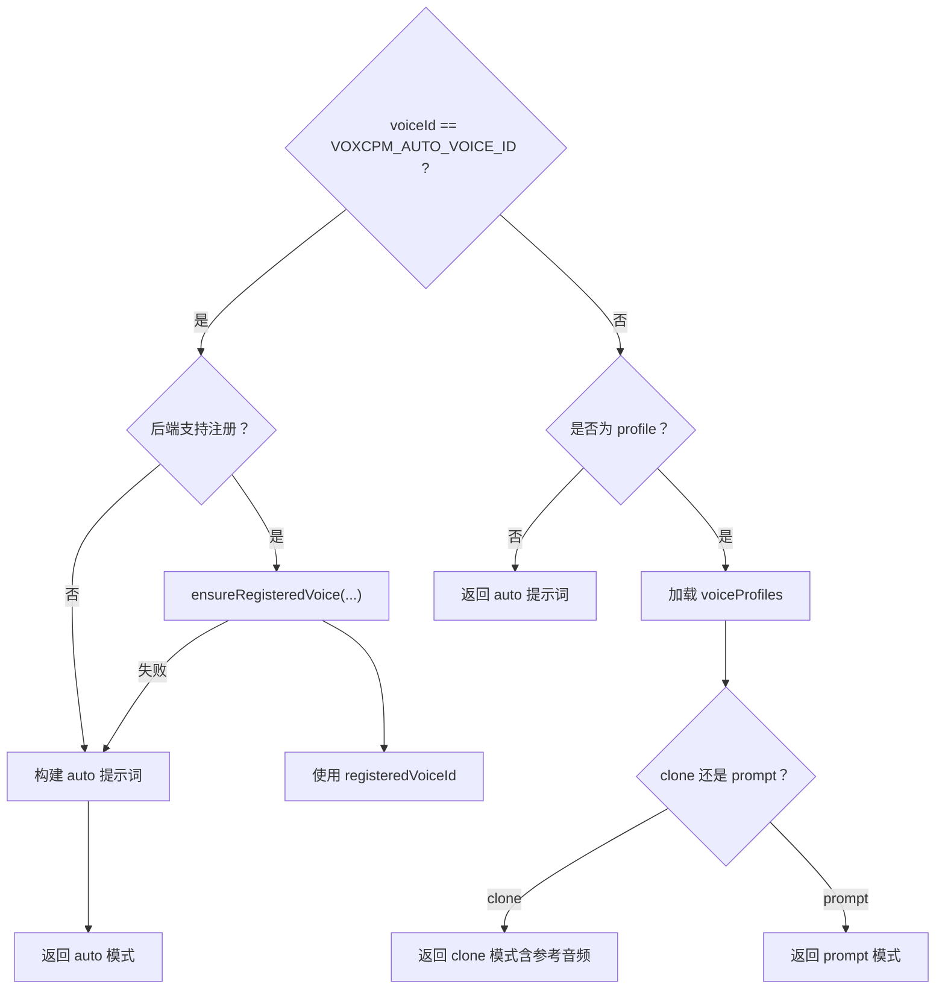
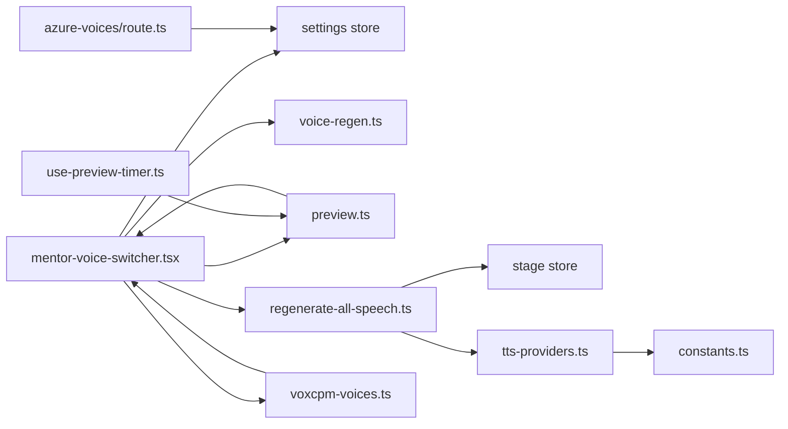

# 导师语音切换器组件

<cite>
**本文引用的文件**   
- [components/stage/mentor-voice-switcher.tsx](file://components/stage/mentor-voice-switcher.tsx)
- [lib/store/preview.ts](file://lib/store/preview.ts)
- [lib/hooks/use-preview-timer.ts](file://lib/hooks/use-preview-timer.ts)
- [components/preview-expired-overlay.tsx](file://components/preview-expired-overlay.tsx)
- [app/classroom/[id]/page.tsx](file://app/classroom/[id]/page.tsx)
- [lib/audio/regenerate-all-speech.ts](file://lib/audio/regenerate-all-speech.ts)
- [lib/store/voice-regen.ts](file://lib/store/voice-regen.ts)
- [lib/audio/tts-providers.ts](file://lib/audio/tts-providers.ts)
- [lib/audio/constants.ts](file://lib/audio/constants.ts)
- [app/api/azure-voices/route.ts](file://app/api/azure-voices/route.ts)
- [lib/audio/use-tts-preview.ts](file://lib/audio/use-tts-preview.ts)
- [lib/audio/voxcpm-voices.ts](file://lib/audio/voxcpm-voices.ts)
- [lib/audio/voxcpm.ts](file://lib/audio/voxcpm.ts)
- [lib/audio/voice-resolver.ts](file://lib/audio/voice-resolver.ts)
</cite>

## 更新摘要
**所做更改**   
- 增强了 VoxCPM 语音配置文件集成，通过新的 useVoxCPMVoiceProfiles hook 实现自动语音检测和选择
- 改进了 VOXCPM_AUTO_VOICE_ID 的处理逻辑，正确显示本地化的"自动音色"文本而不是原始 ID
- 优化了无可用语音时的用户体验，显示有用的提示指导用户配置 TTS 服务
- 增强了错误处理和用户反馈机制，提供更好的交互体验
- 集成了更智能的语音解析和选择算法

## 产品概述
MentorVoiceSwitcher（导师语音切换器）是课堂头部用于为 AI 导师选择朗读音色的交互组件。其核心价值在于：
- 提供多 TTS 供应商与多音色的集中选择界面，支持当前音色标识与即时预览。
- 在切换音色后触发"全部讲课音频重生成"，确保播放路径读取到新合成的音频。
- 通过状态管理统一控制重生成进度、防重复触发与错误重试，提升用户体验。
- **新增试用限制功能**：在免费试看期间自动禁用语音切换，避免产生不必要的 API 费用。
- 与 TTS 服务集成，支持多种后端（OpenAI、Azure、GLM、Qwen、MiniMax、Doubao、ElevenLabs、浏览器原生等），并具备语音注册与个性化能力（如 VoxCPM）。
- **增强的 VoxCPM 集成**：通过 useVoxCPMVoiceProfiles hook 实现自动语音检测、智能选择和配置文件管理。

适用场景：
- 课堂中快速更换导师音色，保证讲解音频一致性与可听性。
- 教师或管理员在设置中配置不同 TTS 供应商与模型，并在课堂内即时生效。
- 需要预览某段文本的语音效果，以评估音色与语速是否合适。
- **免费用户可在10分钟试看期内体验基础功能，但无法进行语音切换操作。**
- **智能语音选择**：系统自动检测可用的 VoxCPM 语音配置文件并提供最佳匹配。

## 核心业务流程
- 用户点击"导师语音"按钮，弹出 Popover 展示可用供应商与音色列表。
- **试用限制检查**：如果处于免费试看期间，按钮被禁用并显示提示信息。
- **智能语音检测**：系统自动加载 VoxCPM 语音配置文件，提供自动音色选项。
- 用户选择目标音色后，弹出确认对话框，明确告知将重新合成全部讲课音频及其耗时影响。
- 确认后，组件写入新的 providerId、voiceId、modelId（如有），启用 TTS，并调用批量重生成流程。
- 重生成过程中，按钮显示进度（已完成/总数），并禁用重复触发；完成后给出成功或失败反馈。
- 若重生成失败，出现重试入口，允许按当前音色再次尝试。

**章节来源**
- [components/stage/mentor-voice-switcher.tsx:43-241](file://components/stage/mentor-voice-switcher.tsx#L43-L241)
- [lib/store/preview.ts:1-23](file://lib/store/preview.ts#L1-L23)
- [lib/hooks/use-preview-timer.ts:1-97](file://lib/hooks/use-preview-timer.ts#L1-L97)
- [lib/audio/regenerate-all-speech.ts:1-102](file://lib/audio/regenerate-all-speech.ts#L1-L102)
- [lib/store/voice-regen.ts:1-44](file://lib/store/voice-regen.ts#L1-L44)

## 试用限制功能

### 试用计时器系统
试用限制功能通过独立的计时器系统实现，确保在免费试看期间禁止语音切换操作：

- **10分钟免费试看**：每个课堂页面提供10分钟的免费体验时间
- **localStorage持久化**：记录首次访问时间，支持跨会话恢复
- **自动状态同步**：试用状态通过 usePreviewStore 全局管理
- **智能重置机制**：过期后重新进入课堂可获得完整新一轮试看

### 试用过期处理
当试用时间结束时，系统会显示覆盖层阻止进一步使用：

- **全屏覆盖**：黑色半透明背景覆盖整个页面
- **倒计时显示**：显示下次可开始试看的剩余时间
- **返回引导**：提供返回课程页的选项，便于重新开始试看
- **优雅降级**：localStorage不可用时静默降级，不阻断功能

**图表来源**
- [lib/hooks/use-preview-timer.ts:24-97](file://lib/hooks/use-preview-timer.ts#L24-L97)
- [components/preview-expired-overlay.tsx:18-75](file://components/preview-expired-overlay.tsx#L18-L75)

**章节来源**
- [lib/store/preview.ts:1-23](file://lib/store/preview.ts#L1-L23)
- [lib/hooks/use-preview-timer.ts:1-97](file://lib/hooks/use-preview-timer.ts#L1-L97)
- [components/preview-expired-overlay.tsx:1-75](file://components/preview-expired-overlay.tsx#L1-L75)
- [app/classroom/[id]/page.tsx:40-41](file://app/classroom/[id]/page.tsx#L40-L41)
- [app/classroom/[id]/page.tsx:213-218](file://app/classroom/[id]/page.tsx#L213-L218)

## 功能模块清单
- 导师语音切换器 UI（Popover + AlertDialog）
  - 职责：展示供应商与音色分组、当前音色标识、切换确认、失败重试入口。
  - **增强功能**：集成 useVoxCPMVoiceProfiles hook，支持自动语音检测和选择
  - **智能显示**：正确处理 VOXCPM_AUTO_VOICE_ID，显示本地化的"自动音色"文本
  - **用户体验优化**：无可用音色时显示详细提示和指导信息
  - **试用状态检测**：在试用期间禁用按钮并显示提示信息
  - 验收要点：无可用音色时显示提示；进行中禁用重复触发；完成/失败均有 toast 反馈；试用期间显示禁用提示。
- 试用限制管理系统
  - 职责：管理免费试看计时、状态同步、过期处理。
  - 验收要点：10分钟计时准确；localStorage持久化可靠；过期覆盖层正常显示。
- 全量重生成逻辑
  - 职责：收集课堂内所有 speech 动作，逐句调用 TTS 合成，写回规范 audioId，更新场景 actions。
  - 验收要点：支持中止信号；统计失败数；与语言指令保持一致。
- 重生成状态存储
  - 职责：维护 running/done/total/error 生命周期，供 UI 与播放路径门控。
  - 验收要点：start/tick/finish/fail/clearError 行为正确；不持久化。
- TTS 提供者工厂与实现
  - 职责：根据 providerId 路由到具体实现，处理鉴权、参数映射、格式解析与错误处理。
  - 验收要点：内置供应商覆盖 OpenAI/Azure/GLM/Qwen/MiniMax/Doubao/ElevenLabs/浏览器原生；自定义兼容 OpenAI 风格。
- Azure 音色列表 API
  - 职责：服务端代理获取 Azure 可用音色，进行 SSRF 校验与重定向防护。
  - 验收要点：缺失必填字段返回错误；上游错误透传；禁止重定向。
- TTS 预览 Hook
  - 职责：支持浏览器原生与 API 两种预览方式，管理音频对象 URL、取消与清理。
  - 验收要点：abort 错误吞掉；非 abort 错误抛出；播放结束自动重置状态。
- **增强的 VoxCPM 语音注册与个性化**
  - 职责：支持"自动音色"注册、提示词音色与克隆音色管理，持久化至 IndexedDB。
  - **新特性**：通过 useVoxCPMVoiceProfiles hook 实现自动检测和选择
  - **智能回退**：自动模式优先尝试注册，失败回退到 inline prompt
  - **配置文件管理**：支持增删改查与变更通知，实时更新 UI
  - 验收要点：自动模式优先尝试注册，失败回退到 inline prompt；支持参考音频规范化与大小限制。

**章节来源**
- [components/stage/mentor-voice-switcher.tsx:43-241](file://components/stage/mentor-voice-switcher.tsx#L43-L241)
- [lib/store/preview.ts:1-23](file://lib/store/preview.ts#L1-L23)
- [lib/hooks/use-preview-timer.ts:1-97](file://lib/hooks/use-preview-timer.ts#L1-L97)
- [components/preview-expired-overlay.tsx:1-75](file://components/preview-expired-overlay.tsx#L1-L75)
- [lib/audio/regenerate-all-speech.ts:1-102](file://lib/audio/regenerate-all-speech.ts#L1-L102)
- [lib/store/voice-regen.ts:1-44](file://lib/store/voice-regen.ts#L1-L44)
- [lib/audio/tts-providers.ts:145-193](file://lib/audio/tts-providers.ts#L145-L193)
- [app/api/azure-voices/route.ts:1-69](file://app/api/azure-voices/route.ts#L1-L69)
- [lib/audio/use-tts-preview.ts:1-161](file://lib/audio/use-tts-preview.ts#L1-L161)
- [lib/audio/voxcpm-voices.ts:159-339](file://lib/audio/voxcpm-voices.ts#L159-L339)

## 数据与状态
- 设置存储（Settings Store）
  - 关键字段：ttsProviderId、ttsVoice、ttsSpeed、ttsProvidersConfig、ttsEnabled。
  - 作用：保存当前 TTS 供应商、音色、速度与供应商配置；切换时先设 provider 再设 voice，最后启用 TTS。
- 重生成状态（VoiceRegen Store）
  - 关键字段：running、done、total、error。
  - 作用：描述一次重生成批次的生命周期，UI 与播放路径据此门控。
- **试用状态存储（Preview Store）**
  - 关键字段：isTrial、setIsTrial。
  - 作用：管理免费试看期间的状态，控制语音切换功能的可用性。
- 舞台状态（Stage Store）
  - 作用：保存场景与 actions，重生成成功后写回每个 speech 动作的规范 audioId，确保播放路径命中新音频。
- TTS 配置构造
  - getCurrentTTSConfig：从 Settings Store 组装 providerId、modelId、apiKey、baseUrl、voice、speed，供 TTS 调用。
- 供应商与音色常量
  - TTS_PROVIDERS：定义各供应商元数据、默认模型、可用音色、支持格式与语速范围。
- Azure 音色列表
  - 服务端 POST /api/azure-voices：接收 apiKey 与 baseUrl，拉取 voices 列表并返回。
- **VoxCPM 语音配置文件**
  - 通过 useVoxCPMVoiceProfiles hook 管理，支持自动音色、提示词音色和克隆音色
  - 持久化存储在 IndexedDB，支持实时同步和变更通知

```mermaid
classDiagram
class MentorVoiceSwitcher {
+popoverOpen : boolean
+pendingVoice : PendingVoice | null
+browserVoices : SpeechSynthesisVoice[]
+isTrial : boolean
+applyVoiceAndRegenerate(target)
+handleRetry()
}
class PreviewStore {
+isTrial : boolean
+setIsTrial(v)
}
class VoiceRegenStore {
+running : boolean
+done : number
+total : number
+error : string | null
+start(total)
+tick()
+finish()
+fail(error)
+clearError()
}
class SettingsStore {
+ttsProviderId
+ttsVoice
+ttsSpeed
+ttsProvidersConfig
+setTTSProvider(id)
+setTTSVoice(voice)
+setTTSProviderConfig(id, cfg)
+setTTSEnabled(enabled)
}
class RegenerateAllSpeech {
+regenerateAllSpeech(signal?)
}
class TTSPROVIDERS {
+generateTTS(config, text)
+getCurrentTTSConfig()
}
class AzureVoicesAPI {
+POST(req)
}
class VoxCPMVoiceProfiles {
+profiles : Array
+loading : boolean
+refresh()
+addPromptVoice(input)
+addCloneVoice(input)
+deleteVoice(id)
}
MentorVoiceSwitcher --> PreviewStore : "读取试用状态"
MentorVoiceSwitcher --> SettingsStore : "读写配置"
MentorVoiceSwitcher --> VoiceRegenStore : "读取/更新状态"
MentorVoiceSwitcher --> RegenerateAllSpeech : "触发重生成"
MentorVoiceSwitcher --> VoxCPMVoiceProfiles : "获取语音配置文件"
RegenerateAllSpeech --> SettingsStore : "读取语言指令"
RegenerateAllSpeech --> TTSPROVIDERS : "逐句合成"
AzureVoicesAPI --> SettingsStore : "读取配置间接"
```

**图表来源**
- [components/stage/mentor-voice-switcher.tsx:43-241](file://components/stage/mentor-voice-switcher.tsx#L43-L241)
- [lib/store/preview.ts:13-22](file://lib/store/preview.ts#L13-L22)
- [lib/store/voice-regen.ts:1-44](file://lib/store/voice-regen.ts#L1-L44)
- [lib/audio/regenerate-all-speech.ts:1-102](file://lib/audio/regenerate-all-speech.ts#L1-L102)
- [lib/audio/tts-providers.ts:821-843](file://lib/audio/tts-providers.ts#L821-L843)
- [app/api/azure-voices/route.ts:1-69](file://app/api/azure-voices/route.ts#L1-L69)
- [lib/audio/voxcpm-voices.ts:190-279](file://lib/audio/voxcpm-voices.ts#L190-L279)

**章节来源**
- [lib/audio/tts-providers.ts:821-843](file://lib/audio/tts-providers.ts#L821-L843)
- [lib/audio/constants.ts:81-200](file://lib/audio/constants.ts#L81-L200)
- [app/api/azure-voices/route.ts:1-69](file://app/api/azure-voices/route.ts#L1-L69)
- [lib/store/preview.ts:1-23](file://lib/store/preview.ts#L1-L23)

## 关键约束与边界
- 切换音色必须重生成全部讲课音频：由于音频预生成缓存，切换后需逐句合成才能生效；交互上通过确认框明确耗时影响。
- **试用限制约束**：免费试看期间（10分钟）完全禁用语音切换功能，防止产生不必要的 API 费用。
- 并发与幂等：重生成进行中禁止重复触发；使用 AbortSignal 支持中断。
- 播放门控：播放路径读取 running 状态，避免重生成期间播放旧音频。
- 供应商兼容性：
  - 浏览器原生 TTS 仅客户端可用，服务器端不可用。
  - 自定义供应商遵循 OpenAI 兼容接口。
  - Azure 音色列表需校验 baseUrl 与密钥，禁止重定向。
- 多语言与个性化：
  - 语言指令来自舞台 languageDirective，与生成管线一致。
  - VoxCPM 支持自动音色注册、提示词音色与克隆音色，参考音频需规范化且不超过大小限制。
- 错误处理：
  - TTS 错误包含速率限制与上游错误信息；部分供应商返回特定错误码需特殊处理（如 Doubao 流式 JSON 拼接）。
  - 预览 Hook 对 abort 错误吞掉，其他错误抛出给调用方。
- **试用过期处理**：试用结束后显示覆盖层，引导用户返回课程页重新开始试看。
- **智能语音选择**：系统自动检测可用的 VoxCPM 语音配置文件，提供最佳匹配选项。

**章节来源**
- [lib/audio/regenerate-all-speech.ts:1-102](file://lib/audio/regenerate-all-speech.ts#L1-L102)
- [lib/audio/tts-providers.ts:145-193](file://lib/audio/tts-providers.ts#L145-L193)
- [lib/audio/use-tts-preview.ts:1-161](file://lib/audio/use-tts-preview.ts#L1-L161)
- [lib/audio/voxcpm-voices.ts:159-339](file://lib/audio/voxcpm-voices.ts#L159-L339)
- [app/api/azure-voices/route.ts:1-69](file://app/api/azure-voices/route.ts#L1-L69)
- [lib/store/preview.ts:1-23](file://lib/store/preview.ts#L1-L23)
- [lib/hooks/use-preview-timer.ts:1-97](file://lib/hooks/use-preview-timer.ts#L1-L97)

## 架构总览

**图表来源**
- [components/stage/mentor-voice-switcher.tsx:43-241](file://components/stage/mentor-voice-switcher.tsx#L43-L241)
- [lib/audio/use-tts-preview.ts:1-161](file://lib/audio/use-tts-preview.ts#L1-L161)
- [components/preview-expired-overlay.tsx:1-75](file://components/preview-expired-overlay.tsx#L1-L75)
- [lib/audio/regenerate-all-speech.ts:1-102](file://lib/audio/regenerate-all-speech.ts#L1-L102)
- [lib/audio/tts-providers.ts:145-193](file://lib/audio/tts-providers.ts#L145-L193)
- [lib/audio/constants.ts:81-200](file://lib/audio/constants.ts#L81-L200)
- [app/api/azure-voices/route.ts:1-69](file://app/api/azure-voices/route.ts#L1-L69)
- [lib/audio/voxcpm-voices.ts:159-339](file://lib/audio/voxcpm-voices.ts#L159-L339)
- [lib/audio/voice-resolver.ts:262-291](file://lib/audio/voice-resolver.ts#L262-L291)
- [lib/hooks/use-preview-timer.ts:1-97](file://lib/hooks/use-preview-timer.ts#L1-L97)
- [app/classroom/[id]/page.tsx:40-41](file://app/classroom/[id]/page.tsx#L40-L41)

## 详细组件分析

### 导师语音切换器（MentorVoiceSwitcher）
- 交互流程：
  - 打开 Popover 展示供应商与音色分组；当前音色高亮。
  - **试用状态检查**：在试用期间禁用按钮并显示提示信息。
  - **VoxCPM 语音检测**：通过 useVoxCPMVoiceProfiles hook 自动加载语音配置文件。
  - 选择音色后弹出确认对话框，说明重生成影响。
  - 确认后写入设置并触发重生成；进行中显示进度与禁用按钮。
  - 失败时显示重试入口，点击后清除错误并重试。
- 数据同步：
  - 使用 Settings Store 的 setTTSProvider/setTTSVoice/setTTSProviderConfig/setTTSEnabled。
  - 使用 VoiceRegen Store 的 running/done/total/error 控制 UI 与播放门控。
  - **试用状态读取**：通过 usePreviewStore 的 isTrial 状态控制按钮可用性。
  - **VoxCPM 集成**：通过 useVoxCPMVoiceProfiles 获取语音配置文件，支持自动音色选项。
- 可用性：
  - 无可用音色时显示提示；支持浏览器原生音色动态加载。
  - **试用期间完全禁用语音切换功能**。
  - **智能显示**：VOXCPM_AUTO_VOICE_ID 显示为本地化的"自动音色"文本。

**图表来源**
- [components/stage/mentor-voice-switcher.tsx:43-241](file://components/stage/mentor-voice-switcher.tsx#L43-L241)

**章节来源**
- [components/stage/mentor-voice-switcher.tsx:43-241](file://components/stage/mentor-voice-switcher.tsx#L43-L241)

### 试用限制管理系统
- **计时器实现**：
  - 10分钟免费试看窗口，通过 localStorage 持久化首次访问时间。
  - 每秒更新倒计时状态，支持过期检测和状态同步。
  - 智能重置机制：过期后重新进入课堂可获得完整新一轮试看。
- **状态管理**：
  - usePreviewStore 提供全局试用状态管理。
  - setIsTrial 方法由计时器 Hook 调用，同步试用状态。
  - 组件卸载时自动清理状态和定时器。
- **UI 集成**：
  - 试用期间按钮禁用，title 显示禁用提示。
  - Popover 在试用期间保持关闭状态。
  - 重试按钮在试用期间隐藏。

**图表来源**
- [lib/hooks/use-preview-timer.ts:24-97](file://lib/hooks/use-preview-timer.ts#L24-L97)
- [lib/store/preview.ts:13-22](file://lib/store/preview.ts#L13-L22)
- [components/stage/mentor-voice-switcher.tsx:125-131](file://components/stage/mentor-voice-switcher.tsx#L125-L131)

**章节来源**
- [lib/hooks/use-preview-timer.ts:1-97](file://lib/hooks/use-preview-timer.ts#L1-L97)
- [lib/store/preview.ts:1-23](file://lib/store/preview.ts#L1-L23)
- [components/stage/mentor-voice-switcher.tsx:61](file://components/stage/mentor-voice-switcher.tsx#L61)

### 试用过期覆盖层
- **视觉设计**：
  - 全屏黑色半透明覆盖层，z-index 最高确保遮挡所有内容。
  - 琥珀色主题配色，符合警告和限制的视觉语义。
  - 圆角卡片设计，现代感强且易于阅读。
- **功能特性**：
  - 实时倒计时显示，精确到秒级。
  - 返回课程页链接，支持外部 URL 配置。
  - 关闭页面选项，适用于无返回链接的场景。
  - 友好提示信息，指导用户如何重新开始试看。
- **用户体验**：
  - 清晰的视觉层次和信息传达。
  - 明确的行动号召和操作指引。
  - 优雅的过渡动画和交互反馈。

**章节来源**
- [components/preview-expired-overlay.tsx:1-75](file://components/preview-expired-overlay.tsx#L1-L75)
- [app/classroom/[id]/page.tsx:213-218](file://app/classroom/[id]/page.tsx#L213-L218)

### 全量重生成逻辑（regenerateAllSpeech）
- 收集目标：遍历 stage.scenes 中类型为 speech 的动作，提取 sceneId/order/actionId/text。
- 执行合成：逐句调用 regenerateSpeechAudio（内部走 generateAndStoreTTS，读取全局 settings.ttsVoice）。
- 写回结果：成功后将规范 audioId 写回 actions，确保播放路径命中新音频。
- 状态管理：start(total) → tick() → finish()/fail(error)。

**图表来源**
- [lib/audio/regenerate-all-speech.ts:1-102](file://lib/audio/regenerate-all-speech.ts#L1-L102)

**章节来源**
- [lib/audio/regenerate-all-speech.ts:1-102](file://lib/audio/regenerate-all-speech.ts#L1-L102)

### TTS 提供者工厂与实现
- 路由机制：generateTTS 根据 providerId 分发到具体实现。
- 内置供应商：OpenAI、Azure、GLM、Qwen、MiniMax、Doubao、ElevenLabs、浏览器原生。
- 自定义供应商：兼容 OpenAI 风格接口。
- 错误处理：速率限制检测、上游错误透传、浏览器原生在服务端不可用。

**图表来源**
- [lib/audio/tts-providers.ts:145-193](file://lib/audio/tts-providers.ts#L145-L193)

**章节来源**
- [lib/audio/tts-providers.ts:145-193](file://lib/audio/tts-providers.ts#L145-L193)

### Azure 音色列表 API
- 输入：apiKey、baseUrl。
- 校验：SSRF 校验、禁止重定向。
- 输出：voices 列表或错误响应。

**图表来源**
- [app/api/azure-voices/route.ts:1-69](file://app/api/azure-voices/route.ts#L1-L69)

**章节来源**
- [app/api/azure-voices/route.ts:1-69](file://app/api/azure-voices/route.ts#L1-L69)

### TTS 预览 Hook（useTTSPreview）
- 支持浏览器原生与 API 两种预览方式。
- 管理音频对象 URL、取消与清理，abort 错误吞掉，其他错误抛出。
- 播放结束自动重置状态。

**图表来源**
- [lib/audio/use-tts-preview.ts:1-161](file://lib/audio/use-tts-preview.ts#L1-L161)

**章节来源**
- [lib/audio/use-tts-preview.ts:1-161](file://lib/audio/use-tts-preview.ts#L1-L161)

### 增强的 VoxCPM 语音注册与个性化
- **自动音色**：优先尝试注册 registeredVoiceId，失败回退到 inline prompt。
- **提示词音色与克隆音色**：支持上传参考音频并规范化，限制大小。
- **持久化**：IndexedDB 存储 voiceProfiles，支持增删改查与变更通知。
- **useVoxCPMVoiceProfiles Hook**：
  - 自动加载语音配置文件，支持实时刷新和事件监听
  - 提供 addPromptVoice、addCloneVoice、deleteVoice 等方法
  - 管理 loading 状态，确保 UI 响应性
- **智能回退机制**：当自动注册失败时，自动回退到基于提示词的语音模式
- **配置文件优先级**：按更新时间排序，最新的配置文件优先显示

**图表来源**
- [lib/audio/voxcpm-voices.ts:159-339](file://lib/audio/voxcpm-voices.ts#L159-L339)

**章节来源**
- [lib/audio/voxcpm-voices.ts:159-339](file://lib/audio/voxcpm-voices.ts#L159-L339)

## 依赖分析
- 组件层：MentorVoiceSwitcher 依赖 Settings Store、VoiceRegen Store、Preview Store、regenerateAllSpeech。
- 音频层：regenerateAllSpeech 依赖 Stage Store 与 TTS Providers。
- 供应商层：TTS Providers 依赖 constants 与具体实现函数。
- 外部集成：Azure Voices API 作为服务端代理，校验与安全策略由服务端保障。
- **试用管理层**：usePreviewTimer 依赖 usePreviewStore 和 localStorage。
- **VoxCPM 管理层**：useVoxCPMVoiceProfiles 依赖 IndexedDB 和事件系统。

**图表来源**
- [components/stage/mentor-voice-switcher.tsx:43-241](file://components/stage/mentor-voice-switcher.tsx#L43-L241)
- [lib/audio/regenerate-all-speech.ts:1-102](file://lib/audio/regenerate-all-speech.ts#L1-L102)
- [lib/audio/tts-providers.ts:145-193](file://lib/audio/tts-providers.ts#L145-L193)
- [lib/audio/constants.ts:81-200](file://lib/audio/constants.ts#L81-L200)
- [app/api/azure-voices/route.ts:1-69](file://app/api/azure-voices/route.ts#L1-L69)
- [lib/hooks/use-preview-timer.ts:1-97](file://lib/hooks/use-preview-timer.ts#L1-L97)
- [lib/store/preview.ts:1-23](file://lib/store/preview.ts#L1-L23)
- [lib/audio/voxcpm-voices.ts:190-279](file://lib/audio/voxcpm-voices.ts#L190-L279)

**章节来源**
- [components/stage/mentor-voice-switcher.tsx:43-241](file://components/stage/mentor-voice-switcher.tsx#L43-L241)
- [lib/audio/regenerate-all-speech.ts:1-102](file://lib/audio/regenerate-all-speech.ts#L1-L102)
- [lib/audio/tts-providers.ts:145-193](file://lib/audio/tts-providers.ts#L145-L193)
- [lib/audio/constants.ts:81-200](file://lib/audio/constants.ts#L81-L200)
- [app/api/azure-voices/route.ts:1-69](file://app/api/azure-voices/route.ts#L1-L69)
- [lib/hooks/use-preview-timer.ts:1-97](file://lib/hooks/use-preview-timer.ts#L1-L97)
- [lib/store/preview.ts:1-23](file://lib/store/preview.ts#L1-L23)

## 性能考虑
- 重生成批量处理：逐句合成，避免一次性大请求；支持中止信号防止长时间阻塞。
- 状态门控：running 标志防止重复触发与脏播放，减少不必要的网络与渲染开销。
- **试用限制优化**：试用期间完全禁用语音切换，避免不必要的 API 调用和计算资源消耗。
- 预览优化：Object URL 及时释放，避免内存泄漏；abort 错误吞掉降低干扰。
- 供应商差异：部分供应商返回流式数据（如 Doubao），需高效拼接与解析。
- **计时器效率**：每秒更新倒计时，使用 setInterval 而非 requestAnimationFrame 平衡精度与性能。
- **VoxCPM 优化**：useVoxCPMVoiceProfiles 使用事件监听机制，避免频繁轮询；IndexedDB 查询优化。

## 故障排查指南
- 无法选择音色：检查 availableProviders 是否为空；确认浏览器原生音色加载与供应商配置。
- **试用期间无法切换**：检查 isTrial 状态是否正确；确认 usePreviewTimer 是否正常初始化。
- 切换无效：确认已启用 TTS 并成功写入 ttsProviderId/ttsVoice/modelId；检查重生成是否成功。
- 播放旧音频：确认 actions 中的 audioId 已更新；检查播放路径是否读取最新 state。
- 预览失败：检查 providerId 是否为 browser-native-tts；确认 API Key/BaseUrl 配置；查看错误消息。
- Azure 音色获取失败：检查 apiKey 与 baseUrl；确认 SSRF 校验与重定向策略。
- **试用计时异常**：检查 localStorage 是否可用；确认时间戳格式是否正确；验证过期逻辑。
- **覆盖层不显示**：检查 preview.expired 状态；确认组件渲染条件；验证样式冲突。
- **VoxCPM 语音不显示**：检查 useVoxCPMVoiceProfiles 是否正确加载；确认 IndexedDB 权限；验证配置文件格式。
- **自动音色不工作**：检查后端是否支持语音注册；确认 VOXCPM_AUTO_VOICE_ID 处理逻辑；验证提示词生成。

**章节来源**
- [components/stage/mentor-voice-switcher.tsx:43-241](file://components/stage/mentor-voice-switcher.tsx#L43-L241)
- [lib/audio/regenerate-all-speech.ts:1-102](file://lib/audio/regenerate-all-speech.ts#L1-L102)
- [lib/audio/use-tts-preview.ts:1-161](file://lib/audio/use-tts-preview.ts#L1-L161)
- [app/api/azure-voices/route.ts:1-69](file://app/api/azure-voices/route.ts#L1-L69)
- [lib/hooks/use-preview-timer.ts:1-97](file://lib/hooks/use-preview-timer.ts#L1-L97)
- [lib/store/preview.ts:1-23](file://lib/store/preview.ts#L1-L23)
- [lib/audio/voxcpm-voices.ts:190-279](file://lib/audio/voxcpm-voices.ts#L190-L279)

## 结论
MentorVoiceSwitcher 通过清晰的交互流程、稳健的状态管理与灵活的 TTS 集成，实现了导师音色的便捷切换与实时生效。**新增的试用限制功能有效防止了免费用户在试看期间产生不必要的 API 费用，同时提供了友好的用户体验和明确的升级引导。**结合全量重生成、预览与个性化能力，满足课堂场景中对语音质量与可定制性的要求。未来可扩展更多供应商与高级特性（如更细粒度的缓存策略与增量重生成），进一步提升性能与用户体验。

**增强的 VoxCPM 集成**通过 useVoxCPMVoiceProfiles hook 实现了智能化的语音检测和选择，为用户提供了更加流畅和智能的语音配置体验。自动音色功能能够根据 Agent 人设动态生成合适的语音提示词，而配置文件管理系统则确保了语音设置的持久化和实时同步。

试用限制功能的加入体现了系统在成本控制与用户体验之间的平衡考量，既保证了免费用户的合理使用权，又避免了恶意滥用导致的资源浪费。这种设计模式可以在其他需要限制的功能扩展中复用，为系统的商业化运营提供了良好的技术基础。

**智能语音选择**和**用户体验优化**的加入，使得导师语音切换器不仅是一个简单的音色选择工具，更是一个智能化的语音配置平台，能够满足不同用户的需求和使用场景。