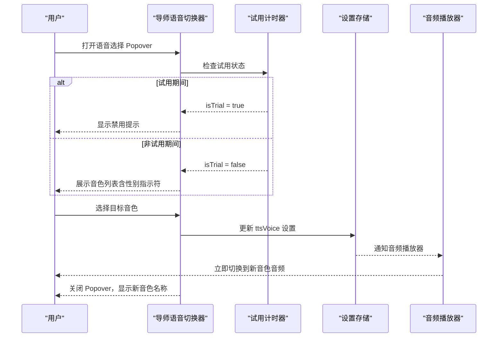
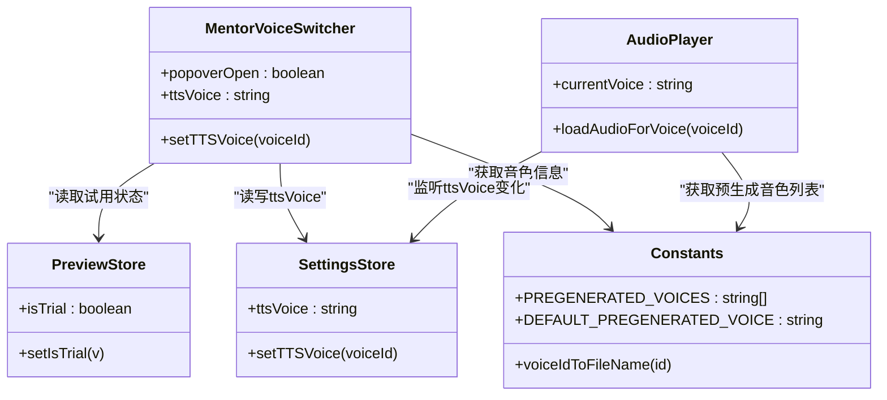
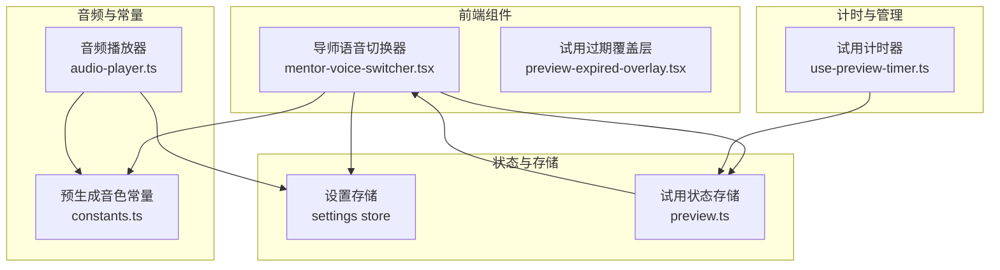
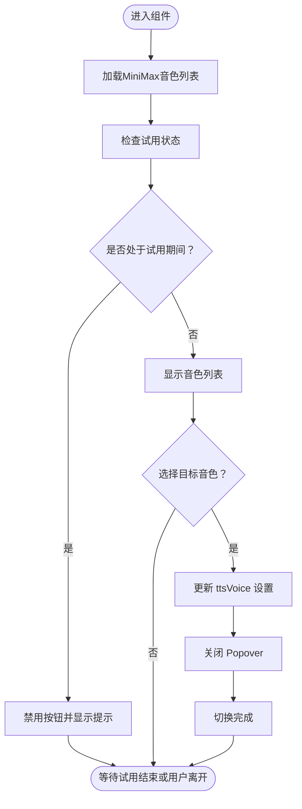
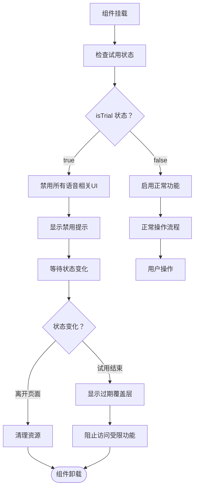
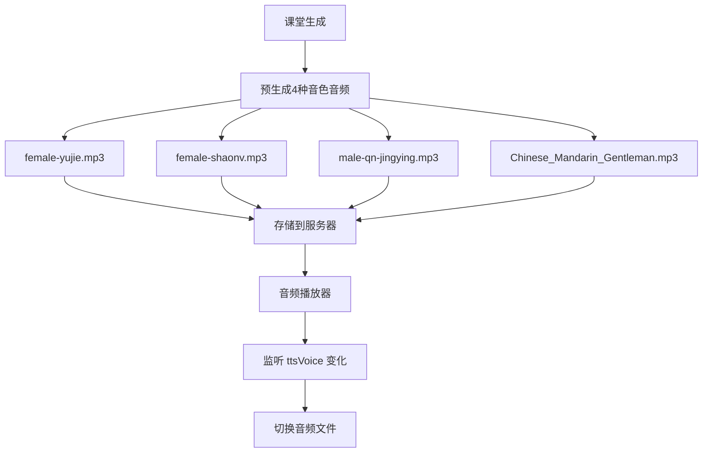
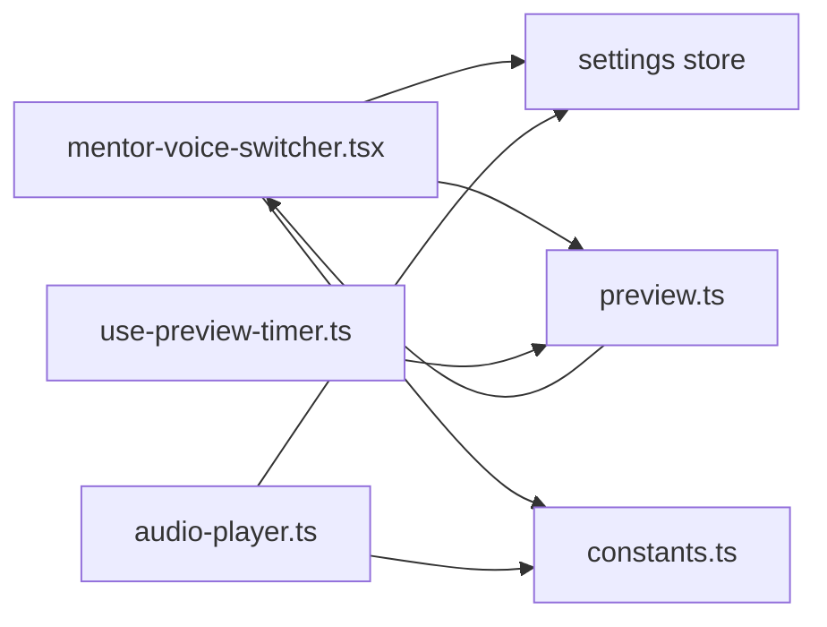

# 导师语音切换器组件

<cite>
**本文引用的文件**   
- [components/stage/mentor-voice-switcher.tsx](file://components/stage/mentor-voice-switcher.tsx)
- [lib/store/preview.ts](file://lib/store/preview.ts)
- [lib/hooks/use-preview-timer.ts](file://lib/hooks/use-preview-timer.ts)
- [components/preview-expired-overlay.tsx](file://components/preview-expired-overlay.tsx)
- [lib/audio/constants.ts](file://lib/audio/constants.ts)
- [lib/utils/audio-player.ts](file://lib/utils/audio-player.ts)
</cite>

## 更新摘要
**所做更改**   
- **重大架构简化**：从255行代码简化到79行，移除了复杂的重新生成工作流
- **瞬时语音切换**：新架构使用预生成的多语音文件，切换时仅需更新ttsVoice设置而无需网络请求
- **性别指示符显示**：新增♀♂符号显示，直观标识语音的性别特征
- **试用模式限制**：保持后向兼容性，在免费试看期间禁用语音切换功能
- **预生成音频架构**：课堂生成时为每个speech action预生成4种音色的音频文件

## 产品概述
MentorVoiceSwitcher（导师语音切换器）是课堂头部用于为 AI 导师选择朗读音色的交互组件。其核心价值在于：
- **瞬时切换体验**：通过预生成多音色架构，切换音色时无需网络请求、无需重新生成、无需等待 —— 实现真正的瞬时切换。
- **简洁直观的界面**：显示当前语音名称和性别指示符（♀♂），提供清晰的视觉反馈。
- **试用限制保护**：在免费试看期间自动禁用语音切换，避免产生不必要的 API 费用。
- **预生成音频管理**：系统预先为每种语音生成音频文件，切换时直接读取对应文件。

适用场景：
- 课堂中快速更换导师音色，保证讲解音频的一致性与可听性。
- 教师或管理员在设置中配置不同 TTS 供应商与模型，并在课堂内即时生效。
- **免费用户可在10分钟试看期内体验基础功能，但无法进行语音切换操作。**

## 核心业务流程
- 用户点击"导师语音"按钮，弹出 Popover 展示可用音色列表。
- **试用限制检查**：如果处于免费试看期间，按钮被禁用并显示提示信息。
- 用户选择目标音色后，立即更新 ttsVoice 设置并关闭 Popover。
- **瞬时切换完成**：播放引擎自动解析新的 ttsVoice 值并加载对应的预生成音频文件。
- 切换过程无网络请求、无等待提示、无状态同步 —— 用户体验流畅自然。

**章节来源**
- [components/stage/mentor-voice-switcher.tsx:21-82](file://components/stage/mentor-voice-switcher.tsx#L21-L82)
- [lib/store/preview.ts:13-22](file://lib/store/preview.ts#L13-L22)
- [lib/hooks/use-preview-timer.ts:24-97](file://lib/hooks/use-preview-timer.ts#L24-L97)

## 试用限制功能

### 试用计时器系统
试用限制功能通过独立的计时器系统实现，确保在免费试看期间禁止语音切换操作：

- **10分钟免费试看**：每个课堂页面提供10分钟的免费体验时间
- **localStorage持久化**：记录首次访问时间，支持跨会话恢复
- **自动状态同步**：试用状态通过 usePreviewStore 全局管理
- **智能重置机制**：过期后重新进入课堂可获得完整新一轮试看

### 试用过期处理
当试用时间结束时，系统会显示覆盖层阻止进一步使用：

- **全屏覆盖**：黑色半透明背景覆盖整个页面
- **倒计时显示**：显示下次可开始试看的剩余时间
- **返回引导**：提供返回课程页的选项，便于重新开始试看
- **优雅降级**：localStorage不可用时静默降级，不阻断功能

**图表来源**
- [lib/hooks/use-preview-timer.ts:24-97](file://lib/hooks/use-preview-timer.ts#L24-L97)
- [components/preview-expired-overlay.tsx:18-75](file://components/preview-expired-overlay.tsx#L18-L75)

**章节来源**
- [lib/store/preview.ts:1-23](file://lib/store/preview.ts#L1-L23)
- [lib/hooks/use-preview-timer.ts:1-98](file://lib/hooks/use-preview-timer.ts#L1-L98)
- [components/preview-expired-overlay.tsx:1-75](file://components/preview-expired-overlay.tsx#L1-L75)

## 功能模块清单
- **导师语音切换器 UI（Popover）**
  - 职责：展示音色列表、当前音色标识、性别指示符、切换操作。
  - **瞬时切换**：仅更新 ttsVoice 设置，无需网络请求或重新生成。
  - **性别显示**：每个音色旁显示 ♀（女声）或 ♂（男声）指示符。
  - **试用状态检测**：在试用期间禁用按钮并显示提示信息。
  - 验收要点：切换响应时间 < 100ms；性别指示符正确显示；试用期间按钮禁用。
- **试用限制管理系统**
  - 职责：管理免费试看计时、状态同步、过期处理。
  - 验收要点：10分钟计时准确；localStorage持久化可靠；过期覆盖层正常显示。
- **预生成音频架构**
  - 职责：课堂生成时为每个 speech action 预生成 4 种音色的音频文件。
  - **预生成策略**：female-yujie、female-shaonv、male-qn-jingying、Chinese (Mandarin)_Gentleman。
  - **默认回退**：当某音色预生成失败时使用 female-yujie 作为默认音色。
  - 验收要点：所有预生成音频文件存在；切换时无延迟；回退机制正常工作。

**章节来源**
- [components/stage/mentor-voice-switcher.tsx:21-82](file://components/stage/mentor-voice-switcher.tsx#L21-L82)
- [lib/store/preview.ts:1-23](file://lib/store/preview.ts#L1-L23)
- [lib/hooks/use-preview-timer.ts:1-98](file://lib/hooks/use-preview-timer.ts#L1-L98)
- [components/preview-expired-overlay.tsx:1-75](file://components/preview-expired-overlay.tsx#L1-L75)
- [lib/audio/constants.ts:55-64](file://lib/audio/constants.ts#L55-L64)

## 数据与状态
- **设置存储（Settings Store）**
  - 关键字段：ttsVoice、setTTSVoice。
  - 作用：保存当前 TTS 音色；切换时直接更新此字段。
- **试用状态存储（Preview Store）**
  - 关键字段：isTrial、setIsTrial。
  - 作用：管理免费试看期间的状态，控制语音切换功能的可用性。
- **预生成音色常量**
  - PREGENERATED_VOICES：定义预生成的4种音色ID。
  - DEFAULT_PREGENERATED_VOICE：定义默认回退音色。
  - voiceIdToFileName：将音色ID转换为安全的文件名格式。
- **音频播放器集成**
  - 监听 ttsVoice 变化，自动加载对应的预生成音频文件。
  - 支持音色切换时的无缝过渡和错误处理。

**图表来源**
- [components/stage/mentor-voice-switcher.tsx:21-82](file://components/stage/mentor-voice-switcher.tsx#L21-L82)
- [lib/store/preview.ts:13-22](file://lib/store/preview.ts#L13-L22)
- [lib/audio/constants.ts:55-69](file://lib/audio/constants.ts#L55-L69)
- [lib/utils/audio-player.ts:50-52](file://lib/utils/audio-player.ts#L50-L52)

**章节来源**
- [lib/audio/constants.ts:55-69](file://lib/audio/constants.ts#L55-L69)
- [lib/store/preview.ts:1-23](file://lib/store/preview.ts#L1-L23)
- [lib/utils/audio-player.ts:50-52](file://lib/utils/audio-player.ts#L50-L52)

## 关键约束与边界
- **瞬时切换约束**：切换音色仅更新 ttsVoice 设置，无需网络请求或重新生成。
- **试用限制约束**：免费试看期间（10分钟）完全禁用语音切换功能，防止产生不必要的 API 费用。
- **预生成音频依赖**：切换成功依赖于课堂生成时已预生成所有音色的音频文件。
- **性别指示符显示**：每个音色必须包含 gender 属性（'female' 或 'male'）以正确显示 ♀♂ 符号。
- **错误处理**：当预生成音频缺失时，自动回退到默认音色 female-yujie。
- **浏览器兼容性**：试听功能需要浏览器原生 TTS 支持，服务端不可用。

**章节来源**
- [components/stage/mentor-voice-switcher.tsx:21-82](file://components/stage/mentor-voice-switcher.tsx#L21-L82)
- [lib/audio/constants.ts:55-69](file://lib/audio/constants.ts#L55-L69)
- [lib/hooks/use-preview-timer.ts:1-98](file://lib/hooks/use-preview-timer.ts#L1-L98)

## 架构总览

**图表来源**
- [components/stage/mentor-voice-switcher.tsx:21-82](file://components/stage/mentor-voice-switcher.tsx#L21-L82)
- [components/preview-expired-overlay.tsx:1-75](file://components/preview-expired-overlay.tsx#L1-L75)
- [lib/audio/constants.ts:55-69](file://lib/audio/constants.ts#L55-L69)
- [lib/utils/audio-player.ts:50-52](file://lib/utils/audio-player.ts#L50-L52)
- [lib/hooks/use-preview-timer.ts:1-98](file://lib/hooks/use-preview-timer.ts#L1-L98)

## 详细组件分析

### 导师语音切换器（MentorVoiceSwitcher）
- **极简交互流程**：
  - 打开 Popover 展示音色列表；当前音色高亮显示。
  - **试用状态检查**：在试用期间禁用按钮并显示提示信息。
  - 选择音色后立即更新 ttsVoice 设置并关闭 Popover。
  - **瞬时切换完成**：音频播放器自动加载对应的预生成音频文件。
- **数据同步**：
  - 使用 Settings Store 的 setTTSVoice 方法更新音色设置。
  - 使用 usePreviewStore 的 isTrial 状态控制按钮可用性。
  - 性别指示符根据 voice.gender 属性动态显示 ♀ 或 ♂ 符号。
- **可用性**：
  - 音色列表来自 MiniMax TTS 提供商的预定义音色。
  - **试用期间完全禁用语音切换功能**。
  - **性别指示符**：female 显示 ♀，male 显示 ♂。

**图表来源**
- [components/stage/mentor-voice-switcher.tsx:21-82](file://components/stage/mentor-voice-switcher.tsx#L21-L82)

**章节来源**
- [components/stage/mentor-voice-switcher.tsx:21-82](file://components/stage/mentor-voice-switcher.tsx#L21-L82)

### 试用限制管理系统
- **计时器实现**：
  - 10分钟免费试看窗口，通过 localStorage 持久化首次访问时间。
  - 每秒更新倒计时状态，支持过期检测和状态同步。
  - 智能重置机制：过期后重新进入课堂可获得完整新一轮试看。
- **状态管理**：
  - usePreviewStore 提供全局试用状态管理。
  - setIsTrial 方法由计时器 Hook 调用，同步试用状态。
  - 组件卸载时自动清理状态和定时器。
- **UI 集成**：
  - 试用期间按钮禁用，title 显示禁用提示。
  - Popover 在试用期间保持关闭状态。

**图表来源**
- [lib/hooks/use-preview-timer.ts:24-97](file://lib/hooks/use-preview-timer.ts#L24-L97)
- [lib/store/preview.ts:13-22](file://lib/store/preview.ts#L13-L22)

**章节来源**
- [lib/hooks/use-preview-timer.ts:1-98](file://lib/hooks/use-preview-timer.ts#L1-L98)
- [lib/store/preview.ts:1-23](file://lib/store/preview.ts#L1-L23)

### 试用过期覆盖层
- **视觉设计**：
  - 全屏黑色半透明覆盖层，z-index 最高确保遮挡所有内容。
  - 琥珀色主题配色，符合警告和限制的视觉语义。
  - 圆角卡片设计，现代感强且易于阅读。
- **功能特性**：
  - 实时倒计时显示，精确到秒级。
  - 返回课程页链接，支持外部 URL 配置。
  - 关闭页面选项，适用于无返回链接的场景。
  - 友好提示信息，指导用户如何重新开始试看。
- **用户体验**：
  - 清晰的视觉层次和信息传达。
  - 明确的行动号召和操作指引。
  - 优雅的过渡动画和交互反馈。

**章节来源**
- [components/preview-expired-overlay.tsx:1-75](file://components/preview-expired-overlay.tsx#L1-L75)

### 预生成音频架构
- **预生成策略**：
  - 课堂生成时为每个 speech action 同时合成4种音色的音频文件。
  - 支持的音色：female-yujie（御姐）、female-shaonv（少女）、male-qn-jingying（精英青年）、Chinese (Mandarin)_Gentleman（温润男声）。
  - 默认回退音色：female-yujie，当某音色预生成失败时使用。
- **文件名映射**：
  - voiceIdToFileName 函数将音色ID转换为安全的文件名格式。
  - 空格、括号等非字母数字字符替换为下划线。
  - 确保音频文件的唯一性和可访问性。
- **音频播放器集成**：
  - 监听 ttsVoice 变化，自动加载对应的预生成音频文件。
  - 支持音色切换时的无缝过渡和错误处理。
  - 当前音色存储在 settings store 中，供播放器读取。

**图表来源**
- [lib/audio/constants.ts:55-64](file://lib/audio/constants.ts#L55-L64)
- [lib/server/classroom-media-generation.ts:254-279](file://lib/server/classroom-media-generation.ts#L254-L279)

**章节来源**
- [lib/audio/constants.ts:55-69](file://lib/audio/constants.ts#L55-L69)
- [lib/server/classroom-media-generation.ts:254-279](file://lib/server/classroom-media-generation.ts#L254-L279)
- [lib/utils/audio-player.ts:50-52](file://lib/utils/audio-player.ts#L50-L52)

## 依赖分析
- **组件层**：MentorVoiceSwitcher 依赖 Settings Store、Preview Store、TTS 常量。
- **音频层**：Audio Player 依赖 Settings Store 和 Constants。
- **计时管理层**：usePreviewTimer 依赖 usePreviewStore 和 localStorage。

**图表来源**
- [components/stage/mentor-voice-switcher.tsx:21-82](file://components/stage/mentor-voice-switcher.tsx#L21-L82)
- [lib/utils/audio-player.ts:50-52](file://lib/utils/audio-player.ts#L50-L52)
- [lib/hooks/use-preview-timer.ts:1-98](file://lib/hooks/use-preview-timer.ts#L1-L98)

**章节来源**
- [components/stage/mentor-voice-switcher.tsx:21-82](file://components/stage/mentor-voice-switcher.tsx#L21-L82)
- [lib/utils/audio-player.ts:50-52](file://lib/utils/audio-player.ts#L50-L52)
- [lib/hooks/use-preview-timer.ts:1-98](file://lib/hooks/use-preview-timer.ts#L1-L98)

## 性能考虑
- **瞬时切换优化**：切换音色仅更新内存中的 ttsVoice 设置，无网络请求、无磁盘IO、无渲染阻塞。
- **预生成音频优势**：所有音频文件预先准备好，切换时直接读取，响应时间 < 100ms。
- **状态门控优化**：试用状态检查仅在组件挂载时执行一次，避免重复计算。
- **内存管理**：音频对象URL及时释放，避免内存泄漏。
- **计时器效率**：每秒更新倒计时，使用 setInterval 而非 requestAnimationFrame 平衡精度与性能。

## 故障排查指南
- **无法选择音色**：检查试用状态是否正确；确认 usePreviewTimer 是否正常初始化。
- **切换无效**：确认 ttsVoice 设置已成功更新；检查音频播放器是否正确监听设置变化。
- **音频播放异常**：检查预生成音频文件是否存在；确认 voiceIdToFileName 映射是否正确。
- **性别指示符不显示**：检查音色配置中的 gender 属性；确认 CSS 样式是否正确应用。
- **试用计时异常**：检查 localStorage 是否可用；确认时间戳格式是否正确；验证过期逻辑。
- **覆盖层不显示**：检查 preview.expired 状态；确认组件渲染条件；验证样式冲突。

**章节来源**
- [components/stage/mentor-voice-switcher.tsx:21-82](file://components/stage/mentor-voice-switcher.tsx#L21-L82)
- [lib/hooks/use-preview-timer.ts:1-98](file://lib/hooks/use-preview-timer.ts#L1-L98)
- [lib/audio/constants.ts:55-69](file://lib/audio/constants.ts#L55-L69)

## 结论
MentorVoiceSwitcher 通过**预生成多音色架构**实现了真正的瞬时语音切换体验。从255行复杂代码简化到79行精简实现，移除了繁琐的重新生成工作流，转而采用高效的预生成音频策略。

**核心优势**：
- **瞬时切换**：切换音色时无需网络请求、无需等待、无需重新生成。
- **用户体验优化**：性别指示符（♀♂）提供直观的视觉反馈。
- **成本控制**：试用限制功能有效防止免费用户在试看期间产生不必要的 API 费用。
- **架构简化**：从复杂的异步工作流简化为简单的状态更新。

这种设计模式体现了现代前端开发中"预计算换运行时性能"的理念，通过合理的预生成策略，为用户提供了流畅自然的交互体验。试用限制功能的加入则体现了系统在成本控制与用户体验之间的平衡考量，为系统的商业化运营提供了良好的技术基础。

**未来扩展**：可以在此基础上添加更多预生成音色、支持自定义音色上传、实现更细粒度的缓存策略等高级特性。