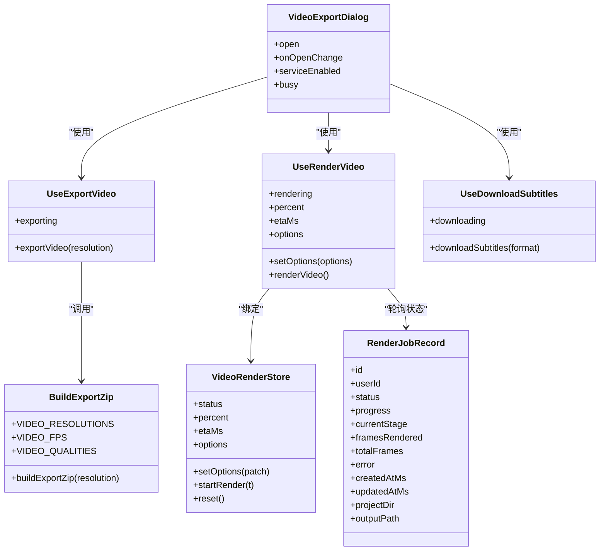

# 视频导出菜单组件

<cite>
**本文引用的文件**   
- [components/stage/video-export-dialog.tsx](file://components/stage/video-export-dialog.tsx)
- [lib/video-export-app/use-export-video.ts](file://lib/video-export-app/use-export-video.ts)
- [lib/video-export-app/use-render-video.ts](file://lib/video-export-app/use-render-video.ts)
- [lib/video-export-app/use-download-subtitles.ts](file://lib/video-export-app/use-download-subtitles.ts)
- [lib/store/video-render.ts](file://lib/store/video-render.ts)
- [lib/video-export-app/build-export-zip.ts](file://lib/video-export-app/build-export-zip.ts)
- [app/api/export-video/capability/route.ts](file://app/api/export-video/capability/route.ts)
- [app/api/export-video/render/route.ts](file://app/api/export-video/render/route.ts)
- [app/api/export-video/render/[jobId]/download/route.ts](file://app/api/export-video/render/[jobId]/download/route.ts)
- [components/ui/progress.tsx](file://components/ui/progress.tsx)
- [render-service/src/types.ts](file://render-service/src/types.ts)
</cite>

## 更新摘要
**所做更改**
- 移除了旧的下拉菜单组件 `video-export-menu.tsx`
- 新增了基于对话框的视频导出组件 `video-export-dialog.tsx`
- 更新了状态管理，使用全局存储 `useVideoRenderStore` 来管理渲染进度
- 增强了用户体验，提供稳定的生命周期和更好的进度显示
- 添加了字幕下载功能支持

## 产品概述
VideoExportDialog 是位于舞台头部导出菜单中的"视频导出"子模块，采用现代化的对话框界面设计，提供两条并行的导出路径：
- 渲染 MP4（在线服务）：在渲染服务可用时，上传项目 ZIP 到后端渲染服务，轮询任务进度，完成后下载 MP4。
- 下载 ZIP（降级路径）：始终可用，将当前课件打包为自包含的 Hyperframes 项目 ZIP，供本地 CLI 渲染。

该组件负责：
- 导出格式与质量设置（分辨率、帧率、质量档位）
- 能力探测与按钮显隐
- 实时进度展示与剩余时间估算
- 错误提示与用户反馈
- 与后端导出服务的交互流程（能力检测、提交渲染、下载产物）
- 字幕文件的独立下载功能

## 核心业务流程
- 能力探测：组件打开时调用 /api/export-video/capability，根据返回决定是否显示"渲染 MP4"。
- 参数选择：分辨率、帧率、质量三组单选按钮；忙态下禁用变更。
- 渲染 MP4：
  - 前端构建 ZIP（buildExportZip），通过 POST /api/export-video/render 上传，获取 jobId 与轮询间隔。
  - 前端按固定间隔轮询任务状态，更新进度条与 ETA。
  - 完成后通过 /api/export-video/render/[jobId]/download 流式下载 MP4。
- 下载 ZIP：直接在前端构建 ZIP 并触发浏览器下载，无需后端参与。
- 字幕下载：支持独立的 SRT/VTT 字幕文件下载，不依赖视频渲染。

```mermaid
sequenceDiagram
participant U as "用户"
participant VED as "VideoExportDialog"
participant API as "Next.js API"
participant RS as "渲染服务"
participant FS as "文件系统/OSS"
U->>VED : 打开视频导出对话框
VED->>API : GET /api/export-video/capability
API-->>VED : {enabled : true/false}
alt enabled=true
U->>VED : 选择分辨率/帧率/质量
U->>VED : 点击"渲染 MP4"
VED->>VED : buildExportZip(分辨率)
VED->>API : POST /api/export-video/render (multipart ZIP)
API->>RS : 转发上传 /render
RS-->>API : {jobId, pollIntervalMs}
API-->>VED : {jobId, pollIntervalMs}
loop 轮询
VED->>API : 查询任务状态
API->>RS : 查询进度
RS-->>API : {status, progress,...}
API-->>VED : 状态与进度
VED->>VED : 更新进度条/ETA
end
VED->>API : GET /api/export-video/render/[jobId]/download
API->>FS : 获取MP4或302直链
FS-->>API : 字节流/重定向
API-->>VED : 流式响应
VED-->>U : 浏览器自动下载MP4
else enabled=false
U->>VED : 点击"下载 ZIP"
VED->>VED : buildExportZip(分辨率)
VED-->>U : 浏览器下载ZIP
end
U->>VED : 点击"下载字幕"
VED->>VED : compileSubtitles()
VED-->>U : 浏览器下载SRT/VTT
end
```

**图表来源** 
- [components/stage/video-export-dialog.tsx:96-247](file://components/stage/video-export-dialog.tsx#L96-L247)
- [lib/video-export-app/use-export-video.ts:40-81](file://lib/video-export-app/use-export-video.ts#L40-L81)
- [lib/video-export-app/use-render-video.ts:16-35](file://lib/video-export-app/use-render-video.ts#L16-L35)
- [lib/video-export-app/use-download-subtitles.ts:27-67](file://lib/video-export-app/use-download-subtitles.ts#L27-L67)
- [lib/store/video-render.ts:120-271](file://lib/store/video-render.ts#L120-L271)

**章节来源**
- [components/stage/video-export-dialog.tsx:96-247](file://components/stage/video-export-dialog.tsx#L96-L247)
- [lib/video-export-app/use-export-video.ts:40-81](file://lib/video-export-app/use-export-video.ts#L40-L81)
- [lib/video-export-app/use-render-video.ts:16-35](file://lib/video-export-app/use-render-video.ts#L16-L35)
- [lib/video-export-app/use-download-subtitles.ts:27-67](file://lib/video-export-app/use-download-subtitles.ts#L27-L67)
- [lib/store/video-render.ts:120-271](file://lib/store/video-render.ts#L120-L271)

## 功能模块清单
- 视频导出对话框 UI（components/stage/video-export-dialog.tsx）
  - 职责：能力探测、参数选择、进度展示、按钮显隐、国际化文案、忙态控制。
  - 验收要点：无服务时仅显示"下载 ZIP"；有服务时显示"渲染 MP4"；忙态禁用选项；进度条与 ETA 实时更新。
- 本地 ZIP 导出 Hook（lib/video-export-app/use-export-video.ts）
  - 职责：封装 buildExportZip、Toast 提示、失败处理、并发保护。
  - 验收要点：无场景时报错；成功下载 ZIP；警告缺失资源与编译诊断数量。
- 在线渲染 Hook（lib/video-export-app/use-render-video.ts）
  - 职责：绑定全局渲染 Store，暴露 options、setOptions、startRender、percent、etaMs。
  - 验收要点：状态持久化跨组件；UI 可观察 rendering/percent/etaMs。
- 字幕下载 Hook（lib/video-export-app/use-download-subtitles.ts）
  - 职责：独立下载 SRT/VTT 字幕文件，不依赖视频渲染。
  - 验收要点：支持多种字幕格式；快速编译；错误处理完善。
- 全局渲染存储（lib/store/video-render.ts）
  - 职责：管理渲染状态、进度跟踪、ETA 计算、错误处理。
  - 验收要点：状态持久化；EMA 平滑算法；超时处理；降级机制。
- 构建 ZIP 管线（lib/video-export-app/build-export-zip.ts）
  - 职责：读取 store + Dexie → 编译 IR → 生成 Hyperframes 文本 → 收集资产 → 打包 ZIP。
  - 验收要点：支持分辨率枚举；抛出 NoScenesError；返回 zipBlob、stageName、missingCount、errorCount。
- 能力探测接口（app/api/export-video/capability/route.ts）
  - 职责：检查渲染服务健康，返回 enabled。
  - 验收要点：不泄露服务地址；未配置或未就绪返回 false。
- 渲染提交接口（app/api/export-video/render/route.ts）
  - 职责：校验请求体大小与类型，流式转发 multipart 到渲染服务，返回 jobId 与轮询间隔。
  - 验收要点：最大上传限制 300MB；超时 300s；错误码映射（429/413/502）。
- 下载接口（app/api/export-video/render/[jobId]/download/route.ts）
  - 职责：流式回传 MP4 或透传 302 直链。
  - 验收要点：仅对初始响应头设置超时，避免大文件截断。

**章节来源**
- [components/stage/video-export-dialog.tsx:96-247](file://components/stage/video-export-dialog.tsx#L96-L247)
- [lib/video-export-app/use-export-video.ts:40-81](file://lib/video-export-app/use-export-video.ts#L40-L81)
- [lib/video-export-app/use-render-video.ts:16-35](file://lib/video-export-app/use-render-video.ts#L16-L35)
- [lib/video-export-app/use-download-subtitles.ts:27-67](file://lib/video-export-app/use-download-subtitles.ts#L27-L67)
- [lib/store/video-render.ts:106-271](file://lib/store/video-render.ts#L106-L271)

## 数据与状态
- 导出选项
  - resolution：'720p'|'1080p'|'4k'（驱动快照宽度与渲染尺寸）
  - fps：24|30|60（仅 MP4 渲染有效）
  - quality：'draft'|'standard'|'high'（仅 MP4 渲染有效）
  - burnInSubtitles：boolean（是否将字幕烧录到视频中）
- 渲染任务状态（服务端可见）
  - status：'queued'|'running'|'succeeded'|'failed'|'cancelled'
  - progress：0..1（客户端缩放为百分比）
  - currentStage、framesRendered、totalFrames、error、createdAtMs、updatedAtMs、projectDir、outputPath
- 前端状态
  - exporting：本地 ZIP 导出进行中
  - rendering：在线渲染进行中（compiling/rendering）
  - percent、etaMs：进度与剩余时间
  - serviceEnabled：能力探测结果（true/false/undefined）
  - downloading：字幕下载进行中



**图表来源** 
- [components/stage/video-export-dialog.tsx:96-247](file://components/stage/video-export-dialog.tsx#L96-L247)
- [lib/video-export-app/use-export-video.ts:40-81](file://lib/video-export-app/use-export-video.ts#L40-L81)
- [lib/video-export-app/use-render-video.ts:16-35](file://lib/video-export-app/use-render-video.ts#L16-L35)
- [lib/video-export-app/use-download-subtitles.ts:27-67](file://lib/video-export-app/use-download-subtitles.ts#L27-L67)
- [lib/store/video-render.ts:106-271](file://lib/store/video-render.ts#L106-L271)

**章节来源**
- [lib/video-export-app/build-export-zip.ts:24-39](file://lib/video-export-app/build-export-zip.ts#L24-L39)
- [render-service/src/types.ts:25-41](file://render-service/src/types.ts#L25-L41)
- [lib/video-export-app/use-export-video.ts:40-81](file://lib/video-export-app/use-export-video.ts#L40-L81)
- [lib/video-export-app/use-render-video.ts:16-35](file://lib/video-export-app/use-render-video.ts#L16-L35)
- [lib/video-export-app/use-download-subtitles.ts:27-67](file://lib/video-export-app/use-download-subtitles.ts#L27-L67)
- [lib/store/video-render.ts:106-271](file://lib/store/video-render.ts#L106-L271)
- [components/stage/video-export-dialog.tsx:96-247](file://components/stage/video-export-dialog.tsx#L96-L247)

## 关键约束与边界
- 非功能性需求
  - 上传体积上限：300MB（POST /api/export-video/render）
  - 提交超时：300s（仅覆盖上传阶段，渲染异步）
  - 下载流式传输：仅对初始响应头设置超时，避免大文件被截断
  - 并发保护：本地 ZIP 导出使用模块级守卫，防止重复触发
- 依赖与集成边界
  - 能力探测仅返回布尔值，不泄露服务地址
  - 渲染服务未配置或未就绪时，仅显示"下载 ZIP"
  - 错误码映射：429 限流、413 过大、502 上游错误
- 业务约束
  - 无场景时抛出 NoScenesError，阻止导出
  - 分辨率影响快照宽度与渲染尺寸；fps/quality 仅对 MP4 有效
  - 进度条与 ETA 由服务端 progress 与客户端估算共同决定
  - 字幕下载独立于视频渲染，支持 SRT 和 VTT 格式

**章节来源**
- [app/api/export-video/render/route.ts:15-21](file://app/api/export-video/render/route.ts#L15-L21)
- [app/api/export-video/render/route.ts:52-59](file://app/api/export-video/render/route.ts#L52-L59)
- [app/api/export-video/render/route.ts:86-96](file://app/api/export-video/render/route.ts#L86-L96)
- [app/api/export-video/render/[jobId]/download/route.ts:20-30](file://app/api/export-video/render/[jobId]/download/route.ts#L20-30)
- [lib/video-export-app/build-export-zip.ts:56-67](file://lib/video-export-app/build-export-zip.ts#L56-67)
- [lib/video-export-app/use-export-video.ts:65-75](file://lib/video-export-app/use-export-video.ts#L65-75)
- [lib/video-export-app/use-download-subtitles.ts:31-67](file://lib/video-export-app/use-download-subtitles.ts#L31-67)
- [lib/store/video-render.ts:120-271](file://lib/store/video-render.ts#L120-271)

## 用户体验优化措施
- 取消操作
  - 当前实现未提供显式的"取消渲染"入口；可通过关闭对话框或切换场景中断 UI 观察。若需支持取消，可在渲染轮询中增加 AbortController 并在 UI 暴露取消按钮。
- 重试机制
  - 网络异常或上游错误时，建议在前端增加指数退避重试（如 3 次），并在达到阈值后提示用户稍后重试。
- 进度提示
  - 使用 Progress 组件展示百分比；当 etaMs 存在时显示"约 X 分 Y 秒"，提升等待预期管理。
  - 采用 EMA 平滑算法提供更准确的 ETA 估算。
- 降级路径
  - 渲染服务不可用时，自动降级为"下载 ZIP"，并提供简短提示，确保用户仍可继续工作。
- 防抖与忙态
  - 选项变更与按钮在忙态下禁用，避免重复提交；本地 ZIP 导出使用模块级守卫防止并发。
- 对话框稳定性
  - 对话框具有稳定的生命周期，长时间渲染过程中进度信息不会因菜单关闭而丢失。
- 字幕支持
  - 支持独立的字幕文件下载，用户可以在编辑器中添加字幕，提供更好的灵活性。

**章节来源**
- [components/ui/progress.tsx:8-29](file://components/ui/progress.tsx#L8-29)
- [components/stage/video-export-dialog.tsx:127-129](file://components/stage/video-export-dialog.tsx#L127-129)
- [components/stage/video-export-dialog.tsx:202-214](file://components/stage/video-export-dialog.tsx#L202-214)
- [lib/video-export-app/use-export-video.ts:38-38](file://lib/video-export-app/use-export-video.ts#L38-38)
- [lib/store/video-render.ts:35-46](file://lib/store/video-render.ts#L35-46)
- [lib/video-export-app/use-download-subtitles.ts:31-67](file://lib/video-export-app/use-download-subtitles.ts#L31-67)

## 实际使用示例与配置参数说明
- 基本用法
  - 在导出菜单中，用户选择分辨率、帧率、质量后点击"渲染 MP4"或"下载 ZIP"。
  - 渲染过程中，进度条与 ETA 实时更新；完成后自动下载 MP4。
  - 可选择下载独立的字幕文件（SRT/VTT 格式）。
- 配置参数
  - 分辨率：'720p' | '1080p' | '4k'（默认 1080p）
  - 帧率：24 | 30 | 60（仅 MP4）
  - 质量：'draft' | 'standard' | 'high'（仅 MP4）
  - 字幕烧录：boolean（默认关闭，支持侧边字幕文件）
- 错误处理
  - 无场景：提示"无可导出场景"
  - 上传过大：提示"导出包过大"
  - 服务不可用：降级为"下载 ZIP"
  - 上游错误：提示"渲染服务不可达"
  - 字幕为空：提示"无可导出的字幕内容"

**章节来源**
- [lib/video-export-app/build-export-zip.ts:24-39](file://lib/video-export-app/build-export-zip.ts#L24-39)
- [lib/video-export-app/use-export-video.ts:65-75](file://lib/video-export-app/use-export-video.ts#L65-75)
- [lib/video-export-app/use-download-subtitles.ts:31-67](file://lib/video-export-app/use-download-subtitles.ts#L31-67)
- [app/api/export-video/render/route.ts:52-59](file://app/api/export-video/render/route.ts#L52-59)
- [app/api/export-video/render/route.ts:86-96](file://app/api/export-video/render/route.ts#L86-96)
- [components/stage/video-export-dialog.tsx:218-241](file://components/stage/video-export-dialog.tsx#L218-241)

## 事件通信与异常处理机制
- 能力探测事件
  - 组件打开时发起 GET /api/export-video/capability，根据 enabled 控制 UI。
- 渲染任务事件
  - 提交 POST /api/export-video/render，返回 jobId 与 pollIntervalMs。
  - 定时轮询任务状态，更新 percent 与 etaMs。
  - 完成后 GET /api/export-video/render/[jobId]/download 流式下载。
- 字幕下载事件
  - 独立调用 compileSubtitles，生成 SRT/VTT 文件。
  - 支持格式选择和质量控制。
- 异常处理
  - 前端捕获 NoScenesError 并提示；其他错误记录日志并 Toast 提示。
  - 后端错误码映射：429 限流、413 过大、502 上游错误，统一转换为 API 错误响应。
  - 服务不可用时自动降级到 ZIP 下载。
  - 渲染失败时清理服务器端任务，释放资源。

**章节来源**
- [components/stage/video-export-dialog.tsx:111-125](file://components/stage/video-export-dialog.tsx#L111-125)
- [lib/video-export-app/use-export-video.ts:65-75](file://lib/video-export-app/use-export-video.ts#L65-75)
- [lib/video-export-app/use-download-subtitles.ts:31-67](file://lib/video-export-app/use-download-subtitles.ts#L31-67)
- [lib/store/video-render.ts:175-271](file://lib/store/video-render.ts#L175-271)
- [app/api/export-video/render/route.ts:86-96](file://app/api/export-video/render/route.ts#L86-96)
- [app/api/export-video/render/[jobId]/download/route.ts:20-30](file://app/api/export-video/render/[jobId]/download/route.ts#L20-30)