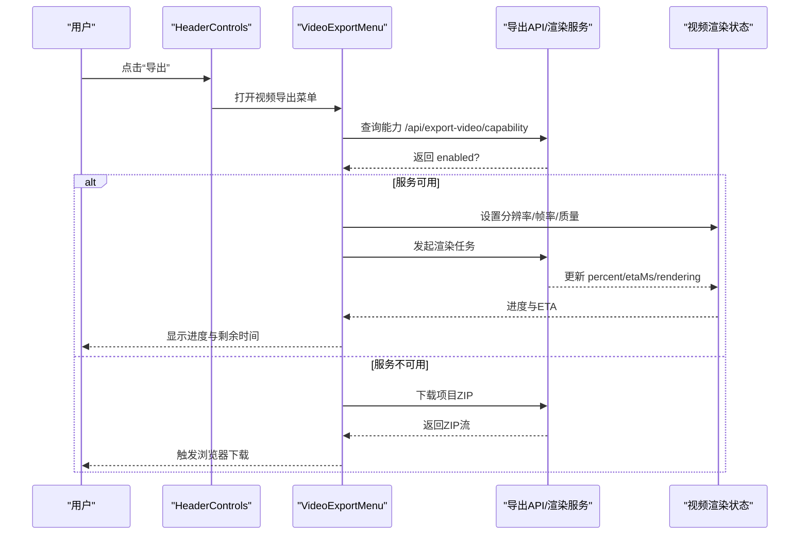
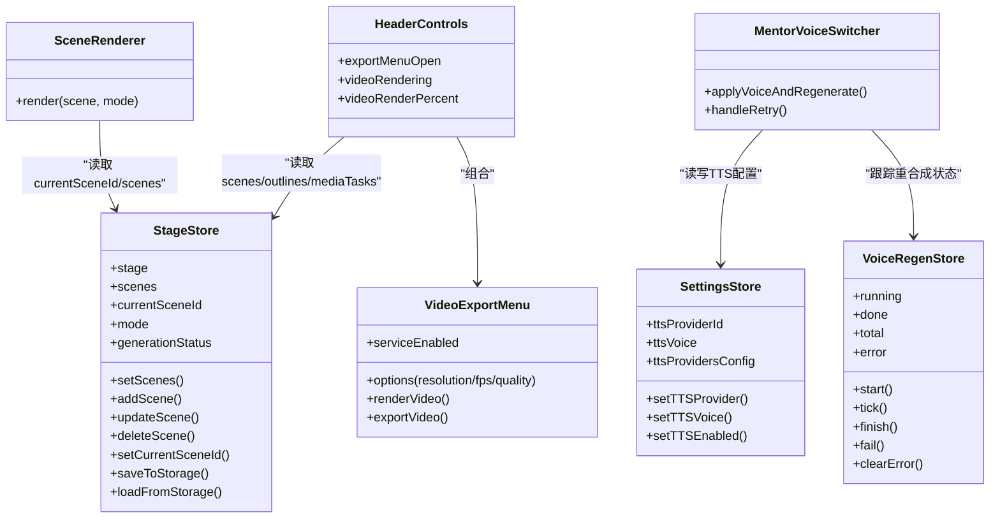

# 课堂播放组件

<cite>
**本文引用的文件**   
- [components/stage/scene-renderer.tsx](file://components/stage/scene-renderer.tsx)
- [components/stage/header-controls.tsx](file://components/stage/header-controls.tsx)
- [components/stage/scene-sidebar.tsx](file://components/stage/scene-sidebar.tsx)
- [components/stage/video-export-menu.tsx](file://components/stage/video-export-menu.tsx)
- [components/stage/mentor-voice-switcher.tsx](file://components/stage/mentor-voice-switcher.tsx)
- [lib/types/stage.ts](file://lib/types/stage.ts)
- [lib/store/index.ts](file://lib/store/index.ts)
- [lib/store/stage.ts](file://lib/store/stage.ts)
- [lib/store/voice-regen.ts](file://lib/store/voice-regen.ts)
- [components/stage.tsx](file://components/stage.tsx)
</cite>

## 产品概述
本文件聚焦课堂播放相关的前端组件与状态协作，覆盖场景渲染、头部控制、侧边栏导航、视频导出与导师语音切换等核心能力。系统基于 Next.js + React 19 + Zustand 构建，课件以自定义 DSL 描述，播放路径由 SceneRenderer 统一分发到不同场景渲染器（幻灯片、问答、交互式页面、PBL）。HeaderControls 提供语言、主题、设置、导出与视频导出入口；SceneSidebar 负责场景列表、缩略图预览与生成态占位；VideoExportMenu 支持在线 MP4 渲染或本地 ZIP 下载；MentorVoiceSwitcher 提供音色选择与批量重合成讲课音频的能力。所有组件通过 StageStore、SettingsStore、VoiceRegenStore 等全局状态进行通信与同步，确保播放引擎、TTS、导出任务之间的状态一致与用户体验流畅。

## 核心业务流程
- 场景渲染流程：Stage 根据 mode 决定进入编辑或播放根容器；播放路径中 SceneRenderer 依据 scene.type 分派到具体渲染器（Slide/Quiz/Interactive/PBL），并接收 mode 与 sceneId 等参数驱动交互。
- 头部控制流程：HeaderControls 聚合语言、主题、设置、Pro 模式开关、导出按钮与 VideoExportMenu；导出按钮根据资源就绪状态启用菜单，并在菜单内触发 PPTX/资源包/课堂ZIP/视频导出。
- 侧边栏导航流程：SceneSidebar 展示 scenes 列表与缩略图，支持点击切换当前场景（onSceneSelect 或 setCurrentSceneId），并显示生成中的占位与失败重试入口。
- 视频导出流程：HeaderControls 打开 VideoExportMenu，先探测服务可用性；若可用则提供分辨率、帧率、质量选项与进度条，调用 useRenderVideo 发起渲染；不可用时降级为下载项目 ZIP 供本地 CLI 渲染。
- 导师语音切换流程：MentorVoiceSwitcher 列出可用音色，确认后写入 SettingsStore（provider/voice/model）并启用 TTS，随后调用 regenerateAllSpeech 批量重合成全部讲课音频，使用 VoiceRegenStore 跟踪进度与错误，完成后给出提示。

**图表来源** 
- [components/stage/header-controls.tsx:258-336](file://components/stage/header-controls.tsx#L258-L336)
- [components/stage/video-export-menu.tsx:87-199](file://components/stage/video-export-menu.tsx#L87-L199)

**章节来源**
- [components/stage.tsx:33-167](file://components/stage.tsx#L33-L167)
- [components/stage/scene-renderer.tsx:20-41](file://components/stage/scene-renderer.tsx#L20-L41)
- [components/stage/header-controls.tsx:64-342](file://components/stage/header-controls.tsx#L64-L342)
- [components/stage/scene-sidebar.tsx:36-559](file://components/stage/scene-sidebar.tsx#L36-L559)
- [components/stage/video-export-menu.tsx:87-199](file://components/stage/video-export-menu.tsx#L87-L199)
- [components/stage/mentor-voice-switcher.tsx:43-238](file://components/stage/mentor-voice-switcher.tsx#L43-L238)

## 功能模块清单
- SceneRenderer 场景渲染器
  - 职责：按 scene.type 分派到 Slide/Quiz/Interactive/PBL 渲染器，传入 mode 与 sceneId，保证类型安全与内容校验。
  - 验收要点：未知类型回退提示；各 content.type 与 scene.type 匹配校验；在 Pro 模式下仅走播放路径。
- HeaderControls 头部控制
  - 职责：语言/主题/设置弹窗、Pro 模式开关、导出按钮与 VideoExportMenu 集成；维护导出就绪条件与视频渲染进度环。
  - 验收要点：导出按钮禁用逻辑正确；菜单外点击关闭；视频渲染进度持久显示。
- SceneSidebar 侧边栏
  - 职责：场景列表、缩略图预览（含 slide/quiz/interactive/pbl）、生成中占位与失败重试、课程完成占位；支持拖拽调整宽度与折叠。
  - 验收要点：点击切换场景；生成失败可重试；占位与活跃态样式正确。
- VideoExportMenu 视频导出菜单
  - 职责：探测服务可用性；提供分辨率/帧率/质量选项；渲染进度与 ETA；降级为 ZIP 下载。
  - 验收要点：能力探测结果影响 UI；busy 状态禁用操作；进度与 ETA 显示准确。
- MentorVoiceSwitcher 导师语音切换器
  - 职责：列出可用 provider/voice；确认对话框；写入 SettingsStore；触发批量重合成；VoiceRegenStore 跟踪进度与错误；失败重试入口。
  - 验收要点：切换后提示成功/失败；运行中禁用重复触发；错误后可重试。

**章节来源**
- [components/stage/scene-renderer.tsx:20-41](file://components/stage/scene-renderer.tsx#L20-L41)
- [components/stage/header-controls.tsx:64-342](file://components/stage/header-controls.tsx#L64-L342)
- [components/stage/scene-sidebar.tsx:36-559](file://components/stage/scene-sidebar.tsx#L36-L559)
- [components/stage/video-export-menu.tsx:87-199](file://components/stage/video-export-menu.tsx#L87-L199)
- [components/stage/mentor-voice-switcher.tsx:43-238](file://components/stage/mentor-voice-switcher.tsx#L43-L238)

## 数据与状态
- 核心数据模型
  - Scene/SceneContent：包含 slide/quiz/interactive/pbl 四种内容类型，type 作为判别字段；AppSceneContent 扩展了 interactive 与 pbl。
  - StageMode：'playback' | 'edit' | 'autonomous'，用于控制渲染路径与行为。
- 关键状态流转
  - StageStore：维护 stage/scenes/currentSceneId/mode/generation* 等；提供 add/update/delete/setCurrentSceneId/save/load 等方法；自动迁移与持久化；生成完成标志 generationComplete 控制“课程完成”占位。
  - SettingsStore：管理 TTS provider/voice/model 与开关；被 MentorVoiceSwitcher 读写。
  - VoiceRegenStore：记录 running/done/total/error，贯穿重合成生命周期。
  - 视频渲染状态：useVideoRenderStore 暴露 status/percent，HeaderControls 读取以显示环形进度。
- 数据所有权边界
  - 场景数据由 StageStore 统一管理，组件只读或通过 actions 变更；导出与渲染状态由各自 store/hook 管理；TTS 配置由 SettingsStore 集中持有。

**图表来源** 
- [lib/types/stage.ts:1-155](file://lib/types/stage.ts#L1-L155)
- [lib/store/stage.ts:163-600](file://lib/store/stage.ts#L163-L600)
- [lib/store/voice-regen.ts:1-44](file://lib/store/voice-regen.ts#L1-L44)
- [components/stage/scene-renderer.tsx:20-41](file://components/stage/scene-renderer.tsx#L20-L41)
- [components/stage/header-controls.tsx:64-342](file://components/stage/header-controls.tsx#L64-L342)
- [components/stage/video-export-menu.tsx:87-199](file://components/stage/video-export-menu.tsx#L87-L199)
- [components/stage/mentor-voice-switcher.tsx:43-238](file://components/stage/mentor-voice-switcher.tsx#L43-L238)

**章节来源**
- [lib/types/stage.ts:1-155](file://lib/types/stage.ts#L1-L155)
- [lib/store/index.ts:1-19](file://lib/store/index.ts#L1-L19)
- [lib/store/stage.ts:163-600](file://lib/store/stage.ts#L163-L600)
- [lib/store/voice-regen.ts:1-44](file://lib/store/voice-regen.ts#L1-L44)

## 关键约束与边界
- 非功能性需求
  - 性能：SceneRenderer 使用 useMemo 避免不必要的重渲染；StageStore 的 saveToStorage 采用 500ms 防抖；视频渲染进度在 HeaderControls 中持久显示，避免菜单关闭导致进度丢失。
  - 可靠性：StageStore.loadFromStorage 具备自修复逻辑（generationComplete 推断与持久化）；导出能力探测失败时降级为 ZIP 下载；语音重合成失败提供重试入口。
  - 一致性：Scene.type 与 content.type 必须匹配，否则返回无效提示；Pro 模式切换前需等待 PlaybackChromeRoot.teardown 完成，避免并发冲突。
- 依赖与集成边界
  - 外部 API：/api/export-video/capability 探测渲染服务；视频渲染与下载由后端服务处理；TTS 由 SettingsStore 配置的 provider 提供。
  - 内部模块：SceneRenderer 依赖各场景渲染器（Slide/Quiz/Interactive/PBL）；HeaderControls 依赖 export hooks 与 video render store；MentorVoiceSwitcher 依赖 voice-resolver 与 regenerate-all-speech。
- 业务约束
  - 导出就绪条件：存在场景且无正在生成的大纲、无失败大纲、媒体任务均 done/failed。
  - 语音切换影响：切换音色会重新合成全部讲课音频，需用户确认；运行中禁止重复触发。
  - 侧边栏交互：生成中的占位仅在单个条目显示；课程完成占位在 outlines 耗尽时出现。

**章节来源**
- [components/stage/scene-renderer.tsx:20-41](file://components/stage/scene-renderer.tsx#L20-L41)
- [components/stage/header-controls.tsx:96-114](file://components/stage/header-controls.tsx#L96-L114)
- [components/stage/scene-sidebar.tsx:338-551](file://components/stage/scene-sidebar.tsx#L338-L551)
- [components/stage/video-export-menu.tsx:95-108](file://components/stage/video-export-menu.tsx#L95-L108)
- [components/stage/mentor-voice-switcher.tsx:90-118](file://components/stage/mentor-voice-switcher.tsx#L90-L118)
- [lib/store/stage.ts:418-553](file://lib/store/stage.ts#L418-L553)