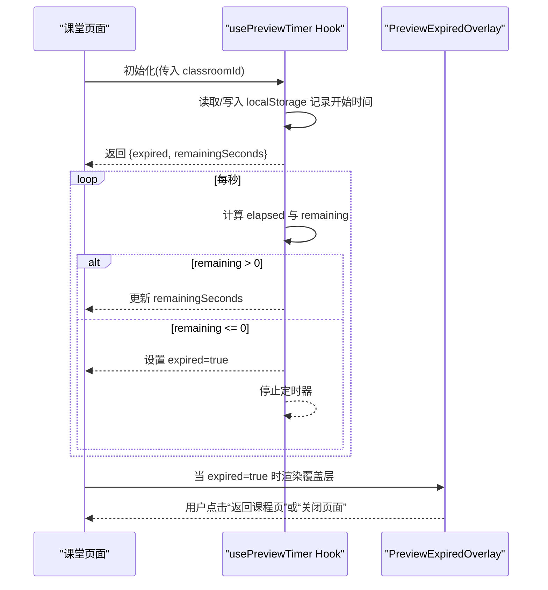
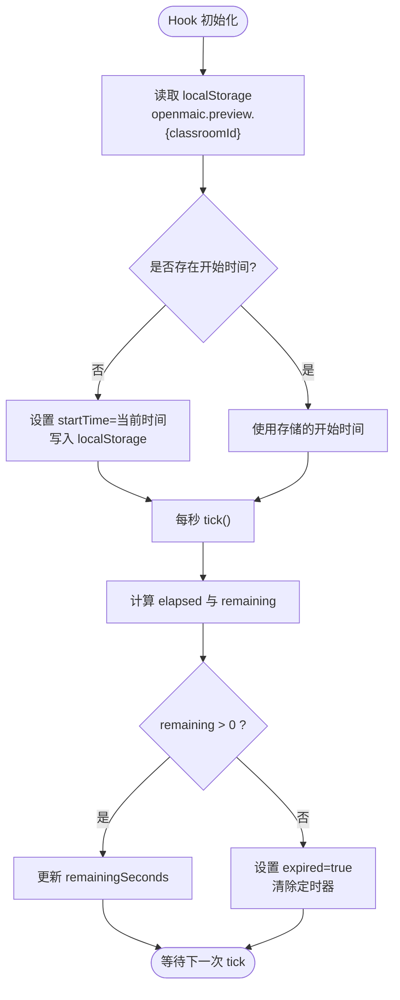

# 预览过期覆盖层组件

<cite>
**本文引用的文件**   
- [components/preview-expired-overlay.tsx](file://components/preview-expired-overlay.tsx)
- [app/classroom/[id]/page.tsx](file://app/classroom/[id]/page.tsx)
- [lib/hooks/use-preview-timer.ts](file://lib/hooks/use-preview-timer.ts)
</cite>

## 产品概述
本组件用于在课堂页面中展示“免费试看已到期”的覆盖层，阻断用户继续观看并引导返回课程页或关闭页面。其核心价值在于：
- 控制课堂内 10 分钟免费试看的时长与体验边界
- 提供清晰的倒计时提示与下一步操作入口
- 以最小侵入的方式叠加在课堂渲染之上，不影响主流程

适用场景：
- 用户在课堂详情页进入后，超过 10 分钟未续费或未登录时触发
- 需要引导用户回到课程列表或课程详情页面重新进入新一轮试看

## 核心业务流程
- 课堂页面挂载时启动计时器，记录首次访问时间到 localStorage（按 classroomId 隔离）
- 每秒计算剩余秒数；当剩余时间归零时标记 expired=true
- 课堂页面根据 expired 状态决定是否渲染覆盖层
- 覆盖层显示倒计时、提示信息，并提供“返回课程页”或“关闭页面”的操作

图表来源 
- [lib/hooks/use-preview-timer.ts:23-76](file://lib/hooks/use-preview-timer.ts#L23-L76)
- [app/classroom/[id]/page.tsx](file://app/classroom/[id]/page.tsx#L40-L47)
- [app/classroom/[id]/page.tsx](file://app/classroom/[id]/page.tsx#L212-L218)
- [components/preview-expired-overlay.tsx:18-74](file://components/preview-expired-overlay.tsx#L18-L74)

章节来源
- [lib/hooks/use-preview-timer.ts:23-76](file://lib/hooks/use-preview-timer.ts#L23-L76)
- [app/classroom/[id]/page.tsx](file://app/classroom/[id]/page.tsx#L40-L47)
- [app/classroom/[id]/page.tsx](file://app/classroom/[id]/page.tsx#L212-L218)
- [components/preview-expired-overlay.tsx:18-74](file://components/preview-expired-overlay.tsx#L18-L74)

## 功能模块清单
- 预览计时 Hook（usePreviewTimer）
  - 职责：维护课堂级 10 分钟免费试看计时，输出 expired 与 remainingSeconds
  - 验收要点：
    - 首次进入课堂时写入开始时间
    - 每秒刷新剩余秒数，归零后停止计时并标记过期
    - 不同 classroomId 独立计时
    - localStorage 不可用时静默降级（不限制）
- 预览过期覆盖层（PreviewExpiredOverlay）
  - 职责：全屏遮罩展示过期提示、倒计时、操作按钮
  - 验收要点：
    - 支持 backUrl 时显示“返回课程页”，否则显示“关闭页面”
    - 剩余秒数大于 0 时显示下次可试看的时间点
    - 使用固定定位 z-index 确保覆盖层在最上层
- 课堂页面集成（ClassroomDetailPage）
  - 职责：调用 usePreviewTimer，解析 URL 中的 courseSlug 生成 backUrl，条件渲染覆盖层
  - 验收要点：
    - 仅在 preview.expired 为真时渲染覆盖层
    - 正确传递 remainingSeconds 与 backUrl

章节来源
- [lib/hooks/use-preview-timer.ts:23-76](file://lib/hooks/use-preview-timer.ts#L23-L76)
- [components/preview-expired-overlay.tsx:5-74](file://components/preview-expired-overlay.tsx#L5-L74)
- [app/classroom/[id]/page.tsx](file://app/classroom/[id]/page.tsx#L40-L47)
- [app/classroom/[id]/page.tsx](file://app/classroom/[id]/page.tsx#L212-L218)

## 数据与状态
- 计时状态（PreviewTimerState）
  - expired: boolean，是否已过期
  - remainingSeconds: number，剩余秒数（未过期有效）
- 本地存储键
  - 前缀：openmaic.preview
  - 完整键：openmaic.preview.{classroomId}
  - 值：开始时间的毫秒时间戳字符串
- 覆盖层输入属性（PreviewExpiredOverlayProps）
  - remainingSeconds: number，用于展示倒计时
  - backUrl?: string，可选的返回课程页链接

图表来源 
- [lib/hooks/use-preview-timer.ts:29-73](file://lib/hooks/use-preview-timer.ts#L29-L73)

章节来源
- [lib/hooks/use-preview-timer.ts:8-13](file://lib/hooks/use-preview-timer.ts#L8-L13)
- [lib/hooks/use-preview-timer.ts:23-76](file://lib/hooks/use-preview-timer.ts#L23-L76)
- [components/preview-expired-overlay.tsx:5-10](file://components/preview-expired-overlay.tsx#L5-L10)

## 关键约束与边界
- 计时精度与性能
  - 使用 setInterval 每秒更新，避免频繁 DOM 重绘；过期后立即清理定时器
- 存储可用性
  - 若 localStorage 不可用，Hook 会捕获异常并降级为不限制（不阻断）
- 多课堂隔离
  - 基于 classroomId 作为存储键前缀，保证不同课堂的计时互不干扰
- 覆盖层交互
  - 当存在 backUrl 时优先“返回课程页”，否则“关闭页面”
  - 覆盖层使用固定定位与高 z-index，确保始终覆盖课堂内容
- 用户体验
  - 剩余秒数大于 0 时显示下次可试看时间点，增强预期管理
  - 文案明确说明“重新打开课堂即可开始新一轮 10 分钟试看”

章节来源
- [lib/hooks/use-preview-timer.ts:66-68](file://lib/hooks/use-preview-timer.ts#L66-L68)
- [components/preview-expired-overlay.tsx:40-47](file://components/preview-expired-overlay.tsx#L40-L47)
- [components/preview-expired-overlay.tsx:50-65](file://components/preview-expired-overlay.tsx#L50-L65)
- [app/classroom/[id]/page.tsx](file://app/classroom/[id]/page.tsx#L44-L47)
- [app/classroom/[id]/page.tsx](file://app/classroom/[id]/page.tsx#L212-L218)