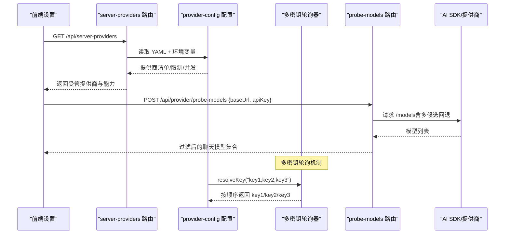
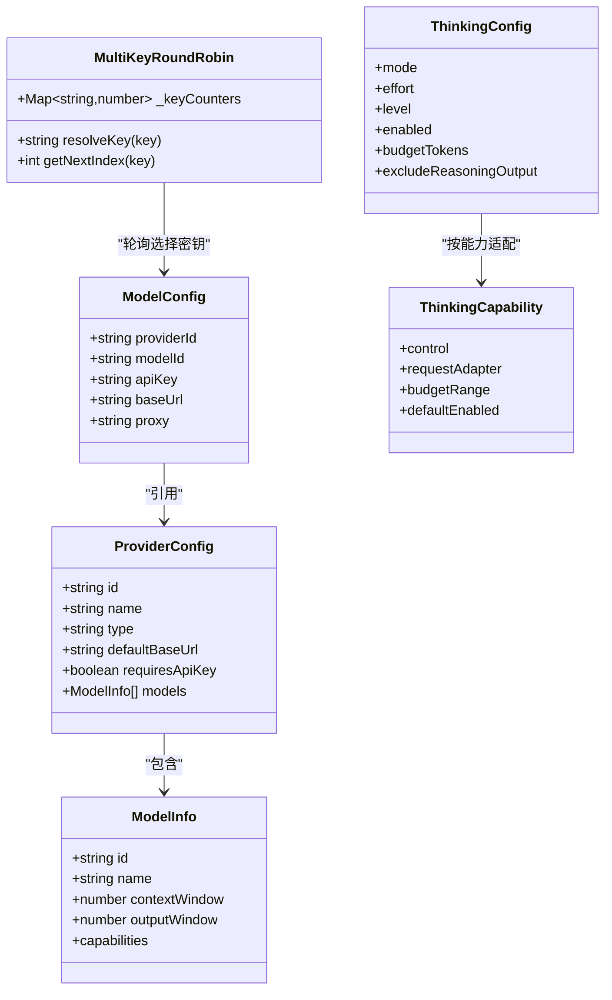

# AI 服务提供商

<cite>
**本文引用的文件**   
- [lib/ai/providers.ts](file://lib/ai/providers.ts)
- [lib/server/provider-config.ts](file://lib/server/provider-config.ts)
- [lib/types/provider.ts](file://lib/types/provider.ts)
- [app/api/server-providers/route.ts](file://app/api/server-providers/route.ts)
- [app/api/provider/probe-models/route.ts](file://app/api/provider/probe-models/route.ts)
- [lib/ai/llm.ts](file://lib/ai/llm.ts)
- [lib/ai/model-metadata.ts](file://lib/ai/model-metadata.ts)
- [lib/ai/azure.ts](file://lib/ai/azure.ts)
- [README-zh.md](file://README-zh.md)
</cite>

## 更新摘要
**所做更改**
- 新增多密钥轮询支持功能，允许管理员配置多个 API 密钥（逗号分隔）实现自动密钥轮换和负载均衡
- 更新了密钥解析机制，在托管提供商模式下支持多密钥轮询
- 增强了配置系统的容错性和扩展性

## 产品概述
OpenMAIC 的 AI 服务提供商集成层通过 Vercel AI SDK 统一接入多家 LLM、TTS、ASR、图像与视频生成等能力，支持 OpenAI、Anthropic（Claude）、Google Gemini、Azure OpenAI、MiniMax、Xiaomi MiMo、GLM、Qwen、DeepSeek、Kimi、SiliconFlow、豆包、腾讯混元、OpenRouter、Grok、Ollama、Lemonade 等。系统提供统一的模型目录、思考/推理参数适配、服务端配置管理（YAML + 环境变量）、模型探测接口以及使用量统计与错误处理机制，便于在课件生成、课堂互动、媒体生成等场景中灵活切换提供商与模型。**最新更新：支持多密钥轮询功能，管理员可配置多个 API 密钥以实现自动轮换和负载均衡。**

## 核心业务流程
- 配置加载：服务端从 server-providers.yml 与环境变量合并加载各提供商配置，区分"服务端托管"和"客户端自定义"两类。
- **多密钥轮询**：当检测到逗号分隔的多个 API 密钥时，系统自动进行轮询选择，实现负载均衡和高可用性。
- 模型目录与能力：内置 PROVIDERS 注册表声明各提供商支持的模型、上下文窗口、输出窗口与能力（流式、工具、视觉、思考）。
- 调用封装：所有 LLM 调用统一走 callLLM/streamLLM，注入 ThinkingConfig 并记录用量；OpenAI 兼容提供商通过 fetch wrapper 注入厂商特定参数。
- 模型探测：POST /api/provider/probe-models 基于 OpenAI 兼容 /models 端点自动发现聊天模型，过滤非聊天模型并返回可用列表。
- 服务端能力暴露：GET /api/server-providers 返回服务端已配置的提供商清单、TTS 禁用状态、并行度等元信息。



**章节来源**
- [lib/server/provider-config.ts:362-421](file://lib/server/provider-config.ts#L362-L421)
- [lib/ai/providers.ts:63-1278](file://lib/ai/providers.ts#L63-L1278)
- [app/api/server-providers/route.ts:16-39](file://app/api/server-providers/route.ts#L16-L39)
- [app/api/provider/probe-models/route.ts:19-68](file://app/api/provider/probe-models/route.ts#L19-L68)

## 功能模块清单
- 统一提供商注册表与模型目录
  - 职责：定义各提供商类型、默认 Base URL、是否需 API Key、图标、模型清单及能力（流式、工具、视觉、思考控制方式）。
  - 验收要点：新增提供商需在 PROVIDERS 中登记模型与 capabilities；OpenAI 兼容提供商可通过 baseUrl 覆盖。
- 服务端配置与密钥解析
  - 职责：从 YAML 与环境变量加载配置，区分托管与未托管提供商，提供 resolveApiKey/resolveBaseUrl 等解析函数。
  - **多密钥轮询**：支持逗号分隔的多个 API 密钥，自动进行轮询选择，提升系统可用性和负载分布。
  - 验收要点：托管提供商忽略客户端传入的 key/baseUrl；TTS 支持全局强制禁用开关。
- 统一 LLM 调用层
  - 职责：callLLM/streamLLM 封装 AI SDK 调用，注入 ThinkingConfig，记录用量，支持校验失败重试。
  - 验收要点：OpenAI 兼容提供商通过 thinkingContext 注入 body 参数；原生提供商通过 providerOptions 注入。
- 模型探测接口
  - 职责：POST /api/provider/probe-models 拉取 /models 并过滤非聊天模型，返回 id 与 ownedBy。
  - 验收要点：SSRF 防护、重定向拒绝、鉴权错误提示、无 /models 时退回手动输入。
- Azure OpenAI 基础路径归一化
  - 职责：将门户常见 chat/completions 或 responses 路径去除，适配 @ai-sdk/azure 期望的前缀。
  - 验收要点：.openai.azure.com 与 services.ai.azure.com 差异处理。

**章节来源**
- [lib/ai/providers.ts:63-1278](file://lib/ai/providers.ts#L63-L1278)
- [lib/server/provider-config.ts:439-527](file://lib/server/provider-config.ts#L439-L527)
- [lib/ai/llm.ts:320-410](file://lib/ai/llm.ts#L320-L410)
- [app/api/provider/probe-models/route.ts:19-68](file://app/api/provider/probe-models/route.ts#L19-L68)
- [lib/ai/azure.ts:9-28](file://lib/ai/azure.ts#L9-L28)

## 数据与状态
- 核心数据模型
  - ProviderId/ProviderType：内置提供商 ID 与类型（openai/azure/anthropic/google），支持 custom- 前缀扩展。
  - ModelInfo：模型标识、名称、上下文/输出窗口、能力（streaming/tools/vision/thinking）。
  - ProviderConfig：提供商元信息与模型清单。
  - ModelConfig：调用所需 providerId、modelId、apiKey、baseUrl、proxy 等。
  - ThinkingCapability/ThinkingConfig：思考/推理能力的控制方式（toggle/effort/level/budget）与请求映射。
- 关键状态流转
  - 配置优先级：YAML 默认 → 环境变量覆盖 → 运行时解析（托管 vs 未托管）。
  - **多密钥轮询状态**：每个密钥组合维护独立的计数器，确保轮询的公平性和一致性。
  - 调用链路：callLLM/streamLLM → 注入 ThinkingConfig → AI SDK → 提供商；OpenAI 兼容通过 fetch wrapper 注入 body。
  - 用量采集：每次调用成功或流完成时异步记录 providerId、modelId、usage。
- 数据所有权边界
  - 托管提供商：服务端 key/baseUrl/models 权威，客户端值被忽略。
  - 未托管提供商：完全由客户端提供凭据与 Base URL。



**图表来源**
- [lib/types/provider.ts:8-192](file://lib/types/provider.ts#L8-L192)
- [lib/ai/providers.ts:63-1278](file://lib/ai/providers.ts#L63-L1278)

**章节来源**
- [lib/types/provider.ts:8-192](file://lib/types/provider.ts#L8-L192)
- [lib/ai/providers.ts:63-1278](file://lib/ai/providers.ts#L63-L1278)
- [lib/ai/llm.ts:282-310](file://lib/ai/llm.ts#L282-310)

## 关键约束与边界
- 认证与密钥
  - 需要 API Key 的提供商：OpenAI、Anthropic、Google、MiniMax、Xiaomi、GLM、Qwen、DeepSeek、Kimi、SiliconFlow、豆包、腾讯混元、OpenRouter、Grok 等。
  - 无需 API Key 的本地提供商：Ollama、Lemonade（可配置 Base URL）。
  - 托管模式：服务端配置优先，客户端传入的 key/baseUrl 将被忽略。
  - **多密钥支持**：支持逗号分隔的多个 API 密钥（如 'key1,key2,key3'），自动进行轮询选择。
- Base URL 与区域
  - 部分提供商提供 alternateBaseUrls（如 GLM、Kimi、Tencent、Xiaomi Token Plan），可在设置中选择不同区域端点。
  - Azure OpenAI 路径需规范化，避免 chat/completions/responses 后缀导致 SDK 拼接异常。
- 模型探测与可用性
  - probe-models 仅返回聊天模型，过滤 TTS/ASR/embedding/rerank/mineru/image/video/voxcpm/moderation 等非聊天模型。
  - 不支持 /models 的提供商应允许手动输入模型 ID。
- 思考/推理参数
  - 不同提供商对 thinking 的控制方式不同（toggle/effort/level/budget），由 model-metadata 与 providers 中的适配器映射。
  - 全局可通过环境变量关闭思考（LLM_THINKING_DISABLED=true）。
- 限流与重试
  - 调用层支持 validate 失败时的重试（retries），网络/5xx 错误由 AI SDK 内置 maxRetries 处理。
  - 服务端并行场景生成并发度可通过 PARALLEL_SCENE_CONCURRENCY 控制（上限 10）。
  - **多密钥优势**：通过密钥轮询可有效分散请求压力，降低单个密钥的限流风险。
- 安全
  - 模型探测接口对 baseUrl/modelsUrl 进行 SSRF 防护，禁止重定向。
  - 敏感凭据不随 API 响应泄露，仅暴露受管标志与允许的模型列表。

**章节来源**
- [lib/server/provider-config.ts:439-527](file://lib/server/provider-config.ts#L439-L527)
- [lib/ai/azure.ts:9-28](file://lib/ai/azure.ts#L9-L28)
- [app/api/provider/probe-models/route.ts:19-68](file://app/api/provider/probe-models/route.ts#L19-L68)
- [lib/ai/llm.ts:260-272](file://lib/ai/llm.ts#L260-272)
- [lib/server/provider-config.ts:673-678](file://lib/server/provider-config.ts#L673-678)

## 配置方法与集成细节

### 环境变量与 YAML 配置
- 环境变量映射
  - LLM：OPENAI_API_KEY、AZURE_OPENAI_API_KEY、ANTHROPIC_API_KEY、GOOGLE_API_KEY、DEEPSEEK_API_KEY、QWEN_API_KEY、KIMI_API_KEY、MINIMAX_API_KEY、GLM_API_KEY、SILICONFLOW_API_KEY、DOUBAO_API_KEY、OPENROUTER_API_KEY、GROK_API_KEY、TENCENT_HUNYUAN_API_KEY、XIAOMI_API_KEY/MIMO_API_KEY、OLLAMA_BASE_URL、LEMONADE_BASE_URL 等。
  - TTS/ASR/PDF/Image/Video/WebSearch：对应 TTS_*、ASR_*、PDF_*、IMAGE_*、VIDEO_*、WEB_SEARCH_* 前缀。
- **多密钥配置示例**
  - 支持逗号分隔的多个 API 密钥：`OPENAI_API_KEY=key1,key2,key3`
  - 密钥会自动进行轮询选择，实现负载均衡和高可用性
  - 适用于高并发场景和配额限制管理
- YAML 示例
  - 在 server-providers.yml 中为 providers/tts/asr/pdf/image/video/web-search 分别配置 apiKey/baseUrl/models/proxy/enabled。
  - 特殊项：AliDocMind 使用 accessKeyId/accessKeySecret；OpenAI Image 可从 OPENAI_API_KEY 自动回填。
- 优先级
  - 环境变量覆盖 YAML；托管模式下服务端配置权威。

**章节来源**
- [lib/server/provider-config.ts:52-136](file://lib/server/provider-config.ts#L52-L136)
- [lib/server/provider-config.ts:362-421](file://lib/server/provider-config.ts#L362-L421)
- [README-zh.md:120-135](file://README-zh.md#L120-L135)

### 各提供商认证与模型选择
- OpenAI
  - 认证：OPENAI_API_KEY；可选 BASE_URL。
  - **多密钥支持**：支持 `OPENAI_API_KEY=key1,key2,key3` 格式，自动轮询使用不同密钥。
  - 模型：gpt-5.x/gpt-5.x-pro/codex 系列，支持流式、工具、视觉、思考（effort 控制）。
- Anthropic（Claude）
  - 认证：ANTHROPIC_API_KEY；默认 https://api.anthropic.com/v1。
  - **多密钥支持**：支持 `ANTHROPIC_API_KEY=key1,key2,key3` 格式。
  - 模型：claude-opus/sonnet/haiku 系列，支持 adaptive/manual effort 与 budgetTokens。
- Google Gemini
  - 认证：GOOGLE_API_KEY；默认 generativelanguage.googleapis.com。
  - **多密钥支持**：支持 `GOOGLE_API_KEY=key1,key2,key3` 格式。
  - 模型：gemini-3.x-flash/pro，支持 level/budget 控制。
- Azure OpenAI
  - 认证：AZURE_OPENAI_API_KEY；BASE_URL 需规范化（去除 chat/completions/responses）。
  - **多密钥支持**：支持 `AZURE_OPENAI_API_KEY=key1,key2,key3` 格式。
  - 模型：使用部署名（deployment name），不在 catalog 中预置。
- MiniMax
  - 认证：MINIMAX_API_KEY；Anthropic 兼容端点（/anthropic/v1）。
  - **多密钥支持**：支持 `MINIMAX_API_KEY=key1,key2,key3` 格式。
  - 模型：MiniMax-M3/M2.7，支持流式、工具、视觉。
- Xiaomi MiMo
  - 认证：MIMO_API_KEY（Token Plan 以 tp- 开头）；支持多个区域端点。
  - **多密钥支持**：支持 `MIMO_API_KEY=key1,key2,key3` 格式。
  - 模型：mimo-v2.x 系列，支持 toggle 思考。
- GLM（智谱）
  - 认证：GLM_API_KEY；国内/国际站双端点。
  - **多密钥支持**：支持 `GLM_API_KEY=key1,key2,key3` 格式。
  - 模型：glm-5.x/4.7/4.6 系列，toggle/effort 控制。
- Qwen（通义千问）
  - 认证：QWEN_API_KEY；DashScope 兼容端点。
  - **多密钥支持**：支持 `QWEN_API_KEY=key1,key2,key3` 格式。
  - 模型：qwen3.x-plus/max/flash/vl，toggle-budget 控制。
- DeepSeek/Kimi/SiliconFlow/豆包/OpenRouter/Grok/Tencent Hunyuan
  - 认证：各自 *_API_KEY；OpenAI 兼容端点。
  - **多密钥支持**：所有支持 *_API_KEY 的环境变量均支持多密钥格式。
  - 模型：见 PROVIDERS 注册表，thinking 控制因模型而异。
- Ollama/Lemonade（本地）
  - 无需 API Key；配置 BASE_URL 指向本地服务。

**章节来源**
- [lib/ai/providers.ts:63-1278](file://lib/ai/providers.ts#L63-L1278)
- [lib/ai/model-metadata.ts:242-415](file://lib/ai/model-metadata.ts#L242-415)
- [README-zh.md:152-208](file://README-zh.md#L152-208)

### 错误处理、重试与限流
- 错误分类
  - 模型探测：重定向拒绝、鉴权失败（401/403）、无 /models（404）、其他 5xx。
  - 调用层：validate 失败触发重试；网络/5xx 由 SDK 内置重试处理。
- 重试策略
  - callLLM 支持 retries 与自定义 validate；streamLLM 在 onFinish 捕获用量。
- **多密钥轮询的优势**
  - 自动故障转移：当某个密钥失效时，系统自动切换到下一个可用密钥。
  - 负载均衡：请求均匀分布到多个密钥，避免单个密钥过载。
  - 配额管理：有效利用多个提供商账户的配额限制。
- 限流与并发
  - PARALLEL_SCENE_CONCURRENCY 控制场景内容生成的并行度（上限 10）。
  - 建议根据各提供商配额调整并发与重试次数，避免 429。
  - **多密钥策略**：结合多密钥轮询和并发控制，可显著提升系统吞吐量和稳定性。

**章节来源**
- [app/api/provider/probe-models/route.ts:46-68](file://app/api/provider/probe-models/route.ts#L46-L68)
- [lib/ai/llm.ts:260-272](file://lib/ai/llm.ts#L260-272)
- [lib/server/provider-config.ts:673-678](file://lib/server/provider-config.ts#L673-678)

### 模型探测与验证接口
- 模型探测
  - POST /api/provider/probe-models：传入 baseUrl、apiKey、可选 modelsUrl，返回聊天模型列表（id、ownedBy）。
  - 过滤规则：排除 tts/asr/whisper/embedding/rerank/mineru/image/video/voxcpm/moderation 等非聊天模型。
  - **多密钥支持**：支持传入逗号分隔的多个 apiKey，系统自动选择第一个可用的密钥进行探测。
- 服务器提供商查询
  - GET /api/server-providers：返回受管提供商清单、TTS 禁用状态、并行度等。

**章节来源**
- [app/api/provider/probe-models/route.ts:19-68](file://app/api/provider/probe-models/route.ts#L19-L68)
- [app/api/server-providers/route.ts:16-39](file://app/api/server-providers/route.ts#L16-L39)

### 添加新提供商与自定义集成
- 步骤
  - 在 PROVIDERS 中新增提供商条目（id/name/type/defaultBaseUrl/requiresApiKey/icon/models）。
  - 如需思考/推理能力，补充 model-metadata 中的 ThinkingCapability 映射。
  - 若为 OpenAI 兼容提供商，确保 fetch wrapper 能正确注入 body 参数（providers.ts 中 getCompatThinkingBodyParams）。
  - 如需服务端托管，配置 server-providers.yml 或环境变量，并在 LLM_ENV_MAP 中添加映射。
  - **多密钥支持**：新提供商自动支持多密钥格式，无需额外配置。
- 注意事项
  - 托管模式下客户端无法覆盖 key/baseUrl/models。
  - 新增模型需考虑 contextWindow/outputWindow 与 capabilities（streaming/tools/vision/thinking）。
  - **多密钥最佳实践**：建议在不同区域或不同配额级别的账户间分配密钥，以获得最佳的性能和可靠性。

**章节来源**
- [lib/ai/providers.ts:63-1278](file://lib/ai/providers.ts#L63-L1278)
- [lib/ai/model-metadata.ts:417-445](file://lib/ai/model-metadata.ts#L417-L445)
- [lib/server/provider-config.ts:52-136](file://lib/server/provider-config.ts#L52-L136)

### 性能特点、成本对比与使用建议
- 性能与能力
  - OpenAI gpt-5.x：高质量推理与工具调用，适合复杂任务；支持多种 effort 级别。
  - Claude Opus/Sonnet/Haiku：强推理与长上下文，Haiku 更轻量；支持 adaptive/manual effort。
  - Gemini Flash/Pro：速度与质量平衡，Flash 更快，Pro 更强；支持 level/budget。
  - MiniMax/Qwen/GLM/DeepSeek/Kimi：中文生态友好，性价比高；思考控制各异。
  - Azure OpenAI：企业级合规与私有化部署；需正确配置部署名与路径。
  - 本地 Ollama/Lemonade：离线可控，适合开发测试与隐私敏感场景。
- **多密钥轮询的性能优势**
  - 吞吐量提升：通过多个密钥并行处理请求，显著提升整体吞吐量。
  - 延迟优化：自动选择响应最快的密钥，降低平均响应时间。
  - 可用性增强：单点故障不影响整体服务，提高系统可靠性。
- 成本建议
  - 高吞吐低成本：Gemini Flash、Qwen Flash、DeepSeek Flash、Kimi K2.5。
  - 高质量推理：OpenAI GPT-5.x、Claude Opus、Gemini Pro。
  - 企业合规：Azure OpenAI。
  - 本地/私有：Ollama/Lemonade。
  - **多密钥成本优化**：合理分配不同价格区间的密钥，根据业务需求动态选择最优密钥。
- 使用场景
  - 课件生成：推荐 Gemini Flash 或 Qwen Plus，兼顾速度/质量。
  - 课堂互动：OpenAI GPT-5.x 或 Claude Sonnet，工具与推理能力强。
  - 代码辅助：DeepSeek/Kimi/Gemini Pro，长上下文与工具调用。
  - 隐私/离线：Ollama/Lemonade，本地部署。
  - **高可用场景**：建议使用多密钥轮询配置，确保服务连续性和稳定性。

[本节为通用指导，不直接分析具体文件]

### 多密钥轮询实现详解

#### 核心机制
系统实现了智能的多密钥轮询机制，主要特性包括：

- **自动检测**：当检测到 API Key 包含逗号分隔符时，自动启用多密钥模式
- **轮询算法**：使用模运算确保密钥选择的公平性和一致性
- **状态管理**：每个密钥组合维护独立的计数器，避免状态冲突
- **容错处理**：空密钥和无效密钥会被自动过滤

#### 配置示例
```bash
# 单密钥配置（向后兼容）
OPENAI_API_KEY=sk-abc123

# 多密钥配置（新功能）
OPENAI_API_KEY=sk-key1,sk-key2,sk-key3

# 带空格的密钥（自动清理）
OPENAI_API_KEY="sk-key1 , sk-key2 , sk-key3"
```

#### 工作流程
1. **密钥解析**：`resolveKey()` 函数检测并处理逗号分隔的密钥
2. **轮询选择**：基于全局计数器选择下一个可用密钥
3. **状态更新**：更新计数器以确保下次选择不同的密钥
4. **错误处理**：跳过空密钥和无效密钥

**章节来源**
- [lib/server/provider-config.ts:443-454](file://lib/server/provider-config.ts#L443-L454)
- [lib/server/provider-config.ts:456-464](file://lib/server/provider-config.ts#L456-L464)