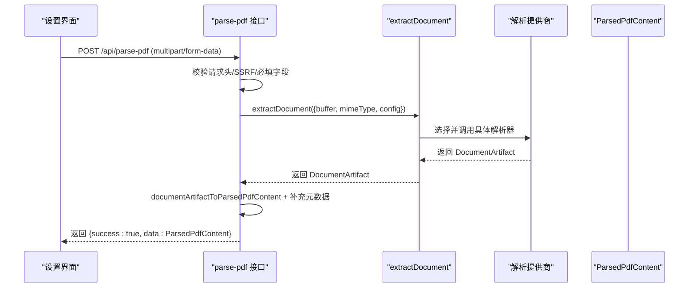
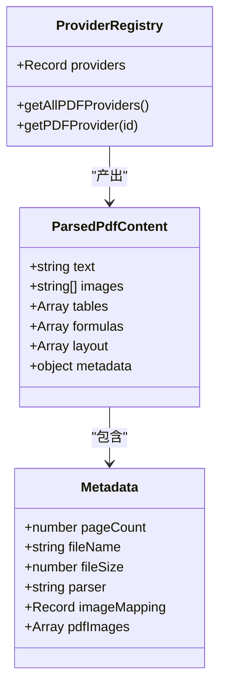
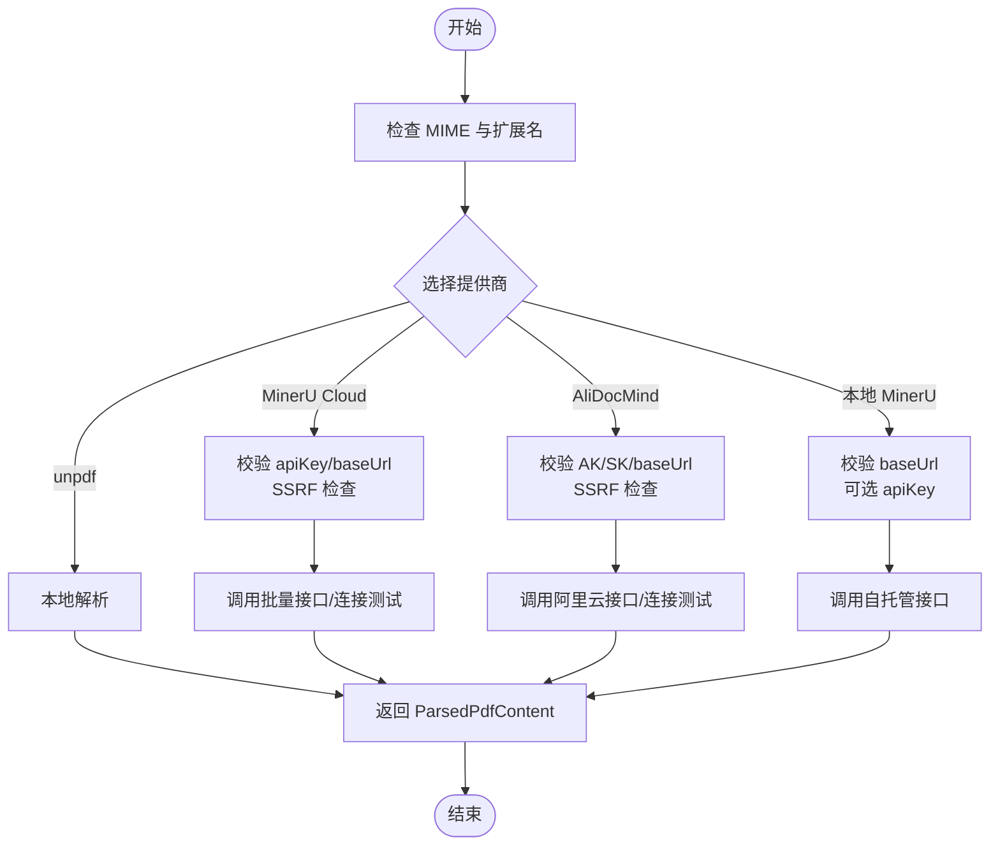
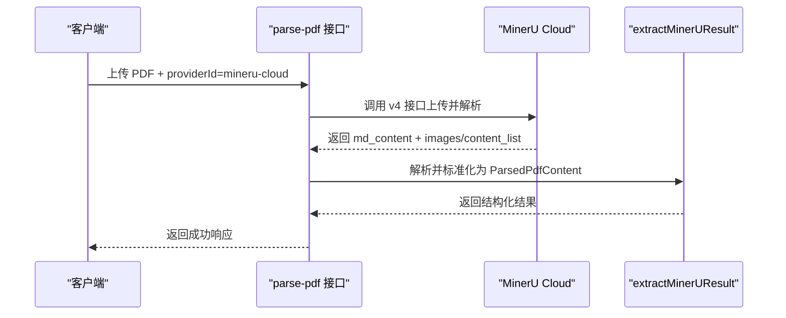
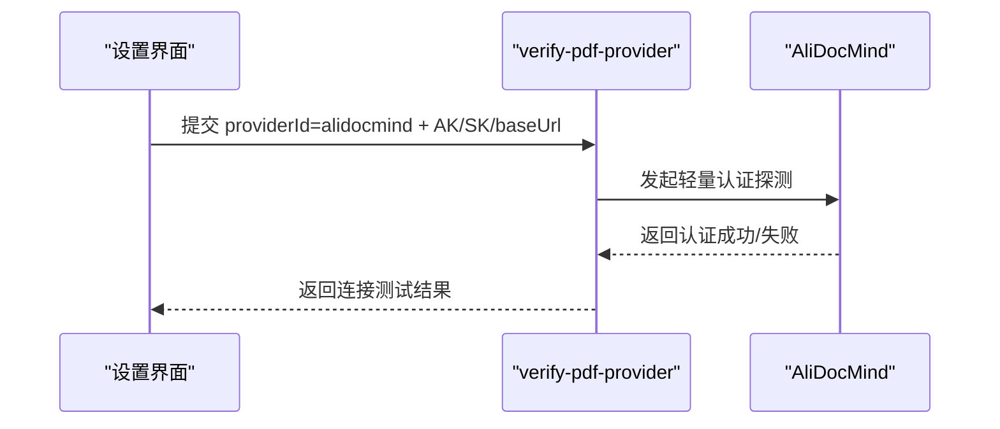
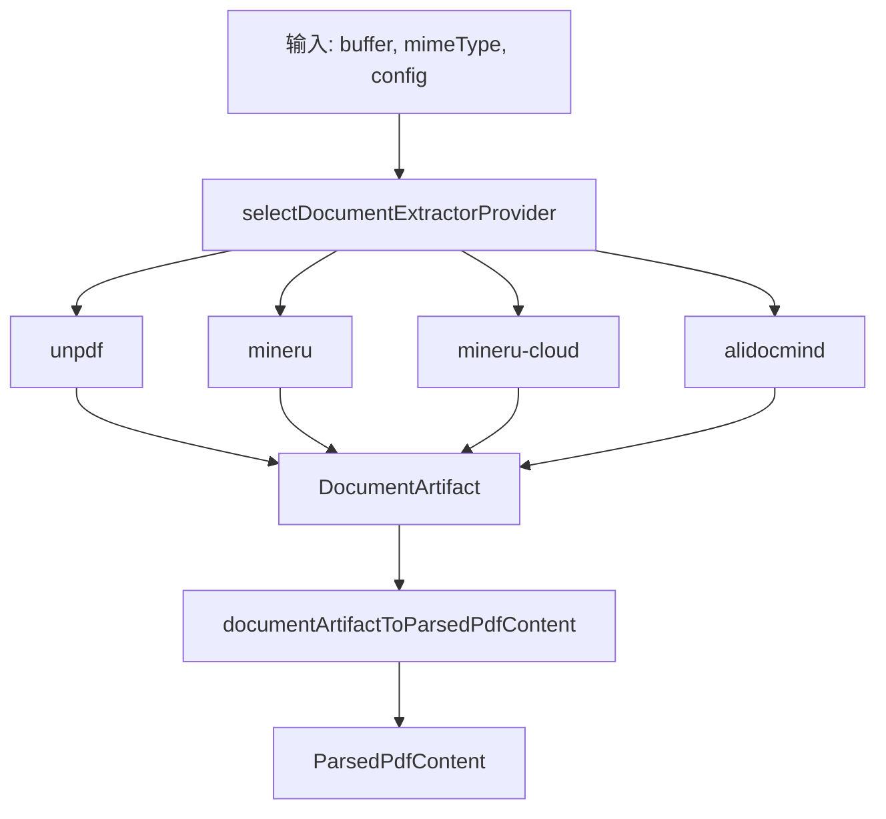
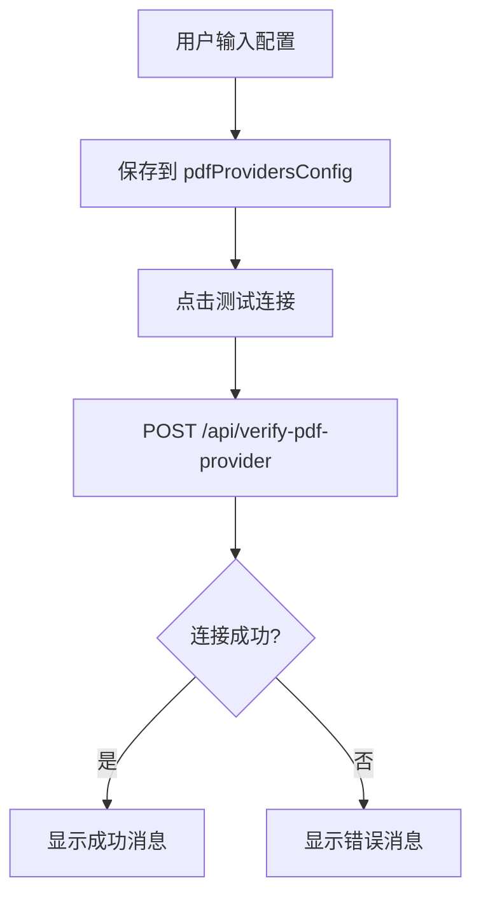
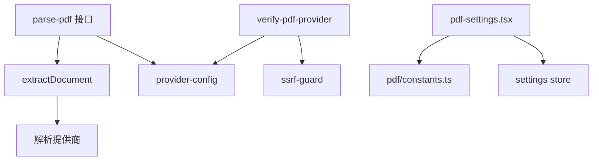

# PDF 文档处理

<cite>
**本文引用的文件**   
- [app/api/parse-pdf/route.ts](file://app/api/parse-pdf/route.ts)
- [app/api/verify-pdf-provider/route.ts](file://app/api/verify-pdf-provider/route.ts)
- [lib/pdf/constants.ts](file://lib/pdf/constants.ts)
- [lib/pdf/mineru-cloud.ts](file://lib/pdf/mineru-cloud.ts)
- [lib/pdf/mineru-parser.ts](file://lib/pdf/mineru-parser.ts)
- [lib/document/index.ts](file://lib/document/index.ts)
- [lib/document/extract.ts](file://lib/document/extract.ts)
- [lib/document/mime.ts](file://lib/document/mime.ts)
- [lib/types/pdf.ts](file://lib/types/pdf.ts)
- [components/settings/pdf-settings.tsx](file://components/settings/pdf-settings.tsx)
- [README-zh.md](file://README-zh.md)
</cite>

## 产品概述
OpenMAIC 的 PDF 文档处理子系统为课程生成提供统一的文档解析能力，支持多种后端解析服务（MinerU Cloud、阿里 DocMind、本地 MinerU 与内置 unpdf），覆盖文本提取、表格识别、公式解析、图片提取、OCR 文字识别、版面分析与语义理解等关键能力。通过统一 API 与配置界面，用户可在上传教材与参考资料后自动完成结构化解析，并无缝接入课程大纲与场景内容生成流程。

- 目标用户：教师、课程设计者、内容创作者
- 核心价值：多服务商可插拔、统一数据模型、与课程生成流水线深度集成
- 适用场景：PDF/Office/图片等多格式教材解析；扫描件 OCR；加密文档与复杂版面的结构化提取

**章节来源**
- [README-zh.md:672-715](file://README-zh.md#L672-L715)

## 核心业务流程
- 上传与校验：前端选择提供商与参数，服务端校验 Content-Type、SSRF 安全与必填字段
- 路由分发：根据 providerId 选择对应解析器（unpdf、mineru、mineru-cloud、alidocmind）
- 解析执行：调用外部服务或本地解析器，返回标准化 ParsedPdfContent（含文本、图片、表格、公式、布局信息）
- 结果转换：将 DocumentArtifact 转换为 ParsedPdfContent，补充文件元数据（页数、文件名、大小）
- 后续使用：文本用于大纲与场景生成，图片通过 imageMapping 映射到幻灯片元素

**图表来源**
- [app/api/parse-pdf/route.ts:15-94](file://app/api/parse-pdf/route.ts#L15-L94)
- [lib/document/extract.ts:1-12](file://lib/document/extract.ts#L1-L12)

**章节来源**
- [app/api/parse-pdf/route.ts:15-94](file://app/api/parse-pdf/route.ts#L15-L94)
- [lib/document/extract.ts:1-12](file://lib/document/extract.ts#L1-L12)

## 功能模块清单
- 提供商注册与能力矩阵
  - 定义各提供商 ID、名称、图标、是否需要 API Key、支持特性（text/images/tables/formulas/layout-analysis/ocr）
  - 提供查询与获取全部提供商的工具函数
- 统一解析入口
  - 通过 extractDocument 选择具体解析器，屏蔽差异
- 提供商验证
  - verify-pdf-provider 对 MinerU Cloud、AliDocMind、自托管服务进行连接性测试与鉴权校验
- 前端配置面板
  - 支持输入 API Key/Base URL/AK+SK，显示支持的格式与特性，一键测试连接
- 类型与兼容性
  - 统一 ParsedPdfContent 结构，兼容历史与新增字段（imageMapping、pdfImages、pageCount 等）

**章节来源**
- [lib/pdf/constants.ts:1-60](file://lib/pdf/constants.ts#L1-L60)
- [lib/document/index.ts:1-52](file://lib/document/index.ts#L1-L52)
- [app/api/verify-pdf-provider/route.ts:1-186](file://app/api/verify-pdf-provider/route.ts#L1-L186)
- [components/settings/pdf-settings.tsx:1-401](file://components/settings/pdf-settings.tsx#L1-L401)
- [lib/types/pdf.ts:1-77](file://lib/types/pdf.ts#L1-L77)

## 数据与状态
- 核心数据结构
  - ParsedPdfContent：包含 text、images、tables、formulas、layout、metadata（fileName/fileSize/pageCount/parser/imageMapping/pdfImages 等）
- 提供商能力与 MIME 支持
  - 按提供商维护支持的 MIME 类型集合（PDF/Office/图片/音视频），用于上传限制与展示
- 状态流转
  - 前端设置页维护 pdfProvidersConfig（apiKey/baseUrl/accessKeyId/accessKeySecret/isServerConfigured）
  - 解析完成后 metadata 中携带 pageCount、parser、imageMapping、pdfImages 供后续生成阶段使用

**图表来源**
- [lib/types/pdf.ts:1-77](file://lib/types/pdf.ts#L1-L77)
- [lib/pdf/constants.ts:1-60](file://lib/pdf/constants.ts#L1-L60)

**章节来源**
- [lib/types/pdf.ts:1-77](file://lib/types/pdf.ts#L1-L77)
- [lib/document/mime.ts:135-176](file://lib/document/mime.ts#L135-L176)
- [components/settings/pdf-settings.tsx:1-401](file://components/settings/pdf-settings.tsx#L1-L401)

## 关键约束与边界
- 支持的解析服务与默认端点
  - MinerU Cloud：默认 baseUrl 为 mineru.net/api/v4，需要 apiKey
  - 阿里 DocMind：默认端点为 docmind-api.cn-hangzhou.aliyuncs.com，需要 AK/SK
  - 本地 MinerU：需部署服务并配置 baseUrl，可选 apiKey
  - unpdf：内置免费解析，仅基础文本与图片
- 文件格式与能力边界
  - MinerU 自托管：支持现代 Office（docx/pptx/xlsx）与图片（png/jpeg/webp/gif/bmp/jp2）
  - MinerU Cloud：额外支持传统 OLE（doc/ppt/xls）
  - AliDocMind：支持 PDF/现代 Office 与图片（png/jpeg/bmp/gif），不支持 webp/jp2
- 安全与可用性
  - 生产环境对客户端传入 baseUrl 进行 SSRF 校验
  - 连接测试对重定向进行限制，超时与网络错误有明确提示
- 扫描与加密文档
  - AliDocMind 具备 OCR 能力，适合扫描件识别
  - 加密文档建议先解密或使用支持解密的后端服务
- 与课程生成的集成
  - 解析结果中的 imageMapping 与 pdfImages 用于场景构建时定位与插入图片
  - 文本内容用于大纲与场景内容生成，表格与公式作为结构化素材

**图表来源**
- [lib/document/mime.ts:135-176](file://lib/document/mime.ts#L135-L176)
- [app/api/verify-pdf-provider/route.ts:1-186](file://app/api/verify-pdf-provider/route.ts#L1-L186)

**章节来源**
- [lib/pdf/constants.ts:1-60](file://lib/pdf/constants.ts#L1-L60)
- [lib/document/mime.ts:135-176](file://lib/document/mime.ts#L135-L176)
- [app/api/verify-pdf-provider/route.ts:1-186](file://app/api/verify-pdf-provider/route.ts#L1-L186)

## 详细组件分析

### MinerU Cloud 解析器
- 功能要点
  - 通过 v4 接口上传文档，返回 Markdown 内容与图片资源
  - 从 content_list 与文件路径中提取图片，构造 base64 映射
  - 使用共享解析器 extractMinerUResult 统一输出 ParsedPdfContent
- 配置项
  - apiKey（必需）、baseUrl（可选，默认 https://mineru.net/api/v4）
- 错误处理
  - 缺少 apiKey 抛出错误；连接失败记录日志并返回统一错误码

**图表来源**
- [lib/pdf/mineru-cloud.ts:192-232](file://lib/pdf/mineru-cloud.ts#L192-L232)
- [lib/pdf/mineru-cloud.ts:234-254](file://lib/pdf/mineru-cloud.ts#L234-L254)
- [lib/pdf/mineru-parser.ts:1-23](file://lib/pdf/mineru-parser.ts#L1-L23)

**章节来源**
- [lib/pdf/mineru-cloud.ts:192-232](file://lib/pdf/mineru-cloud.ts#L192-L232)
- [lib/pdf/mineru-cloud.ts:234-254](file://lib/pdf/mineru-cloud.ts#L234-L254)
- [lib/pdf/mineru-parser.ts:1-23](file://lib/pdf/mineru-parser.ts#L1-L23)

### 阿里 DocMind 解析器
- 功能要点
  - 支持 PDF/现代 Office/图片，具备 OCR 能力，适合扫描件
  - 使用 AccessKey ID + Secret 鉴权，支持自定义 endpoint
- 配置项
  - accessKeyId、accessKeySecret（必需）、baseUrl（可选）
- 连接测试
  - 通过轻量认证探测验证 AK/SK 有效性

**图表来源**
- [app/api/verify-pdf-provider/route.ts:29-78](file://app/api/verify-pdf-provider/route.ts#L29-L78)

**章节来源**
- [app/api/verify-pdf-provider/route.ts:29-78](file://app/api/verify-pdf-provider/route.ts#L29-L78)

### 统一解析入口与提供商选择
- 功能要点
  - extractDocument 根据 mimeType 与 preferredProviderId 选择具体解析器
  - 支持 unpdf、mineru、mineru-cloud、alidocmind 等多种提供商
- 优势
  - 屏蔽底层差异，上层只需关注 ParsedPdfContent

**图表来源**
- [lib/document/extract.ts:1-12](file://lib/document/extract.ts#L1-L12)
- [lib/document/index.ts:1-52](file://lib/document/index.ts#L1-L52)

**章节来源**
- [lib/document/extract.ts:1-12](file://lib/document/extract.ts#L1-L12)
- [lib/document/index.ts:1-52](file://lib/document/index.ts#L1-L52)

### 前端配置与测试
- 功能要点
  - 支持输入 API Key/Base URL/AK+SK，显示支持的格式与特性
  - 一键测试连接，反馈成功/失败消息
  - 针对受管提供商（服务器配置）隐藏可编辑字段
- 用户体验
  - 清晰展示请求 URL 预览，便于排查

**图表来源**
- [components/settings/pdf-settings.tsx:73-104](file://components/settings/pdf-settings.tsx#L73-L104)
- [app/api/verify-pdf-provider/route.ts:1-186](file://app/api/verify-pdf-provider/route.ts#L1-L186)

**章节来源**
- [components/settings/pdf-settings.tsx:1-401](file://components/settings/pdf-settings.tsx#L1-L401)

## 依赖分析
- 组件耦合
  - parse-pdf 接口依赖 extractDocument 与 provider-config，解耦具体解析实现
  - verify-pdf-provider 依赖 ssrf-guard 与 provider-config，确保安全性
  - 前端设置页依赖 constants 与 store，动态渲染配置项
- 外部依赖
  - MinerU Cloud、AliDocMind、本地 MinerU 服务
  - SSRF 防护机制防止恶意 URL 注入

**图表来源**
- [app/api/parse-pdf/route.ts:1-94](file://app/api/parse-pdf/route.ts#L1-L94)
- [app/api/verify-pdf-provider/route.ts:1-186](file://app/api/verify-pdf-provider/route.ts#L1-L186)
- [components/settings/pdf-settings.tsx:1-401](file://components/settings/pdf-settings.tsx#L1-L401)

**章节来源**
- [app/api/parse-pdf/route.ts:1-94](file://app/api/parse-pdf/route.ts#L1-L94)
- [app/api/verify-pdf-provider/route.ts:1-186](file://app/api/verify-pdf-provider/route.ts#L1-L186)
- [components/settings/pdf-settings.tsx:1-401](file://components/settings/pdf-settings.tsx#L1-L401)

## 性能考虑
- 并发处理：支持并行解析多个文件，提升吞吐
- 结果缓存：可对解析结果进行缓存，减少重复计算
- 资源分配：本地 MinerU 服务可通过 Docker 参数调整内存与 CPU 以优化性能
- 网络优化：合理设置超时与重试策略，避免长时间阻塞

[本节为通用指导，不直接分析具体文件]

## 故障排除指南
- 常见问题
  - MinerU 服务无法连接：检查服务状态、网络连通性与日志
  - 图片不显示：确认 imageMapping 正确传递，图片 ID 格式正确，Base64 编码完整
  - 解析速度慢：增加服务资源，优化并发与缓存
- 诊断工具
  - 使用 /api/verify-pdf-provider 进行连接测试
  - 查看解析日志与错误信息，定位问题根源

**章节来源**
- [lib/pdf/README.md:251-356](file://lib/pdf/README.md#L251-L356)

## 结论
OpenMAIC 的 PDF 文档处理子系统通过统一接口与多提供商支持，实现了灵活的文档解析能力。结合课程生成流水线，能够自动解析教材与参考资料，提取知识点并进行结构化组织。通过完善的安全机制、性能优化与故障排除指南，确保了系统的稳定性与可扩展性。

[本节为总结性内容，不直接分析具体文件]