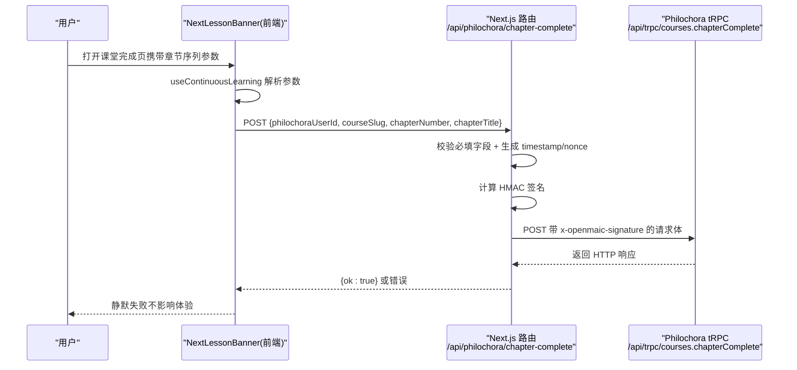
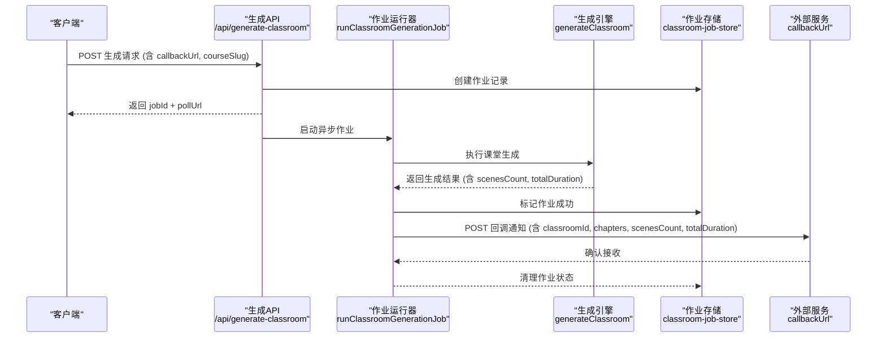
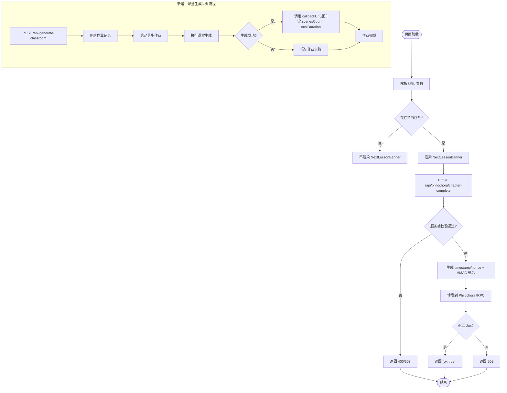

# Philochora 进度回调集成

<cite>
**本文引用的文件**   
- [app/api/philochora/chapter-complete/route.ts](file://app/api/philochora/chapter-complete/route.ts)
- [components/scene-renderers/next-lesson.tsx](file://components/scene-renderers/next-lesson.tsx)
- [lib/hooks/use-continuous-learning.ts](file://lib/hooks/use-continuous-learning.ts)
- [components/scene-renderers/classroom-complete.tsx](file://components/scene-renderers/classroom-complete.tsx)
- [e2e/tests/continuous-learning-callback.spec.ts](file://e2e/tests/continuous-learning-callback.spec.ts)
- [app/api/generate-classroom/route.ts](file://app/api/generate-classroom/route.ts)
- [app/api/generate-classroom/[jobId]/route.ts](file://app/api/generate-classroom/[jobId]/route.ts)
- [lib/server/classroom-generation.ts](file://lib/server/classroom-generation.ts)
- [lib/server/classroom-job-runner.ts](file://lib/server/classroom-job-runner.ts)
- [lib/server/classroom-job-store.ts](file://lib/server/classroom-job-store.ts)
</cite>

## 更新摘要
**所做更改**
- 新增课堂生成系统回调功能章节，支持外部服务通知和自动生成完成后的自动回调
- 更新核心业务流程，包含新的异步作业处理和回调机制
- 新增回调 URL 配置和服务间认证功能
- 扩展数据模型以支持章节映射和批量写入
- **新增增强功能**：课堂生成作业运行器现在在通知 Philochora 时传递场景数量和总时长元数据，为下游系统提供更好的资源规划和进度跟踪能力

## 产品概述
本章节聚焦 OpenMAIC 与 Philochora 的"连续学习"进度回传能力。当 OpenMAIC 课堂通过 Philochora 课程详情页以 iframe 形式嵌入时，OpenMAIC 会在课堂完成页自动上报当前章节完成状态至 Philochora，用于记录学习进度、同步章节高亮等。该能力由前端组件触发、服务端代理签名转发，并通过 URL 参数传递上下文信息，确保在跨页面跳转中保持用户与课程标识一致。

**更新** 新增了课堂生成系统的增强功能，支持在课堂内容生成完成后自动通知外部服务（如 Philochora），实现端到端的自动化流程。最新的增强包括传递场景数量和总时长信息，为下游系统提供宝贵的元数据。

## 核心业务流程
- **传统流程**：Philochora 将带有 chapters、chapterIndex、philochoraUserId、courseSlug 等参数的 URL 打开 OpenMAIC 课堂。
- **解析**：useContinuousLearning Hook 解析 URL 参数，构建章节序列与导航能力。
- **触发**：课堂完成页渲染 NextLessonBanner 组件，挂载时自动 POST /api/philochora/chapter-complete 上报当前章节完成。
- **转发**：服务端路由校验必填字段、构造 HMAC 签名并转发到 Philochora tRPC 端点。
- **结果**：成功返回 ok；失败静默处理，不影响课堂体验。

**新增流程**：课堂生成系统现在支持异步作业处理和回调通知：
- **作业创建**：POST /api/generate-classroom 接收生成请求，创建异步作业
- **进度跟踪**：GET /api/generate-classroom/[jobId] 提供实时进度查询
- **自动回调**：生成成功后自动调用配置的 callbackUrl 通知外部服务
- **认证机制**：通过 x-openmaic-api-key 头进行服务间认证
- **增强元数据**：回调时传递场景数量和总时长信息，支持更好的资源规划

**更新** 新增课堂生成回调流程图，包含增强的元数据传递：

**图表来源** 
- [components/scene-renderers/next-lesson.tsx:40-56](file://components/scene-renderers/next-lesson.tsx#L40-L56)
- [app/api/philochora/chapter-complete/route.ts:16-93](file://app/api/philochora/chapter-complete/route.ts#L16-L93)
- [lib/server/classroom-job-runner.ts:14-53](file://lib/server/classroom-job-runner.ts#L14-L53)
- [lib/server/classroom-generation.ts:546-570](file://lib/server/classroom-generation.ts#L546-L570)

**章节来源**
- [components/scene-renderers/next-lesson.tsx:40-56](file://components/scene-renderers/next-lesson.tsx#L40-L56)
- [app/api/philochora/chapter-complete/route.ts:16-93](file://app/api/philochora/chapter-complete/route.ts#L16-L93)
- [lib/server/classroom-job-runner.ts:55-98](file://lib/server/classroom-job-runner.ts#L55-L98)

## 功能模块清单
- **连续学习 Hook（useContinuousLearning）**
  - 职责：解析 URL 中的章节序列与用户/课程标识，提供导航与开关控制。
  - 验收要点：正确解码 base64 章节序列；维护 localStorage 中的连续学习开关；向父窗口发送当前章节索引。
- **下一节横幅（NextLessonBanner）**
  - 职责：在课堂完成页渲染，支持手动进入下一节与可取消倒计时自动跳转；挂载时自动上报章节完成。
  - 验收要点：无章节序列不渲染；有下一节且开启连续学习时显示倒计时；失败静默处理。
- **服务端代理路由（/api/philochora/chapter-complete）**
  - 职责：接收前端请求，校验必填字段，生成时间戳与随机数，计算 HMAC 签名，转发到 Philochora tRPC。
  - 验收要点：未配置环境变量返回 503；缺少必填字段返回 400；非 2xx 返回 502；成功返回 ok。
- **课堂完成页（ClassroomCompletePage）**
  - 职责：渲染完成总结与 NextLessonBanner，作为连续学习上报的承载容器。
  - 验收要点：完成页包含 NextLessonBanner 组件。

**新增模块**：
- **课堂生成 API（/api/generate-classroom）**
  - 职责：接收课堂生成请求，创建异步作业，返回作业 ID 和轮询 URL。
  - 验收要点：支持 callbackUrl、courseSlug、chapterMapping、serviceApiKey 参数；返回 202 状态码。
- **作业轮询 API（/api/generate-classroom/[jobId]）**
  - 职责：提供作业状态查询，包括进度、步骤、结果等信息。
  - 验收要点：支持作业状态检查、进度跟踪、结果获取。
- **作业运行器（runClassroomGenerationJob）**
  - 职责：执行课堂生成任务，管理作业生命周期，处理回调通知。
  - 验收要点：支持并发控制、错误处理、自动回调、状态持久化。
- **回调通知系统（notifyPhilochora）**
  - 职责：在课堂生成成功后调用外部服务，传递课程信息和章节映射。
  - 验收要点：支持服务间认证、错误处理、日志记录。
- **增强的元数据传递**
  - 职责：在回调通知中包含场景数量和总时长信息。
  - 验收要点：scenesCount 字段准确反映生成的场景数量；totalDuration 字段以分钟为单位估算总时长。

**章节来源**
- [lib/hooks/use-continuous-learning.ts:1-168](file://lib/hooks/use-continuous-learning.ts#L1-L168)
- [components/scene-renderers/next-lesson.tsx:1-154](file://components/scene-renderers/next-lesson.tsx#L1-L154)
- [app/api/philochora/chapter-complete/route.ts:1-94](file://app/api/philochora/chapter-complete/route.ts#L1-L94)
- [components/scene-renderers/classroom-complete.tsx:480-507](file://components/scene-renderers/classroom-complete.tsx#L480-L507)
- [app/api/generate-classroom/route.ts:1-77](file://app/api/generate-classroom/route.ts#L1-L77)
- [lib/server/classroom-job-runner.ts:1-102](file://lib/server/classroom-job-runner.ts#L1-L102)

## 数据与状态
- **URL 参数**
  - chapters：base64(encodeURIComponent(JSON)) 编码的章节数组，每项包含 n、title、cid。
  - chapterIndex：当前章节在序列中的索引。
  - philochoraUserId：Philochora 用户标识。
  - courseSlug：课程 slug。
  - resumeFrom：可选，异常恢复标记。
- **上报载荷**
  - philochoraUserId、courseSlug、chapterNumber（= currentIndex + 1）、chapterTitle（可选）。
- **服务端签名**
  - timestamp：毫秒时间戳。
  - nonce：随机字符串。
  - signature：HMAC-SHA256(payload)，payload 格式为 "userId:courseSlug:chapterNumber:timestamp:nonce"。
- **状态流转**
  - 前端：解析参数 → 决定是否渲染 NextLessonBanner → 挂载时上报章节完成 → 根据连续学习开关与 hasNext 控制倒计时与跳转。
  - 后端：校验 → 签名 → 转发 → 日志记录 → 返回统一响应。

**新增数据模型**：
- **课堂生成输入（GenerateClassroomInput）**
  - requirement：课堂生成需求描述。
  - callbackUrl：外部服务回调 URL（可选）。
  - courseSlug：课程标识（用于回调识别）。
  - chapterMapping：章节到 classroomId 的映射数组。
  - serviceApiKey：服务间认证密钥。
- **作业状态（ClassroomGenerationJob）**
  - status：作业状态（queued | running | succeeded | failed）。
  - step：当前步骤（initializing | researching | generating_outlines | ...）。
  - progress：进度百分比（0-100）。
  - result：生成结果（包含 classroomId、url、scenesCount）。
- **增强的回调载荷**
  - courseSlug：课程标识。
  - classroomId：生成的课堂 ID。
  - chapters：章节映射数组 [{ chapterNumber, classroomId }]。
  - **scenesCount**：生成的场景数量，用于资源规划。
  - **totalDuration**：估算的总时长（分钟），用于进度跟踪和资源分配。

**图表来源** 
- [lib/hooks/use-continuous-learning.ts:27-63](file://lib/hooks/use-continuous-learning.ts#L27-L63)
- [components/scene-renderers/next-lesson.tsx:40-56](file://components/scene-renderers/next-lesson.tsx#L40-L56)
- [app/api/philochora/chapter-complete/route.ts:30-93](file://app/api/philochora/chapter-complete/route.ts#L30-L93)
- [lib/server/classroom-job-runner.ts:55-98](file://lib/server/classroom-job-runner.ts#L55-L98)
- [lib/server/classroom-generation.ts:546-570](file://lib/server/classroom-generation.ts#L546-L570)

**章节来源**
- [lib/hooks/use-continuous-learning.ts:27-63](file://lib/hooks/use-continuous-learning.ts#L27-L63)
- [components/scene-renderers/next-lesson.tsx:40-56](file://components/scene-renderers/next-lesson.tsx#L40-L56)
- [app/api/philochora/chapter-complete/route.ts:30-93](file://app/api/philochora/chapter-complete/route.ts#L30-L93)
- [lib/server/classroom-generation.ts:40-59](file://lib/server/classroom-generation.ts#L40-L59)
- [lib/server/classroom-job-store.ts:17-41](file://lib/server/classroom-job-store.ts#L17-L41)

## 关键约束与边界
- **环境依赖**
  - PHILOCHORA_BASE_URL：必须配置，否则返回 503。
  - OPENMAIC_SHARED_SECRET：必须配置，否则返回 503。
- **输入校验**
  - 必填字段：philochoraUserId、courseSlug、chapterNumber；缺失返回 400。
- **安全策略**
  - 签名在服务端计算，避免共享密钥泄露到浏览器。
  - 请求头携带 x-openmaic-signature，供 Philochora 验签。
- **用户体验**
  - 回调失败静默处理，不影响课堂内容展示与交互。
  - 无连续学习上下文时不触发上报。
- **测试覆盖**
  - E2E 用例验证挂载时自动上报、payload 字段正确、503 场景不崩溃。

**新增约束**：
- **回调配置**
  - callbackUrl：可选的外部服务回调地址。
  - courseSlug：必需的课程标识，用于回调时识别课程。
  - serviceApiKey：可选的服务间认证密钥，通过 x-openmaic-api-key 头传递。
- **作业管理**
  - 作业 ID 格式验证：仅允许字母数字和下划线。
  - 并发控制：同一作业 ID 只允许一个运行实例。
  - 超时处理：30 分钟无更新的作业标记为过期。
- **错误处理**
  - 回调失败不影响主流程，仅记录警告日志。
  - 网络异常时重试机制有限制，避免无限重试。
- **元数据准确性**
  - scenesCount 必须准确反映实际生成的场景数量。
  - totalDuration 基于 speech actions 和其他 action 类型估算，提供合理的时长预估。

**章节来源**
- [app/api/philochora/chapter-complete/route.ts:17-43](file://app/api/philochora/chapter-complete/route.ts#L17-L43)
- [app/api/philochora/chapter-complete/route.ts:62-93](file://app/api/philochora/chapter-complete/route.ts#L62-L93)
- [components/scene-renderers/next-lesson.tsx:40-56](file://components/scene-renderers/next-lesson.tsx#L40-L56)
- [e2e/tests/continuous-learning-callback.spec.ts:46-93](file://e2e/tests/continuous-learning-callback.spec.ts#L46-L93)
- [e2e/tests/continuous-learning-callback.spec.ts:117-141](file://e2e/tests/continuous-learning-callback.spec.ts#L117-L141)
- [lib/server/classroom-job-runner.ts:14-53](file://lib/server/classroom-job-runner.ts#L14-L53)
- [lib/server/classroom-job-store.ts:96-98](file://lib/server/classroom-job-store.ts#L96-98)
- [lib/server/classroom-generation.ts:546-570](file://lib/server/classroom-generation.ts#L546-L570)