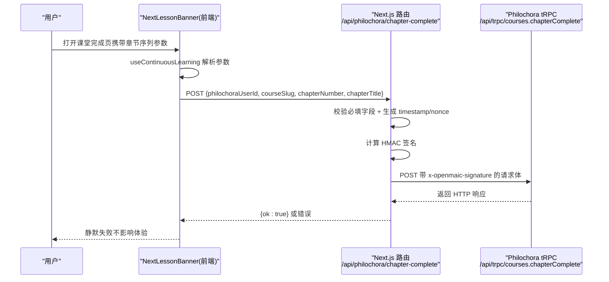
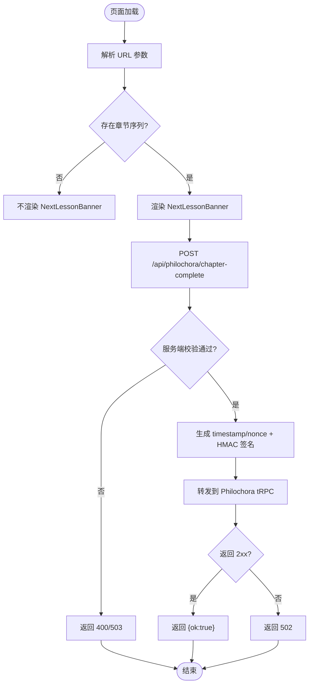

# Philochora 进度回调集成

<cite>
**本文引用的文件**   
- [app/api/philochora/chapter-complete/route.ts](file://app/api/philochora/chapter-complete/route.ts)
- [components/scene-renderers/next-lesson.tsx](file://components/scene-renderers/next-lesson.tsx)
- [lib/hooks/use-continuous-learning.ts](file://lib/hooks/use-continuous-learning.ts)
- [components/scene-renderers/classroom-complete.tsx](file://components/scene-renderers/classroom-complete.tsx)
- [e2e/tests/continuous-learning-callback.spec.ts](file://e2e/tests/continuous-learning-callback.spec.ts)
</cite>

## 产品概述
本章节聚焦 OpenMAIC 与 Philochora 的“连续学习”进度回传能力。当 OpenMAIC 课堂通过 Philochora 课程详情页以 iframe 形式嵌入时，OpenMAIC 会在课堂完成页自动上报当前章节完成状态至 Philochora，用于记录学习进度、同步章节高亮等。该能力由前端组件触发、服务端代理签名转发，并通过 URL 参数传递上下文信息，确保在跨页面跳转中保持用户与课程标识一致。

## 核心业务流程
- 入口：Philochora 将带有 chapters、chapterIndex、philochoraUserId、courseSlug 等参数的 URL 打开 OpenMAIC 课堂。
- 解析：useContinuousLearning Hook 解析 URL 参数，构建章节序列与导航能力。
- 触发：课堂完成页渲染 NextLessonBanner 组件，挂载时自动 POST /api/philochora/chapter-complete 上报当前章节完成。
- 转发：服务端路由校验必填字段、构造 HMAC 签名并转发到 Philochora tRPC 端点。
- 结果：成功返回 ok；失败静默处理，不影响课堂体验。

**图表来源** 
- [components/scene-renderers/next-lesson.tsx:40-56](file://components/scene-renderers/next-lesson.tsx#L40-L56)
- [app/api/philochora/chapter-complete/route.ts:16-93](file://app/api/philochora/chapter-complete/route.ts#L16-L93)

**章节来源**
- [components/scene-renderers/next-lesson.tsx:40-56](file://components/scene-renderers/next-lesson.tsx#L40-L56)
- [app/api/philochora/chapter-complete/route.ts:16-93](file://app/api/philochora/chapter-complete/route.ts#L16-L93)

## 功能模块清单
- 连续学习 Hook（useContinuousLearning）
  - 职责：解析 URL 中的章节序列与用户/课程标识，提供导航与开关控制。
  - 验收要点：正确解码 base64 章节序列；维护 localStorage 中的连续学习开关；向父窗口发送当前章节索引。
- 下一节横幅（NextLessonBanner）
  - 职责：在课堂完成页渲染，支持手动进入下一节与可取消倒计时自动跳转；挂载时自动上报章节完成。
  - 验收要点：无章节序列不渲染；有下一节且开启连续学习时显示倒计时；失败静默处理。
- 服务端代理路由（/api/philochora/chapter-complete）
  - 职责：接收前端请求，校验必填字段，生成时间戳与随机数，计算 HMAC 签名，转发到 Philochora tRPC。
  - 验收要点：未配置环境变量返回 503；缺少必填字段返回 400；非 2xx 返回 502；成功返回 ok。
- 课堂完成页（ClassroomCompletePage）
  - 职责：渲染完成总结与 NextLessonBanner，作为连续学习上报的承载容器。
  - 验收要点：完成页包含 NextLessonBanner 组件。

**章节来源**
- [lib/hooks/use-continuous-learning.ts:1-168](file://lib/hooks/use-continuous-learning.ts#L1-L168)
- [components/scene-renderers/next-lesson.tsx:1-154](file://components/scene-renderers/next-lesson.tsx#L1-L154)
- [app/api/philochora/chapter-complete/route.ts:1-94](file://app/api/philochora/chapter-complete/route.ts#L1-L94)
- [components/scene-renderers/classroom-complete.tsx:480-507](file://components/scene-renderers/classroom-complete.tsx#L480-L507)

## 数据与状态
- URL 参数
  - chapters：base64(encodeURIComponent(JSON)) 编码的章节数组，每项包含 n、title、cid。
  - chapterIndex：当前章节在序列中的索引。
  - philochoraUserId：Philochora 用户标识。
  - courseSlug：课程 slug。
  - resumeFrom：可选，异常恢复标记。
- 上报载荷
  - philochoraUserId、courseSlug、chapterNumber（= currentIndex + 1）、chapterTitle（可选）。
- 服务端签名
  - timestamp：毫秒时间戳。
  - nonce：随机字符串。
  - signature：HMAC-SHA256(payload)，payload 格式为 “userId:courseSlug:chapterNumber:timestamp:nonce”。
- 状态流转
  - 前端：解析参数 → 决定是否渲染 NextLessonBanner → 挂载时上报章节完成 → 根据连续学习开关与 hasNext 控制倒计时与跳转。
  - 后端：校验 → 签名 → 转发 → 日志记录 → 返回统一响应。

**图表来源** 
- [lib/hooks/use-continuous-learning.ts:27-63](file://lib/hooks/use-continuous-learning.ts#L27-L63)
- [components/scene-renderers/next-lesson.tsx:40-56](file://components/scene-renderers/next-lesson.tsx#L40-L56)
- [app/api/philochora/chapter-complete/route.ts:30-93](file://app/api/philochora/chapter-complete/route.ts#L30-L93)

**章节来源**
- [lib/hooks/use-continuous-learning.ts:27-63](file://lib/hooks/use-continuous-learning.ts#L27-L63)
- [components/scene-renderers/next-lesson.tsx:40-56](file://components/scene-renderers/next-lesson.tsx#L40-L56)
- [app/api/philochora/chapter-complete/route.ts:30-93](file://app/api/philochora/chapter-complete/route.ts#L30-L93)

## 关键约束与边界
- 环境依赖
  - PHILOCHORA_BASE_URL：必须配置，否则返回 503。
  - OPENMAIC_SHARED_SECRET：必须配置，否则返回 503。
- 输入校验
  - 必填字段：philochoraUserId、courseSlug、chapterNumber；缺失返回 400。
- 安全策略
  - 签名在服务端计算，避免共享密钥泄露到浏览器。
  - 请求头携带 x-openmaic-signature，供 Philochora 验签。
- 用户体验
  - 回调失败静默处理，不影响课堂内容展示与交互。
  - 无连续学习上下文时不触发上报。
- 测试覆盖
  - E2E 用例验证挂载时自动上报、payload 字段正确、503 场景不崩溃。

**章节来源**
- [app/api/philochora/chapter-complete/route.ts:17-43](file://app/api/philochora/chapter-complete/route.ts#L17-L43)
- [app/api/philochora/chapter-complete/route.ts:62-93](file://app/api/philochora/chapter-complete/route.ts#L62-L93)
- [components/scene-renderers/next-lesson.tsx:40-56](file://components/scene-renderers/next-lesson.tsx#L40-L56)
- [e2e/tests/continuous-learning-callback.spec.ts:46-93](file://e2e/tests/continuous-learning-callback.spec.ts#L46-L93)
- [e2e/tests/continuous-learning-callback.spec.ts:117-141](file://e2e/tests/continuous-learning-callback.spec.ts#L117-L141)