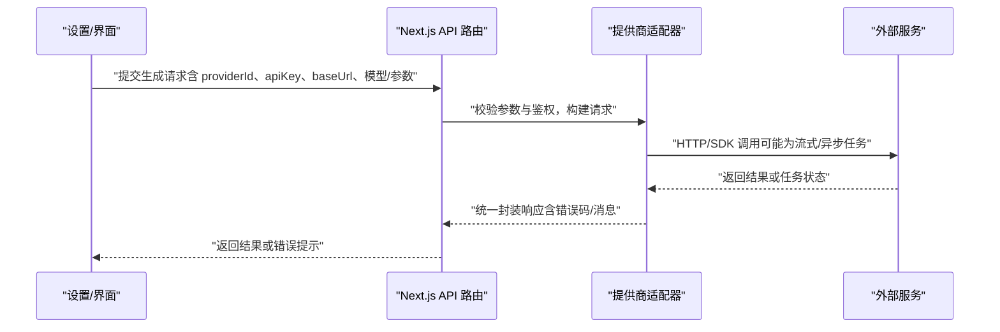
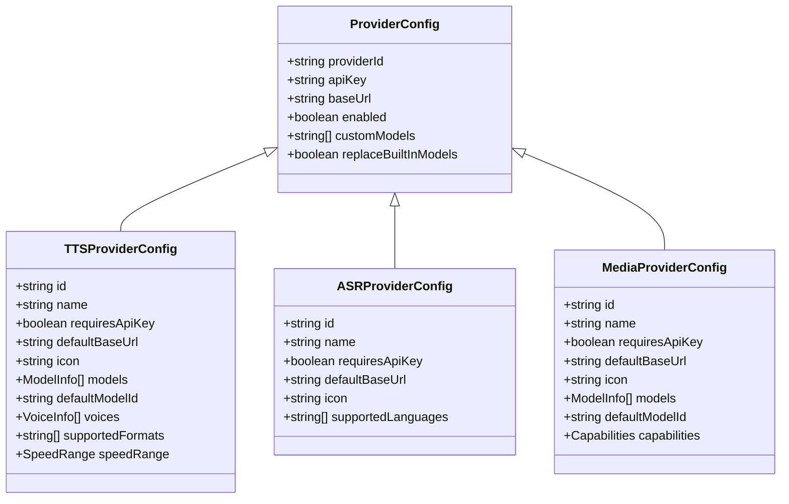
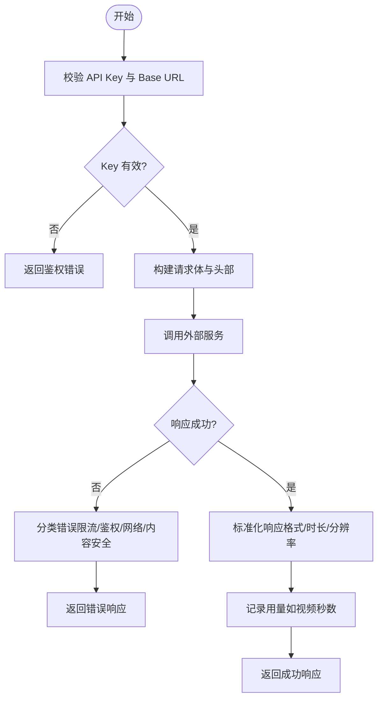
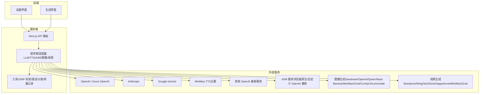
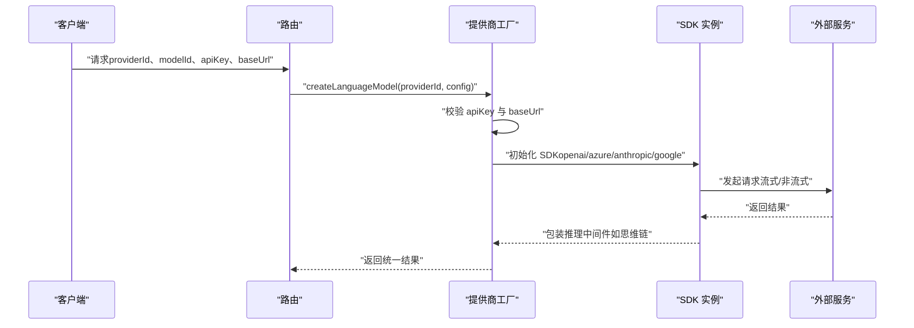
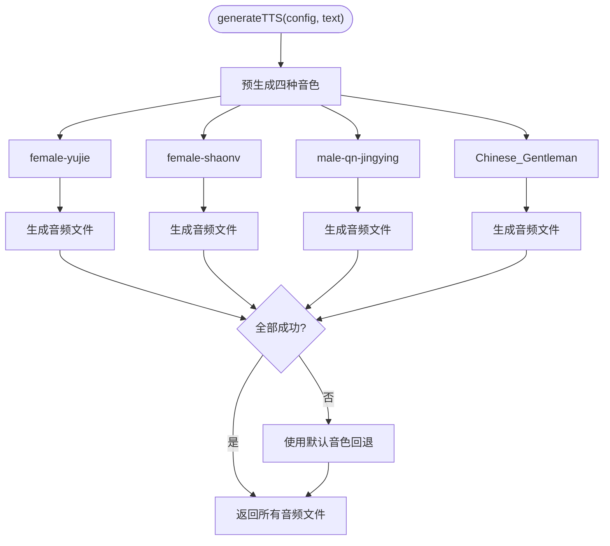
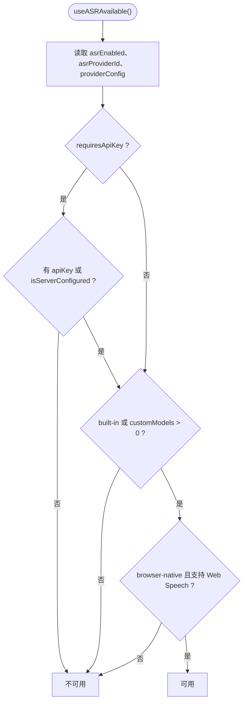
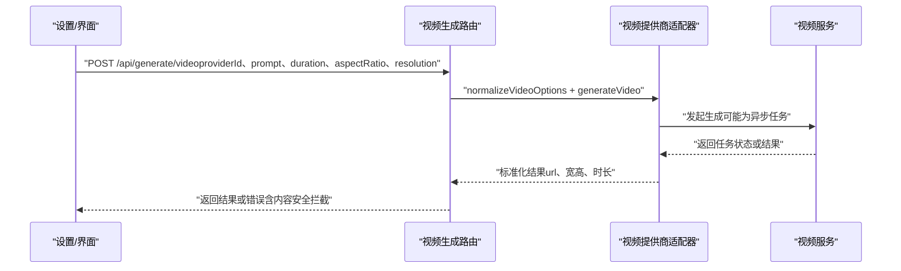
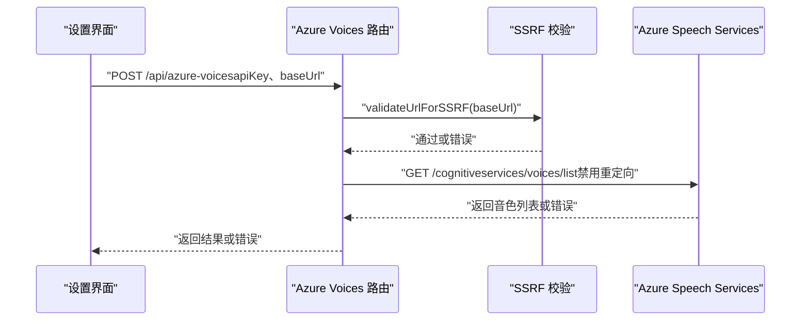

# 外部服务集成

<cite>
**本文引用的文件**   
- [lib/ai/providers.ts](file://lib/ai/providers.ts)
- [README-zh.md](file://README-zh.md)
- [lib/audio/tts-providers.ts](file://lib/audio/tts-providers.ts)
- [lib/audio/constants.ts](file://lib/audio/constants.ts)
- [lib/hooks/use-asr-available.ts](file://lib/hooks/use-asr-available.ts)
- [app/api/generate/video/route.ts](file://app/api/generate/video/route.ts)
- [lib/media/types.ts](file://lib/media/types.ts)
- [lib/media/comfyui-workflows.ts](file://lib/media/comfyui-workflows.ts)
- [app/api/comfyui-workflows/route.ts](file://app/api/comfyui-workflows/route.ts)
- [components/settings/index.tsx](file://components/settings/index.tsx)
- [app/api/azure-voices/route.ts](file://app/api/azure-voices/route.ts)
- [lib/server/classroom-media-generation.ts](file://lib/server/classroom-media-generation.ts)
- [lib/audio/types.ts](file://lib/audio/types.ts)
</cite>

## 更新摘要
**变更内容**   
- TTS提供商架构已简化，现在主要专注于MiniMax TTS集成以支持预生成架构
- 移除了多提供商抽象，系统采用单一提供商策略优化性能
- 语音解析器和常量文件已简化为仅包含四个预生成语音
- 更新了预生成语音架构的实现细节和使用方式

## 产品概述
OpenMAIC 是一个 AI 驱动的交互式课件（MAIC）生成与课堂管理平台，核心用户场景包括：通过自然语言生成结构化课件、课堂实时互动（问答/讨论/测验）、课件编辑与回放。平台通过统一的"提供商"抽象层对接多种外部 AI 服务，涵盖大模型对话（LLM）、文本转语音（TTS）、自动语音识别（ASR）、图像与视频生成等能力。对外部服务的接入遵循一致的认证、配置、错误处理与重试模式，便于扩展新的服务商或自定义实现。

**最新更新**：TTS提供商架构已简化为专注于MiniMax TTS的预生成架构，以提升课堂生成的性能和用户体验。

## 核心业务流程
- LLM 调用流程：客户端选择提供商与模型 → 服务端根据提供商类型创建 SDK 实例并注入密钥与 Base URL → 发起流式或非流式请求 → 统一包装推理过程（如思维链）→ 返回结果。
- **简化后的 TTS 调用流程**：前端选择 MiniMax TTS 提供商 → 服务端按预生成架构批量生成四种预设音色 → 返回统一格式（音频字节数组与格式）。
- ASR 可用性判定：结合全局开关、提供商是否需 API Key、浏览器原生能力与自定义模型配置，决定是否启用录音输入。
- 媒体生成（图像/视频）：统一入口路由接收参数与提供商能力归一化 → 调用对应提供商适配器 → 异步任务轮询（如需）→ 返回媒体资源信息。



**章节来源**
- [lib/ai/providers.ts:1516-1546](file://lib/ai/providers.ts#L1516-L1546)
- [lib/audio/tts-providers.ts:234-346](file://lib/audio/tts-providers.ts#L234-L346)
- [lib/hooks/use-asr-available.ts:25-50](file://lib/hooks/use-asr-available.ts#L25-L50)
- [app/api/generate/video/route.ts:69-109](file://app/api/generate/video/route.ts#L69-L109)

## 功能模块清单
- 大模型（LLM）提供商
  - 支持 OpenAI、Azure OpenAI、Anthropic、Google Gemini、MiniMax（Anthropic 兼容）、以及任意 OpenAI 兼容服务（DeepSeek、Qwen、Kimi、GLM、SiliconFlow、豆包、腾讯混元、小米 MiMo、Lemonade 等）。
  - 关键职责：统一鉴权、Base URL 解析、模型元数据与应用、思维链/推理中间件包装。
- **简化后的文本转语音（TTS）提供商**
  - **主要支持 MiniMax TTS**：专为预生成架构优化的单一提供商策略。
  - 保留其他提供商作为技术参考和测试用途，但生产环境推荐使用 MiniMax。
  - 关键职责：预生成语音管理、批量音频生成、格式标准化、错误分类与限流处理。
- 自动语音识别（ASR）提供商
  - 内置浏览器原生 ASR，支持自定义 OpenAI 兼容 ASR 提供商；提供可用性判定 Hook。
  - 关键职责：鉴权检查、模型配置校验、浏览器能力检测。
- 图像生成提供商
  - 支持 Seedream、OpenAI Image、Qwen Image、Nano Banana、MiniMax Image、Grok Image、ComfyUI、Lemonade。
  - 关键职责：提供商能力描述、工作流发现（ComfyUI）、参数归一化。
- 视频生成提供商
  - 支持 Seedance、Kling、Veo、Sora、HappyHorse、MiniMax Video、Grok Video。
  - 关键职责：参数归一化、内容安全过滤、使用量记录。
- ComfyUI 工作流管理
  - 工作流 JSON 文件发现与命名规范，前后端共享校验逻辑，确保 UI 列表与适配器接受一致。

**章节来源**
- [lib/ai/providers.ts:1-58](file://lib/ai/providers.ts#L1-L58)
- [lib/audio/tts-providers.ts:1-34](file://lib/audio/tts-providers.ts#L1-L34)
- [lib/audio/constants.ts:81-761](file://lib/audio/constants.ts#L81-L761)
- [lib/media/types.ts:1-100](file://lib/media/types.ts#L1-L100)
- [lib/media/comfyui-workflows.ts:1-55](file://lib/media/comfyui-workflows.ts#L1-L55)
- [app/api/comfyui-workflows/route.ts:1-23](file://app/api/comfyui-workflows/route.ts#L1-L23)
- [components/settings/index.tsx:194-212](file://components/settings/index.tsx#L194-L212)

## 数据与状态
- 提供商配置结构
  - 通用字段：providerId、apiKey、baseUrl、enabled、customModels、replaceBuiltInModels（部分类型）。
  - TTS/ASR：voices、supportedFormats、speedRange、supportedLanguages。
  - 图像/视频：models、aspect ratios、styles、默认模型与能力描述。
- **简化的提供商注册表**
  - TTS 与 ASR 的常量注册表集中定义，包含名称、图标、默认 Base URL、模型与音色列表、支持的格式与速率范围。
  - **预生成语音常量**：`PREGENERATED_VOICES` 包含四个固定音色：`female-yujie`、`female-shaonv`、`male-qn-jingying`、`Chinese (Mandarin)_Gentleman`。
- 运行时状态
  - 设置存储中维护各提供商的配置与启用状态；ASR 可用性由 Hook 统一计算（开关、鉴权、模型、浏览器能力）。
- 媒体工作流状态
  - ComfyUI 工作流以文件名约定进行发现与显示，前后端共享校验函数保证一致性。



**图表来源**
- [lib/audio/constants.ts:81-761](file://lib/audio/constants.ts#L81-L761)
- [lib/media/types.ts:1-100](file://lib/media/types.ts#L1-L100)

**章节来源**
- [lib/config/apply-token-plan.ts:290-321](file://lib/config/apply-token-plan.ts#L290-L321)
- [lib/hooks/use-asr-available.ts:25-50](file://lib/hooks/use-asr-available.ts#L25-L50)
- [lib/media/comfyui-workflows.ts:25-55](file://lib/media/comfyui-workflows.ts#L25-L55)

## 关键约束与边界
- 认证与安全
  - 所有需要 API Key 的提供商在调用前必须校验密钥存在；Azure TTS 拉取音色列表时禁用重定向以防止 SSRF。
  - 对 baseUrl 进行 SSRF 校验，禁止危险协议与内网地址。
- 错误处理与重试
  - TTS/ASR 错误分类：区分限流、鉴权失败、网络异常与服务端错误；针对特定错误（如敏感内容）返回明确状态码与消息。
  - 视频生成对内容安全过滤器拦截进行专门处理，记录警告并返回业务错误码。
- 性能与可用性
  - 流式响应与中间件包装（如推理过程）提升交互体验；异步任务型提供商采用轮询机制保障最终一致性。
  - **预生成架构优化**：通过批量生成四种预设音色，消除运行时延迟，提升课堂播放体验。
  - 提供商能力与模型元数据驱动 UI 控制项，减少无效请求。
- 扩展性
  - 新增提供商需遵循注册表与适配器模式：在类型定义与常量注册表中添加标识与元数据，实现适配器函数并在分发器中添加分支。
  - ComfyUI 工作流通过文件名约定与共享校验函数保证前后端一致性。



**章节来源**
- [app/api/azure-voices/route.ts:1-45](file://app/api/azure-voices/route.ts#L1-L45)
- [app/api/generate/video/route.ts:69-109](file://app/api/generate/video/route.ts#L69-L109)
- [lib/audio/tts-providers.ts:67-93](file://lib/audio/tts-providers.ts#L67-L93)

## 配置示例与环境变量
- LLM 提供商
  - OpenAI：设置 OPENAI_API_KEY 与 DEFAULT_MODEL。
  - Azure OpenAI：设置 API Key、Base URL 与部署模型名。
  - MiniMax：设置 MINIMAX_API_KEY、MINIMAX_BASE_URL 与 DEFAULT_MODEL。
- **简化后的 TTS/ASR 提供商**
  - **MiniMax TTS（推荐）**：设置 MINIMAX_API_KEY 与 MINIMAX_BASE_URL，支持预生成语音架构。
  - Lemonade：设置 LEMONADE_BASE_URL 及 TTS/ASR/IMAGE 专用 Base URL（用于开发测试）。
  - VoxCPM2：设置 TTS_VOXCPM_BASE_URL，无需 API Key（用于开发测试）。
- 图像/视频提供商
  - MiniMax 图像/视频：分别设置 IMAGE_MINIMAX_API_KEY、VIDEO_MINIMAX_API_KEY 与对应 Base URL。
  - OpenAI 图像：设置 IMAGE_OPENAI_API_KEY 与 IMAGE_OPENAI_BASE_URL。

**章节来源**
- [README-zh.md:120-177](file://README-zh.md#L120-L177)
- [README-zh.md:262-296](file://README-zh.md#L262-L296)

## 故障排除指南
- 鉴权失败
  - 检查提供商是否要求 API Key 且已正确配置；确认 Base URL 与端口可达。
- 限流或服务不可用
  - 观察错误分类是否为限流；适当退避重试或切换备用提供商。
- 内容安全拦截
  - 视频生成若被标记为敏感内容，调整提示词或更换提供商。
- 浏览器原生能力
  - ASR 使用浏览器原生能力时需确认浏览器支持 Web Speech API；否则禁用相关按钮。
- ComfyUI 工作流
  - 确保工作流 JSON 文件名符合命名约定（以 comfyui 开头或包含 workflow），且无路径穿越字符。
- **预生成语音问题**
  - 如果某个音色生成失败，系统会自动回退到 `DEFAULT_PREGENERATED_VOICE`（female-yujie）。
  - 检查 MiniMax API 密钥和基础 URL 配置是否正确。

**章节来源**
- [lib/hooks/use-asr-available.ts:25-50](file://lib/hooks/use-asr-available.ts#L25-L50)
- [app/api/generate/video/route.ts:96-109](file://app/api/generate/video/route.ts#L96-L109)
- [lib/media/comfyui-workflows.ts:49-55](file://lib/media/comfyui-workflows.ts#L49-L55)

## 架构总览


**图表来源**
- [lib/ai/providers.ts:1-58](file://lib/ai/providers.ts#L1-L58)
- [lib/audio/tts-providers.ts:1-34](file://lib/audio/tts-providers.ts#L1-L34)
- [lib/media/types.ts:1-100](file://lib/media/types.ts#L1-L100)
- [app/api/generate/video/route.ts:69-109](file://app/api/generate/video/route.ts#L69-L109)

## 详细组件分析

### 大模型（LLM）提供商集成
- 统一配置与鉴权：根据 providerType 选择 createOpenAI/createAzure/createAnthropic/createGoogleGenerativeAI 等 SDK 实例，注入 apiKey 与 baseURL。
- Base URL 解析：显式传入 > 提供商默认 > SDK 默认；对 Azure 与 MiniMax Anthropic 兼容 Base URL 进行规范化。
- 模型元数据：应用模型元数据与思考能力，支持思维链中间件包装。
- 错误处理：缺失 API Key 时抛出明确错误；后续调用由 SDK 与中间件统一处理。



**图表来源**
- [lib/ai/providers.ts:1516-1546](file://lib/ai/providers.ts#L1516-L1546)

**章节来源**
- [lib/ai/providers.ts:1-58](file://lib/ai/providers.ts#L1-L58)
- [lib/ai/providers.ts:1516-1546](file://lib/ai/providers.ts#L1516-L1546)

### **简化后的文本转语音（TTS）提供商集成**
- **预生成架构**：系统现在专注于 MiniMax TTS，通过预生成四种固定音色来优化课堂播放性能。
- **预生成语音常量**：`PREGENERATED_VOICES` 包含四个音色：`female-yujie`（御姐）、`female-shaonv`（少女）、`male-qn-jingying`（精英青年）、`Chinese (Mandarin)_Gentleman`（温润男声）。
- **批量生成流程**：课堂生成时为每个 speech action 同时合成四种音色的音频文件，支持用户即时切换。
- **回退机制**：如果某个音色生成失败，系统自动使用 `DEFAULT_PREGENERATED_VOICE`（female-yujie）作为默认值。
- **文件格式管理**：每个音色生成独立的音频文件，文件名通过 `voiceIdToFileName()` 函数转换为安全的文件名格式。



**图表来源**
- [lib/audio/tts-providers.ts:234-346](file://lib/audio/tts-providers.ts#L234-346)
- [lib/audio/constants.ts:55-65](file://lib/audio/constants.ts#L55-L65)
- [lib/server/classroom-media-generation.ts:254-276](file://lib/server/classroom-media-generation.ts#L254-L276)

**章节来源**
- [lib/audio/tts-providers.ts:1-34](file://lib/audio/tts-providers.ts#L1-L34)
- [lib/audio/tts-providers.ts:67-93](file://lib/audio/tts-providers.ts#L67-L93)
- [lib/audio/tts-providers.ts:234-346](file://lib/audio/tts-providers.ts#L234-L346)
- [lib/audio/constants.ts:55-65](file://lib/audio/constants.ts#L55-L65)
- [lib/server/classroom-media-generation.ts:254-276](file://lib/server/classroom-media-generation.ts#L254-L276)

### 自动语音识别（ASR）可用性判定
- 可用性条件：全局开关 asrEnabled、提供商是否需要 API Key、自定义模型配置、浏览器原生能力。
- 判断逻辑：结合设置存储与 Hook 计算，确保所有调用点统一受控。



**图表来源**
- [lib/hooks/use-asr-available.ts:25-50](file://lib/hooks/use-asr-available.ts#L25-L50)

**章节来源**
- [lib/hooks/use-asr-available.ts:25-50](file://lib/hooks/use-asr-available.ts#L25-L50)

### 图像与视频生成提供商集成
- 图像提供商：类型定义与注册表集中管理，支持多提供商与 ComfyUI 工作流发现。
- 视频提供商：统一路由接收参数与能力归一化，调用 generateVideo，记录用量，处理内容安全拦截。
- ComfyUI 工作流：文件名命名规范与共享校验函数确保 UI 列表与适配器接受一致。



**图表来源**
- [app/api/generate/video/route.ts:69-109](file://app/api/generate/video/route.ts#L69-L109)
- [lib/media/types.ts:1-100](file://lib/media/types.ts#L1-L100)
- [lib/media/comfyui-workflows.ts:1-55](file://lib/media/comfyui-workflows.ts#L1-L55)

**章节来源**
- [lib/media/types.ts:1-100](file://lib/media/types.ts#L1-L100)
- [app/api/generate/video/route.ts:69-109](file://app/api/generate/video/route.ts#L69-L109)
- [lib/media/comfyui-workflows.ts:1-55](file://lib/media/comfyui-workflows.ts#L1-L55)
- [app/api/comfyui-workflows/route.ts:1-23](file://app/api/comfyui-workflows/route.ts#L1-L23)

### Azure TTS 音色列表获取
- 安全校验：对 baseUrl 进行 SSRF 校验，禁用重定向防止 SSRF 攻击。
- 鉴权：使用 Ocp-Apim-Subscription-Key 头传递 API Key。
- 错误处理：重定向与非法 URL 返回明确错误码。



**图表来源**
- [app/api/azure-voices/route.ts:1-45](file://app/api/azure-voices/route.ts#L1-L45)

**章节来源**
- [app/api/azure-voices/route.ts:1-45](file://app/api/azure-voices/route.ts#L1-L45)

## 依赖分析
- 组件耦合与内聚
  - 提供商适配器与注册表解耦：类型定义与常量注册表集中管理，适配器按 providerId 分发，降低耦合度。
  - 路由与适配器分离：Next.js 路由仅负责参数校验与错误分类，具体调用由适配器完成。
- 外部依赖
  - Vercel AI SDK（@ai-sdk/openai、@ai-sdk/azure、@ai-sdk/anthropic、@ai-sdk/google）用于 LLM 调用。
  - 浏览器原生 Web Speech API 用于 ASR。
  - ComfyUI 工作流 JSON 文件作为静态资源，通过文件名约定发现。
- 潜在循环依赖
  - 通过分层与模块化避免循环依赖；工具函数与常量独立于适配器实现。

```mermaid
graph TB
Types["类型定义media/types.ts、audio/types.ts"]
Constants["常量注册表audio/constants.ts]
Adapters["适配器tts-providers.ts、providers.ts"]
Routes["路由video/route.ts、azure-voices/route.ts"]
Utils["工具SSRF 校验、错误分类"]
Types --> Constants
Constants --> Adapters
Adapters --> Routes
Routes --> Utils
```

**图表来源**
- [lib/media/types.ts:1-100](file://lib/media/types.ts#L1-L100)
- [lib/audio/constants.ts:81-761](file://lib/audio/constants.ts#L81-L761)
- [lib/audio/tts-providers.ts:1-34](file://lib/audio/tts-providers.ts#L1-L34)
- [lib/ai/providers.ts:1-58](file://lib/ai/providers.ts#L1-L58)
- [app/api/generate/video/route.ts:69-109](file://app/api/generate/video/route.ts#L69-L109)
- [app/api/azure-voices/route.ts:1-45](file://app/api/azure-voices/route.ts#L1-L45)

**章节来源**
- [lib/media/types.ts:1-100](file://lib/media/types.ts#L1-L100)
- [lib/audio/constants.ts:81-761](file://lib/audio/constants.ts#L81-L761)
- [lib/audio/tts-providers.ts:1-34](file://lib/audio/tts-providers.ts#L1-L34)
- [lib/ai/providers.ts:1-58](file://lib/ai/providers.ts#L1-L58)
- [app/api/generate/video/route.ts:69-109](file://app/api/generate/video/route.ts#L69-L109)
- [app/api/azure-voices/route.ts:1-45](file://app/api/azure-voices/route.ts#L1-L45)

## 性能考虑
- 流式响应与中间件：LLM 调用支持流式输出，提升交互体验；推理中间件包装减少额外开销。
- 异步任务轮询：视频生成等长耗时任务采用轮询机制，避免阻塞。
- **预生成架构优化**：通过批量生成四种预设音色，消除运行时延迟，显著提升课堂播放的即时性和流畅性。
- 提供商能力元数据：UI 控制项基于能力描述，减少无效请求与参数校验失败。

## 故障排除指南
- 鉴权失败：检查 API Key 与 Base URL；确认提供商是否要求密钥。
- 限流或服务不可用：观察错误分类，适当退避重试或切换提供商。
- 内容安全拦截：调整提示词或更换提供商。
- 浏览器原生能力：确认浏览器支持 Web Speech API。
- ComfyUI 工作流：确保文件名符合命名规范，无路径穿越字符。
- **预生成语音问题**：检查 MiniMax API 配置，确认四个预设音色都能正常生成。

**章节来源**
- [lib/hooks/use-asr-available.ts:25-50](file://lib/hooks/use-asr-available.ts#L25-L50)
- [app/api/generate/video/route.ts:96-109](file://app/api/generate/video/route.ts#L96-L109)
- [lib/media/comfyui-workflows.ts:49-55](file://lib/media/comfyui-workflows.ts#L49-L55)

## 结论
OpenMAIC 的外部服务集成通过统一的提供商抽象层与注册表机制，实现了 LLM、TTS、ASR、图像与视频生成的灵活接入。**最新的 TTS 架构简化为专注于 MiniMax TTS 的预生成模式**，通过批量生成四种预设音色来优化课堂播放性能。配置与鉴权集中在常量与适配器中，错误处理与重试机制完善，便于扩展新的服务提供商与自定义实现。通过 SSRF 校验、内容安全过滤与用量记录，系统在安全性与可观测性方面具备良好实践。

**预生成架构的优势**：
- 消除运行时延迟，提升用户体验
- 支持用户即时切换不同音色
- 简化了 TTS 提供商的管理复杂度
- 提高了课堂生成的整体性能