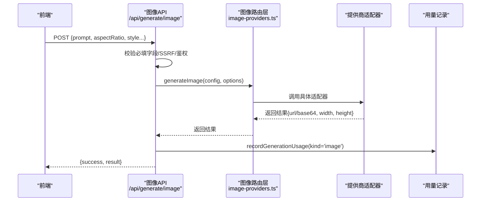
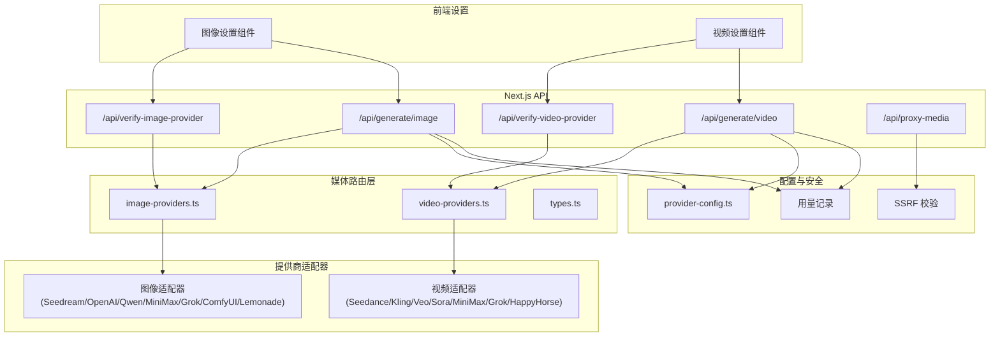
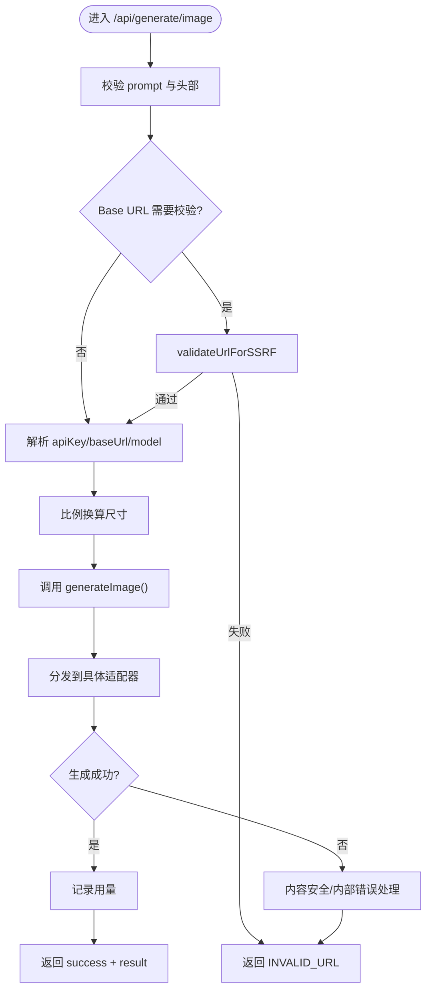
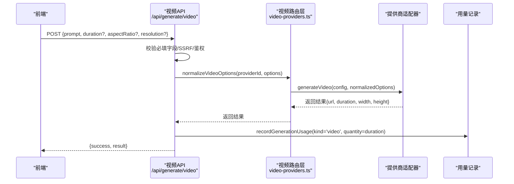
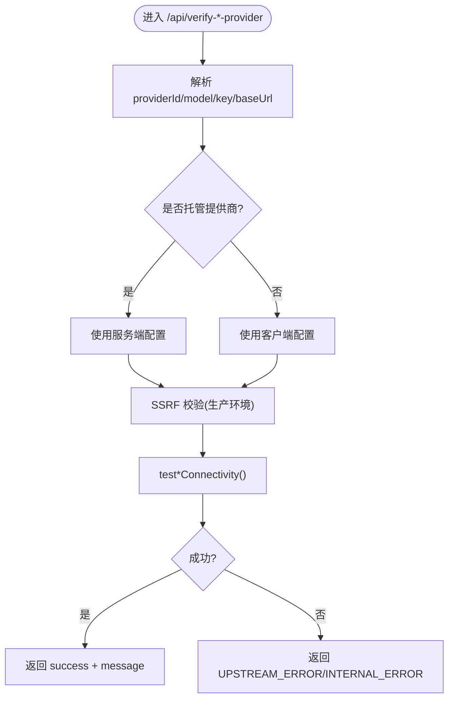
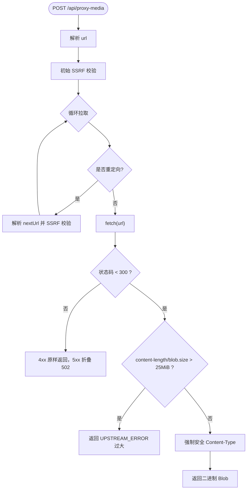
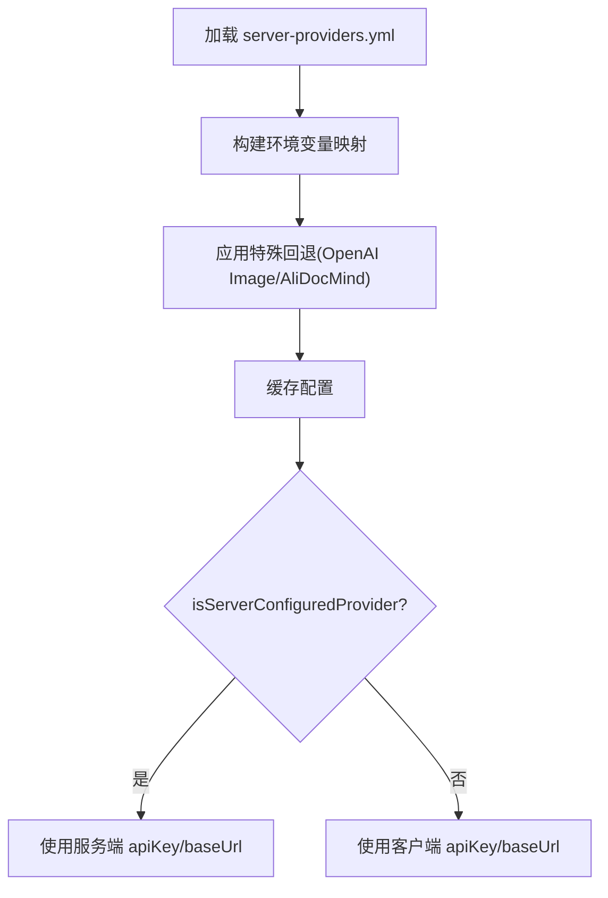
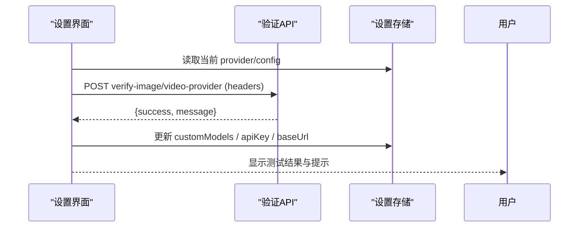
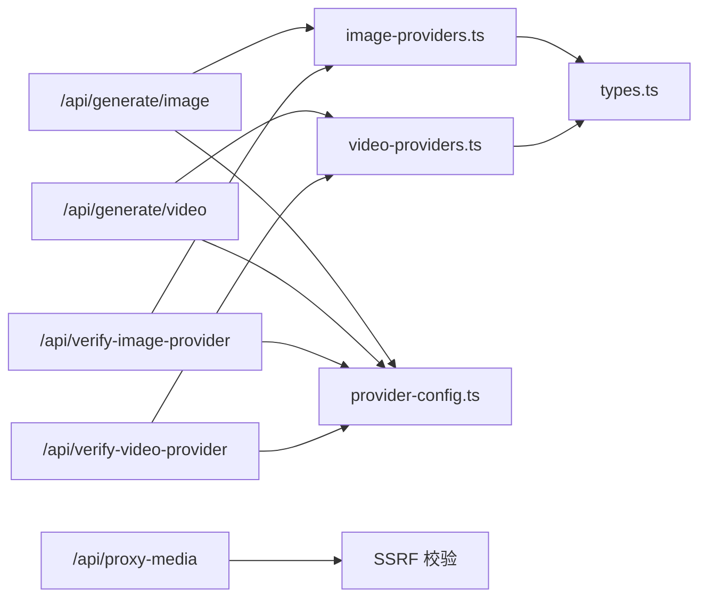

# 媒体生成服务

<cite>
**本文引用的文件**   
- [app/api/generate/image/route.ts](file://app\api\generate\image\route.ts)
- [app/api/generate/video/route.ts](file://app\api\generate\video\route.ts)
- [app/api/verify-image-provider/route.ts](file://app\api\verify-image-provider\route.ts)
- [app/api/verify-video-provider/route.ts](file://app\api\verify-video-provider\route.ts)
- [lib/media/image-providers.ts](file://lib\media\image-providers.ts)
- [lib/media/video-providers.ts](file://lib\media\video-providers.ts)
- [lib/media/types.ts](file://lib\media\types.ts)
- [lib/server/provider-config.ts](file://lib\server\provider-config.ts)
- [app/api/proxy-media/route.ts](file://app\api\proxy-media\route.ts)
- [components/settings/image-settings.tsx](file://components\settings\image-settings.tsx)
- [components/settings/video-settings.tsx](file://components\settings\video-settings.tsx)
</cite>

## 产品概述
OpenMAIC 的媒体生成服务为课件自动生成与编辑提供统一的图像与视频生成能力。系统通过多提供商适配器（如 Seedream、OpenAI Image、Qwen Image、MiniMax、Grok、ComfyUI、Lemonade 等）和多种视频模型（Seedance、Kling、Veo、Sora、MiniMax、Grok、HappyHorse 等），将提示词转换为高质量图像或短视频，并支持分辨率、比例、时长、帧率等参数控制。服务端统一鉴权与配置管理，前端提供可视化设置与连通性测试，便于在课件生成流程中自动插入合适的媒体内容。

## 核心业务流程
- 图像生成流程：前端选择提供商与模型 → 调用 /api/generate/image → 服务端校验与解析参数 → 路由到对应适配器 → 返回图片 URL/Base64 与尺寸信息 → 记录用量。
- 视频生成流程：前端选择提供商与模型 → 调用 /api/generate/video → 服务端规范化选项（时长/比例/分辨率）→ 路由到对应适配器 → 返回视频 URL 与元数据 → 按秒计费记录用量。
- 提供商验证流程：前端输入 API Key/Base URL → 调用 /api/verify-image-provider 或 /api/verify-video-provider → 轻量连通性测试 → 反馈成功/失败消息。
- 媒体代理流程：浏览器无法直接跨域拉取远端媒体时，通过 /api/proxy-media 以服务端代理下载 Blob，限制大小与重定向次数，强制安全 Content-Type。



**图表来源** 
- [app/api/generate/image/route.ts](file://app\api\generate\image\route.ts)
- [lib/media/image-providers.ts](file://lib\media\image-providers.ts)

**章节来源**
- [app/api/generate/image/route.ts](file://app\api\generate\image\route.ts)
- [app/api/generate/video/route.ts](file://app\api\generate\video\route.ts)
- [app/api/verify-image-provider/route.ts](file://app\api\verify-image-provider\route.ts)
- [app/api/verify-video-provider/route.ts](file://app\api\verify-video-provider\route.ts)
- [lib/media/image-providers.ts](file://lib\media\image-providers.ts)
- [lib/media/video-providers.ts](file://lib\media\video-providers.ts)
- [app/api/proxy-media/route.ts](file://app\api\proxy-media\route.ts)

## 功能模块清单
- 图像生成服务
  - 职责：接收提示词与风格/比例/尺寸等参数，调用多提供商适配器生成图像，返回 URL 或 Base64 及尺寸。
  - 用户价值：快速获得符合课件场景的高质量插图，支持多模型与自定义工作流（ComfyUI）。
  - 验收要点：必填 prompt；可选 negativePrompt、aspectRatio、style；支持宽高或比例换算；错误包含内容安全拦截提示。
- 视频生成服务
  - 职责：接收提示词与时长/比例/分辨率等参数，调用多提供商适配器生成短视频，返回 URL 与元数据。
  - 用户价值：为课件片段生成动态演示，支持不同时长与清晰度。
  - 验收要点：duration/aspectRatio/resolution 被规范化为提供商支持的集合；错误包含内容安全拦截提示。
- 提供商验证服务
  - 职责：轻量校验 API Key 与 Base URL 是否可用，不触发实际生成。
  - 用户价值：降低配置错误导致的失败成本，提升排障效率。
- 媒体代理服务
  - 职责：跨域拉取远端媒体为 Blob，限制大小与重定向，强制安全 Content-Type。
  - 用户价值：解决浏览器 CORS 限制，保障资源持久化与缓存。
- 提供商配置与服务端管理
  - 职责：从 YAML + 环境变量加载各提供商配置，区分“服务端托管”与“客户端自建”，统一解析 API Key 与 Base URL。
  - 用户价值：集中管控密钥与模型白名单，避免敏感信息泄露。
- 前端设置界面
  - 职责：展示内置/自定义模型，支持 ComfyUI 工作流选择，提供连通性测试与错误提示。
  - 用户价值：直观配置与调试，提升可用性。

**章节来源**
- [lib/media/types.ts](file://lib\media\types.ts)
- [lib/media/image-providers.ts](file://lib\media\image-providers.ts)
- [lib/media/video-providers.ts](file://lib\media\video-providers.ts)
- [lib/server/provider-config.ts](file://lib\server\provider-config.ts)
- [components/settings/image-settings.tsx](file://components\settings\image-settings.tsx)
- [components/settings/video-settings.tsx](file://components\settings\video-settings.tsx)

## 数据与状态
- 图像类型与配置
  - ImageProviderId：枚举所有图像提供商 ID。
  - ImageProviderConfig：描述提供商能力（名称、是否需密钥、默认 Base URL、模型列表、支持比例、最大分辨率等）。
  - ImageGenerationConfig：运行时配置（providerId、apiKey、baseUrl、model）。
  - ImageGenerationOptions：单次请求参数（prompt、negativePrompt、width/height、aspectRatio、style）。
  - ImageGenerationResult：输出（url/base64、width、height）。
- 视频类型与配置
  - VideoProviderId：枚举所有视频提供商 ID。
  - VideoProviderConfig：描述提供商能力（名称、是否需密钥、默认 Base URL、模型列表、支持比例、支持时长、支持分辨率、最大时长）。
  - VideoGenerationConfig：运行时配置（providerId、apiKey、baseUrl、model）。
  - VideoGenerationOptions：单次请求参数（prompt、duration、aspectRatio、resolution）。
  - VideoGenerationResult：输出（url、duration、width、height、poster）。
- 服务端配置
  - 从 server-providers.yml 与环境变量合并加载，映射 IMAGE_ENV_MAP/VIDEO_ENV_MAP 等前缀。
  - isServerConfiguredProvider(section, providerId) 判断是否为服务端托管。
  - resolveImageApiKey/resolveVideoApiKey 与 resolveImageBaseUrl/resolveVideoBaseUrl 决定最终密钥与 Base URL。
- 媒体代理
  - 接受 url，限制重定向次数与文件大小，强制安全 Content-Type，返回二进制 Blob。

```mermaid
classDiagram
class ImageProviderConfig {
+id : ImageProviderId
+name : string
+requiresApiKey : boolean
+defaultBaseUrl? : string
+icon? : string
+models : ImageModelInfo[]
+supportedAspectRatios : Array<string>
+supportedStyles? : string[]
+maxResolution? : {width : number; height : number}
}
class VideoProviderConfig {
+id : VideoProviderId
+name : string
+requiresApiKey : boolean
+defaultBaseUrl? : string
+icon? : string
+models : VideoModelInfo[]
+supportedAspectRatios : Array<string>
+supportedDurations? : number[]
+supportedResolutions? : Array<string>
+maxDuration? : number
}
class ImageGenerationOptions {
+prompt : string
+negativePrompt? : string
+width? : number
+height? : number
+aspectRatio? : string
+style? : string
}
class VideoGenerationOptions {
+prompt : string
+duration? : number
+aspectRatio? : string
+resolution? : string
}
class ImageGenerationResult {
+url? : string
+base64? : string
+width : number
+height : number
}
class VideoGenerationResult {
+url : string
+duration : number
+width : number
+height : number
+poster? : string
}
ImageProviderConfig --> ImageGenerationOptions : "约束能力"
VideoProviderConfig --> VideoGenerationOptions : "约束能力"
ImageGenerationOptions --> ImageGenerationResult : "产出"
VideoGenerationOptions --> VideoGenerationResult : "产出"
```

**图表来源**
- [lib/media/types.ts](file://lib\media\types.ts)

**章节来源**
- [lib/media/types.ts](file://lib\media\types.ts)
- [lib/server/provider-config.ts](file://lib\server\provider-config.ts)

## 关键约束与边界
- 安全性
  - SSRF 防护：所有外部 URL（包括 Base URL 与重定向链）均进行校验，生产环境严格限制。
  - 内容安全过滤：若上游返回敏感内容拦截（如 SensitiveContent），统一返回 CONTENT_SENSITIVE 错误码。
  - 媒体代理安全：仅允许 image/video/audio 等安全 Content-Type，其他强制 octet-stream；限制最大字节数与重定向次数。
- 性能与超时
  - 图像/视频接口 maxDuration=300s，适配长任务（如 ComfyUI 轮询）。
  - 媒体代理接口 maxDuration=60s，防止大文件或慢上游占用资源。
  - 视频选项规范化：未指定或不被支持的 duration/aspectRatio/resolution 将被回退到提供商首个支持值。
- 配置优先级
  - 服务端托管提供商：服务端 apiKey/baseUrl 权威，忽略客户端传入值。
  - 非托管提供商：使用客户端传入的 apiKey/baseUrl。
  - OpenAI Image 特殊回退：若未显式配置 openai-image，但存在 OPENAI_API_KEY，则自动创建 openai-image 条目。
- 业务约束
  - 图像：必须提供 prompt；可选 negativePrompt、style；宽高可由比例换算。
  - 视频：必须提供 prompt；duration/aspectRatio/resolution 受限于提供商能力；按秒计费记录用量。
  - 媒体代理：禁止过大文件与过多重定向；上游 4xx 原样返回，5xx 折叠为 502。

**章节来源**
- [app/api/generate/image/route.ts](file://app\api\generate\image\route.ts)
- [app/api/generate/video/route.ts](file://app\api\generate\video\route.ts)
- [app/api/verify-image-provider/route.ts](file://app\api\verify-image-provider\route.ts)
- [app/api/verify-video-provider/route.ts](file://app\api\verify-video-provider\route.ts)
- [lib/media/video-providers.ts](file://lib\media\video-providers.ts)
- [lib/server/provider-config.ts](file://lib\server\provider-config.ts)
- [app/api/proxy-media/route.ts](file://app\api\proxy-media\route.ts)

## 架构总览


**图表来源**
- [app/api/generate/image/route.ts](file://app\api\generate\image\route.ts)
- [app/api/generate/video/route.ts](file://app\api\generate\video\route.ts)
- [app/api/verify-image-provider/route.ts](file://app\api\verify-image-provider\route.ts)
- [app/api/verify-video-provider/route.ts](file://app\api\verify-video-provider\route.ts)
- [lib/media/image-providers.ts](file://lib\media\image-providers.ts)
- [lib/media/video-providers.ts](file://lib\media\video-providers.ts)
- [lib/server/provider-config.ts](file://lib\server\provider-config.ts)
- [app/api/proxy-media/route.ts](file://app\api\proxy-media\route.ts)
- [components/settings/image-settings.tsx](file://components\settings\image-settings.tsx)
- [components/settings/video-settings.tsx](file://components\settings\video-settings.tsx)

## 详细组件分析

### 图像生成服务
- 入口与校验
  - 必填 prompt；可选 negativePrompt、aspectRatio、style。
  - 根据 x-image-provider 头选择提供商；托管提供商忽略客户端 key/baseUrl。
  - 若提供 aspectRatio 且未设宽高，则按比例换算尺寸。
  - SSRF 校验与内容安全拦截处理。
- 路由与适配器
  - 通过 image-providers.ts 的 generateImage() 分发至具体适配器。
  - 适配器实现由 types.ts 定义的 ImageGenerationOptions/Result 契约。
- 用量记录
  - 每次生成记录 kind=image，单位 image，数量 1。



**图表来源**
- [app/api/generate/image/route.ts](file://app\api\generate\image\route.ts)
- [lib/media/image-providers.ts](file://lib\media\image-providers.ts)

**章节来源**
- [app/api/generate/image/route.ts](file://app\api\generate\image\route.ts)
- [lib/media/image-providers.ts](file://lib\media\image-providers.ts)
- [lib/media/types.ts](file://lib\media\types.ts)

### 视频生成服务
- 入口与校验
  - 必填 prompt；可选 duration、aspectRatio、resolution。
  - 根据 x-video-provider 头选择提供商；托管提供商忽略客户端 key/baseUrl。
  - 生产环境对 Base URL 进行 SSRF 校验。
- 选项规范化
  - normalizeVideoOptions() 将 duration/aspectRatio/resolution 回退到提供商支持的首个值。
- 路由与适配器
  - 通过 video-providers.ts 的 generateVideo() 分发至具体适配器。
- 用量记录
  - 每次生成记录 kind=video，单位 second，数量=duration。



**图表来源**
- [app/api/generate/video/route.ts](file://app\api\generate\video\route.ts)
- [lib/media/video-providers.ts](file://lib\media\video-providers.ts)

**章节来源**
- [app/api/generate/video/route.ts](file://app\api\generate\video\route.ts)
- [lib/media/video-providers.ts](file://lib\media\video-providers.ts)
- [lib/media/types.ts](file://lib\media\types.ts)

### 提供商验证服务
- 图像验证
  - 轻量连通性测试，不触发生成；限制 maxDuration=30s。
  - 托管提供商忽略客户端 key/baseUrl；生产环境 SSRF 校验。
- 视频验证
  - 同上，针对视频提供商；生产环境 SSRF 校验。



**图表来源**
- [app/api/verify-image-provider/route.ts](file://app\api\verify-image-provider\route.ts)
- [app/api/verify-video-provider/route.ts](file://app\api\verify-video-provider\route.ts)
- [lib/media/image-providers.ts](file://lib\media\image-providers.ts)
- [lib/media/video-providers.ts](file://lib\media\video-providers.ts)

**章节来源**
- [app/api/verify-image-provider/route.ts](file://app\api\verify-image-provider\route.ts)
- [app/api/verify-video-provider/route.ts](file://app\api\verify-video-provider\route.ts)

### 媒体代理服务
- 功能要点
  - 接收 url，限制重定向次数（最多 5 次），逐跳 SSRF 校验。
  - 限制最大字节数（25 MiB），强制安全 Content-Type（image/video/audio 或 octet-stream）。
  - 上游 4xx 原样返回，5xx 折叠为 502。
- 适用场景
  - 浏览器跨域拉取远端媒体失败时，作为服务端代理下载 Blob，用于 IndexedDB 持久化与缓存。



**图表来源**
- [app/api/proxy-media/route.ts](file://app\api\proxy-media\route.ts)

**章节来源**
- [app/api/proxy-media/route.ts](file://app\api\proxy-media\route.ts)

### 提供商配置与服务端管理
- 配置加载
  - 从 server-providers.yml 与环境变量合并，IMAGE_ENV_MAP/VIDEO_ENV_MAP 映射 providerId。
  - OpenAI Image 特殊回退：OPENAI_API_KEY 存在时自动创建 openai-image 条目。
- 托管与非托管
  - isServerConfiguredProvider(section, providerId) 判定托管。
  - resolveImageApiKey/resolveVideoApiKey 与 resolveImageBaseUrl/resolveVideoBaseUrl 决定最终密钥与 Base URL。
- 并发与限流
  - getParallelSceneConcurrency() 控制并行场景生成并发度（与媒体生成间接相关）。



**图表来源**
- [lib/server/provider-config.ts](file://lib\server\provider-config.ts)

**章节来源**
- [lib/server/provider-config.ts](file://lib\server\provider-config.ts)

### 前端设置界面
- 图像设置
  - 显示内置/自定义模型；ComfyUI 工作流列表与选择；连通性测试与错误提示。
  - 托管提供商隐藏编辑输入，提示管理员配置。
- 视频设置
  - 显示内置/自定义模型；连通性测试与错误提示。
  - 托管提供商隐藏编辑输入，提示管理员配置。



**图表来源**
- [components/settings/image-settings.tsx](file://components\settings\image-settings.tsx)
- [components/settings/video-settings.tsx](file://components\settings\video-settings.tsx)
- [app/api/verify-image-provider/route.ts](file://app\api\verify-image-provider\route.ts)
- [app/api/verify-video-provider/route.ts](file://app\api\verify-video-provider\route.ts)

**章节来源**
- [components/settings/image-settings.tsx](file://components\settings\image-settings.tsx)
- [components/settings/video-settings.tsx](file://components\settings\video-settings.tsx)

## 依赖分析
- 模块耦合
  - API 路由层依赖 provider-config.ts 进行鉴权与 Base URL 解析。
  - 媒体路由层（image-providers.ts、video-providers.ts）依赖 types.ts 定义的数据契约。
  - 适配器实现由路由层分发，保持低耦合与可扩展性。
- 外部依赖
  - SSRF 校验工具用于所有外部 URL。
  - 用量记录模块用于计费与统计。
- 潜在风险
  - 新增提供商需在 types.ts、providers 路由层、以及前端设置界面同步扩展。
  - 托管提供商配置变更会影响所有客户端，需谨慎发布。



**图表来源**
- [app/api/generate/image/route.ts](file://app\api\generate\image\route.ts)
- [app/api/generate/video/route.ts](file://app\api\generate\video\route.ts)
- [app/api/verify-image-provider/route.ts](file://app\api\verify-image-provider\route.ts)
- [app/api/verify-video-provider/route.ts](file://app\api\verify-video-provider\route.ts)
- [lib/media/image-providers.ts](file://lib\media\image-providers.ts)
- [lib/media/video-providers.ts](file://lib\media\video-providers.ts)
- [lib/media/types.ts](file://lib\media\types.ts)
- [lib/server/provider-config.ts](file://lib\server\provider-config.ts)
- [app/api/proxy-media/route.ts](file://app\api\proxy-media\route.ts)

**章节来源**
- [lib/media/types.ts](file://lib\media\types.ts)
- [lib/media/image-providers.ts](file://lib\media\image-providers.ts)
- [lib/media/video-providers.ts](file://lib\media\video-providers.ts)
- [lib/server/provider-config.ts](file://lib\server\provider-config.ts)

## 性能考虑
- 超时与限流
  - 图像/视频接口 maxDuration=300s，适配长任务；媒体代理接口 maxDuration=60s。
- 选项规范化
  - 视频选项回退到首个支持值，减少无效请求与重试。
- 代理优化
  - 限制重定向次数与文件大小，避免内存与带宽压力。
- 并发控制
  - getParallelSceneConcurrency() 可调节并行场景生成并发度，避免上游限流。

[本节为通用指导，不直接分析具体文件]

## 故障排查指南
- 常见错误
  - MISSING_REQUIRED_FIELD：缺少 prompt。
  - MISSING_API_KEY：提供商未配置密钥（托管或非托管）。
  - INVALID_URL：SSRF 校验失败或重定向 Location 非法。
  - CONTENT_SENSITIVE：上游内容安全拦截。
  - UPSTREAM_ERROR：上游返回 4xx/5xx 或响应过大。
  - TOO_MANY_REDIRECTS：重定向次数超限。
- 排查步骤
  - 使用 /api/verify-image-provider 或 /api/verify-video-provider 进行连通性测试。
  - 检查 provider-config.ts 中的托管配置与环境变量映射。
  - 确认 SSRF 校验与 Content-Type 限制。
  - 查看日志定位上游错误与耗时。

**章节来源**
- [app/api/generate/image/route.ts](file://app\api\generate\image\route.ts)
- [app/api/generate/video/route.ts](file://app\api\generate\video\route.ts)
- [app/api/verify-image-provider/route.ts](file://app\api\verify-image-provider\route.ts)
- [app/api/verify-video-provider/route.ts](file://app\api\verify-video-provider\route.ts)
- [app/api/proxy-media/route.ts](file://app\api\proxy-media\route.ts)

## 结论
OpenMAIC 媒体生成服务通过统一的路由层与适配器模式，集成多提供商图像与视频能力，提供安全的配置管理与连通性测试，支持分辨率、比例、时长等参数控制，并通过媒体代理解决跨域与缓存问题。该架构具备良好的可扩展性与可维护性，适合在课件生成流程中自动插入合适的媒体内容。

[本节为总结，不直接分析具体文件]