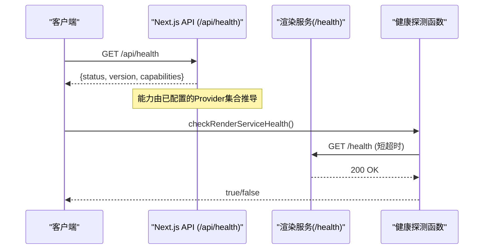
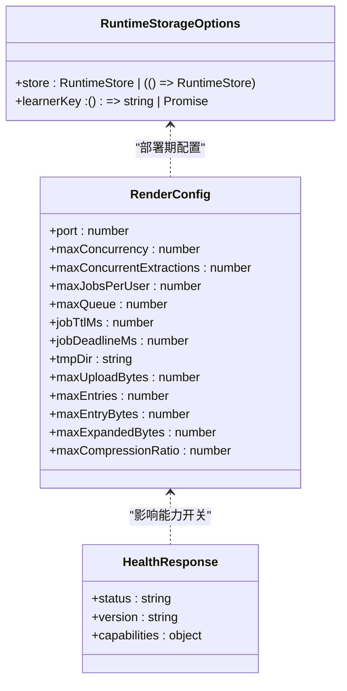

# 服务发现与配置管理

<cite>
**本文引用的文件**
- [lib/runtime/config.ts](file://lib/runtime/config.ts)
- [render-service/src/config.ts](file://render-service/src/config.ts)
- [lib/server/render-service.ts](file://lib/server/render-service.ts)
- [app/api/health/route.ts](file://app/api/health/route.ts)
- [components/settings/index.tsx](file://components/settings/index.tsx)
- [lib/media/comfyui-workflows.ts](file://lib/media/comfyui-workflows.ts)
- [tests/setup-env.ts](file://tests/setup-env.ts)
- [packages/@openmaic/storage/README.md](file://packages/@openmaic/storage/README.md)
- [lib/pdf/README.md](file://lib/pdf/README.md)
</cite>

## 产品概述
OpenMAIC 是一个 AI 驱动的交互式课件（MAIC）生成与课堂管理平台。围绕“动态服务发现、配置热更新与健康检查”的核心目标，本仓库通过 Next.js API 路由暴露能力探测端点，结合渲染服务的独立进程与环境变量配置，实现可观测、可扩展、可回滚的服务治理体系。运行时存储与学习者身份在客户端启动时一次性注入，渲染服务通过环境变量控制并发、队列与资源上限，并通过 /health 接口对外提供健康状态。

## 核心业务流程
- 服务发现：应用通过统一的运行时配置解析渲染服务地址，并在能力探测接口中聚合各子系统的可用能力。
- 配置热更新：渲染服务从环境变量读取配置项，支持在不重启 UI 的前提下调整并发、队列与资源限制；前端设置面板可动态修改 Provider 配置并即时生效。
- 健康检查：Next.js 的 /api/health 返回版本与各能力开关；渲染服务自身提供 /health 供上游探测；服务端对渲染服务进行可达性探测以决定功能降级策略。

图表来源
- [app/api/health/route.ts:1-23](file://app/api/health/route.ts#L1-L23)
- [lib/server/render-service.ts:31-60](file://lib/server/render-service.ts#L31-L60)
- [render-service/src/config.ts:1-64](file://render-service/src/config.ts#L1-L64)

章节来源
- [app/api/health/route.ts:1-23](file://app/api/health/route.ts#L1-L23)
- [lib/server/render-service.ts:31-60](file://lib/server/render-service.ts#L31-L60)
- [render-service/src/config.ts:1-64](file://render-service/src/config.ts#L1-L64)

## 功能模块清单
- 运行时存储与学习者身份注入
  - 职责：在客户端引导阶段一次性配置持久化后端与学习者分区键，确保会话内不可分割。
  - 验收要点：仅允许一次配置；启动后再次调用抛错；支持工厂延迟实例化；测试环境可重置。
  - 参考路径：[lib/runtime/config.ts:1-93](file://lib/runtime/config.ts#L1-L93)

- 渲染服务配置与环境变量
  - 职责：集中定义端口、并发、队列、作业 TTL、临时目录、上传与解压安全上限等。
  - 验收要点：所有数值型参数具备默认值与严格校验；0 表示禁用保护的场景有明确语义。
  - 参考路径：[render-service/src/config.ts:1-64](file://render-service/src/config.ts#L1-L64)

- 渲染服务发现与健康探测
  - 职责：解析渲染服务 URL；发起 /health 探测；失败时优雅降级。
  - 验收要点：未配置时返回错误标识；探测失败不抛异常，返回 false；使用短超时避免阻塞。
  - 参考路径：[lib/server/render-service.ts:31-60](file://lib/server/render-service.ts#L31-L60)

- 能力探测与版本信息
  - 职责：聚合 Web 搜索、图像、视频、TTS 等能力开关与版本号。
  - 验收要点：基于已配置 Provider 数量或启用状态推导；version 取自包元数据。
  - 参考路径：[app/api/health/route.ts:1-23](file://app/api/health/route.ts#L1-L23)

- 前端 Provider 配置管理
  - 职责：选择 Provider、编辑 apiKey/baseUrl、保存并反馈状态。
  - 验收要点：区分内置与非内置 Provider；支持模型发现与备用 BaseUrl；保存后短暂提示成功。
  - 参考路径：[components/settings/index.tsx:344-383](file://components/settings/index.tsx#L344-L383)

- ComfyUI 工作流发现
  - 职责：统一声明可用的工作流 JSON 文件命名规则，保证 UI 列表与适配器校验一致。
  - 验收要点：文件名需以 comfyui 开头或包含 workflow；仅服务器端访问文件系统。
  - 参考路径：[lib/media/comfyui-workflows.ts:1-28](file://lib/media/comfyui-workflows.ts#L1-L28)

- 环境变量加载（测试）
  - 职责：在测试前加载 .env.local 到 process.env，便于 API Key 可用。
  - 验收要点：忽略空行与注释；按 = 拆分键值；不覆盖已有环境变量。
  - 参考路径：[tests/setup-env.ts:1-23](file://tests/setup-env.ts#L1-L23)

- 存储与运行时数据边界
  - 职责：定义 account/device 作用域、内容寻址资产、DSL 文档规范化、运行时记录追加与合并策略。
  - 验收要点：作用域是原语的一部分；运行时记录有序且带版本；跨阶段操作受控。
  - 参考路径：[packages/@openmaic/storage/README.md:33-72](file://packages/@openmaic/storage/README.md#L33-L72)

- PDF 解析集成说明
  - 职责：提供 unpdf 与 MinerU 两种解析方式的使用说明与部署指引。
  - 验收要点：MinerU 可通过 Docker 部署并提供 /health；unpdf 无需外部依赖。
  - 参考路径：[lib/pdf/README.md:1-74](file://lib/pdf/README.md#L1-L74)

章节来源
- [lib/runtime/config.ts:1-93](file://lib/runtime/config.ts#L1-L93)
- [render-service/src/config.ts:1-64](file://render-service/src/config.ts#L1-L64)
- [lib/server/render-service.ts:31-60](file://lib/server/render-service.ts#L31-L60)
- [app/api/health/route.ts:1-23](file://app/api/health/route.ts#L1-L23)
- [components/settings/index.tsx:344-383](file://components/settings/index.tsx#L344-L383)
- [lib/media/comfyui-workflows.ts:1-28](file://lib/media/comfyui-workflows.ts#L1-L28)
- [tests/setup-env.ts:1-23](file://tests/setup-env.ts#L1-L23)
- [packages/@openmaic/storage/README.md:33-72](file://packages/@openmaic/storage/README.md#L33-L72)
- [lib/pdf/README.md:1-74](file://lib/pdf/README.md#L1-L74)

## 数据与状态
- 运行时存储配置
  - 数据结构：store（实例或工厂）、learnerKey（同步或异步）。
  - 生命周期：模块级引导阶段一次性配置；启动后冻结；测试可重置。
  - 参考路径：[lib/runtime/config.ts:1-93](file://lib/runtime/config.ts#L1-L93)

- 渲染服务配置
  - 关键字段：port、maxConcurrency、maxConcurrentExtractions、maxJobsPerUser、maxQueue、jobTtlMs、jobDeadlineMs、tmpDir、上传与解压安全上限。
  - 行为：全部来自环境变量，带默认值与严格校验；0 表示禁用保护。
  - 参考路径：[render-service/src/config.ts:1-64](file://render-service/src/config.ts#L1-L64)

- 能力与版本状态
  - 输出字段：status、version、capabilities（webSearch、imageGeneration、videoGeneration、tts）。
  - 参考路径：[app/api/health/route.ts:1-23](file://app/api/health/route.ts#L1-L23)

- 运行时记录与作用域
  - 作用域：account（跨设备同步）、device（本地不离开）。
  - 运行时：按 stageId 与 learnerKey 分区；append-only 记录；版本化快照与折叠恢复。
  - 参考路径：[packages/@openmaic/storage/README.md:33-72](file://packages/@openmaic/storage/README.md#L33-L72)

图表来源
- [lib/runtime/config.ts:1-93](file://lib/runtime/config.ts#L1-L93)
- [render-service/src/config.ts:1-64](file://render-service/src/config.ts#L1-L64)
- [app/api/health/route.ts:1-23](file://app/api/health/route.ts#L1-L23)

章节来源
- [lib/runtime/config.ts:1-93](file://lib/runtime/config.ts#L1-L93)
- [render-service/src/config.ts:1-64](file://render-service/src/config.ts#L1-L64)
- [app/api/health/route.ts:1-23](file://app/api/health/route.ts#L1-L23)
- [packages/@openmaic/storage/README.md:33-72](file://packages/@openmaic/storage/README.md#L33-L72)

## 关键约束与边界
- 非功能性需求
  - 健康探测必须短超时且不抛异常，确保 UI 能降级显示。
  - 渲染服务需限制并发、队列与资源上限，防止 DoS 与内存爆炸。
  - 运行时存储必须在引导阶段完成配置，禁止运行期切换后端或分区键。

- 依赖与集成边界
  - 渲染服务地址由上层解析，探测失败即关闭相关能力。
  - ComfyUI 工作流文件命名规则为唯一事实源，前后端共享。
  - PDF 解析可选择内置 unpdf 或外部 MinerU，后者需独立部署与可达。

- 业务约束
  - Provider 配置区分内置与非内置，非内置支持删除与多 BaseUrl。
  - 能力探测结果驱动 UI 功能可见性与可用性。
  - 运行时记录追加顺序与版本化快照保障一致性。

章节来源
- [lib/server/render-service.ts:31-60](file://lib/server/render-service.ts#L31-L60)
- [render-service/src/config.ts:1-64](file://render-service/src/config.ts#L1-L64)
- [lib/media/comfyui-workflows.ts:1-28](file://lib/media/comfyui-workflows.ts#L1-L28)
- [lib/pdf/README.md:1-74](file://lib/pdf/README.md#L1-L74)
- [components/settings/index.tsx:344-383](file://components/settings/index.tsx#L344-L383)
- [app/api/health/route.ts:1-23](file://app/api/health/route.ts#L1-L23)
- [lib/runtime/config.ts:1-93](file://lib/runtime/config.ts#L1-L93)