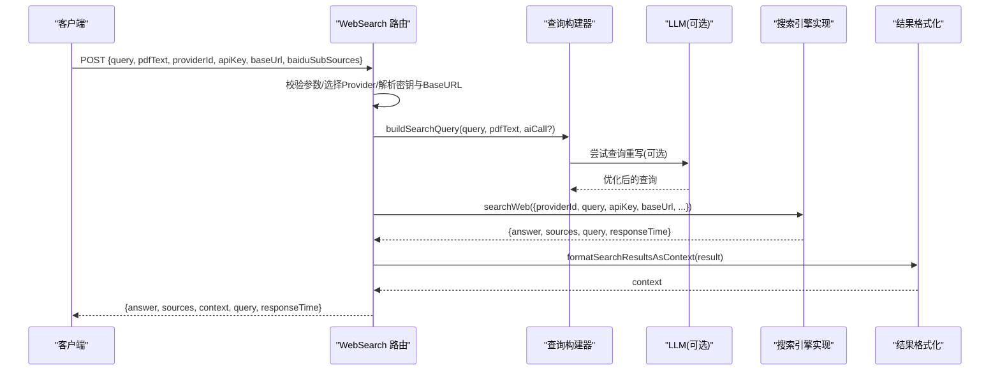
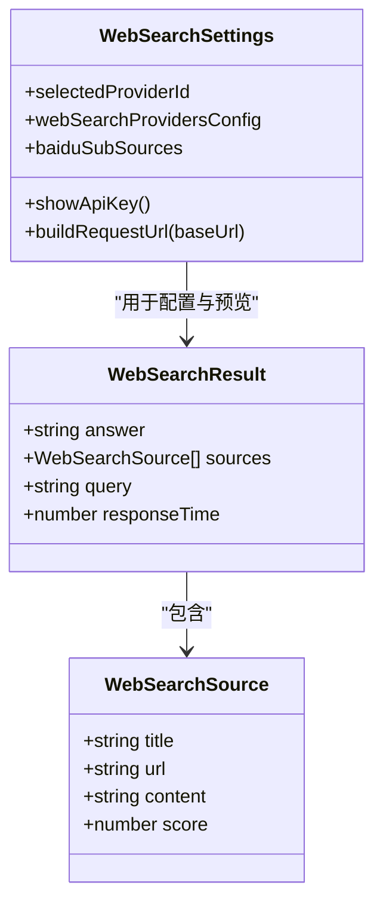
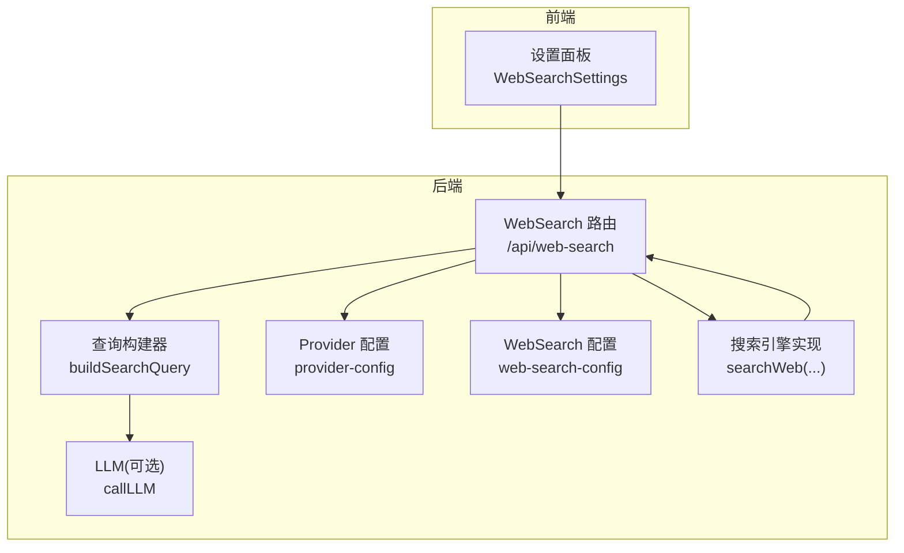
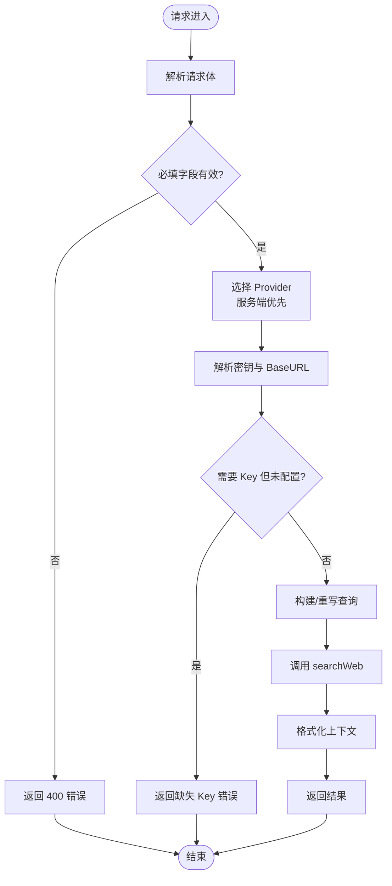
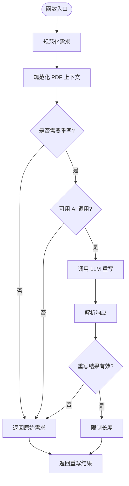
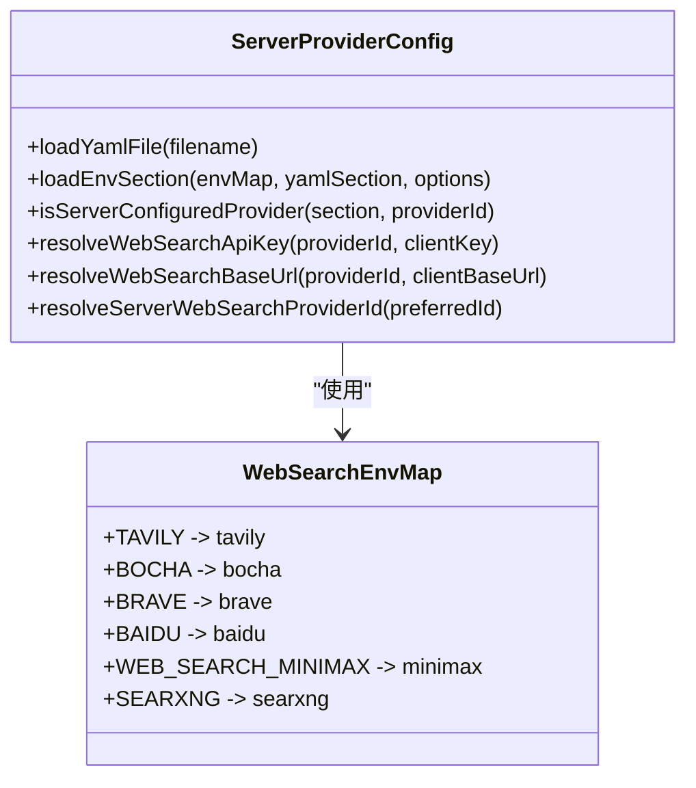
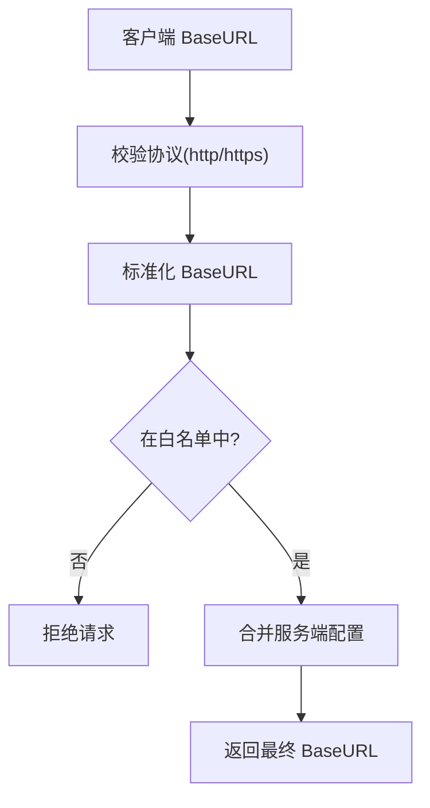
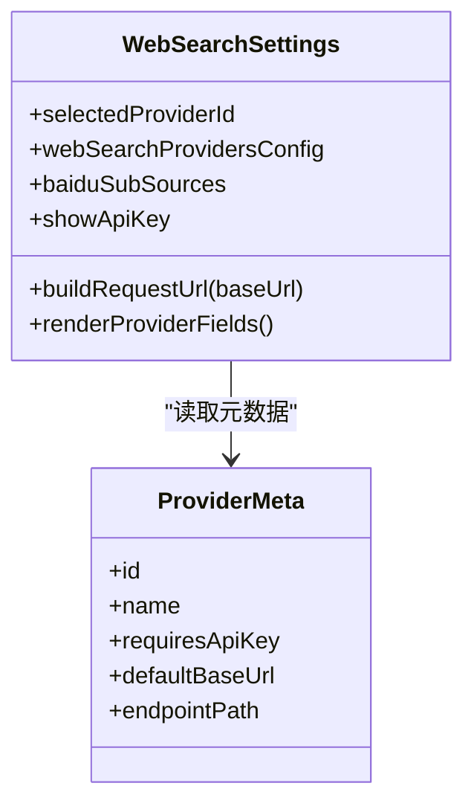
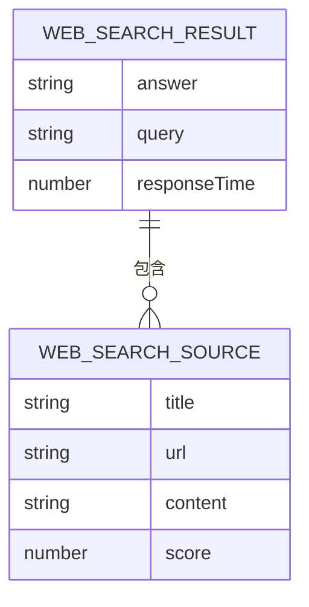
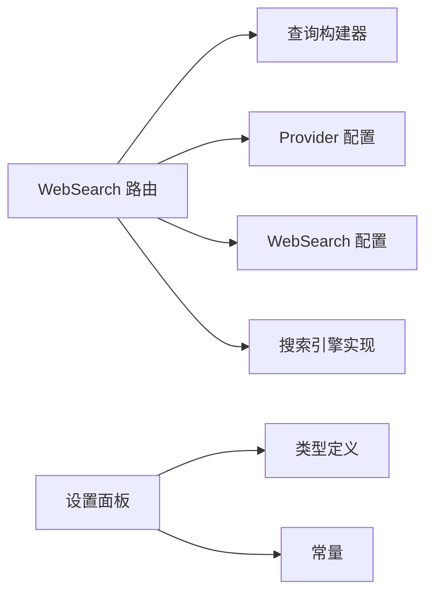

# 网络搜索集成

<cite>
**本文引用的文件**   
- [app/api/web-search/route.ts](file://app/api/web-search/route.ts)
- [lib/server/search-query-builder.ts](file://lib/server/search-query-builder.ts)
- [lib/server/provider-config.ts](file://lib/server/provider-config.ts)
- [lib/server/web-search-config.ts](file://lib/server/web-search-config.ts)
- [components/settings/web-search-settings.tsx](file://components/settings/web-search-settings.tsx)
- [lib/types/web-search.ts](file://lib/types/web-search.ts)
- [tests/web-search/route.test.ts](file://tests/web-search/route.test.ts)
- [tests/server/web-search-config.test.ts](file://tests/server/web-search-config.test.ts)
</cite>

## 产品概述
OpenMAIC 的网络搜索集成模块为课程与课件生成提供“在线信息增强”能力。通过统一的 Web Search API，系统可接入多种搜索引擎（如 Tavily、Bocha、Brave、Baidu、MiniMax、Doubao、SearXNG），在生成过程中自动获取最新资料、热点话题与权威来源，并输出结构化摘要与引用标注，提升内容时效性与可信度。该模块同时支持服务端集中配置与客户端可选覆盖，确保安全性与灵活性兼顾。

## 核心业务流程
- 入口：POST /api/web-search
- 输入：查询文本、可选 PDF 上下文、指定或默认搜索引擎、可选密钥与基础地址、百度子源开关等
- 处理：
  - 解析并校验请求参数与 Provider 配置
  - 使用 LLM 对查询进行重写优化（可选）
  - 调用具体搜索引擎实现，获取结果与响应时间
  - 将结果格式化为上下文，返回答案、来源与元数据
- 输出：answer、sources、context、query、responseTime

**图表来源** 
- [app/api/web-search/route.ts](file://app/api/web-search/route.ts)
- [lib/server/search-query-builder.ts](file://lib/server/search-query-builder.ts)
- [lib/server/web-search-config.ts](file://lib/server/web-search-config.ts)
- [lib/server/provider-config.ts](file://lib/server/provider-config.ts)

**章节来源**
- [app/api/web-search/route.ts](file://app/api/web-search/route.ts)
- [lib/server/search-query-builder.ts](file://lib/server/search-query-builder.ts)
- [lib/server/web-search-config.ts](file://lib/server/web-search-config.ts)
- [lib/server/provider-config.ts](file://lib/server/provider-config.ts)

## 功能模块清单
- Web Search API 路由
  - 职责：统一入口、参数校验、Provider 选择、密钥与 BaseURL 解析、调用搜索、结果格式化与错误处理
  - 验收要点：必填字段校验、Provider 优先级（服务端优先）、受管 Provider 忽略客户端密钥/BaseURL、SearXNG 仅允许服务端 BaseURL、异常统一返回
- 查询构建与重写
  - 职责：规范化输入、PDF 上下文截断、条件触发 LLM 重写、长度限制与回退策略
  - 验收要点：长需求或含 PDF 时触发重写；失败回退到原始需求；输出长度软上限
- Provider 配置与鉴权
  - 职责：YAML + 环境变量加载、服务端托管判定、密钥与 BaseURL 解析、白名单校验
  - 验收要点：服务端配置优先；未托管 Provider 允许客户端覆盖但需白名单校验；SearXNG 强制服务端 BaseURL
- 前端设置面板
  - 职责：按 Provider 展示配置项、隐藏受管字段、预览请求 URL、百度子源开关
  - 验收要点：受管/操作者托管提示、可选 Key 提示、动态显示完整请求 URL
- 类型与常量
  - 职责：定义搜索结果结构、Provider ID 类型、百度子源枚举等
  - 验收要点：类型安全、扩展性良好

**章节来源**
- [components/settings/web-search-settings.tsx](file://components/settings/web-search-settings.tsx)
- [lib/types/web-search.ts](file://lib/types/web-search.ts)

## 数据与状态
- 核心数据结构
  - WebSearchSource：标题、链接、内容片段、相关性分数
  - WebSearchResult：答案、来源列表、查询原文、响应耗时
- 关键状态流转
  - 请求进入 → Provider 选择 → 查询构建 → 搜索执行 → 结果格式化 → 响应返回
- 数据所有权边界
  - 服务端托管 Provider：密钥与 BaseURL 由服务端决定，客户端不可覆盖
  - 非托管 Provider：客户端可配置，但 BaseURL 必须通过白名单校验
  - SearXNG：BaseURL 仅允许服务端配置，客户端传入无效

**图表来源** 
- [lib/types/web-search.ts](file://lib/types/web-search.ts)
- [components/settings/web-search-settings.tsx](file://components/settings/web-search-settings.tsx)

**章节来源**
- [lib/types/web-search.ts](file://lib/types/web-search.ts)
- [components/settings/web-search-settings.tsx](file://components/settings/web-search-settings.tsx)

## 关键约束与边界
- 支持的搜索引擎与配置
  - Tavily：需要 API Key，BaseURL 白名单校验
  - Bocha：需要 API Key，BaseURL 白名单校验
  - Brave：无需 API Key，BaseURL 白名单校验
  - Baidu：需要 API Key，支持子源开关（网页、百科、学术等）
  - MiniMax：需要专用环境变量前缀的 API Key 与 BaseURL
  - Doubao：需要 API Key，支持自定义路径拼接
  - SearXNG：仅需 BaseURL，且必须由服务端配置
- 查询参数调优建议
  - 当需求较长或附带 PDF 上下文时启用 LLM 重写，提高检索精准度
  - 控制重写输入长度，避免过大请求影响性能
  - 根据 Provider 特性调整 maxResults、NeedSummary 等参数（不同实现可能不同）
- 性能优化建议
  - 合理设置并发度，避免触发 Provider 限流
  - 对重复查询做本地缓存（建议基于查询指纹与 Provider 版本）
  - 超时与重试策略：短超时+指数退避，避免雪崩
- 离线访问与缓存策略
  - 当前路由层未内置缓存，建议在网关或上层服务增加缓存层
  - 可结合 IndexedDB 或内存缓存存储最近 N 次查询结果
- 安全与合规
  - 严格校验 BaseURL 白名单，防止 SSRF
  - 敏感密钥不暴露给客户端（受管 Provider）
  - 对搜索结果进行内容安全过滤（建议在上层实现）

**章节来源**
- [lib/server/provider-config.ts](file://lib/server/provider-config.ts)
- [lib/server/web-search-config.ts](file://lib/server/web-search-config.ts)
- [tests/web-search/route.test.ts](file://tests/web-search/route.test.ts)
- [tests/server/web-search-config.test.ts](file://tests/server/web-search-config.test.ts)

## 架构总览

**图表来源** 
- [app/api/web-search/route.ts](file://app/api/web-search/route.ts)
- [lib/server/search-query-builder.ts](file://lib/server/search-query-builder.ts)
- [lib/server/provider-config.ts](file://lib/server/provider-config.ts)
- [lib/server/web-search-config.ts](file://lib/server/web-search-config.ts)

**章节来源**
- [app/api/web-search/route.ts](file://app/api/web-search/route.ts)
- [lib/server/search-query-builder.ts](file://lib/server/search-query-builder.ts)
- [lib/server/provider-config.ts](file://lib/server/provider-config.ts)
- [lib/server/web-search-config.ts](file://lib/server/web-search-config.ts)

## 详细组件分析

### Web Search 路由（/api/web-search）
- 功能要点
  - 解析请求体，校验必填字段
  - 选择 Provider：优先服务端托管配置，否则回退到客户端选择或默认
  - 解析密钥与 BaseURL：受管 Provider 忽略客户端输入；SearXNG 仅接受服务端 BaseURL
  - 调用查询构建器，必要时使用 LLM 重写查询
  - 调用 searchWeb 执行搜索，格式化结果为上下文
  - 统一错误处理与日志记录
- 错误处理
  - 缺少必填字段、缺失 API Key、非法 BaseURL、模型不可用等均有明确错误码与消息
- 性能与安全
  - 限制重写输入长度，避免大请求
  - BaseURL 白名单校验，防止 SSRF

**图表来源** 
- [app/api/web-search/route.ts](file://app/api/web-search/route.ts)

**章节来源**
- [app/api/web-search/route.ts](file://app/api/web-search/route.ts)

### 查询构建与重写（buildSearchQuery）
- 功能要点
  - 规范化输入（去除多余空白、截断 PDF 上下文）
  - 条件判断是否触发 LLM 重写（需求过长或存在 PDF 上下文）
  - 调用 LLM 生成优化查询，失败则回退到原始需求
  - 控制输出长度，避免超出 Provider 限制
- 复杂度与优化
  - 时间复杂度 O(n)，n 为输入长度；空间复杂度 O(n)
  - 可通过缓存重写结果进一步优化重复查询场景

**图表来源** 
- [lib/server/search-query-builder.ts](file://lib/server/search-query-builder.ts)

**章节来源**
- [lib/server/search-query-builder.ts](file://lib/server/search-query-builder.ts)

### Provider 配置与鉴权（provider-config）
- 功能要点
  - 从 YAML 与环境变量加载各 Provider 配置
  - 区分托管与非托管 Provider，托管配置优先
  - 提供统一的密钥与 BaseURL 解析接口
  - 针对 Web Search 提供专用环境变量映射与默认回退
- 关键点
  - WEB_SEARCH_ENV_MAP 映射各 Provider 的环境变量前缀
  - resolveServerWebSearchProviderId 提供默认 Provider 选择逻辑
  - isServerConfiguredProvider 判定托管状态

**图表来源** 
- [lib/server/provider-config.ts](file://lib/server/provider-config.ts)

**章节来源**
- [lib/server/provider-config.ts](file://lib/server/provider-config.ts)

### WebSearch 配置与 BaseURL 白名单（web-search-config）
- 功能要点
  - 维护各 Provider 的官方 BaseURL 白名单
  - 校验客户端传入的 BaseURL，拒绝不在白名单中的地址
  - 为课堂场景提供统一的配置解析接口
  - SearXNG 强制服务端 BaseURL，客户端传入无效
- 安全策略
  - 严格的协议与域名校验，防止 SSRF
  - 托管 Provider 忽略客户端 BaseURL

**图表来源** 
- [lib/server/web-search-config.ts](file://lib/server/web-search-config.ts)

**章节来源**
- [lib/server/web-search-config.ts](file://lib/server/web-search-config.ts)

### 前端设置面板（WebSearchSettings）
- 功能要点
  - 根据 Provider 类型显示相应配置项
  - 托管 Provider 隐藏密钥与 BaseURL 输入框
  - 实时预览完整请求 URL
  - 百度子源开关（网页、百科、学术等）
- 用户体验
  - 清晰提示托管状态与可选 Key
  - 一键切换密钥可见性

**图表来源** 
- [components/settings/web-search-settings.tsx](file://components/settings/web-search-settings.tsx)

**章节来源**
- [components/settings/web-search-settings.tsx](file://components/settings/web-search-settings.tsx)

### 数据类型（types/web-search）
- 结构说明
  - WebSearchSource：来源条目，包含标题、链接、内容片段与相关性分数
  - WebSearchResult：搜索结果，包含答案、来源列表、查询原文与响应耗时
- 用途
  - 统一前后端数据结构，便于渲染与引用标注

**图表来源** 
- [lib/types/web-search.ts](file://lib/types/web-search.ts)

**章节来源**
- [lib/types/web-search.ts](file://lib/types/web-search.ts)

## 依赖分析
- 组件耦合关系
  - 路由层依赖配置层与查询构建器，解耦具体搜索引擎实现
  - 前端设置面板依赖常量与类型定义，保持 UI 与数据一致
- 外部依赖
  - LLM 调用（可选）：用于查询重写
  - 各搜索引擎 API：通过统一接口调用
- 潜在循环依赖
  - 当前设计无循环依赖，模块职责清晰

**图表来源** 
- [app/api/web-search/route.ts](file://app/api/web-search/route.ts)
- [lib/server/search-query-builder.ts](file://lib/server/search-query-builder.ts)
- [lib/server/provider-config.ts](file://lib/server/provider-config.ts)
- [lib/server/web-search-config.ts](file://lib/server/web-search-config.ts)
- [components/settings/web-search-settings.tsx](file://components/settings/web-search-settings.tsx)
- [lib/types/web-search.ts](file://lib/types/web-search.ts)

**章节来源**
- [app/api/web-search/route.ts](file://app/api/web-search/route.ts)
- [lib/server/search-query-builder.ts](file://lib/server/search-query-builder.ts)
- [lib/server/provider-config.ts](file://lib/server/provider-config.ts)
- [lib/server/web-search-config.ts](file://lib/server/web-search-config.ts)
- [components/settings/web-search-settings.tsx](file://components/settings/web-search-settings.tsx)
- [lib/types/web-search.ts](file://lib/types/web-search.ts)

## 性能考虑
- 查询重写开销：仅在必要时触发，避免频繁 LLM 调用
- 并发控制：根据 Provider 配额调整并发度，避免 429 错误
- 缓存策略：建议在上层实现查询结果缓存，减少重复请求
- 超时与重试：短超时+指数退避，提升鲁棒性

[本节为通用指导，不直接分析具体文件]

## 故障排查指南
- 常见问题
  - 缺少 API Key：检查环境变量或前端设置
  - BaseURL 不被接受：确认是否在白名单中，SearXNG 必须服务端配置
  - 查询重写失败：检查 LLM 可用性，系统将回退到原始需求
  - 搜索结果为空：调整查询关键词或增加 PDF 上下文
- 调试建议
  - 查看路由日志，定位错误阶段
  - 使用测试用例验证配置与行为

**章节来源**
- [tests/web-search/route.test.ts](file://tests/web-search/route.test.ts)
- [tests/server/web-search-config.test.ts](file://tests/server/web-search-config.test.ts)

## 结论
OpenMAIC 的网络搜索集成模块提供了灵活、安全、可扩展的搜索引擎接入方案。通过统一的路由与配置管理，支持多种主流搜索引擎，并在查询构建、结果格式化与前端设置方面实现了良好的用户体验。建议在生产环境中结合缓存、并发控制与内容安全过滤，进一步提升性能与可靠性。

[本节为总结，不直接分析具体文件]