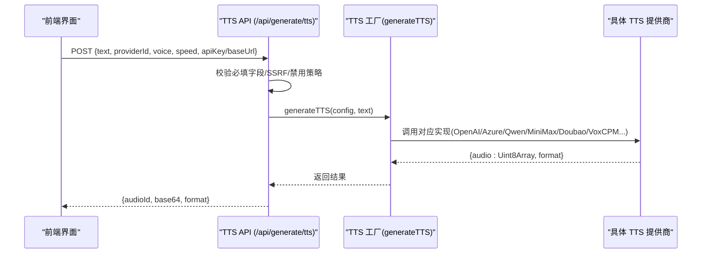
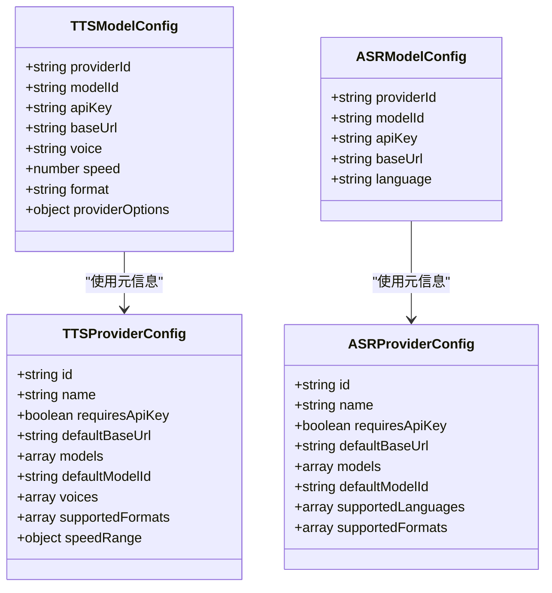

# 语音合成与识别服务

<cite>
**本文引用的文件**   
- [app/api/generate/tts/route.ts](file://app/api/generate/tts/route.ts)
- [app/api/transcription/route.ts](file://app/api/transcription/route.ts)
- [lib/audio/tts-providers.ts](file://lib/audio/tts-providers.ts)
- [lib/audio/asr-providers.ts](file://lib/audio/asr-providers.ts)
- [lib/audio/constants.ts](file://lib/audio/constants.ts)
- [lib/audio/types.ts](file://lib/audio/types.ts)
- [components/settings/tts-settings.tsx](file://components/settings/tts-settings.tsx)
- [components/settings/asr-settings.tsx](file://components/settings/asr-settings.tsx)
- [lib/audio/voxcpm-voices.ts](file://lib/audio/voxcpm-voices.ts)
- [configs/mime.ts](file://configs/mime.ts)
- [README-zh.md](file://README-zh.md)
</cite>

## 目录
- 产品概述
- 核心业务流程
- 功能模块清单
- 数据与状态
- 关键约束与边界

## 产品概述
OpenMAIC 的语音能力覆盖文本转语音（TTS）与自动语音识别（ASR），通过统一的提供商工厂模式接入多家服务商，包括 VoxCPM2、Doubao、Lemonade、MiniMax、OpenAI、Azure、GLM、Qwen、ElevenLabs 等。系统提供：
- 多服务商 TTS 配置与切换（音色、语速、格式、模型）
- 多服务商 ASR 配置与测试（语言、模型、上传音频）
- 语音克隆与音色管理（VoxCPM2 支持 Prompt/Clone/Auto Voice）
- 音频格式与采样率相关处理（浏览器端转换与上传规范化）
- 服务端 API 路由统一鉴权、限流与错误处理
- 在智能体对话中集成语音输入与播放控制

## 核心业务流程
- TTS 生成流程：前端设置或运行时选择提供商 → 调用 /api/generate/tts → 服务端校验与鉴权 → 调用对应 TTS 提供商实现 → 返回 base64 音频与格式
- ASR 转录流程：前端录制或上传音频 → 调用 /api/transcription → 服务端按提供商适配 → 返回识别文本
- 语音克隆与音色管理：VoxCPM2 支持本地保存参考音频与提示词，合成时按需携带

**图表来源** 
- [app/api/generate/tts/route.ts](file://app/api/generate/tts/route.ts)
- [lib/audio/tts-providers.ts](file://lib/audio/tts-providers.ts)

**章节来源**
- [app/api/generate/tts/route.ts](file://app/api/generate/tts/route.ts)
- [lib/audio/tts-providers.ts](file://lib/audio/tts-providers.ts)

## 功能模块清单
- TTS 提供商与配置
  - 支持的提供商：OpenAI、Azure、GLM、Qwen、MiniMax、Doubao、ElevenLabs、Lemonade、VoxCPM2、浏览器原生
  - 配置项：apiKey、baseUrl、modelId、voice、speed、format、providerOptions
  - 速率限制与错误分类（429 限流）
- ASR 提供商与配置
  - 支持的提供商：OpenAI Whisper、Qwen、Azure、Lemonade、浏览器原生
  - 配置项：apiKey、baseUrl、modelId、language
  - 上传音频规范化与格式映射
- 音色与语音克隆（VoxCPM2）
  - Auto Voice/Prompt/Clone 三种模式
  - 参考音频大小限制与本地存储
- 音频格式与采样率
  - 各提供商 supportedFormats
  - 浏览器端 WAV 转换与上传规范化
- 设置界面
  - TTS 设置：提供商启用/禁用、密钥与 Base URL、请求 URL 预览、测试合成
  - ASR 设置：提供商启用/禁用、密钥与 Base URL、默认模型、录音测试

**章节来源**
- [lib/audio/constants.ts](file://lib/audio/constants.ts)
- [lib/audio/types.ts](file://lib/audio/types.ts)
- [components/settings/tts-settings.tsx](file://components/settings/tts-settings.tsx)
- [components/settings/asr-settings.tsx](file://components/settings/asr-settings.tsx)
- [lib/audio/voxcpm-voices.ts](file://lib/audio/voxcpm-voices.ts)
- [configs/mime.ts](file://configs/mime.ts)

## 数据与状态
- 类型定义
  - TTSProviderId/TTSModelConfig：提供商 ID、模型、密钥、基础地址、音色、语速、格式、扩展参数
  - ASRProviderId/ASRModelConfig：提供商 ID、模型、密钥、基础地址、语言
- 常量注册表
  - TTS_PROVIDERS/ASR_PROVIDERS：名称、图标、是否需密钥、默认地址、可用模型、音色列表、支持格式、语速范围、支持语言
- 提供商实现
  - generateTTS() 分发到各提供商实现；transcribeAudio() 分发到各 ASR 实现
- 设置持久化
  - 各提供商的 apiKey、baseUrl、modelId、enabled/serverDisabled/isServerConfigured 等由设置面板写入 store

**图表来源** 
- [lib/audio/types.ts](file://lib/audio/types.ts)
- [lib/audio/constants.ts](file://lib/audio/constants.ts)

**章节来源**
- [lib/audio/types.ts](file://lib/audio/types.ts)
- [lib/audio/constants.ts](file://lib/audio/constants.ts)

## 关键约束与边界
- 安全与鉴权
  - TTS/ASR 均支持服务端托管配置（isServerConfiguredProvider），客户端密钥/Base URL 会被忽略
  - 生产环境对自定义 baseUrl 进行 SSRF 校验
  - 429 限流被识别并返回明确错误码
- 提供商可用性
  - 服务器可强制禁用某提供商（serverDisabled），前端开关受锁
  - 浏览器原生 TTS/ASR 仅在前端使用，服务端会拒绝
- 音频格式与尺寸
  - VoxCPM2 参考音频上限（例如 10MB）与格式转换（WAV）
  - 各提供商 supportedFormats 决定输出编码
- 多语言与方言
  - Qwen TTS 提供多种中文方言与国际语言音色
  - ASR 支持 auto 与多语言代码
- 实时与流式
  - 当前 TTS API 返回完整 base64 音频；如需流式播放，可在前端分块播放已返回的音频片段
  - ASR 测试为录制后一次性上传，非流式

**章节来源**
- [app/api/generate/tts/route.ts](file://app/api/generate/tts/route.ts)
- [app/api/transcription/route.ts](file://app/api/transcription/route.ts)
- [lib/audio/tts-providers.ts](file://lib/audio/tts-providers.ts)
- [lib/audio/asr-providers.ts](file://lib/audio/asr-providers.ts)
- [lib/audio/voxcpm-voices.ts](file://lib/audio/voxcpm-voices.ts)
- [configs/mime.ts](file://configs/mime.ts)
- [README-zh.md](file://README-zh.md)