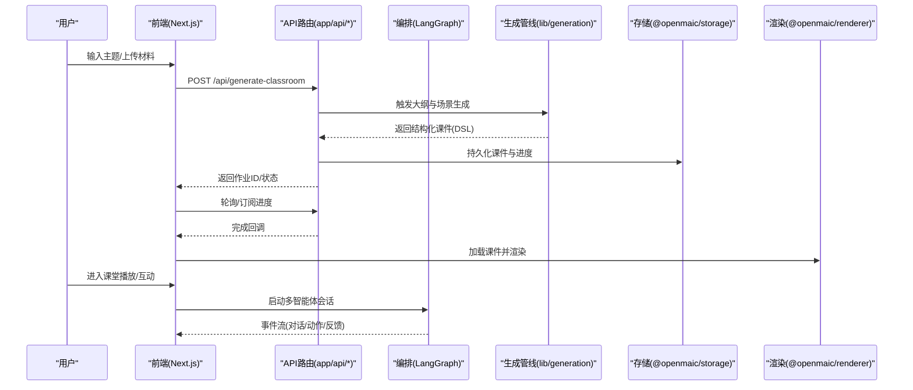
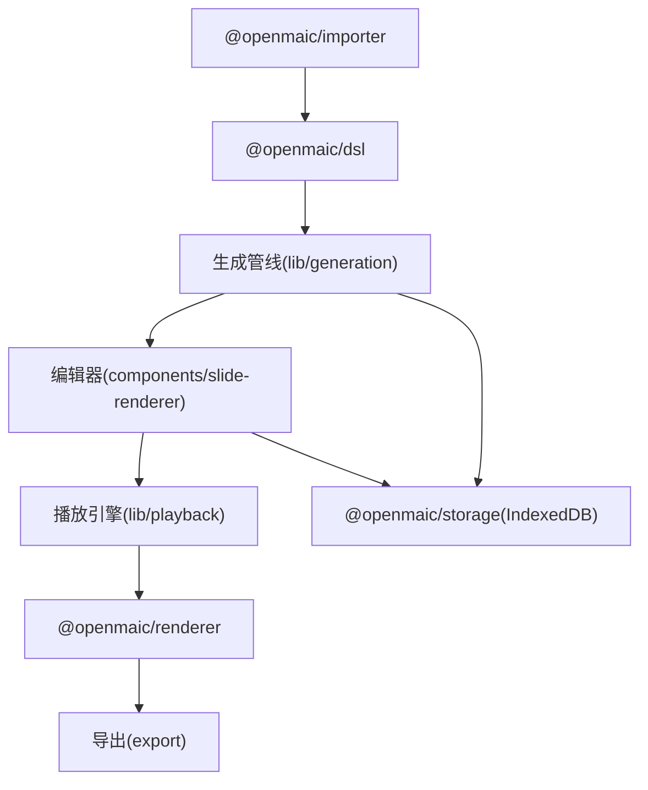

# 开发指南

<cite>
**本文引用的文件**   
- [package.json](file://package.json)
- [README.md](file://README.md)
- [next.config.ts](file://next.config.ts)
- [tsconfig.json](file://tsconfig.json)
- [eslint.config.mjs](file://eslint.config.mjs)
- [vitest.config.ts](file://vitest.config.ts)
- [playwright.config.ts](file://playwright.config.ts)
</cite>

## 目录
- 产品概述
- 核心业务流程
- 功能模块清单
- 数据与状态
- 关键约束与边界

## 产品概述
OpenMAIC 是一个开源的 AI 驱动交互式课件（MAIC）生成与课堂管理平台。其核心价值在于：通过多智能体编排，将任意主题或文档快速转化为包含幻灯片、测验、互动仿真与项目式学习（PBL）的沉浸式课堂体验；支持 TTS/ASR、白板绘图、实时讨论、一键导出 PPTX/HTML/ZIP，以及可选的视频导出服务。目标用户包括教师、培训师、自学者与企业内训团队，适用场景涵盖课程快速生成、在线教学、混合式学习与知识传播。

- 技术栈概览：Next.js 16 + React 19 + TypeScript；AI 编排使用 LangGraph + Vercel AI SDK；课件 DSL 由内部包定义；前端状态管理采用 Zustand。
- 部署形态：支持本地开发、Vercel 一键部署、Docker Compose（含可选视频渲染服务）。

章节来源
- [README.md:50-82](file://README.md#L50-L82)
- [README.md:84-221](file://README.md#L84-L221)
- [README.md:304-585](file://README.md#L304-L585)

## 核心业务流程
OpenMAIC 的核心业务围绕“生成—编排—播放—交互—导出”展开：

- 生成流程
  - 输入主题或材料 → 大纲生成 → 分场景内容生成（幻灯片、测验、互动 HTML、PBL）→ 资源准备（图像/TTS/音视频）→ 产出 MAIC 课件。
- 编排与播放
  - 基于 LangGraph 的多智能体编排驱动课堂对话与动作执行；播放引擎按时间线推进，支持实时问答、白板绘制、语音讲解等。
- 交互与编辑
  - 编辑器支持拖拽、缩放、旋转、多选与“AI 辅助编辑”，可回放并导航到具体动作节点。
- 导出与分享
  - 导出为 PPTX、交互式 HTML、课堂 ZIP；可选 MP4 视频导出（独立渲染服务）。

图表来源
- [package.json:9-27](file://package.json#L9-L27)
- [README.md:630-684](file://README.md#L630-L684)

章节来源
- [README.md:630-684](file://README.md#L630-L684)

## 功能模块清单
- 应用入口与路由
  - Next.js App Router 页面与 API 路由：首页生成入口、课堂播放页、服务端接口（生成、聊天、PBL、导出、健康检查等）。
- 核心业务逻辑（lib/）
  - generation：两阶段生成管线（大纲→场景内容）。
  - orchestration：LangGraph 多智能体编排（导演图、回合控制、讨论调度）。
  - playback：播放状态机（空闲→播放→直播），驱动课堂节奏。
  - action：动作执行引擎（语音、白板绘图/文本/形状/图表、聚光灯、激光笔等）。
  - ai：LLM 提供商抽象与统一调用。
  - api：舞台 API 门面（幻灯片/画布/场景操作）。
  - store：Zustand 全局状态。
  - types：集中式类型定义。
  - audio：TTS/ASR 提供商适配。
  - media：图像/视频生成提供商。
  - export：PPTX/HTML 导出。
  - hooks/i18n/utils：通用能力。
- UI 组件（components/）
  - slide-renderer：基于 Canvas 的幻灯片编辑器与渲染器（元素：文本、图片、图形、表格、图表、代码、视频等）。
  - scene-renderers：测验、互动 HTML、PBL 场景渲染。
  - generation/chat/settings/whiteboard/agent：生成工具栏、聊天区、设置面板、白板、智能体头像与配置等。
- 内部子包（packages/@openmaic/*）
  - dsl：课件 DSL 定义。
  - storage：IndexedDB 持久化。
  - importer：PPTX/MAIC 导入。
  - renderer：课件渲染引擎。
- 其他
  - render-service：MP4 视频导出的隔离服务（可选）。
  - skills/openmaic：OpenClaw 技能，从聊天应用直接生成课堂。

验收要点
- 生成链路端到端可用，支持多模型与多提供商。
- 课堂播放流畅，动作与对话同步。
- 编辑器对幻灯片元素增删改查稳定，支持撤销/重做。
- 导出产物在离线环境下可正常播放（按需内联资源）。
- 测试覆盖核心路径（单元测试 + E2E）。

章节来源
- [README.md:630-684](file://README.md#L630-L684)

## 数据与状态
- 数据模型
  - 课件 DSL：由 @openmaic/dsl 定义，贯穿生成、编辑、渲染与导出。
  - 存储层：@openmaic/storage 基于 IndexedDB 实现本地持久化，支持断点续传与离线访问。
  - 导入/导出：@openmaic/importer 负责 PPTX/MAIC 导入；export 模块输出 PPTX/HTML/ZIP。
- 状态管理
  - 前端使用 Zustand 维护全局状态（会话、播放进度、编辑态、设置等）。
  - 播放引擎驱动状态机，确保时序一致性与回放准确性。
- 数据所有权边界
  - 渲染与存储为独立包，禁止反向依赖宿主应用（通过 ESLint 规则强制）。
  - lib/choreography 与 lib/video-export 保持纯函数特性，可在 Node 环境解释执行。

图表来源
- [README.md:630-684](file://README.md#L630-L684)

章节来源
- [README.md:630-684](file://README.md#L630-L684)

## 关键约束与边界
- 环境与依赖
  - Node.js >= 20.9.0，pnpm >= 10；推荐使用 pnpm workspace 管理 monorepo。
  - 至少配置一个 LLM 提供商密钥（OPENAI_API_KEY 等），或通过 server-providers.yml 配置。
- 构建与部署
  - Next.js 支持子路径部署（NEXT_PUBLIC_BASE_PATH）、standalone 输出、CSP/安全头配置。
  - Docker Compose 提供可选视频导出服务（render-service）。
- 代码质量与规范
  - ESLint 集成 next-vitals 与 TypeScript 规则；针对 @openmaic/renderer、@openmaic/storage、lib/choreography、lib/video-export 实施严格的模块/包边界限制（禁止引用宿主路径、禁止引入渲染后端库）。
  - Prettier 格式化；TypeScript 严格模式。
- 测试
  - 单元测试：Vitest（tests/**/*.test.ts），支持别名解析与 setup 文件。
  - 端到端测试：Playwright（e2e/tests），自动拉起 dev/build+start 服务器，支持并行与重试。
- 性能与安全
  - 大请求体代理上限、HSTS、Referrer-Policy、Permissions-Policy 等安全头。
  - 导出时内联外部资源以支持离线播放。

章节来源
- [package.json:1-27](file://package.json#L1-L27)
- [next.config.ts:1-40](file://next.config.ts#L1-L40)
- [tsconfig.json:1-43](file://tsconfig.json#L1-L43)
- [eslint.config.mjs:1-367](file://eslint.config.mjs#L1-L367)
- [vitest.config.ts:1-15](file://vitest.config.ts#L1-L15)
- [playwright.config.ts:1-32](file://playwright.config.ts#L1-L32)
- [README.md:84-221](file://README.md#L84-L221)
- [README.md:244-263](file://README.md#L244-L263)