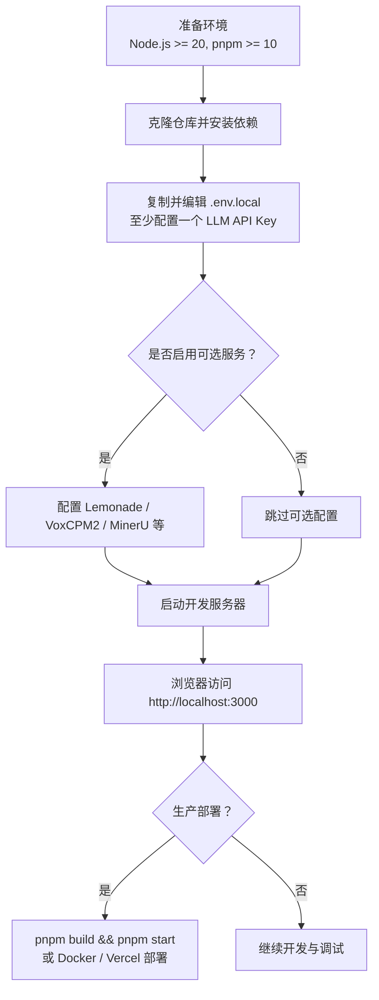
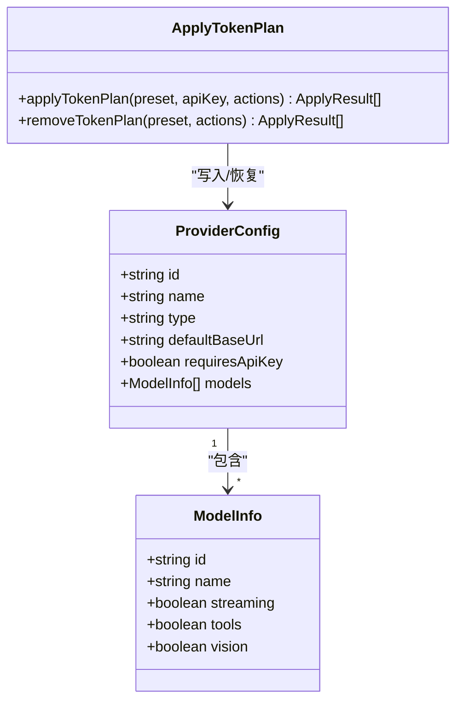
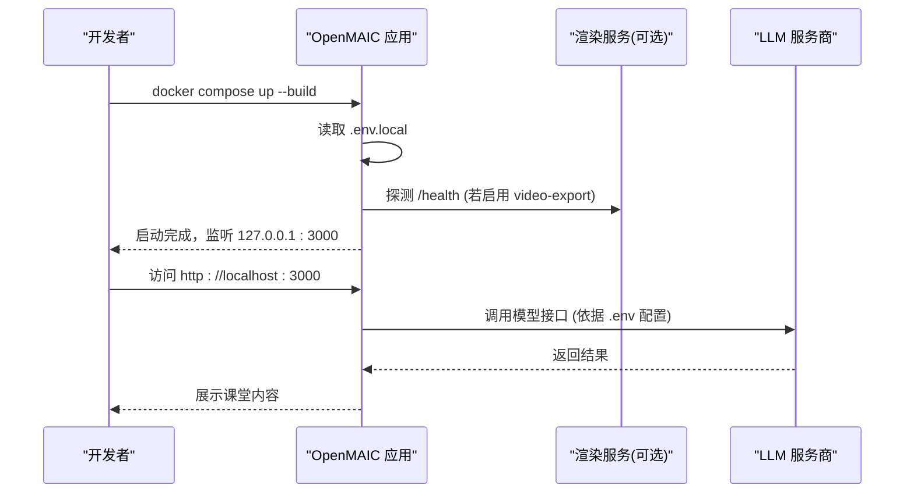

# 快速开始

<cite>
**本文引用的文件**   
- [README-zh.md](file://README-zh.md)
- [package.json](file://package.json)
- [docker-compose.yml](file://docker-compose.yml)
- [vercel.json](file://vercel.json)
- [providers.ts](file://lib/ai/providers.ts)
- [apply-token-plan.ts](file://lib/config/apply-token-plan.ts)
</cite>

## 产品概述
OpenMAIC 是一个开源的 AI 互动课堂平台，能将任意主题或文档转化为多智能体协作的沉浸式课堂体验。核心能力包括：一键生成结构化课件（幻灯片、测验、交互模拟、项目制学习）、多智能体实时讨论与白板讲解、语音合成与识别、以及多种导出格式（PPTX、HTML、ZIP）。前端基于 Next.js + React，AI 编排层使用 LangGraph + Vercel AI SDK，支持丰富的 LLM/TTS/图像/视频服务商接入。

## 核心业务流程
- 环境准备与安装：满足 Node.js 与 pnpm 版本要求后克隆仓库并安装依赖。
- 配置环境变量：至少配置一个 LLM 服务商 API Key；可选配置 TTS、ASR、图像、视频、PDF 解析等。
- 本地开发启动：运行开发服务器，访问本地端口即可使用。
- 生产构建与部署：构建静态产物并启动服务；或通过 Docker/Vercel 一键部署。
- 可选增强服务：Lemonade 本地 AI、VoxCPM2 自托管 TTS、MinerU 文档解析等按需启用。

**章节来源**
- [README-zh.md:84-250](file://README-zh.md#L84-L250)
- [package.json:6-17](file://package.json#L6-L17)

## 功能模块清单
- 环境与环境变量
  - 职责：定义运行时依赖、脚本命令、环境变量加载与校验。
  - 验收要点：Node.js/pnpm 版本满足；.env.local 生效；API Key 可用。
- 本地开发
  - 职责：提供热重载的开发服务器与 API 路由。
  - 验收要点：dev 脚本可启动；端口 3000 可访问。
- 生产构建与部署
  - 职责：构建产物、启动服务、容器化与云部署。
  - 验收要点：build/start 成功；Docker Compose 拉起；Vercel 部署通过。
- AI 服务商配置
  - 职责：统一接入 OpenAI/Anthropic/Gemini/MiniMax/GLM/Ollama/Lemonade 等。
  - 验收要点：模型列表探测正常；默认模型可切换。
- 可选增强服务
  - 职责：TTS（VoxCPM2）、文档解析（MinerU）、本地 AI（Lemonade）。
  - 验收要点：对应 Base URL 可达；鉴权参数正确；功能可用。

**章节来源**
- [README-zh.md:84-250](file://README-zh.md#L84-L250)
- [providers.ts:1263-1277](file://lib/ai/providers.ts#L1263-L1277)
- [apply-token-plan.ts:148-222](file://lib/config/apply-token-plan.ts#L148-L222)

## 数据与状态
- 环境变量与配置
  - 关键键名：OPENAI_API_KEY、ANTHROPIC_API_KEY、GOOGLE_API_KEY、DEFAULT_MODEL、LEMONADE_BASE_URL、TTS_VOXCPM_BASE_URL、PDF_MINERU_BASE_URL、ACCESS_CODE 等。
  - 作用域：.env.local 用于本地；Docker 通过 env_file 注入；Vercel 在平台环境变量中设置。
- 提供商配置
  - 内置提供商元数据：包含 id、name、type、defaultBaseUrl、requiresApiKey、models 等。
  - Token Plan 应用：按模态（LLM、image、video、tts、webSearch）批量写入配置，支持启用/禁用与模型选择。
- 运行时状态
  - 开发/生产模式由脚本与框架决定；Docker 通过 compose 管理网络与卷；Vercel 函数超时由 vercel.json 控制。

**图表来源**
- [providers.ts:1263-1277](file://lib/ai/providers.ts#L1263-L1277)
- [apply-token-plan.ts:148-222](file://lib/config/apply-token-plan.ts#L148-L222)

**章节来源**
- [README-zh.md:99-208](file://README-zh.md#L99-L208)
- [providers.ts:1263-1277](file://lib/ai/providers.ts#L1263-L1277)
- [apply-token-plan.ts:148-222](file://lib/config/apply-token-plan.ts#L148-L222)

## 关键约束与边界
- 环境要求
  - Node.js >= 20.9.0（package.json engines），pnpm >= 10（推荐 10.28+）。
- 部署约束
  - Docker：默认仅监听 127.0.0.1:3000；render-service 需 --profile video-export 启动；内存限制 4g；iptables egress 锁定需要 CAP_NET_ADMIN。
  - Vercel：函数最大时长 300s；安装与构建命令由 vercel.json 指定。
- 安全与访问
  - ACCESS_CODE 可开启站点级密码保护，影响所有 API 路由。
- 依赖与服务边界
  - LLM/TTS/图像/视频/搜索等服务均为外部依赖，需保证网络可达与鉴权正确。
  - 可选服务（Lemonade、VoxCPM2、MinerU）为独立服务，Base URL 必须可达且协议兼容。

**图表来源**
- [docker-compose.yml:1-80](file://docker-compose.yml#L1-L80)
- [vercel.json:1-12](file://vercel.json#L1-L12)
- [README-zh.md:244-250](file://README-zh.md#L244-L250)

**章节来源**
- [package.json:6-17](file://package.json#L6-L17)
- [docker-compose.yml:1-80](file://docker-compose.yml#L1-L80)
- [vercel.json:1-12](file://vercel.json#L1-L12)
- [README-zh.md:233-250](file://README-zh.md#L233-L250)