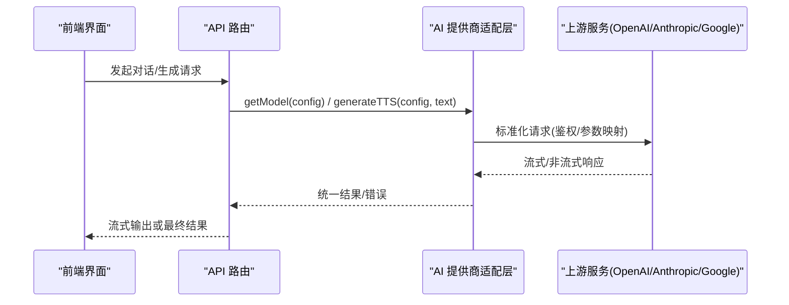
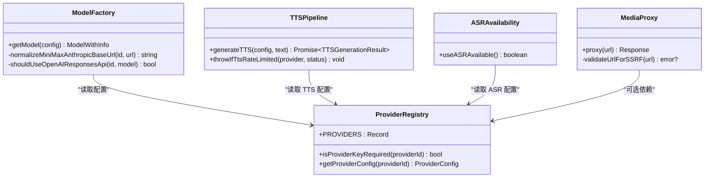
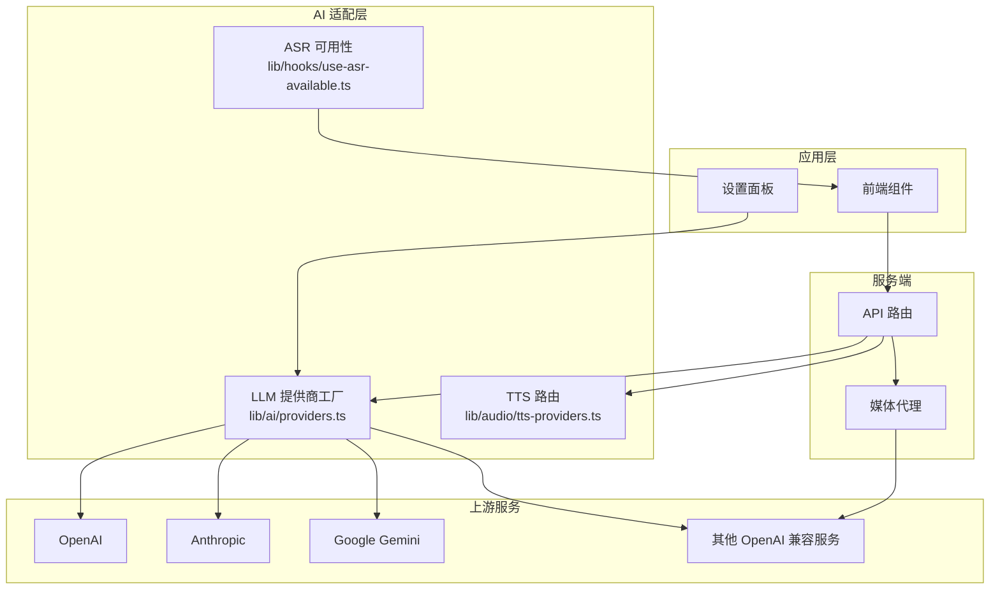
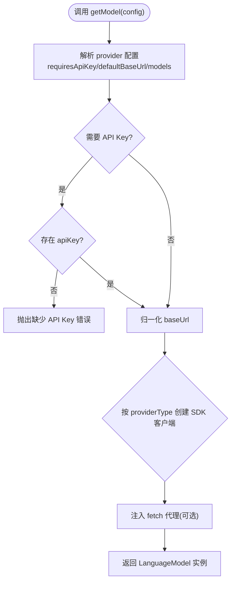
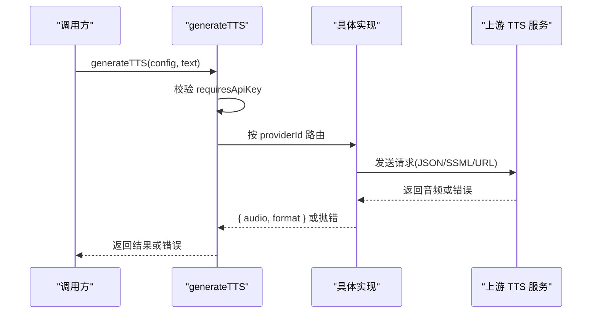
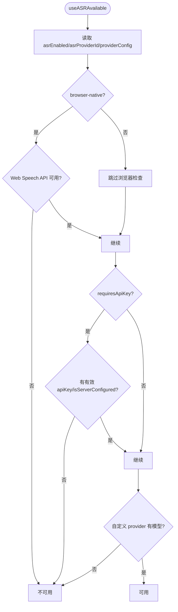
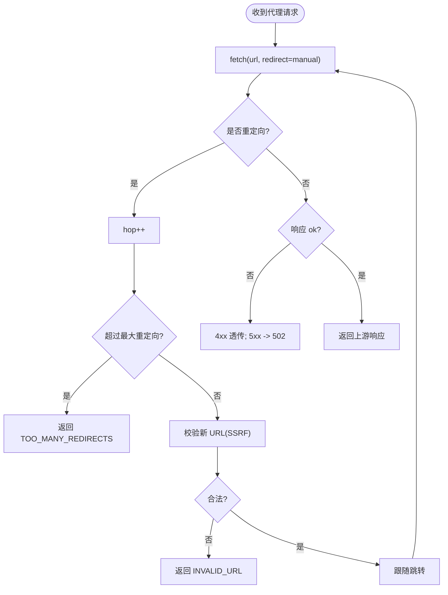
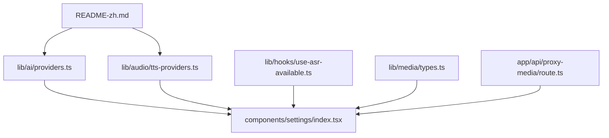

# AI 提供商扩展开发

<cite>
**本文引用的文件**   
- [lib/ai/providers.ts](file://lib/ai/providers.ts)
- [lib/audio/tts-providers.ts](file://lib/audio/tts-providers.ts)
- [lib/media/types.ts](file://lib/media/types.ts)
- [app/api/proxy-media/route.ts](file://app/api/proxy-media/route.ts)
- [components/settings/index.tsx](file://components/settings/index.tsx)
- [README-zh.md](file://README-zh.md)
</cite>

## 产品概述
OpenMAIC 是一个 AI 驱动的交互式课件生成与课堂管理平台，核心能力包括通过自然语言生成结构化课件、课堂实时互动（问答/讨论/测验）、课件编辑与回放。平台在统一抽象层上集成多家 LLM 提供商（OpenAI、Anthropic、Google Gemini、MiniMax、Qwen、GLM、Kimi、DeepSeek、Azure OpenAI 等），并提供 TTS（文本转语音）、ASR（语音识别）与媒体生成（图像/视频）的扩展机制。通过统一的 Provider 注册表、配置与认证管理、流式响应处理、错误分类与重试策略，开发者可以以最小成本接入新的 AI 服务，并在前端获得一致的体验。

## 核心业务流程
- 模型选择与实例化：根据 providerId 与 modelId，结合 baseUrl、apiKey 与能力元数据，构建统一的 LanguageModel 实例。
- 流式对话：基于 Vercel AI SDK 的流式接口，支持 reasoning 内容回写与中间件处理。
- TTS 生成：按 providerId 路由到具体实现，返回二进制音频与格式；对限流进行类型化错误抛出。
- ASR 可用性判定：综合开关、密钥、模型与浏览器能力，决定是否启用语音输入。
- 媒体代理与安全：对外暴露统一代理端点，限制重定向次数并校验跳转目标，防止 SSRF。

**章节来源**
- [lib/ai/providers.ts:1502-1732](file://lib/ai/providers.ts#L1502-L1732)
- [lib/audio/tts-providers.ts:145-193](file://lib/audio/tts-providers.ts#L145-L193)
- [lib/hooks/use-asr-available.ts:25-50](file://lib/hooks/use-asr-available.ts#L25-L50)
- [app/api/proxy-media/route.ts:38-65](file://app/api/proxy-media/route.ts#L38-L65)

## 功能模块清单
- LLM 提供商统一接口
  - 职责：注册多厂商模型、解析配置、构造 SDK 客户端、能力探测与思考模式控制。
  - 验收要点：支持 OpenAI/Azure/Anthropic/Google/MiniMax/Qwen/GLM/Kimi/DeepSeek 等；baseUrl 归一化；requiresApiKey 校验；thinking 能力与预算调整。
- TTS 提供商扩展
  - 职责：按 providerId 路由到具体实现；统一返回 { audio, format }；限流错误类型化。
  - 验收要点：内置 OpenAI/Azure/GLM/Qwen/MiniMax/Doubao/ElevenLabs/Lemonade/VoxCPM；自定义 OpenAI 兼容 TTS 自动复用；SSML/JSON/URL 下载等多模式。
- ASR 可用性判定
  - 职责：聚合全局开关、provider 密钥、模型列表与浏览器能力，决定是否可用。
  - 验收要点：browser-native 需 Web Speech API；自定义 provider 至少一个模型；空 key 视为未配置。
- 媒体生成类型定义
  - 职责：为图像/视频生成提供统一类型与扩展指引。
  - 验收要点：新增 provider 需在类型与常量中登记，并在对应 providers 文件中实现 switch case。
- 媒体代理与安全
  - 职责：转发媒体请求，限制重定向，校验跳转 URL，避免 SSRF。
  - 验收要点：最大重定向数限制；非法 URL 直接拒绝；上游 4xx 透传，5xx 统一 502。

**章节来源**
- [lib/ai/providers.ts:63-427](file://lib/ai/providers.ts#L63-L427)
- [lib/audio/tts-providers.ts:145-193](file://lib/audio/tts-providers.ts#L145-L193)
- [lib/hooks/use-asr-available.ts:25-50](file://lib/hooks/use-asr-available.ts#L25-L50)
- [lib/media/types.ts:1-35](file://lib/media/types.ts#L1-L35)
- [app/api/proxy-media/route.ts:38-65](file://app/api/proxy-media/route.ts#L38-L65)

## 数据与状态
- 提供商配置与发现
  - PROVIDERS 注册表集中声明各 provider 的 id、name、type、defaultBaseUrl、requiresApiKey、icon、models 与 capabilities。
  - isProviderKeyRequired 与 getProviderConfig 用于运行时校验与查询。
- 模型实例化与能力
  - getModel 根据 providerType 创建对应 SDK 客户端，注入 apiKey/baseUrl/fetch 代理（如 Google 代理）。
  - 针对 MiniMax 的 Anthropic 兼容模式，可在 fetch 层动态修改 thinking 上下文。
  - OpenAI Responses API 的选择逻辑由 shouldUseOpenAIResponsesApi 控制。
- TTS 配置与结果
  - generateTTS 依据 TTS_PROVIDERS 与 providerId 分发；返回 TTSGenerationResult { audio, format }。
  - throwIfTtsRateLimited 将 HTTP 429 转为 TTSRateLimitError，便于上层重试/退避。
- ASR 可用性状态
  - useASRAvailable 组合 asrEnabled、asrProviderId、providerConfig、browserSpeechSupported 得出布尔结果。
- 媒体代理状态
  - proxy-media 路由维护重定向计数与 URL 校验结果，向上游错误做统一映射。

**图表来源**
- [lib/ai/providers.ts:63-427](file://lib/ai/providers.ts#L63-L427)
- [lib/ai/providers.ts:1494-1732](file://lib/ai/providers.ts#L1494-L1732)
- [lib/audio/tts-providers.ts:145-193](file://lib/audio/tts-providers.ts#L145-L193)
- [lib/hooks/use-asr-available.ts:25-50](file://lib/hooks/use-asr-available.ts#L25-L50)
- [app/api/proxy-media/route.ts:38-65](file://app/api/proxy-media/route.ts#L38-L65)

**章节来源**
- [lib/ai/providers.ts:1494-1732](file://lib/ai/providers.ts#L1494-L1732)
- [lib/audio/tts-providers.ts:109-140](file://lib/audio/tts-providers.ts#L109-L140)
- [lib/hooks/use-asr-available.ts:25-50](file://lib/hooks/use-asr-available.ts#L25-L50)
- [app/api/proxy-media/route.ts:38-65](file://app/api/proxy-media/route.ts#L38-L65)

## 关键约束与边界
- 认证与密钥
  - requiresApiKey 为 true 时，必须提供有效 apiKey；否则抛出明确错误。
  - Azure 使用部署名而非 modelId；Google 可通过 fetch 代理走企业代理。
- Base URL 归一化
  - MiniMax/Anthropic 兼容路径自动补齐 v1；Azure 路径规范化。
- 流式与推理内容
  - OpenAI 流式响应中的 reasoning_content 会被中间件重写为 <think> 块，保证 UI 一致性。
  - Lemonade 流式请求保持原始流，非流式则克隆响应体进行二次处理。
- 错误分类与重试
  - TTS 限流错误类型化为 TTSRateLimitError，便于上层区分并重试。
  - 媒体代理对上游 4xx 透传、5xx 统一 502，避免误重试。
- 安全边界
  - 媒体代理限制重定向次数，逐跳校验 Location，阻断 SSRF。
- 扩展边界
  - 新增 TTS/ASR/图像/视频 provider 需遵循“类型+常量+实现”三步法，并在 i18n 补充名称。

**章节来源**
- [lib/ai/providers.ts:1472-1496](file://lib/ai/providers.ts#L1472-L1496)
- [lib/ai/providers.ts:1582-1619](file://lib/ai/providers.ts#L1582-L1619)
- [lib/audio/tts-providers.ts:121-140](file://lib/audio/tts-providers.ts#L121-L140)
- [app/api/proxy-media/route.ts:38-65](file://app/api/proxy-media/route.ts#L38-L65)
- [README-zh.md:120-177](file://README-zh.md#L120-L177)

## 架构总览
下图展示了 OpenMAIC 中 AI 提供商的统一入口、TTS 路由与媒体代理的安全转发流程。

**图表来源**
- [lib/ai/providers.ts:63-427](file://lib/ai/providers.ts#L63-L427)
- [lib/audio/tts-providers.ts:145-193](file://lib/audio/tts-providers.ts#L145-L193)
- [lib/hooks/use-asr-available.ts:25-50](file://lib/hooks/use-asr-available.ts#L25-L50)
- [app/api/proxy-media/route.ts:38-65](file://app/api/proxy-media/route.ts#L38-L65)

## 详细组件分析

### LLM 提供商统一接口（lib/ai/providers.ts）
- 设计要点
  - PROVIDERS 注册表集中声明各 provider 的元数据与模型能力。
  - getModel 根据 providerType 创建 SDK 客户端，注入 baseUrl、apiKey、fetch 代理。
  - 支持 MiniMax 的 Anthropic 兼容模式，动态注入 thinking 上下文。
  - OpenAI Responses API 的选择由模型 ID 正则匹配控制。
- 扩展方法
  - 新增 provider：在 PROVIDERS 中添加元数据；如需特殊 baseUrl 归一化，补充 normalize 函数。
  - 新增模型：在 models 数组中登记 id、name、capabilities（streaming/tools/vision/thinking）。
  - 自定义 fetch：如 Google 代理场景，通过 config.proxy 注入 undici ProxyAgent。
- 性能与错误
  - 流式响应中间件处理 reasoning 内容，避免 UI 抖动。
  - 错误信息包含 provider 与状态码，便于诊断。

**图表来源**
- [lib/ai/providers.ts:1502-1732](file://lib/ai/providers.ts#L1502-L1732)

**章节来源**
- [lib/ai/providers.ts:63-427](file://lib/ai/providers.ts#L63-L427)
- [lib/ai/providers.ts:1472-1496](file://lib/ai/providers.ts#L1472-L1496)
- [lib/ai/providers.ts:1582-1619](file://lib/ai/providers.ts#L1582-L1619)

### TTS 提供商扩展（lib/audio/tts-providers.ts）
- 设计要点
  - generateTTS 按 providerId 分发到具体实现；统一返回 { audio, format }。
  - throwIfTtsRateLimited 将 HTTP 429 转为 TTSRateLimitError，便于上层重试。
  - 支持多种调用模式：直接 JSON、SSML、URL 下载。
- 扩展方法
  - 新增 provider：在 TTS_PROVIDERS 中登记元数据；实现 generateXxxTTS；在 switch 中添加 case。
  - 自定义 OpenAI 兼容 TTS：isCustomTTSProvider 命中后复用 OpenAI 实现。
- 性能与错误
  - 错误信息提取 response.json/text，提高可诊断性。
  - 格式推断基于 content-type，默认 mp3。

**图表来源**
- [lib/audio/tts-providers.ts:145-193](file://lib/audio/tts-providers.ts#L145-L193)
- [lib/audio/tts-providers.ts:198-232](file://lib/audio/tts-providers.ts#L198-L232)
- [lib/audio/tts-providers.ts:560-596](file://lib/audio/tts-providers.ts#L560-L596)

**章节来源**
- [lib/audio/tts-providers.ts:109-140](file://lib/audio/tts-providers.ts#L109-L140)
- [lib/audio/tts-providers.ts:145-193](file://lib/audio/tts-providers.ts#L145-L193)
- [lib/audio/tts-providers.ts:543-555](file://lib/audio/tts-providers.ts#L543-L555)

### ASR 可用性判定（lib/hooks/use-asr-available.ts）
- 设计要点
  - 组合 asrEnabled、asrProviderId、providerConfig、browserSpeechSupported 得出布尔结果。
  - browser-native 需 Web Speech API；自定义 provider 至少一个模型；空 key 视为未配置。
- 扩展方法
  - 新增 ASR provider：在 ASR_PROVIDERS 中登记元数据；确保 requiresApiKey 正确。
- 性能与错误
  - 使用 useSyncExternalStore 订阅浏览器能力变化，避免重复计算。

**图表来源**
- [lib/hooks/use-asr-available.ts:25-50](file://lib/hooks/use-asr-available.ts#L25-L50)

**章节来源**
- [lib/hooks/use-asr-available.ts:25-50](file://lib/hooks/use-asr-available.ts#L25-L50)

### 媒体生成类型与扩展（lib/media/types.ts）
- 设计要点
  - 为图像/视频生成提供统一类型与扩展指引。
  - 新增 provider 需在类型与常量中登记，并在对应 providers 文件中实现 switch case。
- 扩展方法
  - 新增 Image/Video provider：添加 union 类型；在 constants 中登记元数据；在 image-providers.ts/video-providers.ts 中实现。
- 性能与错误
  - 异步任务型 provider 使用 runPolledTask 轮询任务状态。

**章节来源**
- [lib/media/types.ts:1-35](file://lib/media/types.ts#L1-L35)

### 媒体代理与安全（app/api/proxy-media/route.ts）
- 设计要点
  - 限制重定向次数，逐跳校验 Location，防止 SSRF。
  - 上游 4xx 透传，5xx 统一 502，避免误重试。
- 扩展方法
  - 新增代理规则：在 validateUrlForSSRF 中扩展白名单/黑名单。
- 性能与错误
  - 手动循环 fetch 重定向，减少库开销；错误信息清晰。

**图表来源**
- [app/api/proxy-media/route.ts:38-65](file://app/api/proxy-media/route.ts#L38-L65)

**章节来源**
- [app/api/proxy-media/route.ts:38-65](file://app/api/proxy-media/route.ts#L38-L65)

## 依赖分析
- 组件耦合与内聚
  - LLM 提供商工厂与注册表高内聚；TTS 路由与实现解耦，便于扩展。
  - ASR 可用性判定独立于业务逻辑，仅依赖设置与浏览器能力。
  - 媒体代理与上游服务松耦合，通过 URL 校验保障安全。
- 外部依赖
  - Vercel AI SDK（@ai-sdk/openai、@ai-sdk/azure、@ai-sdk/anthropic、@ai-sdk/google）。
  - undici（Google 代理场景）。
- 潜在循环依赖
  - 当前结构无循环导入；providers.ts 避免在服务端/客户端共享模块间引入 node-only 特性。

**图表来源**
- [lib/ai/providers.ts:63-427](file://lib/ai/providers.ts#L63-L427)
- [lib/audio/tts-providers.ts:145-193](file://lib/audio/tts-providers.ts#L145-L193)
- [lib/hooks/use-asr-available.ts:25-50](file://lib/hooks/use-asr-available.ts#L25-L50)
- [lib/media/types.ts:1-35](file://lib/media/types.ts#L1-L35)
- [app/api/proxy-media/route.ts:38-65](file://app/api/proxy-media/route.ts#L38-L65)
- [components/settings/index.tsx:135-154](file://components/settings/index.tsx#L135-L154)
- [README-zh.md:120-177](file://README-zh.md#L120-L177)

**章节来源**
- [lib/ai/providers.ts:63-427](file://lib/ai/providers.ts#L63-L427)
- [lib/audio/tts-providers.ts:145-193](file://lib/audio/tts-providers.ts#L145-L193)
- [lib/hooks/use-asr-available.ts:25-50](file://lib/hooks/use-asr-available.ts#L25-L50)
- [lib/media/types.ts:1-35](file://lib/media/types.ts#L1-L35)
- [app/api/proxy-media/route.ts:38-65](file://app/api/proxy-media/route.ts#L38-L65)
- [components/settings/index.tsx:135-154](file://components/settings/index.tsx#L135-L154)
- [README-zh.md:120-177](file://README-zh.md#L120-L177)

## 性能考虑
- 流式响应
  - 使用 Vercel AI SDK 的流式接口，减少首字节延迟；reasoning 内容中间件避免 UI 抖动。
- 网络优化
  - Google 代理场景按需加载 undici，避免冷启动开销。
- 错误分类
  - TTS 限流错误类型化，便于上层快速识别与退避。
- 资源控制
  - 媒体代理限制重定向次数，降低被恶意利用的风险。

[本节为通用指导，不直接分析具体文件]

## 故障排查指南
- 常见问题
  - 缺少 API Key：检查 provider.requiresApiKey 与 config.apiKey。
  - Base URL 不正确：确认 normalize 函数与 defaultBaseUrl。
  - 流式响应异常：检查中间件 wrapResponseWithReasoning 与 Lemonade 分支。
  - TTS 限流：捕获 TTSRateLimitError，实施指数退避。
  - 媒体代理失败：查看重定向链与 SSRF 校验日志。
- 定位建议
  - 在 providers.ts 的 getModel 与 TTS 路由处增加日志。
  - 使用 README 中的环境变量示例核对配置。

**章节来源**
- [lib/ai/providers.ts:1502-1732](file://lib/ai/providers.ts#L1502-L1732)
- [lib/audio/tts-providers.ts:121-140](file://lib/audio/tts-providers.ts#L121-L140)
- [README-zh.md:120-177](file://README-zh.md#L120-L177)

## 结论
OpenMAIC 通过统一的 Provider 注册表、SDK 适配层与 TTS/ASR/媒体生成的扩展机制，实现了多厂商 AI 服务的无缝集成。开发者只需遵循“类型+常量+实现”的三步法，即可低成本接入新的 LLM/TTS/ASR/媒体服务。系统内置了流式响应、错误分类、安全代理与可用性判定，为生产环境提供了稳定可靠的扩展基础。

[本节为总结，不直接分析具体文件]