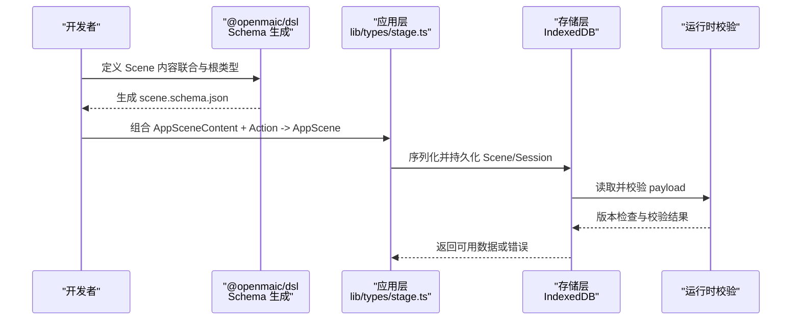
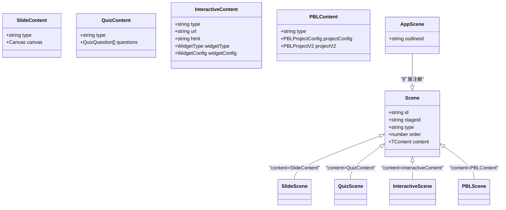
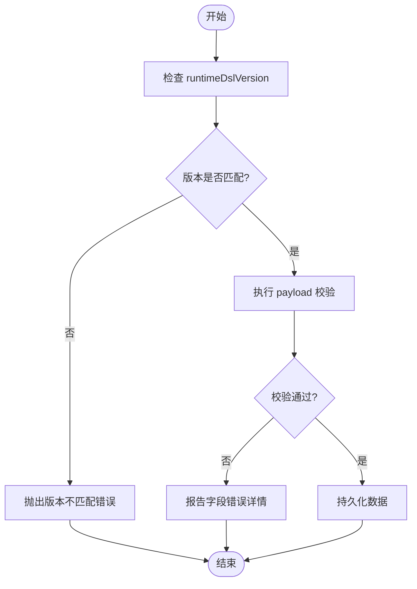

# DSL 扩展开发

<cite>
**本文引用的文件**   
- [schema-roots.ts](file://packages/@openmaic/dsl/src/schema-roots.ts)
- [stage.ts](file://lib/types/stage.ts)
- [runtime.test.ts](file://packages/@openmaic/dsl/test/runtime.test.ts)
- [browser.ts](file://packages/@openmaic/storage/src/runtime/browser.ts)
- [schemas.ts](file://lib/pbl/v2/operations/schemas.ts)
- [types.test.ts](file://tests/pbl/v2/types.test.ts)
- [classroom-media-generation.test.ts](file://tests/server/classroom-media-generation.test.ts)
</cite>

## 目录
- 产品概述
- 核心业务流程
- 功能模块清单
- 数据与状态
- 关键约束与边界

## 产品概述
OpenMAIC 的课件 DSL（领域特定语言）用于统一描述“舞台-场景-内容”的结构，支撑自然语言生成、编辑、回放与导出。DSL 的核心由 @openmaic/dsl 包提供，应用层在 lib/types/stage.ts 中将其实例化为带播放动作与应用特有内容的完整类型。通过 Schema 代码生成与运行时校验，确保 JSON 序列化/反序列化的一致性与向后兼容。

## 核心业务流程
- 定义阶段：在 DSL 包中声明 Scene 的内容联合（如 SlideContent、QuizContent），并通过 schema-roots.ts 暴露给构建期 Schema 生成器，产出 scene.schema.json。
- 使用阶段：应用层将 DSL 的通用骨架与应用的 Action 集合、AppSceneContent（包含 interactive、pbl 等扩展）组合为 AppScene，供编辑器、渲染器、回放引擎消费。
- 验证阶段：运行时对持久化会话进行 payload 校验，结合 RUNTIME_DSL_VERSION 保证版本一致性；JSON 往返需无损。
- 迁移阶段：当存储中的会话版本高于客户端当前版本时，拒绝写入或触发迁移策略，避免旧客户端破坏新数据。

**图表来源** 
- [schema-roots.ts:1-24](file://packages/@openmaic/dsl/src/schema-roots.ts#L1-L24)
- [stage.ts:105-117](file://lib/types/stage.ts#L105-L117)
- [browser.ts:93-103](file://packages/@openmaic/storage/src/runtime/browser.ts#L93-L103)

**章节来源**
- [schema-roots.ts:1-24](file://packages/@openmaic/dsl/src/schema-roots.ts#L1-L24)
- [stage.ts:105-117](file://lib/types/stage.ts#L105-L117)
- [browser.ts:93-103](file://packages/@openmaic/storage/src/runtime/browser.ts#L93-L103)

## 功能模块清单
- DSL 骨架与 Schema 生成
  - 职责：定义 Scene 的通用结构、内容联合与根类型，生成 JSON Schema。
  - 验收要点：生成的 schema 能区分不同 content.type，保持 type <-> content 绑定。
- 应用层类型组合
  - 职责：将 DSL 骨架与应用的 Action、AppSceneContent（interactive、pbl）组合为 AppScene。
  - 验收要点：makeScene 构造函数保证 type 与 content.type 绑定，调用方无需额外断言。
- 运行时校验与版本管理
  - 职责：对持久化会话进行 payload 校验，比较 RUNTIME_DSL_VERSION，阻止旧客户端写入新版本数据。
  - 验收要点：缺失 runtimeDslVersion 的类型错误、版本不匹配时的异常抛出。
- PBL v2 类型与 Schema
  - 职责：定义项目级学习结构的类型与校验规则，保障 JSON 往返无损。
  - 验收要点：isPBLProjectV2 守卫正确区分 v1/v2，全量字段构造通过编译与运行测试。
- 媒体占位符替换
  - 职责：在服务器端将 mediaRef 占位符替换为真实 URL，同时保留直接 src。
  - 验收要点：存在 mediaRef 时优先保留直接 src，替换逻辑不影响已有值。

**章节来源**
- [schema-roots.ts:1-24](file://packages/@openmaic/dsl/src/schema-roots.ts#L1-L24)
- [stage.ts:149-155](file://lib/types/stage.ts#L149-L155)
- [runtime.test.ts:80-107](file://packages/@openmaic/dsl/test/runtime.test.ts#L80-L107)
- [browser.ts:93-103](file://packages/@openmaic/storage/src/runtime/browser.ts#L93-L103)
- [schemas.ts](file://lib/pbl/v2/operations/schemas.ts)
- [types.test.ts:1-39](file://tests/pbl/v2/types.test.ts#L1-L39)
- [classroom-media-generation.test.ts:1-45](file://tests/server/classroom-media-generation.test.ts#L1-L45)

## 数据与状态
- 核心数据模型
  - Scene<Action, TContent>：通用骨架，type 与 content 强绑定。
  - SlideContent、QuizContent：合同内内容类型。
  - InteractiveContent、PBLContent：应用扩展内容类型。
  - AppSceneContent = DslSceneContent | InteractiveContent | PBLContent。
  - AppScene = DslScene<Action, SceneContent> 并附加 outlineId 等应用注解。
- 关键状态流转
  - makeScene(content) 构造 AppScene，确保 type 与 content.type 一致。
  - 运行时会话需要 runtimeDslVersion，缺失则类型错误。
  - 存储层对 payload 进行校验，版本不一致抛出错误。
- 数据所有权边界
  - 合同层仅拥有 slide/quiz 内容；interactive/pbl 属于应用层，各自负责其 Schema 与校验。

**图表来源** 
- [stage.ts:60-88](file://lib/types/stage.ts#L60-L88)
- [stage.ts:105-117](file://lib/types/stage.ts#L105-L117)

**章节来源**
- [stage.ts:60-88](file://lib/types/stage.ts#L60-L88)
- [stage.ts:105-117](file://lib/types/stage.ts#L105-L117)

## 关键约束与边界
- Schema 验证规则
  - 构建期：schema-roots.ts 指定 SerializedScene 根类型，生成 scene.schema.json，确保 discriminated union 的 type 与 content 绑定。
  - 运行期：payloadValidators 对每个 kind 的 payload 进行校验，缺失或非法字段抛出错误。
- 字段约束与业务逻辑
  - makeScene 强制 type 与 content.type 绑定，避免不一致。
  - PBL v2 类型要求 JSON 往返无损，测试覆盖全量字段构造。
  - 媒体占位符替换保留直接 src，避免覆盖用户设置。
- 版本管理与向后兼容
  - RuntimeSession 必须携带 runtimeDslVersion；若存储版本高于客户端，拒绝写入或触发迁移。
  - 应用扩展内容（interactive/pbl）不在合同范围内，需自行维护 Schema 与迁移策略。
- 常见陷阱
  - 直接使用 Partial<AppScene> 会破坏判别联合，应使用 ScenePatch。
  - 忽略 runtimeDslVersion 会导致类型错误或运行时校验失败。
  - 自定义元素属性需在对应元素的 Schema 中声明，否则编辑工具无法识别。

**图表来源** 
- [runtime.test.ts:80-107](file://packages/@openmaic/dsl/test/runtime.test.ts#L80-L107)
- [browser.ts:93-103](file://packages/@openmaic/storage/src/runtime/browser.ts#L93-L103)

**章节来源**
- [schema-roots.ts:1-24](file://packages/@openmaic/dsl/src/schema-roots.ts#L1-L24)
- [runtime.test.ts:80-107](file://packages/@openmaic/dsl/test/runtime.test.ts#L80-L107)
- [browser.ts:93-103](file://packages/@openmaic/storage/src/runtime/browser.ts#L93-L103)
- [types.test.ts:1-39](file://tests/pbl/v2/types.test.ts#L1-L39)
- [classroom-media-generation.test.ts:1-45](file://tests/server/classroom-media-generation.test.ts#L1-L45)