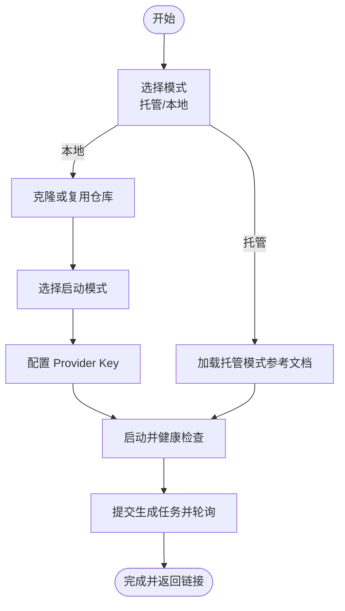
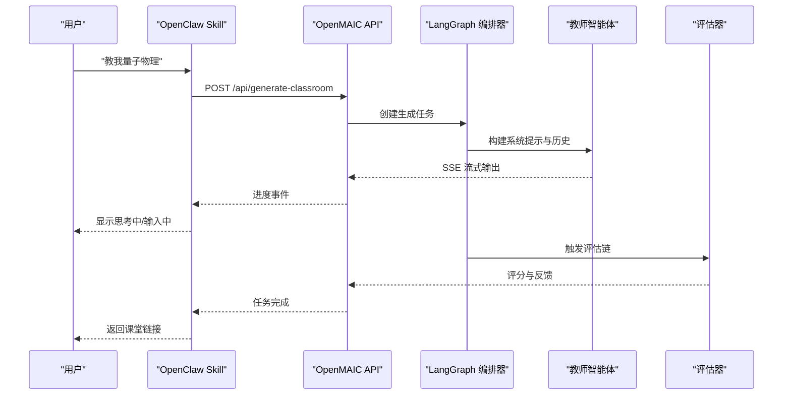
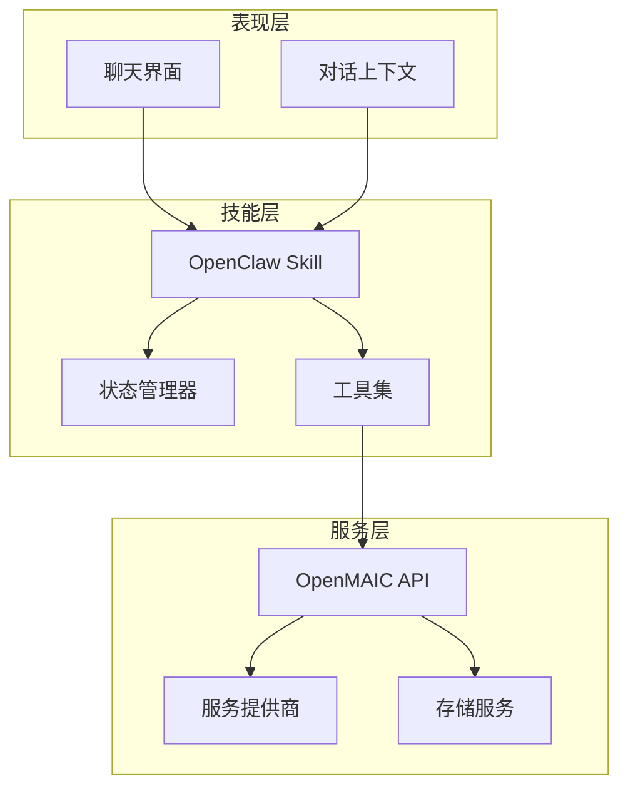
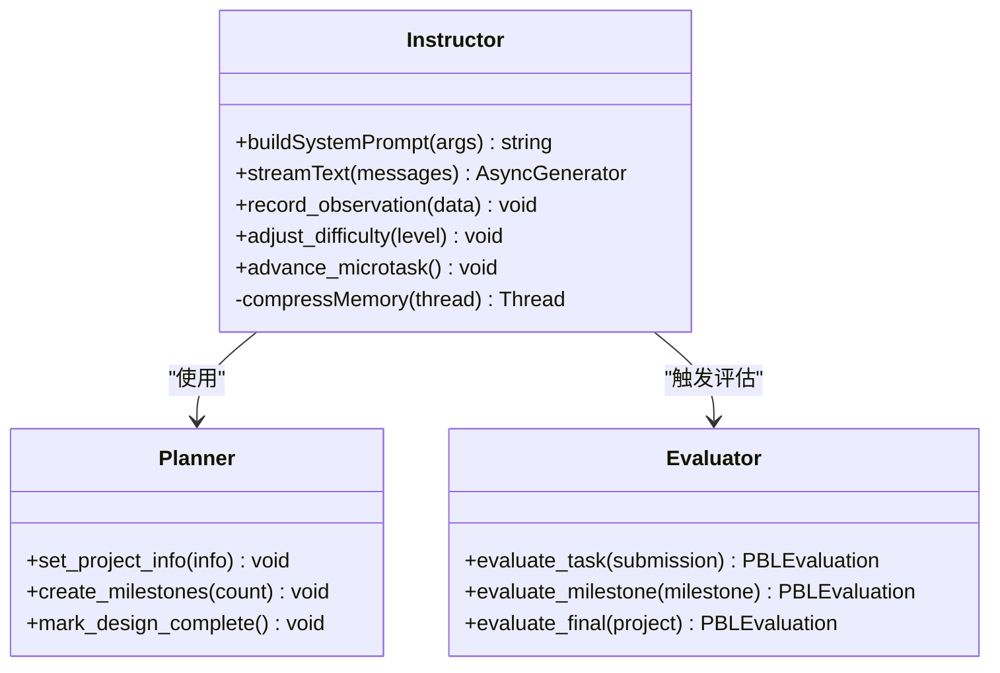
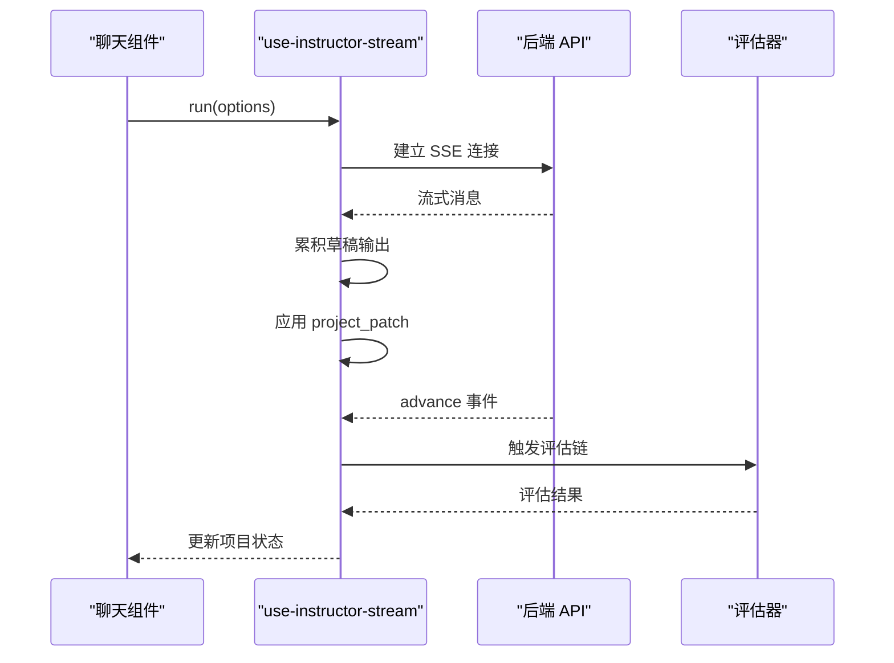
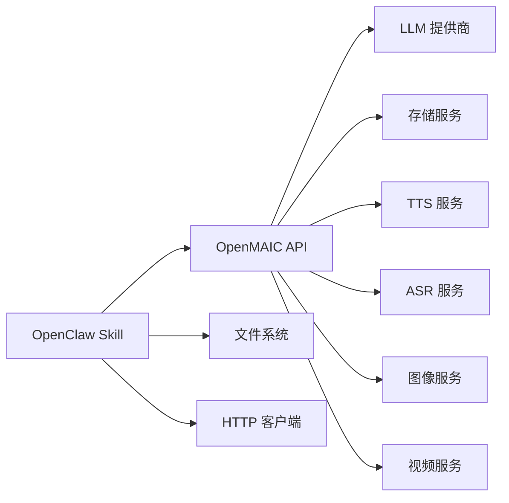

# OpenClaw Skill 开发

<cite>
**本文引用的文件**   
- [README-zh.md](file://README-zh.md)
- [SKILL.md](file://skills/openmaic/SKILL.md)
- [clone.md](file://skills/openmaic/references/clone.md)
- [hosted-mode.md](file://skills/openmaic/references/hosted-mode.md)
- [provider-keys.md](file://skills/openmaic/references/provider-keys.md)
- [startup-modes.md](file://skills/openmaic/references/startup-modes.md)
- [generate-flow.md](file://skills/openmaic/references/generate-flow.md)
- [use-instructor-stream.ts](file://components/scene-renderers/pbl/v2/use-instructor-stream.ts)
- [chat.tsx](file://components/scene-renderers/pbl/v2/chat.tsx)
- [instructor.ts](file://lib/pbl/v2/agents/instructor.ts)
- [planner.ts](file://lib/pbl/v2/agents/planner.ts)
- [evaluator-task.md](file://lib/pbl/v2/prompts/evaluator-task.md)
- [planner-system.md](file://lib/pbl/v2/prompts/planner-system.md)
- [route.ts](file://app/api/agent/edit/route.ts)
- [drain.test.ts](file://tests/pbl/v2/drain.test.ts)
</cite>

## 产品概述
OpenMAIC 是一个开源的 AI 互动课堂平台，支持通过自然语言指令生成结构化课件、多智能体实时讨论与项目制学习（PBL）。OpenClaw Skill 将 OpenMAIC 的能力以“可确认、分阶段”的 SOP 形式暴露给聊天助手，让用户在飞书、Slack、Discord、Telegram 等 20+ 平台中零配置使用。Skill 的核心价值在于：
- 将复杂部署与生成流程拆解为可确认的步骤，避免黑盒执行
- 统一托管模式与本地模式的引导路径
- 提供从需求到课堂链接的端到端自动化工作流
- 与 OpenMAIC 服务端 API 和 LangGraph 编排无缝集成

适用场景包括：快速生成课程、在线协作备课、课堂回放与导出、以及基于 PBL 的多轮教学评估。

**章节来源**
- [README-zh.md:50-78](file://README-zh.md#L50-L78)
- [README-zh.md:479-551](file://README-zh.md#L479-L551)

## 核心业务流程
OpenClaw Skill 的工作流围绕“选择模式 → 克隆/复用仓库 → 启动模式 → 配置 Provider Key → 启动服务 → 生成课堂”展开，每一步都需用户确认。关键交互节点如下：
- 模式选择：托管模式（访问码）或本地模式（仓库路径与 URL）
- 克隆与复用：检测现有仓库并提示是否保留
- 启动模式：dev/build/Docker 三选一
- Provider 配置：推荐编辑 .env.local 或 server-providers.yml
- 健康检查：GET /api/health 验证服务可用
- 生成课堂：提交异步任务并轮询进度，完成后返回课堂链接

**图表来源**
- [SKILL.md:52-94](file://skills/openmaic/SKILL.md#L52-L94)
- [README-zh.md:663-670](file://README-zh.md#L663-L670)

**章节来源**
- [SKILL.md:52-94](file://skills/openmaic/SKILL.md#L52-L94)
- [README-zh.md:663-670](file://README-zh.md#L663-L670)

## 功能模块清单
- 模式选择与路由：根据 skill config 自动识别托管模式，否则引导用户选择
- 仓库管理：检测本地仓库状态，支持 clone 与复用
- 启动器：封装 dev/build/Docker 三种启动方式
- Provider 配置向导：推荐配置文件路径，禁止直接写入密钥
- 健康检查：调用 /api/health 验证服务可用性
- 生成流水线：提交异步任务、稀疏轮询、错误处理与结果回传
- 对话上下文：维护技能配置、用户选择历史与步骤状态
- 工具调用：文件系统读取、HTTP 请求、命令执行（均需确认）
- 外部服务集成：OpenMAIC 服务端 API、LLM 提供商、TTS/ASR/图像/视频服务

验收要点：
- 所有状态变更操作前必须显式确认
- 不假设 OpenClaw 自身模型或 API Key 会被 OpenMAIC 复用
- 仅允许通过 OpenMAIC 服务端配置文件控制 Provider 选择
- 生成任务完成后返回原始绝对 URL，无额外格式

**章节来源**
- [SKILL.md:12-25](file://skills/openmaic/SKILL.md#L12-L25)
- [SKILL.md:27-50](file://skills/openmaic/SKILL.md#L27-L50)
- [SKILL.md:96-103](file://skills/openmaic/SKILL.md#L96-L103)

## 数据与状态
OpenClaw Skill 的状态管理围绕以下核心数据模型：
- Skill Config：~/.openclaw/openclaw.json 中的 skills.entries.openmaic.config
- 会话上下文：当前模式、仓库路径、URL、Provider 配置状态
- 生成任务状态：jobId、进度、错误信息、最终链接
- 对话历史：用户输入、Skill 输出、确认记录

状态流转遵循“单步推进 + 显式确认”原则，避免状态跳跃。错误处理采用“回滚到上一步 + 提示修复”策略。

**章节来源**
- [SKILL.md:27-50](file://skills/openmaic/SKILL.md#L27-L50)
- [SKILL.md:96-103](file://skills/openmaic/SKILL.md#L96-L103)

## 关键约束与边界
- 非功能性需求：
  - 响应简洁明确，每步 2-3 个具体选项
  - 优先推荐选项并解释原因
  - 长任务采用稀疏轮询，避免频繁阻塞
- 依赖与集成边界：
  - 仅依赖 OpenMAIC 服务端 API，不直接调用 LLM
  - Provider 配置由服务端 .env.local 或 server-providers.yml 管理
  - 不支持运行时模型或 Provider 覆盖
- 业务约束：
  - 禁止跳过确认步骤
  - 禁止默认粘贴 API Key 到聊天窗口
  - 生成任务完成后仅返回支持的字段

**章节来源**
- [SKILL.md:12-25](file://skills/openmaic/SKILL.md#L12-L25)
- [SKILL.md:96-103](file://skills/openmaic/SKILL.md#L96-L103)

## 与 LangGraph 工作流的集成
OpenMAIC 的后端使用 LangGraph 实现多智能体编排，Skill 通过 API 路由间接调用该编排层。关键集成点：
- 教师智能体（Instructor）：驱动 PBL 任务的每一轮对话，构建系统提示、流式输出、工具调用
- 规划器（Planner）：根据课程大纲自动生成 PBL 项目结构
- 评估器（Evaluator）：对微任务、里程碑、最终成果进行评分与反馈

**图表来源**
- [instructor.ts:1-12](file://lib/pbl/v2/agents/instructor.ts#L1-L12)
- [planner.ts:427-442](file://lib/pbl/v2/agents/planner.ts#L427-L442)
- [evaluator-task.md:1-8](file://lib/pbl/v2/prompts/evaluator-task.md#L1-L8)

**章节来源**
- [instructor.ts:1-12](file://lib/pbl/v2/agents/instructor.ts#L1-L12)
- [planner.ts:427-442](file://lib/pbl/v2/agents/planner.ts#L427-L442)
- [evaluator-task.md:1-8](file://lib/pbl/v2/prompts/evaluator-task.md#L1-L8)

## 对话上下文管理与工具调用
Skill 的对话上下文通过以下步骤维护：
- 初始化时加载 skill config，设置默认模式与参数
- 每步交互后更新上下文状态（如已选择的模式、仓库路径）
- 工具调用前检查权限与前置条件，必要时请求用户确认

工具调用示例：
- 文件系统：读取 PDF、检查仓库状态、编辑配置文件
- HTTP 客户端：调用 /api/health、提交生成任务、轮询进度
- 命令执行：git clone、pnpm install、docker compose up

错误处理策略：
- 网络错误：重试机制 + 降级到手动模式
- 配置错误：提示具体文件路径与修改建议
- 任务失败：保留中间状态，允许用户修正后重试

**章节来源**
- [SKILL.md:12-25](file://skills/openmaic/SKILL.md#L12-L25)
- [SKILL.md:96-103](file://skills/openmaic/SKILL.md#L96-L103)

## 外部服务集成实现方法
OpenMAIC 支持多种外部服务，Skill 通过环境变量与服务端配置进行集成：
- LLM 提供商：OPENAI_API_KEY、ANTHROPIC_API_KEY、GOOGLE_API_KEY 等
- TTS/ASR：VoxCPM2、Minimax、Azure STT 等
- 图像/视频：OpenAI Image、ComfyUI、MiniMax Video
- 搜索：Brave、百度、博查、SearXNG

集成步骤：
1. 在服务端 .env.local 或 server-providers.yml 中配置 Provider
2. 重启服务使配置生效
3. 通过 /api/server-providers 验证配置有效性

性能优化建议：
- 使用连接池减少重复握手
- 启用缓存避免重复请求
- 合理设置超时与重试策略

**章节来源**
- [README-zh.md:105-135](file://README-zh.md#L105-L135)
- [README-zh.md:139-187](file://README-zh.md#L139-L187)

## Skill 开发示例
### 简单文本处理 Skill
目标：将用户输入的文本转换为大写并返回

实现要点：
- 定义 Skill 元数据与描述
- 实现文本转换逻辑
- 添加输入验证与错误处理
- 提供测试用例

### 复杂多步骤任务编排
目标：根据用户需求生成包含幻灯片、测验、交互模块的完整课堂

实现要点：
- 分解任务为多个子步骤（大纲生成、内容生成、媒体处理）
- 使用状态机管理步骤间依赖
- 实现并行执行与错误恢复
- 提供进度反馈与用户干预接口

**章节来源**
- [SKILL.md:52-94](file://skills/openmaic/SKILL.md#L52-L94)
- [README-zh.md:402-412](file://README-zh.md#L402-L412)

## 测试方法与调试技巧
### 单元测试
- 使用 Jest/Vitest 编写测试用例
- 模拟外部服务响应
- 验证状态转换与错误处理

### 集成测试
- 端到端测试整个 Skill 流程
- 验证与 OpenMAIC API 的交互
- 测试不同环境下的行为一致性

### 调试技巧
- 启用详细日志记录
- 使用浏览器开发者工具监控网络请求
- 逐步执行并检查中间状态

**章节来源**
- [drain.test.ts:1066-1109](file://tests/pbl/v2/drain.test.ts#L1066-L1109)

## 性能优化策略
- 流式处理：使用 SSE 实现实时反馈
- 内存管理：及时释放不再使用的资源
- 并发控制：限制同时进行的任务数量
- 缓存策略：缓存常用数据与计算结果

## 分发、版本管理与社区共享
### 分发机制
- ClawHub 市场：一行命令安装 `clawhub install openmaic`
- 手动安装：复制到 ~/.openclaw/skills/ 目录
- 私有部署：企业内部共享 Skill 包

### 版本管理
- 语义化版本控制（SemVer）
- 向后兼容性保证
- 弃用警告与迁移指南

### 社区贡献
- Fork 仓库并提交 Pull Request
- 遵循代码规范与测试要求
- 参与讨论与问题反馈

**章节来源**
- [README-zh.md:504-517](file://README-zh.md#L504-L517)
- [README-zh.md:612-686](file://README-zh.md#L612-L686)

## 架构概览
OpenClaw Skill 的架构分为三层：
- 表现层：聊天界面与用户交互
- 技能层：SOP 流程与状态管理
- 服务层：OpenMAIC API 与外部服务集成

**图表来源**
- [SKILL.md:1-10](file://skills/openmaic/SKILL.md#L1-L10)
- [README-zh.md:618-670](file://README-zh.md#L618-L670)

## 详细组件分析
### 教师智能体（Instructor）
教师智能体是 PBL v2 的核心组件，负责驱动每一轮教学对话。其实现特点：
- 动态构建系统提示，锚定当前里程碑与微任务
- 支持流式输出，实时更新用户界面
- 集成三个教学工具：观察记录、难度调整、进度推进
- 记忆压缩机制，保持上下文窗口稳定

**图表来源**
- [instructor.ts:494-510](file://lib/pbl/v2/agents/instructor.ts#L494-L510)
- [planner.ts:427-442](file://lib/pbl/v2/agents/planner.ts#L427-L442)

**章节来源**
- [instructor.ts:1-12](file://lib/pbl/v2/agents/instructor.ts#L1-L12)
- [instructor.ts:494-510](file://lib/pbl/v2/agents/instructor.ts#L494-L510)

### 流式处理钩子（use-instructor-stream）
前端流式处理钩子负责：
- 管理单个流式请求的生命周期
- 累积草稿输出用于实时渲染
- 应用 project_patch 事件到项目状态
- 协调评估链的执行顺序

**图表来源**
- [use-instructor-stream.ts:126-145](file://components/scene-renderers/pbl/v2/use-instructor-stream.ts#L126-L145)

**章节来源**
- [use-instructor-stream.ts:1-94](file://components/scene-renderers/pbl/v2/use-instructor-stream.ts#L1-94)

### API 路由与工具集
编辑 API 路由展示了如何构建工具集并与 LLM 交互：
- 构建工具集：aiCall、getSceneContext、getSelection
- 创建流式调用函数：处理最大输出令牌、思考配置
- 构建智能体：注入系统提示、工具和历史消息

**章节来源**
- [route.ts:141-167](file://app/api/agent/edit/route.ts#L141-L167)

## 依赖分析
OpenClaw Skill 的依赖关系清晰分层：
- 直接依赖：OpenMAIC API、文件系统、HTTP 客户端
- 间接依赖：LLM 提供商、存储服务、第三方服务
- 可选依赖：TTS、ASR、图像生成、视频处理

**图表来源**
- [SKILL.md:12-25](file://skills/openmaic/SKILL.md#L12-L25)
- [README-zh.md:105-135](file://README-zh.md#L105-L135)

**章节来源**
- [SKILL.md:12-25](file://skills/openmaic/SKILL.md#L12-L25)
- [README-zh.md:105-135](file://README-zh.md#L105-L135)

## 故障排除指南
常见问题及解决方案：
- 连接失败：检查网络连接与服务端健康状态
- 认证错误：验证 API Key 配置与服务端权限
- 任务超时：增加超时时间或简化任务复杂度
- 内存不足：清理历史记录或减少并发任务

调试步骤：
1. 启用详细日志记录
2. 检查网络请求与响应
3. 验证配置文件语法
4. 逐步执行并定位问题

**章节来源**
- [SKILL.md:96-103](file://skills/openmaic/SKILL.md#L96-L103)

## 结论
OpenClaw Skill 为 OpenMAIC 提供了标准化的接入方式，通过分阶段、可确认的工作流降低了使用门槛。其与 LangGraph 编排层的深度集成实现了强大的多智能体协作能力。未来发展方向包括：
- 更多预设 Skill 模板
- 增强的错误恢复机制
- 更好的性能监控与诊断
- 更丰富的外部服务集成

通过社区贡献与持续迭代，OpenClaw Skill 将成为连接聊天平台与教育 AI 的重要桥梁。