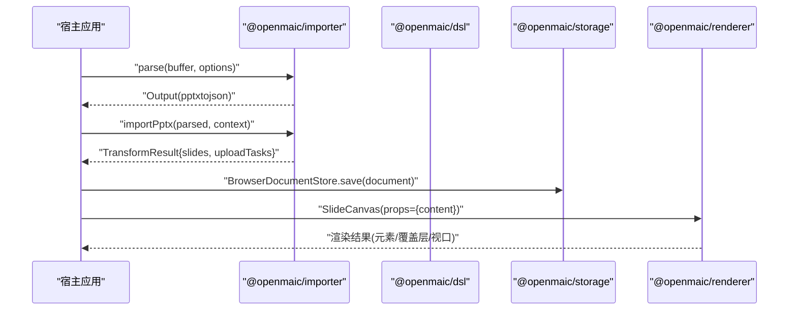
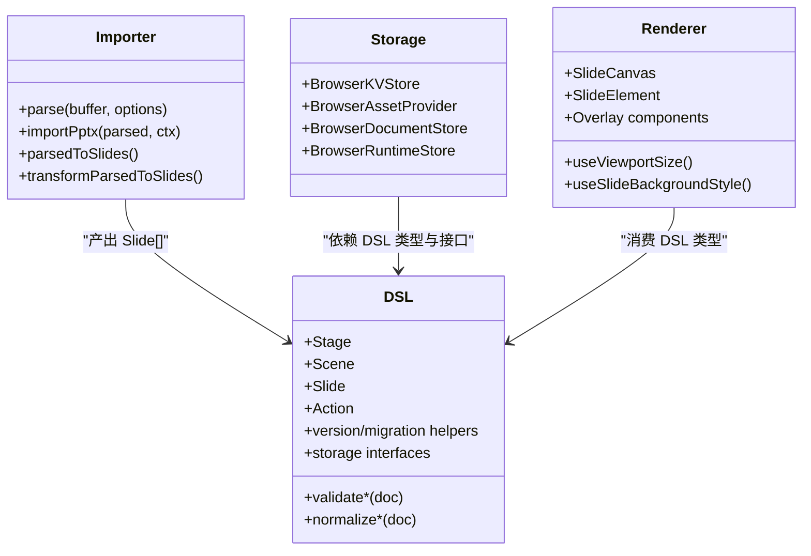

# SDK 参考文档

<cite>
**本文引用的文件**   
- [packages/@openmaic/dsl/src/index.ts](file://packages/@openmaic/dsl/src/index.ts)
- [packages/@openmaic/renderer/dist/index.d.ts](file://packages/@openmaic/renderer/dist/index.d.ts)
- [packages/@openmaic/importer/dist/index.d.ts](file://packages/@openmaic/importer/dist/index.d.ts)
- [packages/@openmaic/storage/dist/index.d.ts](file://packages/@openmaic/storage/dist/index.d.ts)
- [packages/@openmaic/importer/src/import-pipeline/types.ts](file://packages/@openmaic/importer/src/import-pipeline/types.ts)
- [components/slide-renderer/Editor/ScreenCanvas.tsx](file://components/slide-renderer/Editor/ScreenCanvas.tsx)
- [app/page.tsx](file://app/page.tsx)
- [eslint.config.mjs](file://eslint.config.mjs)
</cite>

## 产品概述
OpenMAIC SDK 是一套面向 AI 驱动的交互式课件（MAIC）的开发者工具集，围绕“DSL 定义—渲染—导入—存储”四大核心包构建，提供：
- 统一的课件数据契约与校验、规范化能力（@openmaic/dsl）
- 可插拔的前端渲染引擎与编辑辅助能力（@openmaic/renderer）
- PPTX/MAIC 导入流水线与转换（@openmaic/importer）
- 浏览器端持久化与文档/运行时存储抽象（@openmaic/storage）

目标用户包括课件编辑器、课堂互动平台、内容生成与回放系统。核心价值在于以强类型 DSL 为契约，打通从生成、导入、渲染到持久化的全链路，确保跨模块一致性与可演进性。

适用场景：
- 通过自然语言或模板生成结构化课件
- 将现有 PPTX 快速迁移为 MAIC 并在线编辑/播放
- 在浏览器中稳定渲染与交互课件
- 在本地/云端进行课件与媒体资源的持久化管理

## 核心业务流程
- 课件生成与编辑：应用层基于 @openmaic/dsl 的数据模型组织 Stage/Scene/Slide，使用 @openmaic/renderer 进行渲染与交互，并通过 @openmaic/storage 持久化文档与资源。
- 导入流程：使用 @openmaic/importer 解析 .pptx 为中间格式，再经 import-pipeline 转换为 @openmaic/dsl 的 Slide 集合，上传媒体资源后得到可渲染的课件。
- 播放与回放：@openmaic/renderer 消费 @openmaic/dsl 的 SceneContent，结合视口与背景样式等 Hook，完成元素布局与动画叠加。

**图表来源** 
- [packages/@openmaic/importer/dist/index.d.ts:1-30](file://packages/@openmaic/importer/dist/index.d.ts#L1-L30)
- [packages/@openmaic/storage/dist/index.d.ts:1-26](file://packages/@openmaic/storage/dist/index.d.ts#L1-L26)
- [packages/@openmaic/renderer/dist/index.d.ts:1-10](file://packages/@openmaic/renderer/dist/index.d.ts#L1-L10)

**章节来源**
- [packages/@openmaic/importer/dist/index.d.ts:1-30](file://packages/@openmaic/importer/dist/index.d.ts#L1-L30)
- [packages/@openmaic/storage/dist/index.d.ts:1-26](file://packages/@openmaic/storage/dist/index.d.ts#L1-L26)
- [packages/@openmaic/renderer/dist/index.d.ts:1-10](file://packages/@openmaic/renderer/dist/index.d.ts#L1-L10)

## 功能模块清单
- @openmaic/dsl
  - 职责：定义课件 DSL 契约（Stage/Scene/Slide/Action 等）、校验器、规范化函数、版本与迁移工具、存储抽象接口。
  - 验收要点：零依赖、纯类型与纯函数；导出 guards/validate/normalize/version/runtime/storage 等能力。
- @openmaic/renderer
  - 职责：React 组件与 Hooks，负责幻灯片画布、元素渲染、覆盖层（高亮/聚光/激光）、视口尺寸计算、背景样式等。
  - 验收要点：仅依赖 @openmaic/dsl；通过 props/callbacks 注入宿主关注点；提供稳定的导出 API。
- @openmaic/importer
  - 职责：解析 .pptx 为中间 JSON，再通过 import-pipeline 转换为 @openmaic/dsl 的 Slide 集合，支持媒体上传任务编排。
  - 验收要点：提供 parse/importPptx/parsedToSlides/transformParsedToSlides 等入口；明确 ImportContext 与 TransformResult。
- @openmaic/storage
  - 职责：KV/资产/文档/运行时存储抽象与浏览器实现；Zustand 持久化桥接；文档聚合读写与迁移。
  - 验收要点：仅依赖 @openmaic/dsl；提供 BrowserKVStore/BrowserAssetProvider/BrowserDocumentStore/BrowserRuntimeStore 等。

**章节来源**
- [packages/@openmaic/dsl/src/index.ts:1-35](file://packages/@openmaic/dsl/src/index.ts#L1-L35)
- [packages/@openmaic/renderer/dist/index.d.ts:1-10](file://packages/@openmaic/renderer/dist/index.d.ts#L1-L10)
- [packages/@openmaic/importer/dist/index.d.ts:1-30](file://packages/@openmaic/importer/dist/index.d.ts#L1-L30)
- [packages/@openmaic/storage/dist/index.d.ts:1-26](file://packages/@openmaic/storage/dist/index.d.ts#L1-L26)

## 数据与状态
- DSL 数据模型
  - Stage/Scene/Slide/Action 等由 @openmaic/dsl 统一定义，作为各包的通用契约。
  - 校验与规范化：validate* 报告文档问题；normalize* 修复默认值与几何信息，保证输入满足约束。
- 导入上下文与结果
  - ImportContext：包含比例、视口宽度、主题、形状池、媒体上传与视频首帧提取等回调。
  - TransformResult：返回 slides 与 uploadTasks 数组，供宿主异步处理资源上传。
- 渲染状态
  - ScreenCanvas 读取 SceneContent.canvas.elements 与 background，结合 useViewportSize/useSlideBackgroundStyle 计算布局与样式。
- 存储状态
  - DocumentStore/SceneValidator 等抽象由 @openmaic/storage 暴露，BrowserDocumentStore 提供浏览器端实现，支持读取时迁移与校验门控。

**图表来源** 
- [packages/@openmaic/dsl/src/index.ts:1-35](file://packages/@openmaic/dsl/src/index.ts#L1-L35)
- [packages/@openmaic/importer/dist/index.d.ts:1-30](file://packages/@openmaic/importer/dist/index.d.ts#L1-L30)
- [packages/@openmaic/storage/dist/index.d.ts:1-26](file://packages/@openmaic/storage/dist/index.d.ts#L1-L26)
- [packages/@openmaic/renderer/dist/index.d.ts:1-10](file://packages/@openmaic/renderer/dist/index.d.ts#L1-L10)

**章节来源**
- [packages/@openmaic/importer/src/import-pipeline/types.ts:1-20](file://packages/@openmaic/importer/src/import-pipeline/types.ts#L1-L20)
- [components/slide-renderer/Editor/ScreenCanvas.tsx:1-32](file://components/slide-renderer/Editor/ScreenCanvas.tsx#L1-L32)

## 关键约束与边界
- 包间依赖边界
  - @openmaic/dsl：无运行时依赖，仅导出类型与纯函数。
  - @openmaic/renderer：仅依赖 @openmaic/dsl；禁止引用宿主路径别名（@/…），通过 props/callbacks 注入宿主逻辑。
  - @openmaic/importer：依赖 @openmaic/dsl；提供导入流水线与适配器。
  - @openmaic/storage：仅依赖 @openmaic/dsl；保持与应用无关的持久化能力。
- ESLint 规则保障
  - renderer 与 storage 包内禁止出现 @/… 字符串常量，避免反向依赖宿主。
- 安装与配置建议
  - 通过包管理器安装四个包；在宿主应用中按需引入 DSL 类型、渲染组件、导入方法与存储后端。
  - 导入流程需准备 ImportContext（含媒体上传回调），并在 transform 完成后处理 uploadTasks。
  - 存储层选择 BrowserDocumentStore/BrowserRuntimeStore，并结合 Zustand 持久化桥接。
- 错误处理与调试
  - 使用 validate* 对文档进行校验，定位结构问题；normalize* 用于修复默认值与几何信息。
  - 导入阶段可通过 mockContext 与日志输出跟踪转换过程；媒体上传失败应回滚或重试。
  - 渲染阶段利用 useViewportSize 与覆盖层组件进行可视化调试。
- 性能优化与最佳实践
  - 大文档分片加载与懒渲染；合理使用 React.memo 与 useMemo。
  - 媒体资源采用 blob URL（开发）或 base64（便携）模式权衡体积与兼容性。
  - 存储层批量写入与增量更新，避免频繁重算。
- 版本兼容与升级
  - 遵循 @openmaic/dsl 的版本与迁移工具；升级前运行 normalize* 与 validate* 确保一致性。
  - 废弃 API 迁移：优先使用新版导出（如 importPptx/transformParsedToSlides），旧方法逐步替换。

**章节来源**
- [eslint.config.mjs:84-111](file://eslint.config.mjs#L84-L111)
- [packages/@openmaic/dsl/src/index.ts:1-35](file://packages/@openmaic/dsl/src/index.ts#L1-L35)
- [packages/@openmaic/importer/dist/index.d.ts:1-30](file://packages/@openmaic/importer/dist/index.d.ts#L1-L30)
- [packages/@openmaic/storage/dist/index.d.ts:1-26](file://packages/@openmaic/storage/dist/index.d.ts#L1-L26)
- [packages/@openmaic/renderer/dist/index.d.ts:1-10](file://packages/@openmaic/renderer/dist/index.d.ts#L1-L10)