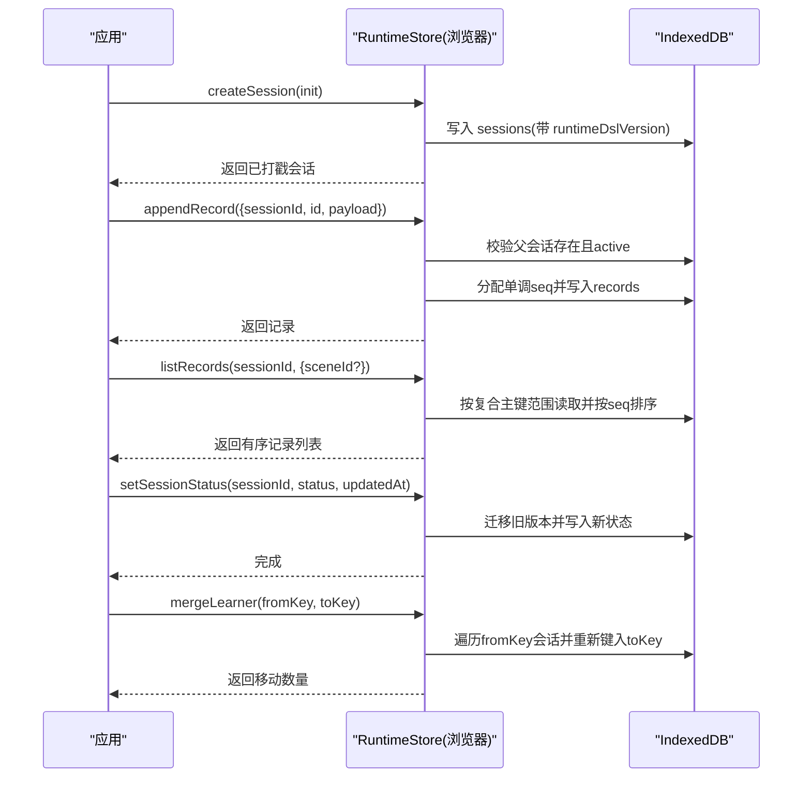
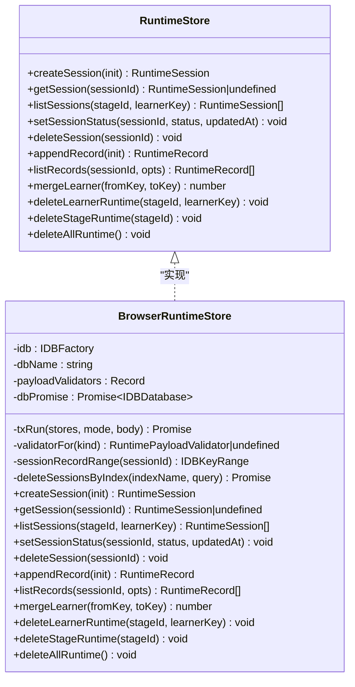
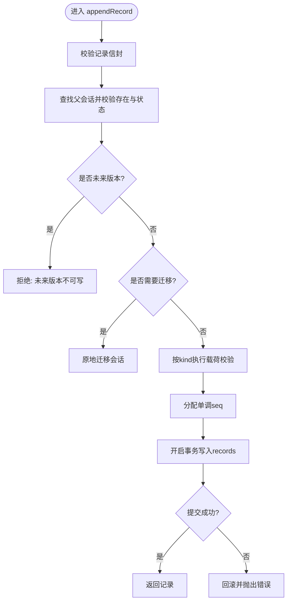

# 存储层扩展开发

<cite>
**本文引用的文件**
- [packages/@openmaic/storage/README.md](file://packages/@openmaic/storage/README.md)
- [packages/@openmaic/storage/src/runtime/types.ts](file://packages/@openmaic/storage/src/runtime/types.ts)
- [packages/@openmaic/storage/src/runtime/browser.ts](file://packages/@openmaic/storage/src/runtime/browser.ts)
- [packages/@openmaic/storage/test/runtime-reference-server.test.ts](file://packages/@openmaic/storage/test/runtime-reference-server.test.ts)
</cite>

## 产品概述
OpenMAIC 的存储层以“可插拔后端”为核心设计，将 DSL 定义的“持久化什么”与存储层的“在哪里/如何持久化”解耦。当前包提供 KVStore、StorageProvider（资产）、DocumentStore（文档聚合）和 RuntimeStore（运行时会话与追加记录）等抽象，并给出浏览器端 IndexedDB 实现。通过统一的契约测试套件保证不同后端行为一致，为后续 HTTP 后端、云存储或混合存储扩展奠定基础。

- 目标用户：需要扩展 OpenMAIC 存储能力的前端/全栈开发者
- 核心价值：统一存储接口、强一致性语义、版本迁移与校验门控、可替换后端
- 适用场景：本地 IndexedDB、云端数据库、跨设备同步、离线优先与冲突解决

**章节来源**
- [packages/@openmaic/storage/README.md:1-97](file://packages/@openmaic/storage/README.md#L1-L97)

## 核心业务流程
围绕 RuntimeStore 的典型流程包括：创建会话、追加记录、列出记录、状态更新、学习者合并与级联删除。所有写操作均受版本线约束与载荷校验门控保护；读操作在读取时进行向前迁移，确保多客户端版本漂移下的安全。

**图表来源**
- [packages/@openmaic/storage/src/runtime/browser.ts:220-437](file://packages/@openmaic/storage/src/runtime/browser.ts#L220-L437)
- [packages/@openmaic/storage/src/runtime/types.ts:63-161](file://packages/@openmaic/storage/src/runtime/types.ts#L63-L161)

**章节来源**
- [packages/@openmaic/storage/src/runtime/browser.ts:220-437](file://packages/@openmaic/storage/src/runtime/browser.ts#L220-L437)
- [packages/@openmaic/storage/src/runtime/types.ts:63-161](file://packages/@openmaic/storage/src/runtime/types.ts#L63-L161)

## 功能模块清单
- KVStore：设备/账户作用域的轻量值存储，支持 zustand persist 适配
- StorageProvider：内容寻址的资产存取（sha256 引用），渲染时解析 URL
- DocumentStore：DSL 文档聚合的规范化存储与读取重组，支持 scene 泛型与验证门控
- RuntimeStore：按 (stageId, learnerKey) 分区的会话与追加记录，版本线、载荷校验、合并与级联删除

验收要点
- 所有后端通过同一契约测试套件（KV/Asset/Document/Runtime）
- 读写路径具备版本迁移与校验门控
- 分区查询与幂等删除满足业务边界

**章节来源**
- [packages/@openmaic/storage/README.md:23-72](file://packages/@openmaic/storage/README.md#L23-L72)
- [packages/@openmaic/storage/README.md:74-80](file://packages/@openmaic/storage/README.md#L74-L80)

## 数据与状态
- 会话模型：包含身份、生命周期与运行时 DSL 版本戳；由存储层在创建时打戳
- 记录模型：追加事实，按会话内单调 seq 排序；payload 按 kind 校验
- 索引设计：sessions 表含 by-stage-learner、by-learner、by-stage 索引；records 使用复合主键 [sessionId, seq] 保障顺序
- 状态流转：会话从 active 到结束态；append 仅允许 active 会话；mergeLearner 跨阶段重键

**图表来源**
- [packages/@openmaic/storage/src/runtime/types.ts:63-161](file://packages/@openmaic/storage/src/runtime/types.ts#L63-L161)
- [packages/@openmaic/storage/src/runtime/browser.ts:137-471](file://packages/@openmaic/storage/src/runtime/browser.ts#L137-L471)

**章节来源**
- [packages/@openmaic/storage/src/runtime/types.ts:63-161](file://packages/@openmaic/storage/src/runtime/types.ts#L63-L161)
- [packages/@openmaic/storage/src/runtime/browser.ts:137-471](file://packages/@openmaic/storage/src/runtime/browser.ts#L137-L471)

## 关键约束与边界
- 版本线与迁移
  - 会话“出生即打戳”，读路径执行向前迁移；写路径拒绝未来版本（避免降级）
  - 记录不独立版本化，版本跟随父会话
- 分区与列举
  - 所有列举按 (stageId, learnerKey) 分区，无全局列举；唯一跨阶段操作是 mergeLearner
- 数据完整性
  - 写前校验完整信封；记录载荷按 kind 门控；异常“失败即报错”
- 事务与原子性
  - 多对象存储事务在提交时生效；失败回滚，保证原子性
- 删除与幂等
  - deleteSession、deleteLearnerRuntime、deleteStageRuntime、deleteAllRuntime 均为幂等

**章节来源**
- [packages/@openmaic/storage/src/runtime/types.ts:14-24](file://packages/@openmaic/storage/src/runtime/types.ts#L14-L24)
- [packages/@openmaic/storage/src/runtime/browser.ts:100-122](file://packages/@openmaic/storage/src/runtime/browser.ts#L100-L122)
- [packages/@openmaic/storage/src/runtime/browser.ts:186-213](file://packages/@openmaic/storage/src/runtime/browser.ts#L186-L213)
- [packages/@openmaic/storage/src/runtime/browser.ts:314-321](file://packages/@openmaic/storage/src/runtime/browser.ts#L314-L321)
- [packages/@openmaic/storage/src/runtime/browser.ts:439-452](file://packages/@openmaic/storage/src/runtime/browser.ts#L439-L452)

## 扩展 IndexedDB 存储后端的指南

### 1. 明确抽象接口与职责边界
- 实现 RuntimeStore 接口，遵循“读迁移、写校验、分区列举、幂等删除”的约定
- 若需扩展 DocumentStore/KVStore/StorageProvider，保持与 DSL 类型与校验器一致

**章节来源**
- [packages/@openmaic/storage/src/runtime/types.ts:63-161](file://packages/@openmaic/storage/src/runtime/types.ts#L63-L161)
- [packages/@openmaic/storage/README.md:23-72](file://packages/@openmaic/storage/README.md#L23-L72)

### 2. 数据模型与索引设计
- sessions 表：keyPath=id；索引 by-stage-learner、by-learner、by-stage
- records 表：复合主键 [sessionId, seq]，天然有序
- 可选：为高频查询字段建立二级索引（如 sceneId 过滤）

**章节来源**
- [packages/@openmaic/storage/src/runtime/browser.ts:154-171](file://packages/@openmaic/storage/src/runtime/browser.ts#L154-L171)
- [packages/@openmaic/storage/src/runtime/browser.ts:380-390](file://packages/@openmaic/storage/src/runtime/browser.ts#L380-L390)

### 3. 数据迁移策略
- 读路径：对旧版本会话执行 migrateRuntime 向前迁移
- 写路径：遇到旧版本会话先原地迁移再写入，避免遗留未迁移兄弟记录
- 未来版本保护：拒绝修改由新版本客户端写入的数据

**章节来源**
- [packages/@openmaic/storage/src/runtime/browser.ts:125-130](file://packages/@openmaic/storage/src/runtime/browser.ts#L125-L130)
- [packages/@openmaic/storage/src/runtime/browser.ts:302-311](file://packages/@openmaic/storage/src/runtime/browser.ts#L302-L311)
- [packages/@openmaic/storage/src/runtime/browser.ts:340-347](file://packages/@openmaic/storage/src/runtime/browser.ts#L340-L347)

### 4. 数据同步机制与实时方案
- 本地优先：基于 IndexedDB 的追加记录与单调 seq 作为回放顺序键
- 离线支持：离线写入队列，网络恢复后批量同步；利用幂等与去重键避免重复
- 实时同步：服务端事件驱动（如 WebSocket），客户端按 seq 合并；冲突采用“最后写入获胜(LWW)”或“操作转换(OT)/CRDT”策略
- 一致性保证：会话状态变更与记录追加在同一事务中；跨设备通过版本号与水印位点协调

**章节来源**
- [packages/@openmaic/storage/src/runtime/types.ts:18-24](file://packages/@openmaic/storage/src/runtime/types.ts#L18-L24)
- [packages/@openmaic/storage/src/runtime/browser.ts:323-378](file://packages/@openmaic/storage/src/runtime/browser.ts#L323-L378)

### 5. 备份恢复与冲突解决
- 备份：导出 sessions 与 records 快照（含 runtimeDslVersion），保留原始结构以便恢复
- 恢复：导入时执行版本迁移与校验；冲突检测依赖会话状态与 seq 水位
- 冲突解决：同会话追加记录按 seq 顺序合并；跨会话冲突通过业务规则（如合并策略）处理

**章节来源**
- [packages/@openmaic/storage/src/runtime/browser.ts:220-239](file://packages/@openmaic/storage/src/runtime/browser.ts#L220-L239)
- [packages/@openmaic/storage/src/runtime/browser.ts:380-390](file://packages/@openmaic/storage/src/runtime/browser.ts#L380-L390)

### 6. 自定义存储后端示例（本地/云/混合）
- 本地存储：直接复用 BrowserRuntimeStore 的 IndexedDB 模式
- 云存储：实现 HTTP 后端，封装 REST/GraphQL，保持与 RuntimeStore 一致的语义
- 混合存储：本地缓存 + 云端权威源；读优先本地，写落本地并异步同步；冲突以服务端为准

提示：参考现有契约测试套件，确保新后端与浏览器端行为等价。

**章节来源**
- [packages/@openmaic/storage/README.md:74-80](file://packages/@openmaic/storage/README.md#L74-L80)

### 7. 性能优化与缓存策略
- 索引优化：使用复合主键与必要二级索引减少扫描
- 批量写入：合并小写为大事务，降低 IO 次数
- 懒加载：按需读取大 payload，避免一次性载入全部记录
- 内存缓存：热点会话与最近记录做 LRU 缓存，注意失效与一致性

**章节来源**
- [packages/@openmaic/storage/src/runtime/browser.ts:186-213](file://packages/@openmaic/storage/src/runtime/browser.ts#L186-L213)
- [packages/@openmaic/storage/src/runtime/browser.ts:380-390](file://packages/@openmaic/storage/src/runtime/browser.ts#L380-L390)

### 8. 数据安全、加密与访问控制
- 传输安全：HTTP 后端强制 TLS；鉴权与授权在网关层实施
- 存储安全：敏感字段本地加密（密钥管理由宿主应用负责）
- 访问控制：基于 learnerKey 的分区隔离；mergeLearner 需授权校验

**章节来源**
- [packages/@openmaic/storage/test/runtime-reference-server.test.ts:672-711](file://packages/@openmaic/storage/test/runtime-reference-server.test.ts#L672-L711)
- [packages/@openmaic/storage/src/runtime/types.ts:130-148](file://packages/@openmaic/storage/src/runtime/types.ts#L130-L148)

## 附录：关键流程图与错误处理

### 追加记录流程与校验门控

**图表来源**
- [packages/@openmaic/storage/src/runtime/browser.ts:323-378](file://packages/@openmaic/storage/src/runtime/browser.ts#L323-L378)

**章节来源**
- [packages/@openmaic/storage/src/runtime/browser.ts:323-378](file://packages/@openmaic/storage/src/runtime/browser.ts#L323-L378)

### 并发与权限检查（参考测试）
- 删除前再次校验所有权，防止并发合并导致的竞态
- 未找到会话返回 404 并附带错误码

**章节来源**
- [packages/@openmaic/storage/test/runtime-reference-server.test.ts:780-816](file://packages/@openmaic/storage/test/runtime-reference-server.test.ts#L780-L816)

## 结论
通过统一的 RuntimeStore 抽象与严格的版本线、校验门控与事务语义，OpenMAIC 的存储层既保证了本地 IndexedDB 的高性能与离线能力，也为 HTTP/云/混合后端提供了清晰的扩展点。遵循本文档的设计与约束，可实现可靠的实时同步、离线优先与一致性的数据体验。