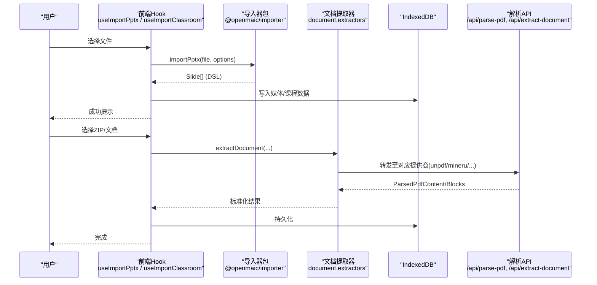
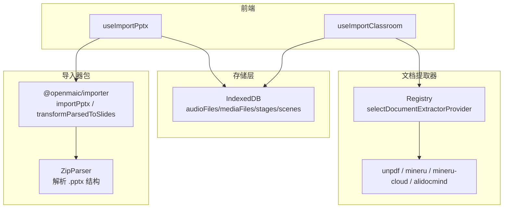
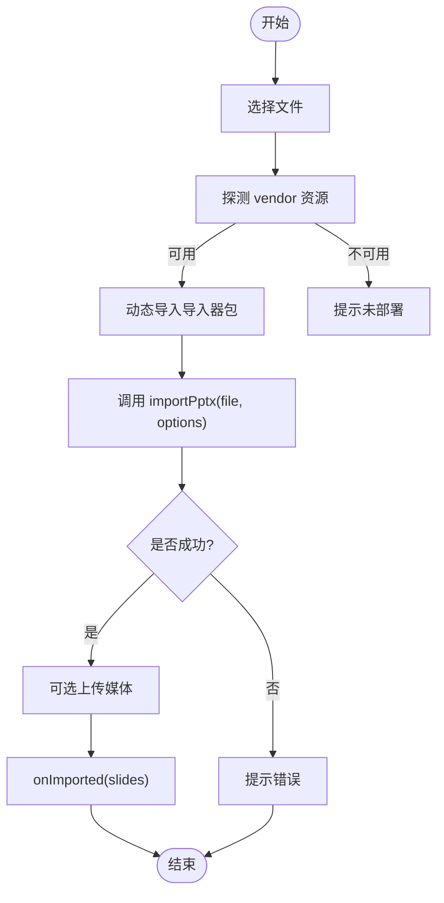
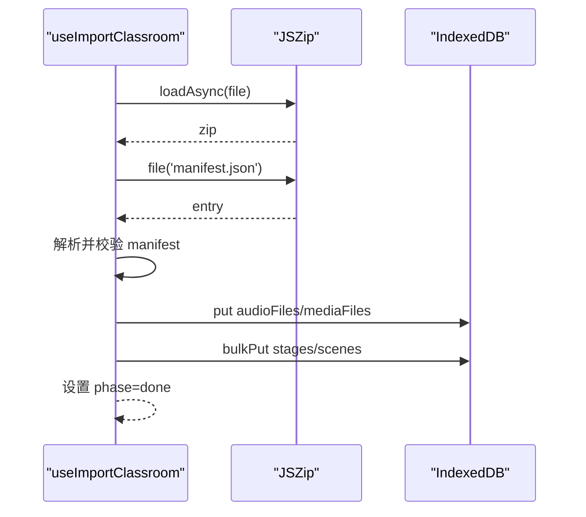
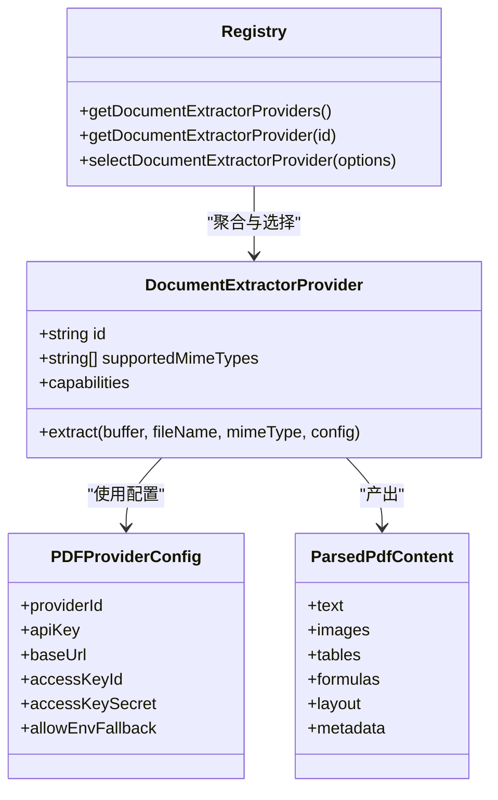
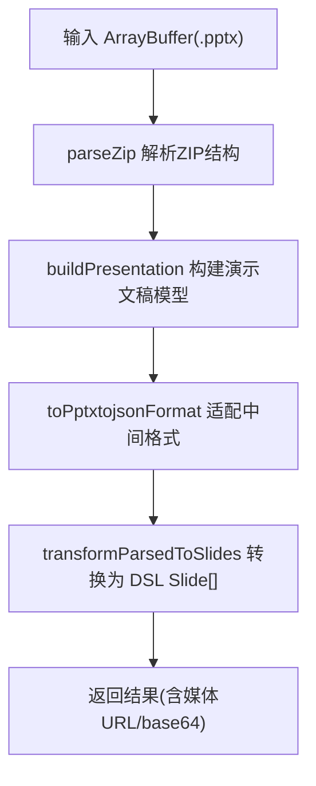
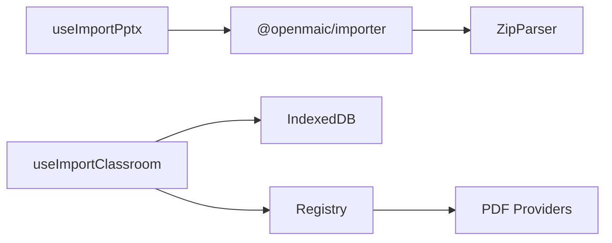

# 导入器扩展开发

<cite>
**本文引用的文件**   
- [use-import-pptx.ts](file://lib/import/use-import-pptx.ts)
- [use-import-classroom.ts](file://lib/import/use-import-classroom.ts)
- [index.d.ts](file://packages/@openmaic/importer/dist/index.d.ts)
- [types.d.ts](file://packages/@openmaic/importer/dist/import-pipeline/types.d.ts)
- [ZipParser.ts](file://packages/@openmaic/importer/src/parser/ZipParser.ts)
- [README.md](file://lib/pdf/README.md)
- [types.ts](file://lib/pdf/types.ts)
- [pdf.ts](file://lib/types/pdf.ts)
- [registry.ts](file://lib/document/extractors/registry.ts)
- [index.ts](file://lib/document/index.ts)
- [extract-document-route.test.ts](file://tests/document/extract-document-route.test.ts)
</cite>

## 产品概述
OpenMAIC 的导入器子系统负责将外部课件与文档（如 PPTX、PDF、HTML、TXT/Markdown、课堂 ZIP 包等）解析并转换为 OpenMAIC 内部 DSL（Slide/Scene/Stage），以便在编辑器与播放器中统一渲染与交互。本指南面向希望为 OpenMAIC 新增导入器扩展的开发者，系统阐述：
- 导入器的注册机制与文件类型检测
- 解析流程与数据提取、格式转换、DSL 映射
- 错误处理、进度反馈与批量导入支持
- 性能优化、大文件处理与内存管理策略
- 与存储层集成与数据校验机制
- 自定义导入器完整示例（以 PPTX、PDF、HTML 为例）

## 核心业务流程
- 用户选择文件 → 前端 Hook 触发导入流程 → 调用预构建导入器或文档提取服务 → 解析与转换 → 写入 IndexedDB/媒体库 → 回调通知完成
- 关键节点：
  - 文件类型检测与 MIME 判定
  - 解析器选择（本地/云端提供商）
  - 内容提取与结构映射（到 DSL）
  - 媒体资源上传与引用重写
  - 持久化与校验

图表来源
- [use-import-pptx.ts](file://lib/import/use-import-pptx.ts)
- [use-import-classroom.ts](file://lib/import/use-import-classroom.ts)
- [index.d.ts](file://packages/@openmaic/importer/dist/index.d.ts)
- [registry.ts](file://lib/document/extractors/registry.ts)
- [index.ts](file://lib/document/index.ts)

章节来源
- [use-import-pptx.ts](file://lib/import/use-import-pptx.ts)
- [use-import-classroom.ts](file://lib/import/use-import-classroom.ts)
- [index.d.ts](file://packages/@openmaic/importer/dist/index.d.ts)
- [registry.ts](file://lib/document/extractors/registry.ts)
- [index.ts](file://lib/document/index.ts)

## 功能模块清单
- PPTX 导入 Hook
  - 职责：触发文件选择、动态加载预构建导入器、调用 importPptx、上传媒体、回调 DSL
  - 验收要点：成功返回 Slide[]；失败给出明确错误；支持可选 OSS 上传
- 课堂 ZIP 导入 Hook
  - 职责：解析 manifest.json、写入音频/图片/视频到 IndexedDB、重写引用、生成 Stage/Agent/Scenes
  - 验收要点：大小限制与配额异常处理；阶段状态推进；ID 重写正确
- 文档提取器注册表
  - 职责：按 MIME 与能力选择解析提供商；暴露统一接口 extractDocument
  - 验收要点：支持 plain-text/unpdf/mineru/mineru-cloud/alidocmind；MIME 匹配与能力过滤
- PDF 解析系统
  - 职责：统一抽象多种提供商；定义响应结构与配置；提供调试与最佳实践
  - 验收要点：返回 ParsedPdfContent；imageMapping 与 pdfImages 可用；可切换提供商
- 导入器包导出
  - 职责：对外暴露 parse/importPptx/parsedToSlides/transformParsedToSlides 等
  - 验收要点：类型完备；mediaMode 控制 base64/blob；尺寸单位 pt

章节来源
- [use-import-pptx.ts](file://lib/import/use-import-pptx.ts)
- [use-import-classroom.ts](file://lib/import/use-import-classroom.ts)
- [index.d.ts](file://packages/@openmaic/importer/dist/index.d.ts)
- [types.d.ts](file://packages/@openmaic/importer/dist/import-pipeline/types.d.ts)
- [registry.ts](file://lib/document/extractors/registry.ts)
- [index.ts](file://lib/document/index.ts)
- [README.md](file://lib/pdf/README.md)

## 数据与状态
- 核心数据模型
  - Slide/Scene/Stage：DSL 中的幻灯片、场景、舞台实体
  - MediaFileRecord/AudioFileRecord/GeneratedAgentRecord：IndexedDB 中的媒体与代理记录
  - ParsedPdfContent：PDF 解析产物（文本、图片、表格、公式、布局、元信息）
  - ImportContext：导入上下文（比例、主题、形状池、上传函数、首帧提取）
- 关键状态流转
  - 导入阶段：idle → parsing → validating → writingMedia → writingCourse → done
  - 媒体上传：base64 内联或 blob URL；可选上传至 OSS 后替换引用
- 数据所有权边界
  - 前端持有临时 Blob URL；生产环境建议上传至对象存储并持久化引用
  - IndexedDB 仅用于浏览器端缓存与离线使用

章节来源
- [use-import-classroom.ts](file://lib/import/use-import-classroom.ts)
- [types.d.ts](file://packages/@openmaic/importer/dist/import-pipeline/types.d.ts)
- [pdf.ts](file://lib/types/pdf.ts)
- [types.ts](file://lib/pdf/types.ts)

## 关键约束与边界
- 文件大小与配额
  - ZIP 导入对超大文件进行警告；IndexedDB 容量不足抛出 QuotaExceededError
  - 文档提取路由对单文件上限进行拦截（例如 50MB）
- 依赖与运行时
  - PPTX 导入通过动态 import('/vendor/maic-importer/index.js') 绕过打包器限制；部署需确保 vendor 资源存在
  - PDF 解析支持多提供商，需根据能力与配置选择
- 兼容性与回退
  - 未知提供商或 MIME 不支持时返回明确错误码
  - 当本地 MinerU 不可用时可回退到云端 MinerU Cloud

章节来源
- [use-import-classroom.ts](file://lib/import/use-import-classroom.ts)
- [extract-document-route.test.ts](file://tests/document/extract-document-route.test.ts)
- [use-import-pptx.ts](file://lib/import/use-import-pptx.ts)

## 架构总览
OpenMAIC 导入体系由“前端 Hook + 导入器包 + 文档提取器注册表 + 存储层”构成。PPTX 通过预构建包解析为 DSL；PDF/DOCX/TXT/MD 通过文档提取器统一抽象；课堂 ZIP 直接落地 IndexedDB 并重建 Stage/Agent/Scenes。

图表来源
- [use-import-pptx.ts](file://lib/import/use-import-pptx.ts)
- [use-import-classroom.ts](file://lib/import/use-import-classroom.ts)
- [index.d.ts](file://packages/@openmaic/importer/dist/index.d.ts)
- [ZipParser.ts](file://packages/@openmaic/importer/src/parser/ZipParser.ts)
- [registry.ts](file://lib/document/extractors/registry.ts)

## 详细组件分析

### PPTX 导入器（useImportPptx）
- 入口与流程
  - 触发文件选择 → 动态加载 /vendor/maic-importer/index.js → 调用 importPptx(file, { upload }) → 得到 Slide[] → 可选上传媒体 → onImported 回调
- 错误处理
  - 探测 vendor 资源可用性，若 404 则抛出明确错误
  - 捕获解析异常并提示无效 PPTX
- 媒体处理
  - 支持 base64 内联或 blob URL；可通过 upload 回调上传至 OSS 并回填 URL

图表来源
- [use-import-pptx.ts](file://lib/import/use-import-pptx.ts)
- [index.d.ts](file://packages/@openmaic/importer/dist/index.d.ts)

章节来源
- [use-import-pptx.ts](file://lib/import/use-import-pptx.ts)
- [index.d.ts](file://packages/@openmaic/importer/dist/index.d.ts)

### 课堂 ZIP 导入器（useImportClassroom）
- 流程
  - 解析 ZIP → 读取 manifest.json → 校验字段 → 生成新 ID（stage/agent/audio/media）→ 写入 IndexedDB（音频/媒体/课程）→ 重写音频引用 → 完成
- 状态推进
  - idle → parsing → validating → writingMedia → writingCourse → done
- 错误处理
  - 超大文件警告；QuotaExceededError 提示存储满；manifest 缺失或非法提示

图表来源
- [use-import-classroom.ts](file://lib/import/use-import-classroom.ts)

章节来源
- [use-import-classroom.ts](file://lib/import/use-import-classroom.ts)

### 文档提取器注册表与 PDF 解析
- 注册与选择
  - registry.ts 聚合 text 与 pdf 提供商；selectDocumentExtractorProvider 基于 MIME 与 requiredCapabilities 选择
- PDF 解析
  - README.md 定义了 ParsedPdfContent 结构与提供商差异；types.ts 定义配置与能力；pdf.ts 定义响应类型
- 路由与测试
  - extract-document-route.test.ts 验证 MIME 支持、大小限制、提供商回退等

图表来源
- [registry.ts](file://lib/document/extractors/registry.ts)
- [types.ts](file://lib/pdf/types.ts)
- [pdf.ts](file://lib/types/pdf.ts)

章节来源
- [registry.ts](file://lib/document/extractors/registry.ts)
- [README.md](file://lib/pdf/README.md)
- [types.ts](file://lib/pdf/types.ts)
- [pdf.ts](file://lib/types/pdf.ts)
- [extract-document-route.test.ts](file://tests/document/extract-document-route.test.ts)

### 导入器包与 ZipParser
- 包导出
  - index.d.ts 暴露 parse、importPptx、parsedToSlides、transformParsedToSlides 等；支持 mediaMode（base64/blob）
- ZipParser
  - 解析 .pptx 压缩包，分类 contentTypes、presentation、slides、themes、media、charts、notesSlides、embeddings 等

图表来源
- [index.d.ts](file://packages/@openmaic/importer/dist/index.d.ts)
- [ZipParser.ts](file://packages/@openmaic/importer/src/parser/ZipParser.ts)

章节来源
- [index.d.ts](file://packages/@openmaic/importer/dist/index.d.ts)
- [ZipParser.ts](file://packages/@openmaic/importer/src/parser/ZipParser.ts)

## 依赖分析
- 前端 Hook 依赖导入器包与 IndexedDB；文档提取器通过注册表选择具体提供商；PDF 解析可走本地 unpdf 或远程 MinerU/MinerU Cloud
- 潜在循环依赖：无；各模块职责清晰，通过类型与接口解耦

图表来源
- [use-import-pptx.ts](file://lib/import/use-import-pptx.ts)
- [use-import-classroom.ts](file://lib/import/use-import-classroom.ts)
- [registry.ts](file://lib/document/extractors/registry.ts)
- [index.d.ts](file://packages/@openmaic/importer/dist/index.d.ts)
- [ZipParser.ts](file://packages/@openmaic/importer/src/parser/ZipParser.ts)

章节来源
- [use-import-pptx.ts](file://lib/import/use-import-pptx.ts)
- [use-import-classroom.ts](file://lib/import/use-import-classroom.ts)
- [registry.ts](file://lib/document/extractors/registry.ts)
- [index.d.ts](file://packages/@openmaic/importer/dist/index.d.ts)
- [ZipParser.ts](file://packages/@openmaic/importer/src/parser/ZipParser.ts)

## 性能考虑
- 大文件处理
  - ZIP 导入对超过阈值进行警告；路由层对单文件大小限制提前拦截
  - PPTX 导入建议使用 blob URL 模式减少 JSON 体积；必要时上传媒体至 OSS
- 内存管理
  - 避免一次性加载全部媒体为 base64；优先流式处理与分块写入 IndexedDB
  - 使用 JSZip 按需读取条目，避免全量解压
- 并发与批处理
  - 批量写入 IndexedDB 使用 bulkPut；媒体上传可并行但需限流
  - PDF 解析可并发请求不同提供商（注意速率限制与配额）

章节来源
- [use-import-classroom.ts](file://lib/import/use-import-classroom.ts)
- [extract-document-route.test.ts](file://tests/document/extract-document-route.test.ts)
- [index.d.ts](file://packages/@openmaic/importer/dist/index.d.ts)

## 故障排查指南
- PPTX 导入失败
  - 检查 /vendor/maic-importer/index.js 是否部署；查看 HEAD 探测结果
  - 确认文件是否为有效 .pptx；查看日志与 toast 错误信息
- ZIP 导入失败
  - 检查 manifest.json 是否存在且字段完整；确认 IndexedDB 配额
  - 观察 phase 状态定位失败阶段
- PDF 解析失败
  - 确认提供商配置（baseUrl/apiKey）；检查网络连通性
  - 查看 ParsedPdfContent 结构与 imageMapping 是否正确传递

章节来源
- [use-import-pptx.ts](file://lib/import/use-import-pptx.ts)
- [use-import-classroom.ts](file://lib/import/use-import-classroom.ts)
- [README.md](file://lib/pdf/README.md)

## 结论
OpenMAIC 的导入器扩展体系以 Hook 驱动、包化解析、注册表选择为核心，结合 IndexedDB 与可选 OSS 上传，形成从文件到 DSL 的完整链路。开发者可按 MIME 与能力扩展新的文档提取器，或实现新的导入器包以支持更多格式（如 HTML）。遵循本文的流程、约束与优化建议，可快速构建稳定高效的导入器扩展。