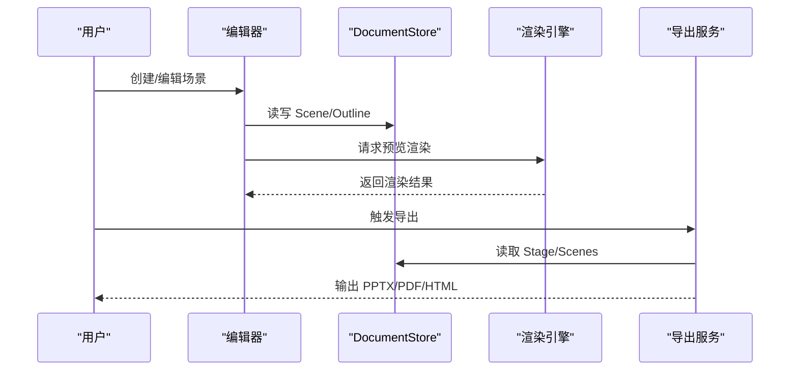
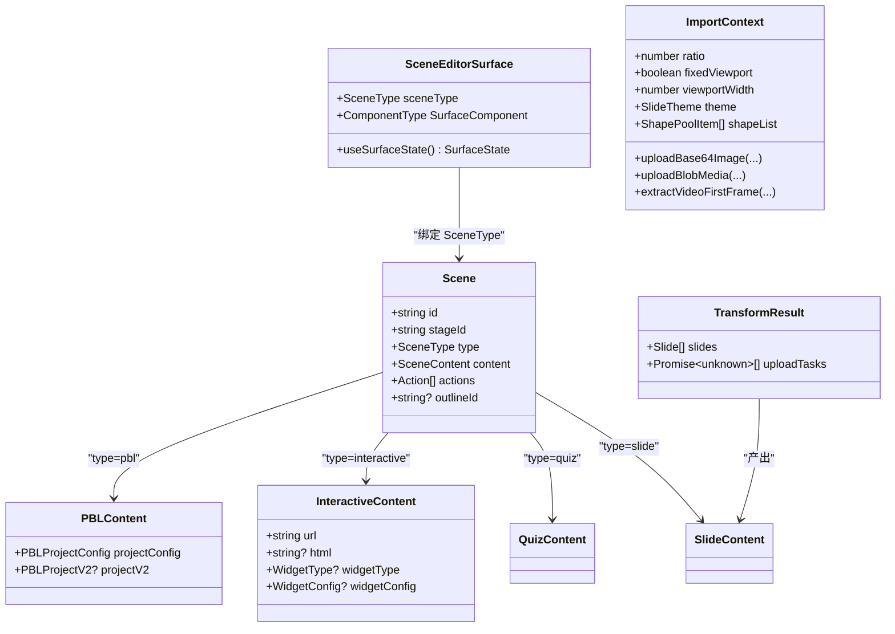
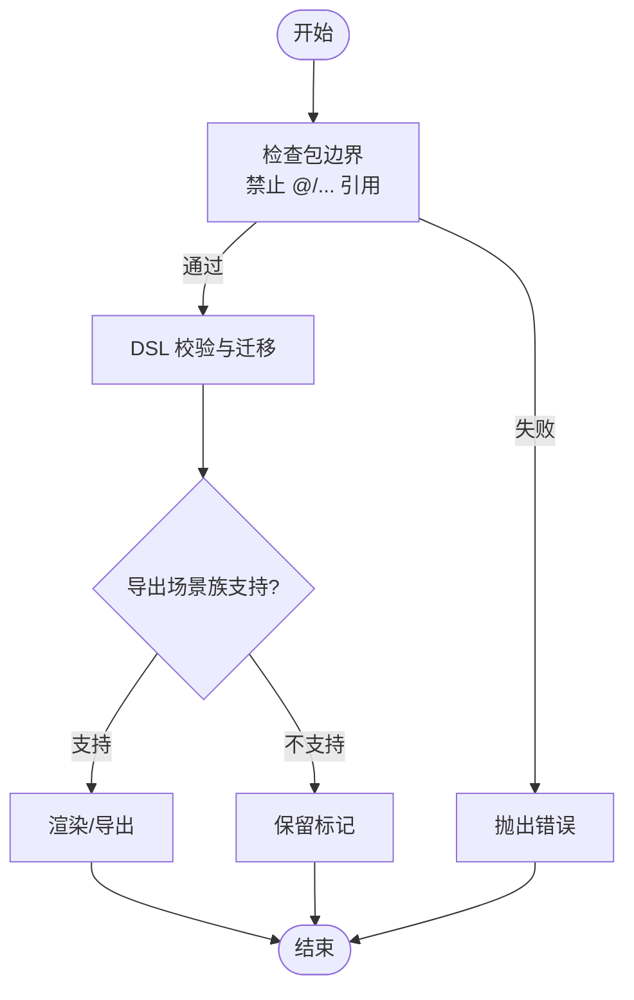
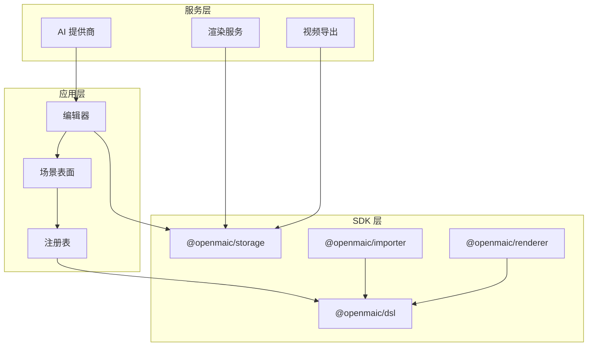

# 扩展开发

<cite>
**本文引用的文件**   
- [lib/types/stage.ts](file://lib/types/stage.ts)
- [lib/edit/scene-editor-surface.ts](file://lib/edit/scene-editor-surface.ts)
- [lib/edit/scene-editor-registry.ts](file://lib/edit/scene-editor-registry.ts)
- [components/edit/surfaces/quiz/register.ts](file://components/edit/surfaces/quiz/register.ts)
- [packages/@openmaic/importer/src/import-pipeline/types.ts](file://packages/@openmaic/importer/src/import-pipeline/types.ts)
- [packages/@openmaic/storage/README.md](file://packages/@openmaic/storage/README.md)
- [lib/ai/providers.ts](file://lib/ai/providers.ts)
- [render-service/src/main.ts](file://render-service/src/main.ts)
- [lib/video-export/compile.ts](file://lib/video-export/compile.ts)
- [components/scene-renderers/interactive-renderer.tsx](file://components/scene-renderers/interactive-renderer.tsx)
- [components/slide-renderer/ScreenCanvas.tsx](file://components/slide-renderer/ScreenCanvas.tsx)
- [lib/edit/content-validation.test.ts](file://tests/edit/content-validation.test.ts)
- [lib/edit/stage-mode.test.ts](file://tests/edit/stage-mode.test.ts)
- [README-zh.md](file://README-zh.md)
</cite>

## 产品概述
OpenMAIC 是一个 AI 驱动的交互式课件（MAIC）生成与课堂管理平台，支持通过自然语言生成结构化课件、课堂实时互动（问答/讨论/测验）、课件编辑与回放。其核心由 Next.js + React 前端、LangGraph + Vercel AI SDK 编排层以及自定义 DSL（@openmaic/dsl）构成。扩展点覆盖：
- 自定义插件与场景类型（幻灯片、测验、交互式 HTML、PBL）
- 扩展 DSL 定义与校验
- 新增渲染器与导入器
- OpenClaw Skill 集成与自定义 AI 提供商接入
- 存储与持久化策略（IndexedDB、内容寻址资源、运行时事件）

目标用户包括教育技术开发者、课程设计师与企业培训团队，核心价值在于“可插拔”的扩展能力与“AI 驱动”的高效内容生产。

**章节来源**
- [README-zh.md](file://README-zh.md)

## 核心业务流程
- 生成流程：用户输入主题或材料 → AI 编排生成大纲与场景 → 编辑器预览与微调 → 导出 PPTX/PDF/HTML
- 播放流程：按 Scene 顺序播放 Slide/Quiz/Interactive/PBL，结合 Action 驱动交互
- 导入流程：PPTX/MAIC 导入 → Transform 生成 Slide → 上传媒体 → 写入 DocumentStore
- 渲染流程：ScreenCanvas 渲染元素 → InteractiveRenderer 托管 iframe → 视频导出编译

**章节来源**
- [lib/types/stage.ts](file://lib/types/stage.ts)
- [packages/@openmaic/storage/README.md](file://packages/@openmaic/storage/README.md)
- [components/slide-renderer/ScreenCanvas.tsx](file://components/slide-renderer/ScreenCanvas.tsx)
- [components/scene-renderers/interactive-renderer.tsx](file://components/scene-renderers/interactive-renderer.tsx)
- [lib/video-export/compile.ts](file://lib/video-export/compile.ts)

## 功能模块清单
- 编辑器与场景表面注册
  - 职责：为不同 SceneType 提供 SurfaceComponent 与 useSurfaceState，统一注册到 sceneEditorRegistry
  - 验收要点：注册/解析/注销正确；HMR 安全；未注册类型返回 undefined
- 导入管线
  - 职责：ImportContext 提供比例、视口、主题、形状池与媒体上传能力；TransformResult 产出 slides 与异步任务
  - 验收要点：媒体上传成功；slides 结构符合 DSL；uploadTasks 完成无错误
- 存储与持久化
  - 职责：DocumentStore 规范化文档、版本迁移与校验；RuntimeStore 分区管理会话与追加记录
  - 验收要点：dslVersion/runtimeDslVersion 存在；append-only 有序 seq；跨阶段合并与级联删除
- AI 提供商配置
  - 职责：统一多提供商（OpenAI、Claude、Gemini、MiniMax、兼容 OpenAI 等）
  - 验收要点：环境变量配置有效；模型探测与验证通过
- 渲染与导出
  - 职责：ScreenCanvas 渲染元素；InteractiveRenderer 托管 iframe；导出编译处理不同场景族
  - 验收要点：渲染稳定；iframe 生命周期管理；导出对不支持场景族保留标记

**章节来源**
- [lib/edit/scene-editor-surface.ts](file://lib/edit/scene-editor-surface.ts)
- [lib/edit/scene-editor-registry.ts](file://lib/edit/scene-editor-registry.ts)
- [components/edit/surfaces/quiz/register.ts](file://components/edit/surfaces/quiz/register.ts)
- [packages/@openmaic/importer/src/import-pipeline/types.ts](file://packages/@openmaic/importer/src/import-pipeline/types.ts)
- [packages/@openmaic/storage/README.md](file://packages/@openmaic/storage/README.md)
- [lib/ai/providers.ts](file://lib/ai/providers.ts)
- [components/slide-renderer/ScreenCanvas.tsx](file://components/slide-renderer/ScreenCanvas.tsx)
- [components/scene-renderers/interactive-renderer.tsx](file://components/scene-renderers/interactive-renderer.tsx)
- [lib/video-export/compile.ts](file://lib/video-export/compile.ts)

## 数据与状态
- 场景类型与内容
  - AppSceneContent = SlideContent | QuizContent | InteractiveContent | PBLContent
  - Scene = DslScene<Action, SceneContent> 并附加 outlineId（稳定标识）
- 编辑器表面接口
  - SceneEditorSurface<TContent, TSelection>：包含 sceneType、SurfaceComponent、useSurfaceState
  - 注册表：register/unregister/resolve，HMR 安全且支持重复注册同一实例
- 导入上下文与结果
  - ImportContext：ratio、fixedViewport、viewportWidth、theme、shapeList、上传与提取方法
  - TransformResult：slides、uploadTasks
- 存储分层
  - DocumentStore：DSL 文档规范化、版本迁移、validateStage/validateScene 校验
  - RuntimeStore：stageId/learnerKey 分区、append-only 记录、seq 单调递增、mergeLearner/deleteLearnerRuntime/deleteStageRuntime

**图表来源**
- [lib/types/stage.ts](file://lib/types/stage.ts)
- [lib/edit/scene-editor-surface.ts](file://lib/edit/scene-editor-surface.ts)
- [packages/@openmaic/importer/src/import-pipeline/types.ts](file://packages/@openmaic/importer/src/import-pipeline/types.ts)

**章节来源**
- [lib/types/stage.ts](file://lib/types/stage.ts)
- [lib/edit/scene-editor-surface.ts](file://lib/edit/scene-editor-surface.ts)
- [packages/@openmaic/importer/src/import-pipeline/types.ts](file://packages/@openmaic/importer/src/import-pipeline/types.ts)
- [packages/@openmaic/storage/README.md](file://packages/@openmaic/storage/README.md)

## 关键约束与边界
- 包边界约束
  - @openmaic/renderer 与 @openmaic/storage 禁止引用宿主路径别名（@/…），仅依赖 @openmaic/dsl 与声明的对等依赖
  - ESLint 规则强制包内无宿主路径字符串，避免临时依赖穿透 API 边界
- 场景族导出限制
  - 视频导出编译器对 quiz/interactive/pbl 保留标记，不在此分支渲染，需交由其他渲染器处理
- 运行时稳定性
  - 交互式场景使用 keep-alive iframe 池，避免卸载导致重加载；可见性所有权 token 防止竞态
- 版本与校验
  - DocumentStore 在写时校验（validateStage/validateScene），读时执行 DSL 迁移；runtime 记录带 runtimeDslVersion 出生戳
- 错误处理与调试
  - 注册表在开发环境对重复注册不同实例发出警告；测试覆盖注册/解析/注销行为

**图表来源**
- [eslint.config.mjs](file://eslint.config.mjs)
- [lib/video-export/compile.ts](file://lib/video-export/compile.ts)
- [components/scene-renderers/interactive-renderer.tsx](file://components/scene-renderers/interactive-renderer.tsx)
- [packages/@openmaic/storage/README.md](file://packages/@openmaic/storage/README.md)

**章节来源**
- [eslint.config.mjs](file://eslint.config.mjs)
- [lib/video-export/compile.ts](file://lib/video-export/compile.ts)
- [components/scene-renderers/interactive-renderer.tsx](file://components/scene-renderers/interactive-renderer.tsx)
- [packages/@openmaic/storage/README.md](file://packages/@openmaic/storage/README.md)
- [lib/edit/stage-mode.test.ts](file://tests/edit/stage-mode.test.ts)

## 扩展点与最佳实践
- 自定义场景类型与编辑器表面
  - 实现 SceneEditorSurface，注册到 sceneEditorRegistry；确保 useSurfaceState 返回 selection/history/commands 等槽贡献
  - 示例参考 quiz 表面的 register.ts 侧效应注册模式
- 扩展 DSL 定义
  - 在 app 层扩展 SceneContent union（如 interactive/pbl），保持与 @openmaic/dsl 的契约兼容
  - 使用 validateStage/validateScene 进行写时校验，避免 schema drift
- 新增渲染器
  - ScreenCanvas 负责元素渲染；InteractiveRenderer 托管 iframe 生命周期
  - 遵循包边界约束，避免直接引用宿主路径
- 新增导入器
  - 实现 ImportContext 与 TransformResult；上传媒体与生成 slides
  - 确保 uploadTasks 完成后再提交最终文档
- AI 提供商集成
  - 通过 lib/ai/providers.ts 统一配置；遵循 Vercel AI SDK 规范
- 存储策略
  - 使用 DocumentStore 规范化文档与版本迁移；RuntimeStore 管理会话与追加记录
- 打包与分发
  - 将扩展封装为独立包（如 @openmaic/*），遵守 ESLint 边界规则；通过 pnpm workspace 管理依赖
- 生命周期与错误处理
  - 注册表 HMR 安全；开发环境警告重复注册；运行时错误通过 store 校验与日志定位

**章节来源**
- [lib/edit/scene-editor-surface.ts](file://lib/edit/scene-editor-surface.ts)
- [lib/edit/scene-editor-registry.ts](file://lib/edit/scene-editor-registry.ts)
- [components/edit/surfaces/quiz/register.ts](file://components/edit/surfaces/quiz/register.ts)
- [lib/types/stage.ts](file://lib/types/stage.ts)
- [components/slide-renderer/ScreenCanvas.tsx](file://components/slide-renderer/ScreenCanvas.tsx)
- [components/scene-renderers/interactive-renderer.tsx](file://components/scene-renderers/interactive-renderer.tsx)
- [packages/@openmaic/importer/src/import-pipeline/types.ts](file://packages/@openmaic/importer/src/import-pipeline/types.ts)
- [lib/ai/providers.ts](file://lib/ai/providers.ts)
- [packages/@openmaic/storage/README.md](file://packages/@openmaic/storage/README.md)
- [eslint.config.mjs](file://eslint.config.mjs)

## 高级扩展：OpenClaw Skill、自定义 AI 提供商与新场景类型
- OpenClaw Skill 开发
  - 通过 clawhub install openmaic 安装；支持托管模式与本地部署模式
  - 配置 accessCode 或 repoDir/url；Skill 引导 clone、安装、启动与生成任务轮询
- 自定义 AI 提供商集成
  - 基于 Vercel AI SDK 统一配置；支持 OpenAI、Claude、Gemini、MiniMax 及兼容 OpenAI 的多家厂商
  - 建议提供模型探测与验证路由（如 verify-model、verify-*-provider）
- 新场景类型开发
  - 扩展 SceneContent union（如 interactive/pbl），实现对应的 SurfaceComponent 与 useSurfaceState
  - 在渲染与导出中处理新场景族的标记与渲染逻辑

**章节来源**
- [README-zh.md](file://README-zh.md)
- [lib/ai/providers.ts](file://lib/ai/providers.ts)
- [lib/types/stage.ts](file://lib/types/stage.ts)

## 具体开发示例与 API 参考
- 注册自定义场景表面
  - 参考 components/edit/surfaces/quiz/register.ts 的侧效应注册模式
  - API：sceneEditorRegistry.register(surface)、unregister(sceneType)、resolve(sceneType)
- 实现导入 Transform
  - 参考 packages/@openmaic/importer/src/import-pipeline/types.ts
  - API：ImportContext.uploadBase64Image/uploadBlobMedia/extractVideoFirstFrame；TransformResult.slides/uploadTasks
- 存储操作
  - DocumentStore.putScene/getScene；RuntimeStore.appendRecord/mergeLearner/deleteStageRuntime
  - 版本字段：dslVersion/runtimeDslVersion；校验函数：validateStage/validateScene
- 渲染与导出
  - ScreenCanvas 渲染元素；InteractiveRenderer 托管 iframe
  - 导出编译器对不支持场景族保留标记（quiz/interactive/pbl）

**章节来源**
- [components/edit/surfaces/quiz/register.ts](file://components/edit/surfaces/quiz/register.ts)
- [lib/edit/scene-editor-registry.ts](file://lib/edit/scene-editor-registry.ts)
- [packages/@openmaic/importer/src/import-pipeline/types.ts](file://packages/@openmaic/importer/src/import-pipeline/types.ts)
- [packages/@openmaic/storage/README.md](file://packages/@openmaic/storage/README.md)
- [components/slide-renderer/ScreenCanvas.tsx](file://components/slide-renderer/ScreenCanvas.tsx)
- [components/scene-renderers/interactive-renderer.tsx](file://components/scene-renderers/interactive-renderer.tsx)
- [lib/video-export/compile.ts](file://lib/video-export/compile.ts)

## 依赖分析与架构总览
- 组件耦合与内聚
  - 编辑器表面与注册表高内聚；导入管线与 DSL 解耦；存储层抽象化
- 外部依赖与集成点
  - Vercel AI SDK（AI 提供商）；Prosemirror（文本编辑）；Hono（渲染服务）
- 循环依赖检测
  - 包边界 ESLint 规则防止宿主路径反向引用；测试覆盖注册/解析行为

**图表来源**
- [lib/edit/scene-editor-surface.ts](file://lib/edit/scene-editor-surface.ts)
- [lib/edit/scene-editor-registry.ts](file://lib/edit/scene-editor-registry.ts)
- [packages/@openmaic/importer/src/import-pipeline/types.ts](file://packages/@openmaic/importer/src/import-pipeline/types.ts)
- [packages/@openmaic/storage/README.md](file://packages/@openmaic/storage/README.md)
- [lib/ai/providers.ts](file://lib/ai/providers.ts)
- [render-service/src/main.ts](file://render-service/src/main.ts)
- [lib/video-export/compile.ts](file://lib/video-export/compile.ts)

**章节来源**
- [lib/edit/scene-editor-surface.ts](file://lib/edit/scene-editor-surface.ts)
- [lib/edit/scene-editor-registry.ts](file://lib/edit/scene-editor-registry.ts)
- [packages/@openmaic/importer/src/import-pipeline/types.ts](file://packages/@openmaic/importer/src/import-pipeline/types.ts)
- [packages/@openmaic/storage/README.md](file://packages/@openmaic/storage/README.md)
- [lib/ai/providers.ts](file://lib/ai/providers.ts)
- [render-service/src/main.ts](file://render-service/src/main.ts)
- [lib/video-export/compile.ts](file://lib/video-export/compile.ts)

## 性能考虑
- 渲染优化
  - ScreenCanvas 使用 useMemo/useRef 减少重渲染；InteractiveRenderer 使用 keep-alive 池避免 iframe 重建
- 存储优化
  - DocumentStore 规范化文档，scene-level 写入轻量；RuntimeStore append-only 有序记录，seq 作为唯一排序键
- 导入优化
  - uploadTasks 并行上传，TransformResult 聚合异步任务，避免阻塞主流程

**章节来源**
- [components/slide-renderer/ScreenCanvas.tsx](file://components/slide-renderer/ScreenCanvas.tsx)
- [components/scene-renderers/interactive-renderer.tsx](file://components/scene-renderers/interactive-renderer.tsx)
- [packages/@openmaic/storage/README.md](file://packages/@openmaic/storage/README.md)
- [packages/@openmaic/importer/src/import-pipeline/types.ts](file://packages/@openmaic/importer/src/import-pipeline/types.ts)

## 故障排查指南
- 编辑器模式与选择状态
  - 切换 edit/playback 模式时清理 canvas 选择；测试覆盖该行为
- 注册表冲突
  - 开发环境下重复注册不同实例会警告；确保 HMR 后 unregister 再 register
- 内容校验失败
  - validateScene/sceneHasIssues 用于检测问题；确保 Actions 与 Content 匹配
- 存储版本不一致
  - dslVersion/runtimeDslVersion 缺失会导致失败；检查迁移与出生戳

**章节来源**
- [lib/edit/stage-mode.test.ts](file://tests/edit/stage-mode.test.ts)
- [lib/edit/content-validation.test.ts](file://tests/edit/content-validation.test.ts)
- [packages/@openmaic/storage/README.md](file://packages/@openmaic/storage/README.md)

## 结论
OpenMAIC 的扩展体系围绕 DSL 契约、包边界约束与注册表机制构建，支持自定义场景、渲染器、导入器与 AI 提供商集成。通过严格的版本校验与 append-only 存储，确保可扩展性与稳定性。开发者应遵循包边界与 ESLint 规则，利用注册表与存储 API 实现高质量扩展。