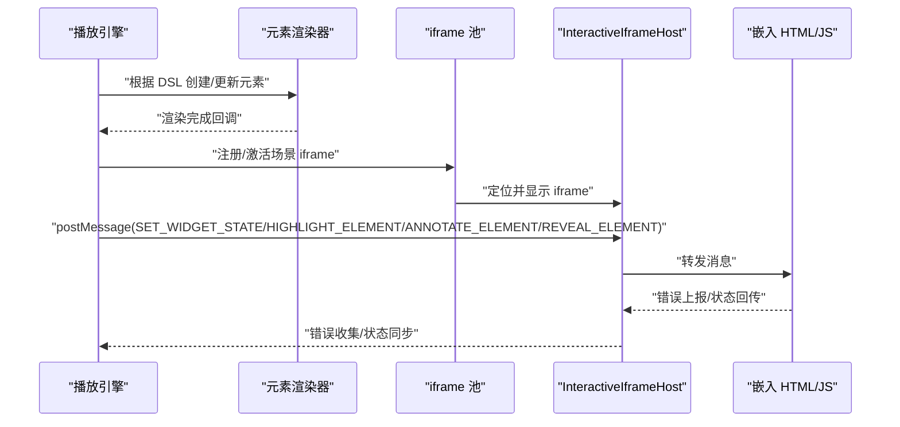
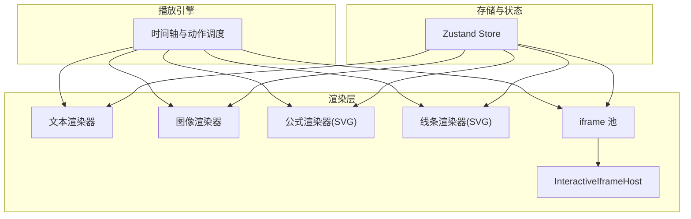
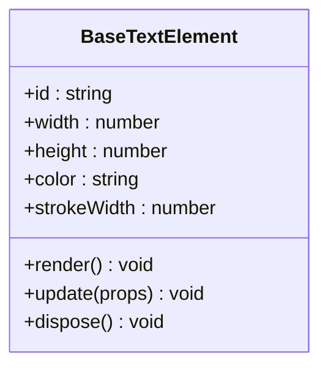
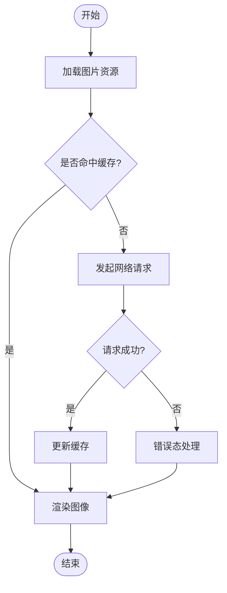
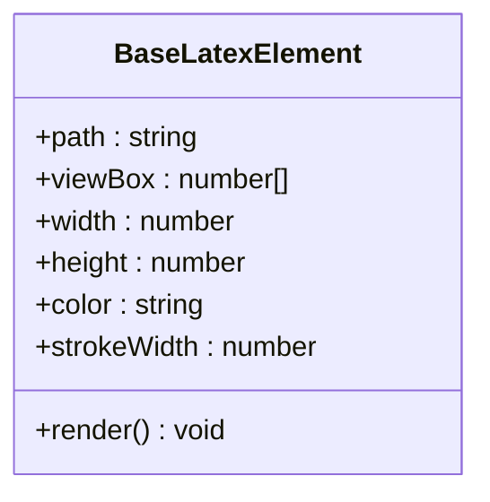
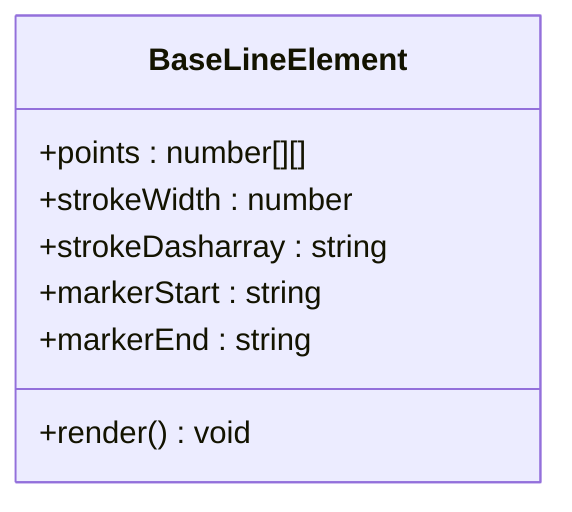
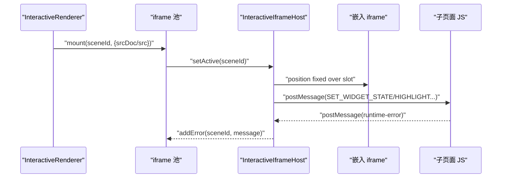
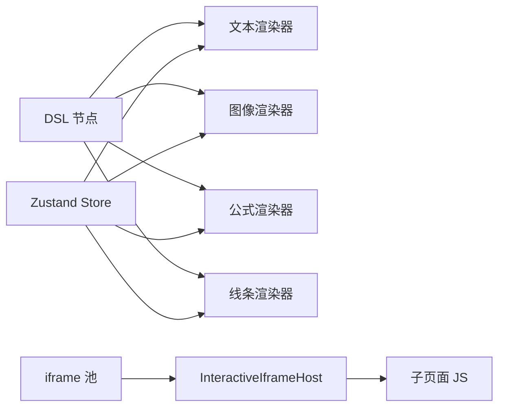

# 渲染器扩展开发

<cite>
**本文引用的文件**   
- [interactive-renderer.tsx](file://components/scene-renderers/interactive-renderer.tsx)
- [InteractiveIframeHost.tsx](file://components/scene-renderers/InteractiveIframeHost.tsx)
- [BaseTextElement.tsx](file://packages/@openmaic/renderer/src/elements/text/BaseTextElement.tsx)
- [BaseImageElement.tsx](file://packages/@openmaic/renderer/src/elements/image/BaseImageElement.tsx)
- [BaseLatexElement.tsx](file://packages/@openmaic/renderer/src/elements/latex/BaseLatexElement.tsx)
- [BaseLineElement.tsx](file://components/slide-renderer/components/element/LineElement/BaseLineElement.tsx)
- [canvas.ts](file://lib/store/canvas.ts)
- [system.md](file://lib/prompts/templates/diagram-content/system.md)
</cite>

## 产品概述
OpenMAIC 是一个 AI 驱动的交互式课件（MAIC）生成与课堂管理平台，支持通过自然语言生成结构化课件、课堂实时互动（问答/讨论/测验）、课件编辑与回放。其前端基于 Next.js + React 19 + Zustand 状态管理，AI 编排层使用 LangGraph + Vercel AI SDK，课件格式为自定义 DSL（@openmaic/dsl）。渲染引擎位于 @openmaic/renderer 包，提供文本、图像、图表、公式等元素的渲染能力，并通过可插拔的渲染器机制支持扩展自定义元素。

本章节聚焦“渲染器扩展开发”，面向希望为 OpenMAIC 添加自定义元素（如文本、图像、视频、图表、交互 HTML 等）的开发者，系统说明注册机制、生命周期、事件处理、Canvas/SVG/HTML 三种渲染路径、响应式与动画、性能优化、内存管理与跨浏览器兼容，以及与播放引擎和动作执行机制的集成方式。

## 核心业务流程
- 编辑器侧：用户在幻灯片画布上插入或编辑元素，元素以 DSL 节点形式持久化。
- 回放侧：根据当前场景与时间轴，将 DSL 节点映射到对应渲染器实例进行绘制与交互。
- 交互场景：通过 iframe 池与 postMessage 协议驱动外部 HTML/JS 内容，实现复杂交互与动画。
- 动作执行：播放引擎按时间线触发动作（高亮、标注、显示/隐藏、设置状态），通过消息通道下发至具体元素或 iframe。

**图示来源** 
- [interactive-renderer.tsx:22-69](file://components/scene-renderers/interactive-renderer.tsx#L22-L69)
- [InteractiveIframeHost.tsx:32-75](file://components/scene-renderers/InteractiveIframeHost.tsx#L32-L75)
- [system.md:53-122](file://lib/prompts/templates/diagram-content/system.md#L53-L122)

**章节来源**
- [interactive-renderer.tsx:22-69](file://components/scene-renderers/interactive-renderer.tsx#L22-L69)
- [InteractiveIframeHost.tsx:32-75](file://components/scene-renderers/InteractiveIframeHost.tsx#L32-L75)
- [system.md:53-122](file://lib/prompts/templates/diagram-content/system.md#L53-L122)

## 功能模块清单
- 文本渲染器：支持多行文本、垂直排版、颜色与描边、缩放与旋转。
- 图像渲染器：支持图片加载、裁剪、边框与阴影、占位与错误态。
- 公式渲染器：基于 SVG path 绘制数学符号，支持缩放与样式控制。
- 线条与形状渲染器：SVG 矢量绘制，支持虚线、端点标记与动态绘制。
- 交互 HTML 渲染器：通过 iframe 池托管外部 HTML/JS，postMessage 通信，错误隔离与回放。
- 播放与动作集成：高亮、标注、显示/隐藏、状态设置等动作统一分发。
- 画布与状态：Zustand store 维护选择、缩放、聚光灯、激光笔、视频播放等全局状态。

验收要点：
- 新增元素需遵循 DSL 节点结构，提供渲染组件与可选交互逻辑。
- 元素需在编辑与回放两种模式下正确渲染与交互。
- 交互 HTML 必须实现 postMessage 监听，确保平台动作生效。
- 性能与内存：避免频繁重排重绘，合理使用 requestAnimationFrame，及时清理事件与定时器。
- 兼容性：SVG/Canvas/HTML 在不同浏览器下的表现一致，必要时降级策略。

**章节来源**
- [BaseTextElement.tsx](file://packages/@openmaic/renderer/src/elements/text/BaseTextElement.tsx)
- [BaseImageElement.tsx](file://packages/@openmaic/renderer/src/elements/image/BaseImageElement.tsx)
- [BaseLatexElement.tsx:49-73](file://packages/@openmaic/renderer/src/elements/latex/BaseLatexElement.tsx#L49-L73)
- [BaseLineElement.tsx:128-146](file://components/slide-renderer/components/element/LineElement/BaseLineElement.tsx#L128-L146)
- [canvas.ts:156-191](file://lib/store/canvas.ts#L156-L191)

## 数据与状态
- DSL 节点：每个元素由一个节点描述，包含 id、类型、几何信息（位置、尺寸、旋转）、样式（颜色、描边、填充）、媒体资源（src/url）等。
- 渲染状态：编辑模式下的选择、缩放手柄、对齐辅助线；回放模式下的时间轴进度、动作触发状态。
- 全局状态：Zustand store 管理选择集、缩放级别、聚光灯、激光笔、视频播放、白板开关等。
- iframe 池：按 sceneId 管理 iframe 的生命周期、可见性、rect 跟踪与错误收集。

关键状态流转：
- 元素创建：DSL 节点入队 → 渲染器实例化 → 初始绘制 → 注册事件监听。
- 元素更新：DSL 变更 → diff 计算 → 局部重绘 → 动画过渡（可选）。
- 交互事件：用户操作 → 事件冒泡/捕获 → 状态更新 → 回放动作触发。
- iframe 通信：父页面 postMessage → 子页面监听 → 应用状态/效果 → 错误上报。

**章节来源**
- [canvas.ts:156-191](file://lib/store/canvas.ts#L156-L191)
- [interactive-renderer.tsx:22-69](file://components/scene-renderers/interactive-renderer.tsx#L22-L69)
- [InteractiveIframeHost.tsx:100-178](file://components/scene-renderers/InteractiveIframeHost.tsx#L100-L178)

## 关键约束与边界
- 安全边界：iframe sandbox 禁止 allow-same-origin，防止嵌入脚本访问宿主状态；仅允许 postMessage 通信。
- 性能边界：避免在高频回调中创建大对象；使用 requestAnimationFrame 节流测量；按需卸载未使用元素。
- 兼容性边界：SVG path 绘制需考虑字体与路径差异；Canvas 2D 上下文属性在各浏览器下略有差异，需做特性检测与降级。
- 业务边界：动作执行需保证幂等性；重复触发不应产生副作用；错误需可观测且不影响主流程。

**章节来源**
- [InteractiveIframeHost.tsx:100-178](file://components/scene-renderers/InteractiveIframeHost.tsx#L100-L178)
- [system.md:53-122](file://lib/prompts/templates/diagram-content/system.md#L53-L122)

## 架构总览
OpenMAIC 渲染器采用“插件化”架构：每种元素类型对应一个渲染器组件，负责将 DSL 节点渲染为 Canvas/SVG/HTML。交互类元素通过 iframe 池托管，父页面与子页面通过 postMessage 通信。播放引擎按时间线驱动动作，统一分发到各渲染器或 iframe。

**图示来源** 
- [BaseTextElement.tsx](file://packages/@openmaic/renderer/src/elements/text/BaseTextElement.tsx)
- [BaseImageElement.tsx](file://packages/@openmaic/renderer/src/elements/image/BaseImageElement.tsx)
- [BaseLatexElement.tsx:49-73](file://packages/@openmaic/renderer/src/elements/latex/BaseLatexElement.tsx#L49-L73)
- [BaseLineElement.tsx:128-146](file://components/slide-renderer/components/element/LineElement/BaseLineElement.tsx#L128-L146)
- [interactive-renderer.tsx:22-69](file://components/scene-renderers/interactive-renderer.tsx#L22-L69)
- [InteractiveIframeHost.tsx:32-75](file://components/scene-renderers/InteractiveIframeHost.tsx#L32-L75)
- [canvas.ts:156-191](file://lib/store/canvas.ts#L156-L191)

## 详细组件分析

### 文本渲染器（Canvas/SVG/HTML）
- 渲染路径：
  - Canvas：适合大量文本与高性能场景，需自行处理换行、度量与抗锯齿。
  - SVG：适合矢量文本与样式控制，便于缩放与动画。
  - HTML：适合富文本与编辑能力，但性能较低。
- 生命周期：
  - 初始化：解析 DSL 节点，计算布局与样式。
  - 更新：diff 变化后局部重绘，避免全量刷新。
  - 销毁：移除事件监听与定时器，释放资源。
- 交互：
  - 编辑模式：选择、拖拽、旋转、缩放。
  - 回放模式：高亮、标注、显示/隐藏。

**图示来源** 
- [BaseTextElement.tsx](file://packages/@openmaic/renderer/src/elements/text/BaseTextElement.tsx)

**章节来源**
- [BaseTextElement.tsx](file://packages/@openmaic/renderer/src/elements/text/BaseTextElement.tsx)

### 图像渲染器（Canvas/SVG/HTML）
- 渲染路径：
  - Canvas：适合批量图像处理与滤镜。
  - SVG：适合矢量图与简单变换。
  - HTML：适合懒加载与错误态处理。
- 生命周期：
  - 加载：预加载图片，缓存缩略图。
  - 渲染：按需绘制，避免阻塞主线程。
  - 清理：释放图片引用，取消未完成的请求。
- 交互：
  - 编辑模式：裁剪、旋转、缩放。
  - 回放模式：淡入淡出、缩放动画。

**图示来源** 
- [BaseImageElement.tsx](file://packages/@openmaic/renderer/src/elements/image/BaseImageElement.tsx)

**章节来源**
- [BaseImageElement.tsx](file://packages/@openmaic/renderer/src/elements/image/BaseImageElement.tsx)

### 公式渲染器（SVG Path）
- 渲染路径：基于 SVG path 绘制数学符号，支持缩放与样式控制。
- 生命周期：
  - 解析：将 LaTeX 转换为 SVG path。
  - 渲染：绘制 path，应用颜色与描边。
  - 更新：重新计算 path 与变换矩阵。
- 交互：
  - 编辑模式：调整大小与位置。
  - 回放模式：高亮与标注。

**图示来源** 
- [BaseLatexElement.tsx:49-73](file://packages/@openmaic/renderer/src/elements/latex/BaseLatexElement.tsx#L49-L73)

**章节来源**
- [BaseLatexElement.tsx:49-73](file://packages/@openmaic/renderer/src/elements/latex/BaseLatexElement.tsx#L49-L73)

### 线条与形状渲染器（SVG）
- 渲染路径：使用 SVG line/path 绘制，支持虚线与端点标记。
- 生命周期：
  - 初始化：计算起点与终点。
  - 更新：重绘路径，应用样式。
  - 销毁：清理 SVG 元素。
- 交互：
  - 编辑模式：拖拽端点，调整形状。
  - 回放模式：动态绘制动画。

**图示来源** 
- [BaseLineElement.tsx:128-146](file://components/slide-renderer/components/element/LineElement/BaseLineElement.tsx#L128-L146)

**章节来源**
- [BaseLineElement.tsx:128-146](file://components/slide-renderer/components/element/LineElement/BaseLineElement.tsx#L128-L146)

### 交互 HTML 渲染器（iframe 池）
- 渲染路径：通过 iframe 池托管外部 HTML/JS，父页面与子页面通过 postMessage 通信。
- 生命周期：
  - 注册：placeholder 注册内容与 rect。
  - 激活：host 分配 iframe 并定位。
  - 卸载：隐藏而非销毁，保持文档状态。
- 事件处理：
  - 父页面发送：SET_WIDGET_STATE、HIGHLIGHT_ELEMENT、ANNOTATE_ELEMENT、REVEAL_ELEMENT。
  - 子页面监听：应用状态与效果，上报错误。

**图示来源** 
- [interactive-renderer.tsx:22-69](file://components/scene-renderers/interactive-renderer.tsx#L22-L69)
- [InteractiveIframeHost.tsx:32-75](file://components/scene-renderers/InteractiveIframeHost.tsx#L32-L75)
- [system.md:53-122](file://lib/prompts/templates/diagram-content/system.md#L53-L122)

**章节来源**
- [interactive-renderer.tsx:22-69](file://components/scene-renderers/interactive-renderer.tsx#L22-L69)
- [InteractiveIframeHost.tsx:32-75](file://components/scene-renderers/InteractiveIframeHost.tsx#L32-L75)
- [system.md:53-122](file://lib/prompts/templates/diagram-content/system.md#L53-L122)

## 依赖分析
- 渲染器与 DSL：每个渲染器依赖 DSL 节点定义，确保数据结构一致。
- 渲染器与状态：通过 Zustand store 读取全局状态（选择、缩放、聚光灯等）。
- 渲染器与 iframe 池：交互元素依赖 iframe 池管理生命周期与通信。
- 播放引擎与动作：播放引擎按时间线触发动作，统一分发到渲染器或 iframe。

**图示来源** 
- [BaseTextElement.tsx](file://packages/@openmaic/renderer/src/elements/text/BaseTextElement.tsx)
- [BaseImageElement.tsx](file://packages/@openmaic/renderer/src/elements/image/BaseImageElement.tsx)
- [BaseLatexElement.tsx:49-73](file://packages/@openmaic/renderer/src/elements/latex/BaseLatexElement.tsx#L49-L73)
- [BaseLineElement.tsx:128-146](file://components/slide-renderer/components/element/LineElement/BaseLineElement.tsx#L128-L146)
- [interactive-renderer.tsx:22-69](file://components/scene-renderers/interactive-renderer.tsx#L22-L69)
- [InteractiveIframeHost.tsx:32-75](file://components/scene-renderers/InteractiveIframeHost.tsx#L32-L75)
- [canvas.ts:156-191](file://lib/store/canvas.ts#L156-L191)

**章节来源**
- [canvas.ts:156-191](file://lib/store/canvas.ts#L156-L191)
- [interactive-renderer.tsx:22-69](file://components/scene-renderers/interactive-renderer.tsx#L22-L69)
- [InteractiveIframeHost.tsx:32-75](file://components/scene-renderers/InteractiveIframeHost.tsx#L32-L75)

## 性能考虑
- 渲染优化：
  - 使用 requestAnimationFrame 节流测量与绘制。
  - 避免频繁创建 DOM 节点，复用现有元素。
  - 对大图与复杂 SVG 进行懒加载与分片渲染。
- 内存管理：
  - 及时清理事件监听器与定时器。
  - 释放图片与视频资源引用。
  - 使用 WeakMap 缓存临时对象。
- 跨浏览器兼容：
  - SVG path 绘制需测试不同字体与路径。
  - Canvas 2D 上下文属性做特性检测与降级。
  - iframe sandbox 行为在各浏览器下保持一致。

[本节为通用指导，不直接分析具体文件]

## 故障排查指南
- 交互 HTML 无响应：检查子页面是否正确监听 postMessage，确保 target 与 state 字段匹配。
- 运行时错误：查看 iframe 错误上报，确认 srcDoc 解析与脚本执行环境。
- 渲染异常：检查 DSL 节点结构与样式属性，验证几何信息与变换矩阵。
- 性能问题：使用浏览器性能面板分析重排重绘，优化渲染循环与资源加载。

**章节来源**
- [system.md:53-122](file://lib/prompts/templates/diagram-content/system.md#L53-L122)
- [InteractiveIframeHost.tsx:125-145](file://components/scene-renderers/InteractiveIframeHost.tsx#L125-L145)

## 结论
OpenMAIC 渲染器扩展开发围绕“插件化”架构展开，支持文本、图像、公式、线条等多种元素类型，以及复杂的交互 HTML 场景。通过统一的 DSL 节点、Zustand 状态管理与 iframe 池通信机制，开发者可以高效地扩展自定义元素，实现丰富的教学互动体验。在实际开发中，应重点关注性能优化、内存管理与跨浏览器兼容性，确保渲染的稳定与流畅。

[本节为总结性内容，不直接分析具体文件]