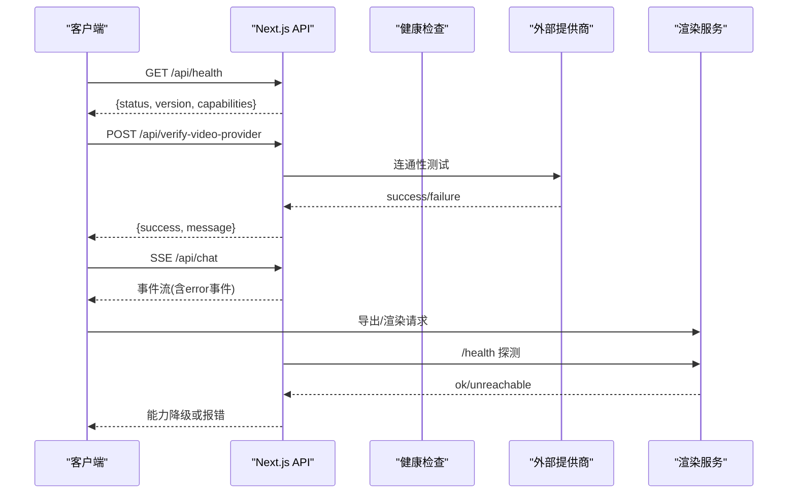
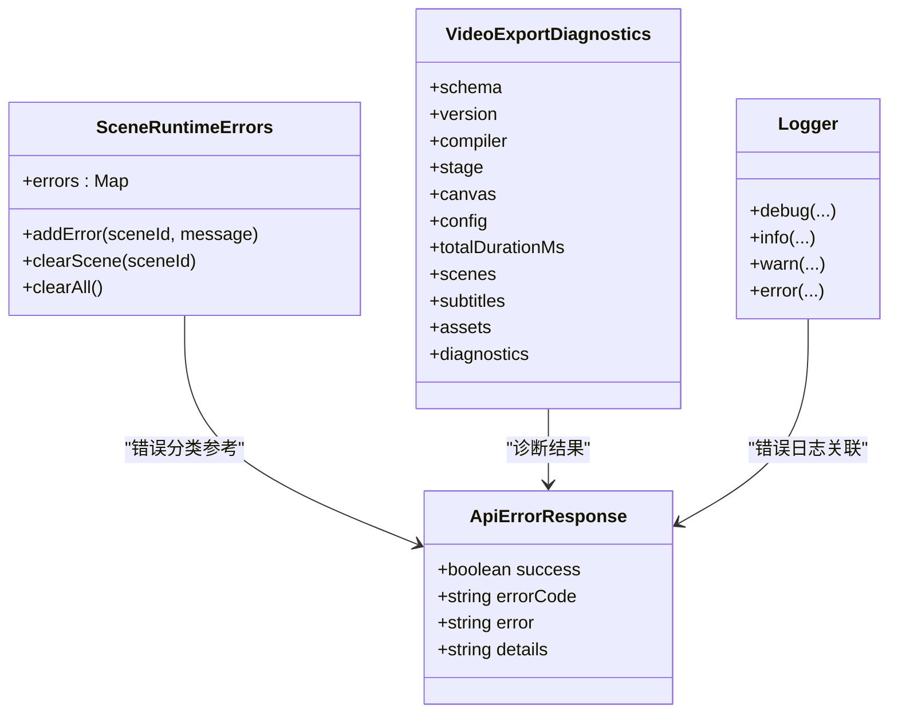

# 故障排除

<cite>
**本文引用的文件**   
- [lib/logger.ts](file://lib/logger.ts)
- [app/api/health/route.ts](file://app/api/health/route.ts)
- [lib/server/render-service.ts](file://lib/server/render-service.ts)
- [app/api/verify-video-provider/route.ts](file://app/api/verify-video-provider/route.ts)
- [lib/ai/providers.ts](file://lib/ai/providers.ts)
- [lib/audio/tts-providers.ts](file://lib/audio/tts-providers.ts)
- [app/api/chat/route.ts](file://app/api/chat/route.ts)
- [components/scene-renderers/pbl/v2/chat.tsx](file://components/scene-renderers/pbl/v2/chat.tsx)
- [lib/hooks/use-asr-available.ts](file://lib/hooks/use-asr-available.ts)
- [lib/config/apply-token-plan.ts](file://lib/config/apply-token-plan.ts)
- [lib/server/api-response.ts](file://lib/server/api-response.ts)
- [tests/store/scene-runtime-errors.test.ts](file://tests/store/scene-runtime-errors.test.ts)
- [lib/video-export/compile.ts](file://lib/video-export/compile.ts)
</cite>

## 产品概述
OpenMAIC 是 AI 驱动的交互式课件（MAIC）生成与课堂管理平台，支持自然语言生成结构化课件、课堂实时互动（问答/讨论/测验）、课件编辑与回放。前端基于 Next.js + React，AI 编排层使用 LangGraph + Vercel AI SDK，核心业务模块位于 lib/ 目录，包含编排、生成、回放、智能体、课堂管理、编辑器与导出等能力。本指南聚焦安装配置、运行时异常、性能问题与监控诊断，帮助快速定位并解决问题。

## 核心业务流程
- 健康检查与能力探测：通过健康端点返回版本与各能力开关状态，用于服务可用性探测与 UI 降级。
- 外部服务连通性验证：视频/语音/搜索等提供商凭据校验，统一错误码与消息返回。
- 聊天与流式响应：SSE 推送事件，失败时回写 error 事件并关闭连接。
- PBL v2 流程推进：继续交接、打开任务、状态变更与错误提示，保证用户可见的错误入口一致。
- ASR/TTS 可用性判定：浏览器原生能力、密钥与模型配置综合判断可用性。
- 渲染服务健康检测：内部渲染服务可达性与超时控制，保障导出能力正确上报。

**图表来源** 
- [app/api/health/route.ts:1-23](file://app/api/health/route.ts#L1-L23)
- [app/api/verify-video-provider/route.ts:1-73](file://app/api/verify-video-provider/route.ts#L1-L73)
- [app/api/chat/route.ts:173-207](file://app/api/chat/route.ts#L173-L207)
- [lib/server/render-service.ts:31-60](file://lib/server/render-service.ts#L31-L60)

**章节来源**
- [app/api/health/route.ts:1-23](file://app/api/health/route.ts#L1-L23)
- [app/api/verify-video-provider/route.ts:1-73](file://app/api/verify-video-provider/route.ts#L1-L73)
- [app/api/chat/route.ts:173-207](file://app/api/chat/route.ts#L173-L207)
- [lib/server/render-service.ts:31-60](file://lib/server/render-service.ts#L31-L60)

## 功能模块清单
- 健康检查与能力探测
  - 职责：返回版本与各能力开关（Web 搜索、图像生成、视频生成、TTS）。
  - 验收要点：无依赖外部服务；capabilities 准确反映服务端配置。
- 提供商连通性验证
  - 职责：校验 API Key、Base URL、SSRF 防护、托管模式忽略客户端参数。
  - 验收要点：缺失密钥返回明确错误码；上游错误透传；生产环境禁止重定向。
- 聊天与流式响应
  - 职责：SSE 推送；失败时写入 error 事件并关闭；统一日志与错误码。
  - 验收要点：错误可被客户端捕获；日志包含关键上下文（模型、消息数）。
- PBL v2 交互推进
  - 职责：继续交接、打开任务、错误弹窗提示；保持错误展示一致性。
  - 验收要点：网络错误能触发 alert；项目数据更新路径兼容新旧结构。
- ASR/TTS 可用性判定
  - 职责：浏览器原生能力、密钥与模型配置综合判断；禁用不可用项。
  - 验收要点：空密钥或无模型视为不可用；SSR 安全默认值。
- 渲染服务健康检测
  - 职责：探测内部渲染服务可达性；超时保护；能力降级。
  - 验收要点：未配置或不可达返回 false；不影响主流程。

**章节来源**
- [app/api/health/route.ts:1-23](file://app/api/health/route.ts#L1-L23)
- [app/api/verify-video-provider/route.ts:1-73](file://app/api/verify-video-provider/route.ts#L1-L73)
- [app/api/chat/route.ts:173-207](file://app/api/chat/route.ts#L173-L207)
- [components/scene-renderers/pbl/v2/chat.tsx:218-250](file://components/scene-renderers/pbl/v2/chat.tsx#L218-L250)
- [lib/hooks/use-asr-available.ts:30-50](file://lib/hooks/use-asr-available.ts#L30-L50)
- [lib/server/render-service.ts:31-60](file://lib/server/render-service.ts#L31-L60)

## 数据与状态
- 统一错误响应格式
  - 成功：{ success: true, ...data }
  - 失败：{ success: false, errorCode, error, details? }
  - 常见错误码：MISSING_API_KEY、INVALID_CREDENTIALS、UPSTREAM_ERROR、RATE_LIMITED、INTERNAL_ERROR 等。
- 场景运行期错误存储
  - 按场景记录错误，去重与上限（最近 8 条），支持按场景清理与全清。
- 视频导出诊断信息
  - 编译阶段收集多源诊断（时间线、几何、资源、不支持项），汇总为 diagnostics 列表。
- 日志输出
  - 支持 JSON 与文本两种格式；级别由环境变量控制；Error 对象自动展开堆栈或消息。

**图表来源** 
- [lib/server/api-response.ts:1-51](file://lib/server/api-response.ts#L1-L51)
- [tests/store/scene-runtime-errors.test.ts:1-46](file://tests/store/scene-runtime-errors.test.ts#L1-L46)
- [lib/video-export/compile.ts:157-182](file://lib/video-export/compile.ts#L157-L182)
- [lib/logger.ts:1-53](file://lib/logger.ts#L1-L53)

**章节来源**
- [lib/server/api-response.ts:1-51](file://lib/server/api-response.ts#L1-L51)
- [tests/store/scene-runtime-errors.test.ts:1-46](file://tests/store/scene-runtime-errors.test.ts#L1-L46)
- [lib/video-export/compile.ts:157-182](file://lib/video-export/compile.ts#L157-L182)
- [lib/logger.ts:1-53](file://lib/logger.ts#L1-L53)

## 关键约束与边界
- 提供商配置与安全
  - 托管提供商忽略客户端传入的 apiKey/baseUrl；生产环境对 baseUrl 进行 SSRF 校验。
  - 某些提供商需要 API Key，未知提供商默认需要 Key。
- 网络与超时
  - 渲染服务健康检查设置短超时（秒级），避免阻塞主流程。
  - 聊天 SSE 在异常时写入 error 事件后关闭连接。
- 能力降级
  - 渲染服务不可用时，UI 应降级显示（如禁用导出按钮）。
- 日志与调试
  - LOG_LEVEL 控制输出级别；LOG_FORMAT=json 便于聚合分析。
- 已知限制与临时方案
  - 自定义提供商至少配置一个模型才可用；浏览器原生 ASR 需浏览器支持。
  - 某些上游错误（如重定向）会被拒绝并返回明确错误码。

**章节来源**
- [app/api/verify-video-provider/route.ts:1-73](file://app/api/verify-video-provider/route.ts#L1-L73)
- [lib/ai/providers.ts:1493-1546](file://lib/ai/providers.ts#L1493-L1546)
- [lib/server/render-service.ts:31-60](file://lib/server/render-service.ts#L31-L60)
- [lib/hooks/use-asr-available.ts:30-50](file://lib/hooks/use-asr-available.ts#L30-L50)
- [lib/logger.ts:1-53](file://lib/logger.ts#L1-L53)

## 常见问题排查与解决策略

### 安装与环境配置问题
- 症状
  - 启动后健康检查正常但能力全部为 false。
  - 导出/渲染功能不可用。
- 排查步骤
  - 检查健康端点返回的 capabilities 字段，确认各提供商是否启用。
  - 检查渲染服务是否配置且可达；若不可达则导出能力应降级。
  - 检查环境变量 LOG_LEVEL/LOG_FORMAT 是否正确设置。
- 解决方案
  - 启用对应提供商配置；确保渲染服务地址正确并可访问。
  - 调整日志级别以获取更多诊断信息。

**章节来源**
- [app/api/health/route.ts:1-23](file://app/api/health/route.ts#L1-L23)
- [lib/server/render-service.ts:31-60](file://lib/server/render-service.ts#L31-L60)
- [lib/logger.ts:1-53](file://lib/logger.ts#L1-L53)

### 配置错误与凭据问题
- 症状
  - 视频/语音/搜索提供商调用失败，提示缺少 API Key 或无效凭据。
  - 自定义 Base URL 被拒绝。
- 排查步骤
  - 使用 /api/verify-video-provider 验证提供商连通性与凭据。
  - 检查托管模式下是否误传客户端 apiKey/baseUrl。
  - 生产环境下校验 baseUrl 是否符合 SSRF 规则。
- 解决方案
  - 补充正确的 API Key；修正 Base URL；托管模式不要传客户端密钥。
  - 遵循安全策略，避免内网地址或重定向。

**章节来源**
- [app/api/verify-video-provider/route.ts:1-73](file://app/api/verify-video-provider/route.ts#L1-L73)
- [lib/server/api-response.ts:1-51](file://lib/server/api-response.ts#L1-L51)

### 运行时异常与错误处理
- 症状
  - 聊天 SSE 中断，客户端收到 error 事件。
  - PBL v2 继续交接失败，弹出错误提示。
- 排查步骤
  - 查看服务端日志（包含模型、消息数等上下文）。
  - 检查客户端错误弹窗与网络响应状态。
  - 确认 SSE 连接未被代理或防火墙中断。
- 解决方案
  - 修复上游错误或网络问题；必要时重试或降级。
  - 确保客户端正确处理 error 事件并提示用户。

**章节来源**
- [app/api/chat/route.ts:173-207](file://app/api/chat/route.ts#L173-L207)
- [components/scene-renderers/pbl/v2/chat.tsx:218-250](file://components/scene-renderers/pbl/v2/chat.tsx#L218-L250)

### 性能问题与优化建议
- 症状
  - 导出视频耗时过长或失败。
  - TTS 生成缓慢或失败。
- 排查步骤
  - 检查渲染服务健康与负载；关注超时与重试。
  - 查看 TTS 上游响应时间与错误详情。
  - 分析视频导出诊断信息（diagnostics）定位瓶颈。
- 解决方案
  - 优化渲染服务资源配置；增加超时阈值（谨慎）。
  - 选择更快的 TTS 模型或批量处理。
  - 根据 diagnostics 调整素材与时间线配置。

**章节来源**
- [lib/server/render-service.ts:31-60](file://lib/server/render-service.ts#L31-L60)
- [lib/audio/tts-providers.ts:543-584](file://lib/audio/tts-providers.ts#L543-L584)
- [lib/video-export/compile.ts:157-182](file://lib/video-export/compile.ts#L157-L182)

### 网络连通性检查
- 步骤
  - 使用健康端点确认服务状态。
  - 使用提供商验证端点测试连通性与凭据。
  - 检查代理/防火墙是否阻断 SSE 或 HTTPS。
- 工具
  - curl/wget 测试端点；浏览器开发者工具查看网络请求。
  - 日志聚合系统解析 JSON 日志。

**章节来源**
- [app/api/health/route.ts:1-23](file://app/api/health/route.ts#L1-L23)
- [app/api/verify-video-provider/route.ts:1-73](file://app/api/verify-video-provider/route.ts#L1-L73)
- [lib/logger.ts:1-53](file://lib/logger.ts#L1-L53)

### API 密钥验证与模型配置
- 步骤
  - 确认提供商是否需要 API Key。
  - 检查密钥是否为空或仅空白字符。
  - 自定义提供商至少配置一个模型。
- 解决方案
  - 补充有效密钥；配置模型列表；启用提供商。

**章节来源**
- [lib/ai/providers.ts:1493-1546](file://lib/ai/providers.ts#L1493-L1546)
- [lib/hooks/use-asr-available.ts:30-50](file://lib/hooks/use-asr-available.ts#L30-L50)
- [lib/config/apply-token-plan.ts:290-321](file://lib/config/apply-token-plan.ts#L290-L321)

### 服务依赖检测与健康监控
- 步骤
  - 定期调用健康端点与渲染服务 /health。
  - 监控错误码分布（UPSTREAM_ERROR、RATE_LIMITED 等）。
  - 设置告警阈值（如连续失败次数、响应时间）。
- 工具
  - 日志聚合（JSON 格式）；监控系统（Prometheus/Grafana）。
  - 自动化探针脚本。

**章节来源**
- [app/api/health/route.ts:1-23](file://app/api/health/route.ts#L1-L23)
- [lib/server/render-service.ts:31-60](file://lib/server/render-service.ts#L31-L60)
- [lib/server/api-response.ts:1-51](file://lib/server/api-response.ts#L1-L51)

### 调试工具与日志分析
- 日志级别与格式
  - 设置 LOG_LEVEL=debug/info/warn/error。
  - 设置 LOG_FORMAT=json 便于解析。
- 分析方法
  - 过滤 ERROR/WARN 级别；提取 errorCode 与 error 字段。
  - 关联请求 ID、模型名、消息数等上下文。
- 工具推荐
  - 命令行 grep/awk；ELK/EFK 栈；云厂商日志服务。

**章节来源**
- [lib/logger.ts:1-53](file://lib/logger.ts#L1-L53)
- [lib/server/api-response.ts:1-51](file://lib/server/api-response.ts#L1-L51)

### 监控告警配置
- 指标
  - 健康检查成功率、提供商验证成功率、SSE 错误率、渲染服务可用性。
- 告警规则
  - 连续失败 N 次；响应时间超过阈值；错误码占比过高。
- 通知渠道
  - 邮件、企业微信、钉钉、Slack。

[本节为通用指导，不直接分析具体文件]

### 社区支持与问题反馈
- 渠道
  - 官方文档与 Wiki；GitHub Issues；社区论坛。
- 反馈模板
  - 环境信息（版本、操作系统、浏览器）。
  - 复现步骤与期望行为。
  - 相关日志片段（脱敏）与错误码。
- 跟进
  - 提供最小复现代码或配置。
  - 配合开发进行日志抓取与问题定位。

[本节为通用指导，不直接分析具体文件]

## 结论
通过统一的健康检查、提供商验证、SSE 错误处理与日志规范，OpenMAIC 提供了完善的故障排除基础。结合监控告警与社区支持，可快速定位并解决安装配置、运行时异常与性能问题。建议在生产环境中启用 JSON 日志与集中化监控，定期演练故障恢复流程，提升系统稳定性与用户体验。