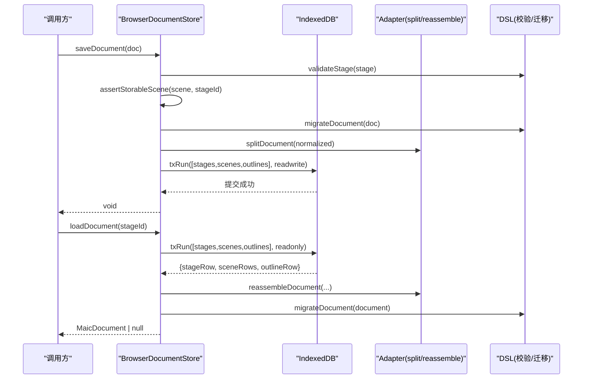
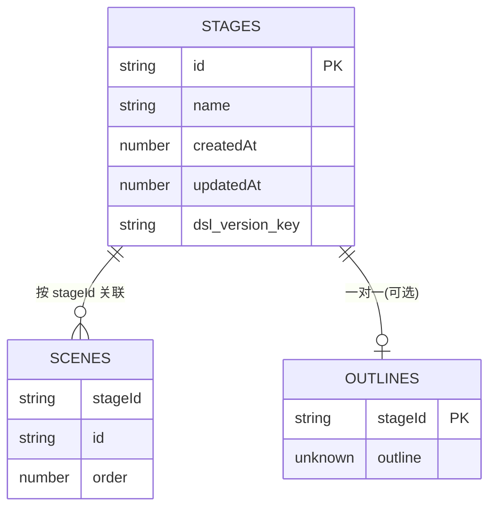
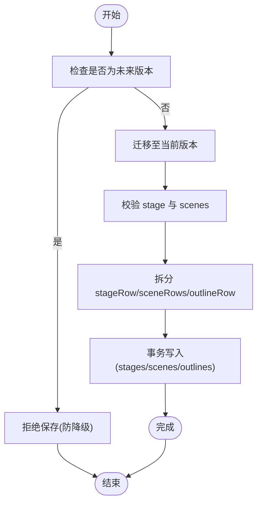
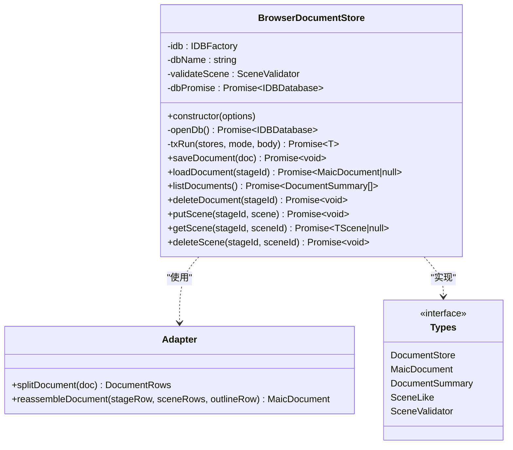
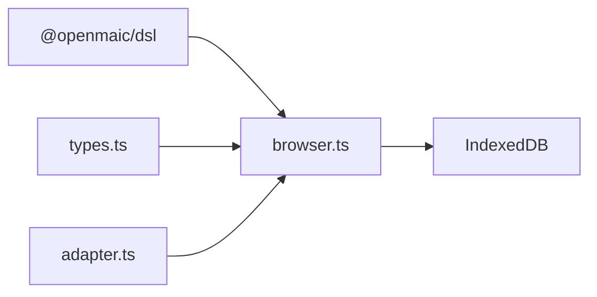

# BrowserDocumentStore 文档存储

<cite>
**本文引用的文件**
- [packages/@openmaic/storage/src/document/browser.ts](file://packages/@openmaic/storage/src/document/browser.ts)
- [packages/@openmaic/storage/src/document/adapter.ts](file://packages/@openmaic/storage/src/document/adapter.ts)
- [packages/@openmaic/storage/src/document/types.ts](file://packages/@openmaic/storage/src/document/types.ts)
- [packages/@openmaic/dsl/src/storage.ts](file://packages/@openmaic/dsl/src/storage.ts)
</cite>

## 产品概述
BrowserDocumentStore 是基于浏览器 IndexedDB 的文档持久化实现，负责将 DSL 定义的“课件文档”（课程阶段 stage + 场景 scenes + 可选大纲 outline）进行规范化拆分与重组、版本迁移、写入校验与事务原子性保障。其核心价值在于：
- 提供稳定的 CRUD 接口与增量场景操作（putScene/getScene/deleteScene），兼顾性能与一致性。
- 通过 DSL 版本戳与迁移机制，确保跨客户端版本演进时的数据向前兼容。
- 以 IndexedDB 对象存储分区（stages/scenes/outlines）与复合键策略，保证文档隔离与排序稳定。
- 面向应用扩展的场景类型（如 interactive/pbl）通过可注入的 SceneValidator 保持强校验与失败即报错（fail-loud）。

适用场景：前端离线或弱网环境下的课件编辑、保存、回放与导出；需要本地持久化且具备版本治理能力的课件管理系统。

**章节来源**
- [packages/@openmaic/storage/src/document/browser.ts:1-419](file://packages/@openmaic/storage/src/document/browser.ts#L1-L419)
- [packages/@openmaic/storage/src/document/types.ts:1-137](file://packages/@openmaic/storage/src/document/types.ts#L1-L137)
- [packages/@openmaic/dsl/src/storage.ts:1-62](file://packages/@openmaic/dsl/src/storage.ts#L1-L62)

## 核心业务流程
- 保存文档（saveDocument）
  - 前置校验：对 stage 与所有 scene 执行 DSL 校验与结构约束（stageId/id/order）。
  - 版本检查：拒绝保存由更新客户端写入的“未来版本”文档，避免降级覆盖。
  - 规范化：按当前 DSL 版本对文档进行迁移（outline 不参与迁移）。
  - 拆分与写入：splitDocument 拆分为 stageRow、sceneRows、outlineRow；在单一事务中批量 put 场景并删除不再存在的场景；同步更新 stages 与 outlines。
- 加载文档（loadDocument）
  - 读取 stageRow、scenes（按 stageId 索引）、outlineRow。
  - reassembleDocument 重组为 MaicDocument，并按 DSL 版本向前迁移（outline 保持不变）。
- 列表与删除
  - listDocuments：仅读取 version-agnostic 字段，不触发迁移，容忍未知 dslVersion。
  - deleteDocument：级联删除 stage、scenes、outline，无版本守卫，允许粗粒度清理。
- 增量场景操作
  - putScene：校验 scene 归属与版本，要求目标文档已是当前 DSL 版本，否则拒绝。
  - getScene：若文档无需迁移则直接读单行；否则走完整文档迁移路径。
  - deleteScene：同 putScene 的版本守卫，保证增量变更的一致性。



**图表来源**
- [packages/@openmaic/storage/src/document/browser.ts:210-311](file://packages/@openmaic/storage/src/document/browser.ts#L210-L311)
- [packages/@openmaic/storage/src/document/adapter.ts:37-65](file://packages/@openmaic/storage/src/document/adapter.ts#L37-L65)

**章节来源**
- [packages/@openmaic/storage/src/document/browser.ts:210-418](file://packages/@openmaic/storage/src/document/browser.ts#L210-L418)
- [packages/@openmaic/storage/src/document/adapter.ts:37-65](file://packages/@openmaic/storage/src/document/adapter.ts#L37-L65)

## 功能模块清单
- 文档聚合与适配器（adapter.ts）
  - 职责：定义 StageRow/OutlineRow/DocumentRows，提供 splitDocument 与 reassembleDocument 两个纯函数，确保各后端一致的拆分/重组语义。
  - 验收要点：拆分时 stageRow 必须携带 DSL_VERSION_KEY；重组后 scenes 按 order 升序排列；dslVersion 提升为文档根字段。
- 文档存储接口（types.ts）
  - 职责：定义 DocumentStore<TScene> 契约（CRUD、列表、删除、增量场景操作）、MaicDocument 结构与 SceneLike/SceneValidator。
  - 验收要点：接口方法需满足注释中的原子性、版本守卫与迁移语义；listDocuments 不得依赖 dslVersion。
- 浏览器端实现（browser.ts）
  - 职责：基于 IndexedDB 的对象存储（stages/scenes/outlines）与复合键（stageId,id）；封装 txRun 事务；实现 save/load/list/delete/put/get/delete 场景操作；内置断言与版本守卫。
  - 验收要点：写前校验、写后删除多余场景、outline 存在性控制；getScene 快速路径与迁移回退；deleteDocument 无版本守卫。

**章节来源**
- [packages/@openmaic/storage/src/document/adapter.ts:1-66](file://packages/@openmaic/storage/src/document/adapter.ts#L1-L66)
- [packages/@openmaic/storage/src/document/types.ts:1-137](file://packages/@openmaic/storage/src/document/types.ts#L1-L137)
- [packages/@openmaic/storage/src/document/browser.ts:1-419](file://packages/@openmaic/storage/src/document/browser.ts#L1-L419)

## 数据与状态
- 数据模型
  - MaicDocument<TScene>：包含 stage（元数据+版本戳）、scenes（有序场景数组）、可选 outline（应用快照，不参与迁移）、可选 dslVersion（迁移信封）。
  - StageRow：Stage 加上 DSL_VERSION_KEY 作为版本戳。
  - OutlineRow：stageId + 任意 outline 快照。
  - DocumentRows：stageRow、sceneRows、可选 outlineRow。
- 关键状态流转
  - 写入：doc → 校验 → 迁移 → 拆分 → 事务写入（stages/scenes/outlines）。
  - 读取：stageRow + scenes + outlineRow → 重组 → 迁移 → 返回文档。
  - 列表：仅读取 stageRow 与 scenes count，不迁移内容。
- 数据所有权边界
  - DSL 拥有 Stage/Scene 的形态与迁移规则；outline 属于应用自有数据，不被校验与迁移。
  - 场景类型可扩展（TScene），但 store 仅依赖 SceneLike 字段（id/stageId/order）。



**图表来源**
- [packages/@openmaic/storage/src/document/adapter.ts:14-29](file://packages/@openmaic/storage/src/document/adapter.ts#L14-L29)
- [packages/@openmaic/storage/src/document/browser.ts:147-174](file://packages/@openmaic/storage/src/document/browser.ts#L147-L174)

**章节来源**
- [packages/@openmaic/storage/src/document/types.ts:56-74](file://packages/@openmaic/storage/src/document/types.ts#L56-L74)
- [packages/@openmaic/storage/src/document/adapter.ts:14-29](file://packages/@openmaic/storage/src/document/adapter.ts#L14-L29)

## 关键约束与边界
- 版本控制与迁移
  - 写入前拒绝“未来版本”文档，防止旧客户端覆盖新数据。
  - 读取时统一向前迁移（outline 除外），保证文档始终处于当前 DSL 版本。
  - 增量操作（putScene/deleteScene）要求目标文档已是当前版本，否则拒绝，强制先 load + save 归一化。
- 索引与查询优化
  - scenes 使用复合主键 [stageId, id]，并以 stageId 建立非唯一索引 by-stage，支持按文档批量读取与计数。
  - listDocuments 仅访问 stageRow 与索引计数，避免读取大对象与触发迁移。
  - getScene 优先快速路径（无需迁移时直接按复合键取单行），否则回退到完整文档迁移路径。
- 事务与并发控制
  - 所有写操作通过 txRun 包裹，承诺在事务提交时生效；异常会中止事务并抛出错误，保证原子性。
  - 写前校验与重复场景 id 检测避免静默数据丢失。
- 错误恢复策略
  - openDb 失败会清空缓存重试，避免私有模式或一次性 VersionError 导致会话永久失败。
  - 失败即报错（fail-loud）：任何校验失败都会立即抛出详细错误信息，便于定位问题。
- 备份与恢复建议
  - 导出：遍历 listDocuments，逐个 loadDocument 得到完整文档，序列化保存（含 outline）。
  - 恢复：遍历导入文档，逐条 saveDocument；注意目标环境的 DSL 版本兼容性。
- 性能调优指南
  - 批量保存优先使用 saveDocument，内部已做全量场景写入与多余场景删除，避免多次小事务。
  - 增量编辑使用 putScene/deleteScene，减少不必要的全量写入。
  - 列表与统计使用 listDocuments，避免加载全文档。
  - 避免频繁重建 IDB 连接；openDb 已做 Promise 缓存并在失败时重置。



**图表来源**
- [packages/@openmaic/storage/src/document/browser.ts:210-293](file://packages/@openmaic/storage/src/document/browser.ts#L210-L293)

**章节来源**
- [packages/@openmaic/storage/src/document/browser.ts:147-418](file://packages/@openmaic/storage/src/document/browser.ts#L147-L418)
- [packages/@openmaic/storage/src/document/adapter.ts:37-65](file://packages/@openmaic/storage/src/document/adapter.ts#L37-L65)

## 架构总览
```mermaid
graph TB
subgraph "应用层"
UI["编辑器/播放器"]
Biz["业务逻辑(Zustand/React)"]
end
subgraph "存储抽象"
Types["DocumentStore 接口(types.ts)"]
Adapter["文档拆分/重组(adapter.ts)"]
end
subgraph "浏览器实现"
Store["BrowserDocumentStore(browser.ts)"]
IDB["IndexedDB<br/>stages/scenes/outlines"]
end
subgraph "DSL"
DSL["校验/迁移(DSL_VERSION_KEY)"]
end
UI --> Biz
Biz --> Types
Types --> Store
Store --> Adapter
Store --> IDB
Store --> DSL
```

**图表来源**
- [packages/@openmaic/storage/src/document/types.ts:81-136](file://packages/@openmaic/storage/src/document/types.ts#L81-L136)
- [packages/@openmaic/storage/src/document/adapter.ts:37-65](file://packages/@openmaic/storage/src/document/adapter.ts#L37-L65)
- [packages/@openmaic/storage/src/document/browser.ts:133-174](file://packages/@openmaic/storage/src/document/browser.ts#L133-L174)

## 详细组件分析
### 文档聚合与适配器（adapter.ts）
- 设计要点
  - splitDocument：为 stageRow 添加 DSL_VERSION_KEY，scenes 原样输出，outline 仅在存在时生成 OutlineRow。
  - reassembleDocument：从 stageRow 提取 dslVersion 提升为文档根字段，scenes 按 order 排序，outline 选择性附加。
- 复杂度
  - 拆分/重组均为 O(n)（n 为场景数量），排序为 O(n log n)。
- 依赖链
  - 依赖 DSL_VERSION_KEY 常量；与 browser.ts 的 txRun 配合完成读写。

**章节来源**
- [packages/@openmaic/storage/src/document/adapter.ts:37-65](file://packages/@openmaic/storage/src/document/adapter.ts#L37-L65)

### 文档存储接口（types.ts）
- 设计要点
  - DocumentStore<TScene> 明确 CRUD、列表、删除与增量场景操作的语义与约束。
  - SceneLike 抽象出 id/stageId/order，使 store 对场景内容透明。
  - MaicDocument 明确 dslVersion 与 outline 的角色与边界。
- 验收要点
  - listDocuments 不依赖 dslVersion；getScene 可能回退到完整迁移路径；deleteDocument 无版本守卫。

**章节来源**
- [packages/@openmaic/storage/src/document/types.ts:23-74](file://packages/@openmaic/storage/src/document/types.ts#L23-L74)
- [packages/@openmaic/storage/src/document/types.ts:81-136](file://packages/@openmaic/storage/src/document/types.ts#L81-L136)

### 浏览器端实现（browser.ts）
- 设计要点
  - 对象存储：stages（主键 id）、scenes（复合主键 [stageId, id]，索引 by-stage）、outlines（主键 stageId）。
  - 事务封装：txRun 在 commit 时解析，异常中止事务并抛出错误。
  - 版本守卫：isFutureVersioned 与 dslVersionOf 配合，防止降级覆盖；putScene/deleteScene 要求文档当前版本。
  - 快速路径：getScene 在无迁移需求时直接按复合键读取。
- 错误处理
  - 断言失败立即抛错（fail-loud），包含详细路径与消息。
  - openDb 失败重置缓存，避免会话级阻塞。
- 性能特性
  - 列表与计数仅访问轻量字段与索引；批量写入一次事务完成；增量操作最小化 IO。



**图表来源**
- [packages/@openmaic/storage/src/document/browser.ts:133-418](file://packages/@openmaic/storage/src/document/browser.ts#L133-L418)
- [packages/@openmaic/storage/src/document/adapter.ts:37-65](file://packages/@openmaic/storage/src/document/adapter.ts#L37-L65)
- [packages/@openmaic/storage/src/document/types.ts:81-136](file://packages/@openmaic/storage/src/document/types.ts#L81-L136)

**章节来源**
- [packages/@openmaic/storage/src/document/browser.ts:147-418](file://packages/@openmaic/storage/src/document/browser.ts#L147-L418)

## 依赖分析
- 外部依赖
  - @openmaic/dsl：提供 DSL_VERSION、DSL_VERSION_KEY、migrate、needsMigration、validateStage/validateScene 等能力。
  - 浏览器环境：IDBFactory、IDBDatabase、IDBTransaction、IDBRequest 等。
- 耦合与内聚
  - adapter.ts 纯函数、无外部依赖，保证多后端一致语义。
  - browser.ts 高度内聚于 IndexedDB 与 DSL 校验/迁移，对外暴露 DocumentStore 接口。
  - types.ts 定义契约，解耦实现细节。
- 潜在循环依赖
  - 无循环依赖；adapter.ts 仅被 browser.ts 引用；types.ts 被两者引用。



**图表来源**
- [packages/@openmaic/storage/src/document/browser.ts:11-27](file://packages/@openmaic/storage/src/document/browser.ts#L11-L27)
- [packages/@openmaic/storage/src/document/adapter.ts:10-12](file://packages/@openmaic/storage/src/document/adapter.ts#L10-L12)
- [packages/@openmaic/storage/src/document/types.ts:12-22](file://packages/@openmaic/storage/src/document/types.ts#L12-L22)

**章节来源**
- [packages/@openmaic/storage/src/document/browser.ts:11-27](file://packages/@openmaic/storage/src/document/browser.ts#L11-L27)

## 性能考虑
- 写入路径
  - saveDocument 单次事务内完成 stage 更新、场景批量 put 与多余场景删除，避免多次 IO。
  - 场景去重校验在内存中进行，O(n) 时间复杂度。
- 读取路径
  - listDocuments 仅读取 stageRow 与索引计数，避免迁移与大对象读取。
  - getScene 快速路径直接按复合键读取，无迁移开销。
- 连接管理
  - openDb 使用 Promise 缓存，失败时重置，避免私有模式或一次性错误导致会话级失败。
- 建议
  - 批量编辑优先使用 saveDocument；增量编辑使用 putScene/deleteScene。
  - 列表与统计使用 listDocuments；避免频繁 loadDocument。
  - 合理设置场景 order，避免频繁重排导致的冗余写入。

[本节为通用指导，不直接分析具体文件]

## 故障排查指南
- 常见问题
  - 保存失败：检查 stage/scene 校验错误（路径与消息）；确认 scene.id 唯一性与 stageId 匹配；确认 order 为有限数字。
  - 版本冲突：提示“未来版本”或“文档非当前版本”，需先 loadDocument + saveDocument 归一化。
  - 打开数据库失败：可能是私有模式或一次性 VersionError，重试即可（已自动重置缓存）。
- 调试建议
  - 打印断言错误信息，定位具体字段与路径。
  - 使用 listDocuments 验证文档是否存在与场景数量是否正确。
  - 对 getScene 快速路径与迁移回退路径分别测试。

**章节来源**
- [packages/@openmaic/storage/src/document/browser.ts:56-97](file://packages/@openmaic/storage/src/document/browser.ts#L56-L97)
- [packages/@openmaic/storage/src/document/browser.ts:210-293](file://packages/@openmaic/storage/src/document/browser.ts#L210-L293)
- [packages/@openmaic/storage/src/document/browser.ts:350-418](file://packages/@openmaic/storage/src/document/browser.ts#L350-L418)

## 结论
BrowserDocumentStore 通过清晰的接口契约、纯函数适配器与健壮的事务封装，提供了高性能、强一致、可演进的文档持久化能力。结合 DSL 版本管理与迁移机制，能够在多客户端环境下安全地演进数据结构；同时通过索引与快速路径优化，满足高频编辑与读取的性能需求。对于应用扩展（自定义场景类型），仅需提供匹配的 SceneValidator 即可无缝集成。

[本节为总结，不直接分析具体文件]