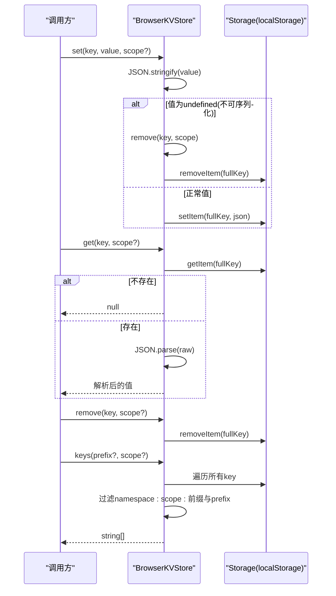

# BrowserKVStore 键值存储

<cite>
**本文引用的文件**   
- [packages/@openmaic/storage/src/kv/browser.ts](file://packages/@openmaic/storage/src/kv/browser.ts)
- [packages/@openmaic/storage/src/kv/types.ts](file://packages/@openmaic/storage/src/kv/types.ts)
- [packages/@openmaic/storage/src/index.ts](file://packages/@openmaic/storage/src/index.ts)
- [packages/@openmaic/storage/src/zustand/persist.ts](file://packages/@openmaic/storage/src/zustand/persist.ts)
- [packages/@openmaic/storage/test/kv-contract.ts](file://packages/@openmaic/storage/test/kv-contract.ts)
- [lib/pbl/v2/runtime/drain.ts](file://lib/pbl/v2/runtime/drain.ts)
</cite>

## 产品概述
BrowserKVStore 是 @openmaic/storage 包提供的浏览器端键值存储实现，基于浏览器的 Storage（默认 localStorage）构建。它通过“作用域 + 命名空间前缀”的机制，将设备级与账户级数据隔离在同一 Storage 中，避免键冲突；同时提供 get/set/remove/keys 等核心方法，并内置 JSON 序列化与 undefined 特殊处理策略，确保读取安全、行为可预期。该组件适用于：
- 设备级偏好设置（主题、语言、布局等）
- 账户级配置（用户资料、模型/提供者配置等）
- 运行时水位线、会话标识等轻量持久化场景

## 核心业务流程
- 写入流程：调用 set(key, value, scope) → 内部对 value 进行 JSON.stringify → 若结果为 undefined（如传入 undefined/函数/symbol），则视为删除操作 → 否则以 namespace:scope:key 形式写入底层 Storage。
- 读取流程：调用 get(key, scope) → 拼接完整 key → 从 Storage 读取字符串 → 若不存在返回 null → 存在则 JSON.parse 后返回。
- 删除流程：调用 remove(key, scope) → 直接移除对应 key。
- 列举流程：调用 keys(prefix, scope) → 遍历 Storage 所有 key → 筛选出以 namespace:scope: 开头的项 → 再按 prefix 过滤返回。



**图表来源** 
- [packages/@openmaic/storage/src/kv/browser.ts](file://packages/@openmaic/storage/src/kv/browser.ts)

**章节来源**
- [packages/@openmaic/storage/src/kv/browser.ts](file://packages/@openmaic/storage/src/kv/browser.ts)

## 功能模块清单
- KVScope 与 KVStore 接口
  - 职责：定义作用域类型（device/account）、默认作用域、以及 KV 操作的统一契约（get/set/remove/keys）。
  - 验收要点：默认作用域为 account；device 与 account 必须完全隔离；keys 支持按前缀过滤。
- BrowserKVStore 实现
  - 职责：基于 Storage 实现 KVStore 契约；提供命名空间前缀与作用域前缀组合的键生成策略；处理 JSON 序列化与 undefined 的特殊语义。
  - 验收要点：set(undefined) 等价于 remove；get 缺失返回 null；keys 仅返回当前作用域下的键并按 prefix 过滤。
- Zustand 持久化适配器 kvPersistStorage
  - 职责：将 KVStore 适配为 zustand persist 所需的 storage 接口，保持业务逻辑不变，仅改变字节落盘位置。
  - 验收要点：getItem/setItem/removeItem 正确映射到 KVStore；支持指定 scope；默认使用 account。
- 集成示例与测试契约
  - 职责：通过统一的测试契约验证不同后端的行为一致性；在真实运行环境中用于运行时水位线、会话 ID 等关键数据的持久化。

**章节来源**
- [packages/@openmaic/storage/src/kv/types.ts](file://packages/@openmaic/storage/src/kv/types.ts)
- [packages/@openmaic/storage/src/kv/browser.ts](file://packages/@openmaic/storage/src/kv/browser.ts)
- [packages/@openmaic/storage/src/zustand/persist.ts](file://packages/@openmaic/storage/src/zustand/persist.ts)
- [packages/@openmaic/storage/test/kv-contract.ts](file://packages/@openmaic/storage/test/kv-contract.ts)
- [lib/pbl/v2/runtime/drain.ts](file://lib/pbl/v2/runtime/drain.ts)

## 数据与状态
- 核心数据模型
  - KVScope：'device' | 'account'，区分设备本地与账户级数据。
  - KVStore：get<T>(key, scope?)、set<T>(key, value, scope?)、remove(key, scope?)、keys(prefix?, scope?)。
  - PersistedValue<S>：{ state: S; version?: number }，zustand 持久化信封结构。
- 关键状态流转
  - 写入：value → JSON.stringify → 若为 undefined 则转为删除 → 写入 Storage。
  - 读取：Storage.getItem → 若 null 返回 null → 否则 JSON.parse 返回。
  - 列举：遍历 Storage → 过滤 namespace:scope: 前缀 → 再按 prefix 过滤。
- 数据所有权边界
  - device：仅限本机，永不离开设备。
  - account：可由服务端同步跨设备，但 BrowserKVStore 只负责浏览器端落盘。

```mermaid
classDiagram
class KVScope {
<<enum>>
"device"
"account"
}
class KVStore {
+get~T~(key : string, scope? : KVScope) : Promise<T | null>
+set~T~(key : string, value : T, scope? : KVScope) : Promise<void>
+remove(key : string, scope? : KVScope) : Promise<void>
+keys(prefix? : string, scope? : KVScope) : Promise<string[]>
}
class BrowserKVStore {
-storage : Storage
-namespace : string
+constructor(options : BrowserKVStoreOptions)
-prefix(scope : KVScope) : string
-storageKey(key : string, scope : KVScope) : string
+get~T~(key : string, scope? : KVScope) : Promise<T | null>
+set~T~(key : string, value : T, scope? : KVScope) : Promise<void>
+remove(key : string, scope? : KVScope) : Promise<void>
+keys(prefix? : string, scope? : KVScope) : Promise<string[]>
}
class PersistedValue_S_ {
+state : S
+version? : number
}
class kvPersistStorage {
+getItem(name : string) : Promise<PersistedValue~S~ | null>
+setItem(name : string, value : PersistedValue~S~) : Promise<void>
+removeItem(name : string) : Promise<void>
}
BrowserKVStore ..|> KVStore : "实现"
kvPersistStorage --> KVStore : "依赖"
```

**图表来源** 
- [packages/@openmaic/storage/src/kv/types.ts](file://packages/@openmaic/storage/src/kv/types.ts)
- [packages/@openmaic/storage/src/kv/browser.ts](file://packages/@openmaic/storage/src/kv/browser.ts)
- [packages/@openmaic/storage/src/zustand/persist.ts](file://packages/@openmaic/storage/src/zustand/persist.ts)

**章节来源**
- [packages/@openmaic/storage/src/kv/types.ts](file://packages/@openmaic/storage/src/kv/types.ts)
- [packages/@openmaic/storage/src/kv/browser.ts](file://packages/@openmaic/storage/src/kv/browser.ts)
- [packages/@openmaic/storage/src/zustand/persist.ts](file://packages/@openmaic/storage/src/zustand/persist.ts)

## 关键约束与边界
- 存储作用域设计模式
  - 作用域：device（设备本地）与 account（账户级）严格隔离，键前缀包含 namespace:scope:，保证不冲突。
  - 默认作用域：未显式指定时默认为 account。
- 命名空间隔离与键前缀策略
  - 命名空间：默认 'maic'，可通过 options.namespace 自定义。
  - 键生成：fullKey = namespace + ':' + scope + ':' + key。
- 序列化与 undefined 处理
  - set 时对 value 执行 JSON.stringify；若结果为 undefined（如传入 undefined/函数/symbol），则视为删除，调用 remove。
  - get 时若 Storage 无对应 key 返回 null；存在则 JSON.parse 返回。
- 错误处理策略
  - 读取失败或损坏数据：上层应捕获异常并降级（例如 PBL drain 中遇到不可读的水位线会记录警告并回退为空对象）。
  - 并发访问：同一 key 的多次写入/读取由浏览器 Storage 串行化，无需额外锁；如需跨标签页同步需自行扩展。
- 性能特性与优化建议
  - keys() 全量遍历 Storage，时间复杂度 O(N)，N 为 Storage 总键数；建议：
    - 合理组织键名并使用前缀过滤，减少扫描范围。
    - 避免频繁枚举大量键，必要时引入索引或分桶。
  - JSON 序列化开销：大对象序列化可能阻塞主线程；建议：
    - 控制单次写入体积，拆分大对象。
    - 合并高频小写为批量更新。
  - 存储容量限制：localStorage 通常约 5–10MB；建议：
    - 仅存必要元数据与配置，二进制内容走专用存储。
- 配置与注入
  - storage：可注入任意 Storage 实例（如 sessionStorage 或测试用的内存存储），便于测试与多环境切换。
  - namespace：可自定义命名空间，避免与其他应用写入的键冲突。
- 使用示例（说明性）
  - 设备级偏好：kv.set('theme', 'dark', 'device')；后续读取 kv.get('theme', 'device')。
  - 账户级配置：kv.set('modelConfig', config, 'account')；后续读取 kv.get('modelConfig', 'account')。
  - 列举某作用域下键：kv.keys('ui:', 'device') 获取所有 ui: 前缀的设备级键。
  - 与 Zustand 集成：使用 kvPersistStorage(kv, 'device') 作为 persist 的 storage，保存 store 的 { state, version } 信封。

**章节来源**
- [packages/@openmaic/storage/src/kv/browser.ts](file://packages/@openmaic/storage/src/kv/browser.ts)
- [packages/@openmaic/storage/src/kv/types.ts](file://packages/@openmaic/storage/src/kv/types.ts)
- [packages/@openmaic/storage/src/zustand/persist.ts](file://packages/@openmaic/storage/src/zustand/persist.ts)
- [packages/@openmaic/storage/test/kv-contract.ts](file://packages/@openmaic/storage/test/kv-contract.ts)
- [lib/pbl/v2/runtime/drain.ts](file://lib/pbl/v2/runtime/drain.ts)