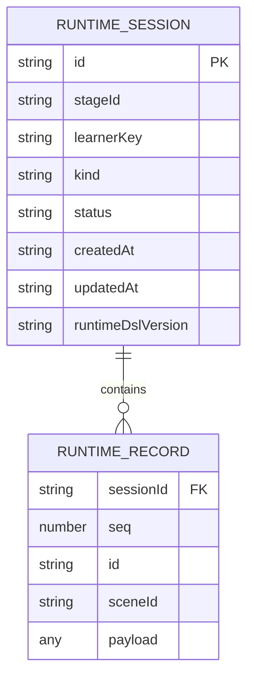
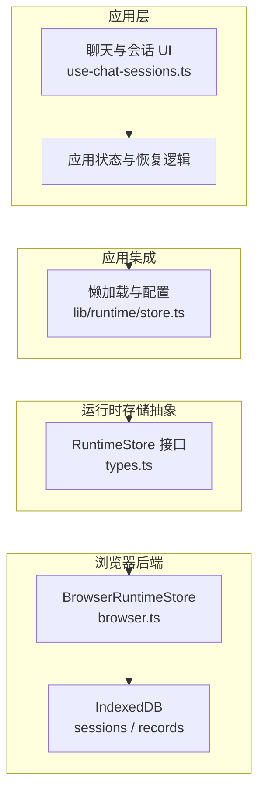
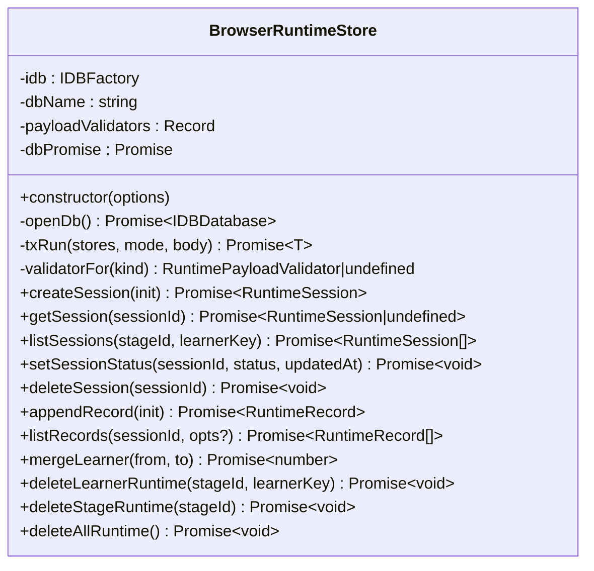
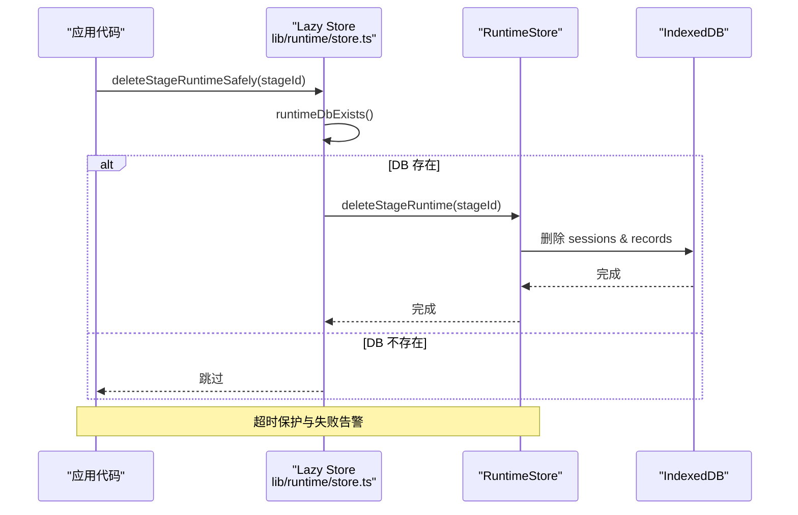
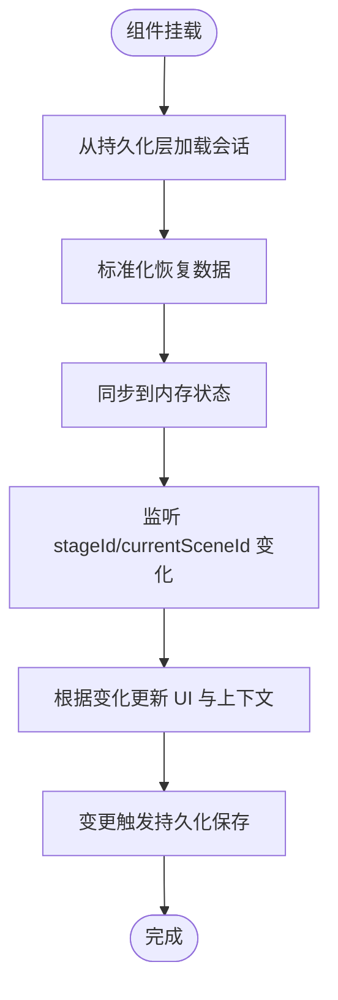
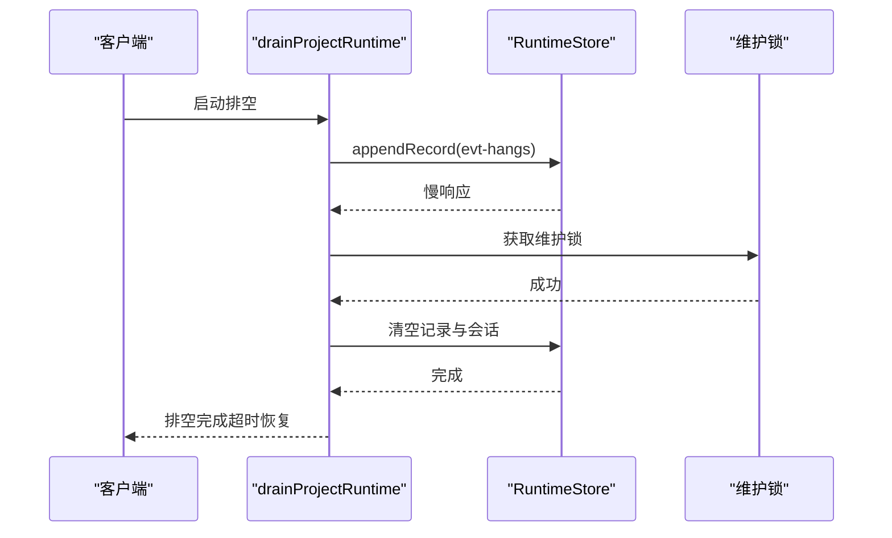
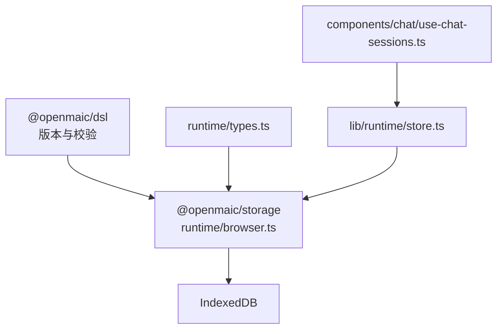

# BrowserRuntimeStore 运行时存储

<cite>
**本文引用的文件**   
- [packages/@openmaic/storage/src/runtime/browser.ts](file://packages/@openmaic/storage/src/runtime/browser.ts)
- [packages/@openmaic/storage/src/runtime/types.ts](file://packages/@openmaic/storage/src/runtime/types.ts)
- [lib/runtime/store.ts](file://lib/runtime/store.ts)
- [packages/@openmaic/storage/README.md](file://packages/@openmaic/storage/README.md)
- [components/chat/use-chat-sessions.ts](file://components/chat/use-chat-sessions.ts)
- [tests/pbl/v2/drain.test.ts](file://tests/pbl/v2/drain.test.ts)
</cite>

## 产品概述
BrowserRuntimeStore 是 OpenMAIC 的浏览器端运行时持久化后端，负责会话管理与状态持久化。它以 IndexedDB 为底层存储，提供“会话 + 追加式记录”的运行时数据模型，支持课堂状态、用户偏好与临时缓存数据的统一存取；通过版本戳与校验门控保证跨客户端一致性，并通过事务与幂等接口保障数据完整性。该模块与浏览器生命周期集成良好，支持页面刷新后的状态恢复与清理策略，同时提供可插拔的 KV 持久化适配器以支撑 Zustand 状态持久化。

## 核心业务流程
- 会话创建与生命周期管理：创建会话时由存储层自动写入运行时 DSL 版本戳并校验完整信封；支持设置会话状态（如 active/completed），并在追加记录前校验会话处于活跃状态。
- 追加式记录与排序：记录按会话维度追加，序列号 seq 由存储层在事务内单调递增分配，读取时天然有序，作为唯一回放顺序键。
- 分区隔离与合并迁移：会话按 (stageId, learnerKey) 分区列出；匿名学习者登录后可通过 mergeLearner 跨阶段重映射 learnerKey。
- 删除与清理：支持单会话删除、按学习者和阶段级联删除、整阶段清理以及全量清空；删除操作幂等且对版本无感知。
- 页面刷新恢复：应用侧从持久化层恢复会话列表与当前场景上下文，保持 UI 一致性与交互连续性。

**章节来源**
- [packages/@openmaic/storage/src/runtime/browser.ts:220-312](file://packages/@openmaic/storage/src/runtime/browser.ts#L220-L312)
- [packages/@openmaic/storage/src/runtime/browser.ts:323-390](file://packages/@openmaic/storage/src/runtime/browser.ts#L323-L390)
- [packages/@openmaic/storage/src/runtime/browser.ts:439-452](file://packages/@openmaic/storage/src/runtime/browser.ts#L439-L452)
- [lib/runtime/store.ts:86-127](file://lib/runtime/store.ts#L86-L127)
- [components/chat/use-chat-sessions.ts:499-531](file://components/chat/use-chat-sessions.ts#L499-L531)

## 功能模块清单
- 运行时会话管理
  - 职责：创建、查询、列出、更新状态、删除会话；维护运行时 DSL 版本戳与信封校验。
  - 验收要点：创建失败不写盘；列表忽略损坏行；状态更新拒绝未来版本；删除幂等。
- 追加式记录管理
  - 职责：在活跃会话下追加记录，分配单调 seq，按 sceneId 可选过滤。
  - 验收要点：仅允许 active 会话；payload 按 kind 校验；读取有序。
- 学习者合并与级联清理
  - 职责：匿名到登录用户的 learnerKey 迁移；按 stage/learner 级联删除；全量清空。
  - 验收要点：跨阶段原子迁移；删除不影响其他分区；全清幂等。
- 应用集成与懒加载
  - 职责：懒初始化 IndexedDB 实例；提供安全删除超时保护；暴露配置重置钩子。
  - 验收要点：未使用过 DB 时避免创建；删除失败告警不阻塞主流程；测试可重置。
- 状态持久化适配
  - 职责：KVStore 与 zustand persist 适配器，支持 account/device 作用域。
  - 验收要点：读写空值返回 null；作用域隔离；默认 account 作用域。

**章节来源**
- [packages/@openmaic/storage/src/runtime/types.ts:63-161](file://packages/@openmaic/storage/src/runtime/types.ts#L63-L161)
- [packages/@openmaic/storage/src/runtime/browser.ts:137-179](file://packages/@openmaic/storage/src/runtime/browser.ts#L137-L179)
- [packages/@openmaic/storage/src/runtime/browser.ts:392-437](file://packages/@openmaic/storage/src/runtime/browser.ts#L392-L437)
- [lib/runtime/store.ts:25-42](file://lib/runtime/store.ts#L25-L42)
- [packages/@openmaic/storage/README.md:33-72](file://packages/@openmaic/storage/README.md#L33-L72)

## 数据与状态
- 数据模型
  - 会话 RuntimeSession：包含 id、stageId、learnerKey、kind、status、时间戳与运行时 DSL 版本戳；由存储层在创建时注入版本戳。
  - 记录 RuntimeRecord：包含 id、sessionId、seq、sceneId、payload；seq 单调递增，作为唯一排序键。
- 索引与分区
  - sessions 对象存储：keyPath=id；索引 by-stage-learner、by-learner、by-stage。
  - records 对象存储：复合主键 ['sessionId', 'seq']，保证按会话范围读取即有序。
- 状态流转
  - 会话状态：active → completed（或其他业务状态）；仅在 active 状态下允许追加记录。
  - 版本线：运行时 DSL 版本戳确保向前兼容；读路径进行迁移，写路径拒绝未来版本。
- 数据所有权边界
  - 文档层（DocumentStore）与运行时层（RuntimeStore）分离；运行时层按 (stageId, learnerKey) 分区，无全局列举。
  - payload 内部由应用定义，通过 per-kind 校验器门控（chat、quizAttempt 默认骨架校验）。

**图表来源**
- [packages/@openmaic/storage/src/runtime/browser.ts:154-170](file://packages/@openmaic/storage/src/runtime/browser.ts#L154-L170)
- [packages/@openmaic/storage/src/runtime/types.ts:25-31](file://packages/@openmaic/storage/src/runtime/types.ts#L25-L31)

**章节来源**
- [packages/@openmaic/storage/src/runtime/browser.ts:154-170](file://packages/@openmaic/storage/src/runtime/browser.ts#L154-L170)
- [packages/@openmaic/storage/src/runtime/types.ts:25-31](file://packages/@openmaic/storage/src/runtime/types.ts#L25-L31)

## 关键约束与边界
- 版本与一致性
  - 会话“出生即带版本戳”，不存在无版本 epoch；读取迁移、写入校验，拒绝未来版本以避免降级。
  - 列表容忍损坏行（省略），但直接获取损坏行会失败（fail-loud）。
- 事务与原子性
  - 所有写操作通过 txRun 包裹，提交后才算持久化；异常回滚，保证多写原子性。
- 幂等与隔离
  - 删除接口幂等；mergeLearner 跨阶段原子迁移；分区列举避免全局扫描。
- 性能与配额
  - 记录按复合主键有序读取，避免 O(payload) 遍历；seq 分配基于 key cursor 只读整数。
  - IndexedDB 容量受浏览器限制，建议定期清理过期会话与记录（deleteStageRuntime/deleteAllRuntime）。
- 浏览器生命周期集成
  - 懒打开 IndexedDB，失败不缓存拒绝态；删除级联带超时保护，避免阻塞主流程。
  - 应用侧在 stage/scene 变化时恢复会话列表与上下文，确保刷新后体验一致。

**章节来源**
- [packages/@openmaic/storage/src/runtime/browser.ts:186-213](file://packages/@openmaic/storage/src/runtime/browser.ts#L186-L213)
- [packages/@openmaic/storage/src/runtime/browser.ts:258-289](file://packages/@openmaic/storage/src/runtime/browser.ts#L258-L289)
- [packages/@openmaic/storage/src/runtime/browser.ts:323-378](file://packages/@openmaic/storage/src/runtime/browser.ts#L323-L378)
- [lib/runtime/store.ts:44-75](file://lib/runtime/store.ts#L44-L75)
- [packages/@openmaic/storage/README.md:54-72](file://packages/@openmaic/storage/README.md#L54-L72)

## 架构总览
BrowserRuntimeStore 作为运行时存储后端，与应用层通过统一的 RuntimeStore 接口解耦；应用侧通过 lib/runtime/store.ts 懒加载实例并提供安全删除能力；UI 组件（如聊天会话）从持久化层恢复状态并与运行时事件流协同。

**图表来源**
- [packages/@openmaic/storage/src/runtime/types.ts:63-161](file://packages/@openmaic/storage/src/runtime/types.ts#L63-L161)
- [packages/@openmaic/storage/src/runtime/browser.ts:137-179](file://packages/@openmaic/storage/src/runtime/browser.ts#L137-L179)
- [lib/runtime/store.ts:25-42](file://lib/runtime/store.ts#L25-L42)
- [components/chat/use-chat-sessions.ts:499-531](file://components/chat/use-chat-sessions.ts#L499-L531)

## 详细组件分析

### 组件 A：BrowserRuntimeStore（会话与记录）
- 设计模式
  - 工厂与懒加载：openDb 延迟打开，失败不缓存拒绝态。
  - 事务封装：txRun 统一处理读写模式、提交与回滚。
  - 校验门控：createSession/appendRecord 前后均进行 envelope 校验；payload 按 kind 校验。
- 数据结构与复杂度
  - sessions：O(1) 按 id 查找；listSessions 按索引扫描并按时间戳排序。
  - records：复合主键 ['sessionId','seq']，范围读取自然有序；seq 分配基于 key cursor 常数级增量。
- 依赖链
  - 依赖 @openmaic/dsl 的版本与校验函数；实现 RuntimeStore 接口。
- 错误处理
  - 未来版本拒绝写入；损坏行在列表中被忽略，直接获取失败；删除幂等。
- 性能优化
  - 避免反序列化大 payload 计算 seq；事务提交才持久化；索引优化分区查询。

**图表来源**
- [packages/@openmaic/storage/src/runtime/browser.ts:137-179](file://packages/@openmaic/storage/src/runtime/browser.ts#L137-L179)
- [packages/@openmaic/storage/src/runtime/browser.ts:220-312](file://packages/@openmaic/storage/src/runtime/browser.ts#L220-L312)
- [packages/@openmaic/storage/src/runtime/browser.ts:323-390](file://packages/@openmaic/storage/src/runtime/browser.ts#L323-L390)
- [packages/@openmaic/storage/src/runtime/browser.ts:392-452](file://packages/@openmaic/storage/src/runtime/browser.ts#L392-L452)

**章节来源**
- [packages/@openmaic/storage/src/runtime/browser.ts:137-179](file://packages/@openmaic/storage/src/runtime/browser.ts#L137-L179)
- [packages/@openmaic/storage/src/runtime/browser.ts:220-312](file://packages/@openmaic/storage/src/runtime/browser.ts#L220-L312)
- [packages/@openmaic/storage/src/runtime/browser.ts:323-390](file://packages/@openmaic/storage/src/runtime/browser.ts#L323-L390)
- [packages/@openmaic/storage/src/runtime/browser.ts:392-452](file://packages/@openmaic/storage/src/runtime/browser.ts#L392-L452)

### 组件 B：应用集成与懒加载（lib/runtime/store.ts）
- 职责
  - 懒加载 RuntimeStore 实例；提供 deleteStageRuntimeSafely 与 beginStageRuntimeDeletionSafely 安全删除；注册重置钩子。
- 关键行为
  - runtimeDbExists 探测数据库是否存在，避免未使用情况下创建 DB。
  - withTimeout 控制删除超时，防止挂起影响主流程。
- 使用示例
  - 在文档删除时调用 deleteStageRuntimeSafely(stageId) 清理运行时数据。

**图表来源**
- [lib/runtime/store.ts:44-75](file://lib/runtime/store.ts#L44-L75)
- [lib/runtime/store.ts:86-127](file://lib/runtime/store.ts#L86-L127)

**章节来源**
- [lib/runtime/store.ts:25-42](file://lib/runtime/store.ts#L25-L42)
- [lib/runtime/store.ts:44-75](file://lib/runtime/store.ts#L44-L75)
- [lib/runtime/store.ts:86-127](file://lib/runtime/store.ts#L86-L127)

### 组件 C：UI 状态恢复与同步（components/chat/use-chat-sessions.ts）
- 职责
  - 监听 stageId/currentSceneId 变化，从持久化层恢复会话列表与上下文；将内存中的会话同步回 store 以持久化。
- 关键行为
  - normalizeStoredSessionsForRestore 标准化恢复数据；setChats 触发 debouncedSave。
- 使用示例
  - 页面刷新后，UI 自动恢复上次会话与场景，保持交互连续性。

**图表来源**
- [components/chat/use-chat-sessions.ts:499-531](file://components/chat/use-chat-sessions.ts#L499-L531)

**章节来源**
- [components/chat/use-chat-sessions.ts:499-531](file://components/chat/use-chat-sessions.ts#L499-L531)

### 组件 D：运行时事件排空与冲突解决（tests/pbl/v2/drain.test.ts）
- 职责
  - 演示 drainProjectRuntime 的行为：在 append 慢或并发维护锁下的恢复与修复。
- 关键行为
  - 超时恢复：append 超时后后续 drain 仍可继续；维护锁期间清空记录与会话。
- 使用示例
  - 在高并发或网络不稳定场景下，确保运行时事件最终一致。

**图表来源**
- [tests/pbl/v2/drain.test.ts:865-909](file://tests/pbl/v2/drain.test.ts#L865-L909)

**章节来源**
- [tests/pbl/v2/drain.test.ts:865-909](file://tests/pbl/v2/drain.test.ts#L865-L909)

## 依赖分析
- 组件耦合
  - BrowserRuntimeStore 依赖 @openmaic/dsl 的版本与校验函数；实现 RuntimeStore 接口。
  - lib/runtime/store.ts 依赖 BrowserRuntimeStore 默认实现，提供懒加载与安全删除。
  - UI 组件通过 useStageStore 与持久化层交互，不直接依赖 IndexedDB。
- 外部依赖
  - IndexedDB 作为底层存储；浏览器环境提供 indexedDB API。
- 潜在循环依赖
  - storage 包仅依赖 dsl，无 React/zustand 依赖，保持解耦。

**图表来源**
- [packages/@openmaic/storage/src/runtime/browser.ts:12-21](file://packages/@openmaic/storage/src/runtime/browser.ts#L12-L21)
- [packages/@openmaic/storage/src/runtime/types.ts:25-31](file://packages/@openmaic/storage/src/runtime/types.ts#L25-L31)
- [lib/runtime/store.ts:10-18](file://lib/runtime/store.ts#L10-L18)
- [components/chat/use-chat-sessions.ts:499-531](file://components/chat/use-chat-sessions.ts#L499-L531)

**章节来源**
- [packages/@openmaic/storage/src/runtime/browser.ts:12-21](file://packages/@openmaic/storage/src/runtime/browser.ts#L12-L21)
- [packages/@openmaic/storage/src/runtime/types.ts:25-31](file://packages/@openmaic/storage/src/runtime/types.ts#L25-L31)
- [lib/runtime/store.ts:10-18](file://lib/runtime/store.ts#L10-L18)
- [components/chat/use-chat-sessions.ts:499-531](file://components/chat/use-chat-sessions.ts#L499-L531)

## 性能考虑
- 读取优化：records 复合主键保证范围读取有序，避免额外排序。
- 写入优化：seq 分配基于 key cursor 只读整数，避免反序列化大 payload。
- 事务优化：txRun 确保提交才持久化，失败回滚，减少无效 IO。
- 容量管理：定期清理过期会话与记录，避免 IndexedDB 容量超限。

[本节为通用指导，无需引用具体文件]

## 故障排查指南
- 常见问题
  - 无法打开 IndexedDB：检查私有模式或 VersionError；重试机制已内置。
  - 会话不存在：确认 sessionId 正确且未被删除；列表忽略损坏行，直接获取失败。
  - 追加记录失败：检查会话状态是否为 active；payload 是否符合 kind 校验。
- 调试工具
  - 使用浏览器开发者工具查看 IndexedDB 内容；检查 sessions/records 表。
  - 启用日志输出，观察 append 慢响应与超时恢复。
- 监控指标
  - 记录数量与会话数量；append 成功率与平均耗时；删除操作耗时与失败率。

**章节来源**
- [packages/@openmaic/storage/src/runtime/browser.ts:149-179](file://packages/@openmaic/storage/src/runtime/browser.ts#L149-L179)
- [packages/@openmaic/storage/src/runtime/browser.ts:258-289](file://packages/@openmaic/storage/src/runtime/browser.ts#L258-L289)
- [packages/@openmaic/storage/src/runtime/browser.ts:323-378](file://packages/@openmaic/storage/src/runtime/browser.ts#L323-L378)
- [lib/runtime/store.ts:44-75](file://lib/runtime/store.ts#L44-L75)

## 结论
BrowserRuntimeStore 提供了健壮、可扩展的运行时存储后端，满足会话管理与状态持久化的核心需求。通过版本线、事务与幂等接口，确保数据一致性与可靠性；与浏览器生命周期深度集成，支持刷新恢复与清理策略。结合 UI 层的状态同步与事件排空机制，形成完整的运行时数据闭环。

[本节为总结，无需引用具体文件]