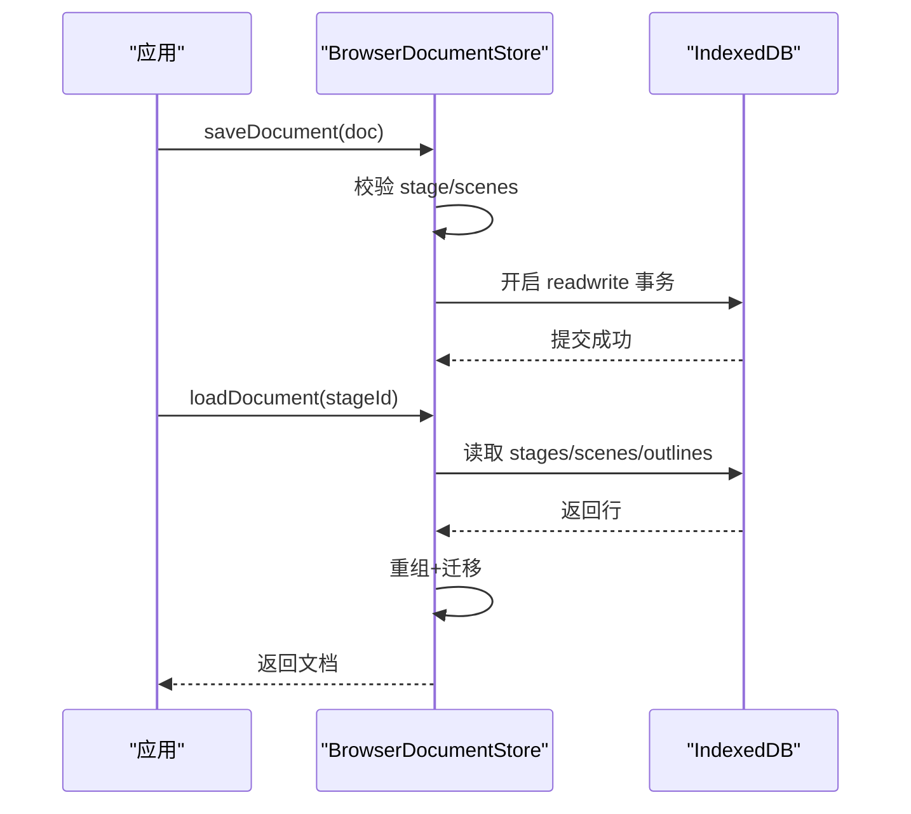
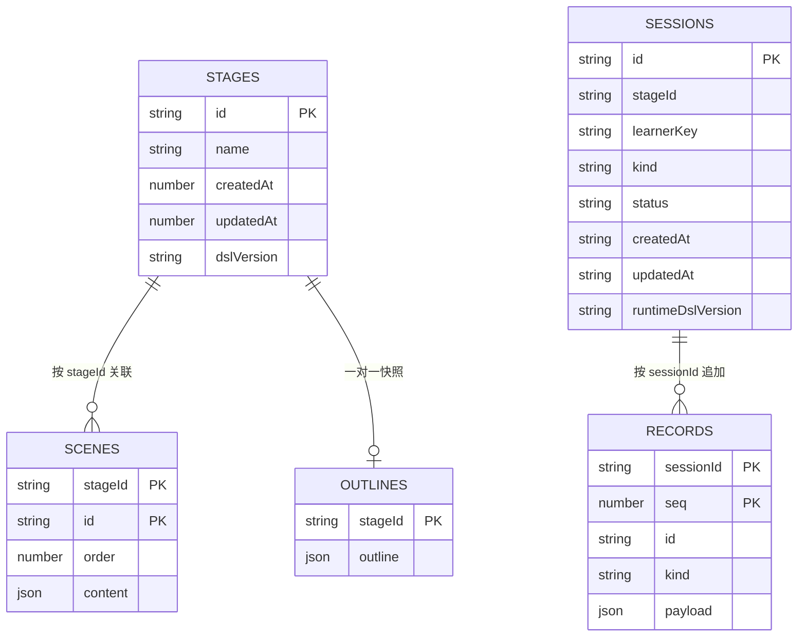

# IndexedDB 持久化存储

<cite>
**本文引用的文件**
- [packages/@openmaic/storage/src/index.ts](file://packages/@openmaic/storage/src/index.ts)
- [packages/@openmaic/storage/src/kv/types.ts](file://packages/@openmaic/storage/src/kv/types.ts)
- [packages/@openmaic/storage/src/kv/browser.ts](file://packages/@openmaic/storage/src/kv/browser.ts)
- [packages/@openmaic/storage/src/document/types.ts](file://packages/@openmaic/storage/src/document/types.ts)
- [packages/@openmaic/storage/src/document/adapter.ts](file://packages/@openmaic/storage/src/document/adapter.ts)
- [packages/@openmaic/storage/src/document/browser.ts](file://packages/@openmaic/storage/src/document/browser.ts)
- [packages/@openmaic/storage/src/runtime/types.ts](file://packages/@openmaic/storage/src/runtime/types.ts)
- [packages/@openmaic/storage/src/runtime/browser.ts](file://packages/@openmaic/storage/src/runtime/browser.ts)
- [packages/@openmaic/storage/src/zustand/persist.ts](file://packages/@openmaic/storage/src/zustand/persist.ts)
- [tests/pbl/v2/drain.test.ts](file://tests/pbl/v2/drain.test.ts)
- [e2e/tests/interactive-iframe-keepalive-619.spec.ts](file://e2e/tests/interactive-iframe-keepalive-619.spec.ts)
</cite>

## 产品概述
本仓库的 @openmaic/storage 包提供浏览器端的可插拔持久化层，核心目标是为 MAIC 课件与运行时数据提供稳定、可扩展、版本安全的本地存储能力。它包含：
- KV 键值存储抽象与浏览器后端（基于 Storage API）
- 文档聚合持久化（IndexedDB），支持 DSL 校验、迁移与索引优化
- 运行时会话与追加记录（IndexedDB），支持多租户分区、版本守卫与幂等删除
- Zustand 持久化适配器，便于将状态树落盘到 KV 或 IndexedDB

适用场景：
- 课件编辑与离线可用：文档级 CRUD、增量场景写入、列表摘要
- 课堂互动回放：会话生命周期管理、事件追加与回放、学习者身份合并
- 设备/账户双域配置：设备端偏好与账户级配置的隔离与同步边界

## 核心业务流程
- 文档保存流程
  - 输入 MaicDocument → 校验 stage/scenes → 拆分行 → 事务写入 stages/scenes/outlines → 失败回滚
- 文档加载流程
  - 读取 stage + scenes + outlines → 重组为文档 → 按 DSL 版本迁移 → 返回当前版本文档
- 运行时会话创建与追加
  - createSession 打版本戳并校验 → appendRecord 在事务内分配 seq → 按 kind 校验 payload
- 列表与清理
  - listDocuments/listSessions 仅读且容忍脏数据；delete* 系列为粗粒度操作，幂等且版本无关

图表来源
- [packages/@openmaic/storage/src/document/browser.ts](file://packages/@openmaic/storage/src/document/browser.ts)
- [packages/@openmaic/storage/src/document/adapter.ts](file://packages/@openmaic/storage/src/document/adapter.ts)

章节来源
- [packages/@openmaic/storage/src/document/browser.ts](file://packages/@openmaic/storage/src/document/browser.ts)
- [packages/@openmaic/storage/src/document/adapter.ts](file://packages/@openmaic/storage/src/document/adapter.ts)

## 功能模块清单
- BrowserKVStore（KV 键值存储）
  - 职责：以 Storage（默认 localStorage）为后端，提供 get/set/remove/keys，支持 device/account 作用域隔离
  - 验收要点：scope 前缀不冲突、JSON 序列化安全、keys 支持前缀过滤
- BrowserDocumentStore（文档持久化）
  - 职责：对 MaicDocument 进行规范化拆分与重组，DSL 校验与迁移，IndexedDB 三表设计（stages/scenes/outlines）
  - 验收要点：复合主键、索引查询、事务原子性、未来版本保护、增量 putScene/getScene/deleteScene
- BrowserRuntimeStore（运行时持久化）
  - 职责：会话与追加记录持久化，按 learnerKey/stageId 分区，payload 按 kind 校验，seq 单调递增
  - 验收要点：createSession 唯一性、appendRecord 事务内分配 seq、listRecords 有序、mergeLearner 原子迁移
- kvPersistStorage（Zustand 持久化适配器）
  - 职责：将 Zustand persist 适配到 KV 或 IndexedDB，支持 scope 注入与 {state, version} 信封

章节来源
- [packages/@openmaic/storage/src/kv/browser.ts](file://packages/@openmaic/storage/src/kv/browser.ts)
- [packages/@openmaic/storage/src/document/browser.ts](file://packages/@openmaic/storage/src/document/browser.ts)
- [packages/@openmaic/storage/src/runtime/browser.ts](file://packages/@openmaic/storage/src/runtime/browser.ts)
- [packages/@openmaic/storage/src/zustand/persist.ts](file://packages/@openmaic/storage/src/zustand/persist.ts)

## 数据与状态
- 数据模型
  - KV 键值：任意 JSON 可序列化值，key 由 namespace:scope:key 组成
  - 文档模型：MaicDocument（stage + scenes + outline + dslVersion）
  - 运行时模型：RuntimeSession（含 runtimeDslVersion）与 RuntimeRecord（含 seq）
- 关键状态流转
  - 文档：saveDocument → splitDocument → 写入三表；loadDocument → reassembleDocument → migrateDocument
  - 运行时：createSession（打版本戳）→ appendRecord（分配 seq，校验 payload）→ listRecords（按 seq 顺序）
- 数据所有权边界
  - 文档层：DSL 拥有实体形状与迁移；存储层负责“在哪里/如何”持久化
  - 运行层：会话由存储层打版本戳，记录无独立版本，跟随父会话

图表来源
- [packages/@openmaic/storage/src/document/browser.ts](file://packages/@openmaic/storage/src/document/browser.ts)
- [packages/@openmaic/storage/src/runtime/browser.ts](file://packages/@openmaic/storage/src/runtime/browser.ts)

章节来源
- [packages/@openmaic/storage/src/document/types.ts](file://packages/@openmaic/storage/src/document/types.ts)
- [packages/@openmaic/storage/src/document/adapter.ts](file://packages/@openmaic/storage/src/document/adapter.ts)
- [packages/@openmaic/storage/src/runtime/types.ts](file://packages/@openmaic/storage/src/runtime/types.ts)

## 关键约束与边界
- 版本控制与迁移
  - 文档：read-migrate-on-load，写时拒绝覆盖未来版本；putScene 要求文档已处于当前版本
  - 运行时：会话由存储层打版本戳；appendRecord 会迁移父会话后再写入
- 数据验证
  - 文档：validateStage + validateScene（可注入自定义 SceneValidator）
  - 运行时：validateRuntimeSession/Record + per-kind payload 校验（chat/quizAttempt 骨架默认守卫）
- 错误处理
  - 所有写路径在事务中执行，异常即回滚；失败抛错包含详细路径与消息
  - 列表接口容忍脏数据（跳过损坏条目），直接读取则 fail-loud
- 性能与索引
  - 文档：scenes 使用复合主键 (stageId, id)，by-stage 索引加速按阶段查询；listDocuments 仅读摘要
  - 运行时：records 复合主键 (sessionId, seq) 保证追加有序；listRecords 无需额外排序
- 并发与一致性
  - 通过 IndexedDB 事务保证原子性与隔离性；避免 TOCTOU（如 createSession 重复检查在事务内）
- 使用示例与最佳实践
  - 使用 BrowserKVStore 做设备/账户配置隔离；kvPersistStorage 对接 Zustand 持久化
  - 文档编辑优先使用 putScene/getScene 增量操作，批量变更用 saveDocument
  - 运行时 appendRecord 仅在 active 会话写入；跨学习者迁移使用 mergeLearner

章节来源
- [packages/@openmaic/storage/src/document/browser.ts](file://packages/@openmaic/storage/src/document/browser.ts)
- [packages/@openmaic/storage/src/runtime/browser.ts](file://packages/@openmaic/storage/src/runtime/browser.ts)
- [packages/@openmaic/storage/src/kv/browser.ts](file://packages/@openmaic/storage/src/kv/browser.ts)
- [packages/@openmaic/storage/src/zustand/persist.ts](file://packages/@openmaic/storage/src/zustand/persist.ts)
- [tests/pbl/v2/drain.test.ts](file://tests/pbl/v2/drain.test.ts)
- [e2e/tests/interactive-iframe-keepalive-619.spec.ts](file://e2e/tests/interactive-iframe-keepalive-619.spec.ts)