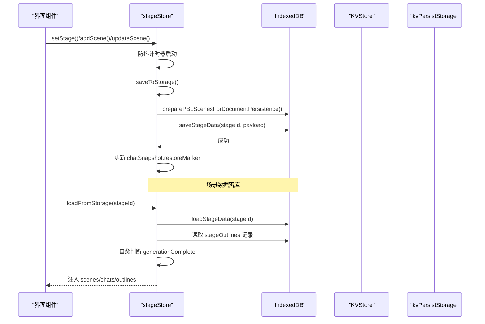
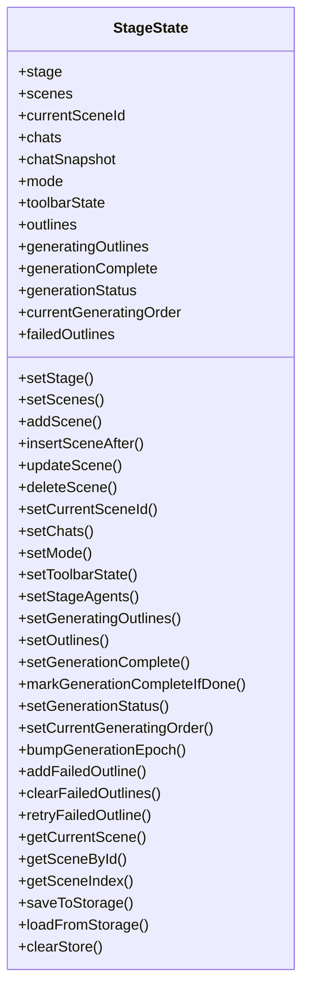
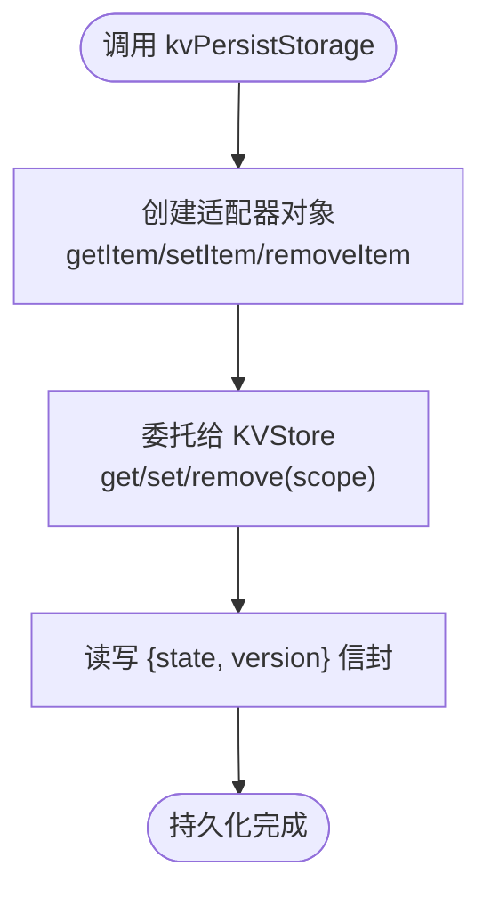
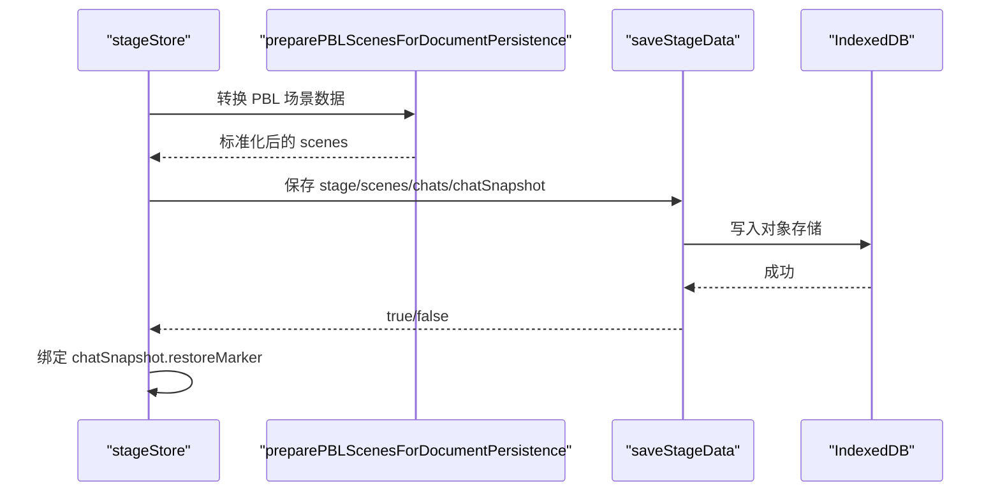

# Zustand 状态管理

<cite>
**本文引用的文件**   
- [lib/store/stage.ts](file://lib/store/stage.ts)
- [packages/@openmaic/storage/src/zustand/persist.ts](file://packages/@openmaic/storage/src/zustand/persist.ts)
- [packages/@openmaic/storage/src/index.ts](file://packages/@openmaic/storage/src/index.ts)
- [packages/@openmaic/storage/src/kv/types.ts](file://packages/@openmaic/storage/src/kv/types.ts)
- [lib/store/canvas.ts](file://lib/store/canvas.ts)
</cite>

## 产品概述
OpenMAIC 是一个 AI 驱动的交互式课件（MAIC）生成与课堂管理平台，前端基于 Next.js + React + Zustand。Zustand 在本项目中承担全局 UI 与业务状态的核心职责：课堂阶段（Stage）、幻灯片场景（Scene）、聊天会话（Chat）、编辑模式、工具栏状态以及生成流程的中间态等。通过切片化 store、防抖持久化、IndexedDB 存储与 kvPersistStorage 中间件，项目实现了高内聚、低耦合、可恢复的状态管理与数据持久化体系。

## 核心业务流程
- 创建/切换 Stage：重置并初始化 stage、scenes、chats 等状态，触发防抖保存。
- 场景增删改：插入、更新、删除场景时进行内容迁移与顺序重排，自动选择当前场景，触发防抖保存。
- 生成流程：维护 outlines、generatingOutlines、generationStatus、failedOutlines 等状态；完成时标记 generationComplete 并持久化。
- 加载与恢复：从 IndexedDB 加载 stage/scenes/chats，合并 outlines 记录，执行“自愈”逻辑判断是否已完成，避免重复再生成。
- 聊天快照：saveToStorage 成功后绑定 chatSnapshot.restoreMarker，确保后续增量写入不覆盖已恢复快照。

图表来源 
- [lib/store/stage.ts:163-573](file://lib/store/stage.ts#L163-L573)
- [lib/store/stage.ts:418-553](file://lib/store/stage.ts#L418-L553)

章节来源
- [lib/store/stage.ts:163-573](file://lib/store/stage.ts#L163-L573)
- [lib/store/stage.ts:418-553](file://lib/store/stage.ts#L418-L553)

## 功能模块清单
- 舞台与场景管理（Stage & Scenes）
  - 职责：维护 stage、scenes、currentSceneId、mode、toolbarState 等；提供 add/insert/update/delete 等操作；自动迁移与顺序重排；防抖持久化。
  - 用户价值：保证课件结构一致性与操作流畅性，避免频繁 IO。
  - 验收要点：新增/删除后 currentSceneId 正确；order 连续；跨 stage 变更被忽略；保存失败不影响 UI。
- 聊天与会话（Chats & Snapshot）
  - 职责：维护 chats 与 chatSnapshot（含 restoreMarker），在保存成功后绑定快照，防止覆盖。
  - 用户价值：保障对话历史一致性，支持断点恢复。
  - 验收要点：多次保存后 restoreMarker 稳定；异常时回退到上次成功快照。
- 生成流程（Outlines & Generation）
  - 职责：跟踪 generatingOutlines、outlines、generationStatus、failedOutlines、generationComplete；完成时持久化标志。
  - 用户价值：支持中断恢复、失败重试、完成态保护。
  - 验收要点：完成态不被误覆盖；失败列表可清理并重试。
- 存储与持久化（Storage）
  - 职责：saveToStorage/loadFromStorage 封装 IndexedDB 读写；preparePBLScenesForDocumentPersistence 预处理 PBL 场景；chatSnapshot 绑定。
  - 用户价值：统一持久化入口，简化调用方复杂度。
  - 验收要点：异步加载竞态安全（loadToken）；旧数据迁移正常；错误日志完善。
- 画布 UI 状态（Canvas Store）
  - 职责：管理编辑器 UI 状态（选中、视口、工具栏、富文本格式等），与场景数据解耦。
  - 用户价值：提升编辑器交互性能与可维护性。
  - 验收要点：切换 mode='edit' 退出时重置画布状态。

章节来源
- [lib/store/stage.ts:82-149](file://lib/store/stage.ts#L82-L149)
- [lib/store/stage.ts:163-573](file://lib/store/stage.ts#L163-L573)
- [lib/store/canvas.ts:1-47](file://lib/store/canvas.ts#L1-L47)

## 数据与状态
- 核心状态模型（StageState）
  - stage：当前课件阶段元信息
  - scenes：场景数组，包含 order/title/content 等
  - currentSceneId：当前场景 ID
  - chats/chatSnapshot：聊天会话与快照（含 restoreMarker）
  - mode/toolbarState：运行模式与工具栏状态
  - outlines/generatingOutlines：大纲与生成中大纲
  - generationComplete/generationStatus/currentGeneratingOrder/failedOutlines：生成控制与失败集合
- 关键状态流转
  - setStage：清空 scenes/chats/outlines，递增 generationEpoch，触发防抖保存
  - addScene/insertSceneAfter/updateScene：内容迁移、顺序重排、自动选择场景、防抖保存
  - deleteScene：保持 completion 语义，必要时保留 generationComplete
  - setGenerationComplete：先保存场景再写标志，确保一致性
  - loadFromStorage：跳过内存已有数据、读取 outlines、自愈判断、归一化媒体 URL、重置 mode
- 数据所有权边界
  - 场景数据由 stageStore 负责持久化；聊天快照由 saveToStorage 成功后绑定；生成相关标志与 outlines 由 stageOutlines 记录；UI 状态（如 mode）不随 stage 持久化。

图表来源 
- [lib/store/stage.ts:82-149](file://lib/store/stage.ts#L82-L149)
- [lib/store/stage.ts:163-573](file://lib/store/stage.ts#L163-L573)

章节来源
- [lib/store/stage.ts:82-149](file://lib/store/stage.ts#L82-L149)
- [lib/store/stage.ts:163-573](file://lib/store/stage.ts#L163-L573)

## 关键约束与边界
- 非功能性需求
  - 性能：使用 debounce 降低高频写入；loadFromStorage 支持内存优先跳过；结构化克隆避免引用污染。
  - 可靠性：异步加载 token 机制避免竞态；自愈逻辑保证完成态一致性；错误日志与回退策略。
  - 可维护性：store 切片清晰，UI 与数据分离；迁移函数集中处理 schema 版本。
- 依赖与集成边界
  - IndexedDB：通过 @openmaic/storage 的 BrowserKVStore/BrowserDocumentStore 抽象；kvPersistStorage 适配 zustand persist。
  - KVScope：account/device 区分跨设备同步与本地偏好，确保敏感数据不越界。
- 业务约束
  - 生成完成后禁止编辑（Pro-mode 编辑门控）；order 必须连续；媒体 URL 需归一化；聊天快照不可被覆盖。

章节来源
- [packages/@openmaic/storage/src/kv/types.ts:1-24](file://packages/@openmaic/storage/src/kv/types.ts#L1-L24)
- [packages/@openmaic/storage/src/index.ts:1-42](file://packages/@openmaic/storage/src/index.ts#L1-L42)

## kvPersistStorage 中间件实现原理
- 设计目标
  - 将 zustand 的 persist 中间件从 localStorage 迁移到 KVStore 后端，使部署环境可替换存储（浏览器/服务器同步）。
  - 保持业务 store 的 version/migrate/merge 逻辑不变，仅改变字节落盘位置。
- 数据结构
  - PersistedValue<S>：{ state: S; version?: number } 信封，zustand persist 标准读写格式。
  - PersistStorageLike<S>：getItem/setItem/removeItem 三件套，适配 persist 接口。
- 实现要点
  - kvPersistStorage(kv, scope) 返回适配器，内部直接委托 KVStore.get/set/remove，scope 默认 account。
  - 序列化由 KVStore 负责，避免双重 JSON 编码；值类型需为 JSON 可序列化。
- 使用方式
  - 在 create 的 persist 配置中传入 storage: kvPersistStorage(kv, 'account')，name 作为键名。
  - device 作用域用于本地 UI 偏好，不会跨设备同步。

图表来源 
- [packages/@openmaic/storage/src/zustand/persist.ts:1-44](file://packages/@openmaic/storage/src/zustand/persist.ts#L1-L44)
- [packages/@openmaic/storage/src/kv/types.ts:1-24](file://packages/@openmaic/storage/src/kv/types.ts#L1-L24)

章节来源
- [packages/@openmaic/storage/src/zustand/persist.ts:1-44](file://packages/@openmaic/storage/src/zustand/persist.ts#L1-L44)
- [packages/@openmaic/storage/src/index.ts:1-42](file://packages/@openmaic/storage/src/index.ts#L1-L42)
- [packages/@openmaic/storage/src/kv/types.ts:1-24](file://packages/@openmaic/storage/src/kv/types.ts#L1-L24)

## stage-storage 工具函数使用方法
- 存储（saveStageData）
  - 输入：stageId、payload（stage/scenes/currentSceneId/chats/chatSnapshot）
  - 行为：准备 PBL 场景数据、写入 IndexedDB、成功后绑定 chatSnapshot.restoreMarker
  - 返回值：Promise<boolean> 表示是否成功
- 检索（loadStageData）
  - 输入：stageId
  - 行为：读取 stage/scenes/chats/chatSnapshot；读取 stageOutlines 记录；自愈判断 generationComplete；归一化媒体 URL；重置 mode
  - 输出：标准化后的数据对象
- 典型用法
  - 在 stageStore.saveToStorage 中调用 saveStageData；在 loadFromStorage 中调用 loadStageData
  - 结合 preparePBLScenesForDocumentPersistence 与 hydratePBLScenesFromRuntime 进行数据转换

图表来源 
- [lib/store/stage.ts:418-453](file://lib/store/stage.ts#L418-L453)
- [lib/store/stage.ts:455-553](file://lib/store/stage.ts#L455-L553)

章节来源
- [lib/store/stage.ts:418-553](file://lib/store/stage.ts#L418-L553)

## 状态管理最佳实践
- 切片化与职责单一
  - 按领域拆分 store（stage、canvas、settings 等），减少耦合与重渲染范围。
- 防抖与批量更新
  - 高频操作（如 setCurrentSceneId、updateScene）使用 debounce 降低 IO 压力。
- 幂等与自愈
  - loadFromStorage 支持内存优先与 token 竞态保护；自愈逻辑保证 generationComplete 一致性。
- 快照与恢复
  - 使用 chatSnapshot.restoreMarker 绑定成功写入，避免覆盖；失败时回退到上次快照。
- 迁移与兼容
  - migrateScene/hydratePBLScenesFromRuntime 集中处理 schema 版本与兼容性。
- 调试技巧
  - 利用 createLogger 输出关键路径日志；在测试中 mock stage-storage/database 验证边界条件。
- 性能优化
  - 避免深层嵌套订阅；使用 createSelectors 精确选择子状态；减少不必要的 structuredClone。

章节来源
- [lib/store/stage.ts:163-573](file://lib/store/stage.ts#L163-L573)
- [lib/store/canvas.ts:1-47](file://lib/store/canvas.ts#L1-L47)

## 结论
本项目通过 Zustand 切片化 store、kvPersistStorage 中间件与 IndexedDB 持久化，构建了高内聚、可扩展、可恢复的全局状态管理体系。stage-store 作为核心，统一管理课件阶段、场景、聊天与生成流程，配合防抖、自愈、快照与迁移机制，确保了用户体验与数据一致性。未来可进一步扩展 KVStore 后端以支持多端同步与离线缓存。