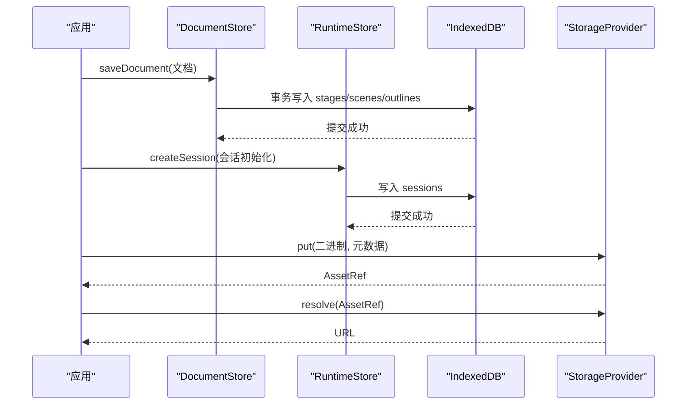
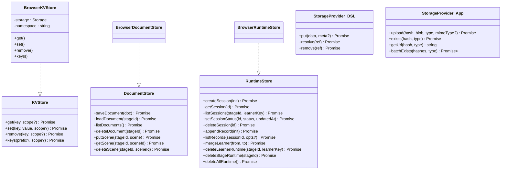
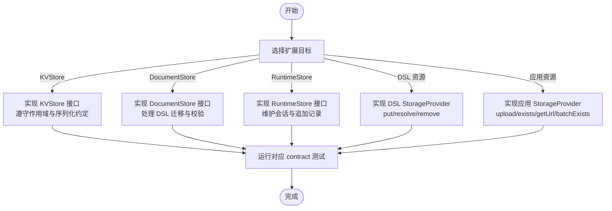

# 存储 API 接口

<cite>
**本文引用的文件**   
- [packages/@openmaic/storage/src/index.ts](file://packages/@openmaic/storage/src/index.ts)
- [packages/@openmaic/storage/src/kv/types.ts](file://packages/@openmaic/storage/src/kv/types.ts)
- [packages/@openmaic/storage/src/kv/browser.ts](file://packages/@openmaic/storage/src/kv/browser.ts)
- [packages/@openmaic/storage/src/document/types.ts](file://packages/@openmaic/storage/src/document/types.ts)
- [packages/@openmaic/storage/src/document/browser.ts](file://packages/@openmaic/storage/src/document/browser.ts)
- [packages/@openmaic/storage/src/runtime/types.ts](file://packages/@openmaic/storage/src/runtime/types.ts)
- [packages/@openmaic/storage/src/runtime/browser.ts](file://packages/@openmaic/storage/src/runtime/browser.ts)
- [packages/@openmaic/dsl/src/storage.ts](file://packages/@openmaic/dsl/src/storage.ts)
- [lib/storage/types.ts](file://lib/storage/types.ts)
- [lib/storage/providers/noop.ts](file://lib/storage/providers/noop.ts)
- [lib/storage/index.ts](file://lib/storage/index.ts)
</cite>

## 产品概述
本仓库的“存储 API”为 OpenMAIC 提供可插拔的前端持久化层，覆盖三类核心能力：
- KVStore：轻量键值存储（浏览器 localStorage/sessionStorage 后端），用于用户偏好、配置等小对象。
- DocumentStore：课件文档聚合（Stage + Scenes + Outline）的规范化读写、版本迁移与校验。
- RuntimeStore：运行时会话与追加式记录（append-only），支持按学习者/课堂分区、版本守卫与载荷校验。

此外，DSL 包定义了跨后端的“资源存储契约”（StorageProvider），由上层应用按需实现（如媒体上传、CDN 解析）。

适用场景：
- 无服务器或弱网络环境下的本地持久化（IndexedDB/localStorage）。
- 多端同步前端的统一数据访问抽象（KVScope 区分设备级与账户级数据）。
- 课件编辑与回放过程中的强一致性与版本演进保障。

**章节来源**
- [packages/@openmaic/storage/src/index.ts:1-42](file://packages/@openmaic/storage/src/index.ts#L1-L42)
- [packages/@openmaic/dsl/src/storage.ts:1-62](file://packages/@openmaic/dsl/src/storage.ts#L1-L62)

## 核心业务流程
- 课件保存与加载
  - 保存：校验 Stage/Scene → 拆分行写入 IndexedDB → 删除不再存在的场景 → 原子提交。
  - 加载：读取三张表 → 重组文档 → 向前迁移至当前 DSL 版本 → 返回。
- 运行时会话
  - 创建会话：打版本戳 → 校验完整信封 → 写入会话表。
  - 追加记录：校验信封与载荷 → 分配单调 seq → 写入记录表。
  - 列表/查询：按索引扫描并排序，容忍损坏行（列表忽略，直接读取失败）。
- 资源存取
  - 通过 StorageProvider 将二进制转为稳定引用（建议内容寻址哈希），渲染时解析为 URL。

**图表来源**
- [packages/@openmaic/storage/src/document/browser.ts:210-293](file://packages/@openmaic/storage/src/document/browser.ts#L210-L293)
- [packages/@openmaic/storage/src/runtime/browser.ts:220-238](file://packages/@openmaic/storage/src/runtime/browser.ts#L220-L238)
- [packages/@openmaic/dsl/src/storage.ts:54-61](file://packages/@openmaic/dsl/src/storage.ts#L54-L61)

**章节来源**
- [packages/@openmaic/storage/src/document/browser.ts:295-334](file://packages/@openmaic/storage/src/document/browser.ts#L295-L334)
- [packages/@openmaic/storage/src/runtime/browser.ts:258-289](file://packages/@openmaic/storage/src/runtime/browser.ts#L258-L289)

## 功能模块清单
- KVStore（键值存储）
  - 职责：JSON 序列化的小对象持久化；支持 device/account 双作用域；默认 scope=account。
  - 关键方法：get/set/remove/keys。
  - 浏览器实现：BrowserKVStore，基于 Storage（默认 localStorage），key 前缀隔离作用域。
- DocumentStore（课件文档）
  - 职责：DSL 文档聚合的规范化存储、版本迁移、场景增量操作。
  - 关键方法：saveDocument/loadDocument/listDocuments/deleteDocument/putScene/getScene/deleteScene。
  - 浏览器实现：BrowserDocumentStore，使用 IndexedDB（stages/scenes/outlines 及索引）。
- RuntimeStore（运行时会话）
  - 职责：会话生命周期管理、追加式记录、按 stageId/learnerKey 分区、版本守卫与载荷校验。
  - 关键方法：createSession/getSession/listSessions/setSessionStatus/deleteSession/appendRecord/listRecords/mergeLearner/deleteLearnerRuntime/deleteStageRuntime/deleteAllRuntime。
  - 浏览器实现：BrowserRuntimeStore，使用 IndexedDB（sessions/records 及多个索引）。
- 资源存储契约（DSL 定义）
  - 职责：二进制资源的稳定引用与 URL 解析，保持文档可移植性。
  - 关键类型/接口：AssetRef、BinaryBlob、StorageProvider（put/resolve/remove）。
- 应用侧存储提供者（lib/storage）
  - 职责：面向媒体/海报/音频的上传与存在性检查，提供 Noop 默认实现。
  - 关键接口：StorageProvider（upload/exists/getUrl/batchExists）。

**章节来源**
- [packages/@openmaic/storage/src/kv/types.ts:1-24](file://packages/@openmaic/storage/src/kv/types.ts#L1-L24)
- [packages/@openmaic/storage/src/kv/browser.ts:1-75](file://packages/@openmaic/storage/src/kv/browser.ts#L1-L75)
- [packages/@openmaic/storage/src/document/types.ts:1-137](file://packages/@openmaic/storage/src/document/types.ts#L1-L137)
- [packages/@openmaic/storage/src/document/browser.ts:1-419](file://packages/@openmaic/storage/src/document/browser.ts#L1-L419)
- [packages/@openmaic/storage/src/runtime/types.ts:1-162](file://packages/@openmaic/storage/src/runtime/types.ts#L1-L162)
- [packages/@openmaic/storage/src/runtime/browser.ts:1-471](file://packages/@openmaic/storage/src/runtime/browser.ts#L1-L471)
- [packages/@openmaic/dsl/src/storage.ts:1-62](file://packages/@openmaic/dsl/src/storage.ts#L1-L62)
- [lib/storage/types.ts:1-13](file://lib/storage/types.ts#L1-L13)
- [lib/storage/providers/noop.ts:1-18](file://lib/storage/providers/noop.ts#L1-L18)

## 数据与状态
- KV 模型
  - 键：字符串；值：任意 JSON 可序列化对象；作用域：device（仅本机）/ account（可同步）。
  - 默认作用域：account。
- 文档模型（MaicDocument）
  - 字段：stage（Stage）、scenes（TScene[]）、outline（可选，应用快照）、dslVersion（迁移信封）。
  - 摘要（DocumentSummary）：id/name/createdAt/updatedAt/sceneCount，不依赖版本。
- 运行时模型
  - 会话（RuntimeSession）：含 runtimeDslVersion、status、时间戳、kind 等。
  - 记录（RuntimeRecord）：追加式事实，seq 单调递增，可选 sceneId 锚点。
- 资源模型
  - AssetRef：稳定引用（字符串）；BinaryBlob：最小二进制结构；StorageProvider：put/resolve/remove。

**图表来源**
- [packages/@openmaic/storage/src/kv/types.ts:15-20](file://packages/@openmaic/storage/src/kv/types.ts#L15-L20)
- [packages/@openmaic/storage/src/kv/browser.ts:24-74](file://packages/@openmaic/storage/src/kv/browser.ts#L24-L74)
- [packages/@openmaic/storage/src/document/types.ts:81-136](file://packages/@openmaic/storage/src/document/types.ts#L81-L136)
- [packages/@openmaic/storage/src/document/browser.ts:133-418](file://packages/@openmaic/storage/src/document/browser.ts#L133-L418)
- [packages/@openmaic/storage/src/runtime/types.ts:63-161](file://packages/@openmaic/storage/src/runtime/types.ts#L63-L161)
- [packages/@openmaic/storage/src/runtime/browser.ts:137-470](file://packages/@openmaic/storage/src/runtime/browser.ts#L137-L470)
- [packages/@openmaic/dsl/src/storage.ts:54-61](file://packages/@openmaic/dsl/src/storage.ts#L54-L61)
- [lib/storage/types.ts:3-12](file://lib/storage/types.ts#L3-L12)

**章节来源**
- [packages/@openmaic/storage/src/document/types.ts:56-73](file://packages/@openmaic/storage/src/document/types.ts#L56-L73)
- [packages/@openmaic/storage/src/runtime/types.ts:25-49](file://packages/@openmaic/storage/src/runtime/types.ts#L25-L49)
- [packages/@openmaic/dsl/src/storage.ts:24-46](file://packages/@openmaic/dsl/src/storage.ts#L24-L46)

## 关键约束与边界
- 版本与迁移
  - DocumentStore：读时迁移，写前拒绝未来版本（防止降级）；增量写要求文档处于当前版本。
  - RuntimeStore：会话自带 runtimeDslVersion；读时迁移，写前校验；列表容忍损坏行，直接读取失败。
- 作用域与隔离
  - KVStore：device/account 通过 key 前缀隔离；默认 account。
  - RuntimeStore：以 (stageId, learnerKey) 为分区键，无全局列表。
- 一致性
  - 所有写路径在 IndexedDB 事务中执行，提交后才视为持久化；异常回滚。
- 校验与错误
  - 文档：Stage/Scene 校验失败抛错；重复 scene id 拒绝。
  - 运行时：会话/记录信封校验失败抛错；非 active 会话禁止追加。
- 性能要点
  - 文档：全量 saveDocument 会重写全部场景行（避免复杂 diff）；增量 putScene/deleteScene 更高效。
  - 运行时：记录按复合主键有序，范围查询即排序；seq 通过游标高效分配。
- 资源存储
  - DSL 的 StorageProvider 与应用的 StorageProvider 职责不同：前者关注稳定引用与 URL 解析，后者关注上传与去重。

**章节来源**
- [packages/@openmaic/storage/src/document/browser.ts:210-293](file://packages/@openmaic/storage/src/document/browser.ts#L210-L293)
- [packages/@openmaic/storage/src/document/browser.ts:350-375](file://packages/@openmaic/storage/src/document/browser.ts#L350-L375)
- [packages/@openmaic/storage/src/runtime/browser.ts:220-238](file://packages/@openmaic/storage/src/runtime/browser.ts#L220-L238)
- [packages/@openmaic/storage/src/runtime/browser.ts:323-378](file://packages/@openmaic/storage/src/runtime/browser.ts#L323-L378)
- [packages/@openmaic/storage/src/kv/browser.ts:41-57](file://packages/@openmaic/storage/src/kv/browser.ts#L41-L57)

## 扩展与自定义后端指南
- 新增 KVStore 后端
  - 实现 KVStore 接口（get/set/remove/keys），遵循 KVScope 语义；测试需通过 kv-contract。
  - 示例：BrowserKVStore 基于 Storage 并通过 namespace+scope 前缀隔离键空间。
- 新增 DocumentStore 后端
  - 实现 DocumentStore 接口，完成文档拆分/重组、DSL 迁移调用、场景校验与版本守卫。
  - 示例：BrowserDocumentStore 使用 IndexedDB 三表与索引，txRun 封装事务。
- 新增 RuntimeStore 后端
  - 实现 RuntimeStore 接口，维护 sessions/records 两表及索引，处理 append-only 与版本守卫。
  - 示例：BrowserRuntimeStore 提供 per-kind 载荷校验映射，默认包含 chat/quizAttempt。
- 自定义资源存储（DSL 层）
  - 实现 StorageProvider（put/resolve/remove），建议使用内容寻址哈希作为 AssetRef。
- 自定义资源存储（应用层）
  - 实现 lib/storage 的 StorageProvider（upload/exists/getUrl/batchExists），并提供 Noop 替代。

**图表来源**
- [packages/@openmaic/storage/src/kv/types.ts:15-20](file://packages/@openmaic/storage/src/kv/types.ts#L15-L20)
- [packages/@openmaic/storage/src/document/types.ts:81-136](file://packages/@openmaic/storage/src/document/types.ts#L81-L136)
- [packages/@openmaic/storage/src/runtime/types.ts:63-161](file://packages/@openmaic/storage/src/runtime/types.ts#L63-L161)
- [packages/@openmaic/dsl/src/storage.ts:54-61](file://packages/@openmaic/dsl/src/storage.ts#L54-L61)
- [lib/storage/types.ts:3-12](file://lib/storage/types.ts#L3-L12)

**章节来源**
- [packages/@openmaic/storage/src/index.ts:16-41](file://packages/@openmaic/storage/src/index.ts#L16-L41)
- [lib/storage/index.ts:1-14](file://lib/storage/index.ts#L1-L14)
- [lib/storage/providers/noop.ts:1-18](file://lib/storage/providers/noop.ts#L1-L18)

## 最佳实践与常见用法
- KVStore
  - 使用 device 作用域存放 UI 偏好，account 作用域存放用户配置。
  - 对不可序列化的值（如 undefined）应主动移除而非写入。
- DocumentStore
  - 频繁单场景编辑优先使用 putScene/getScene/deleteScene。
  - 批量变更使用 saveDocument 保证整体一致性与版本对齐。
  - 列表展示使用 listDocuments，避免加载全文档。
- RuntimeStore
  - 会话状态流转严格遵循 active→...；仅在 active 状态下追加记录。
  - 合并学习者时使用 mergeLearner，注意幂等与原子性。
  - 列表容忍损坏行，清理工具走 delete* 系列方法。
- 资源存储
  - 使用稳定的内容寻址哈希作为 AssetRef，便于去重与缓存。
  - 渲染阶段通过 resolve 获取 URL，避免硬编码外部链接。

**章节来源**
- [packages/@openmaic/storage/src/kv/browser.ts:47-57](file://packages/@openmaic/storage/src/kv/browser.ts#L47-L57)
- [packages/@openmaic/storage/src/document/browser.ts:350-375](file://packages/@openmaic/storage/src/document/browser.ts#L350-L375)
- [packages/@openmaic/storage/src/runtime/browser.ts:323-378](file://packages/@openmaic/storage/src/runtime/browser.ts#L323-L378)
- [packages/@openmaic/dsl/src/storage.ts:54-61](file://packages/@openmaic/dsl/src/storage.ts#L54-L61)

## 性能考虑
- 文档存储
  - saveDocument 会重写全部场景行，适合批量更新；增量操作更适合高频编辑。
  - 列表与摘要不触发迁移，避免昂贵计算。
- 运行时存储
  - 记录按复合主键有序，范围查询即排序；seq 分配通过游标 O(1) 级别。
  - 列表过滤 sceneId 为 best-effort，避免反序列化未锚定记录。
- KV 存储
  - keys 遍历 Storage 并按前缀过滤，适合小规模键集合；大数据集建议应用层索引。

**章节来源**
- [packages/@openmaic/storage/src/document/browser.ts:313-334](file://packages/@openmaic/storage/src/document/browser.ts#L313-L334)
- [packages/@openmaic/storage/src/runtime/browser.ts:380-390](file://packages/@openmaic/storage/src/runtime/browser.ts#L380-L390)
- [packages/@openmaic/storage/src/kv/browser.ts:63-73](file://packages/@openmaic/storage/src/kv/browser.ts#L63-L73)

## 故障排查
- 文档保存失败
  - 检查 Stage/Scene 校验错误；确认无重复 scene id；确保文档版本不低于当前客户端。
- 运行时追加失败
  - 确认会话存在且状态为 active；检查载荷是否符合 per-kind 校验；避免写入未来版本会话。
- 列表为空但直接读取失败
  - 列表容忍损坏行，直接读取会 fail-loud；定位损坏 id 并清理。
- 资源解析为空
  - 确认 AssetRef 是否已 put；检查 resolve 返回值是否为 null。

**章节来源**
- [packages/@openmaic/storage/src/document/browser.ts:210-293](file://packages/@openmaic/storage/src/document/browser.ts#L210-L293)
- [packages/@openmaic/storage/src/runtime/browser.ts:323-378](file://packages/@openmaic/storage/src/runtime/browser.ts#L323-L378)
- [packages/@openmaic/dsl/src/storage.ts:54-61](file://packages/@openmaic/dsl/src/storage.ts#L54-L61)

## 结论
本存储 API 通过 KVStore、DocumentStore、RuntimeStore 三大接口，以及 DSL 定义的 StorageProvider，构建了从轻量键值到复杂文档与运行时数据的完整持久化体系。其设计强调版本治理、校验门控与事务一致性，同时提供浏览器端零依赖实现与可扩展的后端替换机制，满足 OpenMAIC 在课件生成、编辑与课堂互动中的高可靠存储需求。