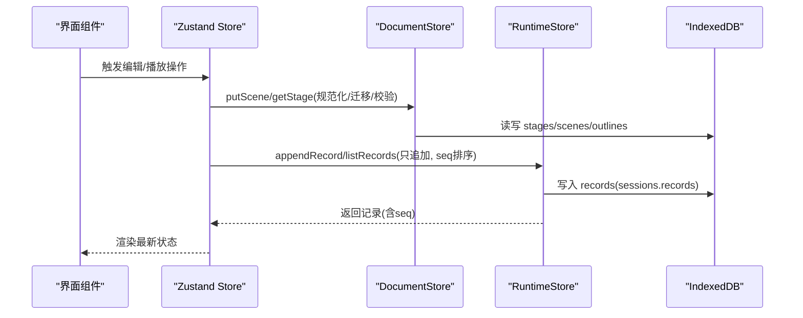
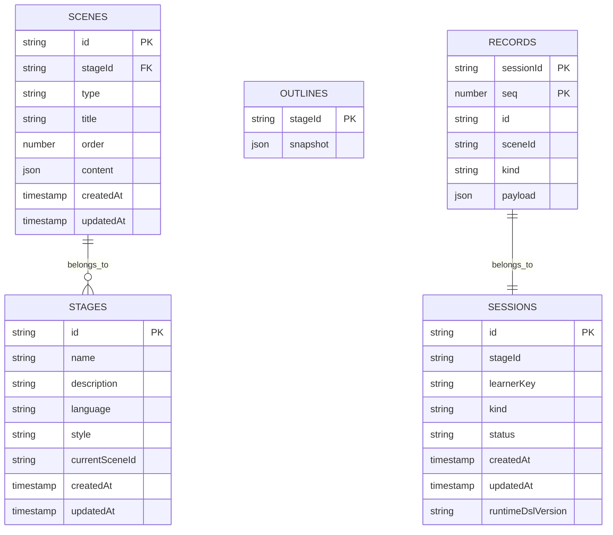
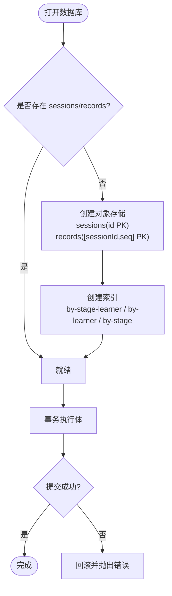
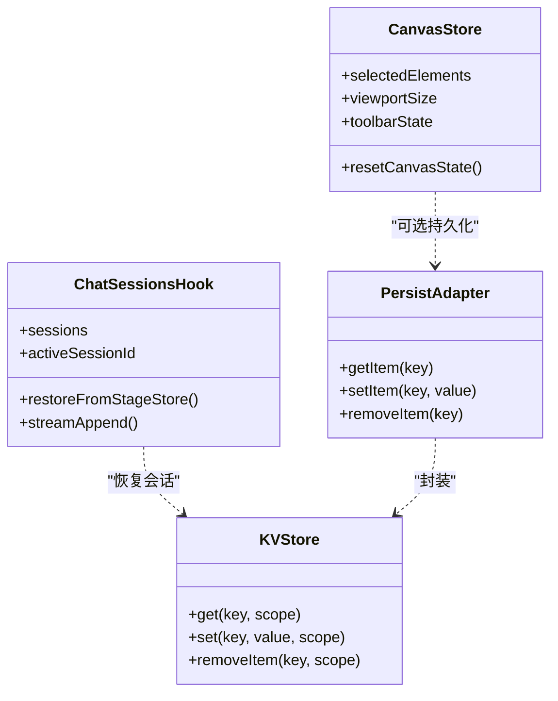

# 数据存储设计

<cite>
**本文引用的文件**   
- [packages/@openmaic/storage/README.md](file://packages/@openmaic/storage/README.md)
- [packages/@openmaic/storage/src/index.ts](file://packages/@openmaic/storage/src/index.ts)
- [packages/@openmaic/storage/src/runtime/browser.ts](file://packages/@openmaic/storage/src/runtime/browser.ts)
- [components/chat/use-chat-sessions.ts](file://components/chat/use-chat-sessions.ts)
- [lib/store/canvas.ts](file://lib/store/canvas.ts)
- [e2e/tests/interactive-iframe-keepalive-619.spec.ts](file://e2e/tests/interactive-iframe-keepalive-619.spec.ts)
</cite>

## 目录
- 产品概述
- 核心业务流程
- 功能模块清单
- 数据与状态
- 关键约束与边界

## 产品概述
OpenMAIC 是 AI 驱动的交互式课件（MAIC）生成与课堂管理平台，前端基于 Next.js + React + Zustand 状态管理，AI 编排使用 LangGraph + Vercel AI SDK，课件格式为自定义 DSL。本仓库通过 @openmaic/storage 提供可插拔的持久化层：在浏览器端以 IndexedDB 作为默认后端，支持文档（课程/场景）与运行时（会话/记录）两类数据的持久化；同时提供 KVStore 与资产存储提供者，用于轻量配置与内容寻址的资源管理。Zustand 通过适配器将应用状态持久化到 KVStore，形成“内存状态 + 本地持久化”的统一体验。

## 核心业务流程
- 课件编辑与回放
  - 编辑器对场景进行增量更新，DocumentStore 将 DSL 文档规范化为多实体行（stages/scenes/outlines），读取时按 DSL 版本迁移并校验，保证跨版本兼容与一致性。
  - 回放阶段通过 RuntimeStore 追加只读记录（如聊天、测验尝试、播放事实），以单调 seq 排序回放，不依赖时间戳。
- 课堂互动
  - 聊天与会话由 use-chat-sessions 驱动，从 Stage Store 恢复已持久化的会话列表，结合 RuntimeStore 的 append/list 接口实现流式写入与回放。
- 资源与配置
  - 资产通过 BrowserAssetProvider 以内容寻址（sha256）去重存储，文档仅引用稳定 ref；KVStore 承载设备/账户级轻量配置，并通过 kvPersistStorage 接入 Zustand。

图表来源 
- [packages/@openmaic/storage/src/index.ts:1-42](file://packages/@openmaic/storage/src/index.ts#L1-L42)
- [packages/@openmaic/storage/src/runtime/browser.ts:137-471](file://packages/@openmaic/storage/src/runtime/browser.ts#L137-L471)

章节来源
- [packages/@openmaic/storage/README.md:1-97](file://packages/@openmaic/storage/README.md#L1-L97)
- [packages/@openmaic/storage/src/index.ts:1-42](file://packages/@openmaic/storage/src/index.ts#L1-L42)
- [packages/@openmaic/storage/src/runtime/browser.ts:137-471](file://packages/@openmaic/storage/src/runtime/browser.ts#L137-L471)
- [components/chat/use-chat-sessions.ts:438-470](file://components/chat/use-chat-sessions.ts#L438-L470)

## 功能模块清单
- KVStore 与 BrowserKVStore
  - 职责：设备/账户级键值存储，区分 scope（device/account），适配 localStorage。
  - 验收要点：读写隔离、作用域正确、与 zustand persist 适配器兼容。
- StorageProvider（BrowserAssetProvider）
  - 职责：二进制资源的 put/resolve/remove，内容寻址（sha256）去重。
  - 验收要点：相同字节去重、ref 稳定、解析为 URL 可渲染。
- DocumentStore（BrowserDocumentStore）
  - 职责：DSL 文档聚合 ↔ 规范化存储（stages/scenes/outlines），读时迁移、写时校验。
  - 验收要点：scene 级写入高效、dslVersion 标记、outline 原样持久化。
- RuntimeStore（BrowserRuntimeStore）
  - 职责：学习者运行时数据（sessions + append-only records），分区（stageId, learnerKey）。
  - 验收要点：会话 born-stamped、记录单调 seq、payload 按 kind 校验、合并/删除幂等。
- Zustand 持久化适配器（kvPersistStorage）
  - 职责：将 KVStore 适配为 zustand persist storage，支持 scope。
  - 验收要点：round-trip 保序、removeItem 清空、scope 隔离。

章节来源
- [packages/@openmaic/storage/README.md:23-72](file://packages/@openmaic/storage/README.md#L23-L72)
- [packages/@openmaic/storage/src/index.ts:16-42](file://packages/@openmaic/storage/src/index.ts#L16-L42)
- [packages/@openmaic/storage/src/runtime/browser.ts:137-471](file://packages/@openmaic/storage/src/runtime/browser.ts#L137-L471)

## 数据与状态
### 索引数据库模式（IndexedDB）
- 数据库名
  - 文档：由 BrowserDocumentStore 创建（具体名称由实现决定）
  - 运行时：默认 maic-runtime（可通过选项覆盖）
- 对象存储与主键
  - sessions
    - 主键：id
    - 字段：id, stageId, learnerKey, kind, status, createdAt, updatedAt, runtimeDslVersion
    - 索引：by-stage-learner(stageId, learnerKey), by-learner(learnerKey), by-stage(stageId)
  - records
    - 复合主键：[sessionId, seq]（确保按 seq 有序）
    - 字段：id, sessionId, sceneId?, kind, payload, seq
- 文档相关对象存储（规范化）
  - stages：课程元数据与当前场景指针
  - scenes：每个场景独立行，包含 type/content/order 等
  - outlines：大纲快照（应用自有，原样持久化）

图表来源 
- [packages/@openmaic/storage/src/runtime/browser.ts:149-179](file://packages/@openmaic/storage/src/runtime/browser.ts#L149-L179)
- [e2e/tests/interactive-iframe-keepalive-619.spec.ts:57-106](file://e2e/tests/interactive-iframe-keepalive-619.spec.ts#L57-L106)

### 字段定义与数据类型
- sessions
  - id：字符串（唯一会话标识）
  - stageId/learnerKey：字符串（分区键）
  - kind/status：字符串（会话类型与状态）
  - createdAt/updatedAt：ISO 时间戳
  - runtimeDslVersion：运行时 DSL 版本号（born-stamped）
- records
  - id：字符串（记录唯一标识）
  - sessionId：字符串（外键指向 sessions.id）
  - sceneId：可选字符串（锚点到场景）
  - kind：字符串（chat/quizAttempt/playback/自定义）
  - payload：JSON（按 kind 校验）
  - seq：数字（单调递增，排序依据）
- stages/scenes/outlines
  - stages：课程级元数据与当前场景指针
  - scenes：场景类型与内容（slide/quiz/interactive/pbl 等）
  - outlines：应用自有的大纲快照（不校验、不迁移）

章节来源
- [packages/@openmaic/storage/src/runtime/browser.ts:149-179](file://packages/@openmaic/storage/src/runtime/browser.ts#L149-L179)
- [e2e/tests/interactive-iframe-keepalive-619.spec.ts:57-106](file://e2e/tests/interactive-iframe-keepalive-619.spec.ts#L57-L106)

### 主键/外键、索引与约束
- 主键
  - sessions.id；records 复合主键 [sessionId, seq]
- 外键
  - records.sessionId → sessions.id（逻辑外键，由业务保证）
- 索引
  - sessions.by-stage-learner(stageId, learnerKey)
  - sessions.by-learner(learnerKey)
  - sessions.by-stage(stageId)
- 约束
  - 会话创建唯一性（add 而非 upsert）
  - 记录仅可追加到 active 状态的会话
  - 运行时 DSL 版本向前兼容（未来版本不可被旧客户端降级修改）
  - payload 按 kind 校验（chat/quizAttempt 使用骨架守卫）

章节来源
- [packages/@openmaic/storage/src/runtime/browser.ts:220-378](file://packages/@openmaic/storage/src/runtime/browser.ts#L220-L378)

### 数据验证规则与业务规则
- 运行时会话
  - createSession：写入前校验完整 envelope，失败即抛错
  - setSessionStatus：禁止修改由新版本客户端写入的会话（防降级）
  - appendRecord：仅允许 active 会话追加；按 kind 校验 payload；seq 由 store 分配
  - listSessions：容忍损坏行（跳过），直接 getSession 仍 fail-loud
- 文档
  - 读时迁移：按 dslVersion 执行迁移阶梯
  - 写时校验：validateStage/validateScene 保证 schema 漂移失败可见
  - outline：应用自有快照，原样持久化，不参与迁移/校验
- 资产
  - 内容寻址（sha256）去重，ref 稳定，渲染时解析为 URL

章节来源
- [packages/@openmaic/storage/README.md:33-72](file://packages/@openmaic/storage/README.md#L33-L72)
- [packages/@openmaic/storage/src/runtime/browser.ts:220-378](file://packages/@openmaic/storage/src/runtime/browser.ts#L220-L378)

### 数据访问模式与缓存策略
- 访问模式
  - 文档：聚合 ↔ 规范化转换，场景级写入高效；读时迁移+校验
  - 运行时：分区查询（stageId, learnerKey），单会话 id 操作，跨阶段合并（mergeLearner）
  - 记录：append-only，按 seq 顺序回放
- 缓存策略
  - IndexedDB 事务提交后才视为持久化（非请求完成）
  - openDb 懒加载且失败后清理缓存，避免私有模式/版本错误导致永久失败
  - 资产 provider 以内容寻址减少重复存储

章节来源
- [packages/@openmaic/storage/src/runtime/browser.ts:149-213](file://packages/@openmaic/storage/src/runtime/browser.ts#L149-L213)
- [packages/@openmaic/storage/README.md:33-48](file://packages/@openmaic/storage/README.md#L33-L48)

### 性能考虑
- 复合主键 [sessionId, seq] 使范围查询天然有序，避免额外排序开销
- 文档规范化降低场景级写入成本
- 运行时记录仅追加，避免随机写放大
- 资产去重减少存储空间与 I/O

章节来源
- [packages/@openmaic/storage/src/runtime/browser.ts:166-170](file://packages/@openmaic/storage/src/runtime/browser.ts#L166-L170)
- [packages/@openmaic/storage/README.md:41-48](file://packages/@openmaic/storage/README.md#L41-L48)

### 数据生命周期、保留与归档
- 会话生命周期
  - 创建（createSession）→ 活跃（active）→ 结束（setSessionStatus）
  - 删除：deleteSession（级联删除 records）、deleteLearnerRuntime、deleteStageRuntime、deleteAllRuntime
- 记录生命周期
  - 仅追加，随会话存在；会话删除时级联清除
- 归档
  - 当前未实现离线归档；如需归档，可在 deleteStageRuntime 前导出 snapshots（outlines 可作为快照载体）

章节来源
- [packages/@openmaic/storage/src/runtime/browser.ts:314-452](file://packages/@openmaic/storage/src/runtime/browser.ts#L314-L452)

### 数据迁移路径与版本管理
- 文档迁移
  - 读时根据 dslVersion 执行迁移阶梯，写时校验 validateStage/validateScene
- 运行时迁移
  - 会话 born-stamped runtimeDslVersion；read 时 migrateRuntime；未来版本不可被旧客户端修改
- 资产迁移
  - 内容寻址 ref 稳定，无需迁移

章节来源
- [packages/@openmaic/storage/README.md:41-48](file://packages/@openmaic/storage/README.md#L41-L48)
- [packages/@openmaic/storage/src/runtime/browser.ts:100-130](file://packages/@openmaic/storage/src/runtime/browser.ts#L100-L130)

### 数据安全、隐私与访问控制
- 作用域隔离
  - KVStore 明确区分 device/account，后端统一遵守
- 内容安全
  - 资产以 sha256 引用，避免嵌入过期/外部链接
- 访问控制
  - 运行时数据按 (stageId, learnerKey) 分区，无全局列举；跨阶段合并仅限 mergeLearner
- 隐私
  - 设备级数据不出设备；账户级数据可由服务端同步（后端尚未实现）

章节来源
- [packages/@openmaic/storage/README.md:33-40](file://packages/@openmaic/storage/README.md#L33-L40)
- [packages/@openmaic/storage/src/runtime/browser.ts:258-289](file://packages/@openmaic/storage/src/runtime/browser.ts#L258-L289)

### IndexedDB 存储结构（运行时）

图表来源 
- [packages/@openmaic/storage/src/runtime/browser.ts:149-213](file://packages/@openmaic/storage/src/runtime/browser.ts#L149-L213)

### Zustand 状态管理与持久化机制
- 状态管理
  - lib/store/canvas.ts 管理画布编辑 UI 状态（选择、视口、工具栏等），与场景数据分离
  - components/chat/use-chat-sessions.ts 管理聊天会话列表与活跃会话，从 Stage Store 恢复持久化数据
- 持久化
  - kvPersistStorage 将 KVStore 适配为 zustand persist storage，支持 scope（默认 account）
  - 典型流程：初始化时从 KVStore 读取 {state, version}，渲染内存状态；变更时自动落盘

图表来源 
- [lib/store/canvas.ts:1-482](file://lib/store/canvas.ts#L1-L482)
- [components/chat/use-chat-sessions.ts:438-470](file://components/chat/use-chat-sessions.ts#L438-L470)
- [packages/@openmaic/storage/src/index.ts:21-25](file://packages/@openmaic/storage/src/index.ts#L21-L25)

章节来源
- [lib/store/canvas.ts:1-482](file://lib/store/canvas.ts#L1-L482)
- [components/chat/use-chat-sessions.ts:438-470](file://components/chat/use-chat-sessions.ts#L438-L470)
- [packages/@openmaic/storage/src/index.ts:21-25](file://packages/@openmaic/storage/src/index.ts#L21-L25)

## 关键约束与边界
- 运行时 DSL 版本
  - 会话必须携带 runtimeDslVersion；旧客户端不得修改新客户端写入的数据
- 记录追加约束
  - 仅 active 会话可追加；seq 单调递增，作为唯一排序键
- 文档校验与迁移
  - 写时校验 validateStage/validateScene；读时迁移至当前版本
- 资产引用
  - 文档仅存 sha256 ref，渲染时解析 URL，避免硬编码外部链接
- 作用域隔离
  - device 数据永不离开设备；account 数据可同步（后端待实现）
- 无全局列举
  - 运行时数据按分区查询，避免全库扫描

章节来源
- [packages/@openmaic/storage/src/runtime/browser.ts:220-378](file://packages/@openmaic/storage/src/runtime/browser.ts#L220-L378)
- [packages/@openmaic/storage/README.md:33-72](file://packages/@openmaic/storage/README.md#L33-L72)