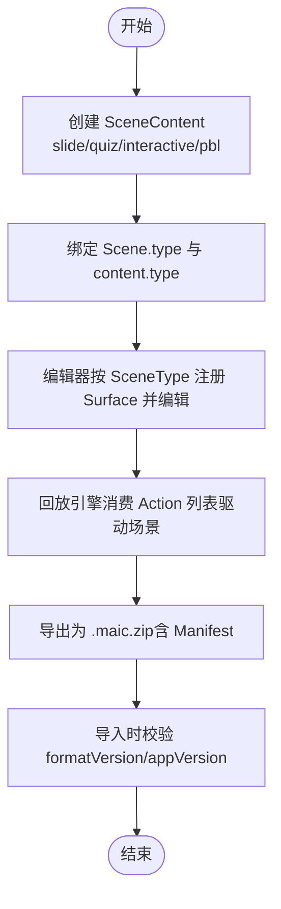
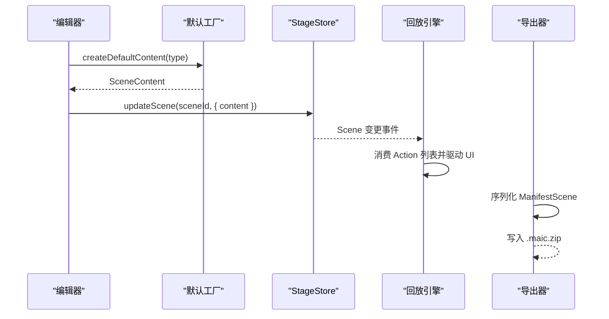

# DSL 核心类型定义

<cite>
**本文引用的文件**   
- [lib/types/stage.ts](file://lib/types/stage.ts)
- [lib/types/action.ts](file://lib/types/action.ts)
- [packages/@openmaic/dsl/src/schema-roots.ts](file://packages/@openmaic/dsl/src/schema-roots.ts)
- [lib/api/stage-api-defaults.ts](file://lib/api/stage-api-defaults.ts)
- [lib/edit/scene-editor-surface.ts](file://lib/edit/scene-editor-surface.ts)
- [components/edit/ActionsBar/actions-edit.ts](file://components/edit/ActionsBar/actions-edit.ts)
- [lib/export/classroom-zip-types.ts](file://lib/export/classroom-zip-types.ts)
- [lib/media/video-manifest.ts](file://lib/media/video-manifest.ts)
- [tests/server/classroom-media-generation.test.ts](file://tests/server/classroom-media-generation.test.ts)
</cite>

## 产品概述
本文件聚焦 OpenMAIC 的 DSL（领域特定语言）核心类型定义，围绕 Stage、Scene、SceneContent 等核心数据结构展开，说明字段含义、数据类型与约束规则；解释 Scene 的泛型设计如何支持 slide、quiz、interactive、pbl 等内容类型的扩展；完整记录 Action 联合类型及其变体；并提供数据结构版本管理、向后兼容性与迁移策略。文档同时给出 TypeScript 使用示例与验证规则说明，帮助开发者在编辑器、渲染器、生成管线与导出流程中正确消费这些类型。

## 核心业务流程
- 内容创建：通过默认工厂函数为不同 SceneType 创建对应的 SceneContent（slide、quiz、interactive、pbl）。
- 编辑与回放：Scene 由 Actions 驱动播放行为；编辑器按 SceneType 注册 Surface 进行差异化编辑。
- 导出与导入：导出包含 ClassroomManifest，保留 Scene 的 type/content 与 actions；导入时依赖 formatVersion 与 appVersion 做兼容性处理。
- 媒体占位符替换：根据 mediaRef 或 src 解析视频资源，确保回放与导出一致性。

[无图表来源：该图为概念流程示意]

## 功能模块清单
- 核心类型重导出与组合
  - lib/types/stage.ts：将 @openmaic/dsl 的通用骨架（Stage/Scene/SlideContent/QuizContent 等）与应用层扩展（InteractiveContent/PBLContent）组合，形成 AppSceneContent 与 AppScene（别名 Scene），并提供 makeScene 构造器与 ScenePatch 补丁类型。
  - lib/types/action.ts：统一 Action 系统，从 @openmaic/dsl 重导出所有 Action 变体与分类常量，供回放引擎与编辑器共享。
- 默认内容与工具
  - lib/api/stage-api-defaults.ts：提供 generateId、validateSceneId、getScene 以及 createDefaultSlideContent/createDefaultQuizContent/createDefaultInteractiveContent/createDefaultPBLContent 等工厂函数。
- 编辑器表面注册
  - lib/edit/scene-editor-surface.ts：定义 SceneEditorSurface 接口与注册表，使 shell 对 scene-type 解耦，各 Surface 声明 useSurfaceState 与 SurfaceComponent。
- 动作编辑与工厂
  - components/edit/ActionsBar/actions-edit.ts：提供 AddableType 与 makeAction，用于时间线拖拽新增 speech/spotlight/laser 等独立 Action。
- 导出与导入契约
  - lib/export/classroom-zip-types.ts：定义 CLASSROOM_ZIP_FORMAT_VERSION、CLASSROOM_ZIP_EXTENSION 与 ClassroomManifest/ManifestScene 等结构，保证跨版本可导入。
- 媒体占位符解析
  - lib/media/video-manifest.ts：构建与解析 VideoManifest，识别 gen_vid_* 占位符，结合元素 mediaRef/src 定位实际资源。
- Schema 根类型
  - packages/@openmaic/dsl/src/schema-roots.ts：定义 SerializedScene 作为 JSON Schema 生成的具体根类型，显式展开 SlideContent/QuizContent 以保留判别式绑定。

**章节来源**
- [lib/types/stage.ts:19-52](file://lib/types/stage.ts#L19-L52)
- [lib/types/stage.ts:60-88](file://lib/types/stage.ts#L60-L88)
- [lib/types/stage.ts:105-134](file://lib/types/stage.ts#L105-L134)
- [lib/types/stage.ts:149-154](file://lib/types/stage.ts#L149-L154)
- [lib/types/action.ts:13-44](file://lib/types/action.ts#L13-L44)
- [lib/api/stage-api-defaults.ts:24-40](file://lib/api/stage-api-defaults.ts#L24-L40)
- [lib/api/stage-api-defaults.ts:45-125](file://lib/api/stage-api-defaults.ts#L45-L125)
- [lib/edit/scene-editor-surface.ts:126-159](file://lib/edit/scene-editor-surface.ts#L126-L159)
- [components/edit/ActionsBar/actions-edit.ts:15-27](file://components/edit/ActionsBar/actions-edit.ts#L15-L27)
- [lib/export/classroom-zip-types.ts:1-53](file://lib/export/classroom-zip-types.ts#L1-L53)
- [lib/media/video-manifest.ts:1-39](file://lib/media/video-manifest.ts#L1-L39)
- [packages/@openmaic/dsl/src/schema-roots.ts:1-24](file://packages/@openmaic/dsl/src/schema-roots.ts#L1-L24)

## 数据与状态
- 核心模型关系
  - Stage：课程单元容器，包含 scenes 列表与元信息（如 mode、agents、videoManifest 等）。
  - Scene：泛型骨架 Scene<Action, TContent>，应用侧实例化为 Scene<Action, SceneContent>，其中 SceneContent 为四元联合（slide | quiz | interactive | pbl）。
  - SceneContent：
    - SlideContent：包含 canvas（viewportSize、theme、elements 等）。
    - QuizContent：questions 数组。
    - InteractiveContent：url/html 与 widgetType/widgetConfig。
    - PBLContent：projectConfig 与可选 projectV2。
  - Action：回放动词集合，包括 speech、spotlight、laser、白板系列（WbOpen/WbDraw*/WbClear/WbDelete/WbClose）、PlayVideo、Discussion、Widget* 系列等。
- 主外键与完整性约束
  - Scene.id 唯一标识一个场景；stage.scenes 中的 id 应互异。
  - Scene.content.type 必须与 Scene.type 一致（由 makeScene 强制绑定）。
  - Action.id 唯一；部分 Action 通过 elementId 引用 SlideContent.canvas.elements 中的元素，需保证存在性。
  - 视频媒体引用遵循约定：mediaRef 优先于 src；若 src 为 gen_vid_* 占位符，则需在 VideoManifest 中存在对应条目。
- 状态流转
  - 编辑器通过 SceneEditorSurface 的 useSurfaceState 维护选择、历史与操作派发。
  - 回放引擎按 Action 顺序执行，更新 UI 与媒体状态。
  - 导出时将 Scene 序列化为 ManifestScene，保留 type/content/actions 与 whiteboards。

```mermaid
classDiagram
class Stage {
+string id
+string name
+StageMode mode
+Scene[] scenes
+VideoManifest videoManifest
}
class Scene {
+string id
+string stageId
+SceneType type
+number order
+SceneContent content
+Action[] actions
+string? outlineId
}
class SlideContent {
+string type = "slide"
+Canvas canvas
}
class Canvas {
+string id
+number viewportSize
+number viewportRatio
+Theme theme
+PPTElement[] elements
}
class QuizContent {
+string type = "quiz"
+QuizQuestion[] questions
}
class InteractiveContent {
+string type = "interactive"
+string url
+string? html
+WidgetType? widgetType
+WidgetConfig? widgetConfig
}
class PBLContent {
+string type = "pbl"
+PBLProjectConfig projectConfig
+PBLProjectV2? projectV2
}
class ActionBase {
+string id
+string type
}
class SpeechAction
class SpotlightAction
class LaserAction
class WbOpenAction
class WbDrawTextAction
class WbDrawShapeAction
class WbDrawChartAction
class WbDrawLatexAction
class WbDrawTableAction
class WbDrawLineAction
class WbClearAction
class WbDeleteAction
class WbCloseAction
class WbDrawCodeAction
class WbEditCodeAction
class PlayVideoAction
class DiscussionAction
class WidgetHighlightAction
class WidgetSetStateAction
class WidgetAnnotationAction
class WidgetRevealAction
Scene --> SceneContent : "content"
Scene --> Action : "actions"
SlideContent --> Canvas : "canvas"
Scene <|-- SlideScene : "type=slide"
Scene <|-- QuizScene : "type=quiz"
Scene <|-- InteractiveScene : "type=interactive"
Scene <|-- PBLScene : "type=pbl"
ActionBase <|-- SpeechAction
ActionBase <|-- SpotlightAction
ActionBase <|-- LaserAction
ActionBase <|-- WbOpenAction
ActionBase <|-- WbDrawTextAction
ActionBase <|-- WbDrawShapeAction
ActionBase <|-- WbDrawChartAction
ActionBase <|-- WbDrawLatexAction
ActionBase <|-- WbDrawTableAction
ActionBase <|-- WbDrawLineAction
ActionBase <|-- WbClearAction
ActionBase <|-- WbDeleteAction
ActionBase <|-- WbCloseAction
ActionBase <|-- WbDrawCodeAction
ActionBase <|-- WbEditCodeAction
ActionBase <|-- PlayVideoAction
ActionBase <|-- DiscussionAction
ActionBase <|-- WidgetHighlightAction
ActionBase <|-- WidgetSetStateAction
ActionBase <|-- WidgetAnnotationAction
ActionBase <|-- WidgetRevealAction
```

**图表来源**
- [lib/types/stage.ts:19-52](file://lib/types/stage.ts#L19-L52)
- [lib/types/stage.ts:60-88](file://lib/types/stage.ts#L60-L88)
- [lib/types/stage.ts:105-134](file://lib/types/stage.ts#L105-L134)
- [lib/types/action.ts:13-44](file://lib/types/action.ts#L13-L44)

**章节来源**
- [lib/types/stage.ts:19-52](file://lib/types/stage.ts#L19-L52)
- [lib/types/stage.ts:60-88](file://lib/types/stage.ts#L60-L88)
- [lib/types/stage.ts:105-134](file://lib/types/stage.ts#L105-L134)
- [lib/types/action.ts:13-44](file://lib/types/action.ts#L13-L44)
- [lib/api/stage-api-defaults.ts:45-125](file://lib/api/stage-api-defaults.ts#L45-L125)
- [lib/media/video-manifest.ts:1-39](file://lib/media/video-manifest.ts#L1-L39)
- [lib/export/classroom-zip-types.ts:1-53](file://lib/export/classroom-zip-types.ts#L1-L53)

## 关键约束与边界
- Scene 泛型设计与内容扩展
  - Scene<Action, TContent> 是契约骨架；应用侧通过 AppSceneContent 扩展出 interactive/pbl 等类型，保持向后兼容。
  - makeScene 强制绑定 type 与 content.type，避免不一致状态。
- Action 联合类型与分类
  - FIRE_AND_FORGET_ACTIONS、SLIDE_ONLY_ACTIONS、SYNC_ACTIONS 等分类常量用于回放策略控制。
  - 编辑器仅允许直接添加 speech/spotlight/laser 等“独立”动作；白板类动作需要 open→draw→close 工作流。
- 默认内容与校验
  - createDefaultContent(type) 根据 SceneType 返回对应 SceneContent；未知类型抛出错误。
  - validateSceneId/getScene 提供基础校验与查找能力。
- 导出/导入与版本管理
  - ClassroomManifest.formatVersion 与 appVersion 用于导入兼容性判断。
  - ManifestScene 保留 type/content/actions/whiteboards/multiAgent 等必要字段。
- 媒体占位符与完整性
  - getVideoMediaRefForElement 优先取 mediaRef，其次识别 src 是否为 gen_vid_* 占位符。
  - resolveVideoManifestEntry 基于 stage.videoManifest 解析实际资源。
- Schema 生成约束
  - SerializedScene 显式展开 SlideContent/QuizContent，确保 JSON Schema 生成时保留判别式绑定。

**图表来源**
- [lib/api/stage-api-defaults.ts:45-125](file://lib/api/stage-api-defaults.ts#L45-L125)
- [lib/export/classroom-zip-types.ts:1-53](file://lib/export/classroom-zip-types.ts#L1-L53)

**章节来源**
- [lib/types/stage.ts:149-154](file://lib/types/stage.ts#L149-L154)
- [lib/types/action.ts:13-44](file://lib/types/action.ts#L13-L44)
- [components/edit/ActionsBar/actions-edit.ts:15-27](file://components/edit/ActionsBar/actions-edit.ts#L15-L27)
- [lib/api/stage-api-defaults.ts:24-40](file://lib/api/stage-api-defaults.ts#L24-L40)
- [lib/media/video-manifest.ts:1-39](file://lib/media/video-manifest.ts#L1-L39)
- [packages/@openmaic/dsl/src/schema-roots.ts:1-24](file://packages/@openmaic/dsl/src/schema-roots.ts#L1-L24)

## 数据结构版本管理、向后兼容性与迁移策略
- 版本字段
  - ClassroomManifest.formatVersion：导出包格式版本，导入时需检查是否受支持。
  - ClassroomManifest.appVersion：导出时的应用版本，可用于提示升级或降级策略。
- 向后兼容
  - SceneContent 的四元联合（slide/quiz/interactive/pbl）在应用侧扩展，契约层仅包含 slide/quiz，确保旧数据仍可被读取。
  - PBLContent.projectV2 为可选字段，v1/v2 共存，运行时按需启用。
- 迁移策略
  - 导入时根据 formatVersion 决定解析路径；对缺失字段提供默认值或回退逻辑。
  - 对于 Action 的新增类型，回放引擎需具备未知 action 的忽略或降级策略。
  - 媒体占位符 gen_vid_* 在导入后需重新映射到可用 CDN 地址。

**章节来源**
- [lib/export/classroom-zip-types.ts:1-53](file://lib/export/classroom-zip-types.ts#L1-L53)
- [lib/types/stage.ts:60-88](file://lib/types/stage.ts#L60-L88)
- [lib/media/video-manifest.ts:1-39](file://lib/media/video-manifest.ts#L1-L39)

## TypeScript 类型使用示例与验证规则说明
- 创建 Scene 与绑定 type/content
  - 使用 makeScene(core, content) 构造 Scene，确保 type 与 content.type 一致。
  - 示例路径参考：[makeScene 实现:149-154](file://lib/types/stage.ts#L149-L154)
- 默认内容创建
  - createDefaultContent(type) 返回对应 SceneContent；未知类型抛错。
  - 示例路径参考：[createDefaultContent:112-125](file://lib/api/stage-api-defaults.ts#L112-L125)
- Action 工厂与编辑
  - makeAction(type, id) 生成 speech/spotlight/laser 等 Action。
  - 示例路径参考：[makeAction:18-27](file://components/edit/ActionsBar/actions-edit.ts#L18-L27)
- 媒体占位符解析
  - getVideoMediaRefForElement(element) 优先 mediaRef，其次识别 gen_vid_* 占位符。
  - resolveVideoManifestEntry(stage, element) 从 stage.videoManifest 解析实际资源。
  - 示例路径参考：[视频占位符解析:26-39](file://lib/media/video-manifest.ts#L26-L39)
- Schema 根类型
  - SerializedScene 用于 JSON Schema 生成，显式展开 SlideContent/QuizContent。
  - 示例路径参考：[SerializedScene:21-24](file://packages/@openmaic/dsl/src/schema-roots.ts#L21-L24)
- 验证与测试
  - tests/server/classroom-media-generation.test.ts 演示了 replaceMediaPlaceholders 的行为，确保 src 优先于 mediaRef。
  - 示例路径参考：[媒体占位符替换测试:24-45](file://tests/server/classroom-media-generation.test.ts#L24-L45)

**章节来源**
- [lib/types/stage.ts:149-154](file://lib/types/stage.ts#L149-L154)
- [lib/api/stage-api-defaults.ts:112-125](file://lib/api/stage-api-defaults.ts#L112-L125)
- [components/edit/ActionsBar/actions-edit.ts:18-27](file://components/edit/ActionsBar/actions-edit.ts#L18-L27)
- [lib/media/video-manifest.ts:26-39](file://lib/media/video-manifest.ts#L26-L39)
- [packages/@openmaic/dsl/src/schema-roots.ts:21-24](file://packages/@openmaic/dsl/src/schema-roots.ts#L21-L24)
- [tests/server/classroom-media-generation.test.ts:24-45](file://tests/server/classroom-media-generation.test.ts#L24-L45)

## 附录：Scene 编辑器表面与注册机制
- SceneEditorSurface<TContent, TSelection> 定义了每个 SceneType 的编辑界面契约：
  - sceneType：区分 slide/quiz/interactive/pbl。
  - SurfaceComponent：中心渲染区域组件。
  - useSurfaceState：返回选择、历史与操作派发等状态。
- 注册表 SceneEditorRegistry：
  - register/unregister/resolve：模块初始化时注册 Surface，shell 通过 resolve 获取对应 Surface。
- 示例：slideSurface 注册了 slide 类型的 SurfaceComponent 与 useSurfaceState。

**章节来源**
- [lib/edit/scene-editor-surface.ts:126-159](file://lib/edit/scene-editor-surface.ts#L126-L159)