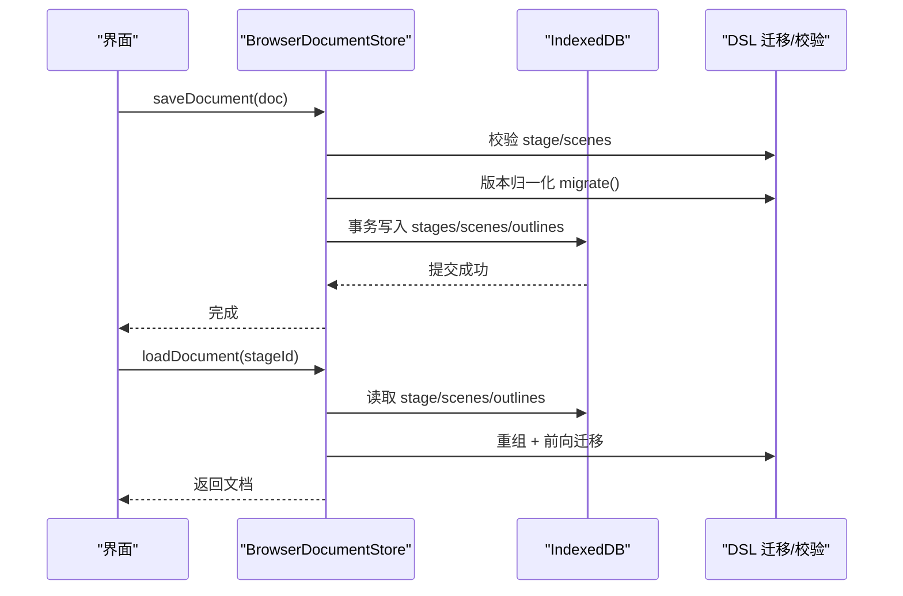
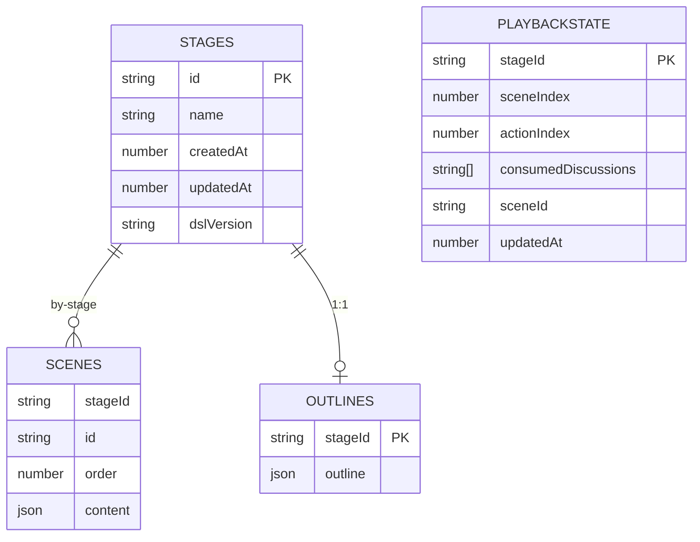
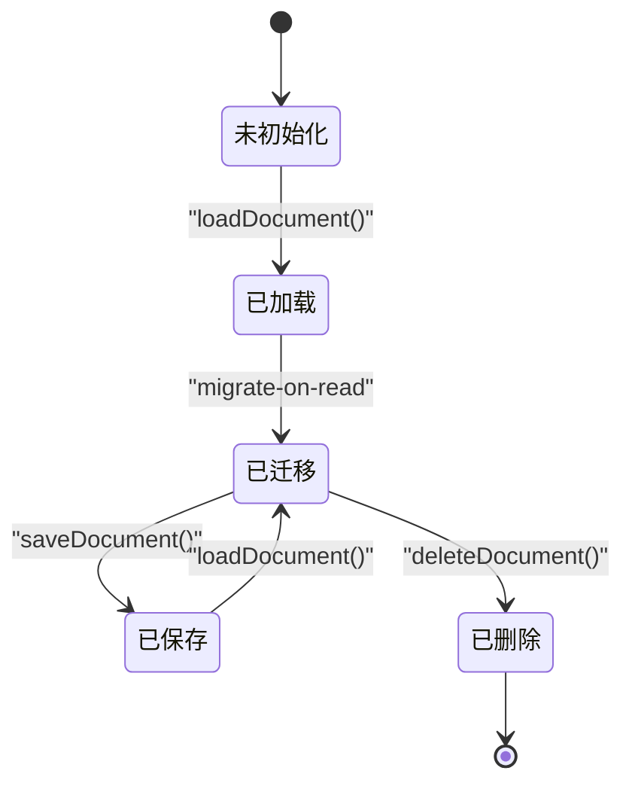
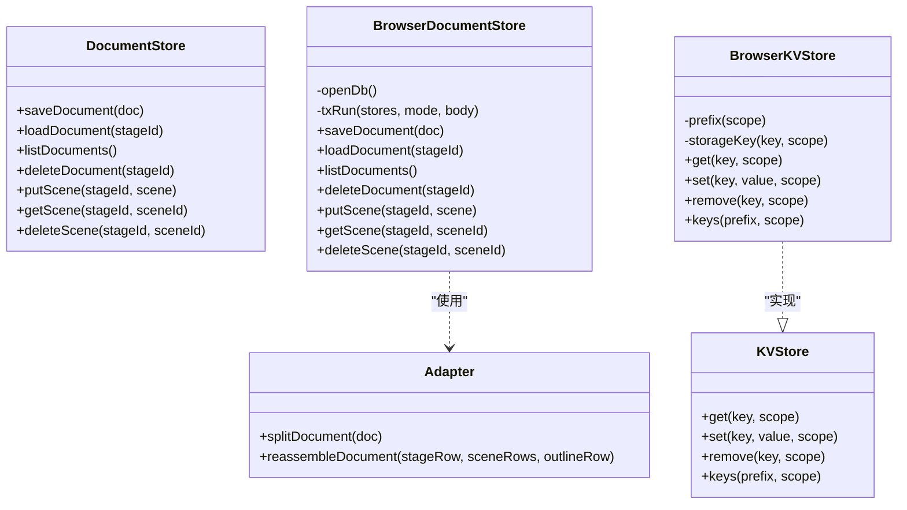
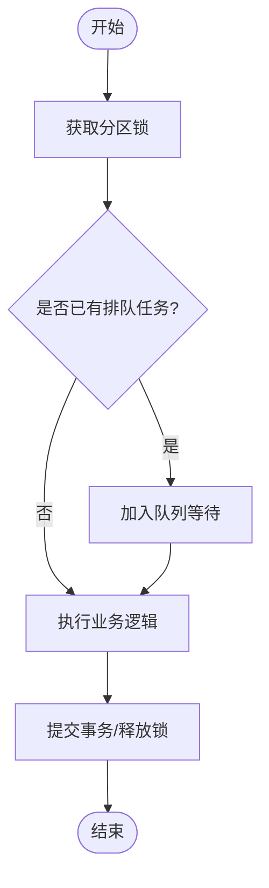

# 存储架构设计

<cite>
**本文引用的文件**   
- [packages/@openmaic/storage/src/index.ts](file://packages/@openmaic/storage/src/index.ts)
- [packages/@openmaic/storage/src/kv/types.ts](file://packages/@openmaic/storage/src/kv/types.ts)
- [packages/@openmaic/storage/src/kv/browser.ts](file://packages/@openmaic/storage/src/kv/browser.ts)
- [packages/@openmaic/storage/src/document/types.ts](file://packages/@openmaic/storage/src/document/types.ts)
- [packages/@openmaic/storage/src/document/adapter.ts](file://packages/@openmaic/storage/src/document/adapter.ts)
- [packages/@openmaic/storage/src/document/browser.ts](file://packages/@openmaic/storage/src/document/browser.ts)
- [lib/utils/chat-storage.ts](file://lib/utils/chat-storage.ts)
- [lib/utils/playback-storage.ts](file://lib/utils/playback-storage.ts)
- [lib/utils/stage-storage.ts](file://lib/utils/stage-storage.ts)
- [configs/storage.ts](file://configs/storage.ts)
</cite>

## 产品概述
本仓库为 OpenMAIC（AI 驱动的交互式课件生成与课堂管理平台）的存储层设计与实现。核心目标是在浏览器端提供高性能、可迁移、可扩展的持久化能力，支撑课件文档（Stage/Scene）、聊天会话、播放状态等关键数据的读写与并发控制。存储层采用“可插拔后端 + 规范化行模型”的设计：DSL 定义数据形状与迁移规则，@openmaic/storage 提供 KV、文档与运行时存储的浏览器后端（IndexedDB/localStorage），上层业务通过统一接口访问，屏蔽底层差异。

## 核心业务流程
- 课件文档保存与加载
  - 保存：对 MaicDocument 进行版本归一化与校验，拆分为 stage/scenes/outlines 三张表写入 IndexedDB；保证复合键唯一性与顺序一致性，失败时原子回滚。
  - 加载：按 stageId 读取并重组文档，按 DSL 版本进行前向迁移，返回当前版本的完整文档。
- 场景级增量操作
  - putScene/getScene/deleteScene：在文档版本必须为当前版本的前提下执行，避免跨版本不一致。
- 聊天会话持久化
  - 基于 RuntimeStore 的 append-only 记录流，结合恢复标记与删除标记，支持多生成轮次合并与幂等恢复。
- 播放状态快照
  - 以 stageId 为单位保存最小恢复信息（sceneIndex/actionIndex/consumedDiscussions）。
- 阶段（Stage）管理
  - 保存/加载/删除 Stage 及其 Scenes，清理关联的聊天、播放状态与 Quiz 草稿等。

**图表来源** 
- [packages/@openmaic/storage/src/document/browser.ts](file://packages/@openmaic/storage/src/document/browser.ts)
- [packages/@openmaic/storage/src/document/adapter.ts](file://packages/@openmaic/storage/src/document/adapter.ts)

**章节来源**
- [packages/@openmaic/storage/src/document/browser.ts](file://packages/@openmaic/storage/src/document/browser.ts)
- [packages/@openmaic/storage/src/document/adapter.ts](file://packages/@openmaic/storage/src/document/adapter.ts)

## 功能模块清单
- KV 存储（轻量键值）
  - 职责：设备级与账户级小对象持久化，JSON 序列化/反序列化，命名空间隔离。
  - 验收要点：get/set/remove/keys 行为正确；device/account 作用域隔离；空值处理安全。
- 文档存储（课件聚合）
  - 职责：MaicDocument 的拆分/重组、DSL 版本迁移、场景级增删改、列表摘要。
  - 验收要点：复合键唯一性、order 排序稳定、未来版本保护、原子事务。
- 聊天存储（RuntimeStore 适配）
  - 职责：append-only 记录折叠、会话状态重建、恢复/删除标记、并发队列与锁。
  - 验收要点：幂等创建/删除、最大消息数限制、快照一致性、跨分区锁。
- 播放状态存储
  - 职责：stage 维度的最小恢复快照。
  - 验收要点：覆盖写、读取为空时返回 null、清理逻辑。
- 阶段存储（Stage/Scenes）
  - 职责：Stage 元数据与 Scenes 批量存取、列表统计、重命名、存在性检查。
  - 验收要点：批量写入性能、级联清理、错误日志与降级。

**章节来源**
- [packages/@openmaic/storage/src/kv/types.ts](file://packages/@openmaic/storage/src/kv/types.ts)
- [packages/@openmaic/storage/src/kv/browser.ts](file://packages/@openmaic/storage/src/kv/browser.ts)
- [packages/@openmaic/storage/src/document/types.ts](file://packages/@openmaic/storage/src/document/types.ts)
- [packages/@openmaic/storage/src/document/browser.ts](file://packages/@openmaic/storage/src/document/browser.ts)
- [lib/utils/chat-storage.ts](file://lib/utils/chat-storage.ts)
- [lib/utils/playback-storage.ts](file://lib/utils/playback-storage.ts)
- [lib/utils/stage-storage.ts](file://lib/utils/stage-storage.ts)

## 数据与状态
### 数据库结构与索引策略
- IndexedDB 对象存储（文档库 maic-documents）
  - stages：主键 id（Stage 标识），用于文档根元数据与版本戳。
  - scenes：复合主键 [stageId, id]，确保同 stage 内 scene id 唯一；索引 by-stage(stageId) 加速按文档查询。
  - outlines：主键 stageId，仅当存在 outline 时写入。
- 其他存储（Dexie/IndexedDB）
  - stages：Stage 元数据表（名称、描述、时间戳、模式标志等）。
  - scenes：Scene 记录表（stageId、order、内容等）。
  - playbackState：每 stage 一条，保存 sceneIndex/actionIndex/consumedDiscussions。
  - mediaFiles：媒体二进制与缩略图引用（由缩略图逻辑使用）。
- 本地键值（localStorage）
  - BrowserKVStore：命名空间 + scope 前缀（如 maic:account: / maic:device:）避免冲突。

**图表来源** 
- [packages/@openmaic/storage/src/document/browser.ts](file://packages/@openmaic/storage/src/document/browser.ts)
- [packages/@openmaic/storage/src/document/adapter.ts](file://packages/@openmaic/storage/src/document/adapter.ts)
- [lib/utils/playback-storage.ts](file://lib/utils/playback-storage.ts)

### 字段定义与约束
- StageRow（stages）
  - 字段：Stage 所有字段 + DSL_VERSION_KEY（版本戳）。
  - 约束：id 唯一；dslVersion 用于迁移判定与未来版本保护。
- Scene（scenes）
  - 字段：id、stageId、order、content（应用扩展类型透明透传）。
  - 约束：stageId 必须与所属文档一致；order 为有限数值；id 在同 stage 内唯一。
- OutlineRow（outlines）
  - 字段：stageId、outline（应用自有快照，不参与 DSL 迁移）。
- PlaybackSnapshot（playbackState）
  - 字段：stageId、sceneIndex、actionIndex、consumedDiscussions、sceneId（可选）、updatedAt。
- KV 条目
  - 键：命名空间:scope:key；值：JSON 可序列化对象；undefined 视为删除。

**章节来源**
- [packages/@openmaic/storage/src/document/adapter.ts](file://packages/@openmaic/storage/src/document/adapter.ts)
- [packages/@openmaic/storage/src/document/types.ts](file://packages/@openmaic/storage/src/document/types.ts)
- [lib/utils/playback-storage.ts](file://lib/utils/playback-storage.ts)
- [packages/@openmaic/storage/src/kv/browser.ts](file://packages/@openmaic/storage/src/kv/browser.ts)

### 关键状态流转
- 文档版本
  - 写入时归一化为当前 DSL_VERSION；读取时前向迁移；拒绝覆盖更高版本（未来版本保护）。
- 聊天会话
  - append-only 记录流，折叠为最新 state + 消息集合；支持 restore marker 与 deletion marker 协调多生成轮次。
- 播放状态
  - 覆盖写单条快照；清除后不可恢复。

**图表来源** 
- [packages/@openmaic/storage/src/document/browser.ts](file://packages/@openmaic/storage/src/document/browser.ts)

**章节来源**
- [packages/@openmaic/storage/src/document/browser.ts](file://packages/@openmaic/storage/src/document/browser.ts)
- [lib/utils/chat-storage.ts](file://lib/utils/chat-storage.ts)

## 关键约束与边界
- 并发与事务
  - 文档写入使用 IndexedDB 事务，异常时自动回滚；读路径无 TOCTOU 风险。
  - 聊天存储使用 Web Locks API 与内部队列，保障分区串行写入与跨窗口一致性。
- 版本与兼容性
  - DSL 版本作为文档根级别戳；read-migrate 保证旧数据可用；write-guard 防止降级覆盖。
  - 列表摘要不依赖版本，容忍未知 dslVersion 而不影响整体可用性。
- 数据所有权边界
  - outline 为应用自有快照，不参与 DSL 迁移；Scene 内容对存储层透明，仅校验 key/sort 不变式。
- 非功能性需求
  - 性能：批量写入、索引查询、避免不必要的 diff；KV 使用 localStorage 快速存取。
  - 可靠性：失败重试、私有模式兼容、错误抛错 fail-loud。
- 外部依赖
  - @openmaic/dsl 提供校验与迁移；RuntimeStore 提供聊天记录流；Web Locks 提供跨分区锁。

**章节来源**
- [packages/@openmaic/storage/src/document/browser.ts](file://packages/@openmaic/storage/src/document/browser.ts)
- [packages/@openmaic/storage/src/document/types.ts](file://packages/@openmaic/storage/src/document/types.ts)
- [lib/utils/chat-storage.ts](file://lib/utils/chat-storage.ts)

## 数据访问层设计模式与实现
- 适配器模式（Split/Reassemble）
  - splitDocument/reassembleDocument 将聚合与行模型解耦，所有后端共享同一语义。
- 工厂/注入模式
  - BrowserDocumentStore/BrowserKVStore 支持注入 IDBFactory/Storage，便于测试与替换后端。
- 观察者/快照
  - ChatStorage 支持 onSnapshot 回调，供 UI 订阅变化。
- 锁与队列
  - withChatStorageExclusiveLock/SharedLock 与 enqueue 机制保证分区串行与全局有序。

**图表来源** 
- [packages/@openmaic/storage/src/document/types.ts](file://packages/@openmaic/storage/src/document/types.ts)
- [packages/@openmaic/storage/src/document/browser.ts](file://packages/@openmaic/storage/src/document/browser.ts)
- [packages/@openmaic/storage/src/document/adapter.ts](file://packages/@openmaic/storage/src/document/adapter.ts)
- [packages/@openmaic/storage/src/kv/types.ts](file://packages/@openmaic/storage/src/kv/types.ts)
- [packages/@openmaic/storage/src/kv/browser.ts](file://packages/@openmaic/storage/src/kv/browser.ts)

**章节来源**
- [packages/@openmaic/storage/src/index.ts](file://packages/@openmaic/storage/src/index.ts)
- [packages/@openmaic/storage/src/document/types.ts](file://packages/@openmaic/storage/src/document/types.ts)
- [packages/@openmaic/storage/src/document/browser.ts](file://packages/@openmaic/storage/src/document/browser.ts)
- [packages/@openmaic/storage/src/document/adapter.ts](file://packages/@openmaic/storage/src/document/adapter.ts)
- [packages/@openmaic/storage/src/kv/types.ts](file://packages/@openmaic/storage/src/kv/types.ts)
- [packages/@openmaic/storage/src/kv/browser.ts](file://packages/@openmaic/storage/src/kv/browser.ts)

## 事务处理与并发控制
- 文档事务
  - txRun 封装 IndexedDB 事务，oncomplete 才认为持久化；异常触发 abort，保证原子性。
- 聊天并发
  - 分区锁（withPartitionLocks）+ 全局共享锁（withChatStorageSharedLock）+ 队列（enqueue），避免竞态与乱序。
- 删除与恢复
  - 删除标记（deletion marker）与恢复标记（restore marker）协调多生成轮次，确保最终一致性。

**图表来源** 
- [lib/utils/chat-storage.ts](file://lib/utils/chat-storage.ts)

**章节来源**
- [packages/@openmaic/storage/src/document/browser.ts](file://packages/@openmaic/storage/src/document/browser.ts)
- [lib/utils/chat-storage.ts](file://lib/utils/chat-storage.ts)

## 数据迁移策略、版本管理与兼容性
- 版本戳
  - DSL_VERSION_KEY 位于 StageRow，文档根级别唯一版本，避免 per-scene 漂移。
- 迁移策略
  - read-migrate：加载时前向迁移至当前版本；outline 不参与迁移。
  - write-guard：拒绝覆盖更高版本；老版本需先 load + save 归一化后再增量修改。
- 兼容性
  - listDocuments 不依赖版本，容忍未知 dslVersion；具体文档打开时 fail-loud。

**章节来源**
- [packages/@openmaic/storage/src/document/browser.ts](file://packages/@openmaic/storage/src/document/browser.ts)
- [packages/@openmaic/storage/src/document/adapter.ts](file://packages/@openmaic/storage/src/document/adapter.ts)

## 最佳实践、性能优化与故障恢复
- 最佳实践
  - 使用 splitDocument/reassembleDocument 保持后端一致性。
  - 增量操作优先（putScene/getScene/deleteScene），减少全量写入。
  - 列表查询使用索引（by-stage）与 count，避免全表扫描。
- 性能优化
  - 批量写入（bulkPut）与索引查询；避免不必要的 diff 比较。
  - KV 使用 localStorage，注意 JSON 序列化开销与大小限制。
- 故障恢复
  - 私有模式/IDB 失败时不缓存拒绝结果，允许重试。
  - 聊天恢复标记与删除标记确保崩溃后恢复一致性。
  - 配置项 LOCALSTORAGE_KEY_DISCARDED_DB 用于丢弃损坏 DB 的提示。

**章节来源**
- [packages/@openmaic/storage/src/kv/browser.ts](file://packages/@openmaic/storage/src/kv/browser.ts)
- [lib/utils/chat-storage.ts](file://lib/utils/chat-storage.ts)
- [configs/storage.ts](file://configs/storage.ts)

## 示例与查询优化技巧
- 保存文档
  - 调用 saveDocument，确保 stage/scenes 校验通过；失败抛出详细错误。
- 加载文档
  - 调用 loadDocument，自动重组并按版本迁移；不存在返回 null。
- 场景操作
  - putScene 前确保文档版本为当前；getScene 走快速路径或回退到全文档迁移。
- 聊天读取
  - 使用 loadChatSessions，观察 onSnapshot 获取最新会话快照。
- 播放状态
  - savePlaybackState/loadPlaybackState/clearPlaybackState 按 stageId 操作。
- 查询优化
  - 使用 by-stage 索引遍历 scenes；count 统计 sceneCount；避免全表扫描。

**章节来源**
- [packages/@openmaic/storage/src/document/browser.ts](file://packages/@openmaic/storage/src/document/browser.ts)
- [lib/utils/chat-storage.ts](file://lib/utils/chat-storage.ts)
- [lib/utils/playback-storage.ts](file://lib/utils/playback-storage.ts)

## 总结
OpenMAIC 的存储层以 DSL 为中心，通过可插拔后端与规范化行模型，实现了高可靠、可迁移、易扩展的持久化方案。文档存储强调版本一致性与原子事务；聊天存储通过 append-only 与锁队列保障并发安全；播放状态与 KV 提供轻量高效的数据存取。整体设计兼顾性能与可维护性，适合复杂交互课件与课堂实时协作场景。