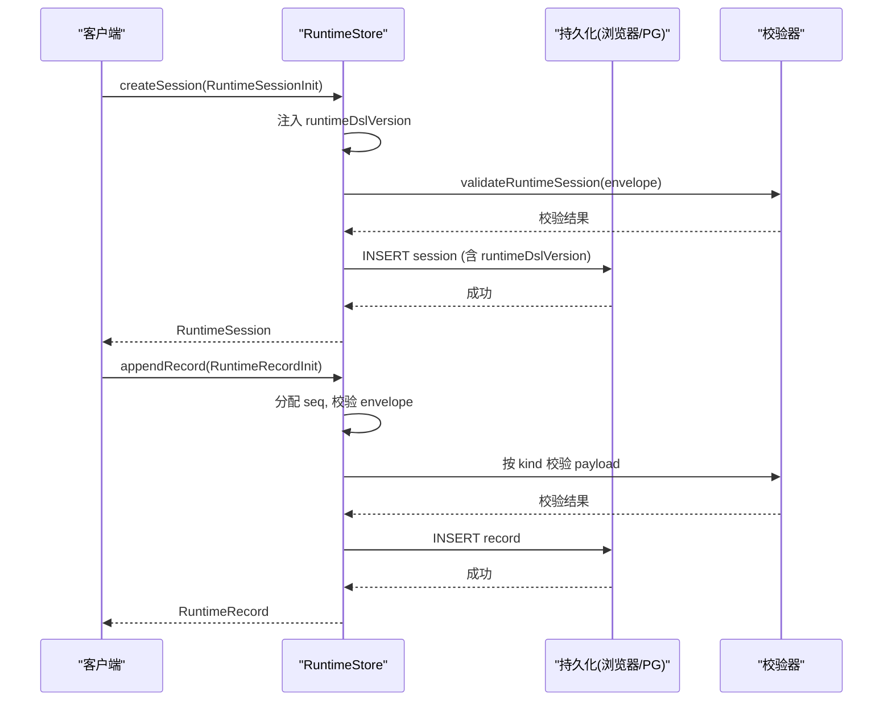

# 数据模型定义

<cite>
**本文引用的文件**   
- [packages/@openmaic/storage/src/document/types.ts](file://packages/@openmaic/storage/src/document/types.ts)
- [packages/@openmaic/storage/src/runtime/types.ts](file://packages/@openmaic/storage/src/runtime/types.ts)
- [packages/@openmaic/storage/src/runtime/pg.ts](file://packages/@openmaic/storage/src/runtime/pg.ts)
- [packages/@openmaic/storage/src/runtime/browser.ts](file://packages/@openmaic/storage/src/runtime/browser.ts)
- [packages/@openmaic/dsl/test/runtime.test.ts](file://packages/@openmaic/dsl/test/runtime.test.ts)
</cite>

## 产品概述
OpenMAIC 是 AI 驱动的交互式课件（MAIC）生成与课堂管理平台。其数据层分为两条主线：
- 文档线（Document Store）：持久化课程/舞台元数据、场景集合与大纲快照，支持按 DSL 版本迁移与校验。
- 运行时线（Runtime Store）：面向学习者的会话与追加记录（append-only），以阶段和学习者键分区，具备独立版本线与强一致性约束。

本文件聚焦核心数据模型与约束：MaicDocument、SceneLike、RuntimeSessionInit 及其相关类型，并给出实体关系、完整性约束、验证规则、版本管理与迁移策略，以及设计原则与扩展指南。

## 核心业务流程
- 文档保存与加载：对 MaicDocument 进行聚合校验、DSL 版本戳记、规范化为行写入；读取时重组并按 DSL 版本向前迁移。
- 运行时会话创建：调用 RuntimeStore.createSession 传入 RuntimeSessionInit，由存储层注入 runtimeDslVersion 并完成校验后落盘。
- 追加记录：在 ACTIVE 会话上 appendRecord，分配单调 seq，执行 envelope 校验与 payload 守卫。
- 列表与合并：按 stageId + learnerKey 分区列举会话；跨阶段学习者合并（匿名登录迁移）原子执行。

## 功能模块清单
- 文档存储接口（DocumentStore）
  - 职责：保存/加载/删除文档，增量更新场景，维护 DSL 版本与迁移。
  - 验收要点：saveDocument 全量校验与原子写；loadDocument 返回已迁移的文档；putScene/getScene/deleteScene 要求父文档版本为当前。
- 运行时存储接口（RuntimeStore）
  - 职责：会话生命周期管理、追加记录、按分区列举、学习者合并、级联删除。
  - 验收要点：createSession 强制注入版本戳；appendRecord 仅允许 ACTIVE 会话；listSessions 容忍损坏行但直接查询 fail-loud。

## 数据与状态
本节详述核心数据结构、字段、类型与约束，并给出实体关系图与数据流。

### 核心数据结构与字段说明
- SceneLike
  - 字段：
    - id: string — 场景唯一标识
    - stageId: string — 所属舞台标识
    - order: number — 排序键
  - 用途：存储层用于规范化、排序与完整性检查的最小场景形状；具体 Scene 内容对存储层透明。
- MaicDocument<TScene extends SceneLike>
  - 字段：
    - stage: Stage — 舞台元数据（由 DSL 定义）
    - scenes: TScene[] — 场景数组（默认使用 DSL Scene，可被应用拓宽）
    - outline?: unknown — 应用拥有的大纲快照，不校验、不迁移
    - dslVersion?: string — DSL 版本戳记（旧数据可能缺失）
  - 行为：
    - saveDocument：校验聚合、打 DSL 版本戳、拆分写入场景行、删除不再存在的场景；无效则整体失败。
    - loadDocument：按 stageId 重组文档、按 order 排序 scenes、附加 outline，并向前迁移至当前 DSL 版本。
    - listDocuments：仅返回与版本无关的摘要字段，容忍不可识别的 dslVersion。
    - deleteDocument：级联删除 stage、scenes 与 outline，幂等且版本无关。
    - putScene/getScene/deleteScene：增量操作，要求父文档版本为当前，否则抛错。
- RuntimeSessionInit
  - 定义：RuntimeSession 去掉 runtimeDslVersion 后的构造形状。
  - 语义：调用方不持有版本戳，存储层在 createSession 中注入 RUNTIME_DSL_VERSION 并校验完整信封。
- RuntimeSession（运行时会话）
  - 关键字段（依据实现与测试推断）：id、stageId、learnerKey、kind、status、createdAt、updatedAt、runtimeDslVersion。
  - 约束：
    - 必须携带 runtimeDslVersion（无“未版本化”时代）。
    - 状态机包含 active 等状态；appendRecord 仅允许 ACTIVE 会话。
- RuntimeRecord（运行时记录）
  - 特性：追加事实、按 seq 单调递增（由存储层分配）、承载 payload（如聊天消息骨架或测验尝试）。
  - 校验：envelope 校验 + 按 kind 的 payload 守卫（默认使用 DSL 骨架守卫）。

```mermaid
erDiagram
STAGE {
string id PK
string name
timestamp created_at
timestamp updated_at
}
SCENE {
string id PK
string stage_id FK
int order
jsonb content
}
DOCUMENT_SUMMARY {
string id PK
string name
bigint created_at
bigint updated_at
int scene_count
}
RUNTIME_SESSION {
string id PK
string stage_id
string learner_key
string kind
string status
timestamp created_at
timestamp updated_at
string runtime_dsl_version
jsonb data
}
RUNTIME_RECORD {
int seq PK
string session_id FK
string scene_id
jsonb payload
}
STAGE ||--o{ SCENE : "拥有"
STAGE ||--o{ RUNTIME_SESSION : "分区键(stage_id)" }
RUNTIME_SESSION ||--o{ RUNTIME_RECORD : "追加(seq)" }
```

**图表来源** 
- [packages/@openmaic/storage/src/document/types.ts:23-61](file://packages/@openmaic/storage/src/document/types.ts#L23-L61)
- [packages/@openmaic/storage/src/runtime/pg.ts:272-313](file://packages/@openmaic/storage/src/runtime/pg.ts#L272-L313)

**章节来源**
- [packages/@openmaic/storage/src/document/types.ts:23-61](file://packages/@openmaic/storage/src/document/types.ts#L23-L61)
- [packages/@openmaic/storage/src/runtime/types.ts:39-40](file://packages/@openmaic/storage/src/runtime/types.ts#L39-L40)

### 主外键关系与数据完整性约束
- 文档线
  - 主键：Stage.id 作为文档聚合根；Scene.id 唯一于 stageId。
  - 外键：Scene.stageId 引用 Stage.id。
  - 完整性：
    - saveDocument 前全量校验，任何非法 stage/scene 立即失败。
    - 场景行与文档版本一致：增量操作要求父文档为当前版本。
    - outline 快照不参与校验与迁移，保持原样持久化。
- 运行时线
  - 主键：RUNTIME_SESSION.id；RUNTIME_RECORD.seq 为会话内单调序号。
  - 外键：RUNTIME_RECORD.session_id 引用 RUNTIME_SESSION.id。
  - 完整性：
    - createSession 强制注入 runtimeDslVersion 并校验信封。
    - appendRecord 仅允许 ACTIVE 会话；seq 由存储层分配。
    - 列表列举容忍损坏行，但直接 getSession 对损坏行 fail-loud。

**章节来源**
- [packages/@openmaic/storage/src/document/types.ts:81-136](file://packages/@openmaic/storage/src/document/types.ts#L81-L136)
- [packages/@openmaic/storage/src/runtime/types.ts:63-161](file://packages/@openmaic/storage/src/runtime/types.ts#L63-L161)
- [packages/@openmaic/storage/src/runtime/pg.ts:272-313](file://packages/@openmaic/storage/src/runtime/pg.ts#L272-L313)

### 数据验证规则与业务逻辑约束
- 文档线
  - SceneValidator：在写入边界校验场景，默认使用 DSL validateScene；应用可扩展接受自定义场景类型。
  - MaicDocument 聚合校验：saveDocument 对 stage/scenes 进行统一校验，失败即拒绝写入。
  - 版本戳记：dslVersion 可选（历史数据缺失），读取时按 DSL 版本迁移。
- 运行时线
  - RuntimePayloadValidator：按 kind 校验 payload，默认使用 DSL 骨架守卫（如聊天消息骨架、测验尝试骨架）。
  - 会话状态约束：仅 ACTIVE 会话可追加记录；setSessionStatus 需满足状态转换与时间戳单调性。
  - 版本线隔离：runtimeDslVersion 与文档 dslVersion 完全分离，运行时不存在“未版本化”时代。

**章节来源**
- [packages/@openmaic/storage/src/document/types.ts:35-37](file://packages/@openmaic/storage/src/document/types.ts#L35-L37)
- [packages/@openmaic/storage/src/runtime/types.ts:46-48](file://packages/@openmaic/storage/src/runtime/types.ts#L46-L48)
- [packages/@openmaic/dsl/test/runtime.test.ts:80-106](file://packages/@openmaic/dsl/test/runtime.test.ts#L80-L106)

### 数据结构版本管理、向后兼容性与迁移策略
- 文档线
  - 版本键：dslVersion（DSL_VERSION_KEY）。
  - 迁移策略：loadDocument 读取时向前迁移；listDocuments 容忍未知版本以避免全局故障。
  - 兼容性：新增场景类型通过 SceneValidator 扩展，不影响存储层通用逻辑。
- 运行时线
  - 版本键：runtimeDslVersion（RUNTIME_DSL_VERSION_KEY），与文档版本键严格分离。
  - 迁移策略：migrateRuntime 在读取时向前迁移；createSession 强制注入当前版本；未来版本数据不被降级。
  - 兼容性：payload 守卫按 kind 注入，应用可替换默认守卫以满足自定义 payload 结构。

**章节来源**
- [packages/@openmaic/storage/src/document/types.ts:56-61](file://packages/@openmaic/storage/src/document/types.ts#L56-L61)
- [packages/@openmaic/storage/src/runtime/types.ts:14-24](file://packages/@openmaic/storage/src/runtime/types.ts#L14-L24)
- [packages/@openmaic/dsl/test/runtime.test.ts:222-254](file://packages/@openmaic/dsl/test/runtime.test.ts#L222-L254)

### 关键流程时序（运行时会话创建与追加记录）


**图表来源** 
- [packages/@openmaic/storage/src/runtime/types.ts:63-121](file://packages/@openmaic/storage/src/runtime/types.ts#L63-L121)
- [packages/@openmaic/storage/src/runtime/browser.ts:219-238](file://packages/@openmaic/storage/src/runtime/browser.ts#L219-L238)
- [packages/@openmaic/storage/src/runtime/pg.ts:290-313](file://packages/@openmaic/storage/src/runtime/pg.ts#L290-L313)

**章节来源**
- [packages/@openmaic/storage/src/runtime/types.ts:63-121](file://packages/@openmaic/storage/src/runtime/types.ts#L63-L121)
- [packages/@openmaic/storage/src/runtime/browser.ts:219-238](file://packages/@openmaic/storage/src/runtime/browser.ts#L219-L238)
- [packages/@openmaic/storage/src/runtime/pg.ts:290-313](file://packages/@openmaic/storage/src/runtime/pg.ts#L290-L313)

### 设计原则与扩展指南
- 分层清晰：文档线与运行时线各自维护版本与迁移，互不干扰。
- 强校验优先：所有写入路径均先校验再落盘，失败即抛错（fail-loud）。
- 版本隔离：dslVersion 与 runtimeDslVersion 严格分离，避免混淆。
- 可扩展性：
  - 文档线：通过 SceneValidator 扩展场景类型，无需改动存储层通用逻辑。
  - 运行时线：通过 RuntimePayloadValidator 映射扩展 payload 校验，支持自定义 kind。
- 容错与健壮性：
  - 列表列举容忍损坏行，直接查询 fail-loud，保证局部故障不扩散。
  - 多租户分区（stageId + learnerKey）确保数据隔离与高效检索。
- 向后兼容：
  - 文档线：历史数据缺失 dslVersion 时按默认版本处理并在读取时迁移。
  - 运行时线：不存在未版本化时代，所有会话自创建即带版本戳。

**章节来源**
- [packages/@openmaic/storage/src/document/types.ts:81-136](file://packages/@openmaic/storage/src/document/types.ts#L81-L136)
- [packages/@openmaic/storage/src/runtime/types.ts:63-161](file://packages/@openmaic/storage/src/runtime/types.ts#L63-L161)
- [packages/@openmaic/storage/src/runtime/browser.ts:75-82](file://packages/@openmaic/storage/src/runtime/browser.ts#L75-L82)

## 关键约束与边界
- 非功能性需求
  - 性能：场景行增量写入避免全量 diff 复杂对象；列表列举容忍损坏行以提升可用性。
  - 一致性：appendRecord 在同一事务内分配 seq 并插入，保证顺序与原子性。
  - 安全性：key 值合法性校验（如 PostgreSQL text 参数限制），防止注入与编码问题。
- 依赖与集成边界
  - DSL 包提供类型与校验工具（骨架守卫、版本常量、迁移函数）。
  - 存储后端（浏览器 IndexedDB / PostgreSQL）遵循统一接口契约。
- 业务约束
  - 仅 slide 类型场景支持再生成（根据编辑代理设计文档）。
  - 运行时会话状态机严格限制操作（如仅 ACTIVE 可追加记录）。

**章节来源**
- [lib/agent/DESIGN-regenerate-scene.md:1-102](file://lib/agent/DESIGN-regenerate-scene.md#L1-L102)
- [packages/@openmaic/storage/src/runtime/pg.ts:177-209](file://packages/@openmaic/storage/src/runtime/pg.ts#L177-L209)