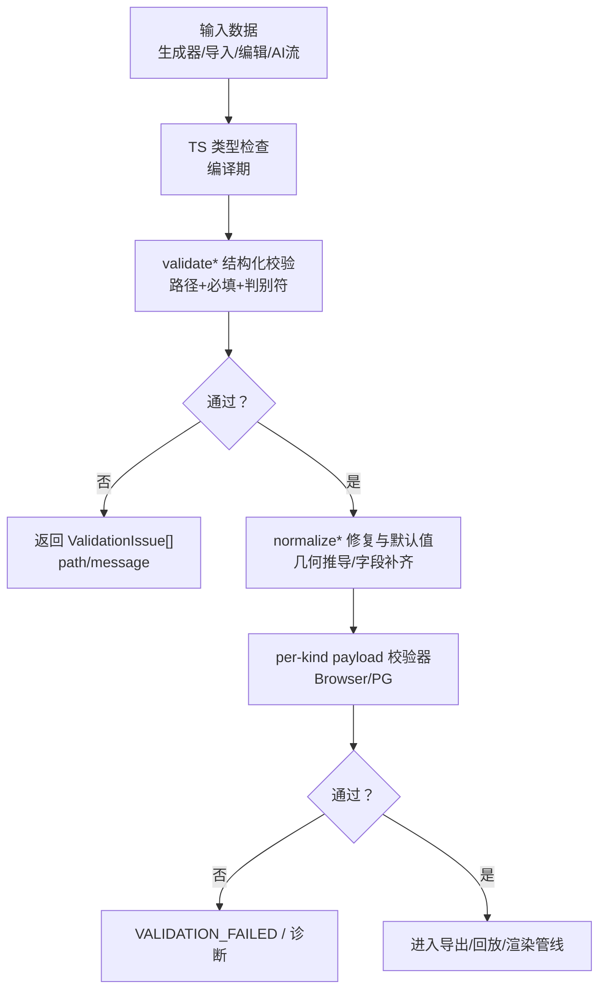
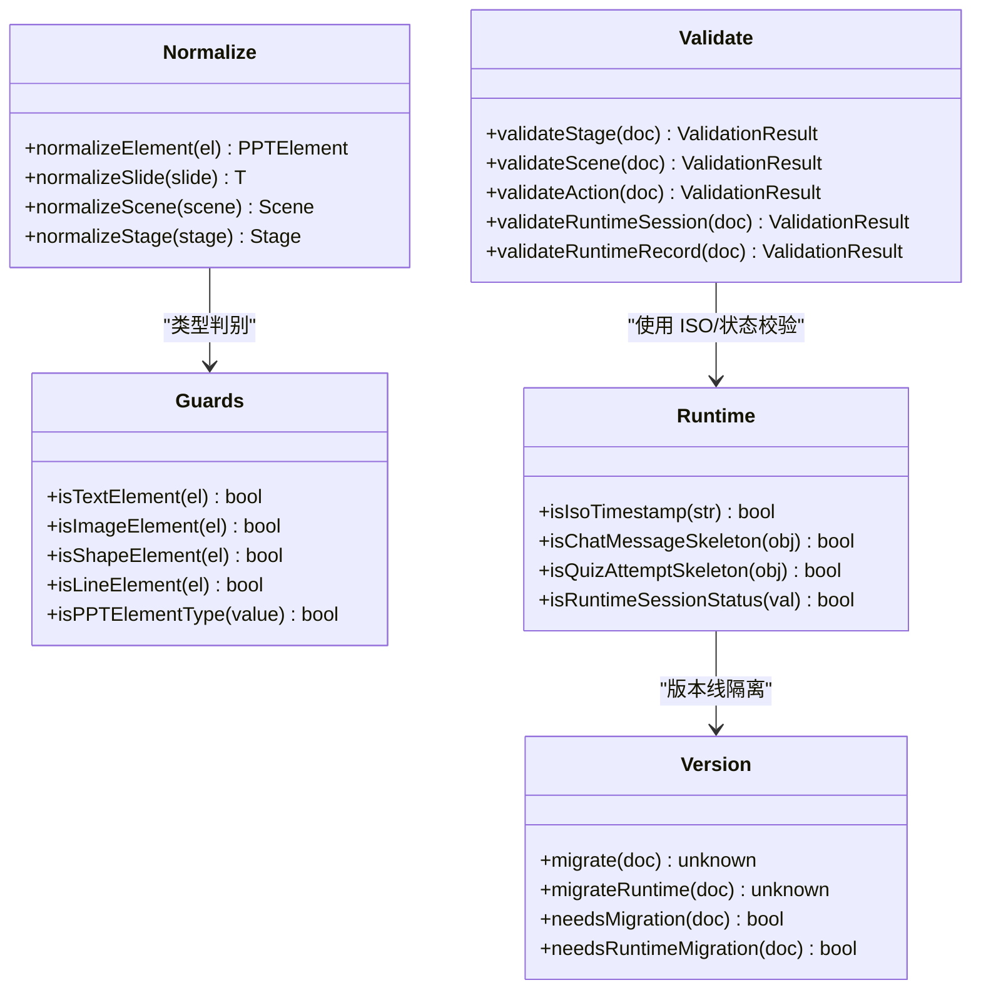
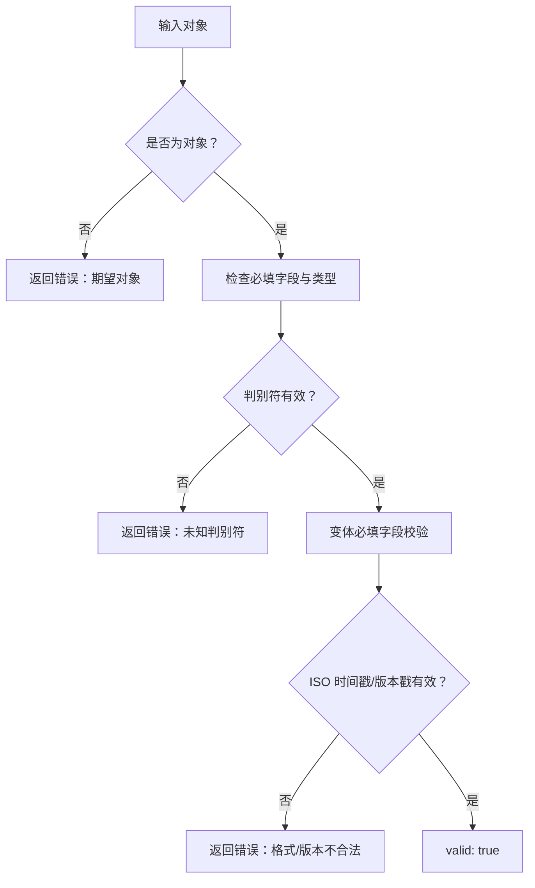
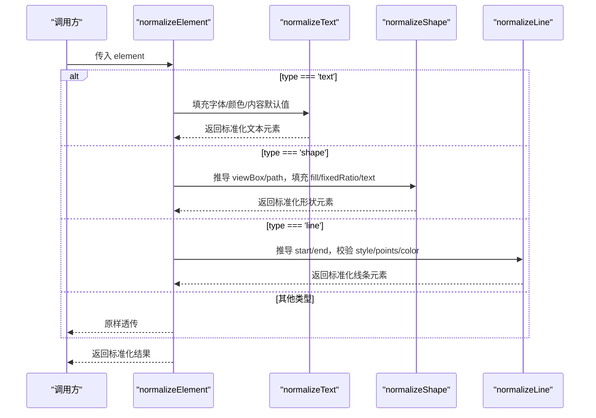
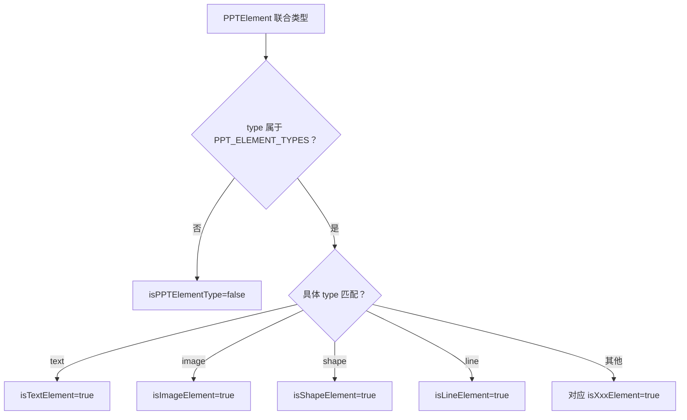
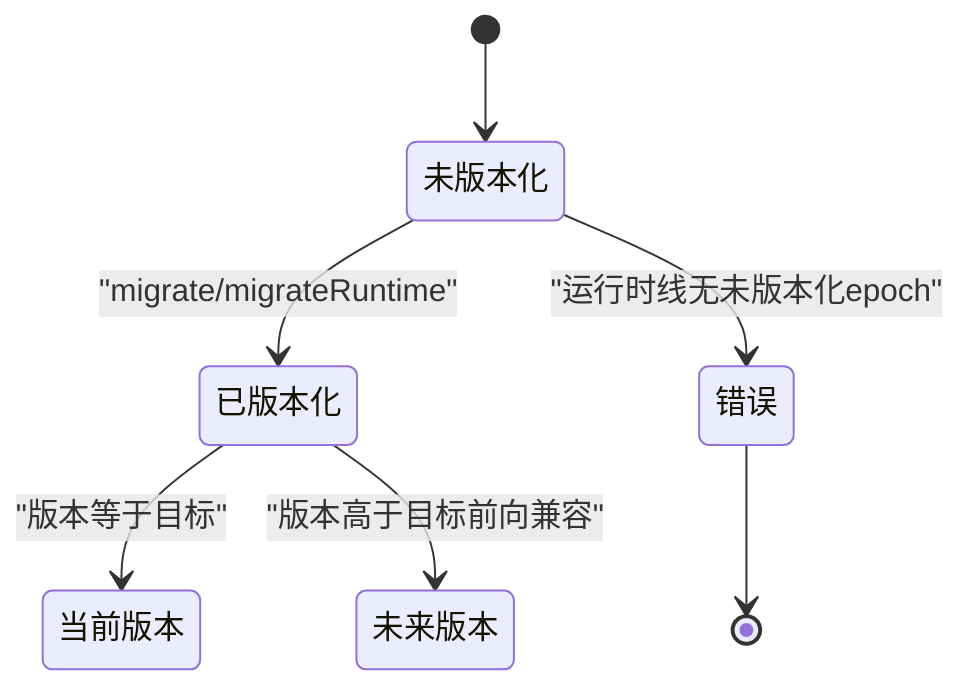
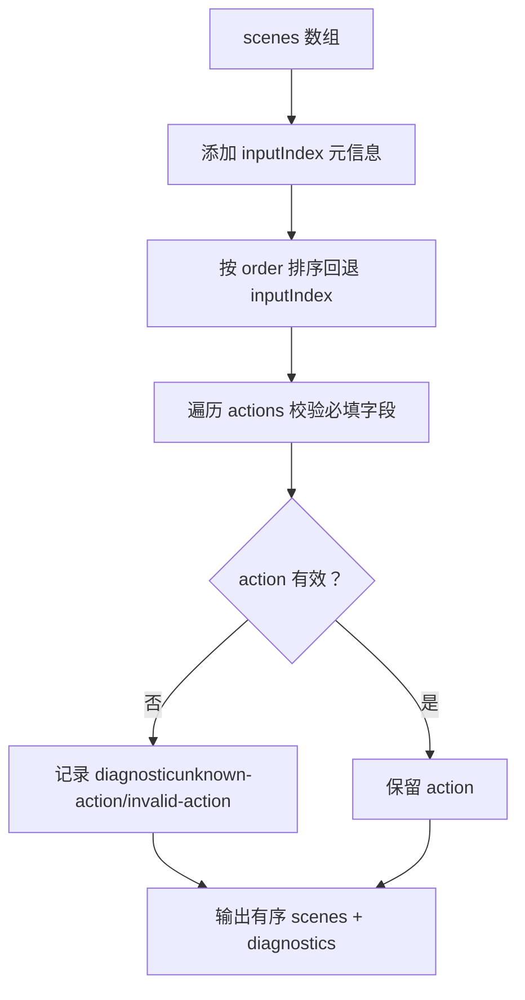
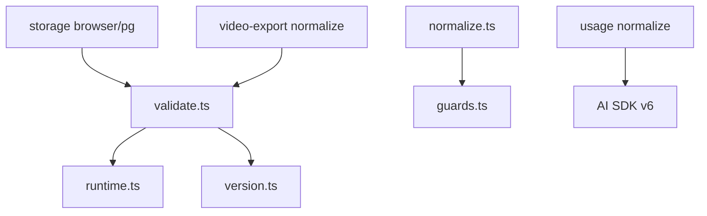

# 数据验证与规范化

<cite>
**本文引用的文件**   
- [validate.ts](file://packages/@openmaic/dsl/src/validate.ts)
- [normalize.ts](file://packages/@openmaic/dsl/src/normalize.ts)
- [guards.ts](file://packages/@openmaic/dsl/src/guards.ts)
- [runtime.ts](file://packages/@openmaic/dsl/src/runtime.ts)
- [version.ts](file://packages/@openmaic/dsl/src/version.ts)
- [browser.ts](file://packages/@openmaic/storage/src/runtime/browser.ts)
- [pg.ts](file://packages/@openmaic/storage/src/runtime/pg.ts)
- [normalize.ts（视频导出）](file://lib/video-export/passes/normalize.ts)
- [normalize.ts（用量归一化）](file://lib/usage/normalize.ts)
- [eval-tail-parser.ts](file://lib/pbl/v2/operations/eval-tail-parser.ts)
- [use-instructor-stream.ts](file://components/scene-renderers/pbl/v2/use-instructor-stream.ts)
- [edit-elements-patch.ts](file://lib/agent/tools/edit-elements-patch.ts)
</cite>

## 产品概述
本文件聚焦 OpenMAIC 的数据验证与规范化体系，覆盖以下核心目标：
- 统一 DSL 文档与运行时数据的校验边界、错误报告机制与可扩展的自定义校验器。
- 明确 normalize* 函数的数据修复策略、默认值填充与几何推导规则。
- 解释 guard 类型守卫的实现原理与使用场景。
- 构建“JSON Schema + TypeScript 类型检查 + 运行时验证”的三层防护。
- 提供最佳实践、错误处理策略与性能优化建议，并给出可追溯的示例路径。

OpenMAIC 以 DSL 为核心契约，validate* 负责结构校验，normalize* 负责数据修复与默认值补齐，guards 提供轻量运行时判别；存储层在 append 边界注入 per-kind 的 payload 校验器，形成从前端到持久化的完整防线。

## 核心业务流程
- 输入来源：课件生成器、导入器、用户编辑、AI 流式输出等。
- 第一道防线：TypeScript 类型约束（编译期）。
- 第二道防线：DSL 结构化校验 validate*（运行期），快速失败并定位路径。
- 第三道防线：normalize* 数据修复（默认值、几何推导、容错降级）。
- 第四道防线：存储层 per-kind payload 校验器（浏览器 IndexedDB / Postgres），拒绝非法负载。
- 第五道防线：导出/回放/渲染前的二次校验与诊断（如视频导出 pass）。



**章节来源**
- [validate.ts:1-392](file://packages/@openmaic/dsl/src/validate.ts#L1-L392)
- [normalize.ts:1-413](file://packages/@openmaic/dsl/src/normalize.ts#L1-L413)
- [browser.ts:75-356](file://packages/@openmaic/storage/src/runtime/browser.ts#L75-L356)
- [pg.ts:101-147](file://packages/@openmaic/storage/src/runtime/pg.ts#L101-L147)

## 功能模块清单
- validate* 校验器族
  - 职责：对 Stage/Scene/Action/RuntimeSession/RuntimeRecord 进行结构校验，包含必填字段、判别符、ISO 时间戳、版本戳等。
  - 输出：{ valid: true } 或 { valid: false; errors: [{ path, message }] }。
  - 扩展点：新增 action/scene 变体时同步维护 ACTION_REQUIRED_FIELDS 与 JSON Schema。
- normalize* 修复器族
  - 职责：为元素内容填充静态默认值、推导几何相关字段（如 line.start/end、shape.viewBox/path）、对错误类型 fail-loud。
  - 策略：缺失→默认；存在但类型错误→抛错；存在且正确→透传。幂等、纯函数、不修改输入。
  - 范围：仅元素 content 与可推导字段；基础 id/geometry 由生产者提供。
- guards 类型守卫
  - 职责：基于 discriminant type 快速判定 PPTElement 具体变体，零依赖、无副作用。
  - 用途：渲染分支、工具链判断、窄化类型。
- runtime 运行时契约
  - 职责：定义 RuntimeSession/Record 信封、状态枚举、角色/阶段枚举、ISO 时间戳校验、payload skeleton。
  - 关键点：会话必须带 runtimeDslVersion；createdAt/updatedAt 严格 ISO 8601；payload 非 undefined。
- version 版本与迁移
  - 职责：文档行与运行时行双版本线，独立迁移阶梯；跨线保护防止误路由；fail-loud 策略。
- 存储层 per-kind payload 校验
  - 职责：在 append 边界按 kind 注入校验器（chat/quizAttempt/playback 等），支持替换默认映射。
  - 行为：校验失败返回 VALIDATION_FAILED；成功则继续写入。
- 视频导出 normalize pass
  - 职责：确定性排序 scenes；校验 action 必填字段；丢弃不可解析动作并产出诊断。
- 用量归一化
  - 职责：将不同 provider 的 usage 归一化为四分类 + reasoningTokens，便于计费与展示。
- 评分归一化
  - 职责：将 LLM 输出的 stars 归一化为 0-5 的 0.5 步进数值，越界钳制，非法输入返回 null。
- 流式错误容忍
  - 职责：区分可容忍的软错误（如 EMPTY_LLM_OUTPUT）与致命错误，保障评测流程不被误中断。

**章节来源**
- [validate.ts:1-392](file://packages/@openmaic/dsl/src/validate.ts#L1-L392)
- [normalize.ts:1-413](file://packages/@openmaic/dsl/src/normalize.ts#L1-L413)
- [guards.ts:1-81](file://packages/@openmaic/dsl/src/guards.ts#L1-L81)
- [runtime.ts:1-385](file://packages/@openmaic/dsl/src/runtime.ts#L1-L385)
- [version.ts:1-583](file://packages/@openmaic/dsl/src/version.ts#L1-L583)
- [browser.ts:75-356](file://packages/@openmaic/storage/src/runtime/browser.ts#L75-L356)
- [pg.ts:101-147](file://packages/@openmaic/storage/src/runtime/pg.ts#L101-L147)
- [normalize.ts（视频导出）:1-110](file://lib/video-export/passes/normalize.ts#L1-L110)
- [normalize.ts（用量归一化）:1-67](file://lib/usage/normalize.ts#L1-L67)
- [eval-tail-parser.ts:156-194](file://lib/pbl/v2/operations/eval-tail-parser.ts#L156-L194)
- [use-instructor-stream.ts:363-410](file://components/scene-renderers/pbl/v2/use-instructor-stream.ts#L363-L410)

## 数据与状态
- 文档行（Stage/Scene/Action）
  - 校验：validateStage/validateScene/validateAction，严格检查必填、判别符、content/type 绑定。
  - 修复：normalizeScene/normalizeSlide/normalizeElement，填充字体/颜色/对齐/几何等默认值，推导 line.start/end、shape.path/viewBox。
- 运行时行（RuntimeSession/RuntimeRecord）
  - 校验：validateRuntimeSession/validateRuntimeRecord，强制 runtimeDslVersion、ISO 时间戳、seq/actionIndex 非负整数、payload 非 undefined。
  - 迁移：migrate/migrateRuntime 分别作用于文档/运行时版本线，禁止跨线污染。
- 元素模型（PPTElement）
  - 守卫：isTextElement/isImageElement/isShapeElement/isLineElement 等，基于 type 判别。
  - 修复：normalizeElement 针对 text/image/shape/line 做默认值与几何推导，其他类型透传。
- 存储层
  - BrowserRuntimeStore/Postgres 实现均支持 payloadValidators 注入，按 kind 校验 payload。
  - 校验失败返回 VALIDATION_FAILED，阻止写入；成功则追加记录。
- 导出与回放
  - 视频导出 normalizeScenes：确定性排序、action 必填校验、丢弃无效动作并收集诊断。
  - 回放/评测：normalizeStars 归一化评分；streamingEvaluationPreview/streamingMessagePreview 清理尾部 JSON/协议标记。



**图表来源**
- [validate.ts:1-392](file://packages/@openmaic/dsl/src/validate.ts#L1-L392)
- [normalize.ts:1-413](file://packages/@openmaic/dsl/src/normalize.ts#L1-L413)
- [guards.ts:1-81](file://packages/@openmaic/dsl/src/guards.ts#L1-L81)
- [runtime.ts:1-385](file://packages/@openmaic/dsl/src/runtime.ts#L1-L385)
- [version.ts:1-583](file://packages/@openmaic/dsl/src/version.ts#L1-L583)

**章节来源**
- [validate.ts:1-392](file://packages/@openmaic/dsl/src/validate.ts#L1-L392)
- [normalize.ts:1-413](file://packages/@openmaic/dsl/src/normalize.ts#L1-L413)
- [guards.ts:1-81](file://packages/@openmaic/dsl/src/guards.ts#L1-L81)
- [runtime.ts:1-385](file://packages/@openmaic/dsl/src/runtime.ts#L1-L385)
- [version.ts:1-583](file://packages/@openmaic/dsl/src/version.ts#L1-L583)
- [browser.ts:75-356](file://packages/@openmaic/storage/src/runtime/browser.ts#L75-L356)
- [pg.ts:101-147](file://packages/@openmaic/storage/src/runtime/pg.ts#L101-L147)
- [normalize.ts（视频导出）:1-110](file://lib/video-export/passes/normalize.ts#L1-L110)

## 关键约束与边界
- 三层防护机制
  - JSON Schema：跨语言契约镜像，用于非 TS 消费者与全量值级校验。
  - TypeScript：编译期类型约束，确保字段存在性与基本形态。
  - 运行时验证：validate* + per-kind payload 校验器，快速失败并定位路径。
- 错误报告机制
  - ValidationIssue 携带 path（类 JSON-pointer）与 message，便于 UI 提示与调试。
  - 存储层返回 VALIDATION_FAILED，避免泄露内部细节。
  - 视频导出 pass 产出 Diagnostic，记录被丢弃的动作与原因。
- 自定义验证器开发
  - 在 BrowserRuntimeStore/PG 中通过 payloadValidators 替换默认映射，按 kind 注入校验逻辑。
  - 校验器返回 { valid: true } 或 { valid: false; errors: [...] }，遵循统一接口。
- 规范化边界
  - normalize* 仅负责结构性默认值与几何推导；媒体尺寸适配等外部依赖由生产者处理。
  - 对“存在但类型错误”的字段 fail-loud，避免静默破坏。
- 版本与迁移
  - 文档/运行时双版本线，互不读取对方 stamp；跨线环境直接抛错。
  - 运行时线无未版本化 epoch，未带 runtimeDslVersion 的对象视为错误。
- 性能与稳定性
  - validate* 与 normalize* 均为纯函数、无外部依赖，适合高频调用。
  - 视频导出 normalizeScenes 确定性排序，避免抖动；丢弃无效动作而非崩溃。
  - 用量归一化与评分归一化采用短路/钳制策略，避免异常值传播。

**章节来源**
- [validate.ts:1-392](file://packages/@openmaic/dsl/src/validate.ts#L1-L392)
- [browser.ts:75-356](file://packages/@openmaic/storage/src/runtime/browser.ts#L75-L356)
- [pg.ts:101-147](file://packages/@openmaic/storage/src/runtime/pg.ts#L101-L147)
- [normalize.ts（视频导出）:1-110](file://lib/video-export/passes/normalize.ts#L1-L110)
- [version.ts:1-583](file://packages/@openmaic/dsl/src/version.ts#L1-L583)
- [normalize.ts（用量归一化）:1-67](file://lib/usage/normalize.ts#L1-L67)
- [eval-tail-parser.ts:156-194](file://lib/pbl/v2/operations/eval-tail-parser.ts#L156-L194)

## 详细组件分析

### validate* 校验器族
- 设计要点
  - 结构化子集校验：presence + 判别符 + 必要字段形状，不包含值级格式（由 JSON Schema 补充）。
  - 统一错误模型：ValidationIssue 含 path 与 message，便于聚合与上报。
  - 运行时契约：RuntimeSession/Record 强约束 ISO 时间戳、版本号、非负整数索引、payload 非 undefined。
- 关键函数
  - validateStage/validateScene/validateAction：校验 Stage/Scene/Action 结构与变体必填字段。
  - validateRuntimeSession/validateRuntimeRecord：校验会话与记录信封，含 ISO 时间戳、版本戳、锚点字段。
- 扩展方式
  - 新增 action 变体需更新 ACTION_REQUIRED_FIELDS，保持与 JSON Schema 一致。
  - 新增 scene/content 类型由应用侧扩展，契约保留 open string 的 kind。



**图表来源**
- [validate.ts:1-392](file://packages/@openmaic/dsl/src/validate.ts#L1-L392)

**章节来源**
- [validate.ts:1-392](file://packages/@openmaic/dsl/src/validate.ts#L1-L392)

### normalize* 修复器族
- 设计要点
  - 缺失→默认；存在但类型错误→抛错；存在且正确→透传。幂等、纯函数、不修改输入。
  - 几何推导：line.start/end 基于局部坐标系；shape.path/viewBox 由 width/height 推导。
  - 作用域：仅元素 content 与可推导字段；id/geometry 由生产者提供。
- 关键函数
  - normalizeElement：按 type 分发至 text/image/shape/line 的专用修复逻辑。
  - normalizeSlide/normalizeScene/normalizeStage：批量修复 elements 与 whiteboards。
  - normalizeSlideWith：支持 onInvalid='drop' 与 onDropped 回调，用于不可信输入的降级处理。
- 默认值来源
  - ELEMENT_DEFAULTS 作为唯一事实源，同时镜像到 JSON Schema 的 @default 注解。



**图表来源**
- [normalize.ts:1-413](file://packages/@openmaic/dsl/src/normalize.ts#L1-L413)

**章节来源**
- [normalize.ts:1-413](file://packages/@openmaic/dsl/src/normalize.ts#L1-L413)

### guards 类型守卫
- 设计要点
  - 基于 discriminant type 的快速判别，零依赖、无副作用。
  - 提供 isPPTElementType 与各元素类型的 isXxxElement 守卫。
- 使用场景
  - 渲染分支选择、工具链判断、窄化类型以避免断言。
  - 与 normalize* 配合，确保只处理已知类型。



**图表来源**
- [guards.ts:1-81](file://packages/@openmaic/dsl/src/guards.ts#L1-L81)

**章节来源**
- [guards.ts:1-81](file://packages/@openmaic/dsl/src/guards.ts#L1-L81)

### runtime 运行时契约与版本迁移
- 运行时契约
  - RuntimeSession 必须带 runtimeDslVersion；createdAt/updatedAt 严格 ISO 8601。
  - RuntimeRecord.seq 为非负整数，actionIndex 同理；payload 非 undefined。
  - ChatMessageSkeleton/QuizAttemptSkeleton 提供最小骨架，应用可扩展。
- 版本迁移
  - 文档行 migrate：从 dslVersion 迁移至 DSL_VERSION，支持前向兼容与 fail-loud。
  - 运行时行 migrateRuntime：从 runtimeDslVersion 迁移至 RUNTIME_DSL_VERSION，无未版本化 epoch。
  - 跨线保护：若对象携带另一条线的 stamp 而缺少本线 stamp，直接抛错。



**图表来源**
- [version.ts:1-583](file://packages/@openmaic/dsl/src/version.ts#L1-L583)
- [runtime.ts:1-385](file://packages/@openmaic/dsl/src/runtime.ts#L1-L385)

**章节来源**
- [runtime.ts:1-385](file://packages/@openmaic/dsl/src/runtime.ts#L1-L385)
- [version.ts:1-583](file://packages/@openmaic/dsl/src/version.ts#L1-L583)

### 存储层 per-kind payload 校验
- 设计要点
  - 在 append 边界按 session.kind 选择校验器，支持替换默认映射。
  - 校验失败返回 VALIDATION_FAILED，阻止写入；成功则追加记录。
- 关键实现
  - BrowserRuntimeStore/PG 均暴露 payloadValidators 配置项。
  - DEFAULT_PAYLOAD_VALIDATORS 提供 chat/quizAttempt 的默认骨架校验。

```mermaid
sequenceDiagram
participant Client as "客户端"
participant Store as "BrowserRuntimeStore/PG"
participant Validator as "payloadValidators[kind]"
participant DB as "IndexedDB/Postgres"
Client->>Store : appendRecord(sessionId, recordInit)
Store->>Store : 校验 envelopevalidateRuntimeRecord
Store->>Validator : 校验 payloadkind 特定
alt 校验失败
Validator-->>Store : { valid : false; errors }
Store-->>Client : 400 VALIDATION_FAILED
else 校验成功
Validator-->>Store : { valid : true }
Store->>DB : 写入记录
Store-->>Client : 201 成功
end
```

**图表来源**
- [browser.ts:75-356](file://packages/@openmaic/storage/src/runtime/browser.ts#L75-L356)
- [pg.ts:101-147](file://packages/@openmaic/storage/src/runtime/pg.ts#L101-L147)

**章节来源**
- [browser.ts:75-356](file://packages/@openmaic/storage/src/runtime/browser.ts#L75-L356)
- [pg.ts:101-147](file://packages/@openmaic/storage/src/runtime/pg.ts#L101-L147)

### 视频导出 normalize pass
- 设计要点
  - 确定性排序：按 order 排序，回退到输入索引，保证回放顺序稳定。
  - Action 校验：缺失必填字段则丢弃并记录诊断，避免下游崩溃。
- 关键函数
  - normalizeScenes：排序 + validateActions，返回 ordered scenes 与 diagnostics。



**图表来源**
- [normalize.ts（视频导出）:1-110](file://lib/video-export/passes/normalize.ts#L1-L110)

**章节来源**
- [normalize.ts（视频导出）:1-110](file://lib/video-export/passes/normalize.ts#L1-L110)

### 用量归一化与评分归一化
- 用量归一化
  - normalizeUsage：将 AI SDK v6 的 LanguageModelUsage 归一化为四分类 + reasoningTokens，缺失字段补 0。
  - hasBillableTokens：判断是否存在可计费 token，避免空行写入。
- 评分归一化
  - normalizeStars：接受数字、字符串、“n/5”形式，钳制到 [0,5] 并以 0.5 步进；非法输入返回 null。

**章节来源**
- [normalize.ts（用量归一化）:1-67](file://lib/usage/normalize.ts#L1-L67)
- [eval-tail-parser.ts:156-194](file://lib/pbl/v2/operations/eval-tail-parser.ts#L156-L194)

### 流式错误容忍与预览清理
- 流式错误容忍
  - isToleratedReactionStreamError：仅允许 instructor 流的 EMPTY_LLM_OUTPUT 软错误，其他错误视为致命。
- 预览清理
  - streamingEvaluationPreview/streamingMessagePreview：移除尾部 JSON/协议标记，保证流式预览整洁。

**章节来源**
- [use-instructor-stream.ts:363-410](file://components/scene-renderers/pbl/v2/use-instructor-stream.ts#L363-L410)

## 依赖分析
- 模块耦合
  - validate* 依赖 runtime 与 version 提供的类型与常量，无外部依赖。
  - normalize* 依赖 guards 与 slides 类型，纯函数，无副作用。
  - 存储层依赖 validateRuntimeRecord 与 payloadValidators，隔离 per-kind 逻辑。
- 外部依赖
  - AI SDK v6 的 LanguageModelUsage 用于用量归一化。
  - IndexedDB/Postgres 作为持久化后端，校验失败统一返回 VALIDATION_FAILED。
- 潜在循环依赖
  - 通过纯函数与类型解耦，避免循环引用；validate/normalize/guards 相互独立。



**图表来源**
- [validate.ts:1-392](file://packages/@openmaic/dsl/src/validate.ts#L1-L392)
- [normalize.ts:1-413](file://packages/@openmaic/dsl/src/normalize.ts#L1-L413)
- [guards.ts:1-81](file://packages/@openmaic/dsl/src/guards.ts#L1-L81)
- [runtime.ts:1-385](file://packages/@openmaic/dsl/src/runtime.ts#L1-L385)
- [version.ts:1-583](file://packages/@openmaic/dsl/src/version.ts#L1-L583)
- [browser.ts:75-356](file://packages/@openmaic/storage/src/runtime/browser.ts#L75-L356)
- [pg.ts:101-147](file://packages/@openmaic/storage/src/runtime/pg.ts#L101-L147)
- [normalize.ts（视频导出）:1-110](file://lib/video-export/passes/normalize.ts#L1-L110)
- [normalize.ts（用量归一化）:1-67](file://lib/usage/normalize.ts#L1-L67)

**章节来源**
- [validate.ts:1-392](file://packages/@openmaic/dsl/src/validate.ts#L1-L392)
- [normalize.ts:1-413](file://packages/@openmaic/dsl/src/normalize.ts#L1-L413)
- [guards.ts:1-81](file://packages/@openmaic/dsl/src/guards.ts#L1-L81)
- [runtime.ts:1-385](file://packages/@openmaic/dsl/src/runtime.ts#L1-L385)
- [version.ts:1-583](file://packages/@openmaic/dsl/src/version.ts#L1-L583)
- [browser.ts:75-356](file://packages/@openmaic/storage/src/runtime/browser.ts#L75-L356)
- [pg.ts:101-147](file://packages/@openmaic/storage/src/runtime/pg.ts#L101-L147)
- [normalize.ts（视频导出）:1-110](file://lib/video-export/passes/normalize.ts#L1-L110)
- [normalize.ts（用量归一化）:1-67](file://lib/usage/normalize.ts#L1-L67)

## 性能考虑
- 校验与修复均为纯函数，无 IO 与外部依赖，适合高频调用。
- normalizeSlideWith 支持 drop 模式，避免单个元素错误拖垮整体文档。
- 视频导出 normalizeScenes 确定性排序，减少重排与抖动。
- 用量/评分归一化采用短路/钳制，避免异常值传播与计算开销。
- 存储层校验在 append 边界执行，失败即止，避免无效写入。

[本节为通用指导，无需源码引用]

## 故障排查指南
- 常见错误
  - VALIDATION_FAILED：payload 不符合 per-kind 校验器，检查字段类型与必填项。
  - 未知 action type：导出 pass 会丢弃并记录诊断，检查生成器输出。
  - ISO 时间戳不合法：ensure createdAt/updatedAt 符合 ISO 8601 带时区。
  - 运行时线未带 runtimeDslVersion：确认会话创建时已打版本戳。
- 定位方法
  - 查看 ValidationIssue[].path 与 message，快速定位问题字段。
  - 启用 onDropped 回调，观察被丢弃的元素与错误原因。
  - 检查 video-export diagnostics，了解被丢弃的 action 详情。
- 恢复策略
  - 对不可信输入使用 normalizeSlideWith({ onInvalid: 'drop' }) 降级。
  - 修正 payload 结构后重试 append；必要时替换 payloadValidators。

**章节来源**
- [browser.ts:75-356](file://packages/@openmaic/storage/src/runtime/browser.ts#L75-L356)
- [pg.ts:101-147](file://packages/@openmaic/storage/src/runtime/pg.ts#L101-L147)
- [normalize.ts（视频导出）:1-110](file://lib/video-export/passes/normalize.ts#L1-L110)
- [normalize.ts:1-413](file://packages/@openmaic/dsl/src/normalize.ts#L1-L413)

## 结论
OpenMAIC 的数据验证与规范化体系以 validate* 与 normalize* 为核心，结合 guards 与 per-kind payload 校验器，构建了从编译期到运行时的多层防护。通过严格的错误报告、可插拔的自定义校验器、幂等的修复策略与确定性导出流程，确保了数据质量与系统稳定性。建议在生产环境中：
- 始终启用 validate* 与 per-kind payload 校验。
- 对不可信输入采用 drop 模式与 onDropped 回调。
- 定期审查 diagnostics 与 ValidationIssue，持续优化数据管道。
- 保持 JSON Schema 与 validate* 的一致性，避免契约漂移。

[本节为总结性内容，无需源码引用]