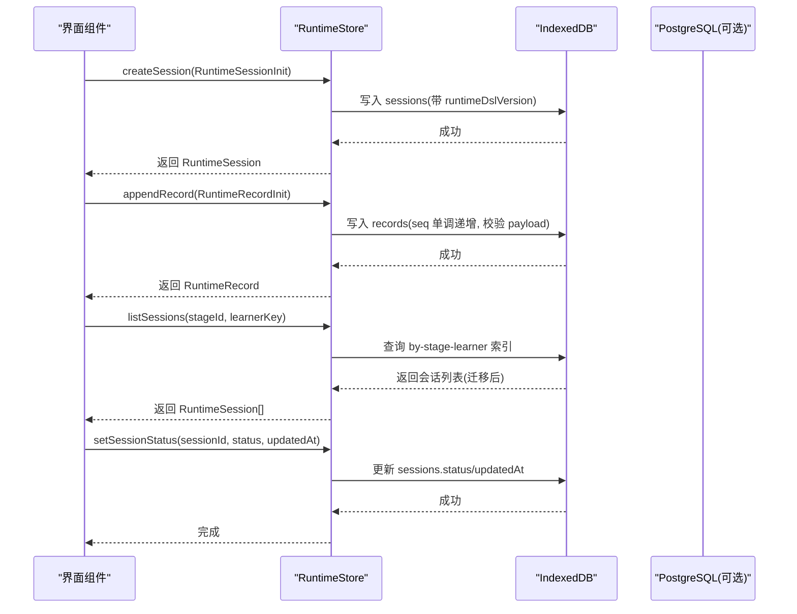
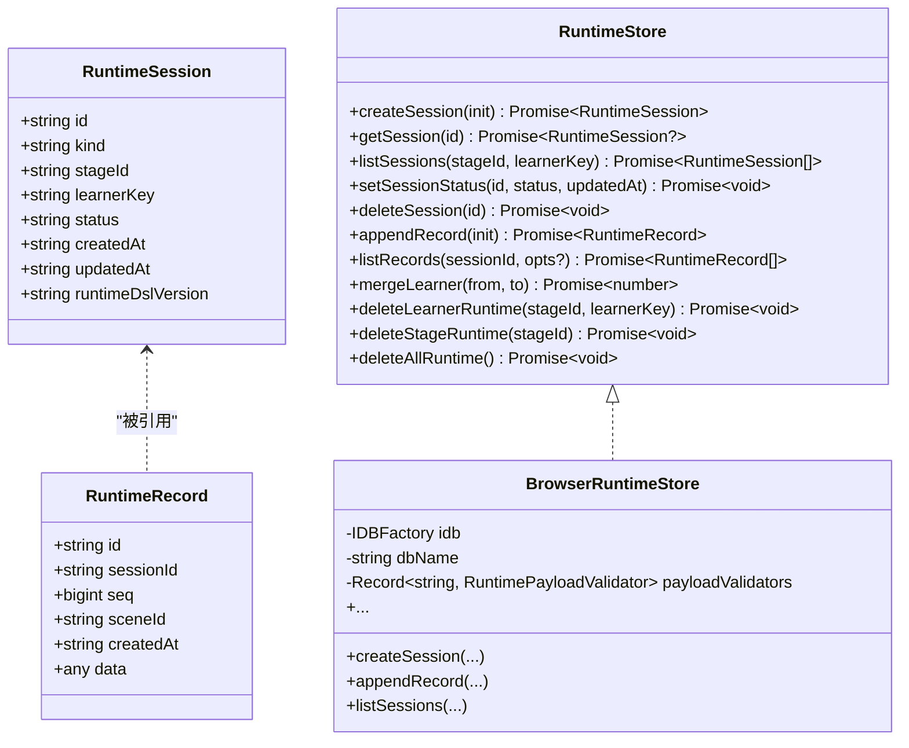
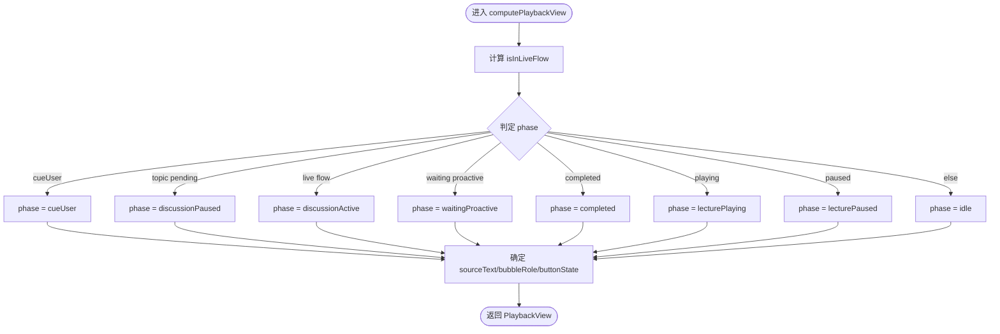

# 运行时数据模型

<cite>
**本文引用的文件**   
- [packages/@openmaic/storage/src/runtime/types.ts](file://packages/@openmaic/storage/src/runtime/types.ts)
- [packages/@openmaic/storage/src/runtime/browser.ts](file://packages/@openmaic/storage/src/runtime/browser.ts)
- [packages/@openmaic/storage/src/runtime/pg.ts](file://packages/@openmaic/storage/src/runtime/pg.ts)
- [packages/@openmaic/storage/README.md](file://packages/@openmaic/storage/README.md)
- [lib/playback/derived-state.ts](file://lib/playback/derived-state.ts)
- [components/chat/use-chat-sessions.ts](file://components/chat/use-chat-sessions.ts)
- [tests/runtime/stage-storage-chat-failure.test.ts](file://tests/runtime/stage-storage-chat-failure.test.ts)
- [tests/store/stage-document-persistence.test.ts](file://tests/store/stage-document-persistence.test.ts)
</cite>

## 目录
- 产品概述
- 核心业务流程
- 功能模块清单
- 数据与状态
- 关键约束与边界

## 产品概述
本文件聚焦 OpenMAIC 的“运行时数据模型”，围绕学习者在学习过程中的会话与记录（聊天、测验尝试、回放事实等）进行建模与持久化。核心目标包括：
- 明确 RuntimeSessionInit、RuntimeStore 接口契约以及 IndexedDB/PostgreSQL 后端实现的数据结构
- 说明播放状态机与派生视图（PlaybackView）如何驱动 UI 与交互
- 给出会话管理、文档持久化协同、IndexedDB 存储结构、数据迁移与备份恢复策略
- 提供运行时数据操作的 API 概览与使用要点

## 核心业务流程
- 创建会话：调用 RuntimeStore.createSession，由存储层写入版本戳并校验完整信封
- 追加记录：在活跃会话上 appendRecord，分配单调 seq，按 kind 执行 payload 校验
- 列出会话：按 stageId + learnerKey 分区列出，容忍脏行但直接读取失败即报错
- 状态更新：setSessionStatus 变更生命周期状态，受版本与信封校验保护
- 删除与合并：支持单会话删除、按学习者跨阶段重键（匿名→已登录）、按阶段或全局清理
- 回放与派生：基于原始状态计算 PlaybackView，统一驱动对话气泡、按钮与场景切换

图表来源 
- [packages/@openmaic/storage/src/runtime/browser.ts](file://packages/@openmaic/storage/src/runtime/browser.ts)
- [packages/@openmaic/storage/src/runtime/pg.ts](file://packages/@openmaic/storage/src/runtime/pg.ts)

章节来源
- [packages/@openmaic/storage/src/runtime/types.ts](file://packages/@openmaic/storage/src/runtime/types.ts)
- [packages/@openmaic/storage/src/runtime/browser.ts](file://packages/@openmaic/storage/src/runtime/browser.ts)
- [packages/@openmaic/storage/src/runtime/pg.ts](file://packages/@openmaic/storage/src/runtime/pg.ts)

## 功能模块清单
- 运行时存储抽象（RuntimeStore）
  - 职责：定义会话与记录的增删改查、状态变更、学习者合并与级联删除
  - 验收要点：版本戳强制、信封校验、单调 seq、分区列举、幂等删除
- 浏览器后端（BrowserRuntimeStore）
  - 职责：基于 IndexedDB 的 sessions/records 对象存储，默认 per-kind payload 校验
  - 验收要点：事务提交才视为持久化、读时迁移、索引 by-stage-learner/by-learner/by-stage
- 服务端后端（PG 模式）
  - 职责：PostgreSQL schema 与 ensureSchema，JSONB 存储 data，外键与唯一约束
  - 验收要点：索引设计、级联删除、幂等建表
- 播放状态派生（PlaybackView）
  - 职责：将分散的原始状态归一为单一视图，驱动 UI 行为
  - 验收要点：覆盖 live flow、讨论、讲座播放、完成态等分支一致性

章节来源
- [packages/@openmaic/storage/src/runtime/types.ts](file://packages/@openmaic/storage/src/runtime/types.ts)
- [packages/@openmaic/storage/src/runtime/browser.ts](file://packages/@openmaic/storage/src/runtime/browser.ts)
- [packages/@openmaic/storage/src/runtime/pg.ts](file://packages/@openmaic/storage/src/runtime/pg.ts)
- [lib/playback/derived-state.ts](file://lib/playback/derived-state.ts)

## 数据与状态
### 运行时会话与记录模型
- RuntimeSessionInit
  - 含义：创建会话的输入类型，不含版本戳；版本戳由存储层写入
  - 关键字段：id、kind、stageId、learnerKey、status、createdAt、updatedAt
- RuntimeSession
  - 含义：持久化的会话实体，包含 runtimeDslVersion 版本戳
  - 关键字段：id、kind、stageId、learnerKey、status、createdAt、updatedAt、runtimeDslVersion
- RuntimeRecord<TPayload>
  - 含义：附加到活跃会话的不可变事实，seq 单调递增
  - 关键字段：id、sessionId、seq、sceneId、createdAt、data(payload)
- RuntimePayloadValidator
  - 含义：对特定 kind 的 payload 进行写边界校验，默认对 chat/quizAttempt 启用骨架校验

图表来源 
- [packages/@openmaic/storage/src/runtime/types.ts](file://packages/@openmaic/storage/src/runtime/types.ts)
- [packages/@openmaic/storage/src/runtime/browser.ts](file://packages/@openmaic/storage/src/runtime/browser.ts)

章节来源
- [packages/@openmaic/storage/src/runtime/types.ts](file://packages/@openmaic/storage/src/runtime/types.ts)
- [packages/@openmaic/storage/src/runtime/browser.ts](file://packages/@openmaic/storage/src/runtime/browser.ts)

### IndexedDB 存储结构与索引
- 对象存储
  - sessions：主键 id，用于会话元数据
  - records：复合键 [sessionId, seq]，保证每会话单调序列
- 索引
  - by-stage-learner：按 stageId + learnerKey 快速列举
  - by-learner：按 learnerKey 跨阶段查找
  - by-stage：按 stageId 清理/统计
- 事务与持久化
  - 写入仅在事务提交后生效，避免请求完成但未落盘
- 读时迁移
  - 读取时对会话执行 migrateRuntime，确保版本演进兼容

章节来源
- [packages/@openmaic/storage/src/runtime/browser.ts](file://packages/@openmaic/storage/src/runtime/browser.ts)

### PostgreSQL 存储结构与索引
- 表
  - runtime_sessions：包含 stage_id、learner_key、kind、status、时间戳与 JSONB data
  - runtime_records：session_id 外键关联，seq 非负，scene_id 可选，JSONB data
- 索引
  - runtime_sessions_stage_learner_idx：stage_id + learner_key
  - runtime_sessions_learner_idx：learner_key
  - runtime_records_session_scene_idx：session_id + scene_id
- 约束
  - runtime_records.session_seq_unique：同一会话内 seq 唯一

章节来源
- [packages/@openmaic/storage/src/runtime/pg.ts](file://packages/@openmaic/storage/src/runtime/pg.ts)

### 播放状态机与派生视图
- 输入：PlaybackRawState（引擎模式、语音、思考状态、是否提示用户、话题状态、流式标志、完成态等）
- 输出：PlaybackView（phase、sourceText、bubbleRole、activeRole、buttonState、isInLiveFlow、isTopicActive）
- 规则要点
  - isInLiveFlow 综合 speakingAgentId/thinkingState/chatIsStreaming/sessionType
  - phase 优先级：cueUser > discussionPaused > discussionActive > waitingProactive > completed > lecturePlaying/paused > idle
  - sourceText 优先 liveSpeech，其次 lectureSpeech，否则空或 idleText

图表来源 
- [lib/playback/derived-state.ts](file://lib/playback/derived-state.ts)

章节来源
- [lib/playback/derived-state.ts](file://lib/playback/derived-state.ts)

### 会话管理与文档持久化协同
- 会话与文档的关系
  - 运行时数据以 stageId + learnerKey 分区，独立于文档聚合
  - 文档保存前需准备场景（prepareScenes），确保运行时同步后再落盘快照
- 错误处理
  - 若运行时同步失败，应中止文档保存，避免不一致
- 清理流程
  - 删除文档时需级联清理对应阶段的运行时数据

章节来源
- [tests/store/stage-document-persistence.test.ts](file://tests/store/stage-document-persistence.test.ts)
- [tests/runtime/stage-storage-chat-failure.test.ts](file://tests/runtime/stage-storage-chat-failure.test.ts)

### 数据迁移与备份恢复
- 迁移
  - 读时迁移：migrateRuntime 对会话进行版本升级
  - 写时校验：validateRuntimeSession/validateRuntimeRecord 保证信封合法
  - 无未标记版本：运行时没有“无版本”时代，缺失版本戳会失败
- 备份恢复
  - 会话与记录分离存储，可按 stageId/learnerKey 导出/导入
  - 合并学习者（匿名→已登录）通过 mergeLearner 原子迁移

章节来源
- [packages/@openmaic/storage/src/runtime/browser.ts](file://packages/@openmaic/storage/src/runtime/browser.ts)
- [packages/@openmaic/storage/README.md](file://packages/@openmaic/storage/README.md)

### 运行时数据操作 API 概览与使用示例
- 创建会话
  - 调用 createSession(RuntimeSessionInit)，返回带版本的 RuntimeSession
  - 示例路径参考：[packages/@openmaic/storage/src/runtime/types.ts](file://packages/@openmaic/storage/src/runtime/types.ts)
- 追加记录
  - 调用 appendRecord(RuntimeRecordInit)，返回 RuntimeRecord（含单调 seq）
  - 示例路径参考：[packages/@openmaic/storage/src/runtime/types.ts](file://packages/@openmaic/storage/src/runtime/types.ts)
- 列出会话
  - 调用 listSessions(stageId, learnerKey)，返回按创建时间排序的会话列表
  - 示例路径参考：[packages/@openmaic/storage/src/runtime/types.ts](file://packages/@openmaic/storage/src/runtime/types.ts)
- 更新状态
  - 调用 setSessionStatus(sessionId, status, updatedAt)
  - 示例路径参考：[packages/@openmaic/storage/src/runtime/types.ts](file://packages/@openmaic/storage/src/runtime/types.ts)
- 删除与会话清理
  - deleteSession / deleteLearnerRuntime / deleteStageRuntime / deleteAllRuntime
  - 示例路径参考：[packages/@openmaic/storage/src/runtime/types.ts](file://packages/@openmaic/storage/src/runtime/types.ts)
- 播放器状态派生
  - 使用 computePlaybackView(raw) 获取统一视图，驱动 UI
  - 示例路径参考：[lib/playback/derived-state.ts](file://lib/playback/derived-state.ts)
- 聊天会话恢复与缓冲
  - use-chat-sessions 中从 store 恢复会话、维护 StreamBuffer 与软关闭
  - 示例路径参考：[components/chat/use-chat-sessions.ts](file://components/chat/use-chat-sessions.ts)

章节来源
- [packages/@openmaic/storage/src/runtime/types.ts](file://packages/@openmaic/storage/src/runtime/types.ts)
- [lib/playback/derived-state.ts](file://lib/playback/derived-state.ts)
- [components/chat/use-chat-sessions.ts](file://components/chat/use-chat-sessions.ts)

## 关键约束与边界
- 多租户与分区
  - 所有列举操作按 (stageId, learnerKey) 分区，禁止全局列举
- 版本与信封
  - 会话必须带 runtimeDslVersion；记录不单独版本，跟随父会话
  - 写边界对 envelope 与 payload 进行严格校验，失败即报错
- 单调性与顺序
  - 记录 seq 单调递增，作为唯一回放排序键
- 幂等与一致性
  - 删除与合并均为幂等；合并跨阶段原子执行，抛错则整体回滚
- 容错与健壮性
  - 列举容忍脏行；直接读取损坏行失败即报
  - 浏览器端事务提交后才算持久化，避免假成功
- 性能与可扩展
  - IndexedDB 索引优化列举与清理；PG 侧索引与外键保障查询与级联效率

章节来源
- [packages/@openmaic/storage/src/runtime/types.ts](file://packages/@openmaic/storage/src/runtime/types.ts)
- [packages/@openmaic/storage/src/runtime/browser.ts](file://packages/@openmaic/storage/src/runtime/browser.ts)
- [packages/@openmaic/storage/src/runtime/pg.ts](file://packages/@openmaic/storage/src/runtime/pg.ts)
- [packages/@openmaic/storage/README.md](file://packages/@openmaic/storage/README.md)