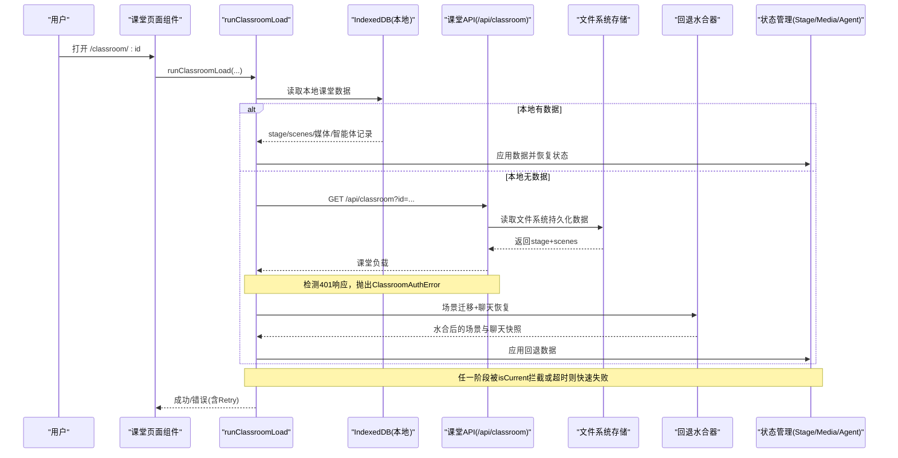
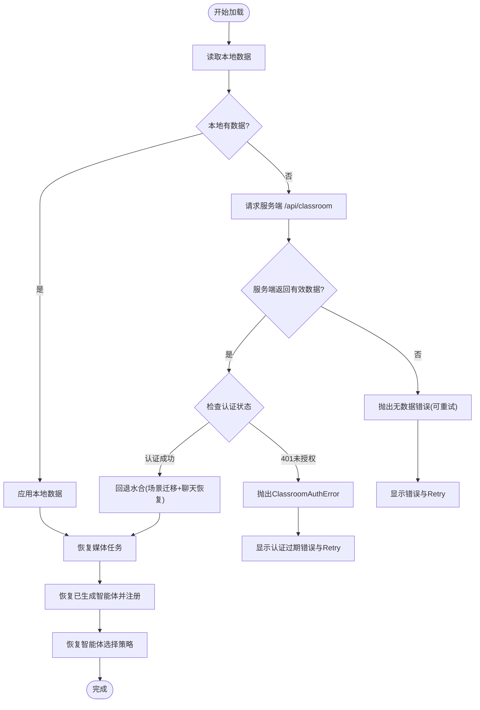

# 课堂加载可靠性增强

<cite>
**本文引用的文件**   
- [app/classroom/[id]/page.tsx](file://app/classroom/[id]/page.tsx)
- [lib/classroom/load-classroom.ts](file://lib/classroom/load-classroom.ts)
- [lib/classroom/pbl-fallback-hydration.ts](file://lib/classroom/pbl-fallback-hydration.ts)
- [app/api/classroom/route.ts](file://app/api/classroom/route.ts)
- [lib/server/classroom-storage.ts](file://lib/server/classroom-storage.ts)
- [e2e/tests/classroom-load-failure.spec.ts](file://e2e/tests/classroom-load-failure.spec.ts)
- [tests/classroom/load-classroom.test.ts](file://tests/classroom/load-classroom.test.ts)
- [next.config.ts](file://next.config.ts)
</cite>

## 更新摘要
**所做更改**   
- 新增服务器端文件系统持久化功能，支持课堂数据跨浏览器和缓存清理场景的恢复
- 增强课堂API路由的错误日志记录，提供更详细的调试信息
- 改进基础路径解析机制，使用 NEXT_PUBLIC_BASE_PATH 环境变量支持子路径部署
- 添加全面的E2E测试覆盖，验证课堂加载失败场景的处理逻辑
- **新增** ClassroomAuthError 哨兵错误类，专门处理401 HTTP响应
- **新增** 增强的认证错误处理，包含会话过期和访问Cookie的详细日志记录
- **新增** 改进的错误传播机制，提升认证失败时的用户体验
- **新增** 增强的原子JSON文件写入重试机制，解决Windows特定文件访问问题

## 产品概述
本章节聚焦 OpenMAIC 的"课堂加载可靠性增强"能力。其目标是在课堂页面进入时，确保用户不会长时间停留在"加载中"，并在数据不可用时给出明确、可重试的错误提示。通过"本地 IndexedDB → 服务端存储兜底 → 快速失败 + 超时保护"的多层策略，提升首屏加载稳定性与用户体验。

**更新** 新增服务器端文件系统持久化功能和专门的认证错误处理机制，为课堂数据提供跨浏览器的备份恢复能力，并显著改善认证失败的用户体验。**最新增强** 原子JSON文件写入现在包含三重重试机制和指数退避策略，有效解决Windows Defender和文件监控器导致的EPERM/EACCES错误。

## 核心业务流程
课堂加载的核心流程如下：
- 优先从本地 IndexedDB 恢复课堂数据（stage、scenes、媒体任务、已生成智能体等）
- 若本地无数据，则尝试从服务端存储拉取课堂数据并执行"回退水合"（场景迁移、运行时聊天恢复）
- 将恢复的媒体任务与应用状态合并，重建智能体注册表与选择策略
- 全程使用 loadToken 与 isCurrent 守卫，避免跨导航/卸载后的副作用污染
- 设置整体加载超时，任何子步骤挂起都会触发快速失败，并展示可重试错误
- **新增** 专门的认证错误检测和处理，区分401未授权错误与其他网络错误



**图表来源** 
- [app/classroom/[id]/page.tsx:55-87](file://app/classroom/[id]/page.tsx#L55-L87)
- [lib/classroom/load-classroom.ts:78-196](file://lib/classroom/load-classroom.ts#L78-L196)
- [lib/classroom/pbl-fallback-hydration.ts:58-79](file://lib/classroom/pbl-fallback-hydration.ts#L58-L79)
- [app/api/classroom/route.ts:51-85](file://app/api/classroom/route.ts#L51-85)
- [lib/server/classroom-storage.ts:75-111](file://lib/server/classroom-storage.ts#L75-L111)

**章节来源**
- [app/classroom/[id]/page.tsx:55-118](file://app/classroom/[id]/page.tsx#L55-L118)
- [lib/classroom/load-classroom.ts:78-196](file://lib/classroom/load-classroom.ts#L78-L196)
- [lib/classroom/pbl-fallback-hydration.ts:58-79](file://lib/classroom/pbl-fallback-hydration.ts#L58-L79)
- [app/api/classroom/route.ts:51-85](file://app/api/classroom/route.ts#L51-85)
- [lib/server/classroom-storage.ts:75-111](file://lib/server/classroom-storage.ts#L75-L111)

## 功能模块清单
- 课堂加载编排器（runClassroomLoad）
  - 职责：串联本地恢复、服务端回退、媒体任务恢复、智能体注册与选择；提供超时保护与当前性守卫
  - 验收要点：无数据时快速失败并显示"可重试"错误；任意子步骤挂起不阻塞 UI；跨导航不污染状态
- 回退水合器（applyHydratedClassroomFallbackScenes）
  - 职责：对服务端返回的场景进行迁移与运行时聊天恢复，再统一写入状态
  - 验收要点：在 loadToken 失效时拒绝提交；聊天快照正确传递
- 课堂 API 与存储
  - 职责：校验参数、读取/写入文件系统级持久化、URL 重写兼容 basePath
  - 验收要点：无效 ID 直接拒绝；读取失败返回空而非抛错；绝对 URL 重写为相对路径
- 课堂页面组件
  - 职责：发起加载、清理旧状态、渲染 Loading/Error/Stage、提供 Retry
  - 验收要点：切换课堂时清空媒体任务与白板历史；错误态包含 Retry 按钮
- **新增** 服务器端文件系统存储
  - 职责：原子化写入课堂数据到文件系统，支持目录自动创建和JSON文件原子操作
  - 验收要点：支持 NEXT_PUBLIC_BASE_PATH 环境变量配置；自动处理媒体URL路径重写；提供完整的错误处理
- **新增** ClassroomAuthError 错误处理
  - 职责：专门处理HTTP 401未授权响应，提供清晰的认证过期错误消息
  - 验收要点：区分认证错误与其他网络错误；提供用户友好的错误提示；保持Retry功能可用性
- **新增** 增强的原子文件写入机制
  - 职责：实现三重重试机制和指数退避策略，处理Windows特定的文件访问问题
  - 验收要点：自动处理EPERM/EACCES错误；200ms和400ms延迟重试；最终回退到直接写入

**章节来源**
- [lib/classroom/load-classroom.ts:78-196](file://lib/classroom/load-classroom.ts#L78-L196)
- [lib/classroom/pbl-fallback-hydration.ts:58-79](file://lib/classroom/pbl-fallback-hydration.ts#L58-L79)
- [app/api/classroom/route.ts:14-49](file://app/api/classroom/route.ts#L14-L49)
- [lib/server/classroom-storage.ts:31-44](file://lib/server/classroom-storage.ts#L31-L44)
- [app/classroom/[id]/page.tsx:91-118](file://app/classroom/[id]/page.tsx#L91-L118)
- [lib/server/classroom-storage.ts:88-111](file://lib/server/classroom-storage.ts#L88-L111)
- [lib/server/classroom-storage.ts:21-49](file://lib/server/classroom-storage.ts#L21-L49)

## 数据与状态
- 核心数据模型
  - Stage/Scene：课堂骨架与内容单元
  - MediaTask：媒体生成任务（图片/视频/音频），支持 done/failed 状态与重试计数
  - GeneratedAgentRecord：服务端生成的智能体配置，用于注册到 AgentRegistry
  - ChatStorageSnapshot：运行时聊天会话与恢复标记
  - **新增** PersistedClassroomData：服务器端持久化的课堂数据结构，包含 createdAt 时间戳
- 关键状态流转
  - 加载开始：claimStageSceneLoadToken() 获取令牌，后续所有副作用需通过 isCurrent(loadToken) 校验
  - 本地恢复：loadRestoredMediaTasksFromDB/buildRestoredMediaTasks 构建媒体任务映射
  - 服务端回退：fetchClassroomFromApi 调用 /api/classroom，失败即降级为空
  - **新增** 认证错误检测：检测HTTP 401响应，抛出ClassroomAuthError而不是静默失败
  - 回退水合：场景迁移 + 聊天恢复后，applyClassroomStageAndScenes 写入 stage/scenes/chats/chatSnapshot
  - 智能体恢复：loadGeneratedAgentRecordsFromDB → applyGeneratedAgentRecordsToRegistry → restoreAgentSelection
  - **新增** 服务器端持久化：课堂生成完成后自动保存到文件系统，作为跨浏览器备份
  - **新增** 原子文件写入：使用临时文件+重命名机制，包含三重重试和指数退避策略
- 数据所有权边界
  - 本地 IndexedDB：媒体任务、已生成智能体记录
  - 服务端存储：stage+scenes 的持久化副本，存储在 data/classrooms 目录
  - 内存状态：StageStore/MediaGenerationStore/AgentRegistry/SettingsStore



**图表来源** 
- [lib/classroom/load-classroom.ts:78-196](file://lib/classroom/load-classroom.ts#L78-L196)
- [lib/classroom/pbl-fallback-hydration.ts:58-79](file://lib/classroom/pbl-fallback-hydration.ts#L58-L79)
- [app/api/classroom/route.ts:51-85](file://app/api/classroom/route.ts#L51-85)

**章节来源**
- [lib/classroom/load-classroom.ts:239-330](file://lib/classroom/load-classroom.ts#L239-L330)
- [lib/classroom/load-classroom.ts:331-416](file://lib/classroom/load-classroom.ts#L331-L416)
- [lib/classroom/pbl-fallback-hydration.ts:28-46](file://lib/classroom/pbl-fallback-hydration.ts#L28-L46)
- [lib/server/classroom-storage.ts:46-51](file://lib/server/classroom-storage.ts#L46-L51)

## 关键约束与边界
- 超时与快速失败
  - 整体加载超时默认 30s，服务端回退请求 15s 超时；任一子步骤挂起均会中断并报错
  - 无数据路径必须显式失败，禁止无限 loading
- 当前性与防泄漏
  - 使用 loadToken + isCurrent 守卫，防止组件卸载或路由切换后继续写状态
  - 切换课堂时清理媒体任务对象 URL、白板历史，避免跨课堂污染
- 兼容性处理
  - 媒体 URL 规范化：将历史绝对地址重写为 basePath 相对路径，避免跨域/代理问题
  - 服务端存储读写原子化与目录初始化，保证一致性
  - **新增** 基础路径解析：支持 NEXT_PUBLIC_BASE_PATH 环境变量，实现子路径部署支持
- 错误可见性与可恢复性
  - 错误信息清晰且包含"Retry"操作，E2E 用例验证"Loading classroom..."消失与错误文案出现
  - **新增** 增强的错误日志：API 路由中记录详细的错误上下文信息，便于问题诊断
  - **新增** 认证错误分类：区分401未授权错误与一般网络错误，提供针对性的用户反馈
- **新增** Windows文件访问兼容性
  - 原子文件写入包含三重重试机制，处理Windows Defender和文件监控器导致的EPERM/EACCES错误
  - 指数退避策略：第一次重试延迟200ms，第二次重试延迟400ms
  - 最终回退机制：当重命名失败时，直接写入原文件并清理临时文件

```mermaid
classDiagram
class ClassroomLoader {
+runClassroomLoad(args) Promise~void~
+fetchClassroomFromApi(id) Promise~ClassroomPayload|null~
+normalizeMediaUrls(data) T
+applyClassroomStageAndScenes(stage, scenes, options) void
}
class FallbackHydration {
+applyHydratedClassroomFallbackScenes(args) Promise~boolean~
+hydrateClassroomFallbackChats(stageId, options) Promise~ClassroomFallbackChatState~
}
class ClassroomAPI {
+POST(request) Response
+GET(request) Response
}
class Storage {
+persistClassroom(data, baseUrl) PersistedClassroomData&{url : string}
+readClassroom(id) PersistedClassroomData|null
+buildRequestOrigin(req) string
+writeJsonFileAtomic(filePath, data) Promise~void~
+ensureClassroomsDir() Promise~void~
}
class BasePathResolver {
+resolveBasePath() string
+rewriteAbsoluteMediaUrls(data) T
}
class ClassroomAuthError {
+message : string
+name : string
+constructor(message)
}
class AtomicFileWriter {
+retryCount : number
+exponentialBackoff(delays)
+handleEPERMEACCES(err)
+fallbackDirectWrite()
}
ClassroomLoader --> FallbackHydration : "使用"
ClassroomLoader --> ClassroomAPI : "调用"
ClassroomAPI --> Storage : "读写"
Storage --> BasePathResolver : "依赖"
Storage --> AtomicFileWriter : "实现"
ClassroomLoader --> ClassroomAuthError : "抛出"
```

**图表来源** 
- [lib/classroom/load-classroom.ts:78-196](file://lib/classroom/load-classroom.ts#L78-L196)
- [lib/classroom/pbl-fallback-hydration.ts:58-79](file://lib/classroom/pbl-fallback-hydration.ts#L58-L79)
- [app/api/classroom/route.ts:14-85](file://app/api/classroom/route.ts#L14-L85)
- [lib/server/classroom-storage.ts:75-111](file://lib/server/classroom-storage.ts#L75-L111)

**章节来源**
- [lib/classroom/load-classroom.ts:18-22](file://lib/classroom/load-classroom.ts#L18-L22)
- [lib/classroom/load-classroom.ts:198-218](file://lib/classroom/load-classroom.ts#L198-L218)
- [lib/server/classroom-storage.ts:31-44](file://lib/server/classroom-storage.ts#L31-L44)
- [lib/server/classroom-storage.ts:31-44](file://lib/server/classroom-storage.ts#L31-L44)
- [e2e/tests/classroom-load-failure.spec.ts:47-94](file://e2e/tests/classroom-load-failure.spec.ts#L47-L94)
- [tests/classroom/load-classroom.test.ts:367-422](file://tests/classroom/load-classroom.test.ts#L367-L422)
- [next.config.ts:4-6](file://next.config.ts#L4-L6)
- [lib/server/classroom-storage.ts:21-49](file://lib/server/classroom-storage.ts#L21-L49)

## 新增功能详解

### 服务器端文件系统持久化
系统新增了完整的服务器端持久化功能，支持课堂数据在文件系统级别的存储和恢复：

- **原子化写入**：使用临时文件 + 重命名的方式确保数据一致性
- **目录自动管理**：自动创建必要的目录结构（data/classrooms, data/classroom-jobs）
- **路径重写**：自动将历史绝对URL重写为basePath相对路径，解决跨域问题
- **环境配置**：通过 NEXT_PUBLIC_BASE_PATH 环境变量支持子路径部署

### 增强的认证错误处理
系统引入了专门的认证错误处理机制，显著提升用户体验：

- **ClassroomAuthError 哨兵错误类**：专门处理HTTP 401未授权响应
- **详细日志记录**：记录会话过期和访问Cookie相关的详细信息
- **错误传播优化**：认证错误不会被静默吞掉，而是向上层组件传播
- **用户友好提示**：提供明确的"Authentication expired"错误消息

### 改进的错误传播机制
错误处理流程得到全面优化：

- **分层错误处理**：API层检测401响应，业务层抛出专用错误，UI层显示友好提示
- **Retry功能保持**：认证错误仍然提供Retry按钮，用户可以重新尝试
- **E2E测试覆盖**：完整的端到端测试验证认证过期场景的正确处理

### 全面的E2E测试覆盖
新增了针对课堂加载失败场景的端到端测试：

- **无数据场景**：验证当本地和服务端都无数据时，显示可重试的错误界面
- **服务端回退成功**：验证当本地无数据但服务端有数据时的正常加载流程
- **OAuth代理绕过**：测试环境中正确处理OAuth代理中间件
- **认证过期场景**：专门测试401响应的处理和用户反馈

### **新增** 增强的原子JSON文件写入重试机制
为了解决Windows平台特有的文件访问问题，系统实现了强大的重试机制：

- **三重重试循环**：最多尝试3次文件重命名操作
- **指数退避策略**：第一次重试延迟200ms，第二次重试延迟400ms
- **错误类型识别**：专门处理EPERM和EACCES错误代码，这些通常由Windows Defender或文件监控器引起
- **最终回退机制**：当所有重试都失败时，直接写入原文件并清理临时文件
- **进程隔离**：使用进程ID和时间戳生成唯一的临时文件名，避免并发冲突

**章节来源**
- [lib/server/classroom-storage.ts:21-29](file://lib/server/classroom-storage.ts#L21-L29)
- [lib/server/classroom-storage.ts:57-73](file://lib/server/classroom-storage.ts#L57-L73)
- [app/api/classroom/route.ts:37-48](file://app/api/classroom/route.ts#L37-L48)
- [e2e/tests/classroom-load-failure.spec.ts:49-94](file://e2e/tests/classroom-load-failure.spec.ts#L49-L94)
- [next.config.ts:4-6](file://next.config.ts#L4-L6)
- [lib/classroom/load-classroom.ts:28-34](file://lib/classroom/load-classroom.ts#L28-L34)
- [lib/classroom/load-classroom.ts:214-218](file://lib/classroom/load-classroom.ts#L214-L218)
- [lib/classroom/load-classroom.ts:238-244](file://lib/classroom/load-classroom.ts#L238-L244)
- [e2e/tests/classroom-load-failure.spec.ts:186-233](file://e2e/tests/classroom-load-failure.spec.ts#L186-L233)
- [lib/server/classroom-storage.ts:21-49](file://lib/server/classroom-storage.ts#L21-L49)