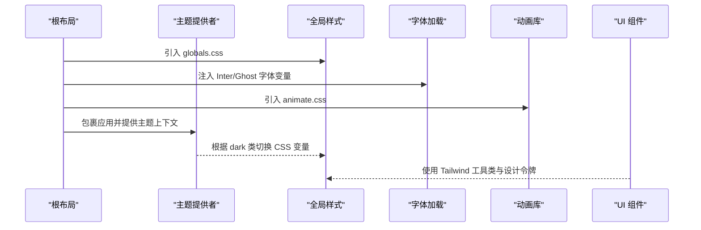
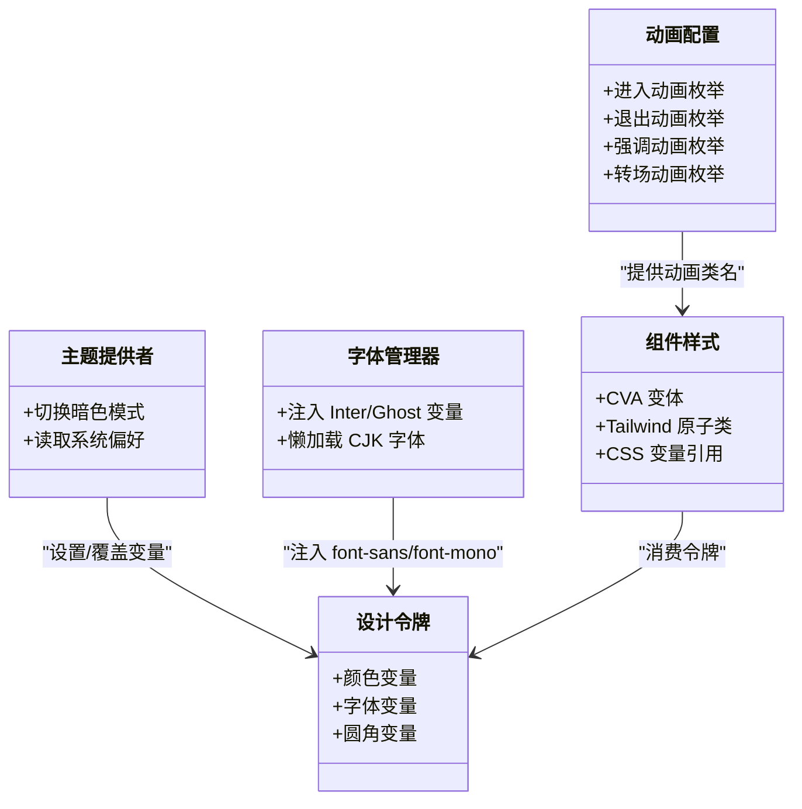
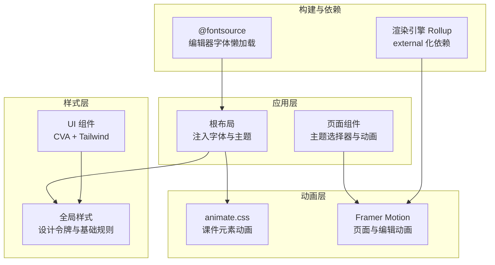
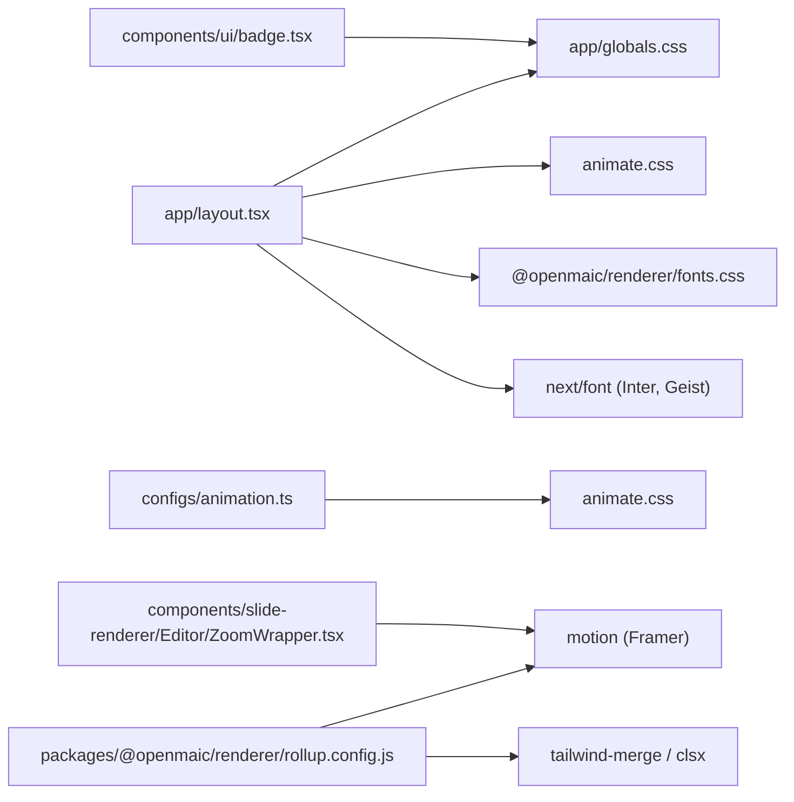

# 主题与样式系统

<cite>
**本文引用的文件**   
- [app/globals.css](file://app/globals.css)
- [app/layout.tsx](file://app/layout.tsx)
- [app/editor-fonts.ts](file://app/editor-fonts.ts)
- [configs/animation.ts](file://configs/animation.ts)
- [components/ui/badge.tsx](file://components/ui/badge.tsx)
- [components/slide-renderer/Editor/ZoomWrapper.tsx](file://components/slide-renderer/Editor/ZoomWrapper.tsx)
- [packages/@openmaic/renderer/rollup.config.js](file://packages/@openmaic/renderer/rollup.config.js)
- [app/page.tsx](file://app/page.tsx)
</cite>

## 产品概述
OpenMAIC 的主题与样式系统基于 Tailwind CSS v4，采用 CSS 变量驱动的设计令牌（Design Tokens），通过 @theme inline 将语义化颜色、字体与圆角映射到 Tailwind 工具类。暗色模式通过 .dark 选择器切换变量值实现；全局样式集中在 app/globals.css，字体管理由 next/font 与 @fontsource 组合完成，编辑器字体按需懒加载。动画体系融合 animate.css（课件元素动画）与 Framer Motion（页面级交互与编辑缩放）。响应式与移动端适配通过 Tailwind 断点与容器查询、滚动条稳定策略、可访问性媒体查询等共同保障。

## 核心业务流程
- 主题初始化流程：根布局注入字体变量与主题提供者，全局样式定义设计令牌与基础样式，暗色模式通过 html/body 的 dark 类切换。
- 编辑器字体加载：在编辑器入口导入 @fontsource 字体 CSS，按 unicode-range 子集懒加载 CJK 字体，避免首屏体积过大。
- 动画装配：应用层引入 animate.css 作为课件元素动画库，Framer Motion 用于页面过渡、缩放与微交互。
- 组件样式生成：UI 组件使用 class-variance-authority（CVA）与 Tailwind 原子类组合，配合 CSS 变量实现多态变体与暗色适配。

**图表来源** 
- [app/layout.tsx:1-49](file://app/layout.tsx#L1-L49)
- [app/globals.css:17-127](file://app/globals.css#L17-L127)
- [app/editor-fonts.ts:1-40](file://app/editor-fonts.ts#L1-L40)
- [configs/animation.ts:1-235](file://configs/animation.ts#L1-L235)

**章节来源**
- [app/layout.tsx:1-49](file://app/layout.tsx#L1-L49)
- [app/globals.css:17-127](file://app/globals.css#L17-L127)
- [app/editor-fonts.ts:1-40](file://app/editor-fonts.ts#L1-L40)
- [configs/animation.ts:1-235](file://configs/animation.ts#L1-L235)

## 功能模块清单
- 主题配置与令牌
  - 职责：集中定义颜色、字体、圆角等设计令牌，并通过 @theme inline 暴露给 Tailwind 工具类。
  - 验收要点：明/暗主题下所有语义化颜色可用；字体变量生效；圆角与间距一致。
- 暗色模式支持
  - 职责：通过 .dark 覆盖 CSS 变量，统一切换界面色调。
  - 验收要点：切换后对比度满足 WCAG；无闪烁；滚动条与阴影适配。
- 字体管理
  - 职责：主字体通过 next/font 注入变量；编辑器字体通过 @fontsource 按需加载。
  - 验收要点：CJK 字体懒加载；Inter 与 Geist 变量正确挂载；编辑器字体列表与 @font-face 匹配。
- 动画集成
  - 职责：animate.css 提供课件元素进入/退出/强调动画；Framer Motion 负责页面与编辑缩放动画。
  - 验收要点：动画可配置时长与触发；减少动效模式下自动禁用。
- 响应式与移动端适配
  - 职责：Tailwind 断点 + 滚动条稳定 + 可访问性媒体查询。
  - 验收要点：不同视口布局稳定；滚动条不引起水平偏移；低动效偏好被尊重。
- 样式隔离与模块化
  - 职责：全局样式仅定义令牌与基础规则；组件样式通过 CVA 与原子类组合；第三方库样式按需引入。
  - 验收要点：样式冲突最小化；构建产物可追踪；渲染引擎依赖外部化。

**章节来源**
- [app/globals.css:17-127](file://app/globals.css#L17-L127)
- [app/layout.tsx:1-49](file://app/layout.tsx#L1-L49)
- [app/editor-fonts.ts:1-40](file://app/editor-fonts.ts#L1-L40)
- [configs/animation.ts:1-235](file://configs/animation.ts#L1-L235)
- [components/ui/badge.tsx:1-25](file://components/ui/badge.tsx#L1-L25)
- [components/slide-renderer/Editor/ZoomWrapper.tsx:1-47](file://components/slide-renderer/Editor/ZoomWrapper.tsx#L1-L47)
- [packages/@openmaic/renderer/rollup.config.js:1-42](file://packages/@openmaic/renderer/rollup.config.js#L1-L42)

## 数据与状态
- 设计令牌（CSS 变量）
  - 颜色族：background、foreground、primary、secondary、accent、muted、destructive、border、input、ring、popover、card、chart-*、sidebar-*。
  - 字体族：font-sans、font-mono（Geist）。
  - 圆角：radius-sm/xl/2xl/3xl/4xl 等派生自 --radius。
  - 作用域：:root 定义默认值；.dark 覆盖暗色值；@theme inline 映射为 Tailwind 令牌。
- 主题状态
  - 通过 html/body 的 dark 类控制；页面内提供主题选择器（light/dark/system）。
- 字体状态
  - Inter 与 Geist 通过 next/font 注入变量；编辑器字体通过 @fontsource 动态加载。
- 动画状态
  - 课件动画枚举（进入/退出/强调/转场）集中于 configs/animation.ts；Framer Motion 通过 props 控制 scale、transition 等。

**图表来源** 
- [app/globals.css:60-127](file://app/globals.css#L60-L127)
- [app/layout.tsx:15-35](file://app/layout.tsx#L15-L35)
- [app/editor-fonts.ts:14-40](file://app/editor-fonts.ts#L14-L40)
- [configs/animation.ts:1-235](file://configs/animation.ts#L1-L235)
- [components/ui/badge.tsx:1-25](file://components/ui/badge.tsx#L1-L25)

**章节来源**
- [app/globals.css:60-127](file://app/globals.css#L60-L127)
- [app/layout.tsx:15-35](file://app/layout.tsx#L15-L35)
- [app/editor-fonts.ts:14-40](file://app/editor-fonts.ts#L14-L40)
- [configs/animation.ts:1-235](file://configs/animation.ts#L1-L235)
- [components/ui/badge.tsx:1-25](file://components/ui/badge.tsx#L1-L25)

## 关键约束与边界
- 样式架构约束
  - 全局样式仅承载令牌与基础重置；组件样式以原子类与 CVA 为主，避免深层嵌套。
  - Tailwind v4 通过 @source 显式声明扫描路径，确保第三方包与演示目录的类名生成。
- 依赖与集成边界
  - 渲染引擎打包时 external 化 motion、tailwind-merge、clsx 等，避免重复打包。
  - 第三方样式按需引入（animate.css、katex），保持最小依赖面。
- 业务约束
  - 编辑器模式下的列表样式仅在 body[data-maic-editor='true'] 或 .prosemirror-editor 作用域内生效，不影响播放模式。
  - 滚动条稳定策略防止内容增长导致的水平抖动。
- 可访问性与性能
  - prefers-reduced-motion 下禁用非必要动画；focus-visible 与 ring 保证键盘可达性。
  - 字体子集化与懒加载降低首屏体积；CSS 变量切换避免重绘重排。

**章节来源**
- [app/globals.css:1-16](file://app/globals.css#L1-L16)
- [app/globals.css:129-156](file://app/globals.css#L129-L156)
- [app/globals.css:188-201](file://app/globals.css#L188-L201)
- [app/globals.css:564-571](file://app/globals.css#L564-L571)
- [packages/@openmaic/renderer/rollup.config.js:6-20](file://packages/@openmaic/renderer/rollup.config.js#L6-L20)

## 详细设计与实现要点

### 主题配置与颜色系统
- 使用 @theme inline 将 CSS 变量映射为 Tailwind 令牌，涵盖颜色、字体、圆角与侧边栏/图表色系。
- :root 与 .dark 分别定义明/暗两套变量，切换时仅修改变量值，避免全量样式重建。
- 建议：新增颜色应遵循语义命名（如 primary/accent/muted），并在 @theme inline 中同步映射。

**章节来源**
- [app/globals.css:17-58](file://app/globals.css#L17-L58)
- [app/globals.css:60-127](file://app/globals.css#L60-L127)

### 字体管理与编辑器字体
- 根布局通过 next/font 注入 Inter 与 Geist Sans/Mono 变量，供 Tailwind 使用。
- 编辑器字体通过 @fontsource 按需加载，CJK 字体按 unicode-range 子集懒加载，提升首屏性能。
- 建议：新增字体需在 editor-fonts.ts 中注册，并确保 value 与 @font-face family 名称一致。

**章节来源**
- [app/layout.tsx:15-35](file://app/layout.tsx#L15-L35)
- [app/editor-fonts.ts:1-40](file://app/editor-fonts.ts#L1-L40)

### 暗色模式与样式隔离
- 通过 html/body 的 dark 类切换 CSS 变量；全局基础样式在 base 层统一应用。
- 编辑器专属样式（如 ProseMirror 焦点环、列表标记）限定在编辑器作用域，避免影响播放渲染。
- 建议：新增样式优先使用语义化令牌与原子类；必要时使用 data-* 或专用类进行作用域隔离。

**章节来源**
- [app/globals.css:129-156](file://app/globals.css#L129-L156)
- [app/globals.css:158-201](file://app/globals.css#L158-L201)

### 动画库集成（Framer Motion 与 animate.css）
- 课件元素动画：configs/animation.ts 集中定义进入/退出/强调/转场动画枚举，供渲染器消费。
- 页面与编辑动画：Framer Motion 用于缩放、淡入淡出与弹簧过渡，如 ZoomWrapper 的缩放中心与缓动。
- 建议：统一动画时长与触发策略；在 prefers-reduced-motion 下降级为静态展示。

**章节来源**
- [configs/animation.ts:1-235](file://configs/animation.ts#L1-L235)
- [components/slide-renderer/Editor/ZoomWrapper.tsx:1-47](file://components/slide-renderer/Editor/ZoomWrapper.tsx#L1-L47)
- [app/layout.tsx:7-8](file://app/layout.tsx#L7-L8)

### 响应式设计与移动端适配
- 使用 Tailwind 断点与容器查询实现自适应布局；滚动条稳定策略避免布局抖动。
- 自定义滚动条样式（PBL v2）限定在 data-pbl-workspace 作用域，不影响全局。
- 建议：移动端优先使用弹性布局与相对单位；避免固定高度导致溢出。

**章节来源**
- [app/globals.css:129-156](file://app/globals.css#L129-L156)
- [app/globals.css:282-343](file://app/globals.css#L282-L343)

### 样式性能优化与调试技巧
- 性能优化
  - 字体子集化与懒加载；按需引入第三方样式；external 化大依赖。
  - 使用 CSS 变量切换主题，避免全量样式重建。
- 调试技巧
  - 利用 Tailwind 扫描路径（@source）确保类名生成；检查 dark 类是否生效。
  - 使用 focus-visible 与 ring 验证可访问性；在 reduced-motion 下校验动画降级。

**章节来源**
- [packages/@openmaic/renderer/rollup.config.js:6-20](file://packages/@openmaic/renderer/rollup.config.js#L6-L20)
- [app/globals.css:1-16](file://app/globals.css#L1-L16)
- [app/globals.css:564-571](file://app/globals.css#L564-L571)

### 样式开发规范与可访问性最佳实践
- 开发规范
  - 优先使用语义化令牌与原子类；复杂变体使用 CVA；避免手写长串类名。
  - 组件样式与全局样式分离；第三方样式按需引入并作用域隔离。
- 可访问性
  - 确保焦点可见（outline-ring）、色彩对比度达标；尊重 prefers-reduced-motion。
  - 为交互控件添加 aria-* 属性（如 aria-expanded、aria-pressed）。

**章节来源**
- [components/ui/badge.tsx:1-25](file://components/ui/badge.tsx#L1-L25)
- [app/globals.css:129-156](file://app/globals.css#L129-L156)
- [app/globals.css:564-571](file://app/globals.css#L564-L571)

## 架构总览

**图表来源** 
- [app/layout.tsx:1-49](file://app/layout.tsx#L1-L49)
- [app/page.tsx:460-518](file://app/page.tsx#L460-L518)
- [app/globals.css:17-127](file://app/globals.css#L17-L127)
- [components/ui/badge.tsx:1-25](file://components/ui/badge.tsx#L1-L25)
- [packages/@openmaic/renderer/rollup.config.js:6-20](file://packages/@openmaic/renderer/rollup.config.js#L6-L20)
- [app/editor-fonts.ts:1-40](file://app/editor-fonts.ts#L1-L40)

## 依赖分析

**图表来源** 
- [app/layout.tsx:1-49](file://app/layout.tsx#L1-L49)
- [app/globals.css:1-16](file://app/globals.css#L1-L16)
- [components/ui/badge.tsx:1-25](file://components/ui/badge.tsx#L1-L25)
- [configs/animation.ts:1-235](file://configs/animation.ts#L1-L235)
- [components/slide-renderer/Editor/ZoomWrapper.tsx:1-47](file://components/slide-renderer/Editor/ZoomWrapper.tsx#L1-L47)
- [packages/@openmaic/renderer/rollup.config.js:6-20](file://packages/@openmaic/renderer/rollup.config.js#L6-L20)

**章节来源**
- [app/layout.tsx:1-49](file://app/layout.tsx#L1-L49)
- [app/globals.css:1-16](file://app/globals.css#L1-L16)
- [components/ui/badge.tsx:1-25](file://components/ui/badge.tsx#L1-L25)
- [configs/animation.ts:1-235](file://configs/animation.ts#L1-L235)
- [components/slide-renderer/Editor/ZoomWrapper.tsx:1-47](file://components/slide-renderer/Editor/ZoomWrapper.tsx#L1-L47)
- [packages/@openmaic/renderer/rollup.config.js:6-20](file://packages/@openmaic/renderer/rollup.config.js#L6-L20)

## 性能考虑
- 首屏优化：字体子集化与懒加载；按需引入第三方样式；external 化大依赖。
- 运行时优化：CSS 变量切换主题；减少重绘重排；合理使用 will-change 与 transform。
- 构建优化：Tailwind 精确扫描；Rollup external 化；保留 'use client' 指令。

[本节为通用指导，无需特定文件来源]

## 故障排查指南
- 主题未生效
  - 检查 html/body 是否包含 dark 类；确认 @theme inline 已映射新令牌。
- 字体缺失或加载缓慢
  - 确认 next/font 变量注入；检查 editor-fonts.ts 是否引入对应字体；观察网络请求是否命中子集。
- 动画异常或卡顿
  - 检查 prefers-reduced-motion；确认 Framer Motion 的 transition 参数；避免过度使用复杂滤镜。
- 样式冲突
  - 使用作用域隔离（data-* 或专用类）；核对 Tailwind 扫描路径；避免全局覆盖。

**章节来源**
- [app/globals.css:17-127](file://app/globals.css#L17-L127)
- [app/editor-fonts.ts:1-40](file://app/editor-fonts.ts#L1-L40)
- [app/globals.css:564-571](file://app/globals.css#L564-L571)

## 结论
OpenMAIC 的主题与样式系统以 Tailwind CSS v4 为核心，结合 CSS 变量与 @theme inline 实现高内聚、易扩展的设计令牌体系。暗色模式、字体懒加载、动画分层与响应式策略共同保障了良好的用户体验与可维护性。遵循本规范与最佳实践，可在保持样式一致性的同时，持续提升性能与可访问性。

[本节为总结性内容，无需特定文件来源]