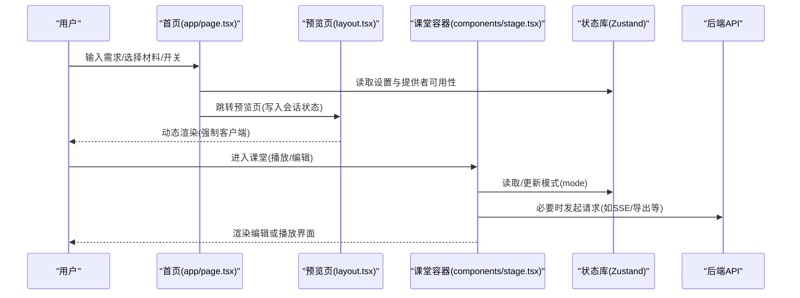
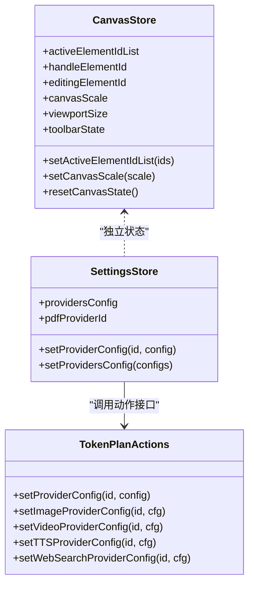

# 前端架构设计

<cite>
**本文引用的文件**   
- [app/layout.tsx](file://app/layout.tsx)
- [app/page.tsx](file://app/page.tsx)
- [components/header.tsx](file://components/header.tsx)
- [components/stage.tsx](file://components/stage.tsx)
- [lib/hooks/use-theme.tsx](file://lib/hooks/use-theme.tsx)
- [lib/hooks/use-i18n.tsx](file://lib/hooks/use-i18n.tsx)
- [lib/i18n/index.ts](file://lib/i18n/index.ts)
- [components/ui/sonner.tsx](file://components/ui/sonner.tsx)
- [lib/store/canvas.ts](file://lib/store/canvas.ts)
- [components/settings/index.tsx](file://components/settings/index.tsx)
- [lib/config/apply-token-plan.ts](file://lib/config/apply-token-plan.ts)
- [app/generation-preview/layout.tsx](file://app/generation-preview/layout.tsx)
</cite>

## 目录
- 产品概述
- 核心业务流程
- 功能模块清单
- 数据与状态
- 关键约束与边界

## 产品概述
OpenMAIC 是基于 Next.js 16 + React 19 的现代化前端应用，面向“AI 驱动的交互式课件（MAIC）生成与课堂管理”场景。其核心价值在于：通过自然语言快速生成结构化课件、支持课堂实时互动（问答/讨论/测验）、提供编辑与回放双模式体验。技术栈以 App Router 路由组织、Zustand 进行全局状态管理、i18next 实现国际化、motion/animate.css/KaTeX 构建动画与富文本渲染，并通过自定义 DSL（@openmaic/dsl）驱动课件渲染引擎（@openmaic/renderer）。

## 核心业务流程
- 首页生成入口：用户在首页输入需求、选择课程材料与选项，校验可用 LLM 提供者后进入预览页，随后进入课堂播放或编辑模式。
- 课堂模式切换：Stage 组件根据 store 中的 mode 在“编辑”和“播放/自主”两种 chrome 根之间切换，并处理跨标签编辑锁与 teardown 流程。
- 设置与配置：设置面板集中管理各 AI 提供商（LLM/图像/视频/TTS/ASR/网页搜索/PDF），支持令牌计划一键应用。
- 主题与国际化：根布局注入 ThemeProvider 与 I18nProvider，客户端水合避免 SSR 不匹配；主题与语言持久化到 localStorage。

图表来源 
- [app/page.tsx:317-409](file://app/page.tsx#L317-L409)
- [app/generation-preview/layout.tsx:1-7](file://app/generation-preview/layout.tsx#L1-L7)
- [components/stage.tsx:33-168](file://components/stage.tsx#L33-L168)

章节来源
- [app/page.tsx:317-409](file://app/page.tsx#L317-L409)
- [app/generation-preview/layout.tsx:1-7](file://app/generation-preview/layout.tsx#L1-L7)
- [components/stage.tsx:33-168](file://components/stage.tsx#L33-L168)

## 功能模块清单
- 首页与生成入口
  - 职责：需求输入、课程材料上传、交互模式开关、语音输入、错误提示、最近教室列表与缩略图加载。
  - 验收要点：可禁用生成按钮（无可用提供者时）、草稿缓存恢复、本地存储读写容错、缩略图对象 URL 清理。
- 课堂容器与模式切换
  - 职责：根据 mode 分发 EditChromeRoot 与 PlaybackChromeRoot，处理跨标签编辑锁、teardown 与预加载编辑器资源。
  - 验收要点：模式切换平滑过渡、Pro 模式进入前完成清理、自动退出不可编辑场景。
- 设置与配置中心
  - 职责：多模态提供商配置、模型选择、令牌计划应用、PDF/TTS/ASR/图像/视频/Web Search 设置。
  - 验收要点：配置变更即时生效、计划应用幂等、UI 与 store 同步。
- 主题系统
  - 职责：light/dark/system 主题切换、系统主题监听、document.documentElement 类名控制、localStorage 持久化。
  - 验收要点：SSR 安全（effect 内初始化）、切换无闪烁、Toaster 跟随主题。
- 国际化
  - 职责：基于 i18next 的语言检测、回退策略、localStorage 持久化、t() 翻译函数。
  - 验收要点：浏览器语言优先、不支持语言回退默认、切换语言即时生效。
- UI 通知与反馈
  - 职责：基于 Sonner 的 Toaster，图标与样式与主题一致。
  - 验收要点：成功/警告/错误/加载状态清晰可见。

章节来源
- [app/page.tsx:98-409](file://app/page.tsx#L98-L409)
- [components/stage.tsx:33-168](file://components/stage.tsx#L33-L168)
- [components/settings/index.tsx:240-266](file://components/settings/index.tsx#L240-L266)
- [lib/hooks/use-theme.tsx:1-72](file://lib/hooks/use-theme.tsx#L1-L72)
- [lib/hooks/use-i18n.tsx:1-67](file://lib/hooks/use-i18n.tsx#L1-L67)
- [components/ui/sonner.tsx:1-45](file://components/ui/sonner.tsx#L1-L45)

## 数据与状态
- 状态管理策略（Zustand）
  - Canvas 编辑器状态：选择、缩放、拖拽、视口尺寸/比例、工具栏与面板状态、富文本属性、格式刷、激光笔/聚光灯/高亮覆盖等。
  - 设置与令牌计划：多提供商配置与模型选择，apply-token-plan 将计划映射为纯函数动作，便于测试与复用。
  - 其他领域状态：聊天会话、媒体生成任务、用户资料等（由各自 store/hook 管理）。
- 数据流与所有权
  - 页面级表单与草稿：首页使用 useState + useDraftCache 管理需求草稿，localStorage 持久化。
  - 课堂模式：useStageStore 维护 mode、scenes、currentSceneId 等，Stage 作为分发层。
  - 编辑器状态：Canvas Store 专注 UI 交互态，与场景数据分离（场景数据由 Scene Context 管理）。
- 持久化与隔离
  - 设置与主题/语言：localStorage 持久化。
  - 会话与记录：@openmaic/storage 提供 IndexedDB 适配器与 KV 作用域（account/device），保证会话隔离与顺序一致性。

图表来源 
- [lib/store/canvas.ts:256-482](file://lib/store/canvas.ts#L256-L482)
- [lib/config/apply-token-plan.ts:16-61](file://lib/config/apply-token-plan.ts#L16-L61)

章节来源
- [lib/store/canvas.ts:256-482](file://lib/store/canvas.ts#L256-L482)
- [lib/config/apply-token-plan.ts:16-61](file://lib/config/apply-token-plan.ts#L16-L61)
- [components/settings/index.tsx:240-266](file://components/settings/index.tsx#L240-L266)

## 关键约束与边界
- 服务端渲染与水合
  - 根布局与页面使用 suppressHydrationWarning 与 effect 内初始化，避免 SSR/CSR 不一致。
  - 预览页 layout 强制 dynamic 渲染，确保客户端 hooks（如 useI18n）正常工作。
- 性能优化
  - 懒加载与预加载：编辑器 chunk 在进入编辑模式前预加载；缩略图对象 URL 及时释放。
  - 动画与渲染：motion 的淡入淡出切换，避免 transform 导致的布局抖动；AnimatePresence 用于条件渲染动画。
  - 字体与样式：Geist Sans/Mono、Inter Variable、animate.css、KaTeX 按需引入。
- 依赖与集成边界
  - 外部服务：LLM/TTS/ASR/图像/视频/Web Search/PDF 提供商通过设置集中管理，密钥与 baseUrl 由前端注入。
  - 内部包：DSL 定义、存储适配器、导入器、渲染引擎解耦，通过类型与接口契约协作。
- 业务约束
  - 生成前置条件：必须存在可用的 LLM 提供者；否则禁用生成入口并引导配置。
  - 编辑权限：当前场景可编辑性决定能否进入 Pro 模式；不可编辑时自动退出编辑模式。
  - 多标签冲突：跨标签编辑锁防止并发编辑导致的数据竞争。

章节来源
- [app/layout.tsx:1-49](file://app/layout.tsx#L1-L49)
- [app/generation-preview/layout.tsx:1-7](file://app/generation-preview/layout.tsx#L1-L7)
- [components/stage.tsx:33-168](file://components/stage.tsx#L33-L168)
- [lib/hooks/use-theme.tsx:1-72](file://lib/hooks/use-theme.tsx#L1-L72)
- [lib/hooks/use-i18n.tsx:1-67](file://lib/hooks/use-i18n.tsx#L1-L67)
- [lib/i18n/index.ts:1-13](file://lib/i18n/index.ts#L1-L13)
- [components/header.tsx:1-60](file://components/header.tsx#L1-L60)