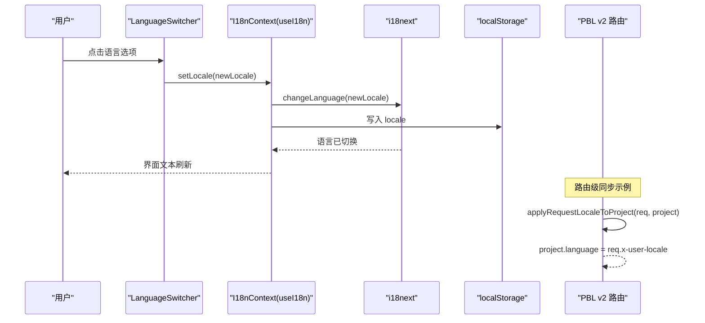
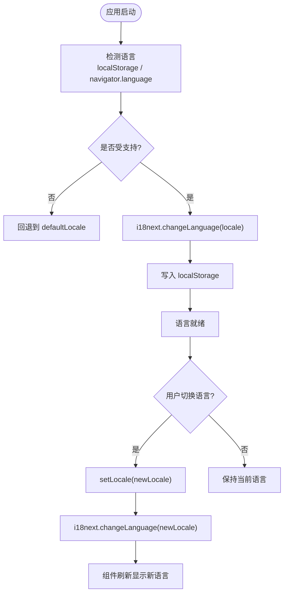

# 国际化架构

<cite>
**本文引用的文件**   
- [lib/hooks/use-i18n.tsx](file://lib/hooks/use-i18n.tsx)
- [lib/i18n/config.ts](file://lib/i18n/config.ts)
- [lib/i18n/index.ts](file://lib/i18n/index.ts)
- [components/language-switcher.tsx](file://components/language-switcher.tsx)
- [lib/pbl/v2/api/locale.ts](file://lib/pbl/v2/api/locale.ts)
- [tests/pbl/v2/locale.test.ts](file://tests/pbl/v2/locale.test.ts)
- [lib/pbl/v2/compat.ts](file://lib/pbl/v2/compat.ts)
- [lib/media/types.ts](file://lib/media/types.ts)
</cite>

## 产品概述
OpenMAIC 的国际化（i18n）基于 i18next + react-i18next，采用“按需加载语言包”的动态资源策略，结合客户端语言检测与本地存储持久化，实现无缝的多语言切换。系统同时提供服务端路由级语言同步能力，确保 PBL 等模块在请求阶段即可确定内容语言，避免首屏闪烁与状态不一致。文本插值由 i18next 原生支持，日期与数字格式化通过统一工具层适配不同区域习惯；RTL 语言支持与字体适配遵循 BCP-47 规范与 CSS 方向属性约定。整体方案兼顾性能、可维护性与用户体验一致性。

## 核心业务流程
- 客户端初始化：I18nProvider 在首次渲染后读取浏览器语言与本地存储，解析为受支持的语言代码并调用 i18next.changeLanguage，完成初始语言设置与回退。
- 动态语言切换：用户通过 LanguageSwitcher 选择目标语言，触发 setLocale，更新 i18next 状态并持久化到 localStorage，组件树自动刷新显示新语言文本。
- 服务端语言同步：PBL v2 路由通过 x-user-locale 头将用户 UI 语言同步至项目 language 字段，保证后续生成与展示使用一致语言策略。
- 文本获取与插值：组件通过 useI18n().t(key, options) 获取翻译文本，支持变量插值与复数形式；服务端或通用函数可通过 translate(locale, key) 指定语言进行翻译。

**图表来源** 
- [lib/hooks/use-i18n.tsx:29-58](file://lib/hooks/use-i18n.tsx#L29-L58)
- [components/language-switcher.tsx:24-56](file://components/language-switcher.tsx#L24-L56)
- [lib/pbl/v2/api/locale.ts:17-21](file://lib/pbl/v2/api/locale.ts#L17-L21)

**章节来源**
- [lib/hooks/use-i18n.tsx:29-58](file://lib/hooks/use-i18n.tsx#L29-L58)
- [components/language-switcher.tsx:24-56](file://components/language-switcher.tsx#L24-L56)
- [lib/pbl/v2/api/locale.ts:17-21](file://lib/pbl/v2/api/locale.ts#L17-L21)

## 功能模块清单
- 语言包管理
  - 动态加载：通过 i18next-resources-to-backend 按语言按需 import JSON 资源文件，减少首屏体积。
  - 受支持语言列表：supportedLocales 集中声明，作为 fallbackLng 与 supportedLngs 的来源。
  - 默认语言：defaultLocale 作为兜底，确保无匹配时稳定回退。
- 客户端语言检测与切换
  - 浏览器语言解析：resolveLocale 精确匹配与前缀匹配（如 'en'→'en-US'），提升兼容性。
  - 本地存储持久化：LOCALE_STORAGE_KEY 保存用户选择，避免刷新丢失。
  - 上下文封装：useI18n 暴露 locale、setLocale、t，供组件统一消费。
- 服务端语言同步
  - 路由级同步：applyRequestLocaleToProject 从 x-user-locale 头提取语言并写入 project.language，不覆盖 content-language 策略。
  - 测试保障：单元测试验证头部有效性及不支持语言的忽略行为。
- 文本插值与键值管理
  - 插值：i18next interpolation 启用，escapeValue 关闭以允许 React 安全渲染。
  - 键值命名：provider 名称等采用 provider{ProviderName}Image/Video 格式，便于扩展与维护。
- 日期与数字格式化
  - 策略：通过统一工具层（如 Intl API）按 locale 格式化日期、时间、数字与货币，避免硬编码格式。
- RTL 支持与字体适配
  - 方向：依据 BCP-47 语言代码判断 RTL（如 ar-SA），配合 CSS direction 与布局调整。
  - 字体：编辑器与页面字体根据语言选择合适字族，确保字符集与排版质量。

**章节来源**
- [lib/i18n/config.ts:7-17](file://lib/i18n/config.ts#L7-L17)
- [lib/i18n/index.ts:7-13](file://lib/i18n/index.ts#L7-L13)
- [lib/hooks/use-i18n.tsx:10-19](file://lib/hooks/use-i18n.tsx#L10-L19)
- [lib/media/types.ts:33-62](file://lib/media/types.ts#L33-L62)

## 数据与状态
- 语言状态模型
  - locale：当前语言代码（BCP-47），来源于 i18next.language 或 defaultLocale。
  - supportedLocales：受支持语言集合，用于校验与下拉展示。
  - defaultLocale：默认语言，作为 fallback 与初始值。
- 关键状态流转
  - 初始化：I18nProvider 在 useEffect 中读取 localStorage/navigator.language，解析为目标语言并切换。
  - 切换：setLocale 调用 i18next.changeLanguage 并写入 localStorage，触发组件重渲染。
  - 服务端同步：路由层根据请求头更新 project.language，确保内容与 UI 语言一致。
- 数据所有权边界
  - 客户端：语言选择与切换由 I18nProvider 管理，组件仅消费 t() 与 locale。
  - 服务端：PBL v2 路由负责将 x-user-locale 同步至项目语言，不干预内容语言策略。

**图表来源** 
- [lib/hooks/use-i18n.tsx:34-55](file://lib/hooks/use-i18n.tsx#L34-L55)

**章节来源**
- [lib/hooks/use-i18n.tsx:29-58](file://lib/hooks/use-i18n.tsx#L29-L58)
- [lib/pbl/v2/api/locale.ts:17-21](file://lib/pbl/v2/api/locale.ts#L17-L21)

## 关键约束与边界
- 依赖与集成边界
  - i18next + react-i18next：核心库，提供翻译引擎与 React 集成。
  - resources-to-backend：按需加载 JSON 资源，避免全量注入。
  - Next.js：basePath 与 headers 配置不影响 i18n，但需确保静态资源路径正确。
- 业务约束
  - 语言代码必须为 BCP-47 标准（如 zh-CN、ar-SA），受 supportedLocales 校验。
  - 服务端同步仅更新 project.language，不覆盖内容语言策略（languageDirective）。
  - 旧版兼容：legacyCompletionCriteria/legacyDebrief 根据语言返回不同文案，确保历史数据可读性。
- 非功能性需求
  - 性能：按需加载语言包，减少首屏体积；切换过程无闪烁。
  - 可访问性：RTL 语言与字体适配确保阅读体验；插值文本安全渲染。
  - 可测试性：单元测试覆盖路由级语言同步逻辑，确保头部有效性与不支持语言的忽略。

**章节来源**
- [lib/i18n/config.ts:7-17](file://lib/i18n/config.ts#L7-L17)
- [lib/pbl/v2/compat.ts:270-299](file://lib/pbl/v2/compat.ts#L270-L299)
- [tests/pbl/v2/locale.test.ts:28-50](file://tests/pbl/v2/locale.test.ts#L28-L50)