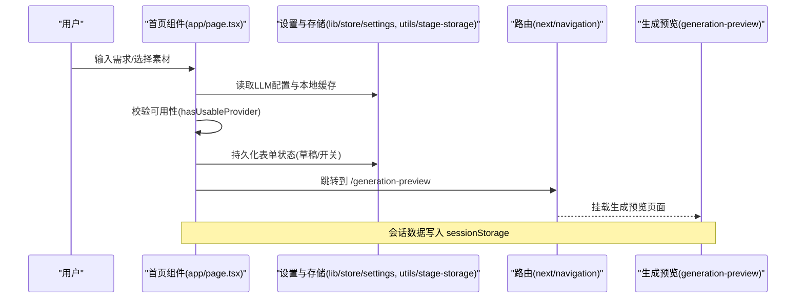
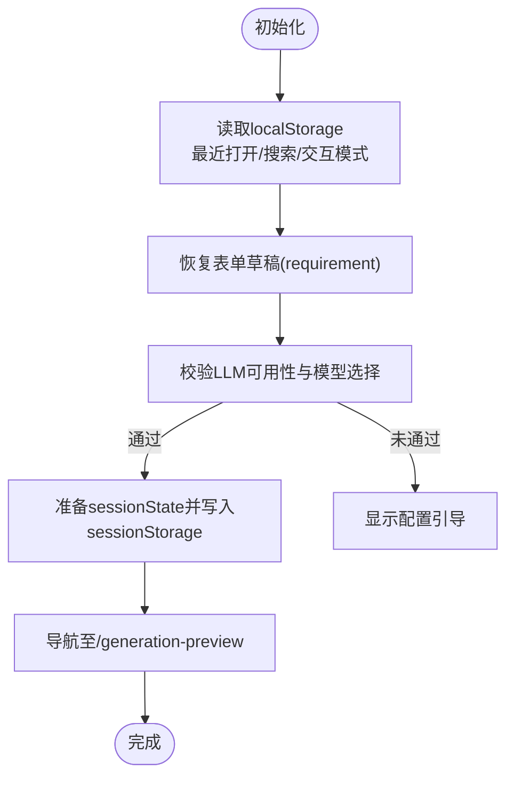
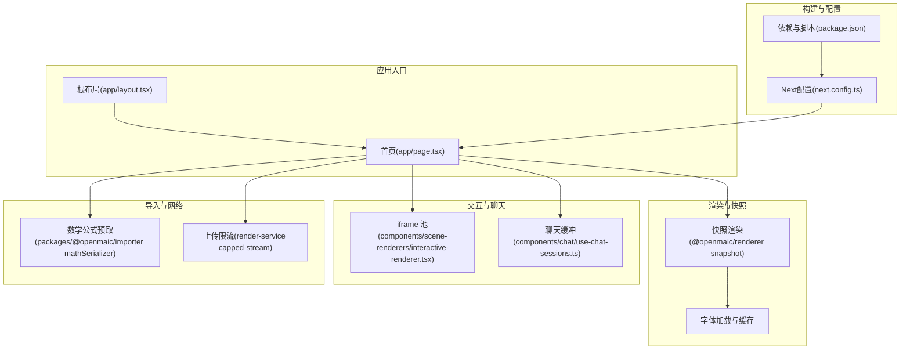
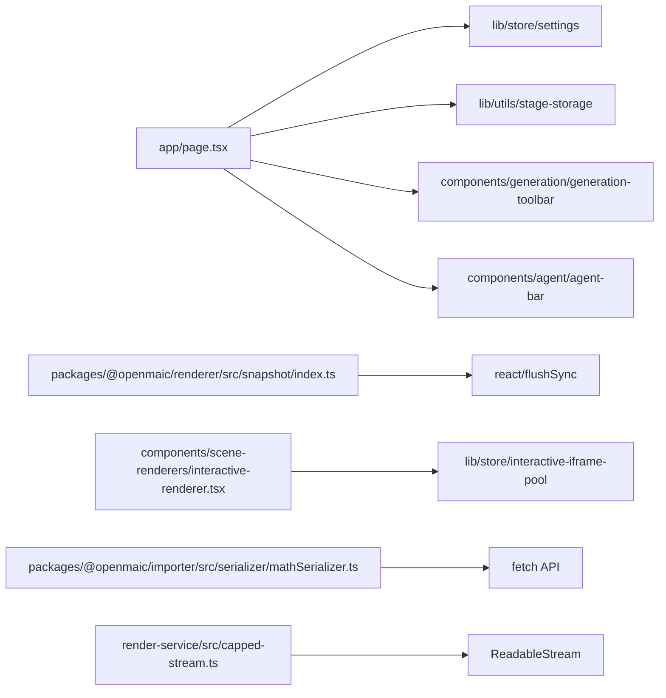

# 性能优化策略

<cite>
**本文引用的文件**   
- [next.config.ts](file://next.config.ts)
- [package.json](file://package.json)
- [app/layout.tsx](file://app/layout.tsx)
- [app/page.tsx](file://app/page.tsx)
- [lib/logger.ts](file://lib/logger.ts)
- [packages/@openmaic/renderer/src/snapshot/index.ts](file://packages/@openmaic/renderer/src/snapshot/index.ts)
- [components/scene-renderers/interactive-renderer.tsx](file://components/scene-renderers/interactive-renderer.tsx)
- [components/scene-renderers/pbl-renderer.tsx](file://components/scene-renderers/pbl-renderer.tsx)
- [components/chat/use-chat-sessions.ts](file://components/chat/use-chat-sessions.ts)
- [packages/@openmaic/importer/src/serializer/mathSerializer.ts](file://packages/@openmaic/importer/src/serializer/mathSerializer.ts)
- [render-service/src/capped-stream.ts](file://render-service/src/capped-stream.ts)
</cite>

## 产品概述
OpenMAIC 是 AI 驱动的交互式课件（MAIC）生成与课堂管理平台，面向教师与学生，支持自然语言生成结构化课件、课堂实时互动（问答/讨论/测验）、课件编辑与回放。前端基于 Next.js 16 + React 19 + Zustand 状态管理；AI 编排层使用 LangGraph + Vercel AI SDK；课件格式为自定义 DSL（@openmaic/dsl）。核心业务模块位于 lib/ 目录：orchestration（AI 编排）、generation（课件生成）、playback（课堂回放）、agent（智能体）、classroom（课堂管理）、edit（编辑器）、export（导出 PPTX/PDF）。

## 核心业务流程
- 首页输入需求与素材 → 校验可用 LLM 提供商 → 准备会话数据并跳转预览页 → 进入生成流程。
- 导入/上传课件或 PPTX → 解析与转换 → 渲染到场景 → 播放/编辑/导出。
- 交互场景通过 keep-alive iframe 池保持实例，避免重复加载。
- 数学公式批量预取与缓存，提升渲染稳定性与速度。
- 大文件上传限制与流式处理，防止内存溢出。

**图表来源** 
- [app/page.tsx:317-409](file://app/page.tsx#L317-L409)
- [app/page.tsx:129-161](file://app/page.tsx#L129-L161)

**章节来源**
- [app/page.tsx:317-409](file://app/page.tsx#L317-L409)
- [app/page.tsx:129-161](file://app/page.tsx#L129-L161)

## 功能模块清单
- Next.js 构建与部署配置
  - 子路径部署、standalone 输出、transpilePackages、serverExternalPackages、代理最大请求体、安全响应头。
- 字体与资源加载
  - 本地可变字体、Geist Sans/Mono、第三方字体 CSS、动画与 KaTeX 样式。
- 页面级首屏与交互
  - 客户端组件标记、延迟值(useDeferredValue)、本地存储恢复、搜索过滤、缩略图对象 URL 生命周期管理。
- 渲染与快照
  - 离屏渲染、flushSync 同步提交、字体强制加载、快照尺寸与背景色控制。
- 交互场景 Keep-Alive
  - iframe 池注册、可见性标记、矩形上报、卸载不销毁以零重载返回。
- 聊天与会话缓冲
  - StreamBuffer 创建/关闭、打字速率控制、活跃请求回收。
- 数学公式预取
  - 并发队列、服务端端点调用、失败回退 JS 管线。
- 上传大小限制
  - 字节计数流包装、超限中断、exceeded 探测。

**章节来源**
- [next.config.ts:1-40](file://next.config.ts#L1-L40)
- [app/layout.tsx:15-48](file://app/layout.tsx#L15-L48)
- [app/page.tsx:195-237](file://app/page.tsx#L195-L237)
- [packages/@openmaic/renderer/src/snapshot/index.ts:96-151](file://packages/@openmaic/renderer/src/snapshot/index.ts#L96-L151)
- [components/scene-renderers/interactive-renderer.tsx:1-36](file://components/scene-renderers/interactive-renderer.tsx#L1-L36)
- [components/chat/use-chat-sessions.ts:777-814](file://components/chat/use-chat-sessions.ts#L777-L814)
- [packages/@openmaic/importer/src/serializer/mathSerializer.ts:312-345](file://packages/@openmaic/importer/src/serializer/mathSerializer.ts#L312-L345)
- [render-service/src/capped-stream.ts:1-46](file://render-service/src/capped-stream.ts#L1-L46)

## 数据与状态
- 首屏表单状态
  - requirement、webSearch、interactiveMode、vocationalTestMode 等字段，结合 localStorage 与草稿缓存，避免 SSR 不匹配。
- 缩略图与媒体对象 URL
  - 使用 replaceThumbnails 替换引用并在超时后撤销旧 URL，避免跨课程污染与内存泄漏。
- 会话与运行时
  - generationSession 写入 sessionStorage；chat sessions 使用 StreamBuffer 管理，避免重复创建与回调泄露。
- 快照与字体
  - 离屏容器精确尺寸、强制 flushSync 提交、按需加载字体族，确保快照一致性。

**图表来源** 
- [app/page.tsx:129-161](file://app/page.tsx#L129-L161)
- [app/page.tsx:317-409](file://app/page.tsx#L317-L409)

**章节来源**
- [app/page.tsx:129-161](file://app/page.tsx#L129-L161)
- [app/page.tsx:195-237](file://app/page.tsx#L195-L237)
- [components/chat/use-chat-sessions.ts:777-814](file://components/chat/use-chat-sessions.ts#L777-L814)
- [packages/@openmaic/renderer/src/snapshot/index.ts:96-151](file://packages/@openmaic/renderer/src/snapshot/index.ts#L96-L151)

## 关键约束与边界
- 构建与运行环境
  - Node >= 20.9.0；Next.js 16.1.2；React 19.2.3；依赖包版本锁定。
- 代理与上传限制
  - 代理最大请求体 200MB；服务侧流式上限保护，超限即中断。
- 安全头
  - X-Frame-Options、CSP frame-ancestors、X-Content-Type-Options、Referrer-Policy、Permissions-Policy、HSTS（生产）。
- 字体与渲染
  - 混合 CJK+Latin 文本需显式加载字体族，避免快照错位；离屏渲染需等待 ResizeObserver 帧稳定。
- 交互场景
  - iframe 池按 sceneId 稳定键，卸载仅隐藏不销毁，保证切换零重载。

**章节来源**
- [package.json:1-177](file://package.json#L1-L177)
- [next.config.ts:1-40](file://next.config.ts#L1-L40)
- [render-service/src/capped-stream.ts:1-46](file://render-service/src/capped-stream.ts#L1-L46)
- [packages/@openmaic/renderer/src/snapshot/index.ts:96-151](file://packages/@openmaic/renderer/src/snapshot/index.ts#L96-L151)
- [components/scene-renderers/interactive-renderer.tsx:1-36](file://components/scene-renderers/interactive-renderer.tsx#L1-L36)

## 架构总览

**图表来源** 
- [app/layout.tsx:1-48](file://app/layout.tsx#L1-L48)
- [app/page.tsx:1-800](file://app/page.tsx#L1-L800)
- [next.config.ts:1-40](file://next.config.ts#L1-L40)
- [package.json:1-177](file://package.json#L1-L177)
- [packages/@openmaic/renderer/src/snapshot/index.ts:96-151](file://packages/@openmaic/renderer/src/snapshot/index.ts#L96-L151)
- [components/scene-renderers/interactive-renderer.tsx:1-36](file://components/scene-renderers/interactive-renderer.tsx#L1-L36)
- [components/chat/use-chat-sessions.ts:777-814](file://components/chat/use-chat-sessions.ts#L777-L814)
- [packages/@openmaic/importer/src/serializer/mathSerializer.ts:312-345](file://packages/@openmaic/importer/src/serializer/mathSerializer.ts#L312-L345)
- [render-service/src/capped-stream.ts:1-46](file://render-service/src/capped-stream.ts#L1-L46)

## 详细组件分析

### Next.js 构建与部署优化
- 子路径部署：通过 basePath 适配反向代理前缀。
- Standalone 输出：在非 Vercel 环境启用 standalone，减小运行时体积。
- transpilePackages：对 monorepo 内部包进行转译，避免 node_modules 兼容问题。
- serverExternalPackages：将特定包外置，减少客户端打包体积。
- 代理最大请求体：proxyClientMaxBodySize=200mb，支撑大文件导入。
- 安全响应头：CSP frame-ancestors、X-Content-Type-Options、Referrer-Policy、Permissions-Policy、HSTS（生产）。

**章节来源**
- [next.config.ts:1-40](file://next.config.ts#L1-L40)

### 字体与资源加载策略
- 本地可变字体 Inter 通过 localFont 注入变量，减少 FOUC。
- Geist Sans/Mono 作为全局字体变量，配合 Tailwind 主题。
- 第三方样式 animate.css、katex.min.css 按需引入。
- 快照阶段强制加载实际使用的字体族，避免混排宽度差异导致的错位。

**章节来源**
- [app/layout.tsx:15-48](file://app/layout.tsx#L15-L48)
- [packages/@openmaic/renderer/src/snapshot/index.ts:132-151](file://packages/@openmaic/renderer/src/snapshot/index.ts#L132-L151)

### 首屏与交互性能
- 客户端组件：'use client' 明确边界，利于代码分割。
- useDeferredValue：搜索查询延迟更新，降低高频输入导致的重渲染。
- localStorage 恢复：避免 SSR 不匹配，提升首屏一致性。
- 缩略图对象 URL：replaceThumbnails 替换引用并在超时后撤销，避免内存泄漏。

**章节来源**
- [app/page.tsx:1-800](file://app/page.tsx#L1-L800)
- [app/page.tsx:195-237](file://app/page.tsx#L195-L237)

### 渲染与快照优化
- 离屏容器：绝对定位、远左偏移，避免固定定位导致跳过绘制。
- flushSync：强制同步提交，确保快照捕获完整内容。
- 字体加载：document.fonts.load 显式加载，Promise.race 超时保护。
- 背景色与尺寸：精确设置 width/height/background-color，保证 1:1 渲染。

**章节来源**
- [packages/@openmaic/renderer/src/snapshot/index.ts:96-151](file://packages/@openmaic/renderer/src/snapshot/index.ts#L96-L151)

### 交互场景 Keep-Alive
- iframe 池：按 sceneId 稳定键，mount/setRect/claim/release/setActive 管理生命周期。
- 卸载不销毁：仅隐藏 iframe，保留文档，实现零重载切换。
- HTML 补丁：patchHtmlForIframe 预处理内联资源，提升兼容性。

**章节来源**
- [components/scene-renderers/interactive-renderer.tsx:1-36](file://components/scene-renderers/interactive-renderer.tsx#L1-L36)

### 聊天与会话缓冲
- StreamBuffer：为每个会话创建独立缓冲，避免重复创建与回调泄露。
- 打字速率控制：pacedStep/pacedDelay 控制流式文本展示节奏。
- 活跃请求回收：retireActiveLiveRequest 清理过期请求，释放内存。

**章节来源**
- [components/chat/use-chat-sessions.ts:777-814](file://components/chat/use-chat-sessions.ts#L777-L814)

### 数学公式预取与缓存
- 并发队列：CONCURRENCY=8，限制并行请求数。
- 服务端端点：POST /api/texmath，失败回退 JS 管线。
- 去重与缓存：Set 去重，Map 缓存结果，避免重复请求。

**章节来源**
- [packages/@openmaic/importer/src/serializer/mathSerializer.ts:312-345](file://packages/@openmaic/importer/src/serializer/mathSerializer.ts#L312-L345)

### 上传大小限制与流式处理
- 字节计数流：ReadableStream 包装，累计 byteLength，超限立即中断。
- exceeded 探测：调用方可区分超限与一般错误。
- 取消与清理：reader.cancel() 确保资源释放。

**章节来源**
- [render-service/src/capped-stream.ts:1-46](file://render-service/src/capped-stream.ts#L1-L46)

## 依赖分析

**图表来源** 
- [app/page.tsx:1-800](file://app/page.tsx#L1-L800)
- [packages/@openmaic/renderer/src/snapshot/index.ts:96-151](file://packages/@openmaic/renderer/src/snapshot/index.ts#L96-L151)
- [components/scene-renderers/interactive-renderer.tsx:1-36](file://components/scene-renderers/interactive-renderer.tsx#L1-L36)
- [packages/@openmaic/importer/src/serializer/mathSerializer.ts:312-345](file://packages/@openmaic/importer/src/serializer/mathSerializer.ts#L312-L345)
- [render-service/src/capped-stream.ts:1-46](file://render-service/src/capped-stream.ts#L1-L46)

**章节来源**
- [app/page.tsx:1-800](file://app/page.tsx#L1-L800)
- [packages/@openmaic/renderer/src/snapshot/index.ts:96-151](file://packages/@openmaic/renderer/src/snapshot/index.ts#L96-L151)
- [components/scene-renderers/interactive-renderer.tsx:1-36](file://components/scene-renderers/interactive-renderer.tsx#L1-L36)
- [packages/@openmaic/importer/src/serializer/mathSerializer.ts:312-345](file://packages/@openmaic/importer/src/serializer/mathSerializer.ts#L312-L345)
- [render-service/src/capped-stream.ts:1-46](file://render-service/src/capped-stream.ts#L1-L46)

## 性能考虑
- 代码分割与懒加载
  - 使用 'use client' 明确客户端边界，Next.js 自动按路由与动态导入分割。
  - 建议对重型组件（如编辑器、白板、PBL 渲染器）采用动态 import() 与 Suspense 包裹。
- 预取策略
  - 数学公式批量预取，减少首次渲染卡顿。
  - 图片与字体可结合 next/image 与 font-display: swap（当前已用 localFont 与 CSS 引入）。
- 内存管理
  - 及时撤销对象 URL（URL.revokeObjectURL），避免缩略图泄漏。
  - StreamBuffer 的 shutdown/dispose 模式，避免回调悬挂。
- Bundle 大小优化
  - transpilePackages 仅转译必要包；serverExternalPackages 将大依赖外置。
  - 移除未使用依赖，拆分 UI 库按需引入。
- 运行时监控
  - 日志系统 createLogger 支持 JSON 格式与级别过滤，便于生产追踪。
  - 建议接入 Web Vitals（FCP/LCP/CLS/TTFB）与自定义指标（如快照耗时、iframe 池大小）。

**章节来源**
- [lib/logger.ts:1-53](file://lib/logger.ts#L1-L53)
- [app/page.tsx:195-237](file://app/page.tsx#L195-L237)
- [components/chat/use-chat-sessions.ts:777-814](file://components/chat/use-chat-sessions.ts#L777-L814)
- [packages/@openmaic/importer/src/serializer/mathSerializer.ts:312-345](file://packages/@openmaic/importer/src/serializer/mathSerializer.ts#L312-L345)

## 故障排查指南
- 首屏闪烁或字体错位
  - 检查 localFont 变量注入与快照阶段的 document.fonts.load 是否生效。
  - 确认离屏容器尺寸与背景色设置正确。
- 内存泄漏
  - 核查缩略图对象 URL 是否在超时后撤销；StreamBuffer 是否正确 shutdown。
- 上传失败或卡住
  - 检查 render-service capped-stream 的 exceeded 标志与 reader.cancel 调用。
- 聊天卡顿或重复渲染
  - 确认 pacedStep/pacedDelay 参数合理；检查活跃请求回收逻辑。
- 日志定位
  - 使用 createLogger 的 tag 与 level 过滤，生产环境开启 JSON 格式便于聚合。

**章节来源**
- [packages/@openmaic/renderer/src/snapshot/index.ts:96-151](file://packages/@openmaic/renderer/src/snapshot/index.ts#L96-L151)
- [app/page.tsx:195-237](file://app/page.tsx#L195-L237)
- [render-service/src/capped-stream.ts:1-46](file://render-service/src/capped-stream.ts#L1-L46)
- [components/chat/use-chat-sessions.ts:777-814](file://components/chat/use-chat-sessions.ts#L777-L814)
- [lib/logger.ts:1-53](file://lib/logger.ts#L1-L53)

## 结论
本方案围绕 Next.js 构建优化、React 19 并发特性、内存管理与 Bundle 瘦身展开，结合图片/字体/网络请求的具体实践，形成完整的性能优化闭环。通过日志与监控工具持续度量，可在复杂交互与多媒体场景中保持稳定流畅的用户体验。