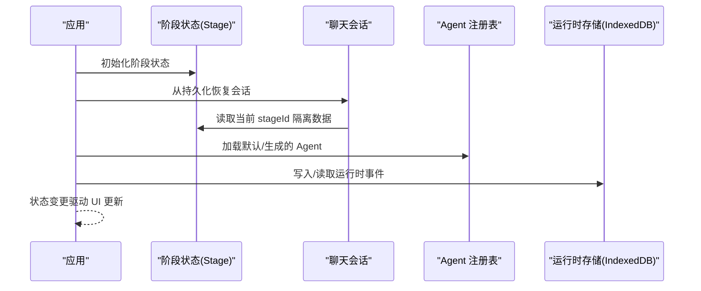

# 全局状态管理

<cite>
**本文引用的文件**   
- [lib/orchestration/registry/store.ts](file://lib/orchestration/registry/store.ts)
- [lib/runtime/store.ts](file://lib/runtime/store.ts)
- [configs/storage.ts](file://configs/storage.ts)
- [packages/@openmaic/dsl/src/storage.ts](file://packages/@openmaic/dsl/src/storage.ts)
- [components/chat/use-chat-sessions.ts](file://components/chat/use-chat-sessions.ts)
- [lib/orchestration/registry/agent-selection.ts](file://lib/orchestration/registry/agent-selection.ts)
- [lib/store/canvas.ts](file://lib/store/canvas.ts)
</cite>

## 产品概述
OpenMAIC 是一个 AI 驱动的交互式课件（MAIC）生成与课堂管理平台，核心用户场景包括：通过自然语言生成结构化课件、课堂实时互动（问答/讨论/测验）、课件编辑与回放。前端基于 Next.js + React + Zustand 状态管理；AI 编排层使用 LangGraph + Vercel AI SDK；课件格式为自定义 DSL。全局状态以 Zustand 为核心，结合 IndexedDB 实现跨会话持久化，并通过“运行时存储”统一承载 PBL、聊天、测验等运行时数据。

## 核心业务流程
- 应用启动时初始化各 Store 实例，按需加载持久化数据（如 Agent 注册表、聊天会话）。
- 用户在编辑器或课堂场景中触发状态变更，Zustand Store 更新并驱动 UI 重渲染。
- 关键数据（Agent 配置、运行时事件）通过 IndexedDB 持久化，保证刷新后恢复。
- 删除阶段（Stage）时，级联清理主数据库与运行时数据库中的相关数据，确保一致性。

**图表来源** 
- [lib/orchestration/registry/store.ts:207-264](file://lib/orchestration/registry/store.ts#L207-L264)
- [components/chat/use-chat-sessions.ts:454-470](file://components/chat/use-chat-sessions.ts#L454-L470)
- [lib/runtime/store.ts:38-42](file://lib/runtime/store.ts#L38-L42)

**章节来源**
- [lib/orchestration/registry/store.ts:207-264](file://lib/orchestration/registry/store.ts#L207-L264)
- [components/chat/use-chat-sessions.ts:454-470](file://components/chat/use-chat-sessions.ts#L454-L470)
- [lib/runtime/store.ts:38-42](file://lib/runtime/store.ts#L38-L42)

## 功能模块清单
- 阶段状态（stage）：管理当前阶段、场景、导航等，作为多模块的数据隔离键（如 stageId）。
- 设置状态（settings）：用户偏好、模型配置、TTS/ASR 设置等，通常持久化到 localStorage。
- Agent 状态（agent）：Agent 注册表、选择策略、角色映射、语音配置等，支持持久化与版本迁移。
- 画布状态（canvas）：编辑器画布交互、元素选择、工具栏状态等，用于课件编辑。
- 运行时存储（runtime store）：统一的 IndexedDB 抽象，承载 PBL、聊天、测验等运行时数据。

**章节来源**
- [lib/orchestration/registry/store.ts:17-26](file://lib/orchestration/registry/store.ts#L17-L26)
- [lib/store/canvas.ts:191-254](file://lib/store/canvas.ts#L191-L254)
- [lib/runtime/store.ts:1-10](file://lib/runtime/store.ts#L1-L10)

## 数据与状态
### 状态切片组织与职责
- stage：作为全局上下文键，用于数据隔离（如聊天会话按 stageId 区分）。
- settings：集中管理用户配置，支持热更新与持久化。
- agent：维护 Agent 配置、选择逻辑、语音设计，支持 IndexedDB 持久化与版本迁移。
- canvas：编辑器画布状态，包含元素操作、视图缩放、工具栏等。

### 状态初始化与订阅机制
- Zustand Store 通过 create() 创建，支持中间件（如 persist）实现自动持久化。
- 组件通过 useStore(selector) 订阅特定状态片段，避免全量重渲染。
- 异步初始化（如加载 Agent、恢复会话）在 Store 内部处理，对外暴露同步 API。

### 性能优化策略
- 细粒度选择器：仅订阅所需字段，减少不必要的重渲染。
- 批量更新：合并多次状态变更为一次 set() 调用。
- 懒加载：运行时存储按需打开 IndexedDB，避免启动阻塞。
- 内存缓存：Agent 注册表缓存已加载的 Agent，避免重复 IO。

### 状态持久化方案
- Agent 注册表：使用 zustand/middleware/persist 将 agents 映射持久化到 localStorage，支持版本迁移与合并策略。
- 运行时存储：通过 @openmaic/storage 的 BrowserRuntimeStore 封装 IndexedDB，提供统一的 CRUD 接口。
- DSL 资产存储：通过 StorageProvider 接口抽象，支持浏览器 IndexedDB + object URL 或服务器端对象存储。

### 数据同步机制
- 本地优先：状态变更先更新内存 Store，再异步持久化。
- 冲突解决：Agent 选择策略根据用户显式选择与阶段默认值动态计算。
- 级联清理：删除 Stage 时，同时清理主数据库与运行时数据库中的相关数据。

**章节来源**
- [lib/orchestration/registry/store.ts:207-264](file://lib/orchestration/registry/store.ts#L207-L264)
- [lib/runtime/store.ts:32-42](file://lib/runtime/store.ts#L32-L42)
- [packages/@openmaic/dsl/src/storage.ts:54-61](file://packages/@openmaic/dsl/src/storage.ts#L54-L61)
- [lib/orchestration/registry/agent-selection.ts:27-58](file://lib/orchestration/registry/agent-selection.ts#L27-L58)

## 关键约束与边界
- 客户端限制：运行时存储仅在客户端使用，服务端需注入自定义实现。
- 并发安全：IndexedDB 操作可能超时或失败，需提供降级与重试机制。
- 数据一致性：删除 Stage 时需确保主数据库与运行时数据库的一致性。
- 版本兼容：持久化数据需支持版本迁移，避免旧数据导致崩溃。
- 性能边界：大文件（图片/音频/视频）不直接存储在 DSL 文档中，通过 AssetRef 引用。

**章节来源**
- [lib/runtime/store.ts:7-9](file://lib/runtime/store.ts#L7-L9)
- [lib/runtime/store.ts:86-126](file://lib/runtime/store.ts#L86-L126)
- [packages/@openmaic/dsl/src/storage.ts:1-16](file://packages/@openmaic/dsl/src/storage.ts#L1-L16)
- [configs/storage.ts:1-2](file://configs/storage.ts#L1-L2)