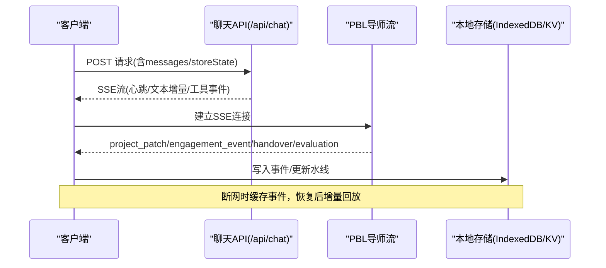
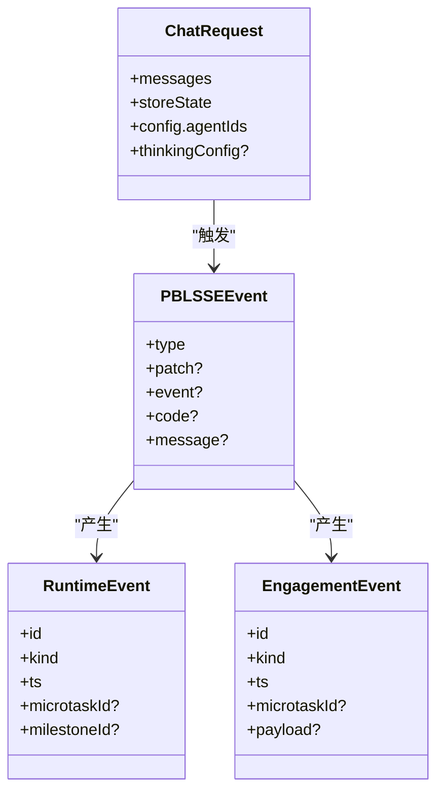
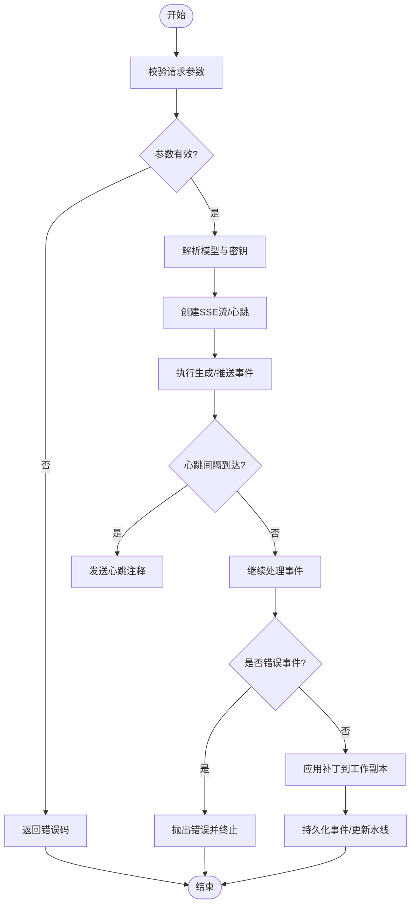

# 服务端状态同步

<cite>
**本文引用的文件**   
- [app/api/chat/route.ts](file://app/api/chat/route.ts)
- [components/scene-renderers/pbl/v2/use-instructor-stream.ts](file://components/scene-renderers/pbl/v2/use-instructor-stream.ts)
- [components/scene-renderers/pbl/v2/apply-instructor-event.ts](file://components/scene-renderers/pbl/v2/apply-instructor-event.ts)
- [lib/pdf/mineru-cloud.ts](file://lib/pdf/mineru-cloud.ts)
- [app/api/export-video/render/[jobId]/download/route.ts](file://app/api/export-video/render/[jobId]/download/route.ts)
- [lib/fetch-base-path.ts](file://lib/fetch-base-path.ts)
- [components/chat/use-chat-sessions.ts](file://components/chat/use-chat-sessions.ts)
- [tests/pbl/v2/drain.test.ts](file://tests/pbl/v2/drain.test.ts)
- [packages/@openmaic/storage/src/runtime/browser.ts](file://packages/@openmaic/storage/src/runtime/browser.ts)
</cite>

## 产品概述
OpenMAIC 是 AI 驱动的交互式课件（MAIC）生成与课堂管理平台，核心场景包括自然语言生成结构化课件、课堂实时互动（问答/讨论/测验）、课件编辑与回放。服务端通过无状态 API + SSE 流式传输实现客户端与服务端的数据同步；在离线与网络异常场景下，结合本地持久化与增量事件回放保证一致性。

## 核心业务流程
- 聊天与生成：客户端发送完整状态（消息+storeState），服务端以无状态方式执行单轮生成，并通过 SSE 返回文本增量与工具调用事件。
- 课堂交互（PBL v2）：服务端推送 project_patch、engagement_event、handover、evaluation 等事件，客户端按序应用并更新 UI。
- 资源下载与导出：对上游服务进行代理转发、重定向处理与错误归一化，确保稳定可观测。
- 离线与恢复：客户端维护本地会话与事件水线，断网后继续追加未落盘事件，恢复时仅拉取增量。

**图表来源** 
- [app/api/chat/route.ts:1-130](file://app/api/chat/route.ts#L1-L130)
- [components/scene-renderers/pbl/v2/use-instructor-stream.ts:323-361](file://components/scene-renderers/pbl/v2/use-instructor-stream.ts#L323-L361)
- [packages/@openmaic/storage/src/runtime/browser.ts:270-303](file://packages/@openmaic/storage/src/runtime/browser.ts#L270-L303)

**章节来源**
- [app/api/chat/route.ts:1-130](file://app/api/chat/route.ts#L1-L130)
- [components/scene-renderers/pbl/v2/use-instructor-stream.ts:323-361](file://components/scene-renderers/pbl/v2/use-instructor-stream.ts#L323-L361)

## 功能模块清单
- 聊天与生成接口
  - 职责：接收完整上下文，执行无状态生成，返回SSE流；支持心跳保活与中断传播。
  - 验收要点：最大时长配置、心跳间隔、错误码统一、信号中断响应。
- PBL 导师流（SSE）
  - 职责：推送项目补丁、参与事件、交接与评估；客户端解析并应用。
  - 验收要点：帧解析健壮性、错误事件抛出、草稿清理与去重。
- 资源代理与下载
  - 职责：代理上游下载、处理重定向、限制大小、超时控制与错误归一化。
  - 验收要点：SSRF校验、跳转次数限制、Content-Length上限、错误码映射。
- 子路径部署拦截器
  - 职责：在客户端全局拦截 /api/ 请求，自动补上 basePath 前缀。
  - 验收要点：仅改写同origin根相对字符串请求，不影响绝对URL与Request对象。
- 聊天会话与流缓冲
  - 职责：管理多会话的SSE缓冲、取消与回收、软关闭生命周期。
  - 验收要点：并发安全、资源释放、重复请求抑制。
- 离线事件排水与回放
  - 职责：将运行时与参与事件按时间顺序写入持久化，记录水线，失败重试与幂等。
  - 验收要点：全局时序、幂等追加、超时恢复、锁与并发控制。

**章节来源**
- [app/api/chat/route.ts:1-130](file://app/api/chat/route.ts#L1-L130)
- [components/scene-renderers/pbl/v2/use-instructor-stream.ts:323-361](file://components/scene-renderers/pbl/v2/use-instructor-stream.ts#L323-L361)
- [app/api/export-video/render/[jobId]/download/route.ts:29-66](file://app/api/export-video/render/[jobId]/download/route.ts#L29-L66)
- [lib/fetch-base-path.ts:1-35](file://lib/fetch-base-path.ts#L1-L35)
- [components/chat/use-chat-sessions.ts:529-564](file://components/chat/use-chat-sessions.ts#L529-L564)
- [tests/pbl/v2/drain.test.ts:729-880](file://tests/pbl/v2/drain.test.ts#L729-L880)

## 数据与状态
- 核心模型
  - 聊天请求：包含 messages、storeState、config.agentIds、可选 thinkingConfig 等。
  - SSE事件：project_patch、engagement_event、handover、evaluation、error 等。
  - 运行时事件与参与事件：按 ts 排序写入，记录 lastRuntimeEventId/lastEngagementEventId 水线。
- 状态流转
  - 客户端维护 workingProject 克隆，逐事件应用；草稿消息在提交后清空避免重复显示。
  - 本地存储使用 IndexedDB/KV 持久化会话与事件，支持迁移与版本兼容。
- 数据所有权边界
  - 服务端为权威源，客户端为视图层与离线缓冲；冲突通过“服务端补丁优先”解决。

**图表来源** 
- [app/api/chat/route.ts:1-130](file://app/api/chat/route.ts#L1-L130)
- [components/scene-renderers/pbl/v2/use-instructor-stream.ts:323-361](file://components/scene-renderers/pbl/v2/use-instructor-stream.ts#L323-L361)
- [components/scene-renderers/pbl/v2/apply-instructor-event.ts:1-34](file://components/scene-renderers/pbl/v2/apply-instructor-event.ts#L1-L34)

**章节来源**
- [components/scene-renderers/pbl/v2/apply-instructor-event.ts:1-34](file://components/scene-renderers/pbl/v2/apply-instructor-event.ts#L1-L34)
- [packages/@openmaic/storage/src/runtime/browser.ts:270-303](file://packages/@openmaic/storage/src/runtime/browser.ts#L270-L303)

## 关键约束与边界
- 实时同步机制
  - SSE 流式传输：服务端定时发送心跳注释防止中间件/浏览器超时；客户端按行缓冲解析帧，遇到 error 类型立即抛出。
  - WebSocket：当前代码库未见显式 WS 实现，主要依赖 SSE 与 fetch 流。
  - 增量更新：基于事件 ID 与水线的增量回放，避免重复与乱序。
- 离线与冲突解决
  - 离线：客户端缓存待写事件，恢复后按时间戳合并回放；失败不抛错，记录警告并继续。
  - 冲突：服务端补丁优先，客户端仅做视图态与草稿管理；重置 epoch 后丢弃旧事件。
- 数据一致性策略
  - 乐观更新：前端先渲染草稿/增量，提交后由服务端补丁覆盖。
  - 悲观更新：下载与导出等强一致操作采用服务端校验与错误归一化。
  - 回滚：不支持跨进程回滚；通过幂等追加与水印恢复达到最终一致。
- 网络异常与超时控制
  - 重试：针对可重试错误（如网络断开、超时）指数退避；不可重试直接失败。
  - 超时：头部获取超时、轮询总超时、SSE 心跳间隔；长任务设置 maxDuration。
  - 连接池：Node.js 原生 fetch 复用 TCP；客户端通过 AbortController 取消请求。
- 最佳实践
  - 子路径部署：全局拦截 /api/ 请求并补前缀，避免路由错位。
  - 资源代理：SSRF 校验、跳转次数限制、Content-Length 上限、错误码映射。
  - 流式消费：Reader 读取完成后务必 cancel，避免资源泄漏。

**图表来源** 
- [app/api/chat/route.ts:1-130](file://app/api/chat/route.ts#L1-L130)
- [components/scene-renderers/pbl/v2/use-instructor-stream.ts:323-361](file://components/scene-renderers/pbl/v2/use-instructor-stream.ts#L323-L361)
- [lib/pdf/mineru-cloud.ts:45-79](file://lib/pdf/mineru-cloud.ts#L45-L79)

**章节来源**
- [lib/pdf/mineru-cloud.ts:45-79](file://lib/pdf/mineru-cloud.ts#L45-L79)
- [app/api/export-video/render/[jobId]/download/route.ts:29-66](file://app/api/export-video/render/[jobId]/download/route.ts#L29-L66)
- [lib/fetch-base-path.ts:1-35](file://lib/fetch-base-path.ts#L1-L35)
- [components/chat/use-chat-sessions.ts:529-564](file://components/chat/use-chat-sessions.ts#L529-L564)
- [tests/pbl/v2/drain.test.ts:729-880](file://tests/pbl/v2/drain.test.ts#L729-L880)